# AI Agent

[TOC]

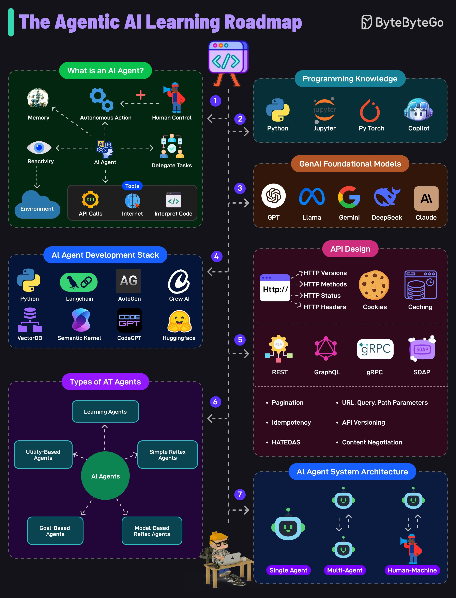

An AI agent is a software program that can interact with its environment, gather data, and use that data to achieve predetermined goals. AI agents can choose the best actions to perform to meet those goals.

## Intro

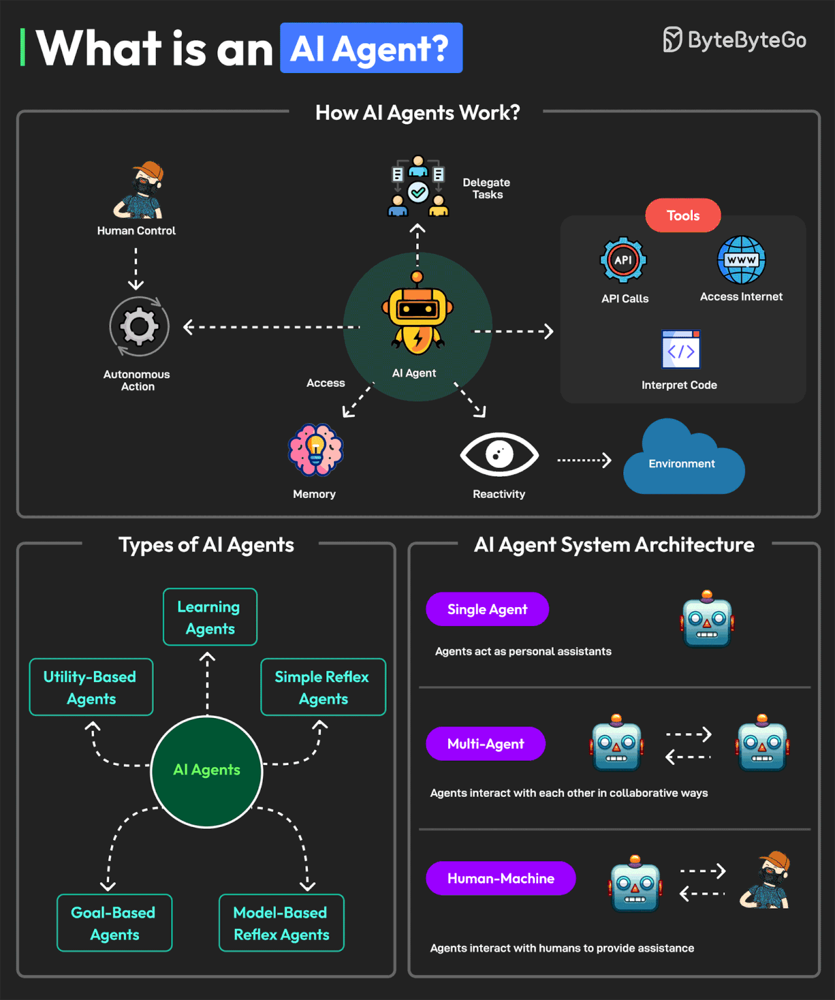

An agent can perform autonomous actions without constant human intervention. Also, they can have a human in the loop to maintain control.

Four key characteristics define what makes something an AI agent:

- First is autonomy, or the ability to operate without constant human intervention and make decisions independently.
- Second is reactivity or responding appropriately to changes in the environment and new information.
- Third is proactiveness, which is about taking initiative to achieve goals rather than just reacting to immediate stimuli.
- Fourth is social ability, or the capacity to interact with other agents or humans through some form of communication.

### Concepts

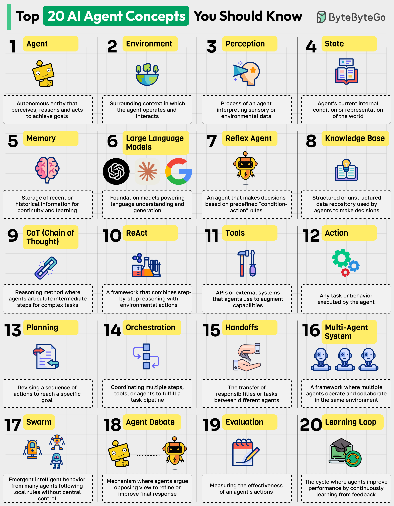

## Types

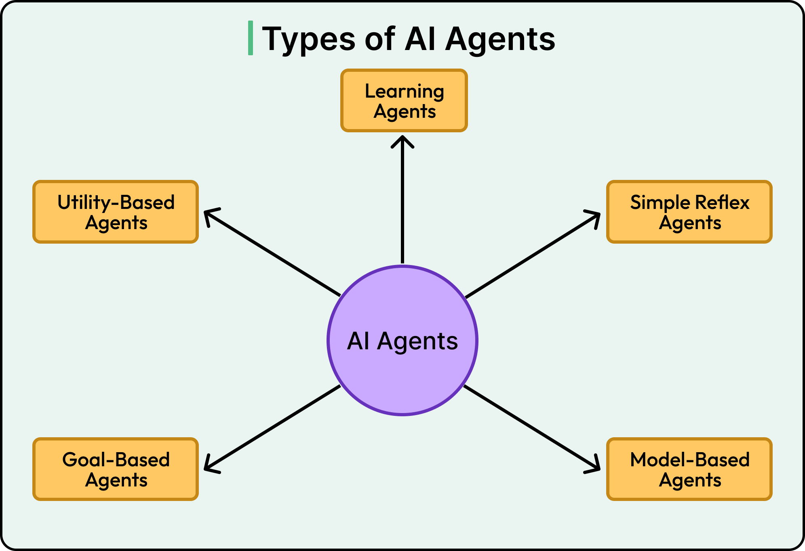

### Simple Reflex Agents

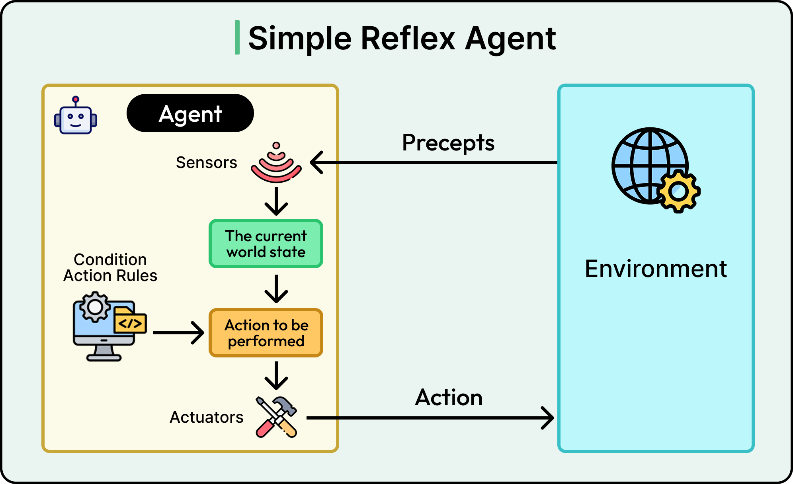

Simple reflex agents are the most basic type, operating on straightforward condition-action rules. These agents perceive the current state of their environment and respond with predetermined actions based on pattern matching.

### Model-Based Agents

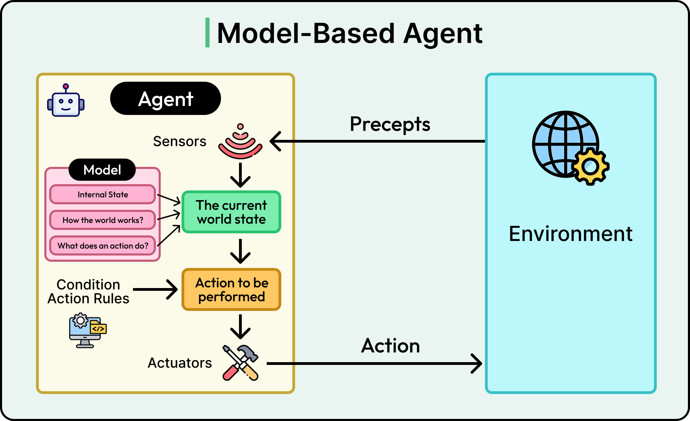

Model-based agents represent a significant step up in sophistication because they maintain an internal representation of the world that they cannot directly perceive. This internal model helps them make better decisions even when they lack complete information about their environment.

### Goal-Based Agents

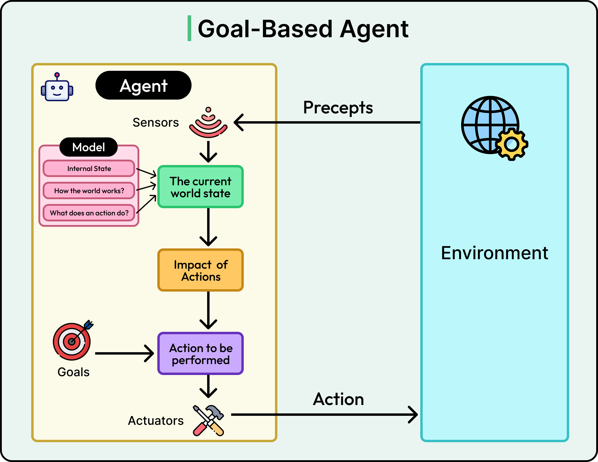

Goal-based agents take things further by explicitly working toward specific objectives rather than simply reacting to current conditions.

These agents evaluate different possible actions by considering whether those actions help achieve their goals. They can look ahead, anticipate consequences, and choose behaviors that lead to goal satisfaction even if the path isn’t immediately obvious.

### Utility-Based Agents

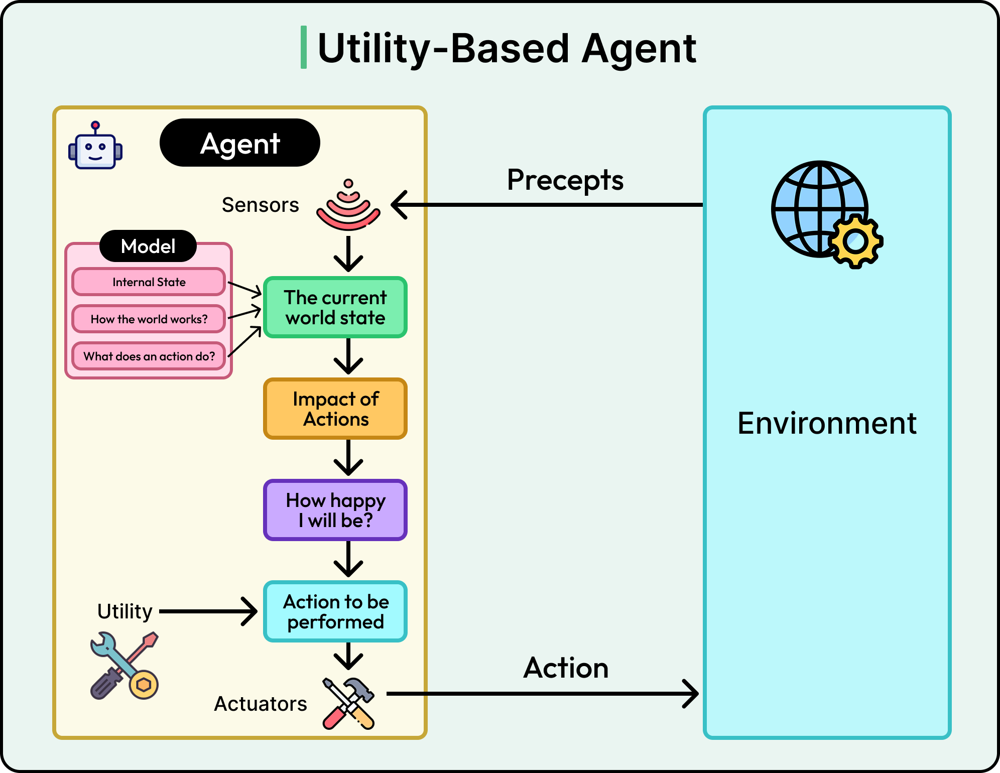

While goal-based agents treat objectives as binary (achieved or not achieved), utility-based agents work with a more nuanced measure of success. These agents use a utility function that quantifies how desirable different outcomes are, allowing them to make decisions that optimize overall satisfaction rather than just checking boxes. This becomes essential when dealing with trade-offs or competing priorities.

### Learning Agents

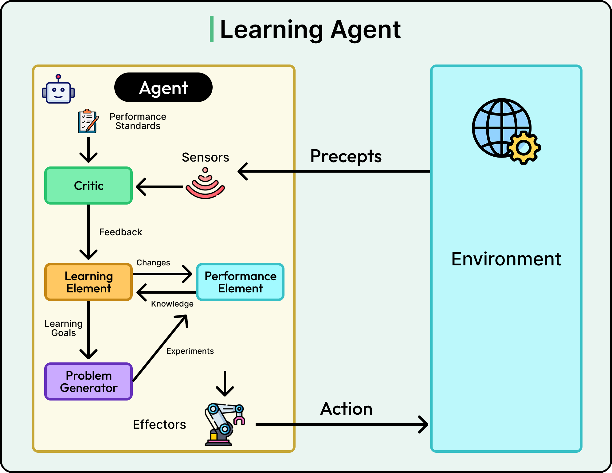

Learning agents represent the most advanced category because they improve their performance over time through experience.

### Multi-Agent Systems (MAS)

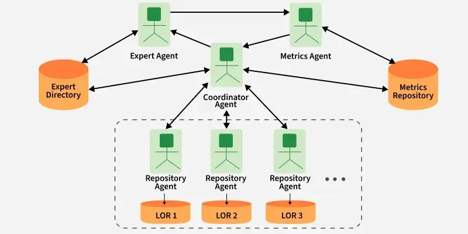

Multi-agent systems consist of multiple autonomous agents that interact within a shared environment, where they may cooperate, compete, or do both depending on the situation.

### Hierarchical Agents

Hierarchical agents organize decision-making in layers, where higher levels focus on planning and lower levels handle execution. This structure helps manage complex tasks by separating strategy from operational details.

## Workflow

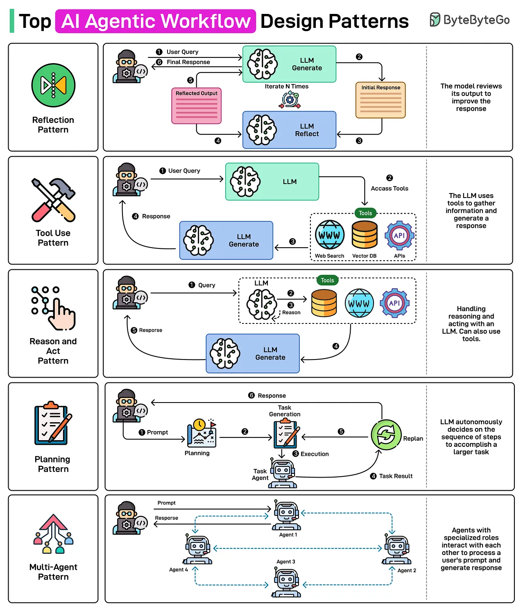

What makes workflows truly agentic are the iteration and feedback loops built into the process. Instead of generating output in a single pass, agentic workflows involve cycles where the agent takes an action, observes the result, and uses that observation to inform the next action.

### Reflection Pattern

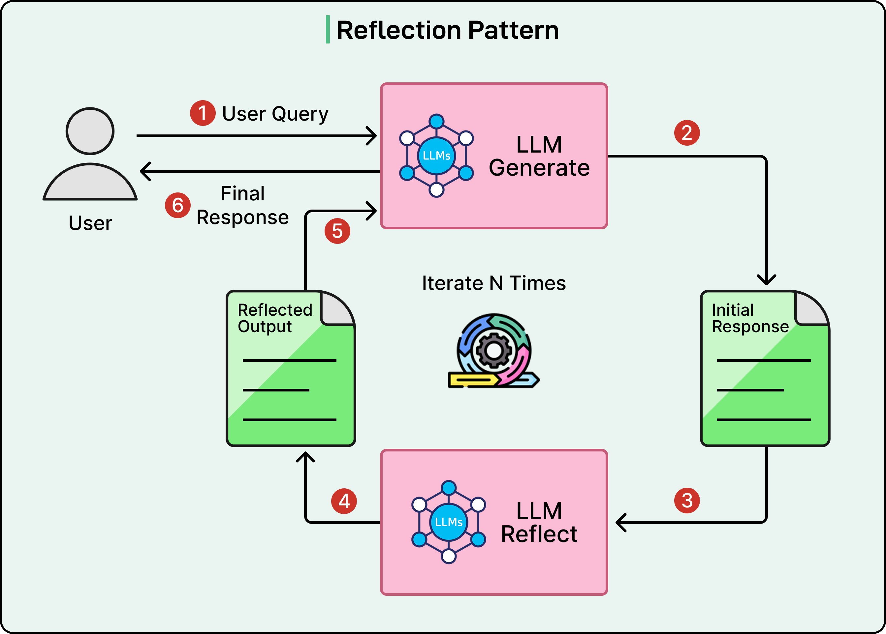

Reflection is about having an agent review and critique their own work, then revise based on that critique. This simple idea improves output quality because it introduces an iterative refinement process that catches errors, identifies weaknesses, and enhances strengths.

Here’s how the reflection cycle works in practice.

- The agent first generates an initial output based on the task or prompt it receives.
- Then, instead of immediately presenting this output as final, the agent switches into critique mode. It examines what it just produced, looking for problems, inconsistencies, areas that lack clarity, or opportunities for improvement. This critique becomes the basis for revision.
- The agent generates an improved version that addresses the issues it identified. Depending on the implementation, this cycle might repeat multiple times, with each iteration refining the output further.

### Tool Use Pattern

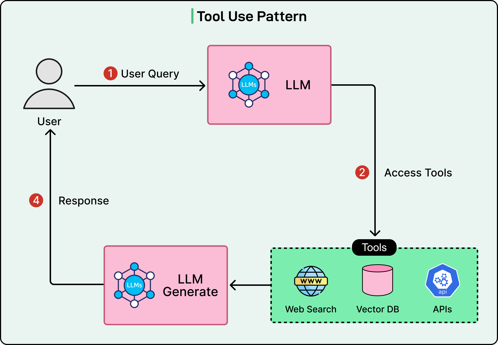

In the tool use pattern, agents are equipped with a set of capabilities they can invoke when needed. The critical distinction from traditional software is that the agent itself decides when and how to use these tools based on the task at hand.

When an agent receives a task, it analyzes what capabilities are needed to accomplish that task.

### Reason and Act Pattern (ReAct)

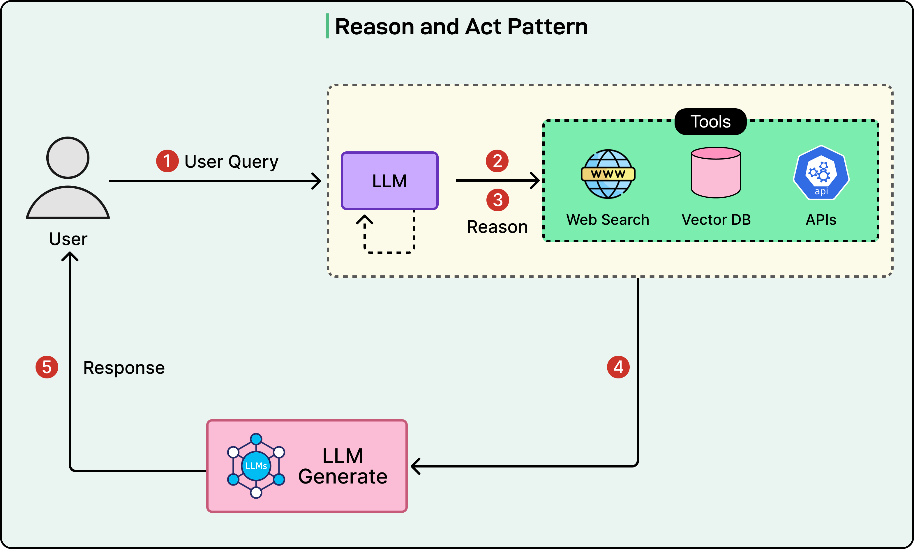

The Reason and Act pattern, commonly known as ReAct, represents a sophisticated approach to problem-solving that combines explicit reasoning with iterative action. Rather than thinking through an entire plan before acting, or blindly taking actions without reflection, ReAct agents alternate between reasoning about what to do next and actually doing it. This interleaving of thought and action creates a natural, adaptive problem-solving process.

The ReAct cycle follows a clear pattern:

1. The agent reasons about the current situation and what it needs to accomplish.
2. Based on this reasoning, the agent takes an action.
3. After the action, the agent observes the results and enters a new reasoning phase, thinking about what it learned and what to do next.

The explicit reasoning steps serve multiple important purposes:

1. They help the agent stay on track and maintain focus on the goal.
2. Reasoning steps enable adaptation.
3. The reasoning trail provides transparency.

### Planning Pattern

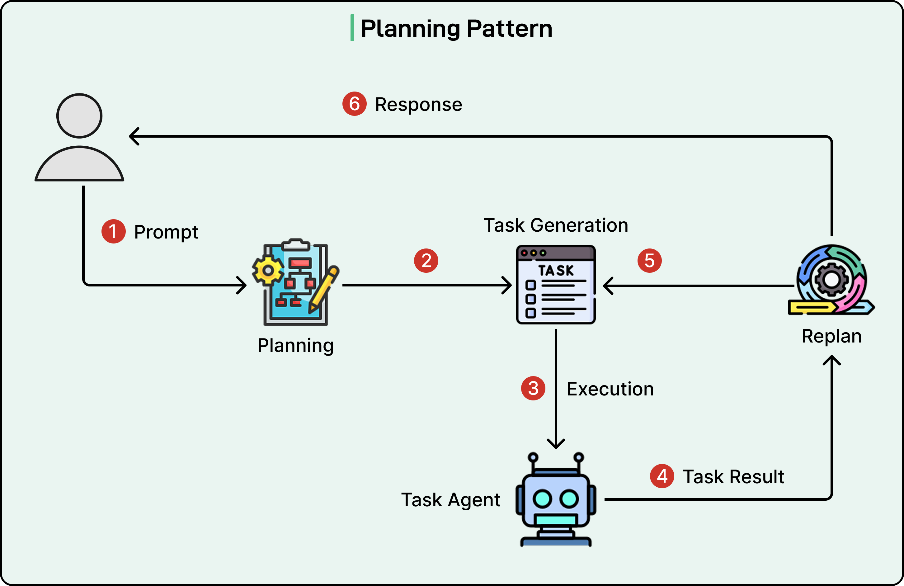

When using the planning pattern, the agent starts by analyzing the overall goal and understanding what success looks like. It then breaks down this goal into smaller, more manageable subtasks. This decomposition continues until the agent has identified concrete, actionable steps.

The planning pattern has limitations.

- For simple, linear tasks where each step naturally suggests the next one, the overhead of creating a formal plan provides little benefit.
- For highly uncertain tasks where we’re likely to discover critical information during execution that fundamentally changes the approach, extensive upfront planning might be wasted effort.

### Multi-Agent Pattern

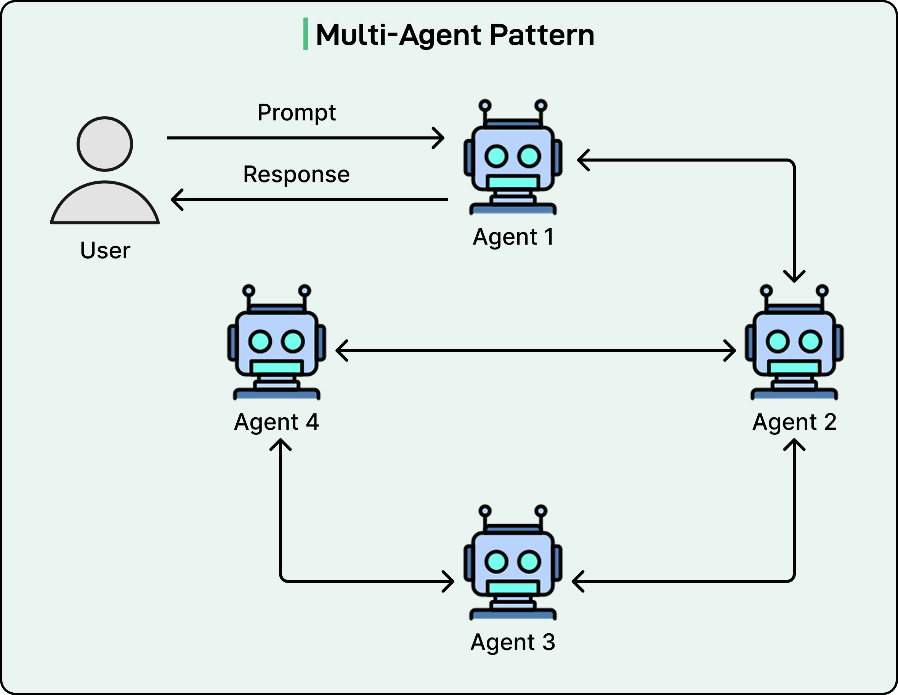

Instead of relying on a single agent to handle everything, this pattern uses multiple specialized agents that collaborate to accomplish tasks. Each agent has specific expertise, capabilities, or perspectives, and they work together much like human teams do.

The core insight behind multi-agent systems is that specialization often leads to better performance than generalization.

The multi-agent pattern introduces complexity trade-offs as follows:

- Coordination overhead increases with more agents.
- Communication between agents requires clear protocols.
- Debugging becomes more challenging because problems might arise from interactions between agents rather than individual agent errors.

## Framework

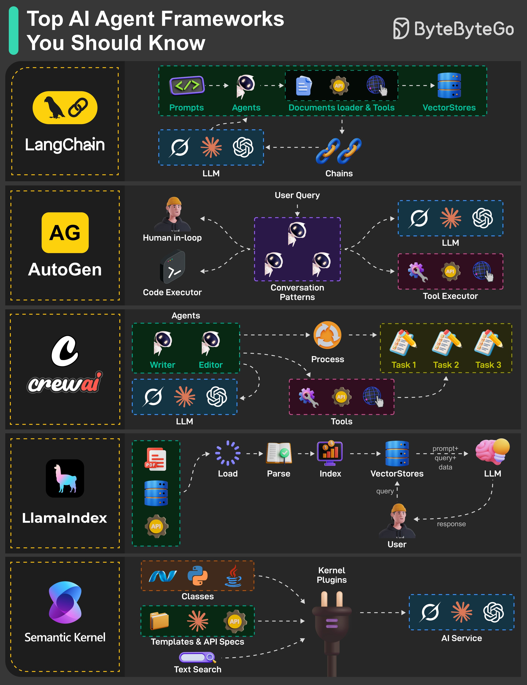

### LangChain

LangChain makes it simple to connect LLMs with external tools like APIs and vector databases. It allows developers to create chains for sequential task execution and document loaders for context-aware responses.

### AutoGen

AutoGen allows you to develop AI agents that can chat with each other or involve humans in the loop. It is like a collaborative workspace where agents can run code, pull in data from tools, or get human feedback to complete a task.

### CrewAI

As the name suggests, CrewAI is all about teamwork. It orchestrates teams of AI agents with roles like writers and editors, processing tasks in a structured workflow. It utilizes LLMs and tools (APIs, Internet, code, etc) to efficiently manage complex task execution and data flow.

### LlamaIndex

This framework indexes and queries data from documents, APIs, and vector stores to enhance agent responses. It parses and loads data, enabling LLMs to provide context-aware answers, making it ideal for enterprise document search systems and intelligent assistants that access private knowledge bases.

### Semantic Kernel

Semantic Kernel connects AI services (OpenAI, Calude, Hugging Face models, etc) with a plugin-based architecture that supports skills, templates, and API integrations for flexible workflows. It supports text search and custom workflows for applications.

## Skills

Why do we need Agent Skills? Long prompts hurt agent performance. Instead of one massive prompt, agents keep a small catalog of skills, reusable playbooks with clear instructions, loaded only when needed.

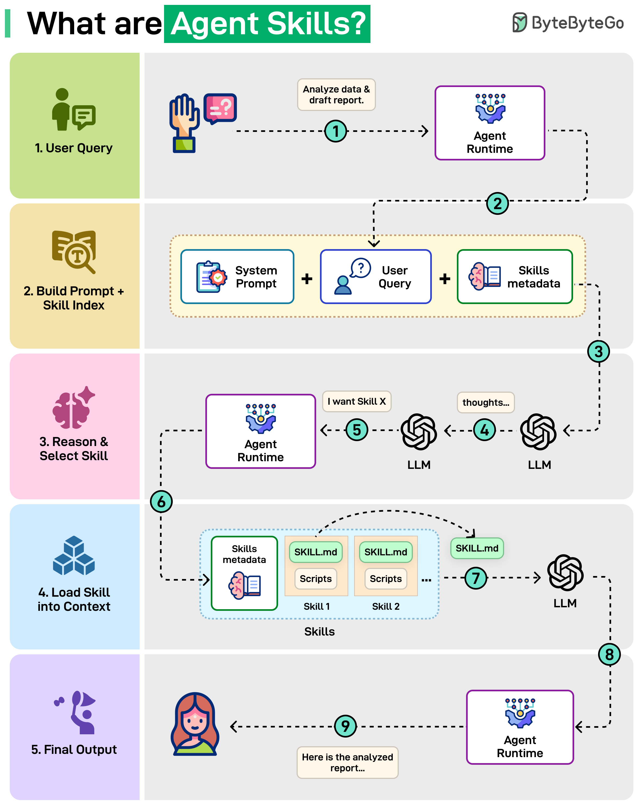

1. User Query: A user submits a request like “Analyze data & draft report”.
2. Build Prompt + Skills Index: The agent runtime combines the query with Skills metadata, a lightweight list of available skills and their short descriptions.
3. Reason & Select Skill: The LLM processes the prompt, thinks, and decides: "I want Skill X."
4. Load Skill into Context: The agent runtime receives the specific skill request from the LLM. Then, it loads SKILL. md and adds it into the LLM's active context.
5. Final Output: The LLM follows SKILL. MD runs scripts and generates the final report.

## Agentic Browser Workflow

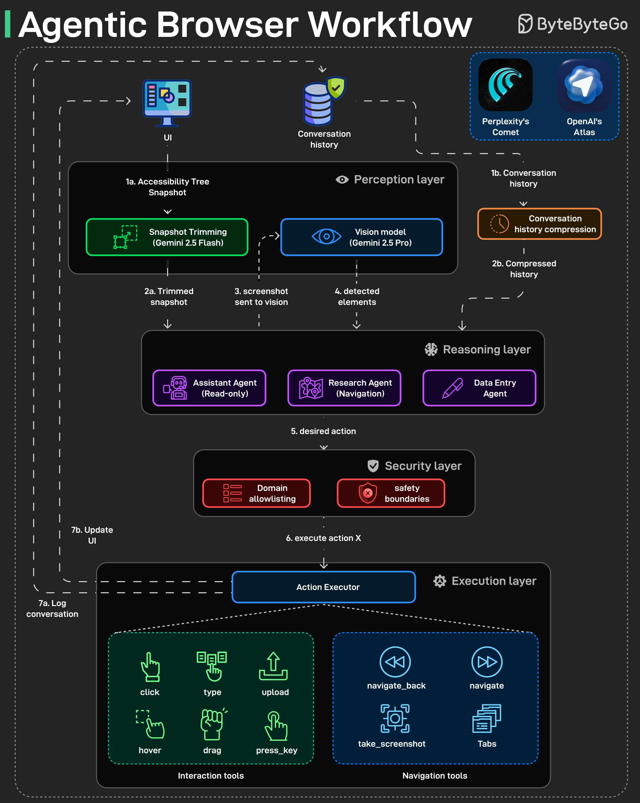

Most agentic browsers have four major layers.

1. Perception layer: Converts the current UI into model input. It starts with an accessibility tree snapshot. If the tree is incomplete or ambiguous, the agent takes a screenshot, sends it to a vision model (for example, Gemini Pro) to extract UI elements into a structured form, then uses that result to decide the next action.
2. Reasoning layer: Uses specialized agents for read-only browsing, navigation, and data entry. Separating roles improves reliability and lets you apply safety rules per agent.
3. Security layer: Enforces domain allowlisting and deterministic boundaries such as restricted actions, and confirmation steps to reduce prompt injection risk.
4. Execution layer: Runs browser tools (click, type, upload, navigate, screenshot, tab operations) and refreshes state after each step.

## Example 1: Cursor Agent

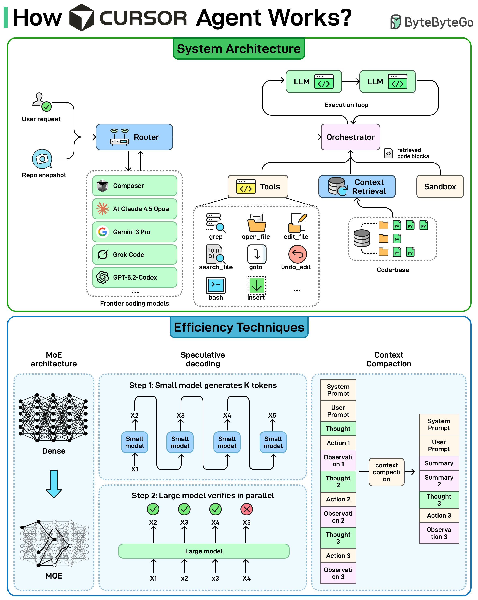

The system then starts a loop: retrieve the most relevant code (context retrieval), use tools to open and edit files, and run commands in a sandbox. Once the tests pass, the task is complete.

Cursor uses three key techniques to keep this loop fast:

1. Mixture-of-Expert (MoE): A sparse MoE architecture activates only a subset of model weights per token.
2. Speculative decoding: a smaller model drafts multiple tokens at once, then a larger model verifies them in parallel to reduce latency.
3. Context compaction: summarize older steps and keep only the active working set so the prompt stays relevant and short as iterations continue.

## Example 2: Uber's Conversational AI Agent

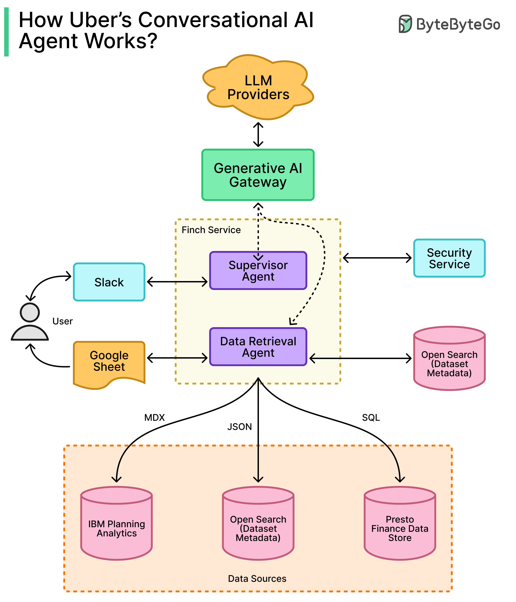

## Summary

### N8N vs LangGraph

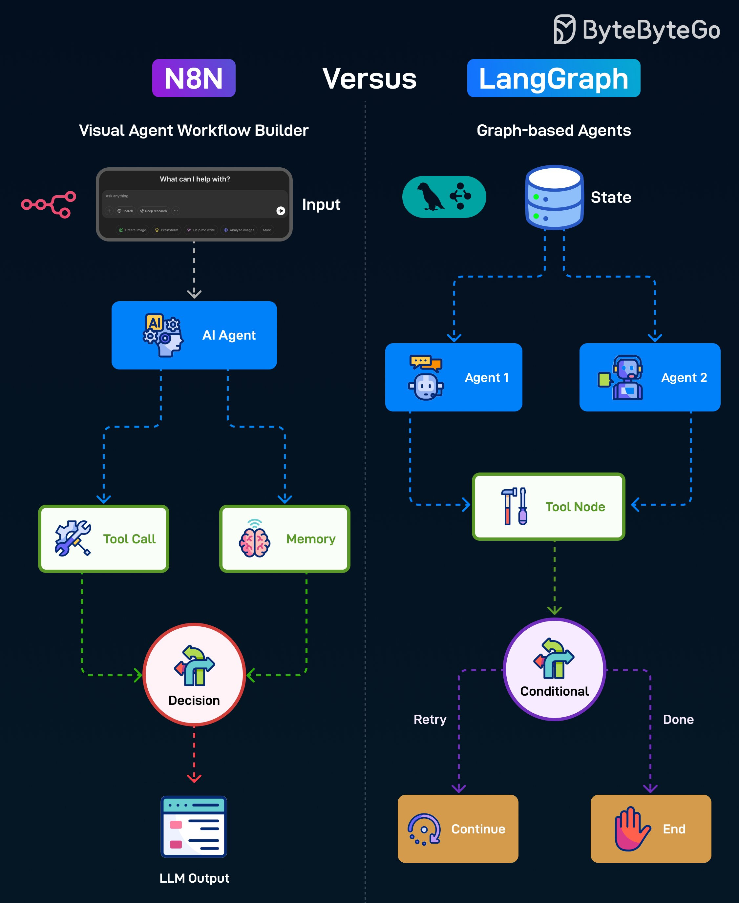

## Reference

[1] [Top AI Agentic Workflow Patterns](https://blog.bytebytego.com/p/top-ai-agentic-workflow-patterns)

[2] [The Agentic AI Learning Roadmap](https://blog.bytebytego.com/p/ep171-the-generative-ai-tech-stack)

[3] [What is an AI Agent?](https://blog.bytebytego.com/i/156178473/what-is-an-ai-agent)

[4] [Top AI Agent Frameworks You Should Know](https://blog.bytebytego.com/p/ep176-how-does-sso-work)

[5] [Agent Skills, Clearly Explained](https://blog.bytebytego.com/p/ep202-mcp-vs-rag-vs-ai-agents)

[6] [What are AI Agents?](https://blog.bytebytego.com/p/what-are-ai-agents)

[7] [How Uber Built a Conversational AI Agent For Financial Analysis](https://blog.bytebytego.com/p/how-uber-built-a-conversational-ai)

[8] [Top 20 AI Agent Concepts You Should Know](https://blog.bytebytego.com/i/166418419/top-20-ai-agent-concepts-you-should-know)

[9] [N8N versus LangGraph](https://blog.bytebytego.com/i/172894034/n8n-versus-langgraph)