# AI Agent

[TOC]

An AI agent is a software program that can interact with its environment, gather data, and use that data to achieve predetermined goals. AI agents can choose the best actions to perform to meet those goals.

## Intro

An agent can perform autonomous actions without constant human intervention. Also, they can have a human in the loop to maintain control.

Four key characteristics define what makes something an AI agent:

- Autonomy and Goal-Oriented Behaviour

  Agentic AI systems act independently and make decisions to achieve predefined goals without human intervention.

- Adaptive Learning and Complex Decision-Making

  These systems learn from experience and adapt their behaviour to handle complex situations effectively.

- Environment Interaction and Perception

  Agentic AI collects real-time data from its surroundings to understand and respond to the environment.

- Information Processing

  It analyses data using algorithms and models to make informed decisions.

- Action Execution

  The system performs tasks automatically using software commands or physical mechanisms based on its decisions.

### Perception

Perception stands as a foundational concept in the realm of AI, enabling agents to glean insights from their environment through sensory inputs.

Here are some of the popular and widely used perception in AI agents:

- Visual Perception

  This involves interpreting visual data obtained from cameras or other visual sensors. It allows agents to recognize objects, identify shapes, detect motion, and understand spatial relationships in their environment.

- Auditory Perception

  Auditory perception (or hearing perception) involves processing sound data captured by microphones or other audio sensors. AI agents can use auditory perception to recognize speech, detect environmental sounds, and localize sound sources.

- Touch Perception

  Touch (or Tactile) perception involves interpreting touch or pressure data obtained from sensors such as touchscreens or tactile sensors. It enables agents to sense physical contact, texture, and pressure variations, facilitating tasks such as object manipulation or navigation in physical environments.

- Multimodal Perception

  Multimodal perception integrates inputs from multiple sensory modalities, such as combining visual and auditory data to improve object recognition or speech understanding. It enables agents to obtain a more comprehensive understanding of their environment by leveraging diverse sources of information.

### Skills

Why do we need Agent Skills? Long prompts hurt agent performance. Instead of one massive prompt, agents keep a small catalog of skills, reusable playbooks with clear instructions, loaded only when needed.

1. User Query: A user submits a request like “Analyze data & draft report”.
2. Build Prompt + Skills Index: The agent runtime combines the query with Skills metadata, a lightweight list of available skills and their short descriptions.
3. Reason & Select Skill: The LLM processes the prompt, thinks, and decides: "I want Skill X."
4. Load Skill into Context: The agent runtime receives the specific skill request from the LLM. Then, it loads SKILL. md and adds it into the LLM's active context.
5. Final Output: The LLM follows SKILL. MD runs scripts and generates the final report.

## Types

### Simple Reflex Agents

Simple reflex agents are the most basic type, operating on straightforward condition-action rules. These agents perceive the current state of their environment and respond with predetermined actions based on pattern matching.

### Model-Based Agents

Model-based agents represent a significant step up in sophistication because they maintain an internal representation of the world that they cannot directly perceive. This internal model helps them make better decisions even when they lack complete information about their environment.

### Goal-Based Agents

Goal-based agents take things further by explicitly working toward specific objectives rather than simply reacting to current conditions.

These agents evaluate different possible actions by considering whether those actions help achieve their goals. They can look ahead, anticipate consequences, and choose behaviors that lead to goal satisfaction even if the path isn’t immediately obvious.

### Utility-Based Agents

While goal-based agents treat objectives as binary (achieved or not achieved), utility-based agents work with a more nuanced measure of success. These agents use a utility function that quantifies how desirable different outcomes are, allowing them to make decisions that optimize overall satisfaction rather than just checking boxes. This becomes essential when dealing with trade-offs or competing priorities.

### Learning Agents

Learning agents represent the most advanced category because they improve their performance over time through experience.

### Multi-Agent Systems (MAS)

Multi-agent systems consist of multiple autonomous agents that interact within a shared environment, where they may cooperate, compete, or do both depending on the situation.

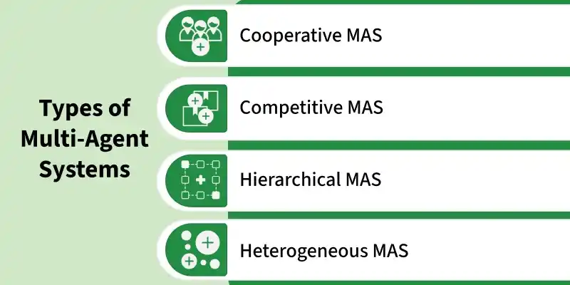

#### Cooperative MAS

Agents in these systems work together to achieve a common goal. They share information and resources to do things that would be hard for a single agent.

#### Competitive MAS

Agents have conflicting goals and compete for limited resources.

#### Hierarchical MAS

These systems have a structured organization with agents at different levels. Higher-level agents manage and coordinate lower-level ones.

#### Heterogeneous MAS

In these systems, agents have different skills or roles which can make the system more flexible and adaptable.

### Hierarchical Agents

Hierarchical agents organize decision-making in layers, where higher levels focus on planning and lower levels handle execution. This structure helps manage complex tasks by separating strategy from operational details.

## Architectures

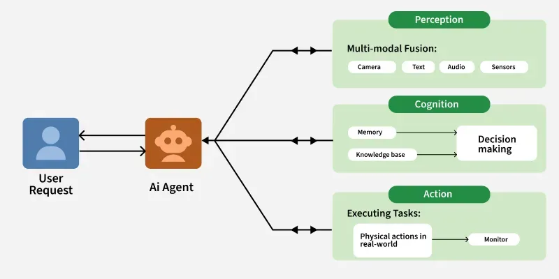

1. Perception

   The way by which the agent collects information from its surroundings and uses inputs like images, sound, text, or sensor data is perception. Systems use sensors, data streams, and external databases to understand their environment and recognize changes or events that need a response.

2. Cognitive Layer

   After understanding its environment, the agent must analyze the data and decide the best action. This process involves assessing the current situation, considering potential outcomes, and selecting the best action based on predefined goals or objectives.

3. Agentic AI uses techniques such as:

   - Rule-Based Systems

     Simple systems that follow predefined rules to make decisions.

     - Machine Learning Models

       More advanced systems that use statistical techniques to learn patterns from data and make predictions.

     - Reinforcement Learning

       Agentic AI systems often use reinforcement learning where they learn through trial and error by receiving feedback, i.e., rewards or penalties, based on their actions.

4. Action and Execution

   The action component executes the decisions made by the agent. Once the agent processes the data and chooses an action, it takes action in the environment. This could involve sending commands to physical systems like a robotic arm or self-driving car and then handling data or communicating it with other systems.

     - Robotics

       In physical environments, it can control robotic systems to perform tasks such as assembly, navigation, and interaction with humans.

     - Software Automation

       In virtual environments, it can control software systems to automate processes such as decision-making in business operations, customer service chatbots, or IT systems management.

5. Learning and Adaptation

   The systems need to adapt and get better over time by learning from past experiences. This enables them to handle new situations that may not have been specifically programmed. Learning mechanisms in agentic AI can be:

     - Supervised Learning

       Where the agent is trained on labeled data to make predictions or classifications.

     - Unsupervised Learning

       It identifies patterns in unlabeled data without predefined categories.

     - Reinforcement Learning

       It learns through trial and error, improving its decision-making over time by receiving rewards or penalties based on its actions.

There are several types of agentic architectures each with its own strengths and weaknesses, suitable for different tasks and environments. Some common types include:

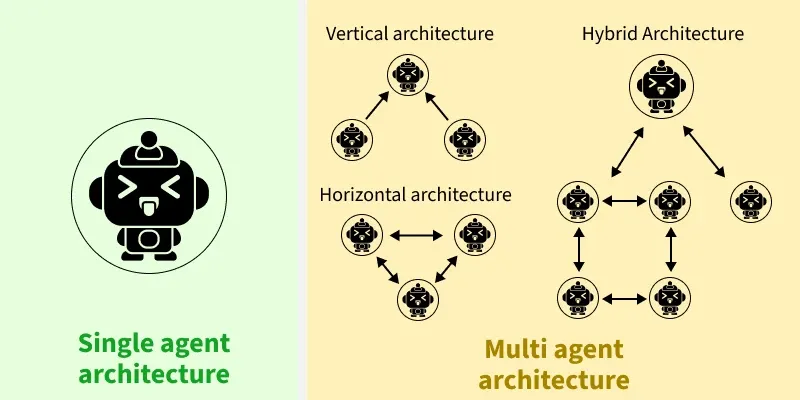

- Single-agent architecture
- Multi-agent architecture

### Principles

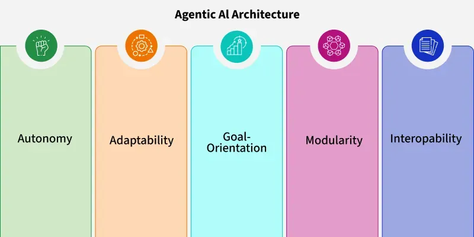

- Autonomy

  Agentic AI works independently within set limits, hence reducing the need for human involvement. It adapts to changing conditions while following ethical and safety guidelines.

- Goal-Directed Behavior

  The system focuses on clear objectives, using them to guide its perception, reasoning, and planning. Goals can be set by users or inferred from the context.

- Adaptability

  Agentic systems improve over time by learning from feedback. Methods like online learning or meta-learning allow them to continuously evolve.

- Modularity

  A modular design allows components to be developed, tested, and updated independently. This enhances scalability and facilitates integration with existing systems.

- Transparency

  To build trust, agentic AI provides understandable outputs, explaining its reasoning and actions. This is critical for applications in critical domains like healthcare or finance.

### Single-Agent Architecture

A single AI system that functions independently, making decisions and taking actions without the involvement of other agents.

### Multi-Agent Architecture

This architecture involves multiple AI systems interacting with each other, collaborating and coordinating their actions to achieve common goals. Its subtypes are:

- Vertical architecture

  This approach involves agentic AI systems organized in a hierarchical structure with higher-level agents overseeing and guiding the actions of lower-level agents.

- Horizontal architecture

  This involves agentic AI systems operating on the same level without any hierarchical structure, communicating and coordinating their actions as needed.

- Hybrid architecture

  This involves a combination of different agentic architecture types and using the strengths of each to achieve optimal performance in complex environments.

## Patterns

What makes workflows truly agentic are the iteration and feedback loops built into the process. Instead of generating output in a single pass, agentic workflows involve cycles where the agent takes an action, observes the result, and uses that observation to inform the next action.

### Reflection Pattern

Reflection is about having an agent review and critique their own work, then revise based on that critique. This simple idea improves output quality because it introduces an iterative refinement process that catches errors, identifies weaknesses, and enhances strengths.

Here’s how the reflection cycle works in practice.

- The agent first generates an initial output based on the task or prompt it receives.
- Then, instead of immediately presenting this output as final, the agent switches into critique mode. It examines what it just produced, looking for problems, inconsistencies, areas that lack clarity, or opportunities for improvement. This critique becomes the basis for revision.
- The agent generates an improved version that addresses the issues it identified. Depending on the implementation, this cycle might repeat multiple times, with each iteration refining the output further.

### Tool Use Pattern

In the tool use pattern, agents are equipped with a set of capabilities they can invoke when needed. The critical distinction from traditional software is that the agent itself decides when and how to use these tools based on the task at hand.

When an agent receives a task, it analyzes what capabilities are needed to accomplish that task.

### Reason and Act Pattern (ReAct)

The Reason and Act pattern, commonly known as ReAct, represents a sophisticated approach to problem-solving that combines explicit reasoning with iterative action. Rather than thinking through an entire plan before acting, or blindly taking actions without reflection, ReAct agents alternate between reasoning about what to do next and actually doing it. This interleaving of thought and action creates a natural, adaptive problem-solving process.

The ReAct cycle follows a clear pattern:

1. The agent reasons about the current situation and what it needs to accomplish.
2. Based on this reasoning, the agent takes an action.
3. After the action, the agent observes the results and enters a new reasoning phase, thinking about what it learned and what to do next.

The explicit reasoning steps serve multiple important purposes:

1. They help the agent stay on track and maintain focus on the goal.
2. Reasoning steps enable adaptation.
3. The reasoning trail provides transparency.

### Planning Pattern

When using the planning pattern, the agent starts by analyzing the overall goal and understanding what success looks like. It then breaks down this goal into smaller, more manageable subtasks. This decomposition continues until the agent has identified concrete, actionable steps.

The planning pattern has limitations.

- For simple, linear tasks where each step naturally suggests the next one, the overhead of creating a formal plan provides little benefit.
- For highly uncertain tasks where we’re likely to discover critical information during execution that fundamentally changes the approach, extensive upfront planning might be wasted effort.

### Multi-Agent Pattern

Instead of relying on a single agent to handle everything, this pattern uses multiple specialized agents that collaborate to accomplish tasks. Each agent has specific expertise, capabilities, or perspectives, and they work together much like human teams do.

The core insight behind multi-agent systems is that specialization often leads to better performance than generalization.

The multi-agent pattern introduces complexity trade-offs as follows:

- Coordination overhead increases with more agents.
- Communication between agents requires clear protocols.
- Debugging becomes more challenging because problems might arise from interactions between agents rather than individual agent errors.

## Memory in AI Agents

AI Agent Memory is the ability of an AI agent to store, recall, and use information from past interactions to make better decisions in the present and future. Without memory, an agent treats every interaction as if it were the first interaction. With memory, an agent can maintain context, adapt to users, and improve over time, i.e., memory gives an AI agent continuity, context-awareness, and learning abilities.

### Types of Memory in AI Agents

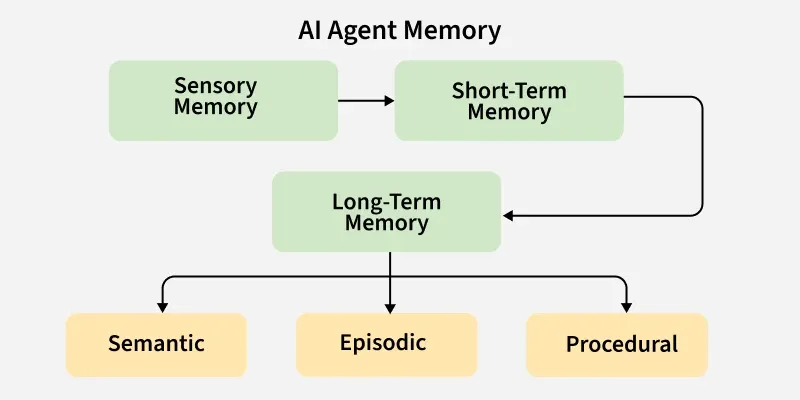

#### Short-Term Memory

Short-term memory (STM) is like the AI agent’s temporary notepad. It holds recent information just long enough to finish the current task. After that, it is cleared for the next job. This type of memory is great for quick tasks such as customer support chats, where the agent only needs to remember the ongoing conversation to help the user.

#### Long-Term Memory

Long-term memory (LTM) stores information for much longer periods. It can keep specific details, general facts, instructions, or even the steps needed to solve certain problems. There are different types of long-term memory:

- Episodic Memory

  This type remembers specific events from the past, like a user’s date of birth that was used during an earlier conversation. The agent can use this memory as context in future interactions.

- Semantic Memory

  This holds general knowledge about the world or things the AI has learned through past interactions. The agent can refer to this information to handle new problems effectively.

- Procedural Memory

  Here, the agent stores “how-to” steps or rules for making decisions.

## Agent2Agent (A2A) Protocol

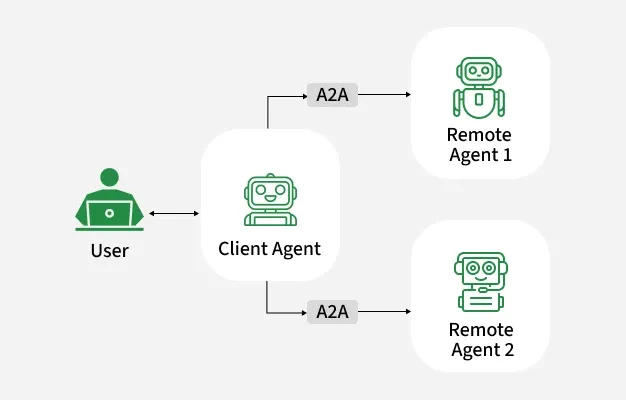

A2A is a standardized communication framework that allows AI agents to discover, interact, and collaborate with each other on tasks without being constrained by their underlying technologies or platforms. It uses Agent Cards that list agents’ capabilities, allowing others to discover and interact with them. It supports task management, real-time messaging, and sharing of results, making cooperation efficient and flexible.

### A2A Components

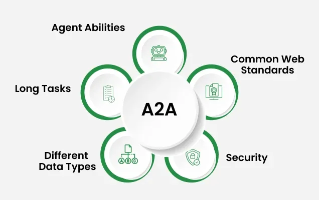

- Agent Abilities

  It allows agents to collaborate effectively even if they don’t share memory or tools, which enables them to work independently while still cooperating seamlessly.

- Use Common Web Standards

  It established web standards like HTTP, Server-Sent Events (SSE), and JSON-RPC rather than creating new technologies, which makes it easier to integrate with existing systems.

- Built-in Security

  The protocol is designed with strong security features from the start, supporting standard authentication and permission checks, which are essential for business applications.

- Support for Long Tasks

  It is capable of managing tasks that take extended periods, providing real-time updates throughout the process, which is crucial for complex business operations.

- Handling Multiple Data Types

  It supports various data formats like text, audio, video, and interactive elements, which allows agents to choose the best format for the task at hand.

### A2A Workflow

#### Client-Server Model

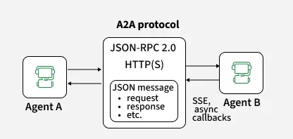

- One agent, i.e., "client" (CustomerBot), requests a task such as checking if a product is in stock. Another agent, "server" or "remote" agent (OrderBot), performs the task by querying the inventory.
- These roles can switch during the conversation, which is a core feature of the communication protocol.

#### Agent Card

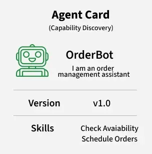

- An Agent Card is a JSON file that acts as an agent’s profile.
- It includes the agent’s ID, name, role, security needs and available capabilities.
- This helps client agents find the right server agent for a specific task.

#### Task-Based Workflow

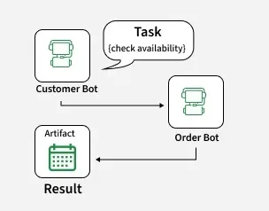

- The main unit of work is called a task.
- The stages it goes through are: Submitted (started), Working (in progress), Input-required (needs more information), Completed (finished successfully), Failed (encountered an error) or Cancelled (stopped early).

#### Message Structure

- During task execution, agents communicate using messages.
- Messages contain parts that hold content such as text, files, data or forms allowing exchange of rich information.

#### Artifacts for Results

- The output of a completed task is delivered as artifacts.
- These artifacts are structured results, ensuring the final output is consistent and easy to use.

### A2A Agent Interaction

A2A systems can be categorized based on the way agents interact:

1. Cooperative Agent Interaction

   In cooperative A2A, agents collaborate to achieve a shared goal. They exchange resources, strategies, or plans to tackle tasks that would be difficult to complete individually.

2. Competitive Agent Interaction

   In competitive A2A interaction, agents have conflicting goals and may compete with each other to achieve their individual objectives. This is commonly seen in auctions, games, or resource allocation scenarios.

3. Negotiative Agent Interaction

   This interaction involves agents negotiating to reach mutually beneficial agreements. Such interactions typically occur when agents need to resolve conflicts or come to an agreement on the terms of collaboration.

4. Mediated Communication

   In mediated A2A systems, an intermediary agent, often called a "mediator," facilitates communication between agents. This approach is useful when direct communication between agents would be inefficient or difficult.

## Multimodal Agents

Multimodal agents are autonomous systems that integrate perception, reasoning, and action across heterogeneous data modalities—including vision, language, audio, and structured signals—in order to solve complex, real-world tasks. Such agents leverage the representation power of large multimodal models, advanced workflow orchestration, and collaboration between specialized modules or sub-agents. This article summarizes the canonical architectures, computational principles, evaluation methodologies, representative results, and open research challenges in multimodal agent design and analysis.

### Formal Architectures and Computational Models

Multimodal agents are defined by the joint deployment of multiple sensor modalities, event-driven or sequential interpretation modules, and orchestrating mechanisms for communication and memory. A `canonical agent architecture` is characterized by the following elements:

- Modular event systems
- Agent configuration
- Data flow
- Concurrency and workflow

### Modal Perception, Reasoning, and Tool Orchestration

Multimodal agents achieve cross-modal reasoning via coordinated pipelines of perception, interpretation, and tool use:

- Sensor and interpreter integration

  Each component is defined by its input/output topics ($In(C)$, $Out(C)$); The routing function $I = \{I_1, ..., I_m\}$ dynamically dispatches events to interpretation modules ([Baier et al., 2022](https://www.emergentmind.com/papers/2206.00636)).

- Hybrid tool use

- Specialist and aggregator roles

- Workflow state machines

### Memory, Knowledge, and Collaboration Protocols

Memory and collaboration are critical for long-term, reliable multimodal reasoning:

- External memory and reliability scoring
- Episodic knowledge graphs (eKGs)
- Multi-agent societies and social graphs
- Collaborative modality distillation

### Evaluation Benchmarks and Methodologies

Benchmarking frameworks for multimodal agents have significantly matured:

- Task taxonomies
- Canonical tasks and metrices
- Memory and belief dynamics
- Collaborative and medical agents

### Multi-Agent Systems and Emergent Collaboration

Beyond single-agent models, complex tasks increasingly demand modular or multi-agent collaboration:

- Role specialization and consensus
- Explicit teamwork and error recovery
- Curriculum and dynamic fusion
- Unified multi-agent workspaces

### Current Capabilities, Limitations, and Open Challenges

Despite measurable advances, state-of-the-art multimodal agents still exhibit significant limitations:

- Accuracy and generalization
- Failure modes
- Evaluation granularity
- Safety and attack surfaces
- Long-horizon planning, memory, and abstention

## Problem Formulation

Problem formulation is the process by which an agent defines the task it needs to solve. This involves specifying the initial state, goal state, actions, constraints, and the criteria for evaluating solutions. Effective problem formulation is crucial for the success of the agent in finding optimal or satisfactory solutions.

Problem Formulation Workflow:

1. Define the Initial State

   The initial state is the starting point of the agent. It includes all the relevant information about the environment that the agent can perceive and use to begin the problem-solving process.

2. Specify the Goal State

   The goal state defines the desired outcome that the agent aims to achieve. It represents the condition or set of conditions that signify the completion of the task.

3. Determine the Actions

   Actions are the set of operations or moves that the agent can perform to transition from one state to another. Each action should be well-defined and feasible within the given environment.

4. Establish the Transition Model

   The transition model describes how the environment changes in response to the agent's actions. It defines the rules that govern state transitions.

5. Set Constraints and Conditions

   Constraints are the limitations or restrictions within which the agent must operate. These can include physical limitations, resource constraints, and safety requirements.

6. Define the Cost Function (if applicable)

   The cost function evaluates the cost associated with different actions or paths. It helps the agent to optimize its strategy by minimizing or maximizing this cost.

7. Criteria for Success

   The criteria for success determine how the agent evaluates its progress and final solution. This includes metrics for measuring the effectiveness and efficiency of the solution.

## Agentic Browser

### Agentic Browser Workflow

Most agentic browsers have four major layers.

1. Perception layer: Converts the current UI into model input. It starts with an accessibility tree snapshot. If the tree is incomplete or ambiguous, the agent takes a screenshot, sends it to a vision model (for example, Gemini Pro) to extract UI elements into a structured form, then uses that result to decide the next action.
2. Reasoning layer: Uses specialized agents for read-only browsing, navigation, and data entry. Separating roles improves reliability and lets you apply safety rules per agent.
3. Security layer: Enforces domain allowlisting and deterministic boundaries such as restricted actions, and confirmation steps to reduce prompt injection risk.
4. Execution layer: Runs browser tools (click, type, upload, navigate, screenshot, tab operations) and refreshes state after each step.

## Example 1: Cursor Agent

The system then starts a loop: retrieve the most relevant code (context retrieval), use tools to open and edit files, and run commands in a sandbox. Once the tests pass, the task is complete.

Cursor uses three key techniques to keep this loop fast:

1. Mixture-of-Expert (MoE): A sparse MoE architecture activates only a subset of model weights per token.
2. Speculative decoding: a smaller model drafts multiple tokens at once, then a larger model verifies them in parallel to reduce latency.
3. Context compaction: summarize older steps and keep only the active working set so the prompt stays relevant and short as iterations continue.

## Example 2: Uber's Conversational AI Agent

## Summary

### LangGraph vs N8N

### LangGraph vs LangChain

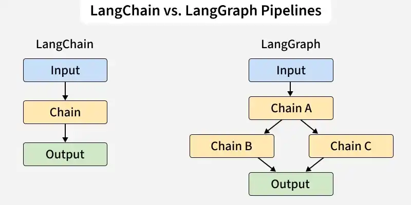

|          **Features**           |                        **LangGraph**                        |                     **LangChain**                     |
| :-----------------------------: | :---------------------------------------------------------: | :---------------------------------------------------: |
|        **Architecture**         |  Graph-based (nodes and edges with memory and branching).   |             Sequential decision-act loop.             |
|      **Workflow Control**       |       Fully customizable paths, loops and conditions.       | Limited control, follows predefined tool-usage cycle. |
|      **State Management**       |     Built-in persistent state across the entire graph.      |         Implicit or external memory required.         |
|      **Support for Loops**      |         Yes, supports cyclical flows and iteration.         |          Not designed for loops or retries.           |
|      **Human-in-the-Loop**      | Built-in support for pausing and resuming with human input. |            Requires custom implementation.            |
| **Debugging and Observability** |        High observability with tools like LangSmith.        |        Limited transparency, harder to debug.         |

### Agentic AI vs Traditional AI

|    **Feature**     |                      **Traditional AI**                      |                        **Agentic AI**                        |
| :----------------: | :----------------------------------------------------------: | :----------------------------------------------------------: |
| **Core Function**  |            Performs specific, preprogrammed tasks            |      Executes tasks autonomously using predefined goals      |
| **Typical output** | Deterministic results—answers, classifications, predictions  |           Actions, decisions, multi-step workflows           |
|    **Autonomy**    | Low as it requires explicit instructions, operates within set boundaries | High as it plans, adapts and makes decisions with minimal human direction |
|    **Learning**    | Learns from labeled data, often needs retraining for new situations | Learns from experience, adapts strategies and workflows in real time |
|   **Use cases**    |      Data sorting, image recognition, basic diagnostics      | Workflow automation, dynamic planning, virtual assistants, problem solving |
|  **Scalability**   |          Requires manual oversight as systems grow.          | Oversees and coordinates whole systems hence reducing manual monitoring. |
|  **Adaptability**  | Struggles with unexpected changes and may needs retraining.  | Adjusts strategies and learns in real time and best suited for fast-changing situations. |
| **Business value** |   Automates simple, rule-based jobs, increases consistency   | Automates complex operations, reduces manual work, enables personalized tasks |

### Comparison of AI Agent 

|        **Agent Type**        |                      **Main Strength**                      |                   **Limitations**                    |                   **Best For**                   |          **Example**           |
| :--------------------------: | :---------------------------------------------------------: | :--------------------------------------------------: | :----------------------------------------------: | :----------------------------: |
|   **Simple Reflex Agent**    |            Instant reaction based on fixed rules            | No memory or learning; fails in dynamic environments | Fully observable, stable and simple environments |      Traffic light timers      |
| **Model-Based Reflex Agent** |      Handles partial observability with internal state      | More computational demand; depends on model accuracy |   Dynamic or partially observable environments   |     Robot vacuum cleaners      |
|     **Goal-Based Agent**     |         Plans ahead to achieve specific objectives          |      Needs clear goals and planning algorithms       |        Strategic tasks with defined goals        |    Logistics route planning    |
|   **Utility-Based Agent**    |         Balances multiple factors for best outcome          |          Requires complex utility functions          |          Multi-criteria decision-making          | Financial portfolio management |
|      **Learning Agent**      |              Improves over time via experience              |             Needs data and training time             |  Dynamic environments with changing conditions   |          AI chatbots           |
| **Multi-Agent System (MAS)** | Distributed problem-solving with cooperation or competition |    Complex interactions; unpredictable behaviors     |       Decentralized, multi-entity systems        |     Smart traffic control      |
|    **Hierarchical Agent**    |       Breaks complex tasks into levels for efficiency       |   Requires well-defined interfaces between layers    |       Large-scale, multi-level operations        |   Drone delivery management    |

### Comparison Table of AI Memory Techniques

|       **Technique**       |             **Best for**              |              **Strengths**              |           **Limitations**           |
| :-----------------------: | :-----------------------------------: | :-------------------------------------: | :---------------------------------: |
| **Simple Buffer (FIFO)**  |          Short-term context           |         Easy to implement, Fast         |   Cannot handle long-term storage   |
| **Relationship Database** |      Structured long-term memory      | Mature technology and easy for querying | Poor at semantic/contextual queries |
|    **Vector Database**    | Semantic search and unstructured data | Handles fuzzy matching and is scalable  |    Requires embedding generation    |
|    **Knowledge Graph**    |   Relationships and World Knowledge   |    Good for reasoning and inference     |    Complex to build and maintain    |
| **Neural Turing Machine** |        Advanced neural memory         |  Integrates with deep learning models   |      Computationally intensive      |

## Reference

[1] [Top AI Agentic Workflow Patterns](https://blog.bytebytego.com/p/top-ai-agentic-workflow-patterns)

[2] [The Agentic AI Learning Roadmap](https://blog.bytebytego.com/p/ep171-the-generative-ai-tech-stack)

[3] [What is an AI Agent?](https://blog.bytebytego.com/i/156178473/what-is-an-ai-agent)

[4] [Top AI Agent Frameworks You Should Know](https://blog.bytebytego.com/p/ep176-how-does-sso-work)

[5] [Agent Skills, Clearly Explained](https://blog.bytebytego.com/p/ep202-mcp-vs-rag-vs-ai-agents)

[6] [What are AI Agents?](https://blog.bytebytego.com/p/what-are-ai-agents)

[7] [How Uber Built a Conversational AI Agent For Financial Analysis](https://blog.bytebytego.com/p/how-uber-built-a-conversational-ai)

[8] [Top 20 AI Agent Concepts You Should Know](https://blog.bytebytego.com/i/166418419/top-20-ai-agent-concepts-you-should-know)

[9] [N8N versus LangGraph](https://blog.bytebytego.com/i/172894034/n8n-versus-langgraph)

[10] [What is LangGraph](https://www.geeksforgeeks.org/machine-learning/what-is-langgraph/)

[11] [What is LangGraph](https://www.geeksforgeeks.org/machine-learning/what-is-langgraph/)

[12] [Agentic AI](https://www.geeksforgeeks.org/artificial-intelligence/agentic-ai/)

[13] [Agentic AI vs. Traditional AI](https://www.geeksforgeeks.org/artificial-intelligence/agentic-ai-vs-traditional-ai/)

[14] [Multi Agent System in AI](https://www.geeksforgeeks.org/artificial-intelligence/multi-agent-system-in-ai/)

[15] [Perception in AI Agents](https://www.geeksforgeeks.org/artificial-intelligence/perception-in-ai-agents-artificial-intelligence/)

[16] [Agent2Agent (A2A)](https://www.geeksforgeeks.org/artificial-intelligence/agent2agent-a2a/)

[17] [AI Agent Memory](https://www.geeksforgeeks.org/artificial-intelligence/ai-agent-memory/)

[18] [Agentic AI Architecture](https://www.geeksforgeeks.org/artificial-intelligence/agentic-ai-architecture/)

[19] [Multimodal Agents: Architectures & Applications](https://www.emergentmind.com/topics/multimodal-agents)

[20] [How does an agent formulate a problem?](https://www.geeksforgeeks.org/artificial-intelligence/how-does-an-agent-formulate-a-problem/)