# AI Algorithms

[TOC]

## Search Algorithms

Search algorithms in AI help find solutions by exploring possible paths or options in a problem space. AI uses them in tasks like pathfinding, decision making and game playing. These algorithms work by searching through a set of possibilities to reach a goal, either blindly without extra information or with guidance using heuristics.

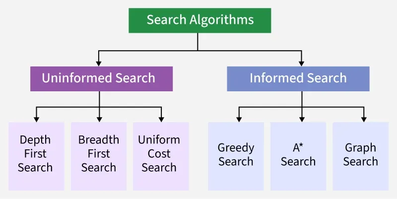

### Uniformed Search Algorithms

Uninformed search also called blind search explores the search space without any domain specific knowledge or heuristics. It treats all nodes equally and chooses which path to explore next based solely on general rules like node depth or path cost.

#### Depth First Search

Depth-first search is a traversing algorithm used in tree and graph-like data structures. It generally starts by exploring the deepest node in the frontier. Starting at the root node, the algorithm proceeds to search to the deepest level of the search tree until nodes with no successors are reached. Suppose the node with unexpanded successors is encountered, then the search backtracks to the next deepest node to explore alternative paths.

For Example:

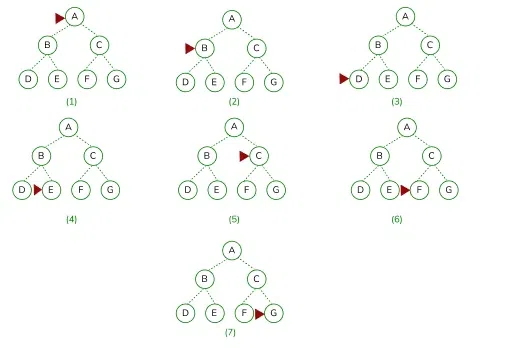

For more info, see: [Search Algorithm Summary#Depth-First Search (DFS)](../ALGO/search.md)

#### Breadth First Search

`Breadth First Search (BFS)` is a fundamental search algorithm that explores all possible paths level by level. It begins from the root node and explores all neighboring nodes before moving to the next level of nodes.

For Example:

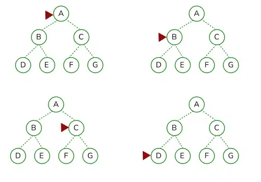

For more info, see: [Search Algorithm Summary#Breadth-First Search (BFS)](../ALGO/search.md)

#### Depth-Limited Search

Depth Limited Search is a modified version of DFS that imposes a limit on the depth of the search. This means that the algorithm will only explore nodes up to a certain depth effectively preventing it from going down excessively deep paths that may also lead to not reaching the goal and is computationally expensive. By setting a maximum depth limit, DLS aims to improve efficiency and ensure more manageable search times.

For Example:

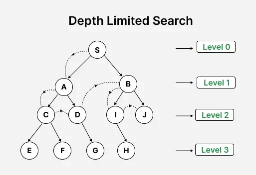

1. Initialization

   Begin at the root node with a specified depth limit.

2. Exploration

   Traverse the tree or graph, exploring each node's children.

3. Depth Check

   If the current depth exceeds the set limit, stop exploring that path and backtrack.

4. Goal Check

   If the goal node is found within the depth limit, the search is successful.

5. Backtracking

   If the search reaches the depth limit or a leaf node without finding the goal, backtrack and explore other branches.

#### Iterative Deepening Depth First Search

`Iterative Deepening Search (IDS)` is a search algorithm used in AI that blends the completeness of [Breadth-First Search (BFS) ](#Breadth First Search)with the space efficiency of [Depth-First Search (DFS)](#Depth First Search). IDS explores a graph or a tree by progressively increasing the depth limit with each iteration, effectively performing a series of DFS operations until the goal node is found.

For Example:

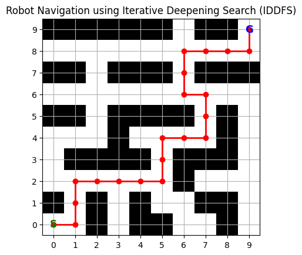

Here’s a step-by-step breakdown of the algorithm:

1. Start at the Root Node

   Begin the search from the root node (or starting point).

2. Perform DFS with Depth Limit (L)

   In each iteration, perform a DFS with a depth limit `L`.

3. Increment Depth

   After each iteration, increment `L` by 1.

4. Repeat

   Continue this process until the goal node is found or the search space is exhausted.

#### Uniform Cost Search

Uniform Cost Search is similar to BFS but takes the cost of each move into account. It always expands the node with the lowest cumulative path cost from the start.

Here’s the step-by-step process of how UCS works:

1. Initialization

   UCS starts with the root node. It is added to the priority queue with a cumulative cost of zero since no steps have been taken yet.

2. Node Expansion

   The node with the lowest path cost is removed from the priority queue. This node is then expanded, and its neighbors are explored.

3. Exploring Neighbors

   For each neighbor of the expanded node, the algorithm calculates the total cost from the start node to the neighbor through the current node. If a neighbor node is not in the priority queue, it is added to the queue with the calculated cost. If the neighbor is already in the queue but a lower cost path to this neighbor is found, the cost is updated in the queue.

4. Goal Check

   After expanding a node, the algorithm checks if it has reached the goal node. If the goal is reached, the algorithm returns the total cost to reach this node and the path taken.

5. Repetition

   This process repeats until the priority queue is empty or the goal is reached.

For Example:

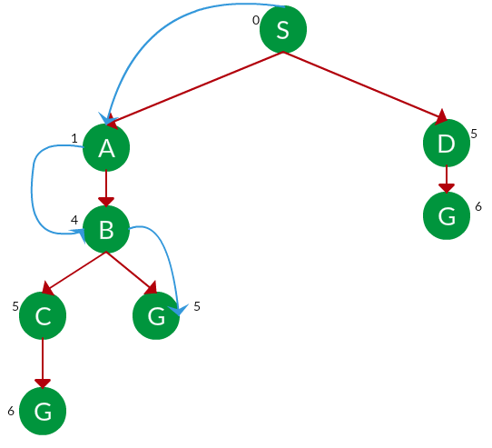

#### Bidirectional Search

Bidirectional search is an effective search technique used in the field of AI for finding the shortest path between an initial and a goal state. It operates by simultaneously running two separate search processes one forward from the initial state and the other backward from the goal state. The search stops when the two processes meet in the middle. This method is particularly useful in large search spaces where traditional search techniques like [Depth-First Search (DFS)](#Depth First Search) or [Breadth-First Search (BFS)](#Breadth First Search) may be inefficient.

Bidirectional search uses two simultaneous searches to potentially reduce the total search time. Here’s a step-by-step breakdown of how it typically works:

1. Initial Setup

   Initialize two searches. One starts from the initial state and expands forward. The other starts from the goal state and expands backward.

2. Node Expansion

   Both searches alternately expand the nearest unexplored node. For each node, all possible successors (in the forward direction) or predecessors (in the backward direction) are generated.

3. Checking Intersections

   After each expansion, check if any of the newly generated nodes are present in the frontier of the opposite search.

4. Meeting Point

   Once a common node is discovered, this node acts as the meeting point, and the optimal path can be constructed by joining the paths from the initial state to the meeting point and from the meeting point to the goal state.

### Informed Search Algorithms

Informed search uses domain knowledge in the form of heuristics to make smarter decisions during the search process. These heuristics estimate how close a state is to the goal, guiding the search more efficiently.

#### Beam Search

Beam Search is a heuristic search algorithm used in Artificial Intelligence to efficiently explore large search spaces by selecting only the most promising nodes at each level. Instead of expanding every possible path like Breadth-First Search, it keeps a limited number of best nodes based on heuristic values, making the search faster and more memory-efficient.

Beam Search works by selecting only a limited number of the best nodes at each level based on heuristic values. Suppose the beam width $W = 2$, which means only the 2 most promising nodes are selected for further expansion at every level:

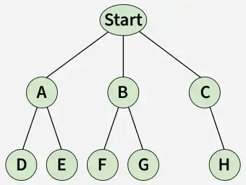

1. Start from the initial node Start.
2. Generate all successor nodes: A, B, and C.
3. Evaluate the nodes using heuristic values and select the best $W = 2$ nodes. Suppose A and B are selected, while C is discarded.
4. Expand the selected nodes:
   - $A \rightarrow D, E$
   - $B \rightarrow F, G$
5. Again evaluate the generated nodes (D, E, F, G) and keep only the best 2 nodes for further exploration.
6. Repeat the process until the goal node is reached.

#### Greedy Best-First Search

Greedy best-first search expands the node that is closest to the goal, as estimated by a heuristic function. Unlike A*, which considers both path cost and estimated remaining cost, `greedy best-first search` only prioritizes the estimated cost to the goal. While this makes it faster, it can be less optimal, often leading to sub-optimal solutions.

Greedy Best-First Search works by selecting the node that appears closest to the goal using heuristic values and continues expanding the most promising path until the destination is reached:

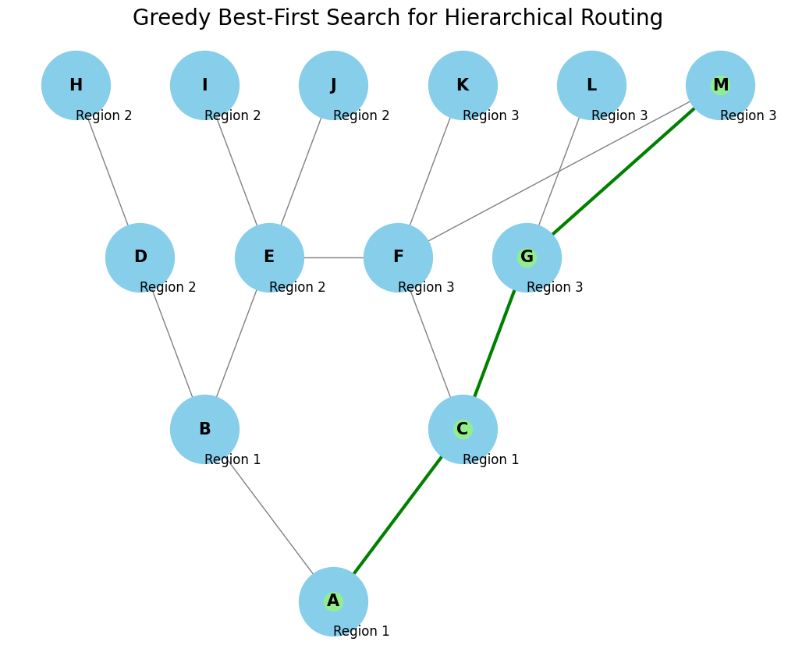

1. Starts from the initial node and evaluates neighboring nodes using heuristic values
2. Selects the node with the lowest heuristic value for expansion
3. Expands the most promising path instead of exploring all possible paths
4. Repeats the process until the goal node is reached
5. Uses heuristic estimates to reduce search time and guide traversal efficiently

#### A* Search

`A* Search Algorithm` is perhaps the most well-known heuristic search algorithm. It uses a best-first search and finds the least-cost path from a given initial node to a target node. It has a heuristic function, often denoted as $f(n) = g(n) + h(n)$, where $g(n)$ is the cost from the start node to `n`, and $h(n)$ is a heuristic that estimates the cost of the cheapest path from $n$ to the goal. `A*` is widely used in pathfinding and graph traversal.

`A*` is an informed search algorithm, means it uses the $f(n)$ function to prioritize which nodes to explore next. The process can be broken down into the following steps:

1. Initialization

   The initial node is added to the open set, a collection of nodes that are yet to be explored. The $f(n)$ value for the start node is calculated using the heuristic.

2. Loop

   A* selects the node with the lowest $f(n)$ value from the open set. This node is expanded and its neighbors are examined.

3. Goal Check

   If the node being processed is the goal node, the search terminates and the algorithm returns the path to the goal.

4. Node Expansion

   Each neighbor of the current node is evaluated based on the $g(n)$, $h(n)$ and $f(n)$ values. If a better path to a neighbor is found i.e a lower $f(n)$ then the neighbor is added to the open set or its values are updated.

5. Repeat

   This process continues until the goal is found or the open set is empty which means there is no solution.

A good heuristic function can improve A*’s performance. Some important characteristics include:

- Admissibility

  It means a heuristic never guesses a cost higher than the actual cost to the goal. This helps A* always find the shortest path. For example, using straight-line distance on a map is an admissible heuristic.

- Consistency (Monotonicity)

  It means a heuristic gives estimates that don't jump around too much. For any node and its next step, the cost to the goal should not be more than going to the next step and then to the goal. This helps A* avoid rechecking the same nodes and makes it faster.

Common Heuristics:

- Manhattan Distance

  It is used for grid-based environments where movement is restricted to horizontal and vertical directions. It calculates the sum of the absolute differences in the x*x*and y*y* coordinates between two points.

- Euclidean Distance

  The straight-line distance between two points often used when movement is allowed in any direction.

- Chebyshev Distance

  It is used when diagonal movement is allowed.

For Example:

For more info, see: [Shortest-Path Algorithms#A* Search Algorithm](../ALGO/shortest_path_problem.md)

#### AO* Search Algorithm

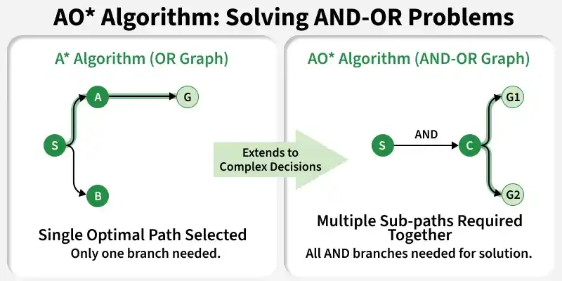

AO* algorithm is a search algorithm used in AI to find optimal solutions in AND‑OR graphs. It extends the A Star algorithm by handling more complex decision structures. In a regular OR graph (used by A Star), only one optimal path is selected. In contrast, AND–OR graphs may require selecting multiple subpaths together to reach a valid solution.

An AND–OR graph is a problem representation structure used when decisions involve both alternatives and mandatory combinations. Unlike simple trees, some nodes require selecting one option, while others require completing multiple tasks together.

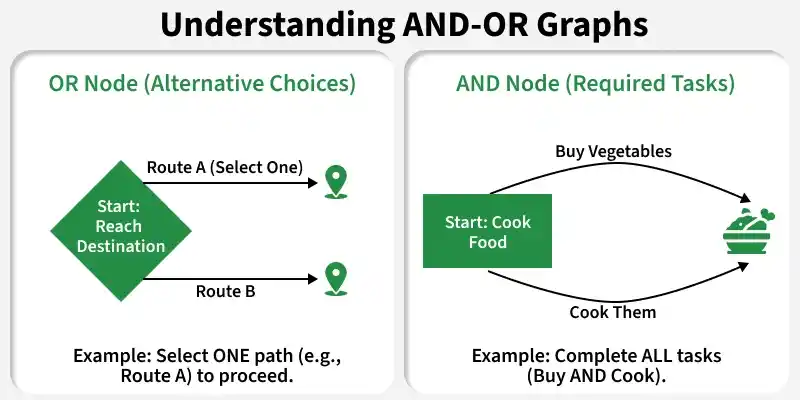

- OR Node

  An OR node represents a decision point where multiple alternatives are available, but only one option needs to be selected to move forward. The solution depends on choosing the most optimal or least costly branch among the available choices.

- AND Node

  An AND node represents a situation where multiple sub-tasks must be completed together. The solution is valid only when all child nodes are solved.

Working of AO star Algorithm:

1. Initialization

   Start with the initial (root) node and assign its heuristic value. This node represents the overall problem to be solved.

2. Path Selection

   Follow the currently most promising path based on heuristic cost values to identify nodes that are not yet expanded.

3. Node Expansion

   Select one of the unexpanded nodes and generate its successor nodes. Compute heuristic values for each successor.

4. Solution Check

   If a node has no successors or satisfies the goal condition, mark it as solved.

5. Cost Backpropagation

   Update the cost values of parent nodes based on the newly expanded successors. This adjustment moves from bottom to top.

6. Best Path Update

   Re evaluate the graph and choose the most promising path according to updated costs.

7. Termination

   Repeat the process until the start node is marked as solved or no better solution path exists.

Heuristic and Cost Modelling in AO star:

1. Heuristic Function

   The heuristic function estimates the remaining cost from a node to the goal:
   $$
   h(n) = \text{estimated cost from node n to goal}
   $$
   It guides the algorithm toward promising paths and reduces unnecessary exploration.

2. Evaluation Function

   Each node is assigned an evaluation value:
   $$
   f(n) = g(n) + h(n)
   $$

   - $g(n)$: actual cost from start node to node $n$
   - $h(n)$: heuristic estimate from node $n$ to goal
   - $f(n)$: total estimated cost

3. Cost Calculation for OR Node

   For an OR node, only one child is selected. The cost is the minimum among all children:
   $$
   f(n) = min_{i}(c(n, n_i) + f(n_i))
   $$

   - $c(n, n_i)$: Cost from node $n$ to child
   - $f(n_i)$: Evaluation cost of child

4. Cost Calculation for AND Node

   For an AND node, all children must be solved. The total cost is the sum of all child costs.
   $$
   f(n) = \sum_{i}(c(n, n_i) + f(n_i))
   $$

   - All successors contribute to the final cost
   - Every child must be included

5. Backpropagation Rule

   After expanding a node, updated costs are propagated upward:
   $$
   f(parent) \leftarrow \text{updated value based on children}
   $$
   This continues until the root node is updated.

#### Iterative Deepening A* algorithm (IDA*)

IDA* is a variant of depth-first search (DFS) that iteratively deepens its search by incrementing the cost threshold, which controls the depth of the exploration. Unlike [A*](#A* Search), which explores all possible nodes within a threshold, IDA* uses a heuristic function to evaluate and prioritize the most promising nodes. This allows it to prune less promising paths, reducing memory usage while ensuring that the search focuses on optimal routes.

The IDA* algorithm works by incrementally increasing the `threshold` based on the f-score of each node, which is calculated using the formula:
$$
f(n) = g(n) + h(n) \\
f(n) = \text{Actual cost} + \text{Estimated cost}
$$
where $h$ is admissible. here,

- $f(n)$ Total cost evaluation function.
- $g(n)$ The actual cost from the initial node to the current node.
- $h(n)$ Heuristic estimated cost from the current node to the goal state. it is based on the approximation according to the problem characteristics.

IDA* algorithm workflow:

1. Initialization

   Set the root node as the current node and compute its f-score.

2. Set Threshold

   Initialize a threshold based on the f-score of the starting node.

3. Node Expansion

   Expand the current node’s children and calculate their f-scores.

4. Pruning

   If the f-score exceeds the threshold, prune the node and store it for future exploration.

5. Path Return

   Once the goal node is found, return the path from the start node to the goal.

6. Update Threshold

   If the goal is not found, increase the threshold based on the minimum pruned value and repeat the process.

For Example:

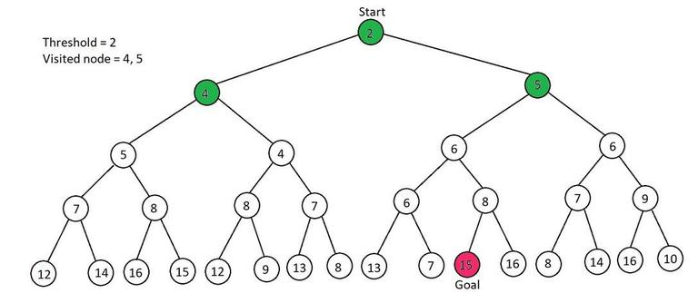

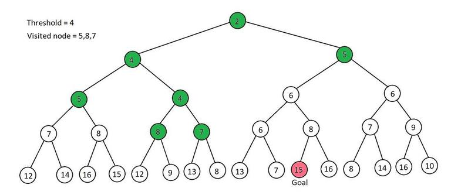

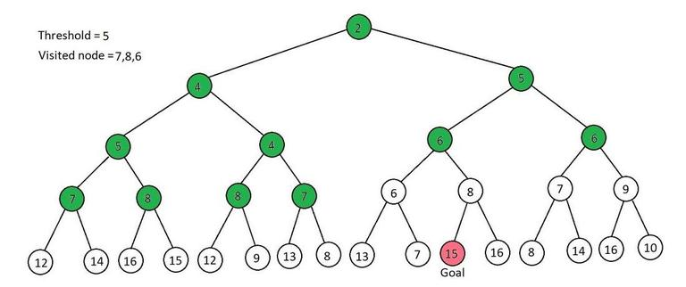

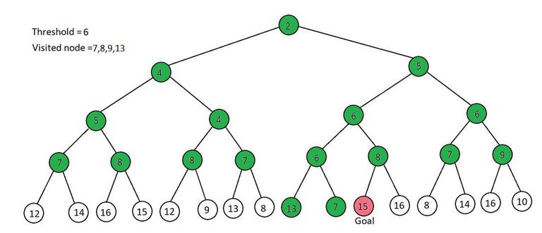

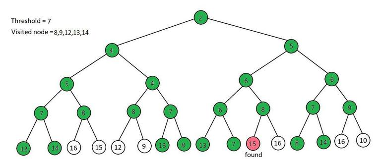

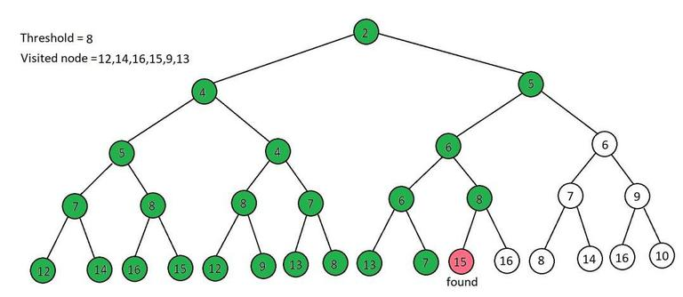

#### Memory-bounded search ( Memory Bounded Heuristic Search )

Memory-bounded search is a heuristic search technique in artificial intelligence that solves problems using a strict, fixed amount of memory. By dynamically managing and pruning its search data, it efficiently finds solutions even on devices with limited resources, making it ideal for real-time and embedded systems.

### Local Search Algorithm

Local Search Algorithms in Artificial Intelligence are optimization techniques that improve a solution by repeatedly moving to a better neighbouring state. Instead of exploring every possible path, they focus on finding efficient and practical solutions for complex problems.

#### Tabu Search

Tabu Search enhances local search by using a memory structure called the tabu list to avoid revisiting previously explored solutions. This helps to prevent cycling back to local optima and encourages exploration of new areas.

#### Hill-Climbing Search Algorithm

Hill-Climbing search algorithm is a straightforward local search algorithm that iteratively moves towards better solutions. It is often used for optimization problems where the goal is to find the peak of a landscape, represented by an objective function.

Types of Hill Climbing in Artificial Intelligence:

1. Simple Hill Climbing Algorithm

   Simple Hill Climbing is a straightforward variant of hill climbing where the algorithm evaluates each neighbouring node one by one and selects the first node that offers an improvement over the current one.

2. Steepest-Ascent Hill Climbing

   Steepest-Ascent Hill Climbing is an enhanced version of simple hill climbing. Instead of moving to the first neighboring node that improves the state, it evaluates all neighbors and moves to the one offering the highest improvement (steepest ascent).

3. Stochastic Hill Climbing

   Stochastic Hill Climbing introduces randomness into the search process. Instead of evaluating all neighbors or selecting the first improvement, it selects a random neighboring node and decides whether to move based on its improvement over the current state.

Hill Climbing follows these steps:

1. Initial State

   Start with an arbitrary or random solution (initial state).

2. Neighboring States

   Identify neighboring states of the current solution by making small adjustments (mutations or tweaks).

3. Move to Neighbor

   If one of the neighboring states offers a better solution (according to some evaluation function), move to this new state.

4. Termination

   Repeat this process until no neighboring state is better than the current one. At this point, we have reached a local maximum or minimum.

The state-space diagram is a visual representation of all possible states the search algorithm can reach, plotted against the values of the objective function (the function we aim to maximize):

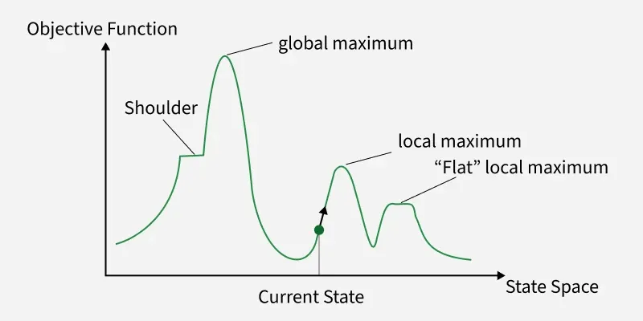

- `X-axis`: Represents the state space which includes all the possible states or configurations that the algorithm can reach.
- `Y-axis`: Represents the values of the objective function corresponding to each state.

#### Simulated Annealing

Simulated Annealing is inspired by the annealing process in metallurgy, where materials are heated and then gradually cooled to remove defects. It allows for occasional moves to worse solutions to escape local optima, with the probability of such moves decreasing over time.

The algorithm starts with an initial solution and a high "temperature," which gradually decreases over time. Here’s a step-by-step breakdown of how the algorithm works:

1. Initialization

   Begin with an initial solution So and an initial temperature To. he temperature controls how likely the algorithm is to accept worse solutions as it explores the search space.

2. Neighborhood Search

   At each step, a new solution $S'$ is generated by making a small change (or perturbation) to the current solution $S$.

3. Objective Function Evaluation

   The new solution $S'$ is evaluated using the objective function. If $S'$ provides a better solution than $S$, it is accepted as the new solution.

4. Acceptance Probability

   If $S'$ is worse than $S$, it may still be accepted with a probability based on the temperature and the difference in objective function values. The acceptance probability is given by:
   $$
   P(accept) = e^{-\frac{\Delta E}{T}}
   $$

5. Cooling Schedule

   After each iteration, the temperature is decreased according to a predefined cooling schedule, which determines how quickly the algorithm converges. Common cooling schedules include linear, exponential, or logarithmic cooling.

6. Termination

   The algorithm continues until the system reaches a low temperature (i.e., no more significant improvements are found), or a predetermined number of iterations is reached.

#### Genetic Algorithms

A Genetic Algorithm (GA) is a population-based evolutionary optimization technique inspired by the principles of natural selection and genetics. It works by iteratively evolving a population of candidate solutions using biologically motivated operators such as selection, crossover and mutation to find optimal or near-optimal solutions to complex problems where traditional optimization techniques are ineffective.

The Core Components of Genetic Algorithms:

1. Population

   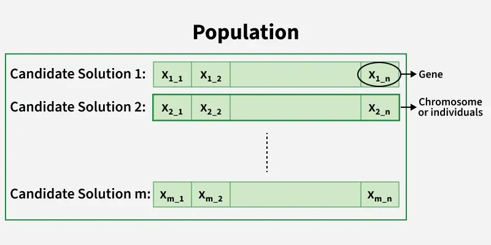

   A population is a collection of candidate solutions (individuals) that exist at a particular stage (generation) of the genetic algorithm. Instead of working with a single solution, GAs simultaneously evaluate and evolve multiple solutions which helps maintain diversity and reduces the risk of getting trapped in local optima.

2. Chromosome

   A chromosome represents a complete candidate solution to the problem. It is a structured collection of genes that encodes all decision variables required to evaluate a solution using the fitness function.

3. Gene

   A gene is the smallest unit of information in a chromosome and represents a single variable, parameteror trait of the solution. The collective behavior of all genes determines the quality of the chromosome.

4. Encoding Methods

   Encoding refers to the way candidate solutions are represented inside chromosomes. Choosing an appropriate encoding is critical because it directly impacts the effectiveness of genetic operators.

5. Fitness Function

   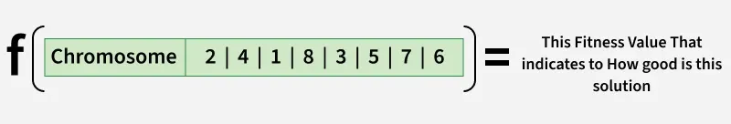

   The fitness function is a mathematical formulation that evaluates how well a chromosome solves the given problem. It acts as the guiding force of the genetic algorithm by determining which individuals are more likely to reproduce.

6. Termination Criteria

   Termination criteria define the conditions under which the genetic algorithm stops executing. Proper termination prevents unnecessary computation while ensuring solution quality. Common termination conditions:

   - Maximum number of generations reached
   - Desired or threshold fitness achieved
   - No improvement in fitness for several generations
   - Computational time limit exceeded

7. Selection

   Selection is the process of choosing chromosomes from the current population to act as parents for the next generation. The goal is to give preference to fitter individuals while still maintaining population diversity. Types of solutions include:

   - Roulette Wheel Selection

     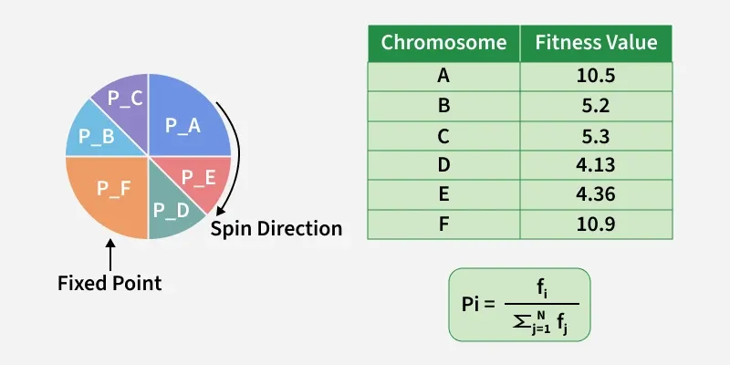

     It is a fitness-proportionate selection technique where each individual’s probability of being selected is directly proportional to its fitness value. Individuals with higher fitness occupy larger segments of the roulette wheel, making them more likely to be chosen.

   - Tournament Selection

     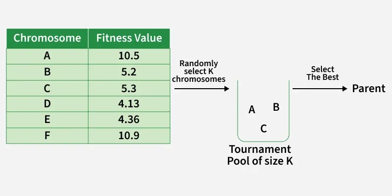

     It randomly selects a small group of individuals from the population and chooses the fittest among them as a parent. This process is repeated until the required number of parents is selected.

   - Stochastic Universal Sampling (SUS Selection)

     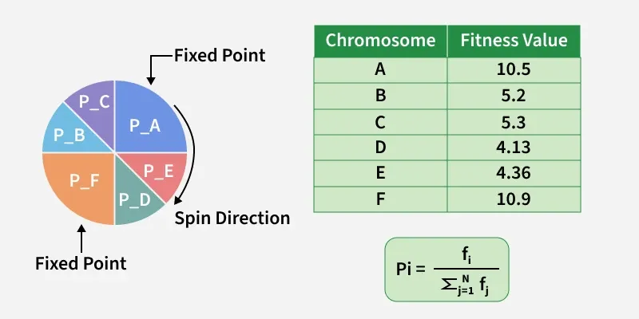

     It is an improved version of fitness-proportionate selection designed to reduce the randomness and sampling bias present in standard roulette wheel selection. Instead of using a single random pointer, SUS uses multiple equally spaced pointers to select individuals from the population.

8. CrossOver

   Crossover is a genetic operator that combines genetic material from two parent chromosomes to generate new offspring. It enables the algorithm to exploit existing high-quality building blocks. Types of crossover are:

   - One Point Crossover

     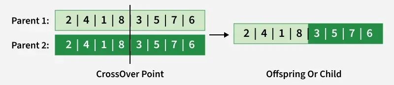

     A random Point is chosen to be The CrossOver Point , then we fill the child with genes from both parents.

   - Multi Point Crossover

     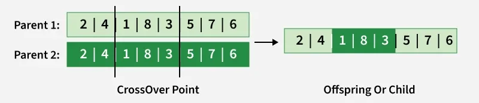

     A random two Points are chosen to be The CrossOver Points , then we fill the child with genes from both parents.

   - Davis Order Crossover (OX1)

     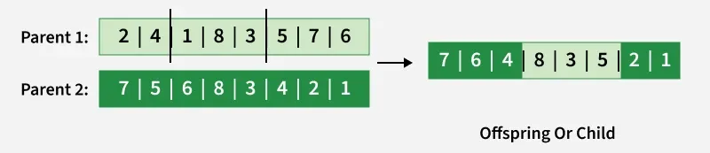

     We Choose two random crossover points in the first parent and we copy that segment into the Child, then we fill the rest of genes in our child with the genes from the second Parent.

   - Uniform CrossOver

     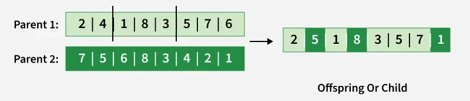

     We flip a coin for each genes in our two parents to decide whether or not it’ll be included in the off-spring (Child ).

9. Mutation

   Mutation introduces random changes in genes to maintain genetic diversity within the population. It helps prevent premature convergence and enables exploration of new solutions. Types of mutation are:

   - Bit flip Mutation

     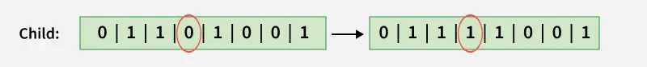

     We select one or more random points (Bits) and flip them. This is used for binary encoded Genetic Algorithms.

   - Swap Mutation

     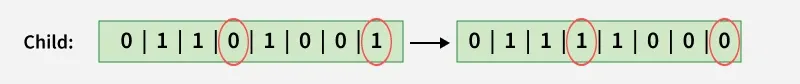

     We Choose two Point and we switch them.

   - Scramble Mutation

     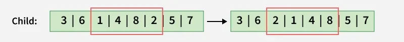

     We choose a random segment in The Current Chromosome and we interchange the values.

   - Inversion Mutation

     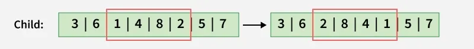

     We choose a random segment in The Current Chromosome and we reverse The Order of the values.

The working of Genetic Algorithms:

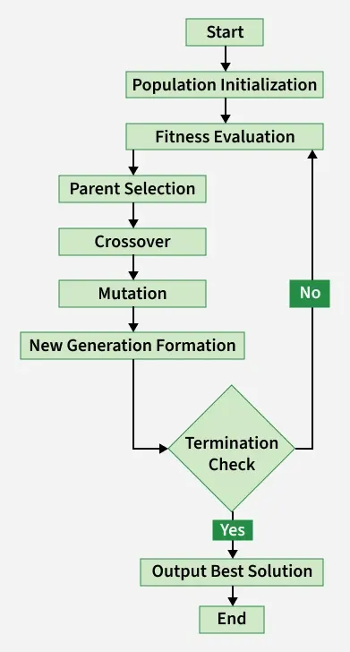

- Population Initialization: Generate an initial population of chromosomes randomly within the problem constraints.
- Fitness Evaluation: Evaluate each chromosome using the fitness function to measure solution quality.
- Parent Selection: Select parent chromosomes based on fitness using methods such as Roulette, Tournamentor SUS selection.
- Crossover: Combine genetic material from selected parents to produce offspring.
- Mutation: Apply random changes to offspring genes to maintain diversity.
- New Generation Formation: Replace the old population with newly generated offspring.
- Termination Check: Stop the algorithm if termination criteria are satisfied.
- Output Solution: Return the best chromosome obtained during evolution.

#### Ant Colony Optimization (ACO)

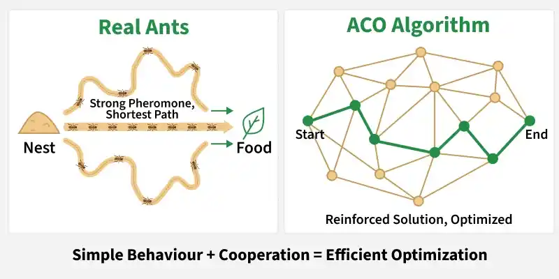

Ant Colony Optimization (ACO) is a nature-inspired algorithm that learns from how real ants collectively find the shortest path to food without any central control. Instead of fixed rules, it improves solutions over time through simple behaviour and cooperation making it effective for complex optimization problems.

Ant Colony Optimization operates through an iterative loop that progressively refines solutions based on collective learning:

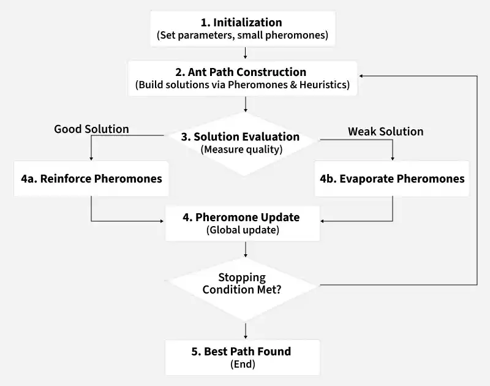

1. Initialization

   Set initial parameters and assign small pheromone values to all paths.

2. Ant path construction

   Each ant builds a solution by moving through the problem space based on pheromones and heuristic information.

3. Solution evaluation

   The quality of each solution is measured using a fitness or cost function.

4. Pheromone update

   Good solutions receive more pheromone reinforcement, while pheromones on other paths evaporate.

5. Iteration until best path is found

   The process repeats until a stopping condition is met or the best path is discovered.

Calculating the Shortest Path:

1. Probability of Choosing the Next Path

   An ant does not randomly choose a path. It selects the next node using probability.
   $$
   P_{ij} = \frac{(\tau_{ij})^{\alpha} \cdot (\eta_{ij})^{\beta}}{\sum(\tau_{ik})^{\alpha} \cdot (\eta_{ik})^{\beta}}
   $$

   - $\tau_{ij}$: pheromone on path i to j
   - $\eta_{ij}$: how good the path looks (usually shorter distance)
   - $\alpha$: importance of pheromone
   - $\beta$: importance of distance

2. Heuristic Value (Distance Information)

   Heuristic value represents how good a path looks based on distance. For shortest path problems:
   $$
   \eta_{ij} = \frac{1}{d_{ij}}
   $$

   - $d_{ij}$: distance between nodes i and j
   - Smaller distance: larger heuristic value

3. Pheromone Update Rule

   After all ants complete their paths, pheromones are updated:
   $$
   \tau_{ij} = (1 - \rho)\tau_{ij} + \Delta \tau_{ij}
   $$

   - Old pheromone partially evaporates
   - New pheromone is added on good paths
   - $\rho$: evaporation rate (between 0 and 1)

4. Pheromone Added by an Ant

   Each ant adds pheromone based on path quality:
   $$
   \Delta \tau_{ij} =
   \begin{cases}
   \frac{Q}{L}, &\text{if the path is used}\\
   0, &\text{otherwise}
   \end{cases}
   $$

   - $Q$: constant value
   - $L$: total length of the path
   - Shorter path: more pheromone added

#### Particle Swam Optimization (PSO)

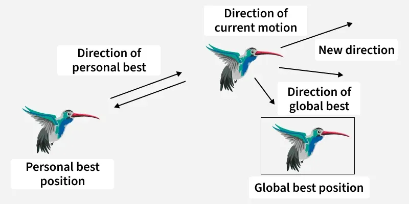

Particle Swarm Optimization (PSO) is a stochastic population based optimization technique inspired by swarm intelligence in nature. It is designed to solve complex optimization problems where the search space is large, non-linear or unknown, where traditional deterministic methods are ineffective.

Particle Swarm Optimization (PSO) is an iterative, population based optimization algorithm. It works by moving a group of particles (candidate solutions) through the search space using simple mathematical rules based on personal and collective experience.

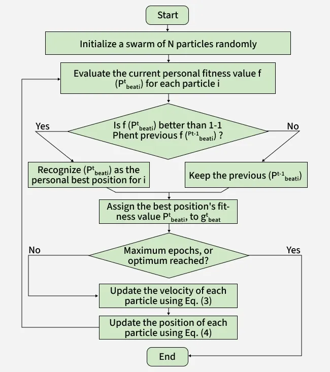

1. Initialization

   Randomly initialize N particles within the search space [$minx, maxx$]. Assign a random velocity to each particle. Evaluate the fitness value of each particle
   $$
   pBest = \text{current position} \\
   gBest = \text{best pBest among all particles}
   $$

2. Velocity Update

   At each iteration the velocity of a particle is updated using:
   $$
   v_{t}^{t + 1} = w \cdot v_{i}^{t} + c_1 \cdot r_1 \cdot (pBest_{i} - x_{i}^{t}) + c_2 \cdot r_2 \cdot(gBest - x_{i}^{t})
   $$
   where

   - $w$: inertia weight (controls exploration)
   - $c_1$: cognitive coefficient (self-learning)
   - $c_2$: social coefficient (swarm learning)
   - $r_1, r_2$: random values in [0,1]

3. Position Update

   After updating velocity the position is updated as:
   $$
   x_{i}^{t + 1} = x_{i}^{t} + v_{i}^{t + 1}
   $$
   If the new position goes outside [$minx, maxx$] clip it to the boundary.

4. Update Best Positions

   - If current fitness is better than pBest, update pBest
   - If current fitness is better than gBest, update gBest

5. Convergence

   - Repeat Steps 2–4 for a fixed number of iterations or until convergence
   - The swarm gradually moves toward the optimal solution

### Adversarial Search Algorithms

#### Mini-Max Algorithm

`Mini-Max algorithm` is a decision-making algorithm used in artificial intelligence, particularly in game theory and computer games. It is designed to minimize the possible loss in a worst-case scenario (hence "min") and maximize the potential gain (therefore "max").

The Min-Max value of a node in the game tree is calculated using the following recursive formulas:

1. Maximizing Player's Turn
   $$
   Max(s) = max_{a \in A(s)} Min(Result(s, a))
   $$
   here:

   - $Max(s)$ is the maximum value the maximizing player can achieve from state $s$.
   - $A(s)$ is the set of all possible actions from state $s$.
   - Result($s, a$) is the resulting state from taking action $a$ in state $s$.

   Min(Result($s, a$)) is the value for the minimizing player from the resulting state.

2. Minimizing Player's Turn
   $$
   Min(s) = min_{a \in A(s)}Max(Result(s, a))
   $$
   here:

   - $Min(s)$ is the minimum value the minimizing player can achieve from state $sss$.
   - The other terms are similar to those defined above.

3. Terminal States

   For terminal states, the utility value is directly assigned:
   $$
   Utility(s) = 
   \begin{cases}
   1, &\text{if the maximizing player wins from state } s \\
   0, &\text{if the game is a draw from state } s \\
   -1, &\text{if the minimizing player wins from state } s
   \end{cases}
   $$

#### Alpha-Beta Pruning

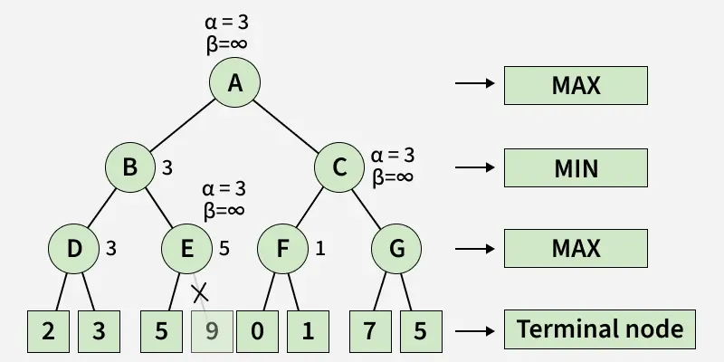

Alpha-Beta Pruning is an optimisation technique that significantly improves the efficiency of Minimax. It removes (prunes) branches that cannot possibly affect the final decision, avoiding unnecessary computations.

How Alpha-Beta Pruning Works:

1. Initialization

   Set initial values:
   $$
   \alpha = -\infty \quad \beta = +\infty
   $$
   These represent the worst possible scores for Maximizer and Minimizer.

2. Max Node Evaluation

   For each child of a Max node recursively evaluate using Minimax with Alpha-Beta pruning. Update alpha:
   $$
   \alpha=max(\alpha,value)
   $$
   If $\alpha\geq\beta$ stop evaluating remaining children ($\beta - cutoff$).

3. Min Node Evaluation

   For each child of a Min node Recursively evaluate using Minimax with Alpha-Beta pruning Update Beta:
   $$
   \beta=min(\beta,value)
   $$
   If $\beta \leq \alpha$ stop evaluating remaining children ($\alpha - cutoff$).

#### Expectimax Search Algorithm

The Expectimax search algorithm is used in decision-making problems where outcomes are probabilistic. It extends the Minimax algorithm by incorporating "chance nodes," representing uncertainty in the environment. At these chance nodes, the algorithm calculates the expected value of outcomes based on probabilities, rather than assuming the worst-case scenario.

In Expectimax, there are three types of nodes:

1. Max Nodes

   Represent the decision-maker (usually the AI player), where the goal is to maximize the expected utility.

2. Min Nodes

   Represent an adversary (in competitive games), where the goal is to minimize the utility (as in Minimax).

3. Chance Nodes

   Represent random events with probabilistic outcomes, where the algorithm computes the expected value based on possible results.

The following steps outline how Expectimax works:

1. Max Nodes (Player's Turn):
   - The AI player is at a max node.
   - The goal is to choose the move that maximizes the expected utility.
   - The AI evaluates all possible moves and selects the one with the highest expected value.
2. Min Nodes (Opponent’s Turn):
   - If the game has an opponent (such as in two-player games), the opponent is at a min node.
   - The goal of the opponent is to minimize the AI's utility, so the opponent is assumed to play optimally by selecting the move that minimizes the utility for the AI.
3. Chance Nodes (Random Events):
   - At chance nodes, the AI does not control the outcome, and the result is determined by a random process.
   - The algorithm calculates the expected value of the chance node by summing the products of possible outcomes and their probabilities.

#### Monte Carlo Tree Search (MCTS)

Monte Carlo Tree Search (MCTS) is a method used for problems with very large decision spaces, such as game of Go, which has around 10170 possible states. It builds a search tree step-by-step using random simulations to choose better moves.

1. Selection

   Starting at the root node, MCTS moves down the tree using a selection rule. The most common rule is UCT (Upper Confidence Bounds for Trees), which balances:

   - Exploitation: choosing moves with higher average reward
   - Exploration: trying moves with less information

2. Expansion

   When the selection phase reaches a leaf node that isn't terminal, the algorithm expands the tree by adding one or more child nodes representing possible actions from that state.

3. Simulation Phase

   From the newly added node, a random playout is performed until reaching a terminal state. During this phase, moves are chosen randomly or using simple heuristics, making the simulation computationally inexpensive.

4. Backpropagation Phase

   The result of the simulation is propagated back up the tree to the root, updating statistics (visit counts and win rates) for all nodes visited during the selection phase.

The selection phase relies on the `UCB1 (Upper Confidence Bound)` formula to determine which child node to visit next:
$$
UCB1(i) = \overline{X_i} + c\sqrt{\frac{\ln N}{n_i}}
$$
where:

- $\overline{X_i}$ is the average reward of node $i$
- $c$ is the exploration parameter (typically $\sqrt{2}$)
- $N$ is the total number of visits to the parent node
- $n_i$ is the number of visits to node $i$

#### SSS (State Space Search) Algorithm

`State Space Search` is used to solve problems by finding different possible states and their transitions. In simple terms it’s like finding the best route to goal by trying different paths.

The core idea behind state space search is to think of the problem as a graph where:

- `Nodes` represent different states of the problem.
- `Edges` represent transitions or actions that change one state into another.

Following steps are involved in the state space search process:

1. Define the State Space

   Identify all possible states and their transitions. To do this model the problem in a way that includes all relevant configurations and actions.

2. Pick a Search Strategy

   Choose a method for exploring the state space. Common strategies include:

   - [Breadth-First Search (BFS)](#Breadth First Search): Explores all nodes at one depth level before moving to the next, ideal for unweighted graphs.
   - [Depth-First Search (DFS)](#Depth-Limited Search): Explores a branch as deeply as possible before backtracking. It uses less memory but may not guarantee completeness or optimality.
   - [Uniform Cost Search (UCS)](#Uniform Cost Search): Expands the least costly node first which ensures the lowest-cost solution.
   - [Greedy Best-First Search](#Greedy Best-First Search): Expands nodes that appear closest to the goal based on a heuristic.
   - [A\* Search Algorithm](#A* Search): Combines path cost and heuristic to guarantee completeness and optimality.

3. Start the Search

   Add initial state and begin the search from there.

4. Extend the Nodes

   Using the selected search technique it expands node from start state and helps in generating successor states and adding them to the frontier. If a state matches the goal it retrace path to the solution and stop the search.

5. Address State Repetition

   Prevent revisiting same state by tracking visited states helps in avoiding cycles and unnecessary exploration.

6. End the Search

   The search ends when the goal state is found or when all states have been explored without finding a solution.

---

## Dynamic Programming Algorithms

### Bellman-Ford Algorithm

Bellman–Ford computes single-source shortest paths even when some edges have negative weights, and it detects negative-weight cycles reachable from the source.

Algorithm:

1. Initialize distances: dist[s] = 0, others = INF.
2. Repeat V-1 times: relax every edge (u, v) with weight w: if dist[u] + w < dist[v], set dist[v] = dist[u] + w and parent[v] = u.
3. Check for negative cycles: if any edge can still be relaxed, report a negative cycle.

For more info, see: [Shortest-Path Algorithms#Bellman–Ford  Algorithm](../ALGO/shortest_path_problem.md)

### Floyd-Warshall Algorithm

Given a matrix `dist[][]` of size $n \times n$, where dist[i][j] represents the weight of the edge from node i to node j.

- If there is no direct edge, dist[i][j] is set to INF (a large value, i.e., 108).
- The diagonal entries dist[i][i] are $0$, since the distance from a node to itself is zero.
- The graph may contain negative edge weights, but it does not contain any negative-weight cycles.

Determine the shortest path distance between all pairs of nodes in the graph.

Algorithm:

1. Start by updating the distance matrix by treating each vertex as a possible intermediate node between all pairs of vertices.
2. Iterate through each vertex, one at a time. For each selected vertex `k`, attempt to improve the shortest paths that pass through it.
3. When we pick vertex number k as an intermediate vertex, we have already considered vertices {0, 1, 2, .. k-1} as intermediate vertices. 
4. For every pair **(i, j)** of the source and destination vertices, respectively, there are two possible cases. 
   - k is not an intermediate vertex in the shortest path from i to j. We keep the value of dist[i][j] as it is. 
   - k is an intermediate vertex in the shortest path from i to j. We update the value of dist[i][j] as dist[i][k] + dist[k][j], if dist[i][j] > dist[i][k] + dist[k][j]
5. Repeat this process for each vertex `k` until all intermediate possibilities have been considered.

For more info, see: [Shortest-Path Algorithms#Floyd Warshall Algorithm](../ALGO/shortest_path_problem.md)

### Viterbi Algorithm

The Viterbi algorithm is a dynamic programming algorithm for finding the most likely sequence of hidden states in a Hidden Markov Model (HMM). It is widely used in various applications such as speech recognition, bioinformatics, and natural language processing.

A Hidden Markov Model (HMM) is a statistical model that represents systems with hidden states and observable events. It consists of:

- States: Hidden conditions that are not directly observable.
- Observations: Observable events influenced by the hidden states.
- Transition Probabilities: Probabilities of moving from one state to another.
- Emission Probabilities: Probabilities of observing a particular event given a state.
- Initial State Probabilities: Probabilities of the system starting in a particular state.

Initialization is the first step of the Viterbi algorithm. It sets up the initial probabilities for the starting states based on the initial state probabilities and the emission probabilities for the first observation.

Mathematically it can be represented as:
$$
V_1(j) = \pi_{j} \cdot b_{j}(o_1) \quad \forall_{j \in \{1, ..., N\}} \\
Path_{j}(1) = [j] \quad \forall_{j \in \{1, ..., N\}}
$$
The Forward Algorithm is used to compute the probability of observing a sequence of observations given an HMM. It is a dynamic programming algorithm that recursively calculates the probabilities of partial observation sequences:

1. Initialization
   $$
   \alpha_{1}(j) = \pi_{j} \cdot b_j(o_{1})
   $$

2. Recursion
   $$
   \alpha_{t}(j) = \sum_{i = 1}^{N}\alpha_{t - 1}(i) \cdot a_{ij} \cdot b_j(o_t)
   $$

3. Termination
   $$
   P(0 | \lambda) = \sum_{j = 1}^{N}\alpha_{T}(j)
   $$

The Backward Algorithm complements the Forward Algorithm by computing the probability of the ending part of the observation sequence, starting from a given state:

1. Initialization
   $$
   \beta_{T}(j) = 1
   $$

2. Recursion
   $$
   \beta_{t}(i) = \sum_{j = 1}^{N}\beta_{t + 1}(j) \cdot a_{ij} \cdot b_{j}(o_{t + 1})
   $$

3. Termination
   $$
   P(O | \lambda) = \sum_{j = 1}^{N}\pi_{j} \cdot b_{j}(o_1) \cdot \beta_{1}(j)
   $$

Decoding in the context of HMMs refers to determining the most likely sequence of hidden states given an observation sequence. The Viterbi algorithm achieves this by maximizing the probability of the hidden state sequence.

1. Recursion
   $$
   V_t(j) = max_{i}[V_{t - 1}(i) \cdot a_{ij} \cdot b_{j}(o_t)] \quad \forall j \in \{1, ..., N\} \\
   Path_{j}(t) = [\text{arg max}_{i}[V_{t - 1}(i) \cdot a_{ij}], j]
   $$

2. Termination
   $$
   P* = max_{j}V_{T}(j) \\
   \text{Best Path} = \text{arg max}_{j}V_{T}(j)
   $$

### Dynamic Time Warping (DTW)

`Dynamic Time Warping (DTW)` is an algorithm used to compare two time-based datasets (like two sequences of numbers) to find similarities. It does this by adjusting the timings of the data points to minimize the difference between the two datasets. Compared to simple methods such as `Euclidean distance`, which are only effective when the sequences are equal in length and perfectly aligned, DTW can be used to compare sequences of unequal lengths and out-of-sync sequences. This quality has made DTW extremely useful in `speech recognition`, `gesture analysis`, and `finance`, where timing difference is very often observed.

DTW workflow:

1. Distance Matrix Construction

   The first step in DTW involves `constructing a distance matrix` between the two sequences. Each matrix element represents the distance (typically Euclidean) between corresponding points in the two sequences.

2. Cost Matrix and Accumulated Cost

   Next, a `cost matrix` is created by accumulating the minimum distances from the start of the sequences to the current point. This accumulated cost represents the optimal path's cumulative distance up to that point.

3. Optimal Path Finding

   The optimal alignment path is found by tracing back from the `last element in the cost matrix to the first element`. This path represents the best alignment between the two sequences, minimizing the total distance.

4. Warping Path

   The warping path shows how one sequence can be warped (stretched or compressed) along the time axis to match the other sequence best.

Given two sequences $A = \{a_1, a_2, ..., a_n\}$ and $B = \{b_1, b_2, ..., b_m\}$, where $a_i$ and $b_j$ are elements of the sequences $A$ and $B$, respectively, DTW computes the minimum cumulative distance between them:

- Cost Matrix

  Define a cost matrix $C$ of size $n \times m$, where $C(i, j)$ represents the cost (or distance) of aligning $a_i$ with $b_j$. The cost is typically calculated using a distance metric, such as the Euclidean distance:
  $$
  C(i, j) = distance(a_i, b_j) = |a_i - b_j|
  $$

- Accumulated Cost matrix

  Construct an accumulated cost matrix $D$ where each element $D(i, j)$ represents the minimum cumulative cost to align the first iii elements of $A$ with the first $j$ elements of $B$:
  $$
  D(i, j) = C(i, j) + min
  \begin{cases}
  D(i - 1, j) \\
  D(i, j - 1) \\
  D(i - 1, j - 1)
  \end{cases}
  $$
  here:

  - $D(i - 1, j)$ corresponds to an insertion
  - $D(i, j - 1)$ corresponds to a deletion
  - $D(i - 1, j - 1)$ corresponds to a match (or diagonal move).

- Boundary Conditions

  The boundary conditions are initialized as follows:
  $$
  D(1, 1) = C(1, 1) \\
  D(i, 1) = D(i - 1, 1) + C(i, 1) \quad for\ i = 2, ..., n \\
  D(1, j) = D(1, j - 1) + C(1, j) \quad for\ j = 2, ..., m
  $$

- Optimal Warping Path

  The optimal warping path $W = \{(i_1, j_1), (i_2, j_2), ..., (i_L, j_L)\}$ is a sequence of matrix indices that minimizes the cumulative distance. This path is found by backtracking from $D(n, m)$ to $D(1, 1)$ by following the minimum cost direction at each step. The overall DTW distance is given by: $DTW(A, B) = D(n, m)$

### Levenshtein Distance (Edit Distance) Algorithm

*Levenshtein distance* is a measure of the similarity between two strings, which takes into account the number of insertion, deletion and substitution operations needed to transform one string into the other.

### Longest Common Subsequence (LCS) Algorithm

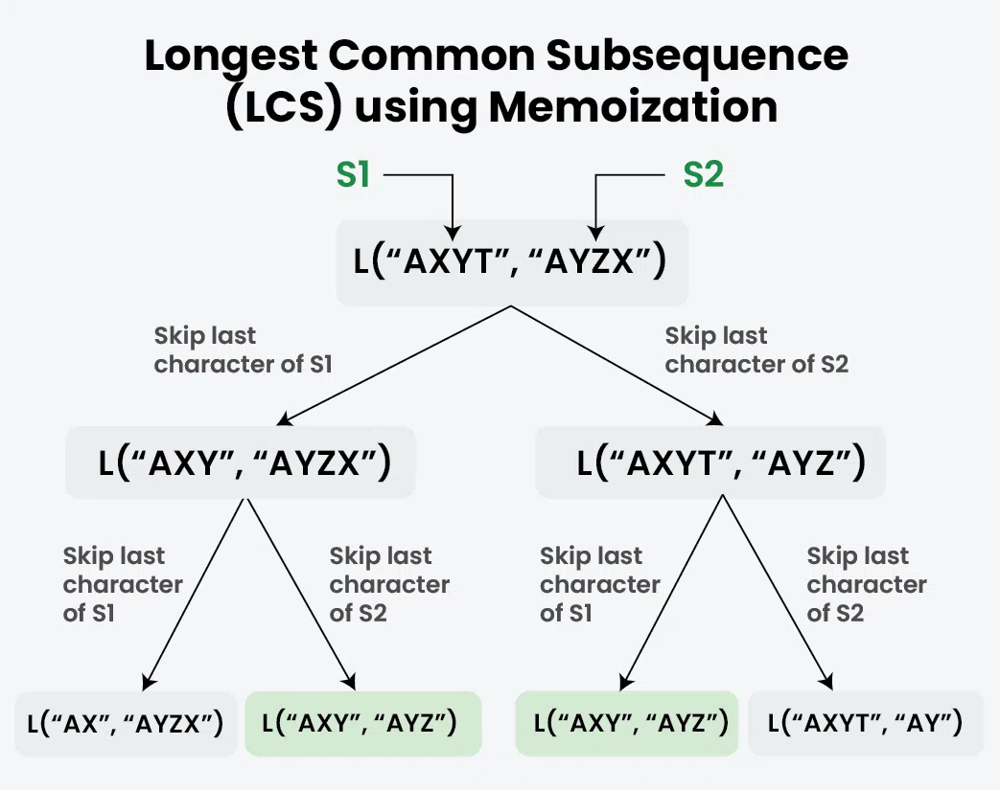

If we use the above recursive approach for strings "`AXYT`" and "`AYZX`", we will get a partial recursion tree as shown below. Here we can see that the subproblem `L("AXY", "AYZ")` is being calculated more than once. If the total tree is considered there will be several such overlapping subproblems. Hence we can optimize it either using memoization or tabulation.

---

## Linear Programming

Linear programming is a mathematical concept that is used to find the optimal solution of a linear function. This method uses simple assumptions for optimizing the given function.

### Simplex Algorithm

TODO

### Dual Simplex Method

TODO

---

## Optimization Algorithms

### Gradient Descent

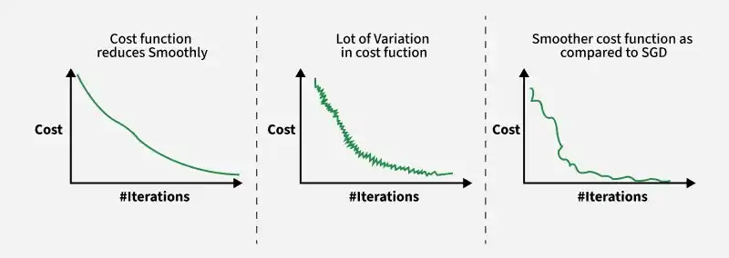

Gradient Descent is an optimization algorithm used to minimize the error of a machine learning model by updating parameters in the direction of decreasing loss.

Formula:
$$
\text{General Update Rule:} w = w - \alpha\frac{\partial L}{\partial w} \\
b = b - \alpha \frac{\partial L}{\partial b}
$$
where:

- $\alpha$: learning rate
- $L$: loss function
- $\frac{\partial L}{\partial w}, \frac{\partial L}{\partial b}$: gradients of loss

#### Gradient Descent in Linear Regression

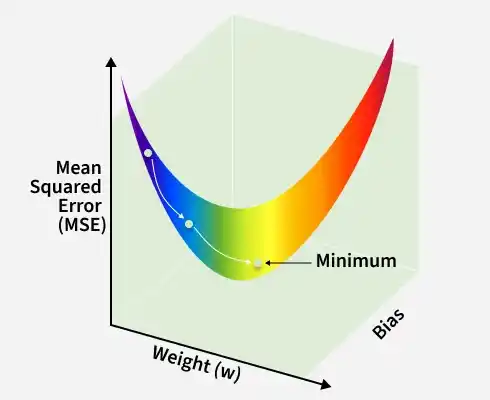

Gradient Descent helps the Linear Regression model find the best values of weight $w$ and bias $b$ so that the prediction error becomes as small as possible. It starts with random values and gradually adjusts them in the direction that reduces the loss.

Formula:
$$
\hat{y} = wx + b \\
L = \frac{1}{2n} \sum_{i = 1}^{n}(y_i - \hat{y_i})^2
$$
where:

- $x$: input feature
- $w$: weight (slope of the line)
- $b$: bias/intercept
- $\hat{y}$: predicted output
- $y_i$: true target value
- $n$: number of samples
- $L$: MSE loss

#### Gradient Descent in Logistic Regression

Gradient descent helps logistic regression find optimal parameter values by reducing prediction error over time.

Formula:
$$
\sigma(z) = \frac{1}{1 + e^{-z}} \\
L = -\frac{1}{n} \sum_{i = 1}^{n}(y_i \ln(\hat{p_i}) + (1 - y_i)\ln(1 - \hat{p_i}))
$$

where:

- $z = w \cdot x + b$: linear combination
- $\sigma(z)$: sigmoid output
- $\hat{P_i}$: predicted probability
- $y_i \in \{0, 1\}$: actual label
- $n$: number of samples
- $L$: cross-entropy loss

#### Gradient Descent in Softmax Regression

Gradient descent helps the softmax regression model learn optimal parameters by reducing prediction error and improving class probabilities.

Formula:
$$
\hat{p_{i, k}} = \frac{e^{z_{i,k}}}{\sum_{j = 1}^{K}e^{z_{i, j}}} \\
L = -\frac{1}{n} \sum_{i = 1}^{n} \sum_{k = 1}^{K}y_{i, k}\ln(\hat{p_{i,k}})
$$
where:

- $z_{i,k}$: score(logit) for class k for sample $i$
- $\hat{P_{i,k}}$: probability that sample $i$ belongs to class $k$.
- $K$: number of classes
- $y_{i,k}$: one-hot encoded true label
- $n$: number of samples
- $L$: multiclass cross-entropy loss

#### Gradient Descent in Neural Network

Gradient descent helps a neural network learn optimal weights by reducing prediction error, working together with backpropagation to improve performance.

Hidden Layer:
$$
a^{(1)} = ReLU(W^{(1)}x + b^{(1)})
$$
Output Layer:
$$
\hat{y} = softmax(W^{(2)}a^{(1)} + b^{(2)})
$$
Loss:
$$
L = \sum_{k = 1}^{K}y_k \ln(\hat{y_k})
$$
where:

- $W^{(1)}, W^{(2)}$: weight matrices
- $b^{(1)}, b^{(2)}$: bias vectors
- $a^{(1)}$: hidden layer activations
- $x$: input vector
- $\hat{y}$: softmax output probabilities
- $y_k$: true class label (one-hot)
- $K$: number of classes
- $L$: cross-entropy loss

#### Mini-Batch Gradient Descent

Mini-batch gradient descent updates model parameters using small data subsets, balancing the speed of [SGD](#Stochastic Gradient Descent (SGD)) and the stability of batch gradient descent for efficient and stable training.

Algorithm:

Let:

- $\theta$ = model parameters
- $\text{max\_iters}$ = number of epochs
- $\eta$ = learning rate

For itr = 1, 2, 3, ..., max_iters:

- Shuffle the training data. It is optional but often done for better randomness in mini-batch selection.
- Split the dataset into mini-batches of size $b$.

For each mini-batch $(X_{mini}, y_{mini})$:

1. Forward Pass on the batch X_min:

   Make predictions on the mini-batch
   $$
   \hat{y} = f(X_{mini}, \theta)
   $$
   Compute error in predictions $J(\theta)$ with the current values of the parameters
   $$
   J(\theta) = L(\hat{y}, y_{mini})
   $$

2. Backward Pass:

   Compute gradient:
   $$
   \nabla_{\theta}J(\theta) = \frac{\partial J(\theta)}{\partial \theta}
   $$

3. Update Parameters:

   Gradient descent rule: 
   $$
   \theta = \theta - \eta \nabla_{\theta}J(\theta)
   $$

### Momentum-Based Gradient Optimizer

Momentum-based optimizers improve standard gradient descent by adding a momentum term that helps move more efficiently across the loss surface.

Formula:
$$
v_{t + 1} = \beta v_{t} + (1 - \beta)\nabla L(w_t) \\
w_{t + 1} = w_t - \eta v_{t + 1}
$$
where:

- $v_t$ is the velocity i.e., a running average of gradients
- $\beta$ is the momentum factor, typically a value between 0 and 1 (often around 0.9)
- $\nabla L(w_t)$ is the current gradient of the loss function
- $\eta$ is the learning rate

#### Nesterov Accelerated Gradient (NAG)

Nesterov Accelerated Gradient is an improved version of momentum optimization that computes the gradient at a look-ahead position, leading to more accurate and faster updates.

Formula:
$$
v_{t + 1} = \beta v_t + \nabla L(w_t - \eta \beta v_t) \\
w_{t + 1} = w_t - \eta v_{t + 1}
$$

#### AdaMomentum

AdaMomentum is an advanced optimization technique that combines adaptive learning rates with momentum, allowing the optimizer to adjust more effectively based on recent gradient information.

Formula:
$$
v_{t + 1} = \beta v_t + (1 - \beta)\nabla L(w_t) \\
w_{t + 1} = w_t - \eta_{t} v_{t + 1}
$$

#### RMSProp (Root Mean Square Propagation)

RMSProp is an optimization algorithm that adapts the learning rate for each parameter, helping improve training stability, especially for complex and non-stationary problems.

Formula:
$$
s_{t + 1} = \beta s_t + (1 - \beta)(\nabla L(w_t))^2 \\
w_{t + 1} = w_t - \frac{\eta}{\sqrt{s_{t + 1}} + \epsilon} \nabla L(w_t)
$$

### Stochastic Gradient Descent (SGD)

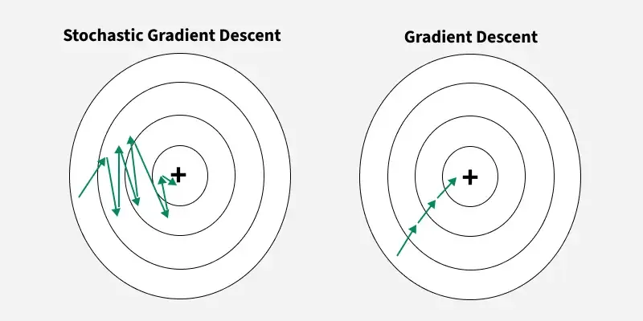

Stochastic Gradient Descent (SGD) is an optimization algorithm used in machine learning, especially for large datasets, that updates model parameters efficiently using small batches or single samples.

The Stochastic Gradient Descent (SGD) update rule is:
$$
\theta = \theta - \eta \nabla_\theta J(\theta; x_i, y_i)
$$
where:

- $x_i$ and $y_i$ represent the features and target of the i-th training example.
- The gradient $\nabla_\theta J(\theta; x_i, y_i)$ is now calculated for a single data point or a small batch.

### Newton's Method

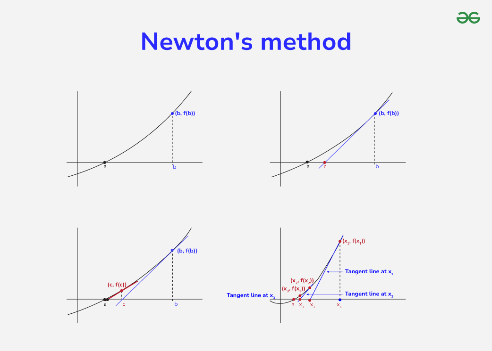

Newton's method is an iterative optimization algorithm that uses both the gradient and the Hessian matrix of an objective function to rapidly converge to the minimum or maximum of that function. This approach can be visualized as using a spotlight that shines brightest at the exit, guiding you directly towards the optimal solution.

It is based on Taylor series expansion to approximate $J(\theta)$ near some point $o$ incorporating second order derivative terms and ignoring derivatives of higher order.
$$
J(\theta) \approx J(\theta_{0}) + (\theta - \theta_{0})T\nabla_{\theta}J(\theta_{0}) + \frac{1}{2}(\theta - \theta_{0})^{T}HJ(\theta_{0})(\theta - \theta_{0})
$$
Solving for the critical point of this function we obtain the Newton parameter update rule.
$$
\theta^{*} = \theta_{0} - H^{-1} \nabla_{\theta}J(\theta_{0})
$$
where:

- $J(\theta)$: Objective function to optimize.
- $(\theta)$: Parameter vector to update.
- $(\theta_{0})$: The initial guess for the parameter vector.
- $(\nabla J(\theta_{0}))$: The gradient vector of the objective function evaluated at $\theta_{0}$. It represents the direction of steepest ascent (or descent) in the function space.
- $(H(\theta_{0}))$: The Hessian matrix (second-order partial derivatives) of the objective function evaluated at $\theta_{0}$. It provides information about the curvature of the function.
- $((\theta - \theta_{0})^{T})$: The transpose of the difference between the current parameter vector $\theta$ and the initial guess $\theta_{0}$.
- The last term involving the Hessian matrix accounts for the curvature of the function. It ensures that the update considers both the gradient and the curvature.

### Conjugate Gradient

The Conjugate Gradient (CG) method is an optimization algorithm primarily used for solving large systems of linear equations where the coefficient matrix is symmetric and positive definite, as well as for solving large-scale unconstrained optimization problems. This method is especially valuable when dealing with large problems where storing the full Hessian matrix is impractical due to memory constraints.

The method efficiently avoids direct computation of the inverse Hessian matrix ($H^{-1}$) by iteratively descending along conjugate directions.

Specifically, at iteration $t$, the next search direction, denoted as $d_t$, takes the form:
$$
dt = \nabla_{\theta}J(\theta) + \beta_{t}d_{t - 1}
$$
Two directions $d_t$ and $d_{t - 1}$, are considered conjugate if their inner product satisfies:
$$
d_t Hd_{t - 1} = 0
$$
where:

- $d_t$: The search direction at iteration ($t$).
- $\nabla_{\theta}$: The initial gradient vector.
- $\beta_{t}$: The step size or scaling factor for the previous search direction ($d_{t - 1}$).
- $d_t$ and $d_{t - 1}$ are considered conjugate.

### Bayesian Optimization

Bayesian Optimization is an automated optimization technique designed to find optimal hyperparameters by treating the search process as an optimization problem. It aims to maximize an objective function f(x), particularly beneficial for functions that are computationally expensive to evaluate and are treated as "black boxes," where their internal structure is unknown.

### Adagrad Optimizer

Adagrad is an optimization method that adapts the learning rate for each parameter based on past gradients, improving learning for features with different frequencies.

Adagrad adapts the learning rate for each parameter by using the accumulated sum of squared gradients, allowing more efficient and stable training:

1. Initialization

   Adagrad begins by initializing the parameter values randomly, just like other optimization algorithms. Additionally, it initializes a running sum of squared gradients for each parameter which will track the gradients over time.

2. Gradient Calculation

   For each training step, the gradient of the loss function with respect to the model's parameters is calculated, just like in standard gradient descent.

3. Adaptive Learning Rate

   Adagrad adjusts the learning rate for each parameter based on the accumulated sum of squared gradients, instead of using a fixed rate.

   - Learning rate is updated as:
     $$
     l_{r_t} = \frac{\eta}{\sqrt{G_t + \epsilon}}
     $$

   - $\eta$ is the global learning rate (a small constant value)

   - $G_{t}$ is the sum of squared gradients for a given parameter up to time step $t$

   - $\epsilon$ is a small value added to avoid division by zero (often set to $1e - 8$)

   - As $\sqrt{G_t + \epsilon}$ increases, the learning rate decreases over time

   - This helps stabilize training and prevents large updates

4. Parameter Update

   The model's parameters are updated by subtracting the product of the adaptive learning rate and the gradient at each step:
   $$
   \theta_{t + 1} = \theta_{t} - l_{r_t} \cdot \nabla_{\theta}
   $$
   where:

   - $\theta_{t}$ is the current parameter
   - $\nabla_{\theta}J(\theta)$ is the gradient of the loss function with respect to the parameter

#### RMSProp (Root Mean Square Propagation)

RMSProp improves Adagrad by using an exponentially decaying average of squared gradients instead of accumulating them, preventing the learning rate from shrinking too quickly.

Formula:
$$
G_t = \gamma G_{t - 1} + (1 - \gamma)(\nabla_{\theta}J(\theta))^{2}
$$
where:

- $G_t$ is the accumulated gradient
- $\gamma$ is the decay factor (typically set to 0.9)
- $\nabla_{\theta}J(\theta)$ is the gradient

parameter update:
$$
\theta_{t + 1} = \theta_{t} - \frac{\eta}{\sqrt{G_t + \epsilon}} \cdot \nabla_{\theta}J(\theta)
$$

#### AdaDelta

AdaDelta is an improved version of Adagrad that avoids excessive accumulation of past gradients by using moving averages, leading to more stable and consistent updates.

Formula:
$$
\Delta \theta_{t + 1} = -\frac{\sqrt{E[\Delta \theta]_{t}^{2}}}{\sqrt{E[\nabla_{\theta}J(\theta)]_{t}^{2} + \epsilon}} \cdot \nabla_{\theta}J(\theta)
$$
where:

- $[\Delta\theta]_{t}^{2}$ is the running average of past squared parameter updates.

#### Adam (Adaptive Moment Estimation)

Adam is an optimization algorithm that combines the benefits of momentum and adaptive learning rates, making it robust and widely used in deep learning.

Adam has the following update rules:

- First moment estimate ($m_t$): $m_t = \beta_{1}m_{t - 1} + (1 - \beta_{1})\nabla_{\theta}J(\theta)$
- Second moment estimate ($v_t$): $v_t = \beta_{2}v_{t - 1} + (1 - \beta_2)(\nabla_{\theta}J(\theta))^{2}$
- Corrected moment estimates: $\hat{m_t} = \frac{m_t}{1 - \beta_{1}^{t}}$, $\hat{v_t} = \frac{v_t}{1 - \beta_{2}^{t}}$
- Parameter update: $\theta_{t + 1} = \theta_{t} - \frac{\eta}{\sqrt{\hat{v_t}} + \epsilon} \cdot \hat{m_t}$

### RMSProp Optimizer

RMSProp is an adaptive optimization algorithm that improves training speed and stability by adjusting the learning rate for each parameter based on recent gradients.

RMSProp was developed to overcome the limitations of earlier methods like [SGD](#Stochastic Gradient Descent (SGD)) and [Adagrad](#Adagrad Optimizer) by improving learning rate adaptation.

Formula:

1. Compute the gradient $g_t$ at time step $t$
   $$
   gt = \nabla\theta
   $$

2. Update the moving average of squared gradients
   $$
   E[g^2]_{t} = \gamma E[g^2]_{t - 1} + (1 - \gamma)
   $$
   where $\gamma$ is the decay rate.

3. Update the parameter $\theta$ using the adjusted learning rate
   $$
   \theta_{t + 1} = \theta_{t} - \frac{\eta}{\sqrt{E[g^2]_{t} + \epsilon}}
   $$
   where $\eta$ is the learning rate, and $\epsilon$ is a small constant added for numerical stability.

### Adam Optimizer

Adam (Adaptive Moment Estimation) optimizer combines the advantages of Momentum and RMSprop techniques to adjust learning rates during training. It works well with large datasets and complex models because it uses memory efficiently and adapts the learning rate for each parameter automatically.

Adam combines two optimization techniques, Momentum and RMSProp, to achieve faster and more stable training:

1. Momentum

   Momentum accelerates gradient descent by using a moving average of past gradients, helping reduce oscillations and speed up convergence. The update rule with momentum is:
   $$
   w_{t + 1} = w_t - \alpha m_t
   $$
   where:

   - $m_t$ is the moving average of the gradients at time $t$
   - $\alpha$ is the learning rate
   - $w_t$ and $w_{t + 1}$ are the weights at time $t$ and $t + 1$, respectively

   The momentum term $m_t$ is updated recursively as:
   $$
   m_t = \beta_{1}m_{t - 1} + (1 - \beta_{1})\frac{\partial L}{\partial w_t}
   $$
   where:

   - $\beta_{1}$ is the momentum parameter (typically set to 0.9)
   - $\frac{\partial L}{\partial w_t}$ is the gradient of the loss function with respect to the weights at time $t$

2. RMSprop (Root Mean Square Propagation)

   RMSprop is an adaptive learning rate optimization method that improves AdaGrad by using an exponentially weighted moving average of squared gradients. This prevents the learning rate from decreasing too quickly during training. The update rule for RMSprop is:
   $$
   w_{t + 1} = w_t - \frac{\alpha_{t}}{\sqrt{v_t + \epsilon}} \frac{\partial L}{\partial w_t}
   $$
   where:

   - $v_t$ is the exponentially weighted average of squared gradients:
     $$
     v_t = \beta_{2}v_{t - 1} + (1 - \beta_{2})(\frac{\partial L}{\partial w_t})^{2}
     $$

   - $\epsilon$ is a small constant (e.g., 10−810−8) added to prevent division by zero

Adam optimizer combines the momentum and RMSprop techniques to provide a more balanced and efficient optimization process. The key equations governing Adam are as follows:

- First moment (mean) estimate: $m_t = \beta_{1}m_{t - 1} + (1 - \beta_{1})\frac{\partial L}{\partial w_t}$

- Second moment (variance) estimate: $v_t = \beta_{2}v_{t - 1} + (1 - \beta_{2})(\frac{\partial L}{\partial w_t})^{2}$

- Bias correction: Since both $m_t$ and $v_t$ are initialized at zero, they tend to be biased toward zero, especially during the initial steps. To correct this bias, Adam computes the bias-corrected estimates:

  $\hat{m_t} = \frac{m_t}{1 - \beta_{1}^{t}}$, $\hat{v_t} = \frac{v_t}{1 - \beta_{2}^{t}}$

- Final weight update: The weights are then updated as:

  $w_{t + 1} = w_t - \frac{\hat{m_t}}{\sqrt{\hat{v_t}} + \epsilon} \alpha$

Key Parameters:

- $\alpha$: The learning rate or step size (default is 0.001)
- $\beta_{1}$ and $\beta_{2}$: Decay rates for the moving averages of the gradient and squared gradient, typically set to $\beta_{1}$= 0.9 and $\beta_2$ = 0.999
- $\epsilon$: A small positive constant used to avoid division by zero when computing the final update

### Expectation-Maximization (EM) Algorithm

The Expectation-Maximization (EM) algorithm is an iterative optimization technique used to estimate unknown parameters in probabilistic models, particularly when the data is incomplete, noisy or contains hidden (latent) variables.

 It works in two steps:

- E-step (Expectation Step): Using the current parameter estimates, the algorithm calculates the expected values of the missing or hidden variables. Essentially, it assigns probabilities or "responsibilities" to different hidden outcomes given the observed data.
- M-step (Maximization Step): With these updated expectations from the E-step, the algorithm then re-estimates the model parameters by maximizing the expected log-likelihood. This improves how well the model explains the observed data.

---

## Constraint Satisfaction Problems (CSP)

Constraint Satisfaction Problems (CSPs) are a fundamental topic in artificial intelligence and computer science. They involve finding a solution that satisfies a set of constraints or conditions.

A Constraint Satisfaction Problem (CSP) is a problem characterized by:

- Variables: A set of variables $X_1, X_2, ..., X_n$.
- Domains: Each variable $X_i$ has a domain $D_i$ of possible values.
- Constraints: A set of constraints that specify allowable combinations of values for subsets of variables.

CSPs can be classified into different types based on their constraints and problem characteristics:

1. *Binary CSPs*: In these problems, each constraint involves only two variables. Like in a scheduling problem, the constraint could specify that task A must be completed before task B.
2. *Non-Binary CSPs*: These problems have constraints that involve more than two variables. For instance, in a seating arrangement problem, a constraint could state that three people cannot sit next to each other.
3. *Hard and Soft Constraints*: Hard constraints must be strictly satisfied, while soft constraints can be violated but at a certain cost. This is often used in real-world applications where not all constraints are equally important.

In CSP it involves the interaction of variables, domains and constraints. Below is a structured representation of how CSP is formulated:

1. Finite Set of Variables $(V_1, V_2, ..., V_n)$: The problem consists of a set of variables, each of which needs to be assigned a value that satisfies the given constraints.
2. Non-Empty Domain for Each Variable ($D_1, D_2, ..., D_n$): Each variable has a domain a set of possible values that it can take.
3. Finite Set of Constraints ($C_1, C_2, ..., C_m$): Constraints restrict the possible values that variables can take. Each constraint defines a rule or relationship between variables.
4. Constraint Representation: Each constraint $C_i$ is 
5. represented as a pair of (scope, relation) where:
   - *Scope:* The set of variables involved in the constraint.
   - *Relation:* A list of valid combinations of variable values that satisfy the constraint.

### Backtracking Algorithm

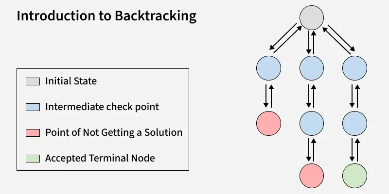

`Backtracking search` is a depth-first search algorithm that incrementally builds a solution by trying possible assignments and abandoning (backtracking) as soon as it determines that a partial solution cannot lead to a valid final solution. Steps involved are:

- Initialization: Start with an empty assignment.
- Selection: Choose an unassigned variable.
- Assignment: Assign a value to the selected variable.
- Consistency Check: Verify whether the assignment satisfies all constraints.
- Recursion: If consistent, recursively assign values to remaining variables.
- Backtrack: If a conflict occurs or no valid continuation exists, undo the last assignment and try another value.

### Forward-Checking Algorithm

The `forward-checking algorithm` is an enhancement of the backtracking algorithm that aims to reduce the search space by applying `local consistency` checks.

### Constraint Propagation Algorithm

Constraint Propagation is a technique used in Artificial Intelligence to solve Constraint Satisfaction Problems (CSPs). It works by reducing the possible values of variables using given constraints, which helps narrow the search space and improve problem-solving efficiency.

Constraint propagation works by reducing the possible values of variables using the given constraints. This process continues until no more values can be removed from the domains of the variables.

Let’s consider two variables $X$ and $Y$, each having the domain $\{1, 2, 3\}$ with the constraint $X \ne Y$:

1. Initialization

   Initially, both variables can take any value from their domains.
   $$
   X = \{1,2,3\}, Y = \{1,2,3\}
   $$

2. Apply Constraints

   Suppose $X = 1$. Since $X \ne Y$, the value 1 is removed from the domain of $Y$.
   $$
   Y = \{2,3\} 
   $$

3. Further Propagation

   Now, if $Y = 2$, then $X$ cannot be 2 due to the same constraint.
   $$
   X = \{1,3\} 
   $$

4. Iteration

   The process continues by repeatedly applying constraints and reducing domains until no more values can be eliminated.

5. Stable State

   When no further reductions are possible, the domains reach a stable state, making it easier to identify valid solutions efficiently.

---

## Automated Planning

Automated planning is a way of making efficient and effective decisions in complex systems by achieving the goal of a decision-processing method that can work in a constantly changing world. The article delves into the essence of automated planning, its mechanisms, applications, and the challenges it faces.

Automated planning techniques can be broadly classified into two categories: 

1. Deterministic Planning

   Which assumes a predictable environment where every action has a guaranteed outcome, suitable for static or highly controlled environments.

2. Non-deterministic (or probabilistic) Planning

   On the other hand, deals with uncertainty in action outcomes, requiring more complex algorithms like Markov decision processes (MDP) or Partially Observable Markov Decision Processes (POMDP).

### Planning Domain Modeling Languages

Planning domain modeling languages are formal languages used to describe the components of a planning problem, including actions, states, and goals. These languages provide a structured way to define the parameters and constraints of the planning domain.

Some prominent planning domain modeling languages include:

1. PDDL (Planning Domain Definition Language)

   The most widely used language for describing planning problems. PDDL allows the specification of the initial state, goal state, and actions, including their preconditions and effects.

2. PPDDL (Probabilistic PDDL)

   An extension of PDDL for probabilistic planning. It incorporates probabilities to handle uncertain outcomes of actions.

3. HTN (Hierarchical Task Network)

   A planning formalism that breaks down complex tasks into simpler subtasks. HTN is appropriate for hierarchical planning methods.

### Markov Decision Process (MDP)

Markov Decision Process (MDP) is a framework for decision-making under uncertainty and is formally defined by a tuple (S, A, P, R, γ), representing states, actions, transition probabilities, rewards and the discount factor.

An MDP has five main parts:

1. $States (S)$: A state is a situation or condition the agent can be in.
2. $Actions (A)$: An action is something the agent can do.
3. $\text{Transition Model} (T)$: The model tells us what happens when an action is taken in a state.
4. $Reward (R)$: A reward is a number given to the agent after it takes an action. If the reward is positive, it means the result of the action was good. If the reward is negative, it means the outcome was bad, or there was a penalty help the agent learn what’s good or bad.
5. $Policy (\pi)$: A policy is the agent’s plan. The goal is to find the best policy that helps the agent earn the highest total reward over time.

### Hidden Markov Model (HMM)

To work with sequential data where the actual states are not directly visible, the Hidden Markov Model (HMM) is a widely used probabilistic model in machine learning. It assumes that a system moves through hidden states over time, and each hidden state produces an observable output based on certain probabilities.

A Hidden Markov Model is defined by:
$$
\lambda = (A, B, \pi)
$$
where,

- $\boldsymbol{A}$ (Transition Matrix): Probability of moving from one hidden state to another.
- $\boldsymbol{B}$ Emission Matrix): Probability of observing a symbol given a hidden state.
- $\boldsymbol{\pi}$ Initial State Distribution): Probability of starting in each hidden state.

Hidden Markov Models solve three core problems related to sequences of observations generated by hidden states:

1. Evaluation Problem (Forward Algorithm)

   How to compute the probability of an observation sequence? Mathematically, given an observation sequence:
   $$
   O = \{o_1, o_2, \dots, o_T\}
   $$
   and a model:
   $$
   \lambda = (A, B, \pi)
   $$
   we compute:
   $$
   \mathbf{P}(O \mid \lambda) = \sum_{\text{all state sequences } Q} \mathbf{P}(O, Q \mid \lambda)
   $$
   Because summing over all possible state sequences is computationally expensive, the Forward Algorithm efficiently computes this probability using dynamic programming with the forward variable:
   $$
   \alpha_t(j) = \mathbf{P}(o_1, o_2, \dots, o_t, q_t = j \mid \lambda)
   $$

2. Decoding Problem (Viterbi Algorithm)

   How to find the most likely hidden state sequence that explains the observations? Mathematically, it finds:
   $$
   Q^* = \arg \max_{Q} \mathbf{P}(Q \mid O, \lambda)
   $$
   The Viterbi Algorithm efficiently computes this using dynamic programming by keeping track of the maximum probability path to each state at each time step.

3. Learning Problem (Baum-Welch Algorithm / EM)

   How to train the HMM to fit the observed data? Here, the goal is to estimate the model parameters that maximize the likelihood of the observation sequence:
   $$
   \lambda_{\text{new}} = \arg \max_{\lambda} \mathbf{P}(O \mid \lambda)
   $$
   The Baum Welch Algorithm (a type of Expectation-Maximization) iteratively updates estimates of A, B, and \pi using the state occupancy probabilities and transition probabilities computed from the observation sequence.

HMM Algorithm:

1. Define State and Observation Space

   - Hidden States: Possible internal states the system can be in.
   - Observations: Visible outputs generated by hidden states.

2. Define Initial State Distribution ($\pi$)

   Set probabilities of starting in each hidden state.

3. Define Transition Matrix (A)

   Set probabilities for moving from one hidden state to another.

4. Define Emission Matrix (B)

   Set probabilities for each observation being emitted by a hidden state.

5. Train Model

   Estimate model parameters using:

   - Baum Welch Algorithm: Trains HMM by estimating A, B,\pi.
   - Forward Backward Algorithm: Computes hidden state probabilities efficiently.

6. Decode Hidden States

   Determine the most likely hidden state sequence using the Viterbi algorithm.

7. Evaluate Model Performance

   Measure model accuracy using metrics like Accuracy, Precision and Recall.

### Partially Observable Markov Decision Processes (POMDP)

A `Partially Observable Markov Decision Processes (POMDP)` models decision-making tasks where an agent must make decisions based on incomplete or uncertain state information. It is particularly useful in scenarios where the agent cannot directly observe the underlying state of the system but rather receives observations that provide partial information about the state.

A POMDP is formally defined by the following elements:

- States (S)

  A finite set of states representing all possible conditions the system can be in.

- Actions (A)

  A finite set of actions available to the agent.

- Transition Model (T)

  A function $T(s, a, s′)=P(s′∣s, a)$ that defines the probability of transitioning from state $s$ to state $s′$ under action $a$.

- Observations (O)

  A finite set of observations that the agent can perceive.

- Observation Model (Z)

  A function $Z(s′, a, o)=P(o∣s′, a)$ that defines the probability of observing $o$ after taking action $a$ and ending up in state $s′$.

- Rewards (R)

  A function $R(s, a)$ that assigns a numerical reward to taking action $a$ in state $s$.

- Discount Factor ($\gamma$)

  A factor between 0 and 1 that discounts future rewards, reflecting the preference for immediate rewards over future gains.

The key challenge in a POMDP is that the agent does not know its exact state but has a belief or probability distribution over the possible states. This belief is updated using the [Bayes' Theorem](../MATH/PROBABILITY_THEORY/bayes_theorem.md) as new observations are made, forming a belief update rule:
$$
Bel(s') =\frac{ P(o|s',a) \sum_s P(s'|s,a) Bel(s)}{P(o|a, Bel)}
$$

- $Bel(s)$ is the prior belief of being in state $s$.
- $Bel(s')$ is the prior belief of being in state $s$.

---

## Others

### Propositional Logic

Propositional logic is a branch of mathematics that studies the logical relationships between propositions (or statements, sentences, assertions) taken as a whole, and connected via logical connectives.

#### Propositions

A proposition is a statement that is either true or false. If a statement can be clearly assigned a truth value, it is a proposition, no matter how simple or complex it is.

#### Logical Connectives

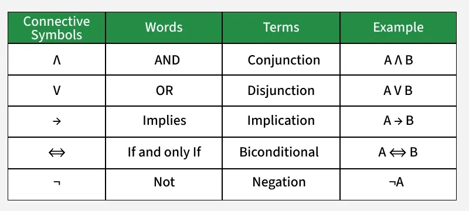

Logical connectives are used to combine simple propositions into more complex ones.

#### Truth Table

Truth tables determine the truth value of logical expressions by evaluating all possible combinations of input values. They provide a complete view of how logical operators affect outcomes.

### Bayesian Network

Bayesian networks, also known as belief networks or Bayesian belief networks (BBNs), are powerful tools for representing and reasoning about uncertain knowledge. These networks use a graphical structure to encode probabilistic relationships among variables, making them invaluable in fields such as artificial intelligence, bioinformatics, and decision analysis.

A Bayesian network consists of:

- Nodes: Each node represents a random variable, which can be discrete or continuous.
- Edges: Directed edges (arrows) between nodes represent conditional dependencies.

#### Conditional Independence

The fundamental property of Bayesian networks is that they encode conditional independence relationships between variables. This means that each node is conditionally independent of its non-descendants given its parents. This property significantly reduces the complexity of the network by breaking down the joint probability distribution into simpler, local distributions.

#### Joint Probability Distribution

A Bayesian network defines a joint probability distribution over its variables. The joint probability of a set of variables can be expressed as the product of the conditional probabilities of each variable given its parents:
$$
P(X_1, X_2, …, X_n) = \prod_{i=1}^n P(X_i ∣Parents(X_i))
$$

#### Inference in Bayesian Networks

Inference in Bayesian networks involves computing the probability distribution of a subset of variables given known values for other variables. This can be achieved through various methods:

- Exact Inference: Algorithms like Variable Elimination and Junction Tree Algorithm.
- Approximate Inference: Techniques like Monte Carlo methods and Loopy Belief Propagation.

These inference methods are crucial for querying the network and making predictions based on observed data.

#### Learning Bayesian Networks

Learning a Bayesian network involves two main tasks:

- Structure Learning: Determining the network structure (i.e., the DAG).
- Parameter Learning: Estimating the conditional probability distributions.

### Decision Theory

Decision theory is about making the best choice when the outcome is uncertain. In AI, it helps systems evaluate different possibilities and select the option that leads to the most beneficial result overall.

Decision theory can be understood in two main ways based on how decisions are approached:

1. Normative Decision Theory

   Focuses on how decisions should be made in an ideal situation.

2. Descriptive Decision Theory

   Focuses on how decisions are actually made in real life.

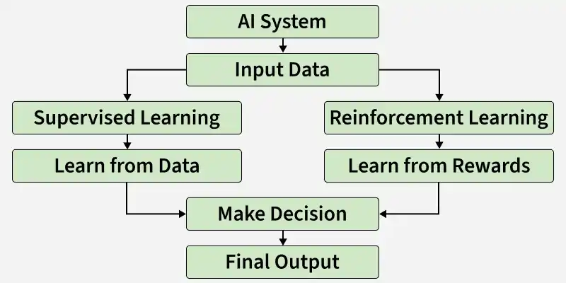

AI systems use different learning methods to make decisions based on data and experience. It mainly applies decision theory in the following ways:

- [Machine Learning#Supervised Learning](ml.md)
- [Machine Learning#Reinforcement Learning](ml.md)

---

## Summary

### Batch vs Stochastic vs Mini-Batch Gradient Descent

|               **Type**                |          **Update Strategy**          |       **Speed and Efficiency**        |       **Noise in Updates**       |       **Memory Usage**        |
| :-----------------------------------------: | :-----------------------------------------: | :-----------------------------------------: | :------------------------------------: | :---------------------------------: |
|      **Batch Gradient Descent**       |     Uses entire dataset for each update     |         Slow, high computation cost         |           Smooth and stable            | High (needs full dataset in memory) |
| **Stochastic Gradient Descent (SGD)** |     Updates using one sample at a time      |   Fast updates but less efficient overall   |          Highly noisy updates          |                 Low                 |
|    **Mini-Batch Gradient Descent**    | Uses small batches of datatraining examples | Fast and efficient (supports vectorization) | Moderate noise—dependent on batch size |              Moderate               |

### Local Search Algorithms Comparison

|      **Feature/Aspect**      |   **Hill-Climbing**   |      **Simulated Annealing**       |      **Genetic Algorithm**       |      **Tabu Search**      |
| :--------------------------: | :-------------------: | :--------------------------------: | :------------------------------: | :-----------------------: |
|       **Inspiration**        |    Climbing a hill    |      Annealing in metallurgy       | Natural selection and evolution  |    Memory-based search    |
|       **Search Space**       |         Local         | Broad (with controlled randomness) |  Very broad (population-based)   |     Broad with memory     |
| **Moves to Worse Solutions** |          No           |        Yes (probabilistic)         |   Yes (via mutation/crossover)   |  Rare (with aspiration)   |
|   **Avoids Local Optima**    |          No           |                Yes                 |               Yes                |            Yes            |
|       **Memory Usage**       |          Low          |               Medium               |               High               |      Medium to High       |
| **Parameter Tuning Needed**  |        Minimal        |    High (temperature, cooling)     | High (population, mutation rate) | Medium (tabu size, rules) |
|          **Speed**           |         Fast          |              Moderate              |  Slower (population evolution)   |         Moderate          |
|        **Complexity**        |        Simple         |              Moderate              |               High               |         Moderate          |
|      **Best Use Case**       | Small/simple problems |  Problems with many local optima   |  Complex optimization problems   | Problems prone to cycling |

### Hill Climbing vs Simulated Annealing

|       Parameters        |                        Hill Climbing                         |                     Simulated Annealing                      |
| :---------------------: | :----------------------------------------------------------: | :----------------------------------------------------------: |
|      Introduction       | Hill Climbing is a heuristic optimization process that iteratively advances towards a better solution at each step in order to find the best solution in a given search space. | Simulated Annealing is a probabilistic optimization algorithm that simulates the metallurgical annealing process in order to discover the best solution in a given search area by accepting less-than-ideal solutions with a predetermined probability. |
|        Objective        | By iteratively progressing towards a better solution at each stage, Hill Climbing seeks to locate the ideal solution within a predetermined search space. | Simulated annealing seeks the global optimum in a given search space by accepting poorer answers with a predetermined probability. This allows it to bypass local optimum conditions. |
|        Strategy         | In order to iteratively move towards the best answer at each stage, Hill Climbing employs a greedy method. It only accepts solutions that are superior to the ones already in place. | Simulated annealing explores the search space and avoids local optimum by employing a probabilistic method to accept a worse solution with a given probability. As the algorithm advances, the likelihood of accepting an inferior answer diminishes. |
| Local vs. Global Optima | Hill Climbing may not locate the global optimum because it is susceptible to becoming caught in local optima. | Simulated annealing has a chance of escaping the local optimum and locating the global optimum. |
|    Stopping Criteria    | Hill Climbing comes to an end after a certain number of iterations or when it achieves a local optimum. | When the temperature hits a predetermined level or the maximum number of repetitions, simulated annealing comes to an end. |
|       Performance       | Hill climbing is quick and easy, but it has the potential to become locked in local optima and miss the overall best solution. | Simulated annealing is more efficient at locating the global optimum than Hill Climbing, particularly for complicated situations with numerous local optima. Simulated annealing is slower than Hill Climbing. |
|    Tuning Parameters    |           Hill Climbing has no tuning parameters.            | The beginning temperature, cooling schedule, and acceptance probability function are only a few of the tuning factors for Simulated Annealing. |
|      Applications       | Many different applications, including image processing, machine learning, and gaming, use hill climbing. | Several fields, including logistics, scheduling, and circuit design, use simulated annealing. |

### Greedy Best-First Search vs Hill Climbing Algorithm

| **Properties** |                   Greedy Best First Search                   |                   Hill Climbing Algorithm                    |
| :------------: | :----------------------------------------------------------: | :----------------------------------------------------------: |
|   Definition   | A search algorithm that does not take into account the full search space but instead employs heuristics to choose the best route to a goal node. | An approach to searching that skips the full search space and instead chooses the best path to a goal node using heuristics. |
|      Goal      | To always choose the path with the lowest heuristic cost in order to reach the objective node as rapidly as feasible. | to discover the highest point in the search space, even if it is not the global maximum, in order to optimize a solution. |
|      Type      |                  informed search algorithm.                  |                  Informed search algorithm.                  |
|   Heuristics   | It estimates the cost of getting to the target node using heuristics. |       It evaluates nearby solutions using heuristics.        |
|     Memory     |        It doesn't have to keep track of prior nodes.         | Only keeps track of the most recent and effective solutions. |
|  Completeness  |              Not guaranteed to find a solution.              |      Not always possible to locate the global maximum.       |
|   Efficiency   | With a suitable heuristic, it is possible to locate a solution quickly in a wide search space. | It can be effective in locating a local maximum, but it can become trapped in a local optimum. |
|  Search space  | It uses a breadth-first approach to investigating the search space. | It uses a depth-first approach to investigate the search space. |
|  Backtracking  |                Does not require backtracking.                |  It can backtrack steps if a better answer cannot be found.  |
|    Examples    | It is used in situations involving pathfinding and graph traversal. |  It used in scheduling and logistics optimization problems.  |

### Markov Decision Process vs POMDP

|         **Aspect**         |                   **Fully observable MDP**                   |             **Partially Observable MDP (POMDP)**             |
| :------------------------: | :----------------------------------------------------------: | :----------------------------------------------------------: |
| Agent's Knowledge of state | Complete knowledge of the current state of the environment.  | Incomplete information about the current state of the environment. |
|    Information of state    | The agent knows exactly where it is and what the environment looks like at any given time. | The agent receives observations that are noisy or incomplete indications of the true state. |
|        Uncertainty         | No uncertainty about state transitions or outcomes of actions. | Observations influenced by the underlying state, but may not fully reveal it. |
|          Example           | A game of chess in which both players possess complete information about the positions of all pieces on the board. | Robot navigating in a foggy environment where it can only see objects within a limited range due to reduced visibility. The robot obtains sensor readings that offer limited information about its surroundings, without possessing direct awareness of the complete environment. |

### Backtracking vs Branch and Bound

| **Parameter** | **Backtracking**                                             | **Branch and Bound**                                         |
| ------------- | ------------------------------------------------------------ | ------------------------------------------------------------ |
| Approach      | Backtracking is used to find all possible solutions available to a problem. When it realises that it has made a bad choice, it undoes the last choice by backing it up. It searches the state space tree until it has found a solution for the problem. | Branch-and-Bound is used to solve optimisation problems. When it realises that it already has a better optimal solution than the pre-solution leads to, it abandons that pre-solution. It completely searches the state space tree to get an optimal solution. |
| Traversal     | Backtracking traverses the state space tree in a [DFS](#Depth First Search) manner. | Branch-and-Bound traverses the tree in any manner, [DFS](#Depth First Search) or [BFS](#Breadth First Search). |
| Function      | Backtracking involves a feasibility function.                | Branch-and-Bound involves a bounding function.               |
| Problems      | Backtracking is used for solving Decision Problem.           | Branch-and-Bound is used for solving Optimisation Problem.   |
| Searching     | In backtracking, the state space tree is searched until the solution is obtained. | In Branch-and-Bound, the optimum solution may be present anywhere in the state space tree, so the tree need to be searched completely. |
| Efficiency    | Backtracking is more efficient.                              | Branch-and-Bound is less efficient.                          |
| Applications  | Useful in solving N-Queen Problem, Sum of subset, Hamilton cycle problem, graph coloring problem | Useful in solving Knapsack Problem, Travelling Salesman Problem. |
| Solve         | Backtracking can solve almost any problem. (chess, sudoku, etc ). | Branch-and-Bound can not solve almost any problem.           |
| Used for      | Typically, backtracking is used to solve decision problems.  | Branch and bound is used to solve optimization problems.     |
| Nodes         | Nodes in stat space tree are explored in depth first tree.   | Nodes in tree may be explored in depth-first or breadth-first order. |
| Next move     | Next move from the current state can lead to a bad choice.   | Next move is always towards better solution.                 |
| Solution      | On successful search of a solution in the state space tree, the search stops. | Entire state space tree is searched in order to find an optimal solution. |

### A* vs AO*

|         **Basis**         |          **A Star Algorithm**           |             **AO Star Algorithm**              |
| :-----------------------: | :-------------------------------------: | :--------------------------------------------: |
|      **Graph Type**       |           Works on OR graphs            |          Works on both AND OR graphs           |
|    **Node Selection**     |          Selects one best path          |      May select one or multiple branches       |
| **Structure of Solution** |     Produces a single optimal path      |       Produces an optimal solution graph       |
| **Handling Dependencies** | Does not handle dependent sub problems  | Handles dependent sub problems using AND nodes |
|   **Cost Calculation**    |     Minimum cost among alternatives     |      Minimum for OR and sum for AND nodes      |
|      **Complexity**       |          Simpler to implement           |      More complex due to AND OR handling       |
|      **Typical Use**      | Path finding and shortest path problems |  Planning, problem reduction, decision making  |

### IDA* vs Iterative Deepening Depth-First Search (IDDFS)

|              **Criteria**              |  Iterative Deepening Depth-First Search (IDDFS)   |                 Iterative Deepening A (IDA*)                 |
| :------------------------------------: | :-----------------------------------------------: | :----------------------------------------------------------: |
|             **Systematic**             |    Systematic exploration of the search space.    | Not systematic; may revisit nodes due to threshold updates.  |
|             **Optimality**             | Guarantees optimal solution in unweighted graphs. |  Optimal, but only expands nodes where f-score ≤ threshold.  |
|           **Node Expansion**           |        Never expands the same node twice.         | May expand the same node multiple times if f-score < threshold. |
| **Handling Infinite Search Traversal** |     Not suited for infinite search traversal.     | Better suited for infinite search traversal compared to IDDFS. |

### Particle Swarm Optimization (PSO) vs Genetic Algorithm (GA)

|      **Parameter**       |                        **PSO**                         |                **Genetic Algorithm (GA)**                |
| :----------------------: | :----------------------------------------------------: | :------------------------------------------------------: |
|     **Inspiration**      |       Based on social behavior of birds or fish        |         Based on natural evolution and genetics          |
|   **Search Strategy**    |  Particles move continuously through the search space  |           Uses randomized population evolution           |
|  **Population Update**   | No creation or deletion particles only change position | New individuals are created using crossover and mutation |
|    **Operators Used**    |             Velocity and position updates              |            Selection, crossover and mutation             |
|  **Variable Handling**   |        Best suited for continuous optimization         |      Handles both continuous and discrete variables      |
| **Complexity and Speed** |        Simple structure with faster convergence        |            More complex and generally slower             |

### Newton's Method vs Other Optimization Algorithms

|          **Criteria**          |        **Newton's Method**         | **Gradient Descent (GD)** |        **Quasi-Newton Methods**         |            **Genetic Algorithms**            |
| :----------------------------: | :--------------------------------: | :-----------------------: | :-------------------------------------: | :------------------------------------------: |
|      **Convergence Rate**      |             Quadratic              |          Linear           | Faster than GD and slower than Newton's | Typically slower than gradient-based methods |
| **Initialization Sensitivity** |             Sensitive              |      Less Sensitive       |             Less Sensitive              |                Less Sensitive                |
|     **Memory Requirement**     |                Low                 |            Low            |                Moderate                 |                   Moderate                   |
|   **Derivative Requirement**   | First and second order derivatives |  First order derivatives  |         First order derivatives         |         Doesn't require derivatives          |
|       **Optimizer Type**       |               Local                |           Local           |                  Local                  |                    Global                    |
|         **Complexity**         |              Moderate              |            Low            |                Moderate                 |                     High                     |

### Global Search vs Local Search Algorithm

|        **Aspect**        |              **Global Search Algorithms**              |            **Local Search Algorithms**            |
| :----------------------: | :----------------------------------------------------: | :-----------------------------------------------: |
|     **Search Scope**     |    Explores the entire search space systematically     | Explores the neighborhood of the current solution |
|         **Goal**         |    Find the global optimum (best overall solution)     |   Find a good or near-optimal solution quickly    |
|       **Approach**       |            Broad, exhaustive or systematic             |   Incremental improvement based on local moves    |
|     **Memory Usage**     |            High, needs to store many states            |   Low, stores only current state and neighbors    |
|        **Speed**         |      Usually slower and computationally expensive      |        Generally faster and more efficient        |
| **Risk of Local Optima** |       Low, since global search covers full space       |        High, can get stuck in local optima        |
|       **Examples**       |            Breadth-First Search, A* Search             |  Hill Climbing, Simulated Annealing, Tabu Search  |
|     **Application**      | Suitable when completeness and optimality are critical |  Useful when solution space is huge or infinite   |

### Gradient-Based vs Heuristic-Based Search

|        **Aspect**        |               **Gradient-Based Optimization**               |                  **Heuristic-Based Search**                  |
| :----------------------: | :---------------------------------------------------------: | :----------------------------------------------------------: |
|        **Basis**         |        Uses derivatives (gradients) to guide search         |           Uses rules of thumb or domain knowledge            |
|     **Requirement**      |         Requires differentiable objective function          |        Works with non-differentiable, complex spaces         |
|   **Search Direction**   |            Moves toward steepest ascent/descent             |      Moves toward promising candidates using heuristic       |
|      **Efficiency**      |         Fast convergence on smooth, convex problems         |        Efficient in problems with complex landscapes         |
| **Risk of Local Optima** | Can get stuck in local minima if the problem is multi-modal | Can escape local optima using probabilistic or memory techniques |
|       **Examples**       |              Gradient Descent, Newton’s Method              |         A* Search, Hill Climbing, Genetic Algorithms         |
|    **Applicability**     |       Optimization problems with gradient information       |    Combinatorial optimization and heuristic search spaces    |

---

## Reference

[1] [Artificial Intelligence (AI) Algorithms](https://www.geeksforgeeks.org/artificial-intelligence/ai-algorithms/)

[2] [Search Algorithms in AI](https://www.geeksforgeeks.org/machine-learning/search-algorithms-in-ai/)

[3] [Gradient Descent Algorithm in Machine Learning](https://www.geeksforgeeks.org/machine-learning/gradient-descent-algorithm-and-its-variants/)

[4] [Stochastic Gradient Descent (SGD)](https://www.geeksforgeeks.org/machine-learning/ml-stochastic-gradient-descent-sgd/)

[5] [Gradient Descent Algorithm in Machine Learning](https://www.geeksforgeeks.org/machine-learning/gradient-descent-algorithm-and-its-variants/)

[6] [Mini-Batch Gradient Descent with Python](https://www.geeksforgeeks.org/machine-learning/ml-mini-batch-gradient-descent-with-python/)

[7] [Momentum-based Gradient Optimizer - ML](https://www.geeksforgeeks.org/machine-learning/ml-momentum-based-gradient-optimizer-introduction/)

[8] [Adagrad Optimizer in Deep Learning](https://www.geeksforgeeks.org/machine-learning/intuition-behind-adagrad-optimizer/)

[9] [RMSProp Optimizer in Deep Learning](https://www.geeksforgeeks.org/deep-learning/rmsprop-optimizer-in-deep-learning/)

[10] [Local Search Algorithm in Artificial Intelligence](https://www.geeksforgeeks.org/artificial-intelligence/local-search-algorithm-in-artificial-intelligence/)

[11] [Adversarial Search Algorithms in Artificial Intelligence (AI)](https://www.geeksforgeeks.org/artificial-intelligence/adversarial-search-algorithms/)

[12] [Automated Planning in AI](https://www.geeksforgeeks.org/artificial-intelligence/automated-planning-in-ai/)

[13] [Hill Climbing in Artificial Intelligence](https://www.geeksforgeeks.org/artificial-intelligence/introduction-hill-climbing-artificial-intelligence/)

[14] [Automated Planning in AI](https://www.geeksforgeeks.org/artificial-intelligence/automated-planning-in-ai/)

[15] [What is Simulated Annealing?](https://www.geeksforgeeks.org/artificial-intelligence/what-is-simulated-annealing/)

[16] [Difference Between Hill Climbing and Simulated Annealing Algorithm](https://www.geeksforgeeks.org/machine-learning/difference-between-hill-climbing-and-simulated-annealing-algorithm/)

[17] [Difference Between Greedy Best First Search and Hill Climbing Algorithm](https://www.geeksforgeeks.org/artificial-intelligence/difference-between-greedy-best-first-search-and-hill-climbing-algorithm/)

[18] [Greedy Best first search algorithm](https://www.geeksforgeeks.org/dsa/greedy-best-first-search-algorithm/)

[19] [Introduction to Beam Search Algorithm](https://www.geeksforgeeks.org/machine-learning/introduction-to-beam-search-algorithm/)

[20] [Genetic Algorithms](https://www.geeksforgeeks.org/dsa/genetic-algorithms/)

[21] [Markov Decision Process](https://www.geeksforgeeks.org/machine-learning/markov-decision-process/)

[22] [Partially Observable Markov Decision Process (POMDP) in AI](https://www.geeksforgeeks.org/artificial-intelligence/partially-observable-markov-decision-process-pomdp-in-ai/)

[23] [Backtracking Algorithm](https://www.geeksforgeeks.org/dsa/backtracking-algorithms/)

[24] [Difference between Backtracking and Branch-N-Bound technique](https://www.geeksforgeeks.org/dsa/difference-between-backtracking-and-branch-n-bound-technique/)

[25] [Depth First Search (DFS) for Artificial Intelligence](https://www.geeksforgeeks.org/artificial-intelligence/depth-first-search-df)

[26] [Breadth First Search (BFS) for Artificial Intelligence](https://www.geeksforgeeks.org/artificial-intelligence/breadth-first-search-bfs-for-artificial-intelligence/)

[27] [Depth Limited Search for AI](https://www.geeksforgeeks.org/artificial-intelligence/depth-limited-search-for-ai/)

[28] [Iterative Deepening Search (IDS) in AI](https://www.geeksforgeeks.org/artificial-intelligence/iterative-deepening-search-ids-in-ai/)

[29] [Uniform Cost Search (UCS) in AI](https://www.geeksforgeeks.org/artificial-intelligence/uniform-cost-search-ucs-in-ai/)

[30] [Bidirectional Search in AI](https://www.geeksforgeeks.org/artificial-intelligence/bidirectional-search-in-ai/)

[31] [A* algorithm and its Heuristic Search Strategy in Artificial Intelligence](https://www.geeksforgeeks.org/artificial-intelligence/a-algorithm-and-its-heuristic-search-strategy-in-artificial-intelligence/)

[32] [Iterative Deepening A\* algorithm (IDA\*) in Artificial intelligence](https://www.geeksforgeeks.org/artificial-intelligence/iterative-deepening-a-algorithm-ida-artificial-intelligence/)

[33] [Memory-bounded search ( Memory Bounded Heuristic Search ) in AI](https://www.geeksforgeeks.org/artificial-intelligence/memory-bounded-search-memory-bounded-heuristic-search-in-ai/)

[34] [Introduction to Ant Colony Optimization](https://www.geeksforgeeks.org/machine-learning/introduction-to-ant-colony-optimization/)

[35] [Particle Swarm Optimization (PSO)](https://www.geeksforgeeks.org/machine-learning/particle-swarm-optimization-pso-an-overview/)

[36] [Mini-Max Algorithm in Artificial Intelligence](https://www.geeksforgeeks.org/artificial-intelligence/mini-max-algorithm-in-artificial-intelligence/)

[37] [Alpha-Beta pruning in Adversarial Search Algorithms](https://www.geeksforgeeks.org/artificial-intelligence/alpha-beta-pruning-in-adversarial-search-algorithms/)

[38] [Expectimax Search Algorithm in AI](https://www.geeksforgeeks.org/artificial-intelligence/expectimax-search-algorithm-in-ai/)

[39] [Monte Carlo Tree Search (MCTS) in Machine Learning](https://www.geeksforgeeks.org/machine-learning/monte-carlo-tree-search-mcts-in-machine-learning/)

[40] [State Space Search in AI](https://www.geeksforgeeks.org/artificial-intelligence/state-space-search-in-ai/)

[41] [Viterbi Algorithm for Hidden Markov Models (HMMs)](https://www.geeksforgeeks.org/artificial-intelligence/viterbi-algorithm-for-hidden-markov-models-hmms/)

[42] [Dynamic Time Warping (DTW) in Time Series](https://www.geeksforgeeks.org/machine-learning/dynamic-time-warping-dtw-in-time-series/)

[43] [Longest Common Subsequence (LCS)](https://www.geeksforgeeks.org/dsa/longest-common-subsequence-dp-4/)

[44] [Newton's method in Machine Learning](https://www.geeksforgeeks.org/machine-learning/newtons-method-in-machine-learning/)

[45] [Constraint Propagation in AI](https://www.geeksforgeeks.org/artificial-intelligence/constraint-propagation-in-ai/)

[46] [Explain the Concept of Backtracking Search and Its Role in Finding Solutions to CSPs](https://www.geeksforgeeks.org/artificial-intelligence/explain-the-concept-of-backtracking-search-and-its-role-in-finding-solutions-to-csps/)

[47] [Understanding Bayesian Networks: Modeling Probabilistic Relationships Between Variables](https://www.geeksforgeeks.org/artificial-intelligence/understanding-bayesian-networks-modeling-probabilistic-relationships-between-variables/)

[48] [Understanding Bayesian Networks: Modeling Probabilistic Relationships Between Variables](https://www.geeksforgeeks.org/artificial-intelligence/understanding-bayesian-networks-modeling-probabilistic-relationships-between-variables/)

[49] [Hidden Markov Model in Machine learning](https://www.geeksforgeeks.org/machine-learning/hidden-markov-model-in-machine-learning/)

[50] [Decision Theory in AI](https://www.geeksforgeeks.org/artificial-intelligence/decision-theory-in-ai/)