# Computer Vision

[TOC]

## Mathematical Prerequisites

### Linear Algebra

Linear algebra is a core mathematical foundation for machine learning, as most datasets and models are represented using vectors and matrices. It allows efficient computation, data manipulation and optimization, making complex tasks manageable.

#### Fundamental Concepts

1. Vectors

   Vectors are quantities that have both magnitude and direction, often represented as arrows in space.

   For example:

   > $$
   > v = 
   > \begin{bmatrix}
   > 2 \\
   > -1 \\
   > 4
   > \end{bmatrix}
   > $$

2. Matrices

   Matrices are rectangular arrays of numbers, arranged in rows and columns. Matrices are used to represent linear transformations, systems of linear equations and data transformations in machine learning.

   For example:

   > $$
   > \begin{bmatrix}
   > 1 & 2 & 3 \\
   > 4 & 5 & 6 \\
   > 7 & 8 & 9
   > \end{bmatrix}
   > $$

   (For more info, see: [Matrices and Systems of Equations#Matrix Arithmetic](../MATH/LINEAR_ALGEBRA/matrices.md))

3. Scalars

   Scalars are single numerical values, without direction, magnitude only. Scalars are just single numbers that can multiply vectors or matrices. In machine learning, they’re used to adjust things like the weights in a model or the learning rate during training.

   Scalar multiplication involves multiplying each component of the vector by the scalar.

   For example:

   > Let's consider a scalar, $k = 3$ and a vector $[v = \begin{bmatrix} 2 \\ -1 \\ 4 \end{bmatrix}]$. 
   >
   > if we multiply the vector $v$ by the scalar $k = 3$ we get:
   > $$
   > k \cdot v = 3 \cdot \begin{bmatrix} 2 \\ -1 \\ 4 \end{bmatrix} = \begin{bmatrix} 3 \cdot 2 \\ 3 \cdot (-1) \\ 3 \cdot 4 \end{bmatrix}= \begin{bmatrix} 6 \\ -3 \\ 12 \end{bmatrix}
   > $$

4. Tensors

   Tensors generalize matrices to higher dimensions, allowing us to represent complex structures in multi-dimensional space. Tensors have a rank (or order) indicating their dimensionality:

   - *0th Rank*: Scalar (a single number)
   - *1st Rank*: Vector (a 1-D array)
   - *2nd Rank*: Matrix (a 2-D array)
   - *$n$th Rank*: n-dimensional array

   Unlike a matrix, a tensor adapts to changes in the coordinate system, making it crucial in fields like physics and machine learning, where transformations are common. When coordinates shift, tensors transform accordingly to maintain the same representation in a new system, while matrices cannot automatically adapt.

   For Example:

   > $$
   > T1 = 
   > \begin{bmatrix}
   > [1, 3] & [2, 3] \\
   > [3, 2] & [2, 2]
   > \end{bmatrix},
   > T2 = 
   > \begin{bmatrix}
   > 5 \\
   > 6
   > \end{bmatrix} \\
   > 
   > T1 * T2 = 
   > \begin{bmatrix}
   > [17, 33] \\
   > [27, 22]
   > \end{bmatrix}
   > $$

#### Linear Algebra Operation

1. Addition & Subtraction

   Add or subtract corresponding elements of vectors/matrices.

   For example:

   > $$
   > u = [2, -1, 4], v = [3, 0, -2] \\
   > u + v = [5, -1, 2] \\
   > u - v = [-1, -1, 6]
   > $$

2. Scalar Multiplication

   Multiply each element by a scalar.

   For example:

   > $$
   > 3 \cdot [2, -1, 4] = [6, -3, 12]
   > $$

3. Dot Product

   Measures similarity of directions by multiplying matching elements and summing.

   For example:

   > $$
   > u \cdot v = v_1 v_1 + u_2 v_2 + u_3 v_3
   > $$

4. Cross Product

   For 3D vectors, produces a new vector perpendicular to both.

   For example:
   $$
   TODO
   $$

#### Linear Transformation

Linear transformations are basic operations in linear algebra that change vectors and matrices while keeping important properties like straight lines and proportionality.

Definition: A transformation $T$ is linear if it satisfies:

- Additivity: $T(u + v) = T(u) + T(v)$
- Homogeneity: $T(kv) = kT(v)$

#### Matrix Operations

1. Matrix Multiplication

   Combines two matrices by taking the dot product of rows and columns. Used in feature transformations, parameter computation and neural network operations.

   For example:

   > $$
   > A =
   > \begin{bmatrix}
   > 2 & 1 \\
   > 1 & 2
   > \end{bmatrix}, 
   > B = 
   > \begin{bmatrix}
   > 3 & 0 \\
   > 1 & 2
   > \end{bmatrix}, 
   > A \times B = 
   > \begin{bmatrix}
   > 7 & 2 \\
   > 5 & 4
   > \end{bmatrix}
   > $$

2. Transpose

   Flips a matrix across its diagonal (rows become columns). Denoted by $A^{T}$.

3. Inverse

   The matrix $A^{-1}$ satisfies $A \cdot A^{-1} = I$. Exists only if $det(A) \neq 0$. Used in solving equations and optimization.

4. Determinant

   A scalar value indicating whether a matrix is invertible. If $det(A) = 0$, the matrix cannot be inverted.

(For more info, see: [Matrices and Systems of Equations#Matrix Arithmetic](../MATH/LINEAR_ALGEBRA/matrices.md))

#### Eigenvalues and Eigenvectors

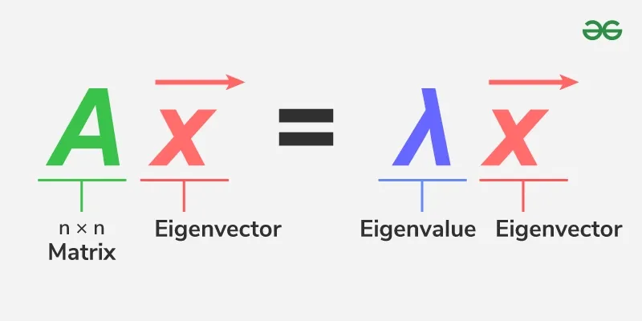

1. Eigenvalues and eigenvectors

   Eigenvalues and eigenvectors describe how matrices transform space, making them fundamental in many ML algorithms:

   - Eigenvalues ($\lambda$): Scalars showing how much a transformation stretches or compresses along a direction.
   - Eigenvectors ($v$): Non-zero vectors that only scale (not change direction) under transformation.

   For example:

   > For
   > $$
   > A =
   > \begin{bmatrix}
   > 2 & 1 \\
   > 1 & 2
   > \end{bmatrix}
   > $$
   > solving $det(A - \lambda_{1}) = 0$ gives $\lambda_{1} = 1, \lambda_{2} = 3$
   > $$
   > \lambda_{1} = 1 \rightarrow v_1 = \begin{bmatrix}
   > 1 \\
   > -1
   > \end{bmatrix} \\
   > 
   > \lambda_{2} = 3 \rightarrow v_2 = \begin{bmatrix}
   > 1 \\
   > 1
   > \end{bmatrix}
   > $$

2. Eigen Decomposition
   $$
   A = Q \Lambda A^{-1}
   $$
   where $Q$ holds eigenvectors and $\Lambda$ is diagonal with eigenvalues.

#### Singular Value Decomposition (SVD)

Singular Value Decomposition (SVD) is a factorization method in linear algebra that decomposes a matrix into three other matrices, providing a way to represent data in terms of its singular values.

SVD helps you split that table into three parts:

- $U$: This part tells you about the people (like their general preferences).
- $\sum$: This part shows how important each factor is (how much each rating matters).
- $V^T$: This part tells you about the products (how similar they are to each other)

To perform Singular Value Decomposition (SVD) for the matrix
$$
A = 
\begin{bmatrix}
3 & 2 & 2 \\
2 & 3 & -2
\end{bmatrix}
$$
, let's break it down step by step:

1. Compute $AA^T$

   First, we need to calculate the matrix $AA^T$ (*where* $A^T$ *is the transpose of matrix* $A$):
   $$
   A =
   \begin{bmatrix}
   3 & 2 & 2 \\
   2 & 3 & -2
   \end{bmatrix}
   $$

   $$
   A^T = 
   \begin{bmatrix}
   3 & 2 \\
   2 & 3 \\
   2 & -2
   \end{bmatrix}
   $$

   compute $AA^T$:
   $$
   AA^T =
   \begin{bmatrix}
   3 & 2 & 2 \\
   2 & 3 & -2
   \end{bmatrix}
   
   \cdot
   
   \begin{bmatrix}
   3 & 2 \\
   2 & 3 \\
   2 & -2
   \end{bmatrix}
   
   =
   
   \begin{bmatrix}
   17 & 8 \\
   8 & 17
   \end{bmatrix}
   $$

2. Find the Eigenvalues of $AA^T$

   To find the eigenvalues of $AA^T$, we solve the characteristic equation:
   $$
   det(AA^T - \lambda I) = 0
   $$

   $$
   det
   \begin{bmatrix}
   17 - \lambda & 8 \\
   8 & 17 - \lambda
   \end{bmatrix}
   =
   0
   $$

   $$
   (\lambda - 25)(\lambda - 9) = 0
   $$

   Thus, the eigenvalues are $\lambda_{1} = 25$ *and* $\lambda_{2} = 9$. These eigenvalues correspond to the singular values $\sigma_{1} = 5$ and $\lambda_{2} = 3$, since the singular values are the square roots of the eigenvalues.

3. Find the Right Singular Vectors (Eigenvectors of $A^TA$)

   Next, we find the eigenvectors of $A^T A$ for $\lambda = 25$ and $\lambda = 9$;

   For $\lambda = 25$:

   > Solve $(A^T A - 25I)v = 0$:
   > $$
   > A^T A - 25I =
   > \begin{bmatrix}
   > -12 & 12 & 2 \\
   > 12 & -12 & -2 \\
   > 2 & -2 & -17
   > \end{bmatrix}
   > $$
   > Row-Reduce this matrix to:
   > $$
   > \begin{bmatrix}
   > 1 & -1 & 0 \\
   > 0 & 0 & 1 \\
   > 0 & 0 & 0
   > \end{bmatrix}
   > $$
   > The eigenvector corresponding to $\lambda = 25$ is:
   > $$
   > v_1 =
   > \begin{bmatrix}
   > \frac{1}{\sqrt{2}} \\
   > \frac{1}{\sqrt{2}} \\
   > 0
   > \end{bmatrix}
   > $$

   For $\lambda = 9$:

   > Solve $(A^T A - 9I)v = 0$:
   >
   > The eigenvector corresponding to $\lambda = 9$ is:
   > $$
   > v_2 =
   > \begin{bmatrix}
   > \frac{1}{\sqrt{18}} \\
   > \frac{-1}{\sqrt{18}} \\
   > \frac{4}{\sqrt{18}}
   > \end{bmatrix}
   > $$
   > For the third eigenvector $v_3$:
   >
   > Since $v_3$ must be perpendicular to $v_1$ and $v_2$, we solve the system $v_{1}^{T}v_3 = 0$ and $v_{2}^{T}v_3 = 3$, leading to:
   > $$
   > v_3 =
   > \begin{bmatrix}
   > \frac{2}{3} \\
   > \frac{-2}{3} \\
   > \frac{-1}{3}
   > \end{bmatrix}
   > $$

4. Compute the Left Singular Vectors (Matrix U)

   To compute the left singular vectors $U$, we use the formula $u_i = \frac{1}{\sigma_{i}Av_i}$. This results in:
   $$
   U =
   \begin{bmatrix}
   \frac{1}{\sqrt{2}} & \frac{1}{\sqrt{2}} \\
   \frac{1}{\sqrt{2}} & \frac{-1}{\sqrt{2}}
   \end{bmatrix}
   $$

5. Final SVD Equation

   Finally, the Singular Value Decomposition of matrix $A$ is:
   $$
   A = U \sum V^T
   $$
   where:
   $$
   U =
   \begin{bmatrix}
   \frac{1}{\sqrt{2}} & \frac{1}{\sqrt{2}} \\
   \frac{1}{\sqrt{2}} & \frac{-1}{\sqrt{2}}
   \end{bmatrix}
   $$

   $$
   \sum = 
   \begin{bmatrix}
   5 & 0 & 0 \\
   0 & 3 & 0
   \end{bmatrix}
   $$

   $$
   V =
   \begin{bmatrix}
   \frac{1}{\sqrt{2}} & \frac{1}{\sqrt{2}} & 0 \\
   \frac{1}{\sqrt{18}} & \frac{-1}{\sqrt{18}} & \frac{4}{\sqrt{18}} \\
   \frac{2}{3} & \frac{-2}{3} & \frac{1}{3}
   \end{bmatrix}
   $$

   Thus, the SVD of matrix A is:
   $$
   A =
   \begin{bmatrix}
   \frac{1}{\sqrt{2}} & \frac{1}{\sqrt{2}} \\
   \frac{1}{\sqrt{2}} & \frac{-1}{\sqrt{2}}
   \end{bmatrix}
   
   \begin{bmatrix}
   5 & 0 & 0 \\
   0 & 3 & 0
   \end{bmatrix}
   
   \begin{bmatrix}
   \frac{1}{\sqrt{2}} & \frac{1}{\sqrt{2}} & 0 \\
   \frac{1}{\sqrt{18}} & \frac{-1}{\sqrt{18}} & \frac{4}{18} \\
   \frac{2}{3} & \frac{-2}{3} & \frac{1}{3} 
   \end{bmatrix}
   $$
   This is the Result SVD matrix of matrix A.

### Signal Processing

#### Discrete Fourier Transform (DFT)

The `Discrete Fourier Transform (DFT)` and its `Inverse (IDFT)` are core techniques in digital signal processing. They convert signals between the time or spatial domain and the frequency domain, revealing frequency components in data.

- DFT: The `Discrete Fourier Transform (DFT)` of a sequence $x(n)$ of length $N$ is:
  $$
  X(k) = \sum_{n = 0}^{N - 1}x(n) \cdot e^{-j2\pi kn/N}
  $$
  where:

  - $k = 0, 1, ..., N - 1$
  - $X(k)$ gives the frequency-domain representation.

- IDFT: The `Inverse Discrete Fourier Transform (IDFT)` reconstructs the original sequence:
  $$
  x(n) = \frac{1}{N}\sum_{k = 0}^{N - 1}X(k)\cdot e^{j2\pi kn/N}
  $$
  where:

  - $k = 0, 1, ..., N - 1$
  - $X(n)$ is the reconstructed time-domain signal.

#### Fast Fourier Transform (FFT)

*Fast Fourier Transform (FFT)* is a mathematical algorithm widely used in image processing to transform images between the *spatial domain* and the *frequency domain*. ( It is like a special translator for images).

- Spatial domain

  Each pixel in image has color or brightness value and together these values form the image you see. This is the spatial domain—the image described by its pixels.

- Frequency domain

  Now imagine describing the same image in a different way—not by the pixels directly, but by how patterns of light and dark change across the image.

- frequency domain shows how much of these patterns (or frequencies) are present in the image)

#### Principal Component Analysis (PCA)

PCA (Principal Component Analysis) is a dimensionality reduction technique and helps us to reduce the number of features in a dataset while keeping the most important information. It changes complex datasets by transforming correlated features into a smaller set of uncorrelated components.

PCA uses linear algebra to transform data into new features called principal components. It finds these by calculating eigenvectors (directions) and eigenvalues (importance) from the covariance matrix. PCA selects the top components with the highest eigenvalues and projects the data onto them simplify the dataset. Here’s how it works step by step:

1. Standardize the Data

   Different features may have different units and scales like salary vs. age. To compare them fairly PCA first standardizes the data by making each feature have:

   - A mean of 0
   - A standard deviation of 1

   $$
   Z = \frac{X-\mu}{\sigma} 
   $$

   where:

   - $\mu$ is the mean of independent features  $\mu = \left \{ \mu_1, \mu_2, \cdots, \mu_m \right \}$
   - $\sigma$ is the standard deviation of independent features $\sigma = \left \{ \sigma_1, \sigma_2, \cdots, \sigma_m \right \}$

2. Calculate Covariance Matrix

   Next PCA calculates the covariance matrix to see how features relate to each other whether they increase or decrease together. The covariance between two features x_1 and x_2 is:
   $$
   cov(x1,x2) = \frac{\sum_{i=1}^{n}(x1_i-\bar{x1})(x2_i-\bar{x2})}{n-1}
   $$
   Where:

   - $\bar{x}_1$, and $\bar{x}_2$ are the mean values of features $x_1$ and $x_2$
   - $n$ is the number of data points

   The value of covariance can be positive, negative or zeros.

3. Find the Principal Components

   PCA identifies new axes where the data spreads out the most:

   - 1st Principal Component (PC1): The direction of maximum variance (most spread).
   - 2nd Principal Component (PC2): The next best direction, perpendicular to PC1 and so on.

   These directions come from the eigenvectors of the covariance matrix and their importance is measured by eigenvalues. For a square matrix A an eigenvector X (a non-zero vector) and its corresponding eigenvalue λ satisfy:
   $$
   AX = \lambda X
   $$
   

   This means:

   - When $A$ acts on $X$ it only stretches or shrinks $X$ by the scalar $\lambda$.
   - The direction of $X$ remains unchanged hence eigenvectors define "stable directions" of $A$.

   Eigenvalues help rank these directions by importance.

4. Pick the Top Directions & Transform Data

   After calculating the eigenvalues and eigenvectors PCA ranks them by the amount of information they capture. We then:

   - Select the top k components that capture most of the variance like 95%.
   - Transform the original dataset by projecting it onto these top components.

   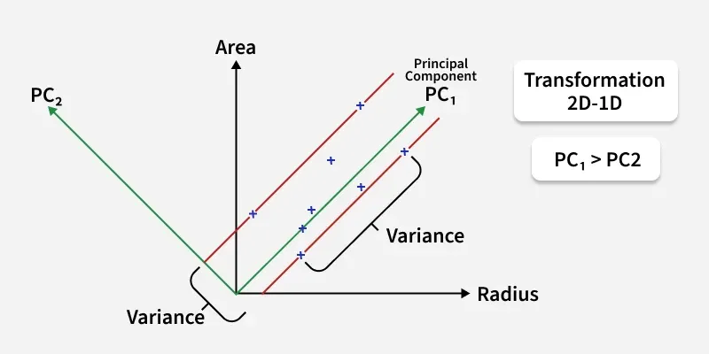

   In the above image the original dataset has two features "Radius" and "Area" represented by the black axes. PCA identifies two new directions: PC₁ and PC₂ which are the principal components.

   - These new axes are rotated versions of the original ones. PC₁ captures the maximum variance in the data meaning it holds the most information while PC₂ captures the remaining variance and is perpendicular to PC₁.
   - The spread of data is much wider along PC₁ than along PC₂. This is why PC₁ is chosen for dimensionality reduction. By projecting the data points (blue crosses) onto PC₁ we effectively transform the 2D data into 1D and retain most of the important structure and patterns.

### Convolution

Convolution is a mathematical operation that combines two functions to produce a third function. In the context of signal processing and image processing, it involves applying a filter (also known as a kernel) to an input signal or image. The convolution operation is often denoted by the symbol `*`, and it is used to express how one function (the filter) modifies another (the input signal or image).

#### 1D Convolution

In 1D convolution, the filter is a 1D array, and the convolution operation is performed by sliding the filter over the input signal and computing the sum of element-wise products at each position.
$$
(f \times g)[n] = \sum_{m = -\infty}^{\infty}f[m] \cdot g[n - m]
$$
The formula represents the mathematical formula for the discrete convolution of two sequences $f$ and $g$.

- $f$ and $g$ are discrete sequences.
- $(f \times g)[n]$ denotes the convolution output at the position $n$.
- the summation is performed over all possible values of m (from negative infinity to positive infinity).

#### 2D Convolution

In 2D convolution, the filter is a 2D matrix, and the convolution operation is applied to a 2D input, such as an image. The filter is moved across the image, and at each position, the element-wise product is computed and summed.
$$
(I * K)[i, j] = \sum_{m}\sum_{n}I[i - m, j - n] \cdot K[m, n]
$$
The formula represents the mathematical formula for the 2D discrete convolution of an image I with a kernel K.

- $I$ and $K$ are 2D matrices representing an image and a convolution kernel, respectively.
- $(I * K)[i, j]$ denotes the convolution output at position $(i, j)$.
- The summation is performed over all possible values of m and $n$.

### Deconvolution

Deconvolution is a computational process that aims to invert a [convolution operation](#Convolution), reconstructing the original signal or image from its convolved representation. Convolution involves the mathematical integration of an input signal with a filter or kernel, producing a transformed output. Deconvolution is employed to reverse this convolution process, undoing the effects of the convolution and restoring the initial signal or image.

In the discrete domain, the 1D deconvolution is defined as:
$$
(f \otimes g)[n] = \sum mf[n - m] \cdot g[m]
$$
And for 2D signals:
$$
(I \otimes K)[i, j] = \sum m \sum nI[i + m, j + n] \cdot K[m, n]
$$

#### Fourier Transform

The convolution operation in the spatial domain is equivalent to multiplication in the frequency domain. Mathematically, if $F$ is the Fourier transform of $f$ and $G$ is the `Fourier transform` of g, then :
$$
F(f \times g) = F \cdot G
$$
Deconvolution, in turn, involves dividing the Fourier transform of the convolved signal by the Fourier transform of the kernel:
$$
F(f \otimes g) = GF
$$

#### Inverse Filtering

Deconvolution can be seen as a form of inverse filtering. If H is the Fourier transform of the kernel, then the inverse filter is given by:
$$
F(f \otimes g) = 1 / H \cdot F
$$
However, inverse filtering can be sensitive to noise, and regularization techniques are often employed to stabilize the deconvolution process.

#### Wiener Deconvolution

Wiener deconvolution is a common approach that combines information from the observed signal, the point spread function (PSF), and an estimate of the noise to recover the original signal. The Wiener deconvolution in the Fourier domain is given by:
$$
F(f \otimes g) = G^{*} | G | 2 + NSG^{*} \cdot F
$$
Here, $G^{*}$ is the complex conjugate of $G$ , and $S/N$ is the signal-to-noise ratio.

### Covariance

Covariance measures how two random variables change together. It is calculated by averaging the product of their deviations from their means. A positive value means they move in the same direction, while a negative value means they move in opposite directions.

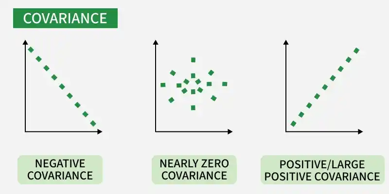

- Positive Covariance

  When one variable increases, the other variable tends to increase as well and vice versa.

- Negative Covariance

  When one variable increases, the other variable tends to decrease.

- Zero Covariance

  There is no linear relationship between the two variables; they move independently of each other.

#### Covariance Formula

1. Sample Covariance
   $$
   Cov_{S}(X, Y) = \frac{1}{n - 1}\sum_{i = 1}^{n}(X_i - X)(Y_i - Y)
   $$
   where:

   - $X_i$: The $i$th value of the variable $X$ in the sample.
   - $Y_i$: The $i$th value of the variable $Y$ in the sample.
   - $X$: The sample mean of variable $X$ (i.e., the average of all $X_i$ values in the sample).
   - $Y$: The sample mean of variable $Y$ (i.e., the average of all $Y_i$ values in the sample).
   - $n$: The number of data points in the sample.
   - $\sum$: The summation symbol means we sum the products of the deviations for all the data points.
   - $n$- 1: This is the degrees of freedom. When working with a sample, we divide by $n - 1$ to correct for the bias introduced by estimating the population covariance based on the sample data. This is known as Bessel's correction.

2. Population Covariance
   $$
   Cov_{P}(X, Y) = \frac{1}{n}\sum_{i = 1}^{n}(X_i - \mu_{X})(Y_i - \mu_{Y})
   $$
   where:

   - $X_i$: The $i$th value of the variable $X$ in the population.
   - $Y_i$: The $i$th value of the variable $Y$ in the population.
   - $\mu_{X}$: The population mean of variable $X$ (i.e., the average of all $X_i$ values in the population).
   - $\mu_{Y}$: The population mean of variable $Y$ (i.e., the average of all $Y_i$ values in the population).
   - $n$: The total number of data points in the population.
   - $\sum$: The summation symbol means we sum the products of the deviations for all the data points.
   - $n$: In the case of population covariance, we divide by $n$ because we are using the entire population data. There’s no need for Bessel’s correction since we’re not estimating anything.

### Correlation

Correlation is a standardized measure of the strength and direction of the linear relationship between two variables. It is derived from covariance and ranges between -1 and 1. Unlike covariance, which only indicates the direction of the relationship, correlation provides a standardized measure.

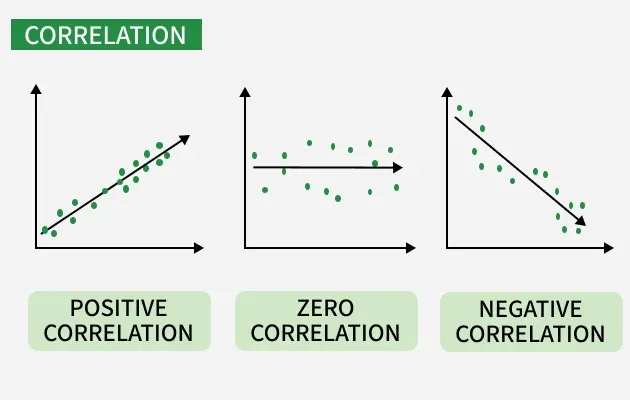

- Positive Correlation (close to +1)

  As one variable increases, the other variable also tends to increase.

- Negative Correlation (close to -1)

  As one variable increases, the other variable tends to decrease.

- Zero Correlation

  There is no linear relationship between the variables.

The correlation coefficient $\rho$ for variables X and Y is defined as:

1. Correlation takes values between -1 to +1, wherein values close to +1 represents strong positive correlation and values close to -1 represents strong negative correlation.
2. The variables may be negatively related (i.e., move in opposite directions).
3. It gives the direction and strength of relationship between variables.

Forrelation Formula:
$$
Corr(x, y) = \frac{\sum_{i = 1}^{n}(x_i - \overline{x})(y_i - \overline{y})}{\sqrt{\sum_{i = 1}^{n}(x_i - \overline{x})^2 \sum_{i = 1}^{n}(y_i - \overline{y})^2}}
$$
here,

- $x'$ and $y'$: mean of given sample set
- $n$: total no of sample
- $x_i$ and $y_i$: individual sample of set

---

## Intro

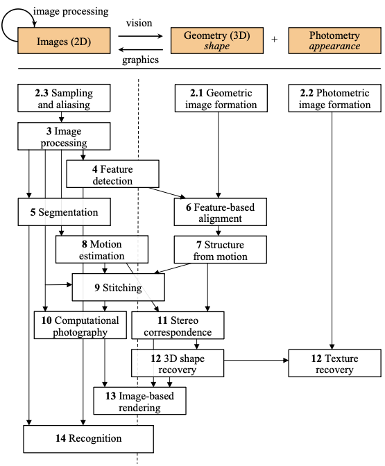

Computer Vision (CV) in artificial intelligence (AI) help machines to interpret and understand visual information similar to how humans use their eyes and brains. It involves teaching computers to analyze and understand images and videos, helping them "see" the world.

### Pixel and Resolution

A **pixel**, short for "picture element," is the smallest unit of a digital image or display that can be controlled or manipulated. Pixels are the smallest fragments of a digital photo. Pixels are tiny square or rectangular elements that make up the images we see on screens, from smartphones to televisions.

The word **resolution** may mean many things. It is used to describe the crispness and clarity of the images seen on screens in the context of digital technology, which are based on the number of pixels arranged both horizontally and vertically. Image resolution, which expresses the amount of information in digital pictures and is measured in `pixels per inch (PPI)` or `dot per inch (DPI)`, is essential for producing high-quality prints and visual presentations.

### Computer Vision Workflow

1. Image Acquisition

   It involves collecting images or videos using cameras, sensors or other devices. The quality of the image and its type (black-and-white, color or 3D) affects how the system will process the data.

2. Preprocessing

   Raw images are often not perfect, so they are cleaned up first. This might include adjusting the brightness, sharpening the image or removing unwanted noise to help the system see better.

3. Feature Detection

   In this, the system looks for key elements in the image like edges, patterns or shapes. This helps the system focus on the important parts of the image.

4. Pattern Recognition

   This compares what it detects in the image to known patterns or examples. Using machine learning, the system can recognize objects, classify images or even understand relationships in the image.

5. Decision Making

   After recognizing patterns, the system uses this information to make decisions such as identifying a dog in the image or recognizing a stop sign in a video.

### Computer Vision Tasks

1. Object Recognition

   This is used for identifying objects in an image, such as recognizing a car, dog, or tree. It’s used in surveillance, self-driving cars, and checking products in factories.

2. Face Recognition

   This involves identifying people based on their facial features. It is used in security systems, unlocking smartphones, and identifying people in photos or videos.

3. Image Segmentation

   Segmentation breaks an image into smaller parts for easier analysis. For example, in medical imaging, different organs may be segmented to focus on specific areas.

4. Optical Character Recognition (OCR)

   OCR helps in recognizing text in images, such as scanning documents or extracting text from pictures of signs. It’s used in document scanners, translation apps, and more.

---

## Image Processing

### Image Representation

As we know, images are represented in rows and columns we have the following syntax in which images are represented: 
$$
f(x, y) =
\begin{bmatrix}
f(0, 0) & f(0, 1) & f(0, 2) & \cdots & f(0, N - 1)\\
f(1, 0) & f(1, 1) & f(1, 2) & \cdots & f(1, N - 1)\\
\vdots & \vdots & \vdots & \vdots & \vdots \\
f(M - 1, 0) & f(M - 1, 1) & f(M - 1, 2) & \cdots & f(M - 1, N - 1)\\
\end{bmatrix}
$$
The right side of this equation is digital image by definition. Every element of this matrix is called image element , picture element , or [pixel](#Pixel and Resolution). 

### Image Transformation

Image Transformation involves the transformation of image data in order to retrieve information from the image or to preprocess the image for further usage.

#### Geometric Transformation

Geometric Transformation allows us to alter the spatial arrangement of pixels in a image which is important for tasks such as alignment, correction, enhancement and visualization. Geometric transformation modifies the location of pixels in a image. It consists of two main steps:

- Spatial transformation of pixels or coordinates and intensity interpolation.
- Intensity interpolation is used to assign the intensity value of pixels after spatial transformation.

The geometric transformation is given by the equation in matrix form:
$$
\begin{bmatrix}
x' \\
y'
\end{bmatrix}
=
T \begin{bmatrix}
x \\
y
\end{bmatrix}
=
\begin{bmatrix}
a & b \\
c & d
\end{bmatrix}
\begin{bmatrix}
x \\
y
\end{bmatrix}
$$
where:

- $(x, y)$ is the input coordinate
- $(x', y')$ is the output coordinate
- $T$ is the geometric transformation matrix

- Translation

  Translation displaces an image by a certain amount of pixels about the $x$ and $y$ axis. This operation translates the image in a way such that every pixel in the image will be shifted to a new position maintaining the shape and size of the image. Its equation is:
  $$
  \begin{bmatrix}
  x' \\
  y'
  \end{bmatrix}
  =
  \begin{bmatrix}
  x + \Delta x \\
  y + \Delta y
  \end{bmatrix}
  $$

- Rotation

  Rotation is a process in which a image is simply rotated around the origin or an image center by a given angle. This rotates the image or changes the orientation of an image depending on the angle it has been set to. Its equation is:
  $$
  \begin{bmatrix}
  x' \\
  y'
  \end{bmatrix}
  =
  \begin{bmatrix}
  \cos \theta & -\sin x \\
  \sin \theta & \cos \theta
  \end{bmatrix}
  \begin{bmatrix}
  x \\
  y
  \end{bmatrix}
  $$

- Scaling

  Scaling enables one to make the image larger or smaller in size. Most scaling methods preserve aspect ratio but general scaling is achieved by changing the dimension on different axes unlike other methods. Its equation is:
  $$
  \begin{bmatrix}
  x' \\
  y'
  \end{bmatrix}
  =
  \begin{bmatrix}
  x_x & 0 \\
  0 & x_y
  \end{bmatrix}
  \begin{bmatrix}
  x \\
  y
  \end{bmatrix}
  $$

- Shearing (Skewing)

  Shearing displaces the pixel in one direction and as a result it causes an inclined output to be produced. It is similar to rotation but this transformation changes the angles between the axes of the image. Its equation is:
  $$
  \begin{bmatrix}
  x' \\
  y'
  \end{bmatrix}
  =
  \begin{bmatrix}
  1 & k_y \\
  k_x & 1
  \end{bmatrix}
  \begin{bmatrix}
  x \\
  y
  \end{bmatrix}
  $$

- Affine Transformation

  The affine transformation is given by the equations in matrix form:
  $$
  \begin{bmatrix}
  x' \\
  y' \\
  1
  \end{bmatrix}
  =
  \begin{bmatrix}
  x \\
  y \\
  1
  \end{bmatrix}
  =
  \begin{bmatrix}
  a & b & c \\
  d & e & f \\
  0 & 0 & 1
  \end{bmatrix}
  \begin{bmatrix}
  x \\
  y \\
  1
  \end{bmatrix}
  $$
  where:

  - $(x, y)$ is the input coordinate
  - $(x', y')$ is the output coordinate
  - $A$ is the affine transformation matrix

- Perspective Transformation

  It is given by the equations in matrix form:
  $$
  \begin{bmatrix}
  x' \\
  y' \\
  w'
  \end{bmatrix}
  =
  \begin{bmatrix}
  x \\
  y \\
  1
  \end{bmatrix}
  =
  \begin{bmatrix}
  a & b & c \\
  d & e & f \\
  g & h & i
  \end{bmatrix}
  \begin{bmatrix}
  x \\
  y \\
  1
  \end{bmatrix}
  $$
  where:

  - $w'x' = ax + by + c$
  - $w'y' = dx + ey + f$
  - $w' = gx + hy + i$

  To find $x'$ and $y'$ we need to normalize them with respect to $w'$. Thus the coordinate equations for perspective transformation are:
  $$
  x' = \frac{ax + by + c}{gx + hy + i}, y' = \frac{dx + ey + f}{gx + hy + i}
  $$

#### Image Negatives (Linear)

- Spetial Domain Process

  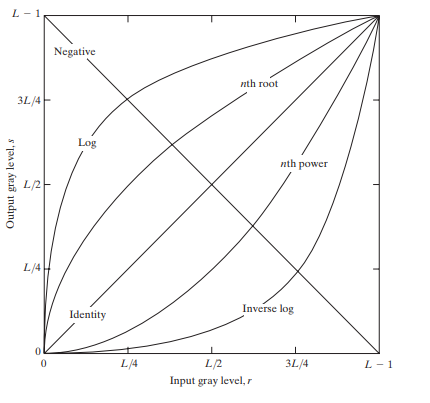

  Spatial domain processes can be described using the equation: $g(x, y) = T[f(x, y)]$ where $f(x, y)$ is the input image, $T$ is an operator on $f$ defined over a neighbourhood of the point $(x, y)$, and $g(x, y)$ is the output.

- Image Negatives

  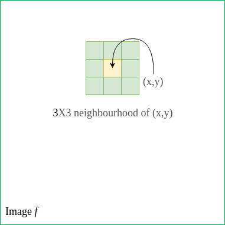

  Mathematically, assume that an image goes from intensity levels 0 to (L-1). Generally, L = 256. Then, the negative transformation can be described by the expression $s = L - 1 - r$ where $r$ is the initial intensity level and $s$ is the final intensity level of a pixel. This produces a photographic negative.

#### Log Transformation

Mathematically, log transformations can be expressed as $s = clog(1 + r)$. Here, $s$ is the output intensity, $r >= 0$ is the input intensity of the pixel, and c is a scaling constant. c is given by $255/(\log (1 + m))$, where m is the maximum pixel value in the image. It is done to ensure that the final pixel value does not exceed $(L - 1)$, or 255. Practically, log transformation maps a narrow range of low-intensity input values to a wide range of output values. Consider the following input image.

#### Power-Law (Gamma) Transformation

Power-law (gamma) transformations can be mathematically expressed as $s = cr^{\gamma}$. Gamma correction is important for displaying images on a screen correctly, to prevent bleaching or darkening of images when viewed from different types of monitors with different display settings. This is done because our eyes perceive images in a gamma-shaped curve, whereas cameras capture images in a linear fashion. 

#### Piecewise-Linear Transformation

These functions, as the name suggests, are not entirely linear in nature. However, they are linear between certain x-intervals. One of the most commonly used piecewise-linear transformation functions is contrast stretching. Contrast can be defined as:
$$
Contrast =  (I_{max} - I_{min})/(I_{max} + I_{min})
$$
This process expands the range of intensity levels in an image so that it spans the full intensity of the camera/display. 

### Image Enhancement

Image enhancement is the process of improving the quality and appearance of an image. It can be used to correct flaws or defects in an image or to simply make an image more visually appealing.

#### Contrast Enhancement

Improves the difference between dark and bright regions. Makes features more distinguishable in an image.

#### Brightness Adjustment

Modifies the overall lightness of the image. Achieved by adding or subtracting constant values to pixel intensities. Helps in making dark images clearer or reducing overexposure.

#### Sharpening

Enhances edges and fine details in an image. Makes features clearer and more defined.

#### Endge Enchancement

Highlights boundaries between objects or regions in an image. Helps in feature extraction and object detection.

#### Color Enhancement

Improves color balance, saturation or hue. Enhances visual appeal or clarifies features in colored images.

#### Frequency Domain Enhancement

Applies filters in the frequency domain to improve image quality. Can remove noise or enhance details based on frequency components.

#### Histogram Equalization

The histogram of a digital image, with intensity levels between 0 and (L-1), is a function $h(r_k) = n_k$, where $r_k$ is the $k$th intensity level and $n_k$ is the number of pixels in the image having that intensity level. We can also normalize the histogram by dividing it by the total number of pixels in the image. For an N x N image, we have the following definition of a normalized histogram function: 
$$
p(rk) = nk/N2
$$
This $p(r_k)$ function is the probability of the occurrence of a pixel with the intensity level $r_k$. Clearly, 
$$
\sum p(rk) = 1
$$
The histogram of an image, as shown in the figure, consists of the x-axis representing the intensity levels $r_k$ and the y-axis denoting the $h(r_k)$ or the $p(r_k)$ functions. 

Let us consider that the intensity levels of the image $r$ is continuous, unlike the discrete case in digital images. We limit the values that $r$ can take between $0$ and $L - 1$, that is, $0 \leq r \leq L - 1$ . $r = 0$ represents black and $r = L - 1$ represents white. Let us consider an arbitrary transformation function:
$$
s = T(r)
$$
where $s$ denotes the intensity levels of the resultant image. We have certain constraints on $T(r)$. 

- $T(r)$ must be a strictly increasing function. This makes it an injective function.
- $0 \leq T(r) \leq L - 1$ This makes $T(r)$ surjective.

The above two conditions make $T(r)$ a bijective function. We know that such functions are invertible. So we can get back r values from s. We can have a function such that  $r = T - 1(s)$.

Let us now say that the probability density function (pdf) of $r$ is $p_r(x)$ and the cumulative distribution function (CDF) of $r$ is $F_r(x)$. Now the CDF of $s$ will be :
$$
FS(x) = P(s \leq x) = P(T(r) \leq x) = P(r \leq T - 1(x)) = F_r(T - 1(x))
$$
We put the first condition of $t(r)$ precisely to make the above step hold true. The second condition is needed as $s$ is the intensity value for the output image and so must be between $0$ and ($L - 1$).

So, a pdf of s can be obtained by differentiating $F_s(x)$ with respect to $x$.We get the following relation:
$$
p_s(s) = p_r(r)_{ds}^{dr}
$$
Now, if we define the transformation function as follows:
$$
s = T(r) = (L - 1)\int_{0}^{r}p_r(x)dx
$$
Then using this function gives us a uniform pdf for $s$.
$$
\frac{ds}{dr} = (L - 1)_{dr}^{d}\int_{0}^{r}p_r(x)dx = (L - 1)p_r(r)
$$
 The above step used Leibnitz's integral rule. Using the above derivative, we get:
$$
p_s(s) = p_r(r)_{ds}^{dr} = p_r(r)\frac{1}{(L - 1)p_r(r)} = \frac{1}{L - 1}
$$
So the pdf of $s$ is uniform. This is what we want.

Now, we extend the above continuous case to the discrete case. The natural replacement of the integral sign is the summation. Hence, we are left with the following histogram equalization transformation function. 
$$
s_k = T(r_k) = (L - 1)\sum_{j = 0}^{k}p_r(r_j) = \frac{(L - 1)}{N^2}\sum_{j = 0}^{k}n_j
$$
Since $s$ must have integer values, any non-integer value obtained from the above function is rounded off to the nearest integer. 

### Noise Reduction (Smoothing)

Image denoising techniques in computer vision are essential for enhancing the quality of images corrupted by noise, thereby improving the accuracy of subsequent image processing tasks. 

Types of Noise:

1. Gaussian Noise

   Gaussian noise arises in an image due to factors such as electronic circuit noise and sensor noise due to poor illumination or high temperature.
   $$
   p(z) = \frac{1}{\sigma \sqrt{2\pi}} e^{-\frac{(z - m)^2}{2\sigma^{2}}}
   $$
   Here, $m$ is the mean and $\sigma^{2}$ is the variance. 

2. Rayleigh Noise
   $$
   p(z) = \frac{2}{b}(z - a)e^{-\frac{(z - a)^2}{b}} \text{ for } z \geq a, \text{ and } p(z) = 0 \text{ otherwise}
   $$
   Here mean $m$ and variance $\sigma^{2}$ are the following:
   $$
   m = a + \sqrt{\pi b / 4} \\
   \sigma^{2} = \frac{b(4 - \pi)}{4}
   $$
   Rayleigh noise is usually used to characterize noise phenomena in range imaging. 

3. Erlang (or gamma) Noise
   $$
   p(z) = \frac{a^b z^{b - 1}}{(b - 1)!}e^{-az} \text{ for } z \geq 0 \text{ and } p(z) = 0 \text{ otherwise}.
   $$
   Here ! indicates factorial. The mean and variance are given below:
   $$
   m = b / a, \sigma2 = b / a2
   $$
   Gamma noise density finds application in laser imaging.

4. Exponential Noise
   $$
   p(z) = ae^{-az} \text{ for } z \geq 0 \text{ and } p(z) = 0 \text{ otherwise.}
   $$
   Here $a > 0$. The mean and variance of this noise pdf are:
   $$
   m = 1 / a, \sigma2 = 1/\sigma2
   $$
   This density function is a special case of b = 1. 

   Exponential noise is also commonly present in cases of laser imaging.

5. Uniform Noise
   $$
   p(z) = \frac{1}{b - a} \text{ if } a \leq z \leq b, \text{ and } p(z) = 0 \text{ otherwise.}
   $$
   The mean and variance are given below.
   $$
   m = \frac{a + b}{2} \sigma^{2} = \frac{(b - a)^{2}}{12}
   $$
   Uniform noise is not practically present but is often used in numerical simulations to analyze systems.

6. Impulse Noise
   $$
   p(z) = Pa \text{ for } z = a, \\
   p(z) = Pb \text{ for } z = b, \\
   p(z) = 0 \text{ otherwise}
   $$
   If b > a, intensity b will appear as a light dot in the image.

#### Gaussian Filter

The Gaussian filter blurs the image as output is an average of the pixels value within the particular neighborhood with a weighting function of Gaussian distribution. This technique entailing much high-frequency noise, which are the fine details and edges, and reduce them to give a smoother image. The standard deviation (sigma) of the Gaussian function controls the level of smoothing:

- Small sigma: They have less smoothing which retains more of the features and details of the objects and surfaces.
- Large sigma: A little more smoothing, which is even capable of washing out the important features.

The 2D Gaussian function is defined as:
$$
G(x, y) = \frac{1}{2\pi\sigma^{2}}e^{-\frac{x^2 + y^2}{2\sigma^{2}}}
$$
where:

- $x$, $y$ are the coordinates
- Mathematical Constant PI (value = 3.13)
- $\sigma$ is the Standard Deviation

#### Median Filter

The Median filter is a non-linear filter that replaces each pixel value with median value of the pixels in its neighborhood. This filter proves quite useful in the removal of salt-and-pepper noise which is characterized by isolated black and white speckles. The Median filter works well because:

Actually, it yields edges in better preservation than the [Gaussian filter](#Gaussian Filter).

- It can effectively filter out any noise particularly the outliers WHILE at the same time making sure that overall important features will not be lost.
- The size of the neighborhood or the kernel by which we can increase or reduce defines the degree of noise removal or the degree of detail preservation.

#### Non-Local Means (NLM)

NLM is another enhanced denoising method, distinguishable from the simpler, straightforward local neighborhood parking scheme. It operates through applying the formula that divides the sum of all pixels’ values in the image by their corresponding weights, if the pixels are similar to the referenced pixel. Key features of NLM include:

- Similarity Measure: Talking more of intensity value pixels are compared by the intensity values found in a certain window surrounding the said pixel.
- Search Window: The region where similar pixels are looked for averaging to advance a shared procedure.

NLM gives excellent results in preserving vital features such as textures and fine details because it is able to search for similar patterns within the image.

#### Convolutional Neural Networks (CNNs)

[Deep Learning#Convolutional Neural Networks(CNNs)](dl.md), such as DnCNN, are trained to map from the noisy images to the clean ones. The SO features employ multiple layers of the convolutional filter, which is used to reconstruct image features and, therefore, minimize noise.

#### Generative Adversarial Networks (GANs)

There is always a generator and a discriminator network in case of [Deep Learning#Generative Adversarial Networks (GANs)](dl.md). The generator produces resultant clear images; on the other hand, the discriminator aims at distinguishing between the original and clear images. This way, GANs obtain highly realistic images that have been denoised during the described adversarial process. The identified methods of deep learning are convenient because they are capable of working with various patterns of noise and with different kinds of images.

#### Spatial Filtering

The spatial filtering technique is used directly on the pixels of an image. Mask is usually considered to be added in size so that it has a specific center pixel. This mask is moved on the image such that the center of the mask traverses all image pixels.

Theory:

- Neighborhood processing in spatial domain

  Here, to modify one pixel, we consider values of the immediate neighboring pixels also. For this purpose, 3X3, 5X5, or 7X7 neighborhood mask can be considered.

- Low Pass filtering

  It is also known as the smoothing filter. It removes the high-frequency content from the image. It is also used to blur an image. A low pass averaging filter mask is as shown.

- High Pass Filtering

  It eliminates low-frequency regions while retaining or enhancing the high-frequency components. A high-pass filtering mask is shown.

- Median Filtering

  It is also known as nonlinear filtering. It is used to eliminate salt and pepper noise. Here the pixel value is replaced by the median value of the neighboring pixel. 

#### Bilateral Filtering

A bilateral filter is used for smoothening images and reducing noise, while preserving edges.

Gaussian blurring can be formulated as follows:
$$
GB[I]_{p} = \sum_{q \in S}G_{\sigma}(||p - 1||)I_{q}
$$
here, $GA[I]_{p}$ is the result at pixel $p$, and the RHS is essentially a sum over all pixels $q$ weighted by the Gaussian function. $I_q$ is the intensity at pixel $q$.

The bilateral filter can be formulated as follows: 
$$
BF[I]_{p} = \frac{1}{W_{p}}\sum_{q \in S}G_{\sigma_{s}}(||p - q||)G_{\sigma_{r}}(|I_p - I_q|)I_q
$$
Here, the normalization factor and the range weight are new terms added to the previous equation. $\sigma_{s}$ denotes the spatial extent of the kernel, i.e. the size of the neighborhood, and $\sigma_{r}$ denotes the minimum amplitude of an edge. It ensures that only those pixels with intensity values similar to that of the central pixel are considered for blurring, while sharp intensity changes are maintained. The smaller the value of $\sigma_{r}$ , the sharper the edge. As $\sigma_{r}$ tends to infinity, the equation tends to a Gaussian blur.

### Morphological Operation

#### Erosion

Erosion in image processing is a morphological operation that shrinks and thins the boundaries of objects in an image by removing pixels on object edges, effectively making objects smaller and removing small white noise.

Purpose:

- Shrinks or erodes the boundaries of foreground objects (usually white pixels).
- Removes fine white noise and separates objects that are touching.

#### Dilation

Dilation is a morphological operation that expands the boundaries of objects in an image by adding pixels to object edges making objects appear larger and filling in small gaps or holes.

Purpose:

- Expands the boundaries of the foreground objects.
- Accentuates or enlarges features and fills small gaps.

#### Opening

Opening is a *morphological operation* that involves two steps: *Erosion -> followed by -> Dilation*:
$$
A \circ B = (A \ominus B) \oplus B
$$

- $A \circ B$: Opening of image A by structuring element B
- $\ominus$: Erosion operation
- $\oplus$: Dilation operation

It helps removes small white noise (tiny bright spots) from black backgrounds without affecting shape and size of larger white objects. Useful for cleaning internal noise like small specks or dots while preserving the main object’s structure.

#### Closing

Closing is a morphological operation that involves two steps: *Dilation -> followed by -> Erosion*:
$$
A \bullet B = (A \oplus B) \ominus B
$$

- $A \bullet B$: Closing of image $A$ by structuring element $B$.
- $\oplus$: Dilation operation
- $\ominus$: Erosion operation

Closing helps fill small black holes or gaps in white objects without altering their overall shape. It’s useful for closing small dark spots or breaks inside objects, preserving their outer structure.

#### Gradient

Gradient is a morphological operation that involves two steps: *Dilation − Erosion*:
$$
A = (A \oplus B) - (A \ominus B)
$$

- $A$: input image
- $B$: structuring element (kernel)
- $\oplus$: Dilation
- $\ominus$: Eorsion

Gradient highlights the boundaries of objects by finding difference between their dilated and eroded versions. It’s useful for detecting edges and outlining shapes without affecting their internal regions.

### Image Compression

Image compression is used to make image file sizes smaller so that they take up less space on a computer and can be shared faster over the internet. The goal is to reduce the file size without changing how the image looks. In computers, images are made up of tiny blocks called `pixels,` and each pixel stores an information intensity value (colour). When an image is very large, it contains millions of these numbers, which means the file size becomes big.

To compress an image we usually follow three main steps:

1. Transforming The Image

   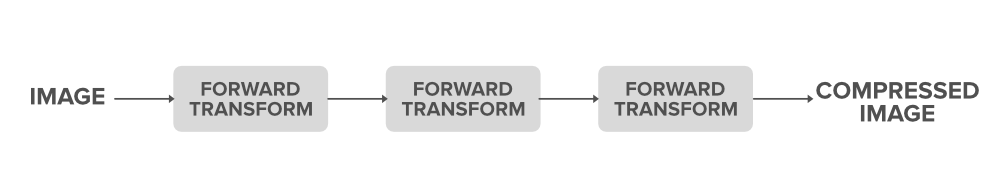

2. Quantization

   Once we have transformed the image, we get many numbers. Some of these numbers are very small and don’t contribute much to how the image looks. In quantization, we `reduce the number of different values` by rounding them off to the nearest level.

3. Symbol Encoding

   After quantization we are left with few values and some values like 0s might repeat many times. In this step we use `smart coding methods` to save more space.

---

## Feature Extraction

### Edge Detection

Edge detection in computer vision is used to identify the points in a digital image at which the brightness changes sharply or has discontinuities. These points are typically organized into curved line segments termed edges. 

Edges can be classified into several types based on their appearance and the way intensity changes occur:

1. Step Edges

   A step edge is characterized by a sudden and significant change in intensity between two adjacent regions.

2. Line Edges

   A line edge occurs where there is a transition in intensity that results in a thin line, typically surrounded by areas of different intensity.

3. Junction Edges

   Junction edges occur at the intersection of two or more edges, where multiple intensity transitions meet.

There are main types of edge detection methods: 

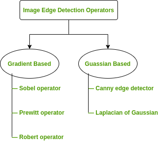

#### Canny Edge Detector

The Canny Edge Detector is a multi-stage algorithm known for its accuracy and robustness in detecting edges. Introduced by John Canny in 1986, this method aims to find edges by looking for the local maxima of the gradient of the image. It optimizes the edge detection process based on three criteria: low error rate, good localization, and minimal response to noise.

Steps Involved:

1. Smoothing

   The first step involves reducing noise in the image using a  [Gaussian filter](#Gaussian Filter). The image is convolved with this Gaussian kernel to produce a smoothed image.

2. Finding Gradients

   The gradients of the smoothed image are computed using finite difference approximations, typically with the Sobel operator

   operator: 
   $$
   \begin{bmatrix}
   -1 & 0 & 1 \\ 
   -2 & 0 & 2 \\
   -1 & 0 & 1
   \end{bmatrix}
   \begin{bmatrix}
   -1 & -2 & -1 \\ 
   0 & 0 & 0 \\
   1 & 2 & 1
   \end{bmatrix}
   $$
   The gradient magnitude is then computed as: $G = \sqrt{G_{x}^{2} + G_{y}^{2}}, \theta = \tan^{-1}\frac{G_y}{G_x}$.

3. Non-Maximum Suppression

   This step involves thinning the edges by suppressing non-maximum gradient values. Only the local maxima in the direction of the gradient are preserved, resulting in a set of thin edges.

4. Double Thresholding

   Two thresholds, $T_{low}$ and $T_{high}$, are applied to classify the gradient magnitudes into strong, weak, and non-relevant pixels:

   - Strong edges: $G \geq T_{high}$
   - Weak edges: $T_{low} \leq G < T_{high}$
   - Non-relevant pixels: $G < T_{low}$

5. Edge Tracking by Hysteresis

   Weak edges connected to strong edges are preserved, while others are discarded. This step ensures continuity and accuracy in edge detection by linking weak edge pixels that form a continuous line with strong edges.

#### Sobel Operator

The *Sobel Operator* is a method used to detect edges in an image by checking how pixel values (brightness) change in the horizontal and vertical directions. It uses two 3 x 3 kernels or masks which are convolved with the input image to calculate the vertical and horizontal derivative approximations respectively:
$$
G_x = 
\begin{pmatrix}
-1 & -2 & -1 \\ 
0 & 0 & 0 \\
1 & 2 & 1
\end{pmatrix},

G_y = 
\begin{pmatrix}
-1 & 0 & 1 \\ 
-2 & 0 & 2 \\
-1 & 0 & 1
\end{pmatrix}
$$

- $G_x$ detect edges from left to right
- $G_y$ detect edges from top to bottom

The gradient magnitude is then computed as: $G = \sqrt{G_{x}^{2} + G_{y}^{2}}$

By combining the results from both it finds the overall edge strength and direction.

#### Prewitt Operator

It is very similar to the [Sobel Operator](#Sobel Operator), but with a slight difference is that it calculates the edge gradients. Like Sobel, it detects edges in the horizontal and vertical directions using two 3×3 matrices, but it uses a *uniform averaging technique* in its kernel, making it less accurate than Sobel but faster and simpler to implement:
$$
G_x = 
\begin{pmatrix}
-1 & -1 & -1 \\ 
0 & 0 & 0 \\
1 & 1 & 1
\end{pmatrix},

G_y = 
\begin{pmatrix}
-1 & 0 & 1 \\ 
-1 & 0 & 1 \\
-1 & 0 & 1
\end{pmatrix}
$$

- $G_x$ detect edges from left to right
- $G_y$ detect edges from top to bottom

The gradient magnitude is computed similarly: $G = \sqrt{G_{x}^{2} + G_{y}^{2}}$

By combining the results from both it finds the overall edge strength and direction.

#### Robert Cross Operator

The Roberts Cross operator is an early edge detection method that computes the gradient at a point in the image using the differences between diagonally adjacent pixels. It emphasizes edge detection along the diagonals.

The Roberts Cross operator uses two 2x2 convolution masks for diagonal edge detection:
$$
\begin{bmatrix}
1 & 0 \\
0 & -1 
\end{bmatrix}

\begin{bmatrix}
0 & 1 \\
-1 & 0 
\end{bmatrix}
$$
The gradient magnitude is then computed as:
$$
G = \sqrt{G_{x}^{2} + G_{y}^{2}}
$$

#### Difference of Gaussian (DoG)

The Difference of Gaussian (DoG) is an edge detection technique that approximates the Laplacian of Gaussian by subtracting two Gaussian-blurred versions of the image with different standard deviations. This method is simpler and faster to compute than LoG while providing similar edge detection capabilities.

Mathematical Formulation:

1. Gaussian Smoothing

   The image is smoothed using two [Gaussian filter](#Gaussian Filter) with different standard deviations, $\sigma_{1}$ and $\sigma_{2}$: $G_1(x, y) = \frac{1}{2\pi\sigma_{1}^{2}}e^{-\frac{x^2 + y^2}{2\sigma_{1}^{2}}}, G_2(x, y) = \frac{1}{2\pi\sigma_{2}^{2}}e^{-\frac{x^2 + y^2}{2\pi_{2}^{2}}}$

2. Difference of Gaussian

   The DoG is computed by subtracting the two Gaussian-blurred images: $DoG(x, y) = (G_{\sigma_{1}(x, y)} - G_{\sigma_{2}}(x, y)) * I(x, y)$

#### Laplacian of Gaussian (LoG)

*Marr-Hildreth Operator* is also called *Laplacian of Gaussian (LoG)* and it is a *Gaussian-based edge detection method*. It works by first smoothing the image using a [Gaussian filter](#Gaussian Filter) to remove noise and then applying the Laplacian operator to detect regions where the intensity changes sharply. The LoG operator first smooths the image using a [Gaussian filter](#Gaussian Filter) to reduce noise then applies the Laplacian to detect edges. It detects edges at zero-crossings where the result changes from positive to negative.
$$
LoG(x, y) = (\frac{x^2 + y^2 - 2\sigma^{2}}{\sigma^{4}}) \cdot e^{-\frac{x^2 + y^2}{2\sigma^{2}}}
$$

- $\sigma$ standard deviation of the Gaussian filter
- $x,y$ pixel coordinates

Mathematical Formulation:

1. Gaussian Smoothing

   The image is first smoothed using a Gaussian filter to reduce noise. The Gaussian filter is defined as: $G(x, y) = \frac{1}{2\pi\sigma^{2}}e^{\frac{x^2 + y^2}{2\sigma^{2}}}$, $\sigma$ is the standard deviation of the Gaussian.

2. Laplacian Operator

   The Laplacian operator is then applied to the smoothed image. The Laplacian is defined as: $\nabla^{2}f(x, y) = \frac{\partial^{2}f}{\partial x^{2}} + \frac{\partial^{2}f}{\partial y^2}$

3. LoG

   The combined LoG operator is the result of convolving the Gaussian-smoothed image with the Laplacian: $LoG(x, y) = \nabla^{2}(G(x, y) * I(x, y))$

Use LoG when your image is noisy, and you need to clean it.

### Corner and Interest Point Detection

An **interest point** can be defined as a location or a part of an image that possesses a distinct texture or exhibits unique characteristics such as the intersection of multiple edge segments or a rapid change in the direction of edges. These interest points are distinguished by their ability to maintain stability even when subjected to variations in scale, rotation, and lighting conditions. Mainly, it is of paramount importance to accurately compute these interest points with a high level of consistency, ensuring effective and reliable detection.

#### Harris Corner Detection

Harris Corner Detection is a key technique in computer vision for detecting corners in images. It works by analyzing how the intensity of the image changes in different directions, helping us identify areas with significant variations which are considered corners.

### Feature Detection

**Feature Descriptor** is basically a way of representing a part of an image that has some distinctive or interesting characteristics. It is usually a set of numbers that describe the appearance, shape, or texture of the region around a key point, which is a point of interest in the image. Feature descriptors are useful for comparing and matching images, as they allow algorithms to find similar regions or objects in different images.

**Feature Vector** is defined as a mathematical representation of the feature descriptor in a vector format with one or more dimensions. It is basically a one-dimensional vector that encapsulates information from a feature descriptor to a multi-dimensional feature space. It can also take the form of a text or mathematical-logical descriptions of an interest point. It compiles diverse pieces of information related to an object. 

#### Scale Invariant Feature Transform (SIFT)

**SIFT (Scale Invariant Feature Transform)** Detector is used in the detection of *interest points* on an input image. Unlike the *Harris Detector*, which is dependent on properties of the image such as viewpoint, depth, and scale, SIFT can perform feature detection independent of these properties of the image. This is achieved by the transformation of the image data into *scale-invariant coordinates*. The SIFT Detector has been said to be a close approximation of the system used in the primate visual system.

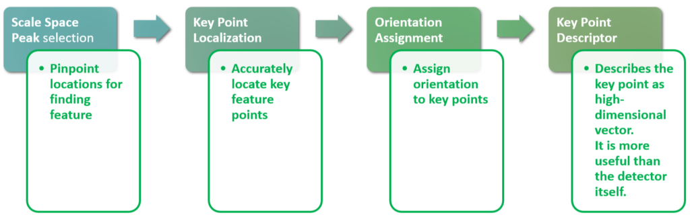

1. Scale Space Peak Selection

   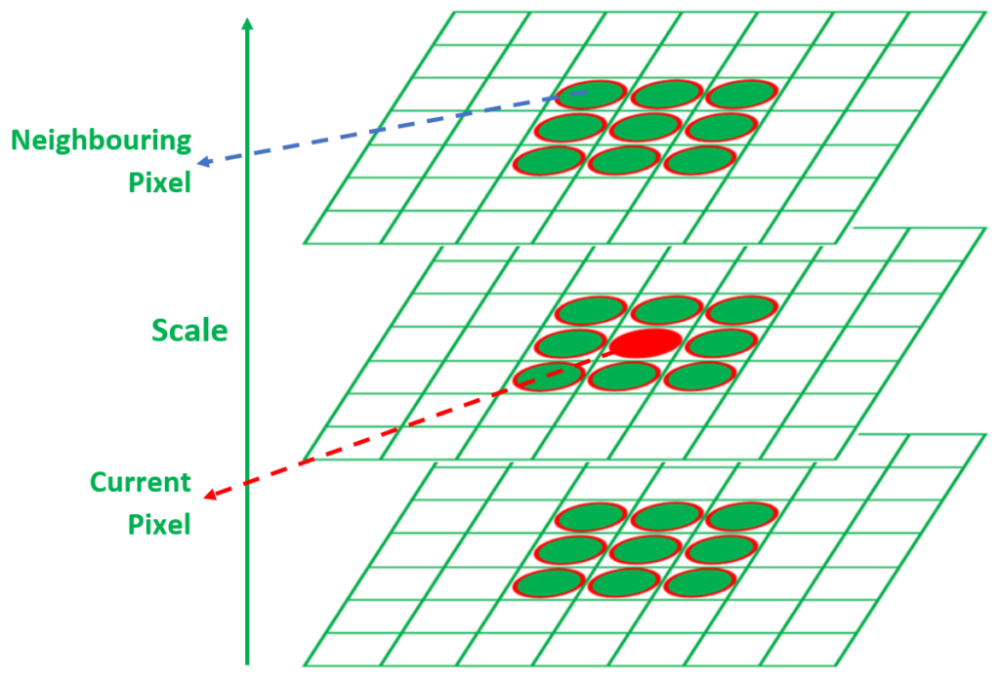

   The concept of Scale Space deals with the application of a continuous range of Gaussian Filters to the target image such that the chosen Gaussian have differing values of the sigma parameter. The plot thus obtained is called the *Scale Space*. Scale Space Peak Selection depends on the *Spatial Coincidence Assumption*. According to this, if an edge is detected at the *same location in multiple scales* (indicated by zero crossings in the scale space) *then we classify it as an actual edge.*

2. Key Point Localization

   Key point localization involves the refinement of key points selected in the previous stage. Low contrast key-points, unstable key points, and key points lying on edges are eliminated. This is achieved by calculating the *Laplacian* of the keypoints found in the previous stage. The extrema values are computed as follows:
   $$
   Z = -\frac{\partial^{2}D^{-1}}{\partial x^{2}}\frac{\partial D}{\partial x}
   $$
   In the above expression, $D$ represents the Difference of Gaussian. To remove the unstable key points, the value of $z$ is calculated and if the function value at $z$ is below a threshold value then the point is excluded. 

3. Assigning Orientation to Keypoints

   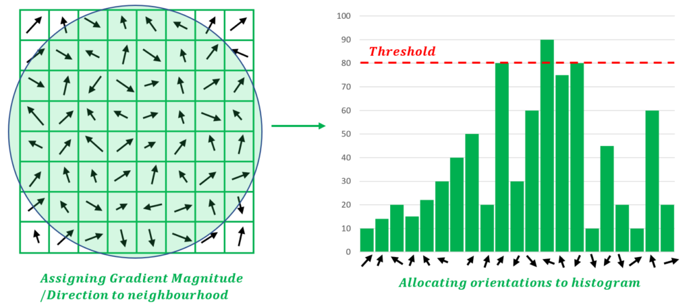

   To achieve detection which is invariant with respect to the rotation of the image, orientation needs to be calculated for the key-points. This is done by considering the neighborhood of the keypoint and calculating the magnitude and direction of gradients of the neighborhood.

4. Keypoint Descriptor

   Finally, for each keypoint, a descriptor is created using the keypoints neighborhood. These descriptors are used for matching keypoints across images.

#### Speeded Up Robust Features (SURF)

SURF is an enhancement of SIFT and was designed to improve the speed of feature detection and matching. Like SIFT, it is invariant to rotations, scale, and robust against noise, making it effective for real-time applications. SURF employs several optimizations and approximations:

- Fast Hessian Detector

  Uses integral images for image convolutions, allowing quick computation of responses across the image and scales.

- Orientation and Descriptor

  Establishes the dominant orientation for each feature to achieve rotation invariance and generates a descriptor from sums of the Haar wavelet responses, ensuring robustness and efficiency.

Key Steps in SURF:

1. Intergral Images

   Use integral images to quickly compute the sum of image intensities over rectangular regions, enhancing speed.

2. Fast Hessian Matrix-Based Detector

   Detect keypoints using the determinant of the Hessian matrix, which provides a measure of local changes in the image.

3. Keypoint Localization and Orientation

   Similar to SIFT, keypoints are localized and an orientation is assigned based on Haar wavelet responses within a circular region around the keypoint.

4. Keypoint Descriptor

   Construct a descriptor by considering the Haar wavelet responses in the horizontal and vertical directions within a square region around the keypoint, resulting in a 64-dimensional vector.

#### Oriented FAST and Rotated BRIEF (OFRB)

The ORB (Oriented FAST and Rotated BRIEF) algorithm is an efficient method for feature matching. It combines FAST which detects keypoints and BRIEF which describes those keypoints. Since BRIEF struggles with rotation, ORB makes it better by rotating the descriptors based on the keypoints orientation. It is a great alternative to SIFT and SURF, providing similar results without licensing fees, as it is patent-free.

TODO

#### Histogram of Oriented Gradients (HOG)

This algorithm checks directly surrounding pixels of every single pixel. The goal is to check how darker is the current pixel compared to the surrounding pixels. The algorithm draws and arrows showing the direction of the image getting darker. It repeats the process for each and every pixel in the image. At last, every pixel would be replaced by an arrow, these arrows are called **Gradients**. These gradients show the flow of light from light to dark. By using these gradients algorithms perform further analysis.

### Feature Matching

#### Brute-Force Matching

TODO

#### Fast Library for Approximate Nearest Neighbors (FLANN)

TODO

#### Random Sample Consensus (RANSAC)

TODO

---

## Image Segmentation

Image Segmentation is a computer vision technique used to divide an image into multiple segments or regions, making it easier to analyze and understand specific parts of the image. It helps identify objects, boundaries and relevant features within an image for further processing.

Various types of image segmentation techniques are:

1. Semantic Segmentation

   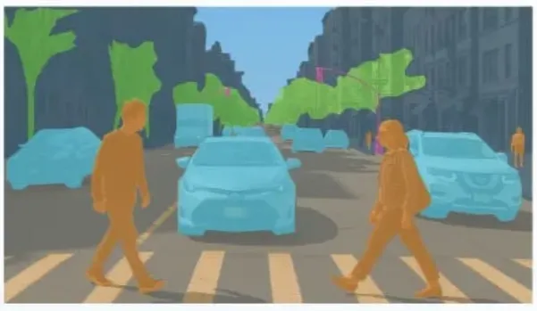

   Semantic Segmentation involves assigning a class label to every pixel in an image based on shared characteristics such as colour, texture and shape.

2. Instance Segmentation

   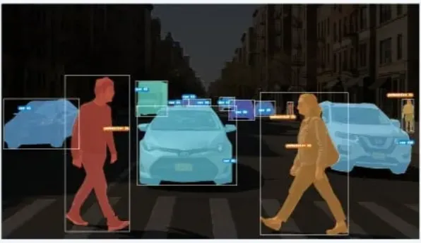

   Instance Segmentation extends semantic segmentation by not only labelling colour of each pixel but also distinguishing between individual objects of the same class.

3. Panoptic Segmentation

   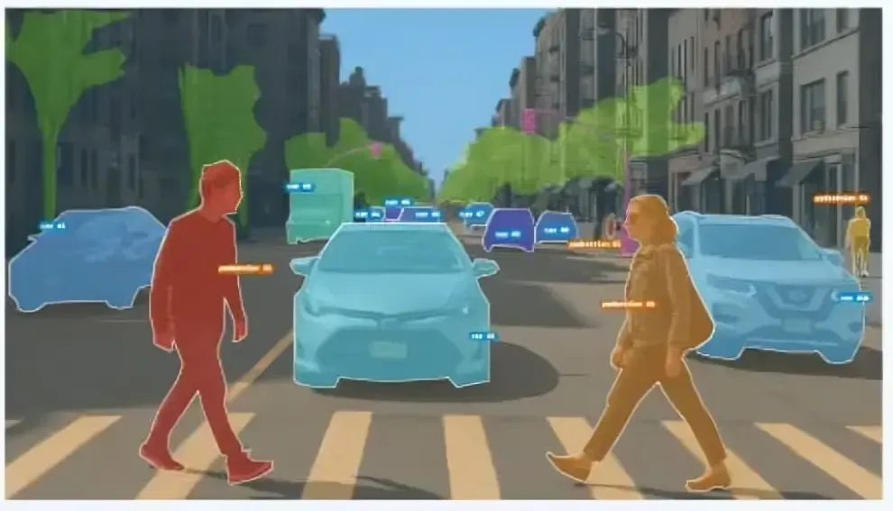

   Panoptic segmentation combines both semantic and instance segmentation techniques providing a complete image analysis.

### U-Net

U-Net is a kind of neural network mainly used for image segmentation which means dividing an image into different parts to identify specific objects for example separating a tumor from healthy tissue in a medical scan. The name “U-Net” comes from the shape of its architecture which looks like the letter “U” when drawn.

- Contracting Path (Encoder)

  - Uses small filters (3×3 pixels) to scan the image and find features.
  - Apply an activation function called ReLU to add non-linearity help the model to learn better.
  - Uses max pooling (2×2 filters) to shrink the image size while keeping important information. This helps the network focus on bigger features.

- Bottleneck

  The middle of the “U” where the most compressed and abstract information is stored. It links the encoder and decoder.

- Expansive Path (Decoder)

  - Uses upsampling i.e increasing image size to get back the original image size.
  - Combines information from the encoder using “skip connections.” These connections help the decoder get spatial details that might have been lost when shrinking the image.
  - Uses convolution layers again to clean up and refine the output.

After understanding the architecture, it’s important to see how U-Net actually processes data to perform segmentation:

1. Input Image

   The process starts by feeding a medical or other input image typically grayscale into the network.

2. Feature Extraction (Encoder)

   The encoder extracts increasingly abstract features by applying convolutions and downsampling. At each level the spatial size decreases while the number of feature channels increases and allow the model to capture higher-level patterns.

3. Bottleneck Processing

   This is the middle part of the network where the image is reduced the most. It holds a small but very meaningful version of the image that captures the main features.

4. Reconstruction and Localization (Decoder)

   The decoder begins to reconstruct the original image size through upsampling. At each level it combines decoder features with corresponding encoder features using skip connections to retain fine-grained spatial details.

5. Skip Connections for Precision

   Skip connections help preserve spatial accuracy by bringing forward detailed features from earlier layers. These are especially useful when the model needs to distinguish boundaries in segmentation tasks.

6. Final Prediction

   A 1×1 convolution at the end converts the refined feature maps into the final segmentation map where each pixel is classified into a specific class like foreground or background. This output has the same spatial resolution as the input image.

---

## Image Classification

Image classification is the process of assigning a predefined label to an image based on its visual content. The goal is to enable a model to automatically recognise patterns, textures and shapes to categorize images into classes it has learned during training correctly.

Types of Image Classification: 

1. Binary Classification: It involves classifying images into one of two categories. For example, determining whether an image contains a cat or not.
2. Multiclass Classification: It involves categorizing images into more than two classes. For example, classifying images of different types of animals.
3. Multilabel Classification: It allows an image to be associated with multiple labels. For example, an image might be classified as both "sunset" and "beach."
4. Hierarchical Classification: It involves classifying images at multiple levels of hierarchy. For example, an image of an animal can first be classified as a "mammal" and then further classified as "cat" or "dog".

The image classification process involves several steps:

1. Data Collection and Preprocessing

   A large labeled image dataset is gathered then processed by resizing, normalized and augmented images to improve model robustness.

2. Feature Extraction

   Traditional methods use features like edges and textures while Convolutional Neural Networks automatically learn features from raw pixel data.

3. Model Training

   The dataset is split into training and validation sets. A CNN is trained using backpropagation and gradient descent to minimize prediction errors and fine-tuned using validation results to avoid overfitting.

4. Evaluation and Testing

   The model is tested on unseen data to measure accuracy, precision and recall ensuring it performs well in real scenarios.

5. Deployment

   After validation, the model is deployed to classify new images in real-time or batch mode for practical applications.

To measure the performance of an image classification model, several metrics which are commonly used are:

1. Accuracy

   The overall percentage of correctly classified images is called Accuracy.

2. Precision

   How many of the images predicted as a certain class are actually correct is calculated using Precision.

3. Recall

   The proportion of actual images of a class that were correctly identified is called Recall.

4. F1-Score

   The harmonic mean of precision and recall, balancing both metrics is called F1 Score.

5. Confusion Matrix

   A tabular summary showing correct and incorrect predictions for each class is called Confusion Matrix.

### Multiclass Classification

Multiclass classification is a supervised machine learning task in which each data instance is assigned to one class from three or more possible categories.

### MultiLabel Classification

One of the most used capabilities of supervised machine learning techniques is for classifying content, employed in many contexts like telling if a given restaurant review is positive or negative or inferring if there is a cat or a dog on an image. This task may be divided into three domains, binary classification, multiclass classification, and multilabel classification.

### Zero-Shot Classification

Zero-shot learning (ZSL) allows models to classify objects they’ve never seen by using semantic information. The [Contrastive Language-Image Pretraining (CLIP) ](#Contrastive Language-Image Pretraining (CLIP))model represents a significant advancement in zero-shot learning. Unlike traditional deep learning models that are limited to a fixed set of output classes, CLIP can generalize to new tasks and classes by combining image and text embeddings.

---

## Object Detection

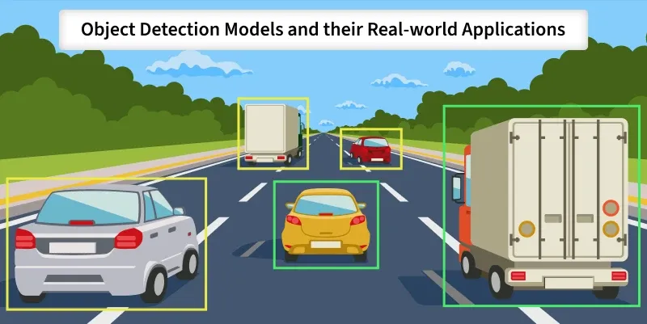

Object Detection is a fundamental task in computer vision that involves identifying and locating multiple objects within an image or video. Unlike image classification which labels an entire image, object detection not only classifies each object but also draws bounding boxes around them to indicate their position.

The general working of object detection is:

1. Input Image: The object detection process begins with image or video analysis.
2. Pre-processing: Image is pre-processed to ensure suitable format for the model being used.
3. Feature Extraction: The feature extractor is responsible for dissecting the image into regions and extracting features from each region.
4. Classification: Each image region is classified into categories based on the extracted features.
5. Localization: The model determines the bounding boxes for each detected object by calculating the coordinates for a box that encloses each object.
6. Non-max Suppression: When the model identifies several bounding boxes for the same object, non-max suppression is used to handle these overlaps.
7. Output: The process ends with the original image being marked with bounding boxes and labels that illustrate the detected objects and their categories.

Types of object detection methods:

1. Two-Stage Detectors: These detectors work in two stages: first, they will propose candidate region and then classify the region into categories. Some of the two stage detectors are R-CNN, Fast R-CNN and Faster R-CNN.
2. Single-stage Detectors: In a single pass, these detectors accurately forecast the bounding boxes and class probabilities for every area of the picture. `YOLO (You Only Look Once)` and `SSD (Single Shot MultiBox Detector)` are two examples.

### Single-Shot Detector (SSD)

Object detection involves identifying and locating objects within an image. Traditional methods required multiple passes over the image, making them computationally expensive and slow. SSD simplifies this process by detecting objects in a single pass, hence the name "**Single Shot Detector**." This approach not only speeds up the detection process but also maintains high accuracy, making SSD a popular choice for real-time applications.

SSD Model Architecture:

- Base Network

  The SSD architecture begins with a pre-trained convolutional neural network (CNN) known as the base network. Commonly, networks like VGG16 are used due to their strong feature extraction capabilities. The base network processes the input image and generates feature maps, which are essential for object detection.

- Extra Layers

  Beyond the base network, SSD includes extra convolutional layers. These layers progressively decrease in size and are responsible for detecting objects at different scales. Each additional layer generates feature maps that contribute to the final detection process.

SSD employs a technique called default boxes (also known as anchor boxes) at each location in the feature maps. These boxes come in various aspect ratios and scales, providing a diverse set of potential object locations. Each default box is associated with two sets of predictions:

- Class Scores: These scores indicate the likelihood of an object belonging to a specific class.
- Bounding Box Offsets: These offsets refine the default box to better match the actual object's location.

For each default box, **SSD Predicts**:

- Class Confidences: The probability of the box containing a specific object class.
- Bounding Box Adjustments: The coordinates to refine the position and size of the default box to match the detected object more precisely.

The **SSD loss function** combines two components:

- Localization Loss (Lloc): This measures how accurately the predicted bounding boxes match the ground truth boxes using Smooth L1 loss.
- Confidence Loss (Lconf): This evaluates the confidence in the predicted class scores using softmax loss.

### Region-Based Convolutional Neural Networks (R-CNN)

R-CNN presents a smarter approach by using a selective search algorithm to generate around 2,000 region proposals from an image. These proposals are likely to contain objects and are individually processed to detect and localize them more efficiently. R-CNN marked a significant advancement in the field of object detection and laid the foundation for faster and more accurate object detection models.

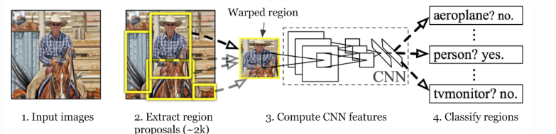

- Input Image

  Start with a single input image containing one or more objects.

- Region Proposal Generation

  Use Selective Search to generate around 2,000 region proposals (potential object locations).

- Warp & Feature Extraction

  Each proposed region is cropped and resized (warped) to a fixed size. Then pass each region through a CNN to extract feature vectors.

- Region Classification

  Use the extracted features to classify each region using SVMs into object categories (e.g. person, car) or background.

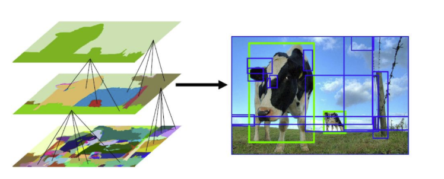

R-CNNs begin by generating **region proposals**, which are smaller sections of the image that may contain the objects we are searching for. The algorithm employs a method called selective search, a greedy approach that generates approximately 2,000 region proposals per image. Selective search effectively balances the number of proposals while maintaining high object recall, ensuring efficient object detection.

By limiting the number of regions for detailed analysis, this method enhances the overall performance of the R-CNN in detecting objects within images.

**Selective Search** is a greedy algorithm that generates region proposals by combining smaller segmented regions. It takes an image as input and produces region proposals that are crucial for object detection. This method offers significant advantages over random proposal generation by limiting the number of proposals to approximately 2,000 while ensuring high object recall.

Algorithm Steps:

1. Generate Initial Segmentation: The algorithm starts by performing an initial sub-segmentation of the input image.
2. Combine Similar Regions: It then recursively combines similar bounding boxes into larger ones. Similarities are evaluated based on factors such as color, texture, and region size.
3. Generate Region Proposals: Finally, these larger bounding boxes are used to create region proposals for object detection.

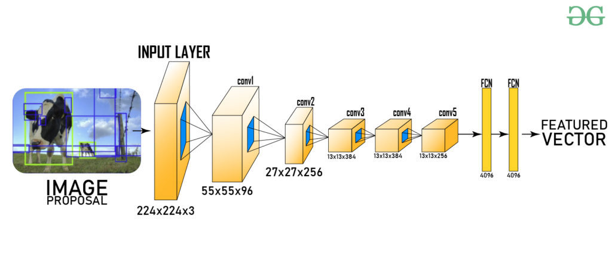

After generating the region proposals, these regions are warped into a uniform square shape to match the input dimensions required by the CNN model. In this case, we use the pre-trained AlexNet model, which was considered the state-of-the-art CNN for image classification at the time.

The feature vector generated by the CNN is then utilized by a binary Support Vector Machine (SVM), which is trained independently for each class. This SVM model takes the feature vector produced by the previous CNN architecture and outputs a confidence score indicating the likelihood of an object being present in that region.

#### R-CNN Bounding Box Regressor

To accurately locate the bounding box within the image, we utilize a scale-invariant linear regression model known as the `bounding box regressor`. For training this model, we use pairs of predicted and ground truth values for four dimensions of localization: $(x, y, w, h)$. Here, $x$ and $y$ represent the pixel coordinates of the center of the bounding box, while $w$ and $h$ indicate the width and height of the bounding boxes, respectively.

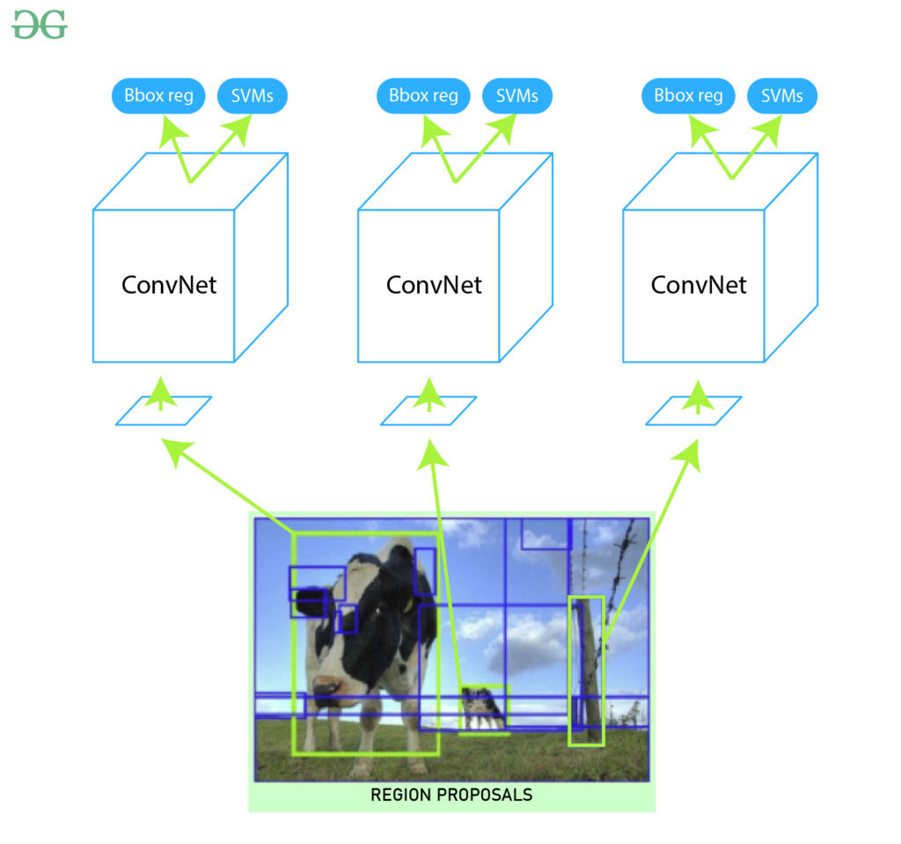

To further optimize detection, R-CNNs apply Non-Maximum Suppression (NMS):

1. Remove proposals with confidence scores below a threshold (e.g., 0.5).

2. Select the highest-probability region among candidates for each object.

3. Discard overlapping regions with an IoU (Intersection over Union) above 0.5 to eliminate duplicate detections, where IoU is defined as:
   $$
   IoU = \frac{\text{Area of Overlap}}{\text{Area of Union}}
   $$

By combining region proposals, selective search, CNN-based feature extraction, SVM classification, and bounding box refinement, R-CNN achieves high accuracy in object detection, making it suitable for various applications.

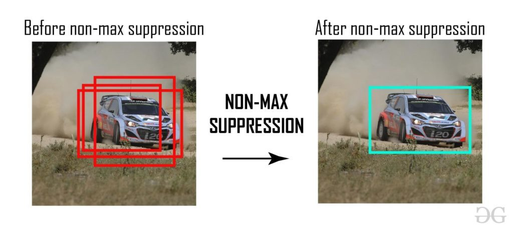

After that, we can obtain output by plotting these bounding boxes on the input image and labeling objects that are present in bounding boxes. 

### Fast R-CNN

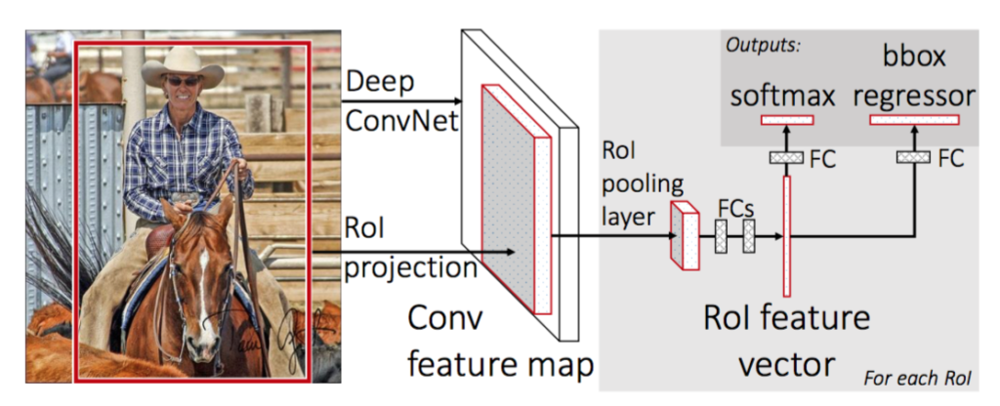

#### Fast R-CNN CNN Network

Fast R-CNN is experimented with three pre-trained ImageNet networks each with *5* max-pooling layers and *5-13* convolution layers (such as [Deep Learning#VGG-16 Architecture](dl.md)). There are some changes proposed in this pre-trained network, These changes are:

- The network is modified in such a way that it two inputs the image and list of region proposals generated on that image.
- Second, the last pooling layer (here (`7 * 7 * 512`) before fully connected layers needs to be replaced by the region of interest (RoI) pooling layer.
- Third, the last fully connected layer and softmax layer is replaced by twin layers of softmax classifier and $K + 1$ category-specific bounding box regressor with a fully connected layer.

#### Fast R-CNN Detection Network

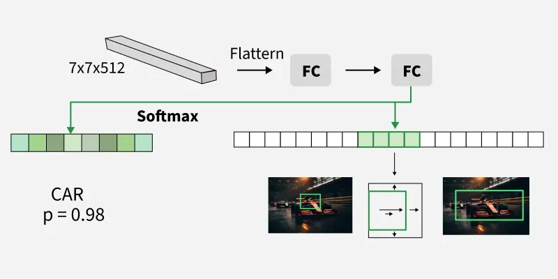

- Classifies each proposed region into object categories.
- Refines bounding boxes for precise localization.
- Uses softmax for classification and smooth L1 loss for bounding box regression.

#### Fast R-CNN Region Proposal Network (RPN)

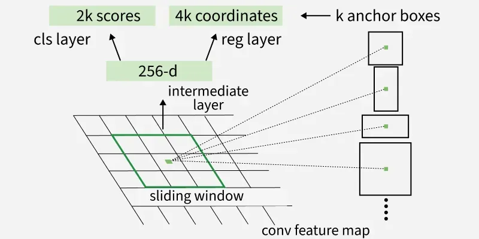

1. RPN is a small network sliding over the feature map.

2. It predicts:

   - Objectness score: Probability that a region contains an object.

   - Bounding box coordinates:Refinement of proposed regions.

3. Uses anchors (predefined boxes of different scales and aspect ratios) to propose regions efficiently.

4. End-to-end training allows RPN and the detection network to share features.

#### Fast R-CNN Region of Interest (RoI) pooling

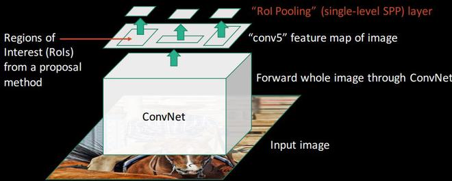

RoI pooling is a novel thing that was introduced in the Fast R-CNN paper. Its purpose is to produce uniform, fixed-size feature maps from non-uniform inputs (RoIs). It takes two values as inputs:

- A feature map was obtained from the previous CNN layer ($14 \times 14 \times 512$ in VGG-16).
- An $N \times 4$ matrix represents regions of interest, where $N$ is a number of RoIs, the first two represent the coordinates of the upper left corner of RoI and the other two represent the height and width of RoI denoted as $(r, c, h, w)$.

#### Fast R-CNN Training and Loss Function

First, we take each training region of interest labeled with ground truth class u and ground truth bounding box v. Then we take the output generated by the softmax classifier and bounding box regressor and apply the loss function to them. We defined our loss function such that it takes into account both the classification and bounding box localization. This loss function is called multi-task loss. This is defined as follows:
$$
L(p, u, t^{u}, v) = L_{cls}(p, u) + \lambda[u \geq 1]L_{loc}(t^u, v)
$$
where $L_{cls}$ is classification loss, and $L_{loc}$ is localization loss. lambda is a balancing parameter and u is a function (the value of u=0 for background, otherwise  u=1) to make sure that loss is only calculated when we need to define the bounding box. Here, $L_{cls}$ is the log loss and $L_{loc}$ is defined as:
$$
L_{loc}(t^u, v) = \sum_{i \in \{x, y, w, h\}}smooth_{L_1}(t_{i}^{u} - v_i)
$$
in which:
$$
smooth_{L_1}(x) = 
\begin{cases}
0.5x^2, &if\ |x| < 1\\
|x| - 0.5, &otherwise,
\end{cases}
$$

#### Mask R-CNN

Mask [R-CNN](#R-CNN) is an advanced computer vision model used for object detection and instance segmentation. It extends [Faster R-CNN](#Fast R-CNN) by adding a mask prediction branch that generates pixel-level segmentation masks for detected objects.

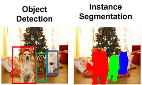

Instance segmentation identifies and separates each individual object present in an image by assigning unique pixel-level masks to every object instance.

Mask R-CNN was proposed by Kaiming He et al. in 2017 as an extension of Faster R-CNN for instance segmentation. Along with object detection and bounding box prediction, it also generates a binary segmentation mask for each detected object.

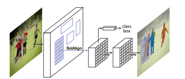

- Backbone Network

  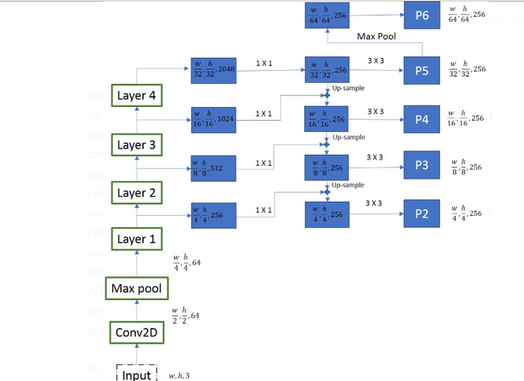

  The backbone network extracts feature maps from the input image using architectures like ResNet-C4 and ResNet-FPN.

- Region Proposal Network

  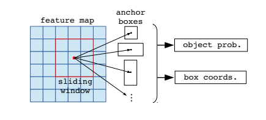

  The RPN generates candidate object regions from convolutional feature maps.

- Mask Representation

  The mask branch predicts segmentation masks for each Region of Interest (RoI).

- RoI Align

  RoI align has the same motive as of RoI pool, to generate the fixed size regions of interest from region proposals. It works in the following steps: 

  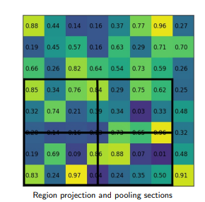

  Given the feature map of the previous Convolution layer of size $h * w$, divide this feature map into $M * N$ grids of equal size (we will NOT just take integer value).

  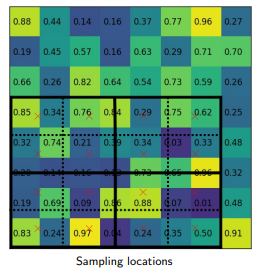

  The mask R-CNN inference speed is around *2 fps*, which is good considering the addition of a segmentation branch in the architecture.

### Cascade R-CNN

Cascade R-CNN, developed by Zhaowei Cai and Nuno Vasconcelos, is an extension of Faster R-CNN that improves detection performance by using a cascade of R-CNN detectors, each trained with an increasing intersection over union (IoU) threshold. This multi-stage approach refines the predictions progressively, leading to more accurate object detections.

---

## Vision Transformers (ViT)

Vision Transformer (ViT) is a deep learning architecture that applies the Transformer model to images. Instead of relying on convolutions, ViTs use self-attention to capture relationships across all image patches, enabling a global understanding of the image.

### VIT Architecture

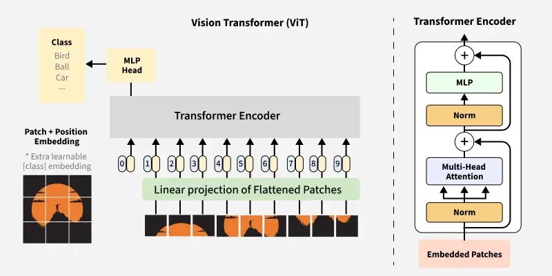

#### Image Patching and Embedding

This stage converts a 2D image into a sequence of patch embeddings, analogous to tokens in NLP. It forms the input for the Transformer by turning spatial information into a linear sequence.

- Patch Splitting

  The image is divided into fixed-size and non-overlapping patches, each treated as a token and converted into a 1D sequence for the Transformer, reducing computation while preserving local spatial information.

  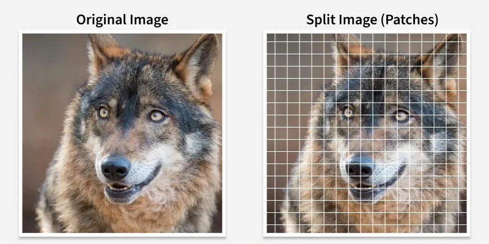

- Patch Flattening

  Each patch of size $P \times P \times C$ is flattened into a single vector of length $P^2 \times C$. This flattening removes spatial dimensions temporarily and allows the model to treat patches uniformly. The flattened vectors serve as the raw inputs to the linear projection layer.

- Patch Embedding (Linear Projection)

  Each flattened patch is mapped to a learnable D dimensional embedding enabling the model to learn high level features similar to word embeddings in NLP.

#### Positional Encoding

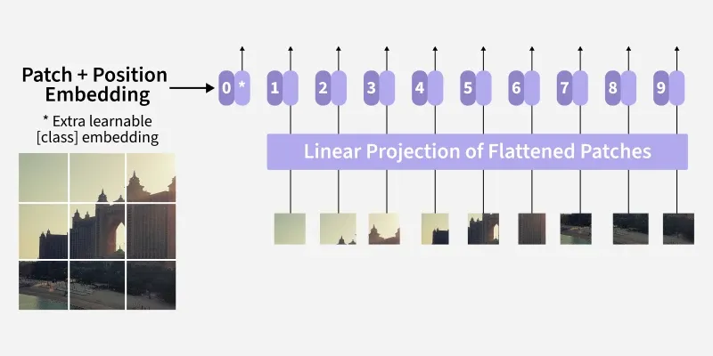

- Need for Positional Encoding

  Since Transformers treat tokens as unordered positional encodings are added to retain spatial structure and patch location information.

- Learnable Positional Embeddings

  ViT uses learnable positional vectors to capture local and global spatial relationships adapting better than fixed encodings across image resolutions.

#### Adding the CLassification Token (CLS Token)

A learnable CLS token is prepended to the patch sequence to aggregate information from all patches, serving as the image-level representation for classification.

- Purpose of the CLS Token

  The CLS token is a learnable vector added to patch embeddings that gathers global information and is used for final classification, similar to BERT.

- How the CLS Token Learns Image-Level Representation

  The CLS token attends to all patches to learn global image features and its final output alone is used for prediction without CNN style pooling.

#### Transformer Encoder (Pre-LayerNorm Architecture)

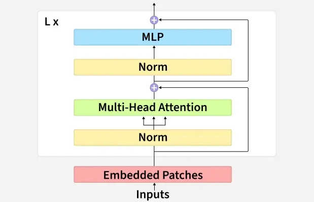

Pre-LayerNorm applies LayerNorm before both the attention and feed-forward blocks. This stabilizes gradient flow and prevents the exploding/vanishing gradient problem in deep Transformers.
$$
LayerNorm(x) = \frac{x - \mu}{\sigma} \odot \gamma + \beta
$$

- $\mu, \sigma$ are mean and std across features
- $\gamma, \beta$ are learnable

#### Multi-Head Self-Attention (MSA)

Allows each patch to attend to every other patch to model global dependencies, capturing relationships between distant image regions.

1. Self-Attention Mechanism

   Self-attention enables each patch to relate to all others by using query, key and value projections with the attention matrix controlling token influence. The input sequence consists of $N$ image patches plus $1$ CLS token, with each token represented by a D-dimensional embedding.

   Compute Queries, Keys and Values:
   $$
   Q = XW_{Q}, K = XW_{K}, V = XW_{V}
   $$
   where $W_Q, W_K, W_V$ are learnable weight matrices for linear projections
   $$
   Attention(Q, K, V) = softmax(\frac{QK^{T}}{\sqrt{d_k}})V
   $$

   - $QK^{T}$ computes similarity between all pairs of tokens (dot product)
   - $d_k = \frac{D}{h}$ the dimension per attention head
   - Divide by $\sqrt{d_k}$ for scaling to prevent large values causing softmax saturation
   - softmax normalizes scores into probabilities for attention weights
   - Multiply by $V$ to get weighted sum of information from all tokens

2. Multi-Head Attention

   Multiple attention heads allow the model to attend to different types of information simultaneously. The outputs of all heads are concatenated and linearly projected to form the final attention output. This parallel attention mechanism leads to richer and more diverse feature representations.
   $$
   MSA(X) = Concat(head_{1}, ..., head_{h})W_{0}
   $$
   Multiple heads (hhh) allow the model to focus on different types of relationships simultaneously (e.g., edges, color, textures, global shapes)
   $$
   head_{i} = Attention(XW_{Q}^{i}, XW_{K}^{i}, XW_{V}^{i})
   $$

#### Feed-Forward Network (FFN)

The FFN transforms each patch embedding to a higher-dimensional space and back using two dense layers with a GELU activation, enabling complex feature learning. It operates independently on each token with shared weights, allowing efficient non-linear transformations.
$$
FFN(x) = W_{2}GELU(W_1 x + b_1) + b_2
$$
Expands and transforms features for better expressiveness. GELU Activation is used for smooth non-linearity improves learning and stability.

#### Residual Connections and Layer Normalization

Ensures stable training in deep networks by preserving information and normalizing activations.

- Residual (Skip) Connections

  Residual connections bypass transformation blocks to preserve earlier layer information, preventing degradation in deep networks. They enable the model to learn incremental refinements, improving convergence and stability in deep ViTs.

- Layer Normalization

  LayerNorm normalizes features across the input, stabilizing training and reducing internal covariate shift. Pre-LN ensures well-conditioned gradients and consistent scaling across tokens in deep Transformers.

#### Classification Head (MLP Head)

Converts the CLS token output into class probabilities using a small feed-forward network.

- MLP Head Structure

  The classification head uses one or two fully connected layers on the final CLS token to produce class probabilities, optionally with dropout for regularization. It serves as the ViT’s final decision-making component.

- Softmax for Prediction

  Softmax converts logits into normalized probabilities summing to 1, with the highest probability indicating the predicted class. It enables multi-class classification and pairs with cross-entropy loss during training.

#### Training Vision Transformers

ViTs need more data than CNNs due to low inductive bias and training involves pretraining on large datasets followed by finetuning.

- Inductive Bias Differences

  CNNs use strong inductive biases like locality and translation invariance, while ViTs treat images as patch sequences, requiring more data but offering greater flexibility.

- Data Requirements

  ViTs need large-scale datasets and augmentations to generalize well due to their low inductive bias, unlike CNNs.

- Pretraining

  Pretraining lets ViTs learn general visual features via supervised or self-supervised methods, reducing compute needs for downstream tasks.

- Finetuning

  Finetuning adapts pretrained ViTs to specific datasets using fewer labels, often with layer-wise learning rate decay to improve performance.

### Swin Transformer

The Swin Transformer (Shifted Window Transformer) is a type of vision transformer model that processes images by dividing them into small, non-overlapping windows and computes self-attention within these localized regions. Unlike standard vision transformers which use global attention, Swin Transformer introduces a "shifted window" technique. This allows neighboring windows to interact with each other in subsequent layers, efficiently capturing both local and global features in an image.

#### Swin Transformer Architecture

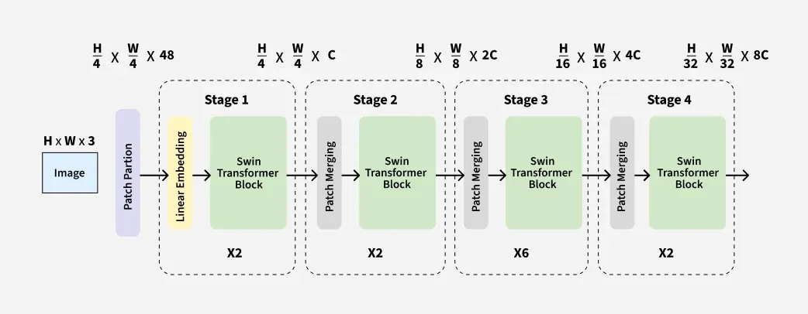

1. Patch Splitting

   The input image is divided into fixed-size patches like putting a grid over image and each square represent a patch. Each patch is then embedded into a feature vector to form input for the transformer.

2. Window-Based Self-Attention

   Instead of computing attention globally the model computes attention within local windows. These windows act as small focused regions capturing fine features while keeping computation manageable. Self-attention is applied within the window and captures local features.

3. Shifted Windows for Cross-Region Interaction

   The shifted window mechanism solve limitation of local windows attention and capture global context of image. This shifted window shifts the position of the windows by a small value and hence overlapping regions with next layer. This ensure cross-window communication and improve models ability to capture global context.

4. Hierarchical Design

   The Swin Transformer processes the image in stages:

   - *Stage 1:* The image is divided into non-overlapping patches for embedding of each level.
   - *Stage 2:* These patches are further split into windows and self-attention is applied locally in the window.
   - *Stage 3:* The windows are shifted over next layer for overlapping and self-attention is recomputed with shifted windows.
   - *Stage 4:* Hierarchical processing continues combining features to know fine details in each window without losing global context of image.

---

## Vision Language Models

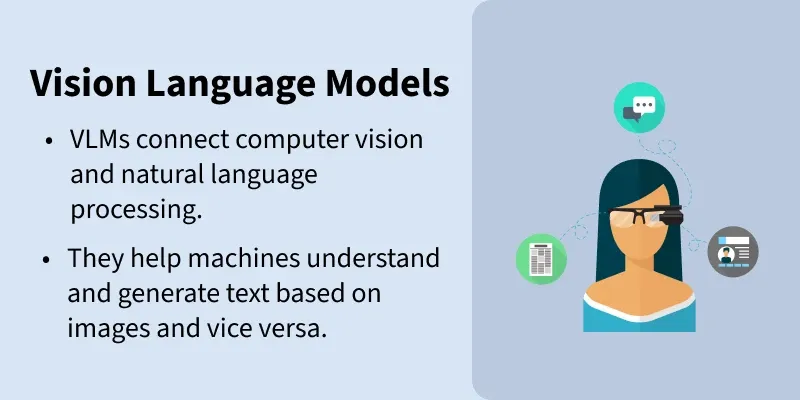

Vision-Language Models (VLMs) are AI systems that combine computer vision and natural language processing to understand and generate language grounded in visual information. These models learn the relationship between images/videos and text, enabling them to interpret visuals and respond with meaningful language.

### Types of Vision Language Models

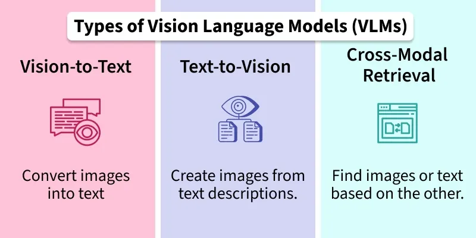

#### Vision-to-Text Models

Vision-to-text models focus on generating textual descriptions or answering questions based on visual inputs. 

#### Text-to-Vision Models

Text-to-vision models generate images from text by converting natural language descriptions into visual outputs for creative and practical uses.

#### Cross-Modal Retrieval Models

They are designed for tasks where one type of data, like text or images is used to search for data in the other type of data.

### Working of Vision Language Models

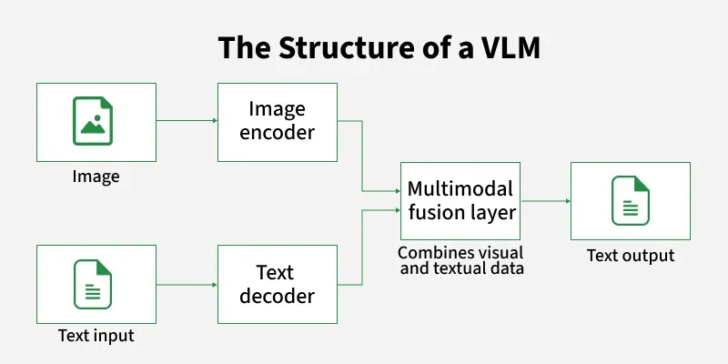

#### Dual Modality Input

VLMs take two types of input i.e images and text. These inputs are processed separately by different networks:

- Visual Input: Images are processed by a vision model like [Deep Learning#Residual Networks (ResNet) Architecture](dl.md)or [Vision Transformers (ViTs)](#Vision Transformers (ViT)) to extract meaningful features such as shapes, objects and textures.
- Textual Input: Text is processed using language models like BERT or GPT which tokenize the words and convert them into meaningful representations.

#### Feature Extraction and Representation

Both visual and textual inputs are transformed into a unified space via a process known as feature extraction:

- Visual Features: These are high-dimensional vectors that represent specific elements of the image like objects, backgrounds or textures.
- Textual Features: These vectors represent the meanings of words or phrases in the context of the input text.

#### Cross-Modal Alignment

Cross-modal alignment maps visual and textual features into a shared space, enabling the model to link specific words with their corresponding image regions.

#### Fusion Layers

After the features are aligned, they are fused together for further processing. There are several ways to do this:

- Late Fusion: Visual and textual features are processed separately and then combined.
- Early Fusion: Features from both modalities are combined early on and processed together.
- Cross-attention Fusion: Features from both modalities inform each other during processing.

#### Training Objectives

VLMs are typically trained on large-scale datasets that contain both images and text like Flickr30k dataset. Common training tasks include:

- Image-Text Matching: The model learns to associate images with their corresponding text.
- Masked Language and Image Modeling: The model predicts missing words or parts of an image based on the other modality.
- Caption Generation: The model learns to generate a description for a given image.

### Contrastive Language-Image Pretraining (CLIP)

CLIP or Contrastive Language-Image Pretraining is an advanced AI model developed by OpenAI and UC Berkeley. It has the unique ability to understand and relate both textual descriptions and images. It uses a novel training method that contrasts pairs of images and text which makes it highly useful tool for various real-world applications.

#### CLIP Workflow

1. Text Encoder

   CLIP uses a Transformer-based model (similar to the model in the Attention is All You Need paper). This model converts text into embeddings, dense vectors that capture the meaning of the text. Its text encoder is a 63M-parameter model with 12 layers and 8 attention heads.

2. Image Encoder

   For the image encoder, it experimented with both [Deep Learning#Residual Networks (ResNet) Architecture](dl.md) or [Vision Transformers (ViTs)](#Vision Transformers (ViT)) . At last ViT was chosen due to its superior performance in processing images. This encoder transforms images into embeddings that capture the image’s key features.

3. Dataset

   CLIP was trained on a massive dataset of 400 million image-text pairs sourced from the web. The team focused on using words that appeared at least 100 times in the English Wikipedia which ensures that 500,000 words were covered. This dataset called *WebImageText (WIT)* is important to CLIP’s ability to generalize to various visual and textual concepts.

4. Training Objective

   CLIP's goal is to align text and image embeddings which ensures that correct pairs of image and text are similar while incorrect pairs are not.

   - Cosine Similarity: It maximizes similarity for matching pairs and minimizes it for non-matching pairs.
   - Training from Scratch: Both image and text encoders are trained from the ground up, without pre-trained weights.
   - Projection: The embeddings generated by the image and text encoder are projected into a shared space with the same dimensionality to allow for effective comparison.
   - Contrastive Learning: During training, it distinguishes between correct and incorrect image-text pairs which optimizes the model to correctly identify matches.
   - Loss Function: Cross-entropy loss is used to adjust the model, maximizing similarity for correct pairs and minimizing it for incorrect ones.
   - Inference: After training, it calculates similarity scores between image-text pairs to determine relevance.

### ALIGN (A Large-scale Image and Noisy-text)

ALIGN (A Large-scale Image and Noisy-text) is a vision-language model developed to align images with their associated textual descriptions, even when those texts are noisy or sourced directly from the web. It uses a massive minimally-filtered dataset and a dual-encoder architecture to embed both images and texts in a shared semantic space, enabling robust cross-modal understanding and retrieval at unprecedented scale.

### BLIP (Bootstrapping Language-Image Pre-training)

BLIP (Bootstrapping Language-Image Pre-training) is an advanced multimodal model from Hugging Face, designed to merge Natural Language Processing (NLP) and Computer Vision (CV). By pre-training on millions of image-text pairs, BLIP excels at image captioning, visual question answering (VQA), cross-modal retrieval and more. Its architecture uses transformer-based components that allow effective interactions between text and images, making it valuable for researchers and developers in the AI space.

#### BLIP Architecture

- Unimodal Encoder

  Separately encodes images and text.

- Image-grounded Text Encoder

  Integrates visual context into text encoding using cross-attention layers.

- Image-grounded Text Decoder

  Generates text from images with causal self-attention mechanisms.

#### Pretraining Objectives of BLIP

BLIP uses three main objectives during pre-training:

- Image-Text Contrastive Loss (ITC)

  Aligns visual and textual feature spaces, promoting similarity between matching image-text pairs while distinguishing negatives.

- Image-Text Matching Loss (ITM)

  Encourages detailed multimodal representation with a classification task, determining if a text matches an image.

- Language Modeling Loss (LM)

  Trains the model to generate plausible text from images using an autoregressive approach.

---

## Summary

### Matrix vs Tensor

|       **Aspect**       |                      **Matrix**                       |                 **Tensor**                  |
| :--------------------: | :---------------------------------------------------: | :-----------------------------------------: |
|   **Dimensionality**   |                        2D only                        |   Can be any dimension (1D, 2D, 3D, ...)    |
|       **Order**        |                     Second-order                      |     Higher-order (3rd, 4th, and beyond)     |
|   **Representation**   |                   Rectangular array                   |           Multi-dimensional array           |
| **Application Areas**  | Linear algebra, image representation, transformations |   Physics, deep learning, computer vision   |
| **Accessing Elements** |               Two indices (row, column)               |  Multiple indices, depending on the order   |
| **Computational Use**  |       Common in basic computational algorithms        | Essential in advanced computations (AI, ML) |

### SIFT vs SURF

|         **Feature**          |                          **SIFT**                          |                         **SURF**                          |
| :--------------------------: | :--------------------------------------------------------: | :-------------------------------------------------------: |
|    **Keypoint Detection**    |                Difference of Gaussian (DoG)                |               Determinant of Hessian matrix               |
|     **Descriptor Size**      |                      128-dimensional                       |                      64-dimensional                       |
|  **Orientation Assignment**  |                    Gradient orientation                    |                  Haar wavelet responses                   |
|          **Speed**           |          Slower due to more complex computations           |  Faster due to integral images and simpler computations   |
|         **Accuracy**         |       Higher accuracy under extreme transformations        |            Slightly lower accuracy but faster             |
|        **Robustness**        | Highly robust to scale, rotation, and illumination changes | Robust, but slightly less than SIFT under some conditions |
| **Computational Complexity** |                           Higher                           |                           Lower                           |
|  **Suitable Applications**   |           Applications requiring high precision            |      Real-time applications, large-scale processing       |

### ViT vs CNNs

|     **Features**     |                     **CNNs**                     |                    **ViTs**                     |
| :------------------: | :----------------------------------------------: | :---------------------------------------------: |
| **Attention Scope**  |     Capture local features via convolutions      | Capture global relationships via self-attention |
|  **Inductive Bias**  | Strong biases (locality, translation invariance) |  Minimal biases, more flexible but data-hungry  |
| **Data Requirement** |          Work well with small datasets           |    Need large datasets for best performance     |
| **Feature Learning** |           Learn hierarchical features            |     Learn context-rich, long-range features     |

### CNNs vs Vision Transformers

|          **Feature**           |           **Convolutional Neural Networks (CNNs)**           |                **Vision Transformers (ViTs)**                |
| :----------------------------: | :----------------------------------------------------------: | :----------------------------------------------------------: |
|        **Architecture**        | Convolutional layers with pooling, followed by fully connected layers | Transformer architecture with self-attention and patch embeddings |
|    **Input Representation**    |               Processes entire images directly               | Divides images into patches and processes them as sequences  |
|      **Feature Learning**      |    Local feature extraction through convolutional filters    |        Global feature extraction using self-attention        |
|    **Parameter Efficiency**    | Often requires fewer parameters to achieve good performance  | Generally requires more parameters, especially for large images |
| **Training Data Requirements** |         Performs well with relatively small datasets         |  Typically requires large datasets for optimal performance   |
|  **Computational Complexity**  |            Efficient due to localized operations             |  Higher computational cost due to self-attention mechanisms  |
|      **Interpretability**      |   Easier to interpret as features are spatially structured   | More challenging to interpret due to global feature representation |

### BLIP vs CLIP vs DALL-E vs ViT

|      **Aspect**       |                      **BLIP**                      |                   **CLIP**                    |               **DALL-E**                |                     **ViT**                      |
| :-------------------: | :------------------------------------------------: | :-------------------------------------------: | :-------------------------------------: | :----------------------------------------------: |
|   **Primary Role**    |    Image captioning, VQA, matches image & text     |  Matches images with text, search & tagging   |  Creates images from text description   |  Image classification, AI model building block   |
|   **Architecture**    |     Image & language transformers (multimodal)     |  Separate image and text encoders, compared   | Large text-to-image transformer decoder |  Splits image into patches, processes as tokens  |
| **Training Approach** |      Contrastive + captioning on big datasets      | Contrastive learning on huge image-text pairs | Learns to “draw” based on text prompts  | Trained on large datasets, scales extremely well |
|   **Adaptability**    |          Easy to fine-tune for many tasks          |         Handles zero-shot tasks well          |        Best for image generation        |          Widely used as model backbone           |
|     **Strengths**     | Excels at both describing and understanding images |      Robust for matching images and text      | Makes creative, highly detailed images  |    High accuracy for image recognition tasks     |

### Image Classification vs Object Detection vs Image Segmentation

|   **Aspect**   |           **Image Classification**            |          **Object Detection**           |              **Image Segmentation**              |
| :------------: | :-------------------------------------------: | :-------------------------------------: | :----------------------------------------------: |
|  **Purpose**   | Assign a label or category to the whole image | Identifies and locates multiple objects |     Divide the image into meaningful regions     |
|   **Output**   |           Single label or category            | Bounding boxes around detected objects  |          Pixel wise segmentation masks           |
|   **Focus**    | High level classification of the entire image | Detection of objects with localization  | Detailed segmentation of objects and background  |
| **Complexity** |              Simpler and faster               |           Moderate complexity           |    More complex and computationally intensive    |
|  **Examples**  |         "Cat" for a picture of a cat          | Cars and pedestrians in a traffic scene | Separating tumor from healthy tissue in an X-ray |

### Semantic Segmentation vs Instance Segmentation

|        **Criteria**         |                  **Instance Segmentation**                   |                  **Semantic Segmentation**                   |
| :-------------------------: | :----------------------------------------------------------: | :----------------------------------------------------------: |
|       **Definition**        | Identifies and delineates individual object instances at the pixel level. | Classifies each pixel into specific categories or classes without distinguishing between instances. |
|        **Objective**        | Provides detailed object-level segmentation by distinguishing between different instances of the same category. | Offers a holistic understanding by segmenting an image into broad semantic regions based on object categories. |
|      **Detail Level**       | Operates at a granular level, differentiating between individual object instances within the same category. | Provides a broader segmentation, grouping pixels into general object categories. |
| **Differentiation Ability** | Can distinguish between different instances of the same category by assigning unique labels or colors. | Cannot differentiate between individual instances of the same category, all pixels of the same class are grouped together. |
|        **Approach**         | Combines principles of object detection, semantic segmentation, and pixel-wise labeling. | Typically involves sequential processes such as feature extraction, pixel-wise classification, and object localization. |
|         **Output**          | Produces segmentation masks that differentiate between individual object instances. | Generates segmentation maps or masks that classify pixels into specific semantic categories. |
|       **Complexity**        | More complex due to the need for precise object instance differentiation. | Generally simpler, focusing on broad object categorization without detailed instance differentiation. |
|      **Applications**       | Ideal for tasks requiring accurate object detection, tracking, and recognition in complex scenes. | Commonly used in applications where a general understanding of the image content is sufficient, such as scene understanding and object classification. |
|        **Datasets**         | Examples include LiDAR Bonnetal Dataset, HRSID, SSDD, Pascal SBD, iSAID, etc. | Examples include Stanford Background Dataset, Microsoft COCO Dataset, MSRC Dataset, KITTI Dataset, Microsoft AirSim Dataset, etc. |

### Covariance vs Correlation

|                        **Covariance**                        |                       **Correlation**                        |
| :----------------------------------------------------------: | :----------------------------------------------------------: |
| Covariance is a measure of how much two random variables vary together | Correlation is a statistical measure that indicates how strongly two variables are related. |
| Involves the relationship between two variables or data sets | Involves the relationship between multiple variables as wellCorrelation (specifically Pearson correlation) measures the relationship between two variables. |
|             Lie between -infinity and +infinity              |                    Lie between -1 and +1                     |
|                    Measure of correlation                    |                 Scaled version of covariance                 |
|              Provides direction of relationship              |       Provides direction and strength of relationship        |
|                Dependent on scale of variable                |               Independent on scale of variable               |
|                       Have dimensions                        |                        Dimensionless                         |

### Linear vs Non-Linear Filter

|         **Parameter**         |               **Linear Filters**                |            **Non-linear filters**             |
| :---------------------------: | :---------------------------------------------: | :-------------------------------------------: |
|  **Superposition Principle**  |          Obeys superposition principle          |     Does not obey superposition principle     |
|        **Homogeneity**        |      Response is proportional to the input      |   Response is not necessarily proportional    |
|    **Mathematical Basis**     |     Based on linear algebra and convolution     |    Based on complex mathematical functions    |
| **Frequency Domain Analysis** |     Can be analyzed using Fourier Transform     |  Not easily analyzed using Fourier Transform  |
|   **Output Predictability**   |   Predictable and straightforward to analyze    |  Less predictable, complex analysis required  |
|      **Noise Reduction**      |    Moderate noise reduction, can blur edges     | Effective at noise reduction, preserves edges |
|     **Edge Preservation**     |                 Can blur edges                  |    Excels at preserving or enhancing edges    |
| **Computational Complexity**  |           Generally lower complexity            |        Higher computational complexity        |
|     **Adaptive Behavior**     | Static, does not adapt to input characteristics |   Can adapt to local input characteristics    |
|     **Impulse Response**      |         Defined impulse response (h(t))         |          No defined impulse response          |
|      **Implementation**       |              Simpler to implement               |           More complex to implement           |

**Linear filters** are signal or image processing filters that implement linear operations, this therefore implies that the result produced by the filter is a linear function of the input values. This means the filter’s response to a weighted sum of the inputs is equal to the weighted sum of the responses of the filter to all inputs. 

**Non-linear filters** can be defined as signal or image processing that does not consist of superposition and homogeneity. This means that what they produce as output is not just a proportionate relation to the input values. These filters apply operations that are functions of the inputs’ values and arrangement, or other more complex mathematical operations and algorithms.

---

## Reference

[1] Richard Szeliski. Computer Vision: Algorithms and Applications. 1ED

[2] [Computer Vision Tutorial](https://www.geeksforgeeks.org/computer-vision/computer-vision/)

[3] [Computer Vision - Introduction](https://www.geeksforgeeks.org/computer-vision/computer-vision-introduction/)

[4] [Linear Algebra Operations For Machine Learning](https://www.geeksforgeeks.org/machine-learning/ml-linear-algebra-operations/)

[5] [Differences between a Matrix and a Tensor](https://www.geeksforgeeks.org/maths/differences-between-a-matrix-and-a-tensor/)

[6] [Eigenvalues and Eigenvectors](https://www.geeksforgeeks.org/engineering-mathematics/eigen-values/)

[7] [Singular Value Decomposition (SVD)](https://www.geeksforgeeks.org/data-science/singular-value-decomposition-svd/)

[8] [Discrete Fourier Transform and its Inverse using MATLAB](https://www.geeksforgeeks.org/software-engineering/discrete-fourier-transform-and-its-inverse-using-matlab/)

[9] [Fast Fourier Transform in Image Processing](https://www.geeksforgeeks.org/computer-vision/fast-fourier-transform-in-image-processing/)

[10] [Principal Component Analysis (PCA)](https://www.geeksforgeeks.org/data-analysis/principal-component-analysis-pca/)

[11] [Digital Image Processing Basics](https://www.geeksforgeeks.org/computer-graphics/digital-image-processing-basics/)

[12] [Geometric Transformation in Image Processing](https://www.geeksforgeeks.org/electronics-engineering/geometric-transformation-in-image-processing-1/)

[13] [Python | Intensity Transformation Operations on Images](https://www.geeksforgeeks.org/python/python-intensity-transformation-operations-on-images/)

[14] [Histogram Equalization in Digital Image Processing](https://www.geeksforgeeks.org/computer-graphics/histogram-equalization-in-digital-image-processing/)

[15] [What are the different Image denoising techniques in computer vision?](https://www.geeksforgeeks.org/computer-vision/what-are-the-different-image-denoising-techniques-in-computer-vision/)

[16] [Spatial Filters - Averaging filter and Median filter in Image Processing](https://www.geeksforgeeks.org/python/spatial-filters-averaging-filter-and-median-filter-in-image-processing/)

[17] [Python | Bilateral Filtering](https://www.geeksforgeeks.org/python/python-bilateral-filtering/)

[18] [Erosion and Dilation of images using OpenCV in Python](https://www.geeksforgeeks.org/python/erosion-dilation-images-using-opencv-python/)

[19] [Python | Morphological Operations in Image Processing (Opening) | Set-1](https://www.geeksforgeeks.org/python/python-morphological-operations-in-image-processing-opening-set-1/)

[20] [Python | Morphological Operations in Image Processing (Closing) | Set-2](https://www.geeksforgeeks.org/python/python-morphological-operations-in-image-processing-closing-set-2/)

[21] [Python | Morphological Operations in Image Processing (Closing) | Set-2](https://www.geeksforgeeks.org/python/python-morphological-operations-in-image-processing-closing-set-2/)

[22] [Python | Morphological Operations in Image Processing (Gradient) | Set-3](https://www.geeksforgeeks.org/python/python-morphological-operations-in-image-processing-gradient-set-3/)

[23] [Image Edge Detection Operators in Digital Image Processing](https://www.geeksforgeeks.org/digital-logic/image-edge-detection-operators-in-digital-image-processing/)

[24] [Comprehensive Guide to Edge Detection Algorithms](https://www.geeksforgeeks.org/computer-vision/comprehensive-guide-to-edge-detection-algorithms/)

[25] [SIFT Interest Point Detector Using Python - OpenCV](https://www.geeksforgeeks.org/machine-learning/sift-interest-point-detector-using-python-opencv/)

[26] [What is the difference between SIFT and SURF?](https://www.geeksforgeeks.org/computer-vision/what-is-the-difference-between-sift-and-surf/)

[27] Navneet Dalal; Bill Triggs . Histograms of Oriented Gradients for Human Detection

[28] [Swin Transformer](https://www.geeksforgeeks.org/computer-vision/swin-transformer/)

[29] [Vision Transformers vs. Convolutional Neural Networks (CNNs)](https://www.geeksforgeeks.org/deep-learning/vision-transformers-vs-convolutional-neural-networks-cnns/)

[30] [Vision Language Models (VLMs)](https://www.geeksforgeeks.org/artificial-intelligence/vision-language-models-vlms-explained/)

[31] [CLIP (Contrastive Language-Image Pretraining)](https://www.geeksforgeeks.org/deep-learning/clip-contrastive-language-image-pretraining/)

[32] [ALIGN: A Large-scale ImaGe and Noisy-text Model](https://www.geeksforgeeks.org/artificial-intelligence/align-a-large-scale-image-and-noisy-text-model/)

[33] [Understanding BLIP : A Huggingface Model](https://www.geeksforgeeks.org/artificial-intelligence/understanding-blip-a-huggingface-model/)

[34] [What is Image Classification?](https://www.geeksforgeeks.org/computer-vision/what-is-image-classification/)

[35] [What is Object Detection in Computer Vision?](https://www.geeksforgeeks.org/computer-vision/what-is-object-detection-in-computer-vision/)

[36] [How single-shot detector (SSD) works?](https://www.geeksforgeeks.org/computer-vision/how-single-shot-detector-ssd-works/)

[37] [R-CNN - Region-Based Convolutional Neural Networks](https://www.geeksforgeeks.org/machine-learning/r-cnn-region-based-cnns/)

[38] [Fast R-CNN | ML](https://www.geeksforgeeks.org/machine-learning/fast-r-cnn-ml/)

[39] [Faster R-CNN | ML](https://www.geeksforgeeks.org/machine-learning/faster-r-cnn-ml/)

[40] [Mask R-CNN](https://www.geeksforgeeks.org/machine-learning/mask-r-cnn-ml/)

[41] [Image Segmentation: Techniques and Applications](https://www.geeksforgeeks.org/computer-vision/image-segmentation-techniques-and-applications/)

[42] [U-Net Architecture Explained](https://www.geeksforgeeks.org/machine-learning/u-net-architecture-explained/)

[43] [Deconvolution vs Convolutions](https://www.geeksforgeeks.org/computer-vision/deconvolution-vs-convolutions/)

[44] [Covariance and Correlation](https://www.geeksforgeeks.org/data-analysis/mathematics-covariance-and-correlation/)

[45] [Covariance and Correlation](https://www.geeksforgeeks.org/data-analysis/mathematics-covariance-and-correlation/)

[46] [What is the difference between Linear and non-linear filters?](https://www.geeksforgeeks.org/computer-vision/what-is-the-difference-between-linear-and-non-linear-filters/)

[47] [What is Image Compression?](https://www.geeksforgeeks.org/machine-learning/what-is-image-compression/)

[48] [Noise Models in Digital Image Processing](https://www.geeksforgeeks.org/computer-vision/noise-models-in-digital-image-processing/)
