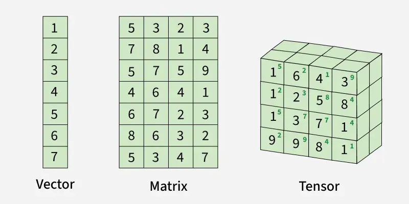
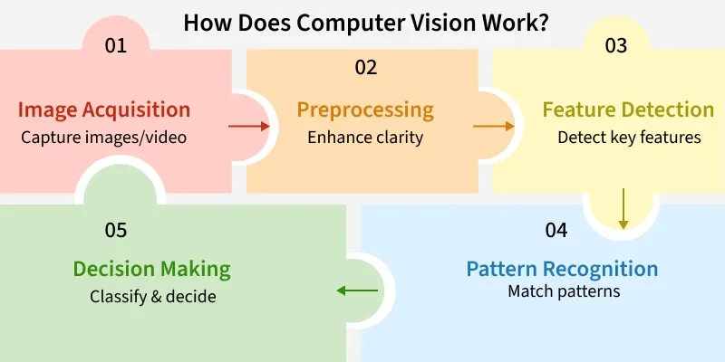
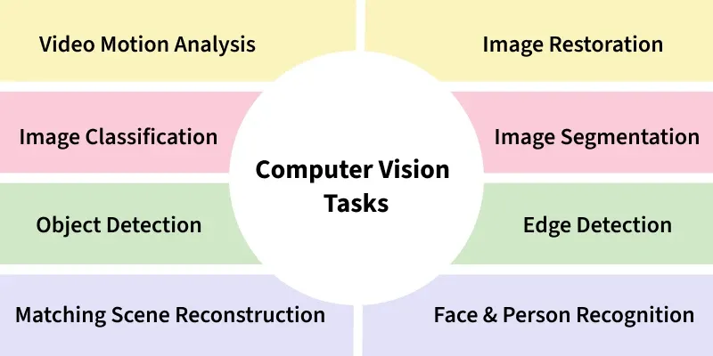

# Computer Vision

[TOC]

## Mathematical Prerequisites

### Linear Algebra

Linear algebra is a core mathematical foundation for machine learning, as most datasets and models are represented using vectors and matrices. It allows efficient computation, data manipulation and optimization, making complex tasks manageable.

#### Fundamental Concepts

1. Vectors

   Vectors are quantities that have both magnitude and direction, often represented as arrows in space.
   $$
   TODO
   $$
   

### Signal Processing

TODO

## Intro

Computer Vision (CV) in artificial intelligence (AI) help machines to interpret and understand visual information similar to how humans use their eyes and brains. It involves teaching computers to analyze and understand images and videos, helping them "see" the world.

### Computer Vision Workflow

1. Image Acquisition

   It involves collecting images or videos using cameras, sensors or other devices. The quality of the image and its type (black-and-white, color or 3D) affects how the system will process the data.

2. Preprocessing

   Raw images are often not perfect, so they are cleaned up first. This might include adjusting the brightness, sharpening the image or removing unwanted noise to help the system see better.

3. Feature Detection

   In this, the system looks for key elements in the image like edges, patterns or shapes. This helps the system focus on the important parts of the image.

4. Pattern Recognition

   This compares what it detects in the image to known patterns or examples. Using machine learning, the system can recognize objects, classify images or even understand relationships in the image.

5. Decision Making

   After recognizing patterns, the system uses this information to make decisions such as identifying a dog in the image or recognizing a stop sign in a video.

### Computer Vision Tasks

1. Object Recognition

   This is used for identifying objects in an image, such as recognizing a car, dog, or tree. It’s used in surveillance, self-driving cars, and checking products in factories.

2. Face Recognition

   This involves identifying people based on their facial features. It is used in security systems, unlocking smartphones, and identifying people in photos or videos.

3. Image Segmentation

   Segmentation breaks an image into smaller parts for easier analysis. For example, in medical imaging, different organs may be segmented to focus on specific areas.

4. Optical Character Recognition (OCR)

   OCR helps in recognizing text in images, such as scanning documents or extracting text from pictures of signs. It’s used in document scanners, translation apps, and more.

## Image Process

### Image Representation and Pixels

A pixel, short for "picture element," is the smallest unit of a digital image or display that can be controlled or manipulated. Pixels are the smallest fragments of a digital photo. Pixels are tiny square or rectangular elements that make up the images we see on screens, from smartphones to televisions.

### Image Tranformation

### Image Enhancement

### Noise Reduction

### Morphological Operation

### Feature Extraction

## Vision Transformers (ViT)

TODO

## Vision language Models

TODO

## Reference

[1] [Computer Vision Tutorial](https://www.geeksforgeeks.org/computer-vision/computer-vision/)

[2] [Computer Vision - Introduction](https://www.geeksforgeeks.org/computer-vision/computer-vision-introduction/)

[3] [What is a Pixel?](https://www.geeksforgeeks.org/computer-graphics/what-is-a-pixel/)

[4] [Linear Algebra Operations For Machine Learning](https://www.geeksforgeeks.org/machine-learning/ml-linear-algebra-operations/)