# Deep Learning

[TOC]

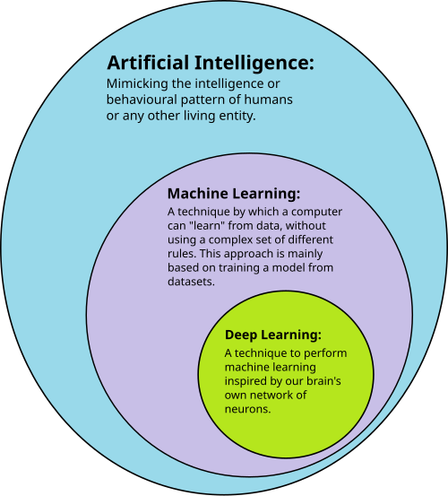

*Deep learning is a subset of machine learning, which is itself a subset of artificial intelligence.*

In machine learning, deep learning(DL) focuses on utilizing multilayered neural networks to perform tasks such as classification, regression, and representation learning. The field takes inspiration from biological neuroscience and revolves around stacking artificial neurons into layers and "training" them to process data.

## Intro

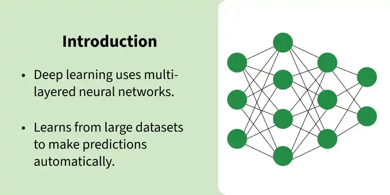

Deep learning algorithms can be applied to unsupervised learning tasks. This is an important benefit because unlabeled data is more abundant than labeled data.

---

## Neural Networks

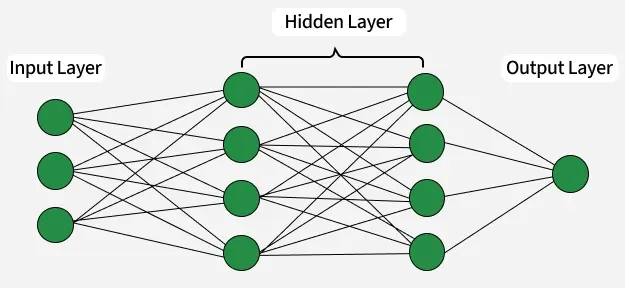

Neural networks are machine learning models that mimic the complex functions of the human brain. These models consist of interconnected nodes or neurons that process data, learn patterns and enable tasks such as pattern recognition and decision making.

Architectures of Neural Network

1. Single-layer Feed Forward Network

   

   A single-layer feed forward network is the simplest type of neural network where data moves directly from input to output without any hidden layers. It is suitable for simple, linearly separable problems.

2. Multi-layer Feed Forward Network

   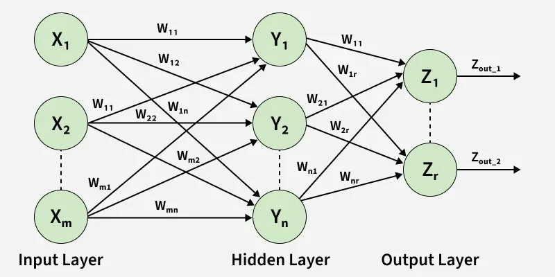

   A multi-layer feed forward network extends basic neural networks by adding one or more hidden layers between input and output, allowing it to learn complex non-linear patterns.

3. Competitive Network

   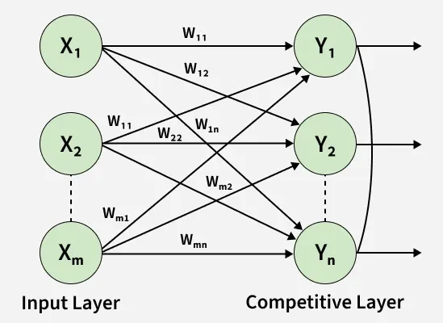

   A competitive network is a type of neural network where output neurons compete with each other to respond to an input. It uses unsupervised learning to discover patterns and group similar data.

4. Recurrent Network

   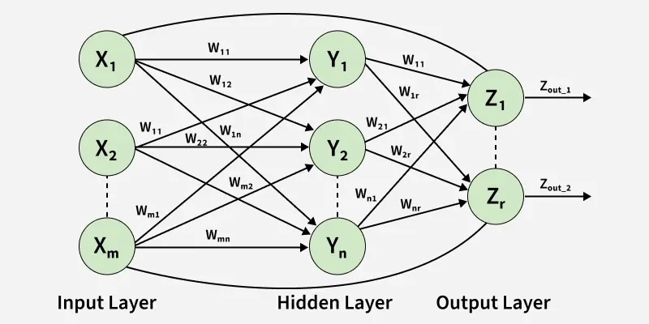

   A recurrent neural network is designed to work with sequential data by using feedback connections, allowing it to remember past information and model time-based patterns.

### Artificial Neural Networks(ANNs)

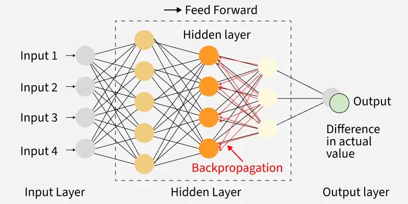

**Artificial neural networks (ANNs)**, or connectionist systems, are computing systems vaguely inspired by the biological neural networks that constitute animal brains. Such systems "learn" to perform tasks by considering examples, generally without being programmed with any task-specific rules.

- Input Layer

  This is where the network receives information.

- Hidden Layers

  These layers process the data received from the input layer. The more hidden layers there are, the more complex patterns the network can learn and understand. Each hidden layer transforms the data into more abstract information.

- Output Layer

  This is where the final decision or prediction is made.

Training and Testing:

- During training, the network is shown examples like images of cats and learns to recognize patterns in them.
- After training, the network is tested on new data to check its performance. The better the network is trained, the more accurately it will predict new data.

#### Input Layer In ANN

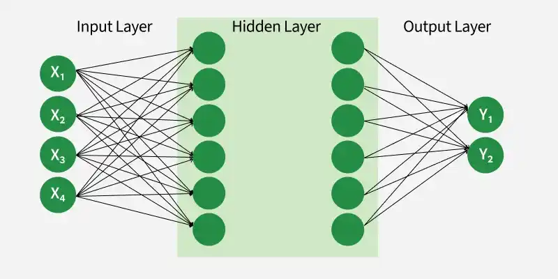

The input layer is the first layer in an artificial neural network and is responsible for receiving raw input data. Each neuron represents a feature of the data and simply passes this information to the next layer without performing any computation.

#### Hidden Layer In ANN

Hidden layers are the intermediate layers between the input and output layers where most of the computation happens. They transform input data into more meaningful representations to help the network learn complex patterns.

Hidden layers can be of different types, each designed to perform specific computations and improve learning:

1. Dense (Fully Connected) Layer

   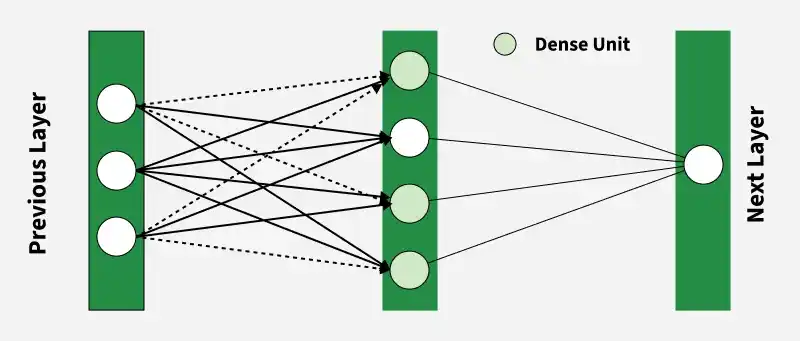

   Dense (Fully Connected) Layer is the most common hidden layer where each neuron is connected to every neuron in the previous layer. It performs a weighted sum of inputs followed by an activation function to learn complex patterns.

2. Convolutional Layer

   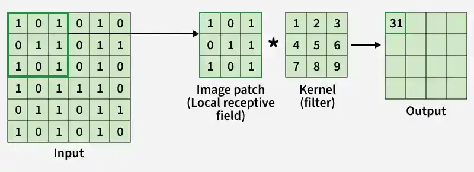

   Convolutional layers is used in neural networks, especially CNNs, to process image and spatial data by capturing important patterns and features.

3. Recurrent Layer

   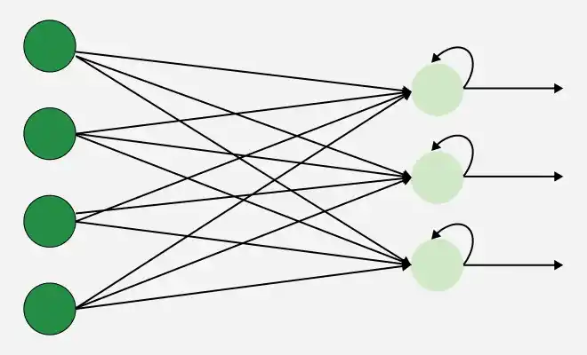

   Recurrent layers is used in neural networks to handle sequential data by maintaining information across time steps, making it suitable for tasks involving context and order.

4. Dropout layer

   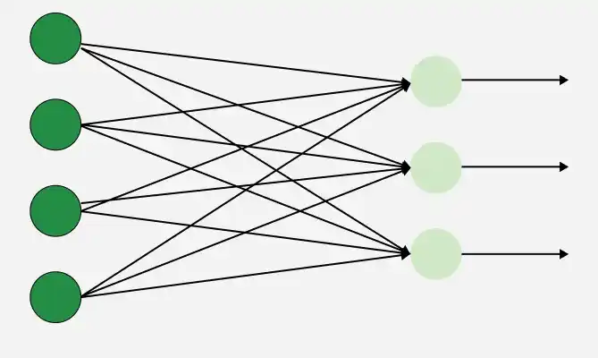

   Dropout layers is used as a regularization technique to reduce overfitting by randomly deactivating some neurons during training, encouraging the network to learn more robust features.

5. Pooling Layer

   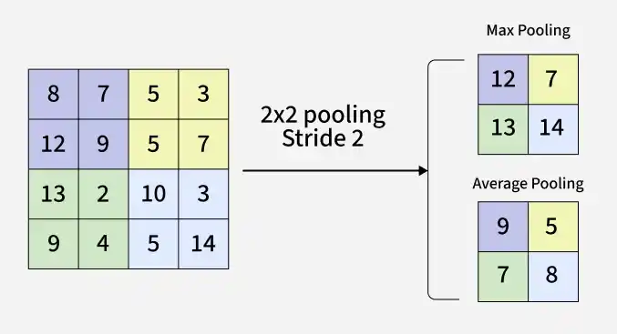

   Pooling Layer is used to reduce the spatial dimensions of data, making computation faster and helping control overfitting in neural networks.

6. Batch Normalization Layer

   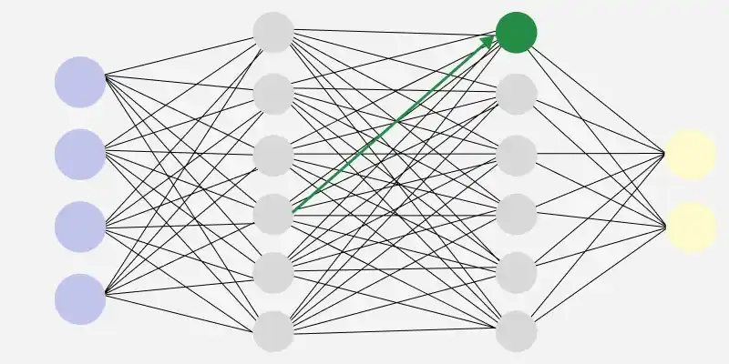

   A Batch Normalization Layer normalizes the outputs of a previous layer using the batch mean and standard deviation, helping improve training stability and speed.

#### Output Layer In ANN

The output layer is the final layer of an artificial neural network that produces the model’s predictions. The number of neurons depends on the type of problem and the required output.

### Feedforward Neural Networks (FNNs)

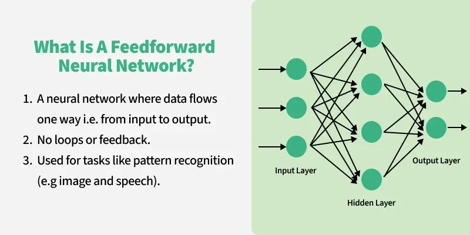

**Feedforward neural networks (FNNs)** are a type of artificial neural network where data flows in one direction from input to output without forming cycles. Inputs pass through hidden layers to produce outputs.

Feedforward Neural Networks have a structured layered design where data flows sequentially through each layer.

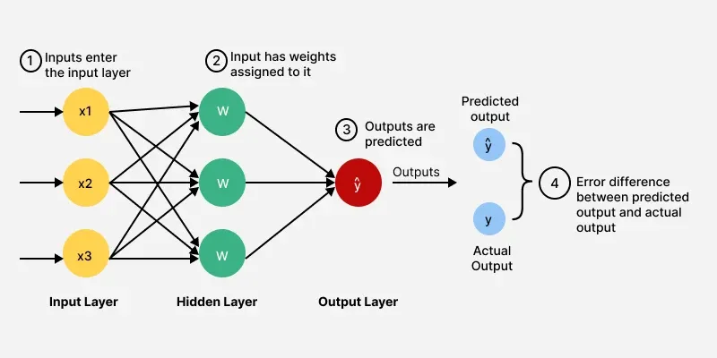

- Input Layer

  The input layer consists of neurons that receive the input data. Each neuron in the input layer represents a feature of the input data.

- Hidden Layers

  One or more hidden layers are placed between the input and output layers. These layers are responsible for learning the complex patterns in the data. Each neuron in a hidden layer applies a weighted sum of inputs followed by a non-linear activation function.

- Output Layer

  The output layer provides the final output of the network. The number of neurons in this layer corresponds to the number of classes in a classification problem or the number of outputs in a regression problem.

#### Multi-Layer Feedforward Neural Network

- Hidden Layer Computation

  The net input to the k-th hidden neuron is given by:
  $$
  y_{in_k} = x_0 w_{0k} + \sum_{i = 1}^{m}x_{i} w_{ik}
  $$
  Here $x_0 = 1$ denotes the bias input

  The output of the k-th hidden neuron is obtained by applying the hidden layer activation function $f_{y}()$ to the net input:
  $$
  y_{out_k} = f_y(y_{in_k})
  $$
  where:

  - $y_{in_k}$: Net input to the k-th hidden neuron
  - $y_{out_k}$: Output of the k-th hidden neuron after activation
  - $w_{ik}$: Weight connecting the i-th input neuron to the k-th hidden neuron
  - $m$: Total number of input features

- Output Layer Computation

  The net input to the k-th output neuron is obtained by summing the weighted outputs of all hidden layer neurons and adding a bias term. The bias input allows the model to shift the activation function and improves learning flexibility.
  $$
  z_{in_k} = w_{0k}' + \sum_{i = 1}^{n} y_{out_{i}}w_{ik}'
  $$
  where:

  - $z_{in_k}$: is Net input to the k-th output neuron
  - $w_{ik}'$: is the weight connecting the i-th hidden neuron to the k-th output neuron
  - $n$: is the number of hidden neurons.

  The final output of the $k^{th}$ output neuron:
  $$
  z_{out_k} = f_z(z_{in_k})
  $$
  This step produces the network’s predicted output for the given input

- Error (Cost) Function

  Let $t_k$ be the target output of the $k^{th}$ output neuron. The cost function defined as the sum of squared errors is:
  $$
  E = \frac{1}{2} \sum_{k = 1}^{n}(t_k - z_{out_k})^2
  $$
  Since the output neuron applies an activation function $f_z()$ the error can also be written as:
  $$
  E = \frac{1}{2} \sum_{k = 1}^{n}(t_k - f_z(z_{in_k}))^2
  $$

- Weight Update for Hidden-to-Output Layer

  To update the weights using gradient descent, the partial derivative of the error with respect to the weight $w_{jk}'$ (connecting hidden neuron $j$ to output neuron $k$) is computed as:
  $$
  \frac{\partial E}{\partial w_{jk}'} = -(t_k - z_{out_k}) \cdot f_{z}'(z_{in_k}) \cdot y_{out_j}
  $$

- Weight and Bias Update Equations

  Using learning rate $\alpha$ the weight update rule is:
  $$
  w_{0k}'(new) = w_{0k}'(old) - \alpha \frac{\partial E}{\partial w_{0k}'}
  $$
  For the bias weight:
  $$
  w_{0k}'(new) = w_{0k}'(old) - \alpha \cdot \frac{\partial E}{\partial w_{jk}'}
  $$

- Weight Update for Input-to-Hidden Layer

  The weights connecting the input layer to the hidden layer are updated using the gradient descent method. To determine how each weight should be changed, we compute the gradient of the error function with respect to the weight using the chain rule.

  For weights change in weight is given by:
  $$
  \Delta w_{ij} = -\alpha \cdot \frac{\partial E}{\partial w_{ij}}
  $$
  Using the chain rule this gradient can be expanded as:
  $$
  \frac{\partial E}{\partial w_{ij}} = \frac{\partial E}{\partial y_{out_j}} \cdot \frac{\partial y_{out_j}}{\partial y_{in_j}} \cdot \frac{\partial y_{in_j}}{\partial w_{ij}}
  $$
  weight update:
  $$
  w_{ij}(new) = w_{ij}(old) - \alpha \cdot \frac{\partial E}{\partial w_{ij}}
  $$

#### Training a Feedforward Neural Network

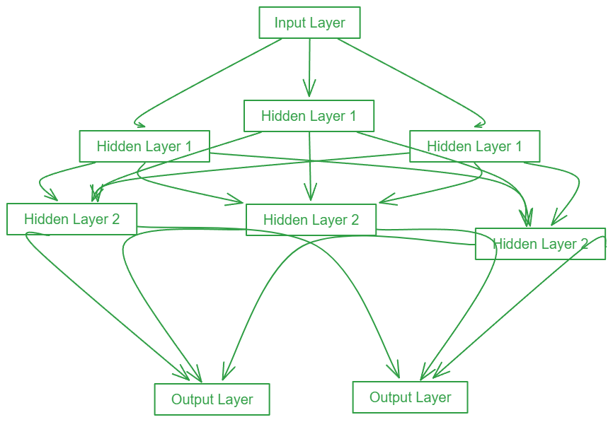

Training a Feedforward Neural Network involves adjusting the weights of the neurons to minimize the error between the predicted output and the actual output. This process is typically performed using backpropagation and gradient descent.

1. Forward Propagation

   During forward propagation the input data passes through the network and the output is calculated.

2. Loss Calculation

   The loss (or error) is calculated using a loss function such as Mean Squared Error (MSE) for regression tasks or Cross-Entropy Loss for classification tasks.

3. Backpropagation

   In backpropagation the error is propagated back through the network to update the weights. The gradient of the loss function with respect to each weight is calculated and the weights are adjusted using gradient descent. 

#### Evaluation of Feedforward neural network

Evaluating the performance of the trained model involves several metrics:

- Accuracy: The proportion of correctly classified instances out of the total instances.
- Precision: The ratio of true positive predictions to the total predicted positives.
- Recall: The ratio of true positive predictions to the actual positives.
- F1 Score: The harmonic mean of precision and recall, providing a balance between the two.
- Confusion Matrix: A table used to describe the performance of a classification model, showing the true positives, true negatives, false positives and false negatives.

### Convolutional Neural Networks(CNNs)

*Convolutional Neural Networks (CNNs)*, are neural network architectures inspired by the human visual system, designed to process image data by capturing spatial relationships between pixels.

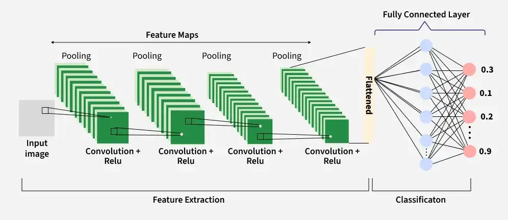

- Input Layer

  The input layer receives the raw image data and passes it to the network for processing. In CNNs, input is typically a 3D volume (width × height × depth).

- Convolutional Layer

  The [Convolutional Layer](#Convolution Layers) is responsible for extracting important features from the input data. It applies a set of learnable filters (kernels) that slide over the image and compute the dot product between the filter weights and corresponding image patches, producing feature maps.

- Activation Layer

  The Activation Layer introduces non-linearity into the network by applying an element-wise [activation function](#Activation Function) to the output of the convolution layer. This enables the model to learn complex patterns beyond linear relationships.

- Pooling Layer

  The [Pooling Layer](#Pooling Layer) is used to reduce the spatial dimensions of the feature maps, making computation faster, reducing memory usage, and helping to prevent overfitting. It is typically inserted between convolutional layers in a CNN.

- Flattening

  Flattening converts the multi-dimensional feature maps into a one-dimensional vector after convolution and pooling. This vector is then passed to the fully connected layer for classification or regression.

- Fully Connected Layer

  The fully connected (dense) layer performs high-level reasoning using extracted features and produces the final classification scores.

- Output Layer

  The output layer converts final scores into probabilities using activation functions like Sigmoid(binary classification) or Softmax(multi-class classification).

#### Convolution Layers

Convolution layers are core components of CNNs used in image processing. They apply filters (kernels) over the input to extract important patterns and features.

Steps in a convolution layer:

1. Initialize Filters

   Randomly initialize a set of filters with learnable parameters.

2. Convolve Filters with Input

   Slide the filters across the width and height of the input data, computing the dot product between the filter and the input sub-region.

3. Apply Activation Function

   Apply a non-linear activation function to the convolved output to introduce non-linearity.

4. Pooling (Optional)

   Often followed by a pooling layer (like max pooling) to reduce the spatial dimensions of the feature map and retain the most important information.

Types of convolution layers:

- 2D Convolution (Conv2D)

  Most common for images; filters move across height and width.

- Depthwise Separable Convolution

  Reduces computation by separating depthwise and pointwise operations.

- Dilated (Atrous) Convolution

  Expands the receptive field by adding gaps in the kernel without increasing computation

#### Padding in CNNs

Padding is a technique used to preserve the spatial dimensions of the input image after convolution operations on a feature map. Padding involves adding extra pixels around the border of the input feature map before convolution. 

Padding adds layers of zeros around the input image to preserve its size and retain border information during convolution.

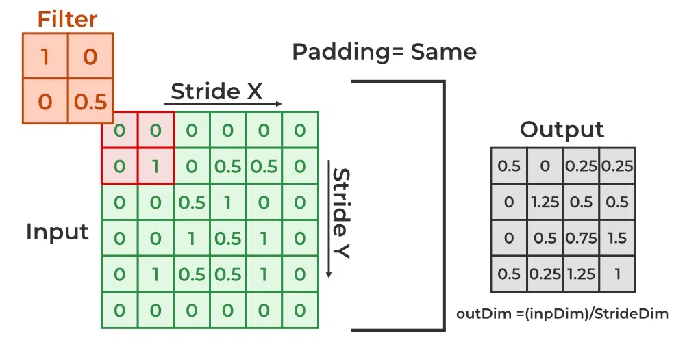

- Prevents shrinking of the image after convolution
- If $p$ is padding, then input size becomes: $(n \times n) \rightarrow (n + 2p) \times (n + 2p)$
- Output size after convolution: $(n + 2p - f + 1) \times (n + 2p - f + 1)$

Types of Padding:

1. Valid Padding (No Padding)

   Valid padding applies convolution without adding any extra pixels, so the output feature map becomes smaller than the input.

   Formual:
   $$
   (n \times n) * (f \times f) \rightarrow (n - f + 1) \times (n - f + 1)
   $$

2. Same Padding

   Same padding ensures that the output feature map has the same spatial dimensions as the input by adding zeros around the borders.

   Formula:
   $$
   (n + 2p) \times (n + 2p) * (f \times f) \rightarrow (n \times n)
   $$
   Padding value depends on kernel size:
   $$
   p = \frac{f - 1}{2}
   $$

#### Pooling Layer

A pooling layer is used to reduce the spatial dimensions (width and height) of feature maps while keeping the most important information.

For a feature map with dimensions $n_h \times n_w \times n_c$, the dimensions of the output after a pooling layer are:
$$
\lfloor \frac{n_h - f}{s} \rfloor + 1 \times \lfloor \frac{n_w - f}{s} \rfloor + 1 \times n_c
$$
where:

- $n_h$: input height
- $n_w$: input width
- $n_c$: number of channels
- $f$: filter size
- $s$: stride length

With Padding (if used): $\lfloor \frac{n_h - f + 2p}{s} \rfloor + 1$.

Types of pooling layers:

1. Max Pooling

   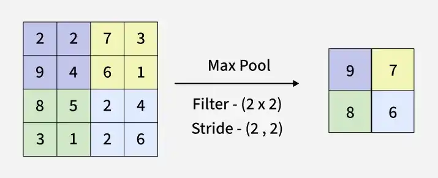

   Max pooling selects the maximum value from each region of the feature map, capturing the most prominent features.

   - Selects the maximum value from each filter region
   - Retains important features like edges and textures
   - Reduces spatial dimensions of the feature map
   - Commonly used due to strong performance in practice

2. Average Pooling

   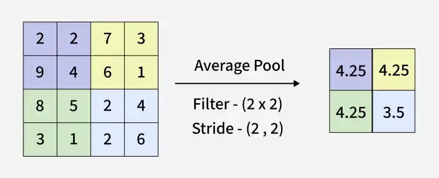

   Average pooling computes the mean value of elements within each region of the feature map, capturing overall feature information.

   - Calculates the average value from each filter region
   - Represents overall features rather than the strongest ones
   - Reduces spatial dimensions of the feature map
   - Produces smoother feature maps compared to max pooling

3. Global Pooling

   Global pooling reduces each channel of a feature map to a single value, resulting in a $1 \times 1 \times n_c$ output. This is equivalent to applying a filter of size $n_h \times n_w$. There are two types of global pooling:

   - **Global Max Pooling**: Takes the maximum value across the entire feature map.
   - **Global Average Pooling**: Computes the average of all values in the feature map.

#### Fully Connected (dense) Layer

Fully Connected (FC) layers, also called dense layers, are neural network layers where each neuron is connected to every neuron in the previous layer.

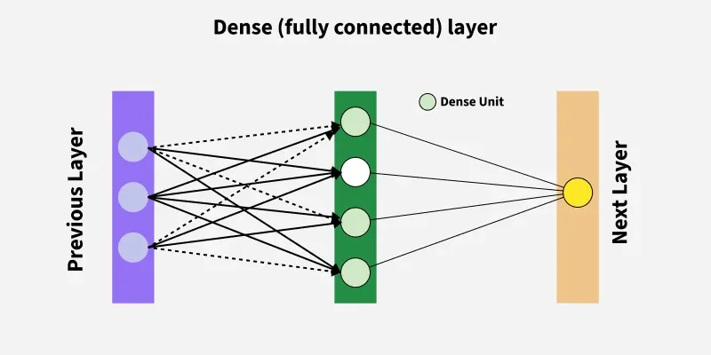

The structure of a fully connected layer is based on complete connectivity, where every neuron in one layer is connected to every neuron in the next layer.

Key Operations in Fully Connected Layers:

1. Input Processing

   Each neuron receives inputs from all neurons of the previous layer. A weighted sum and bias are calculated as:
   $$
   z_j = \sum_{i}(w_{ij} \cdot x_i) + b_j
   $$

   - $w_{ij}$: weight between neurons
   - $x_i$: input value
   - $b_j$: bias term

2. Activation

   The weighted sum is passed through an activation function such as ReLU, Sigmoid or Tanh:
   $$
   a_j = f(z_j)
   $$
   $f$ denotes the activation function transforming the linear combination of inputs into a non-linear output.

#### Back Propagation in CNN

Backpropagation is a fundamental training algorithm in CNNs that propagates errors backwards through the network to optimise learning. It enables the model to adjust internal parameters and improve performance over time.

Backpropagation trains a CNN by calculating prediction errors and updating weights to reduce the loss function. The process mainly consists of forward propagation, loss calculation, backward propagation, and weight updates:

1. Forward Pass

   In the forward pass, input images move through different CNN layers to generate predictions.

   - Convolutional Layers: Each convolutional layer applies numerous filters to the input. For a given layer $l$ with filters denoted by $F$, input $I$, and bias $b$, the output $O$ is given by: $O = (I * F) + b$ Here, $*$ denotes the convolution operation.
   - Activation Functions: After convolution, an activation function $\sigma$ is applied element-wise to introduce non-linearity: $O = \sigma((I * F) + b)$.
   - Pooling Layers: Pooling (e.g., max pooling) reduces dimensionality, summarizing the features extracted by the convolutional layers.

2. Loss Calculation

   The predicted output is compared with the actual output using a loss function $L$ to measure prediction error. For classification tasks, cross-entropy loss is commonly used:
   $$
   L = \sum y \log(\hat{y})
   $$
   here:

   - $y$ is the true label
   - $\hat{y}$ is the predicted label

3. Backward Pass

   The backward pass computes the gradient of the loss function with respect to each weight in the network by applying the chain rule:

   - Gradient with respect to output: First, calculate the gradient of the loss function with respect to the output of the final layer $\frac{\partial L}{\partial O}$
   - Gradient through activation function: Apply the chain rule through the activation function: $\frac{\partial L}{\partial I} = \frac{\partial L}{\partial O} \frac{\partial O}{\partial I}$ For ReLU, $\frac{\partial O}{\partial I}$ is 1 for $I$> 0 and 0 otherwise.
   - Gradient with respect to filters in convolutional layers: Continue applying the chain rule to find the gradients with respect to the filters:$\frac{\partial L}{\partial F} = \frac{\partial L}{\partial O} * rot180(I)$. Here, $rot180(I)$ rotates the input by 180 degrees, aligning it for the convolution operation used to calculate the gradient with respect to the filter.

4. Weight Update

   Using the gradients calculated, the weights are updated using an optimization algorithm such as SGD:
   $$
   F_{new} = F_{old} - \eta \frac{\partial L}{\partial F}
   $$
   Here, $\eta$ is the learning rate, which controls the step size during the weight update.

#### LeNet-5 Architecture

LeNet-5 is a convolutional neural network (CNN) designed for image recognition, especially handwritten digit classification. It introduced a structured approach to feature learning in neural networks.

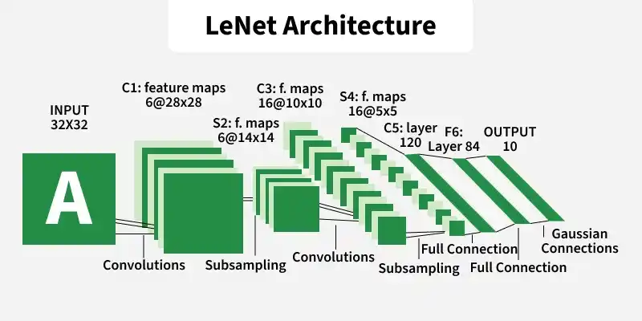

- Input Layer

- Layer C1 (Convolutional Layer)

  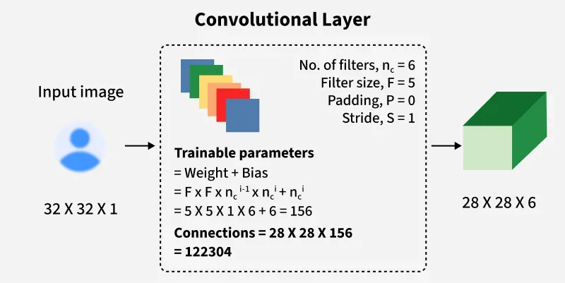

- Layer S2 (Subsampling Layer)

  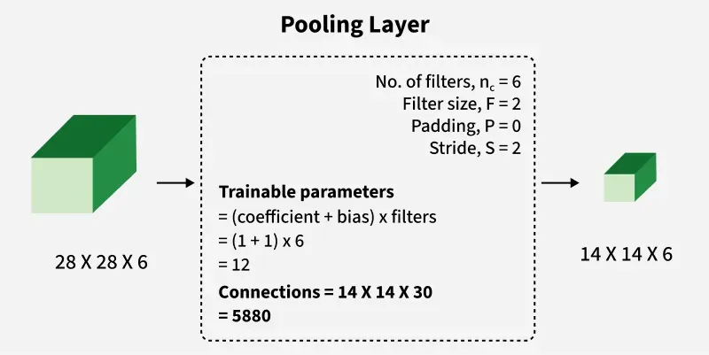

- Layer C3 (Convolutional layer)

  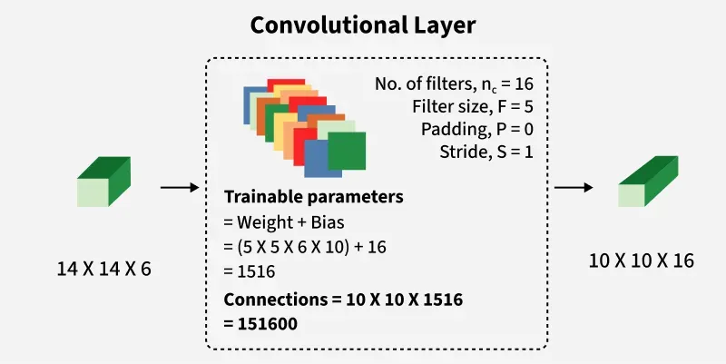

- Layer S4 (Subsampling Layer)

  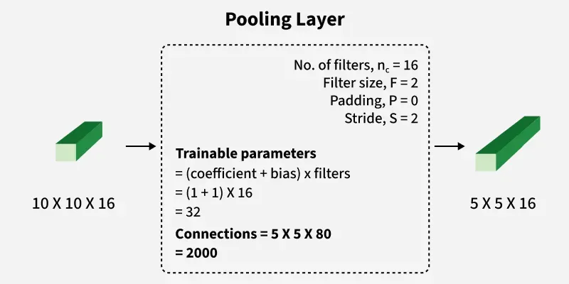

- Layer C5 (Convolutional Layer)

  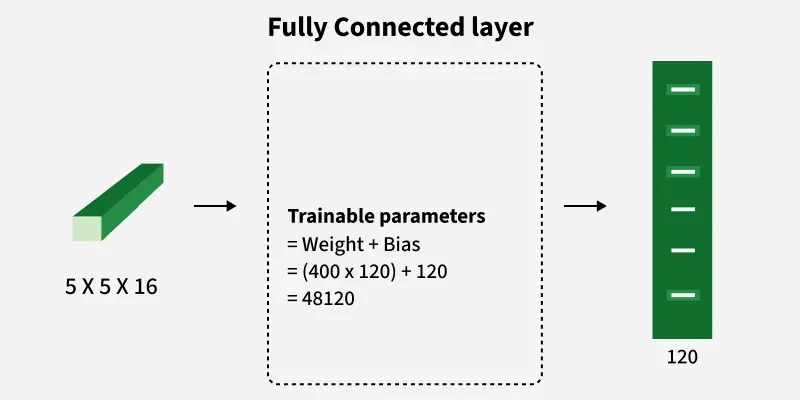

- Layer F6 (Fully Connected Layer)

  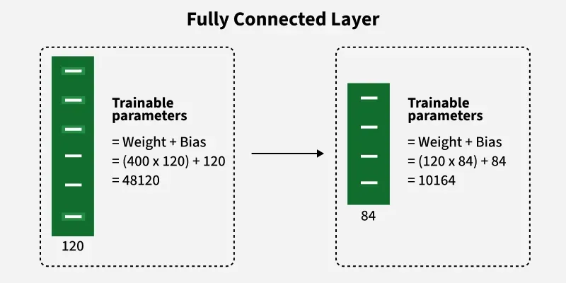

- Output layer

  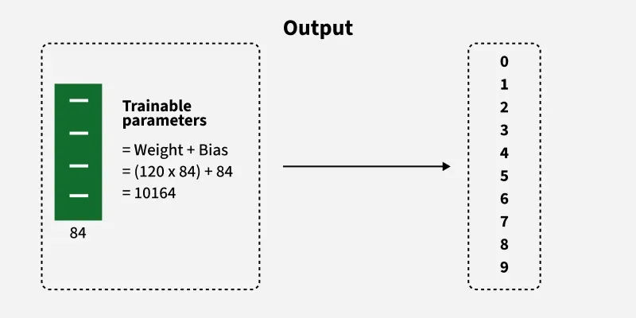

  Here's how the output of each RBF unit $y_i$ is computed:
  $$
  y_i = \sum_{j} x_{j} \cdot w_{ij}
  $$
  In this equation:

  - $x_j$ represents the inputs to the RBF unit.
  - $w_{ij}$ represents the weights associated with each input.
  - The summation is over all inputs to the RBF unit.

#### AlexNet Architecture

AlexNet is a deep convolutional neural network used for image classification. It consists of multiple convolutional and fully connected layers designed to extract features and perform classification efficiently.

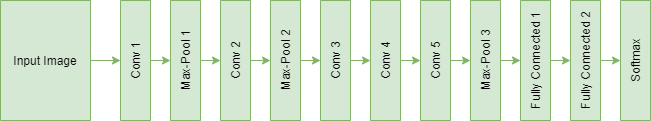

#### VGG-Net Architecture

VGG-19 is a deep convolutional neural network with 19 weight layers, comprising 16 convolutional layers and 3 fully connected layers. The architecture follows a straightforward and repetitive pattern, making it easier to understand and implement.

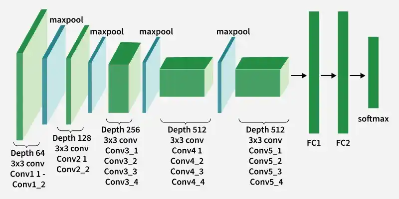

#### VGG-16 Architecture

VGG-16 is a convolutional neural network (CNN) designed for image classification tasks, known for its simple and uniform architecture that delivers strong performance on visual recognition problems.

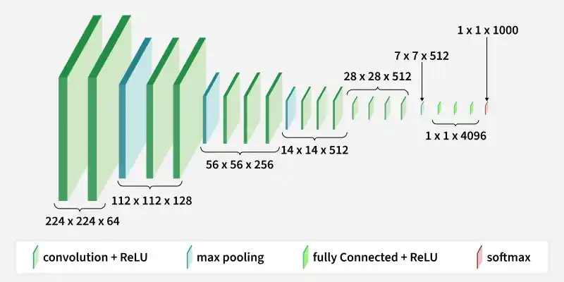

#### GoogleNet Model Architecture

GoogLeNet (Inception V1) is a convolutional neural network designed for efficient image classification. It uses the Inception module to process multiple filter sizes in parallel, improving feature extraction while keeping computation low.

Key Features of GoogleNet:

1. 1x1 Convolutions

   GoogLeNet uses 1×1 convolutions mainly for dimensionality reduction, which reduces computation and the number of trainable parameters while preserving important features.

2. Global Average Pooling

   Instead of fully connected layers, GoogLeNet uses Global Average Pooling, which averages each feature map into a single value.

3. Inception Module

   The Inception module is the core building block of GoogLeNet. It applies multiple operations in parallel:

   - $1 \times 1$ convolutions
   - $3 \times 3$ convolutions
   - $5 \times 5$ convolutions
   - $3 \times 3$ max pooling

   All outputs are concatenated to capture multi-scale features efficiently without increasing computation significantly.

   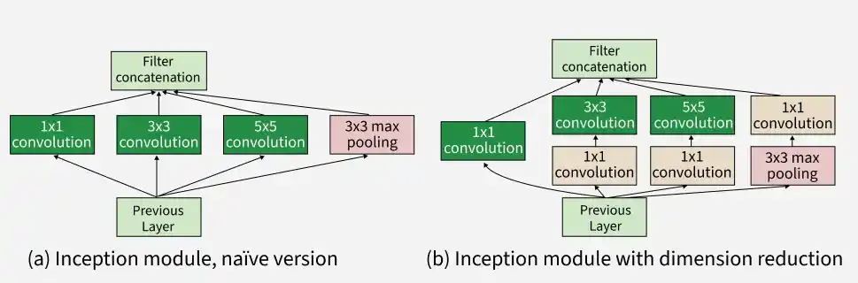

4. Auxiliary Classifiers

   To reduce vanishing gradient problems, GoogLeNet uses auxiliary classifiers during training.

   Each classifier includes:

   - Average pooling
   - 1×1 convolution
   - Fully connected layers
   - Softmax output

   These help stabilize training and improve generalization.

5. Model Architecture

   GoogLeNet is a 22-layer deep network (excluding pooling layers) that emphasizes computational efficiency, making it feasible to run even on hardware with limited resources. Below is Layer by Layer architectural details of GoogLeNet.

   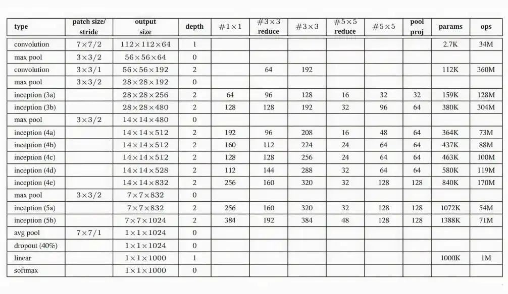

#### Residual Networks (ResNet) Architecture

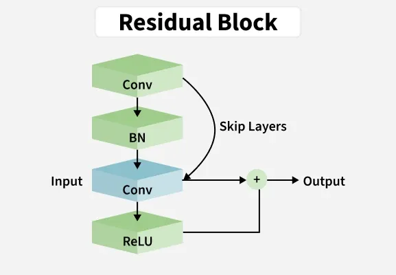

Residual Networks (ResNet) is a deep learning architecture designed to enable efficient training of very deep neural networks. It introduces skip (shortcut) connections, which allow the model to learn residual mappings instead of direct transformations.

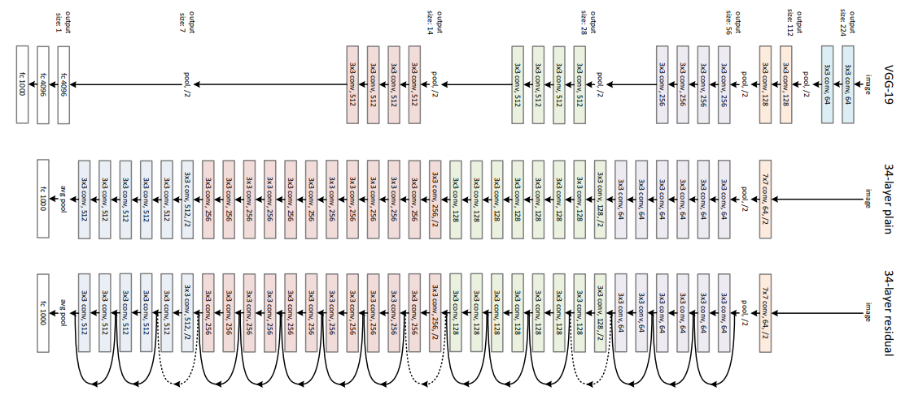

ResNet-34 is a deep residual network built on a 34-layer plain network inspired by VGG-19, with shortcut connections forming 16 residual blocks. The architecture is organized into stages as follows:

- First stage: 3 residual blocks, each with 2 convolution layers of 64 filters and identity skip connections
- Second stage: 4 residual blocks, each with 2 convolution layers of 128 filters; uses 1×1 projection or padding for dimension matching
- Third stage: 6 residual blocks, each with 2 convolution layers of 256 filters
- Fourth stage: 3 residual blocks, each with 2 convolution layers of 512 filters
- Output layer: Feature maps are passed through Global Average Pooling followed by a fully connected layer with softmax for classification

Conventional networks try to learn the full mapping $H(x)$. ResNet instead learns a residual function and combines it with the input via a skip connection
$$
H(x) = F(x) + x
$$
where:

- $x$: input to the block
- $H(x)$: desired mapping
- $F(x)$: residual function to be learned

Learning the simpler residual $F(x)$ makes optimization easier:

1. Residual Block

   A residual block is the core unit of ResNet and consists of:

   - One or more convolutional layers
   - A skip connection that bypasses these layers
   - Addition of input to the convolution output

2. Skip (Shortcut) Connection

   - Bypasses one or more layers
   - Adds input directly to output
   - Prevents vanishing gradients
   - Improves parameter updates

3. Handling Dimension Mismatch: When input and output dimensions differ

   - Zero Padding: Adds extra zeros to the input to match output dimensions
   - Linear Projection: Uses a learnable 1x1 convolution to match input and output dimensions for the skip connection.

4. Stacking Residual Blocks

   Multiple residual blocks can be stacked to create deep architectures. This allows networks to go very deep without suffering from degradation.

5. Global Average Pooling (GAP)

   Before the final fully connected layer ResNet uses GAP

   - Converts each feature map to a single value by averaging
   - Reduces parameters less overfitting
   - Produces compact feature representation

#### Mobilenet Architecture

MobileNet V2 is an efficient convolutional neural network architecture designed for mobile and embedded vision applications. Developed by Google, it improves upon MobileNet V1 by enhancing performance while maintaining a lightweight design suitable for resource-constrained environments.

Key Features:

1. Inverted Residuals

   MobileNet V2 introduces inverted residual blocks, which are its core building units. Instead of reducing dimensions first (as in traditional residual blocks), it first expands the input and then compresses it back. An inverted residual block consists of three steps:

   - *1×1 Convolution (Expansion Layer):* Increases the number of channels to capture more features
   - *Depthwise Convolution:* Applies spatial filtering independently on each channel
   - *1×1 Convolution (Projection Layer):* Reduces channels back to a smaller size

   This design helps reduce computation while maintaining important features.

2. Depthwise Separable Convolutions

   Like MobileNet V1, MobileNet V2 uses depthwise separable convolutions to make the model efficient and reduce the number of parameters and computations significantly.

   It splits standard convolution into:

   - *Depthwise convolution:* Applies filtering on each channel separately
   - *Pointwise convolution (1×1):* Combines information across channels

3. Linear Bottlenecks

   MobileNet V2 uses linear bottlenecks in the final projection layer of each block.

   - Instead of applying a non-linear activation at the end, it keeps the transformation linear
   - This helps prevent loss of important information, especially in low-dimensional spaces

4. ReLU6 Activation Function

   MobileNet V2 uses ReLU6, a variation of ReLU.

   - It limits output values between 0 and 6
   - This makes the model more suitable for low-precision (mobile) computations

#### U-Net Architecture Architecture

U-Net is a kind of neural network mainly used for image segmentation which means dividing an image into different parts to identify specific objects for example separating a tumor from healthy tissue in a medical scan.

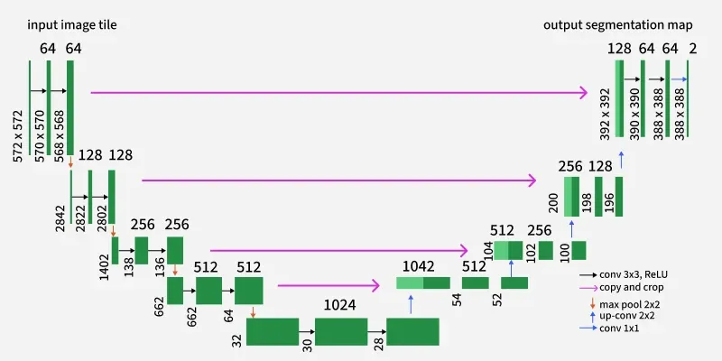

The architecture is symmetric and has three key parts:

1. Contracting Path (Encoder):

   - Uses small filters (3×3 pixels) to scan the image and find features.
   - Apply an activation function called ReLU to add non-linearity help the model to learn better.
   - Uses max pooling (2×2 filters) to shrink the image size while keeping important information. This helps the network focus on bigger features.

2. Bottleneck:

   The middle of the “U” where the most compressed and abstract information is stored. It links the encoder and decoder.

3. Expansive Path (Decoder):

   - Uses upsampling i.e increasing image size to get back the original image size.
   - Combines information from the encoder using “skip connections.” These connections help the decoder get spatial details that might have been lost when shrinking the image.
   - Uses convolution layers again to clean up and refine the output.

### Recurrent Neural Networks(RNNs)

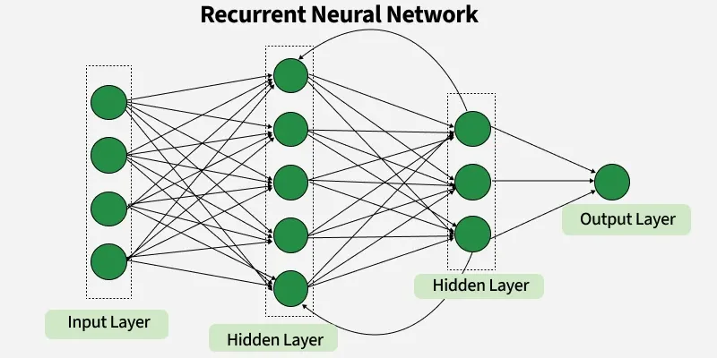

**Recurrent neural network (RNNs)** handles sequential data in which the current output is a result of previous inputs by looping over themselves to hold internal state (memory).

There are mainly two components of RNNs:

1. Recurrent Neurons

   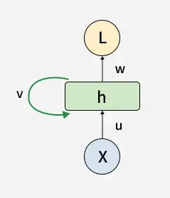

   The fundamental processing unit in RNN is a Recurrent Unit**.** They hold a hidden state that maintains information about previous inputs in a sequence. Recurrent units can "remember" information from prior steps by feeding back their hidden state, allowing them to capture dependencies across time.

2. RNN Unfolding

   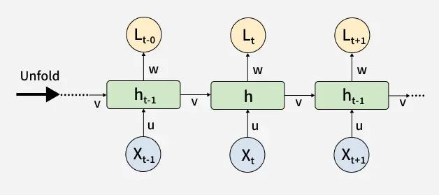

   RNN unfolding or unrolling is the process of expanding the recurrent structure over time steps. During unfolding each step of the sequence is represented as a separate layer in a series illustrating how information flows across each time step.

#### RNN Architecture

In RNNs the hidden state $H_i$ is calculated for every input $X_i$ to retain sequential dependencies. The computations follow these core formulas:

1. Hideen State Calculation:
   $$
   h_t = \sigma(U \cdot X_t + W \cdot h_{t - 1} + B)
   $$
   here:

   - $h$ represents the current hidden state.
   - $\sigma$ represents tanh activation function.
   - $U$ and $W$ are weight matrices.
   - $B$ is the bias.

2. Output Calculation:
   $$
   Y = O(V \cdot h + C)
   $$
   The output $Y$ is calculated by applying $O$ an activation function to the weighted hidden state where $V$ and $C$ represent weights and bias.

3. Overall Function:
   $$
   Y = f(X, h, W, U, V, B, C)
   $$
   This function defines the entire RNN operation where the state matrix $S$ holds each element $s_i$ representing the network's state at each time step $i$.

#### RNN Workflow

The current hidden state $h_t$ depends on the previous state $h_{t - 1}$ and the current input $x_t$ and is calculated using the following relations:

1. State Update:
   $$
   h_t = f(h_{t - 1}, x_t)
   $$
   where:

   - $h_t$ is the current state
   - $h_{t - 1}$ is the previous state
   - $x_t$ is the input at the current time step

2. Activation Function Application:
   $$
   h_t = tanh(W_{hh} \cdot h_{t - 1} + W_{xh} \cdot x_t)
   $$
   Here, $W_{hh}$ is the weight matrix for the recurrent neuron and $W_{xh}$ is the weight matrix for the input neuron.

3. Output Calculation:
   $$
   y_t = W_{hy} \cdot h_t
   $$
   where $y_t$ is the output and $W_{hy}$ is the weight at the output layer.

#### Backpropagation Through Time (BPTT) in RNNs

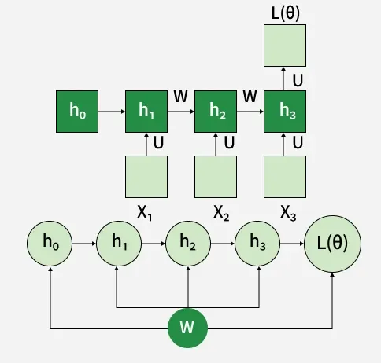

Since RNNs process sequential data, `Backpropagation Through Time (BPTT)` is used to update the network's parameters. The loss function $L(\theta)$ depends on the final hidden state $h_3$ and each hidden state relies on preceding ones forming a sequential dependency chain: $h_3$ depends on $h_2$, $h_2$ depends on $h_1, \cdots, h_1$ depends on $h_0$.

In BPTT, gradients are backpropagated through each time step. This is essential for updating network parameters based on temporal dependencies:

1. Simplified Gradient Calculation:
   $$
   \frac{\partial L(\theta)}{\partial W} = \frac{\partial L(\theta)}{\partial h_3} \cdot \frac{\partial h_3}{\partial W}
   $$

2. Handling Dependencies in Layers:

   Each hidden state is updated based on its dependencies:
   $$
   h_3 = \sigma(W \cdot h_2 + b)
   $$
   The gradient is then calculated for each state, considering dependencies from previous hidden states.

3. Gradient Calculation with Explicit and Implicit Parts:

   The gradient is broken down into explicit and implicit parts summing up the indirect paths from each hidden state to the weights.
   $$
   \frac{\partial h_3}{\partial W} = \frac{\partial h_{3}^{+}}{\partial W} + \frac{\partial h_3}{\partial h_3} \cdot \frac{\partial h_{2}^{+}}{\partial W}
   $$

4. Final Gradient Expression:

   The final derivative of the loss function with respect to the weight matrix W is computed:
   $$
   \frac{\partial L(\theta)}{\partial W} = \frac{\partial L(\theta)}{\partial h_3} \cdot \sum_{k = 1}^{3}\frac{\partial h_3}{\partial h_k} \cdot \frac{\partial h_k}{\partial W}
   $$
   This iterative process is the essence of backpropagation through time.

#### One-to-One RNN

This is the simplest type of neural network architecture where there is a single input and a single output. It is used for straightforward classification tasks such as binary classification where no sequential data is involved.

#### One-to-Many RNN

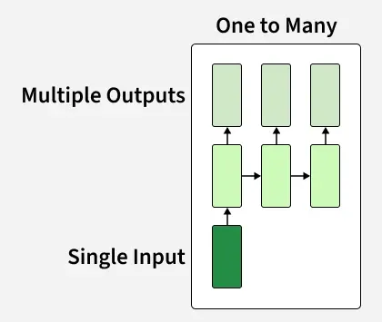

In a One-to-Many RNN the network processes a single input to produce multiple outputs over time. This is useful in tasks where one input triggers a sequence of predictions (outputs).

#### Many-to-One RNN

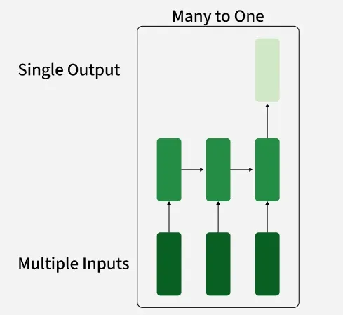

The Many-to-One RNN receives a sequence of inputs and generates a single output. This type is useful when the overall context of the input sequence is needed to make one prediction. In sentiment analysis the model receives a sequence of words (like a sentence) and produces a single output like positive, negative or neutral.

#### Many-to-Many RNN

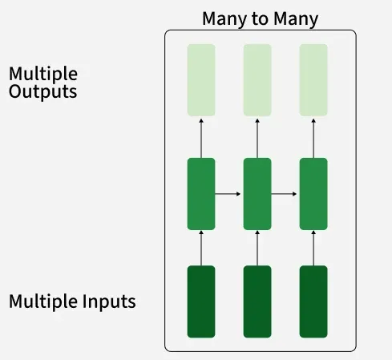

The Many-to-Many RNN type processes a sequence of inputs and generates a sequence of outputs. In language translation task a sequence of words in one language is given as input and a corresponding sequence in another language is generated as output.

### Bidirectional Recurrent Neural Network

Bidirectional Recurrent Neural Networks (BRNNs) are an advanced form of RNNs that process sequential data in both forward and backward directions. This allows the network to use both past and future context, improving understanding and prediction accuracy.

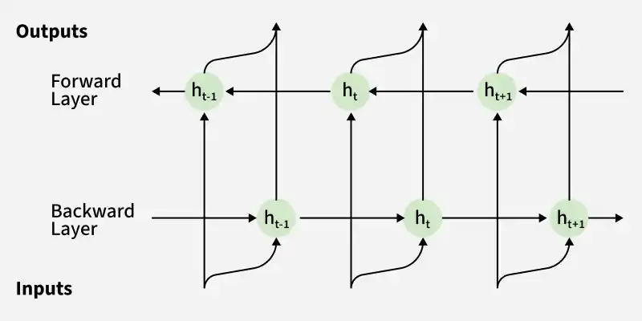

1. Input Sequence

   A sequence of data points is provided as input, where each element is represented as a vector.

2. Dual Direction Processing

   The sequence is processed in two directions

   - Forward direction: uses current input and previous hidden state
   - Backward direction: uses current input and next hidden state

3. Hidden State Computation

   Hidden states are computed using weighted inputs and activation functions, allowing the network to retain sequence information.

4. Output Generation

   The outputs are generated from the hidden states and can be used directly for prediction or passed to additional layers for further processing.

### Long Short-Term Memory Networks (LSTMs)

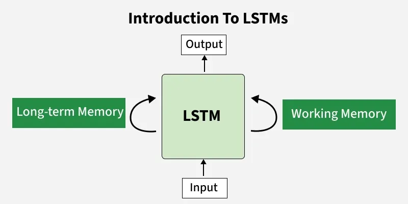

Long Short-Term Memory (LSTM) is an improved version of the Recurrent Neural Network (RNN) designed to capture long-term dependencies in sequential data. It uses a memory cell to store information over time, solving the limitations of traditional RNNs.

#### LSTM Architecture

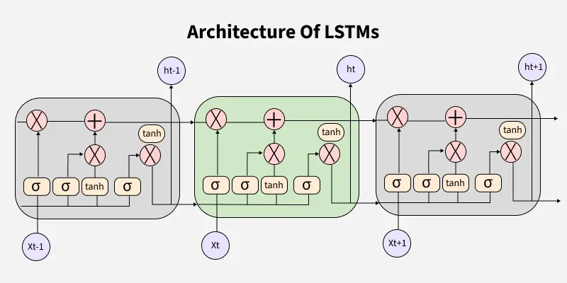

LSTM (Long Short-Term Memory) architecture is designed to learn long-term dependencies in sequential data using memory cells and gates that control the flow of information through the network.

Main Gates in LSTM:

1. Input Gate: Decides which new information should be added to the memory cell
2. Forget Gate: Determines which information should be removed from the memory cell
3. Output Gate: Controls which information from the memory cell is passed to the next hidden state and output

#### LSTM Workflow

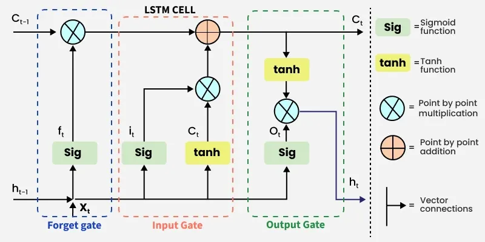

- Forget Gate

  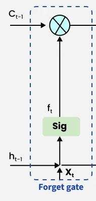
  
  The forget gate decides which information should be kept or removed from the cell state. It uses the current input $x_t$ and previous hidden state $h_{t - 1}$ then applies a [sigmoid function](#Sigmoid Activation Function) to generate values between 0 and 1.
  
  - Values close to 0 remove information
  - Values close to 1 retain information
  - Helps discard unnecessary past information
  - Controls memory retention in the LSTM
  
  The equation for the forget gate is:
  $$
  f_t = \sigma(W_f \cdot [h_{t - 1}, x_t] + b_f)
  $$
  where:
  
  - $W_f$ represents the weight matrix associated with the forget gate.
  - $[h_t - 1, x_t]$ denotes the concatenation of the current input and the previous hidden state.
  - $b_f$ is the bias with the forget gate.
  - $\sigma$ is the sigmoid activation function.
  
- Input Gate

  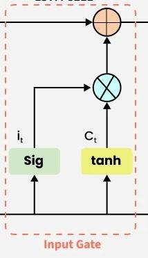
  
  The addition of useful information to the cell state is done by the input gate.
  
  - First the information is regulated using the [sigmoid function](#Sigmoid Activation Function) and filter the values to be remembered similar to the forget gate using inputs $h_{t - 1}$ and $x_t$.
  - Then, a vector is created using the tanh function that gives an output from -1 to +1, which contains all the possible values from $h_{t - 1}$ and $x_t$.
  - At last the values of the vector and the regulated values are multiplied to obtain the useful information.
  
  The equation for the input gate is:
  $$
  i_t = \sigma(W_i \cdot [h_{t - 1}, x_t] + b_i) \\
  \hat{C_t} = tanh(W_c \cdot [h_{t - 1}, x_t] + b_c)
  $$
  We multiply the previous state by $f_t$ effectively filtering out the information we had decided to ignore earlier. Then we add $i_t \odot C_t$, which represents the new candidate values scaled by how much we decided to update each state value.
  $$
  C_t = f_t \odot C_{t - 1} + i_t \odot \hat{C_t}
  $$
  where
  
  - $\odot$ denotes element-wise multiplication
  - tanh is activation function
  
- Output Gate

  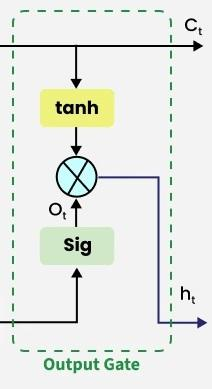
  
  The output gate determines which information from the current cell state should be passed as the hidden state (output) at the current time step. It uses the previous hidden state $h_{t - 1}$ and the current input $x_t$, followed by a [sigmoid function](#Sigmoid Activation Function) to control the output flow.
  $$
  o_{t} = \sigma(W_{o} \cdot [h_{t - 1}, x_t] + b_{o})
  $$
  Next, the current cell state $C_t$ is passed through a tanh activation to scale its values between -1 and +1. Finally, this transformed cell state is multiplied element-wise with $o_t$ to produce the hidden state $h_t$:
  $$
  h_t = o_t \odot tanh(C_t)
  $$
  here:
  
  - $o_t$ is the output gate activation.
  - $C_t$ is the current cell state.
  - $\odot$ represents element-wise multiplication.
  - $\sigma$ is the sigmoid activation function.
  
  This hidden state $h_t$ is then passed to the next time step and can also be used for generating the output of the network.

#### Bidirectional Long Short-Term Memory (BiLSTM)

Bidirectional Long Short-Term Memory (BiLSTM) is an extension of LSTM that processes sequences in both forward and backward directions, allowing the model to capture both past and future context.

A Bidirectional LSTM (BiLSTM) consists of two separate LSTM layers:

- *Forward LSTM*: Processes the sequence from start to end
- *Backward LSTM*: Processes the sequence from end to start

The outputs of both LSTMs are then combined to form the final output. Mathematically, the final output at time $t$ is computed as:
$$
p_t = p_{t_f} + p_{t_b}
$$
where:

- $p_t$: Final probability vector of the network.
- $p_{t_f}$: Probability vector from the forward LSTM network.
- $p_{t_b}$: Probability vector from the backward LSTM network.

The following diagram represents the BiLSTM layer:

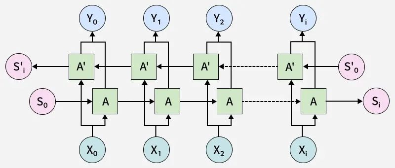

here:

- $X_i$ is the input token 
- $Y_i$ is the output token
- $A$ and $A'$ are Forward and backward LSTM units
- The final output of $Y_i$ is the combination of $A$ and $A'$ LSTM nodes.

### Gated Recurrent Units (GRUs)

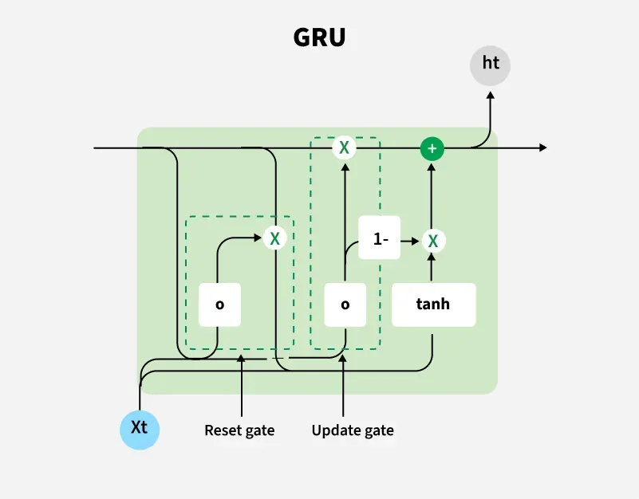

Gated Recurrent Unit (GRU) networks are a type of recurrent neural network designed to handle sequential data while reducing the complexity of traditional RNNs. GRUs are a simplified advancement of LSTM, where they merge multiple gates into update and reset gates, hence learning long-term dependencies with faster training and fewer parameters.

#### GRUs Structure

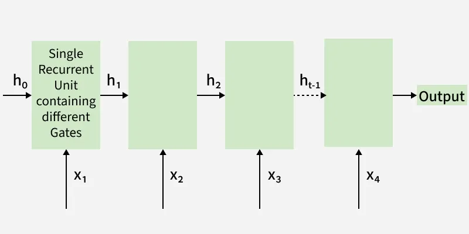

The GRU consists of two main gates:

1. Update Gate ($z_t$): This gate decides how much information from the previous hidden state should be retained for the next time step.
2. Reset Gate ($r_t$): This gate determines how much of the past hidden state should be forgotten.

#### Equations for GRU

1. Reset gate:
   $$
   r_t = \sigma(W_r \cdot [h_{t - 1}, x_t] + b_r)
   $$
   The reset gate controls how much of the previous hidden state is used when computing the candidate hidden state.

2. Update gate:
   $$
   z_t = \sigma(W_z \cdot [h_{t - 1}, x_t] + b_z)
   $$
   The update gate controls the balance between retaining the previous hidden state and incorporating the candidate hidden state.

3. Candidate hidden state:
   $$
   h_{t}' = tanh(W_h \cdot [r_t \cdot h_{t - 1}, x_t] + b_h)
   $$
   This is the potential new hidden state calculated based on the current input and the previous hidden state.

4. Hidden state:
   $$
   h_t = (1 - z_t) \cdot h_{t - 1} + z_t \cdot h_{t}'
   $$
   The final hidden state is a weighted average of the previous hidden state $h_{t - 1}$ and the candidate hidden state $h_{t}'$ based on the update gate $z_t$.

### Radial Basis Function Networks (RBFNs)

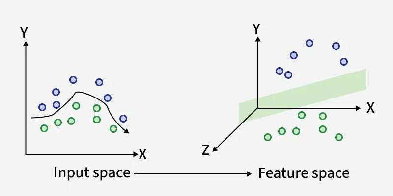

Radial basis function (RBF) networks are neural networks that use radial basis functions to model complex relationships, making them effective for function approximation and classification.

#### Architecture of RBF Networks

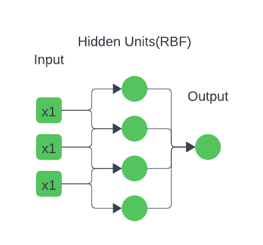

1. Input Layer
   - Function: After receiving the input features the input layer sends them straight to the hidden layer.
   - Components: It is made up of the same number of neurons as the characteristics in the input data. One feature of the input vector corresponds to each neuron in the input layer.
2. Hidden Layer
   - Function: This layer uses radial basis functions (RBFs) to conduct the non-linear transformation of the input data.
   - Components: Neurons in the buried layer apply the RBF to the incoming data. The Gaussian function is the RBF that is most frequently utilized.
   - RBF Neurons: Every neuron in the hidden layer has a spread parameter ($\sigma$) and a center which are also referred to as prototype vectors. The spread parameter modulates the distance between the center of an RBF neuron and the input vector which in turn determines the neuron's output
3. Output Layer
   - Function: The output layer uses weighted sums to integrate the hidden layer neurons outputs to create the network's final output.
   - Components: It is made up of neurons that combine the outputs of the hidden layer in a linear fashion. To reduce the error between the network's predictions and the actual target values, the weights of these combinations are changed during training.

#### Radial Basis Function Kernel

The Radial Basis Function (RBF) kernel, also known as the Gaussian kernel, is one of the most widely used kernel functions. It operates by measuring the similarity between data points based on their Euclidean distance in the input space. Mathematically, the RBF kernel between two data points, $x$ and $x'$, is defined as:
$$
K(x, x') = exp(-\frac{|x - x'|^{2}}{2\sigma^{2}})
$$
where:

- $|x - x'|^{2}$ represents the squared Euclidean distance between the two data points.
- $\sigma$ is a parameter known as the bandwidth or width of the kernel, controlling the smoothness of the decision boundary.

### Self-Organizing Maps (SOMs)

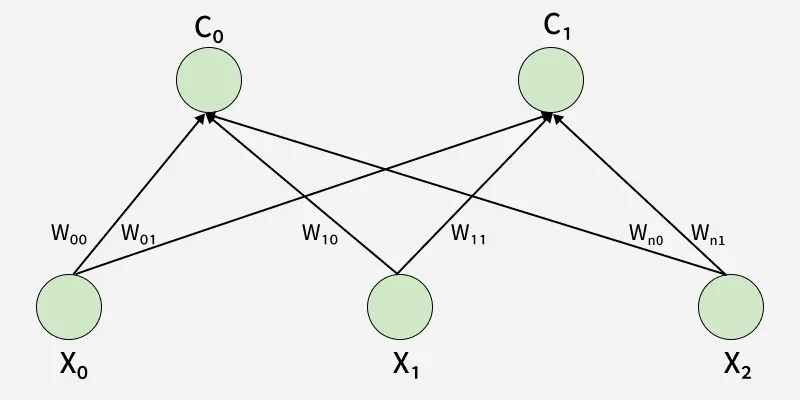

Self-Organizing Maps are unsupervised neural networks that cluster high-dimensional data while preserving its structure, mapping it into a lower-dimensional space.

It consists of two primary layers:

- Input Layer: Represents the features of the data.
- Output Layer: Arranged as a 2D grid of neurons with each neuron representing a cluster in the data.

#### SOMs workflow

1. Initialization

   The weights of the output neurons are randomly initialized. These weights represent the features of each neuron and will be adjusted during training.

2. Competition

   For each input vector, SOM computes the Euclidean distance between the input and the weight vectors of all neurons. The neuron with the smallest distance is the winning neuron.

   Formula:
   $$
   D(j) = \sum_{i=1}^{n} (w_{ij} - x_i)^2
   $$
   where:

   - $D(j)$ is the distance for neuron.
   - $j$ and $n$ is the number of features.

3. Weight Update

   The winning neuron’s weights are updated to move closer to the input vector. The weights of neighboring neurons are also adjusted but with smaller changes.

   Formula:
   $$
   w_{ij}^{(new)} = w_{ij}^{(old)} + \alpha \cdot (x_i - w_{ij}^{(old)})
   $$
   where:

   - $\alpha$ is the learning rate
   - $x_i$ is the input feature.

4. Learning Rate Decay

   The learning rate $\alpha$ decreases over time, allowing the map to converge to stable values.

   Formula:
   $$
   \alpha(t+1) = 0.5 \cdot \alpha(t)
   $$

5. Stopping Condition

   The training stops when the maximum number of epochs is reached or when the weights converge.

### Deep Belief Networks (DBNs)

Deep Belief Networks are composed of multiple layers of stochastic hidden variables, enabling both supervised and unsupervised learning, especially for complex feature extraction.

#### DBNs Workflow

DBNs work in two main phases: 

- pre-training

  In the pre-training phase, the network learns to represent the input data layer by layer. Each layer is trained independently as an RBM, which allows the network to learn complex data representations efficiently. During this phase, the network learns the probability distribution of the inputs, which helps it understand the underlying structure of the data.

- fine-tuning

  In the fine-tuning phase, the DBN adjusts its parameters for a specific task, like classification or regression. This is typically done using a technique known as backpropagation, where the network’s performance on a task is evaluated, and the errors are used to update the network’s parameters. This phase often involves supervised learning, where the network is trained with labelled data.

#### Mathematical Concepts Related to DBN

1. Energy-Based Model

   Each RBM within a DBN is an energy-based model. For an RBM with visible units v and hidden units h, the energy function is defined as:
   $$
   E(v,h) = -\sum _{i}a_i v_i - \sum _j b_j h_j - \sum _{i,j} v_j h_j w_{ij}
   $$
   Here, $a_i$ and $b_j$ are bias terms, and $w_{ij}$ represents the weights between units.

2. Probability Distribution

   The probability of a given state of the RBM is defined by the Boltzmann distribution:
   $$
   P(v,h) = \frac{e^{-E(v,h)}}{Z}
   $$
   where $Z$ is the partition function, a normalization factor calculated as the sum over all possible pairs of visible and hidden units.

3. Training using Contrastive Divergence

   RBMs are typically trained using a method called Contrastive Divergence (CD). This method approximates the gradient of the log-likelihood and updates the weights $w_{ij}$, and biases $a_i$, $b_j$ to maximize the likelihood of the training data under the model.

### Generative Adversarial Networks (GANs)

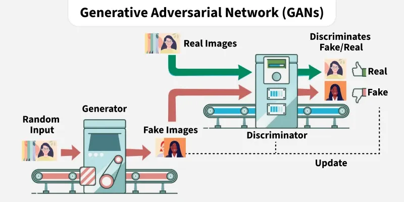

Generative Adversarial Networks (GANs) consist of two models—a generator and a discriminator that compete with each other. The generator creates synthetic data, while the discriminator distinguishes between real and fake data.

#### Architecture of GAN

1. Generator Model

   The generator is a deep neural network that takes random noise as input to generate realistic data samples like images or text. It learns the underlying data patterns by adjusting its internal parameters during training through backpropagation. Its objective is to produce samples that the discriminator classifies as real.

   Generator Loss Function: The generator tries to minimize this loss:
   $$
   J_{G} = -\frac{1}{m} \Sigma^m _{i=1} log D(G(z_{i}))
   $$
   where:

   - $J_G$ measure how well the generator is fooling the discriminator.
   - $G(z_i)$ is the generated sample from random noise $z_i$.
   - $D(G(z_i))$ is the discriminator’s estimated probability that the generated sample is real.

   The generator aims to maximize $D(G(z_i))$, meaning it wants the discriminator to classify its fake data as real (probability close to 1).

2. Discriminator Model

   The discriminator is a binary classifier that distinguishes real data from generated samples. Through training, it refines its parameters to improve detection of fake data and when working with images, it uses convolutional layers to extract features and enhance classification accuracy.

   Discriminator Loss Function: The discriminator tries to minimize this loss:
   $$
   J_{D} = -\frac{1}{m} \Sigma_{i=1}^m log\; D(x_{i}) - \frac{1}{m}\Sigma_{i=1}^m log(1 - D(G(z_{i}))
   $$
   where:

   - $J_D$ measures how well the discriminator classifies real and fake samples.
   - $x_{i}$ is a real data sample.
   - $G(z_{i})$ is a fake sample from the generator.
   - $D(x_{i})$ is the discriminator’s probability that $x_{i}$ is real.
   - $D(G(z_{i}))$ is the discriminator’s probability that the fake sample is real.

   The discriminator wants to correctly classify real data as real (maximize log $D(x_{i})$ and fake data as fake (maximize $\log(1 - D(G(z_{i}))$)

3. MinMax Loss

   GANs are trained using a MinMax Loss between the generator and discriminator:
   $$
   min_{G}\;max_{D}(G,D) = [\mathbb{E}_{x∼p_{data}}[log\;D(x)] + \mathbb{E}_{z∼p_{z}(z)}[log(1 - D(g(z)))]
   $$
   where:

   - $G$ is a generator network and is $D$ is the discriminator network.
   - $p_{data}(x)$: true data distribution.
   - $p_z(z)$: distribution of random noise (usually normal or uniform).
   - $D(x)$: discriminator’s estimate of real data.
   - $D(G(z))$: discriminator’s estimate of generated data.

#### GAN Workflow

GAN train by having two networks the Generator (G) and the Discriminator (D) compete and improve together. Here's the step-by-step process:

1. Generator's First Move
2. DIscriminator's Turn
3. Adversarial Learning
4. Generator's Improvement
5. Discriminator's Adaptation
6. Training Progression

#### Vanilla GAN

Vanilla GAN is the simplest type of GAN. It consists of:

- A generator and a discriminator both are built using multi-layer perceptrons (MLPs).
- The model optimizes its mathematical formulation using stochastic gradient descent (SGD).

While foundational, Vanilla GAN can face problems like:

- Generator produces limited types of outputs repeatedly.
- Generator and discriminator may not improve smoothly.

#### Conditional GAN (CGAN)

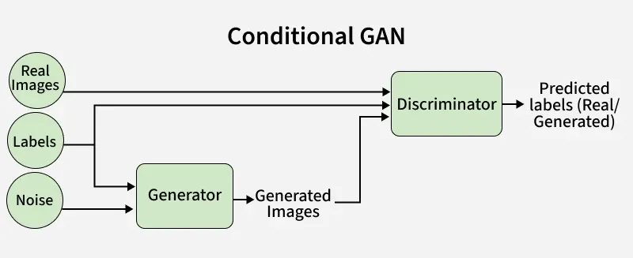

Conditional GAN (CGAN) adds an additional conditional parameter to guide the generation process. Instead of generating data randomly they allow the model to produce specific types of outputs.

Working of CGANs:

- A conditional variable (y) is fed into both the generator and the discriminator.
- This ensures that the generator creates data corresponding to the given condition (e.g generating images of specific objects).
- The discriminator also receives the labels to help distinguish between real and fake data.

Architecture of GAN:

1. Generator in CGANs

   The generator creates synthetic data such as images, text, or videos using two inputs

   *Inputs*:

   - *Random Noise (z)*: A vector of random values that adds diversity to generated outputs.
   - *Conditioning Information (y)*: Extra data like labels or context that guides what the generator produces for example a class label such as "cat" or "dog".

   *Working*: The generator combines z*z* and y*y* to create realistic data matching the given condition.

2. Discriminator in CGANs

   The discriminator determines whether the input data is real or generated while also checking if it matches the given condition.

   *Inputs*:

   - *Real Data (x)*: Actual samples from the dataset.
   - *Conditioning Information (y)*: The same condition given to the generator.

   *Working*: The discriminator learns to verify both

   - Whether the data is real or fake
   - Whether it correctly matches the condition

3. Interaction Between Generator and Discriminator

   The generator and discriminator train together in a competitive process.

   - *Generator Goal*: Generate fake data that appears real to the discriminator
   - *Discriminator Goal*: Correctly distinguish between real and fake data using the condition

4. Loss Function and Training

   The training process is guided by the adversarial loss function:
   $$
   min_{G}max_{D}V(D, G) = \mathbb{E}_{x \sim p_{data}}(x)[\log D(x|y)] + \mathbb{E}_{z \sim p_{z}}[\log (1 - D(G(z | y)))]
   $$

   - The first term encourages the discriminator to classify real samples correctly.
   - The second term pushes the generator to produce samples that the discriminator classifies as real.

   Here $\mathbb{E}$ represents the expected value $P_{data}$ is the real data distribution and $p_z$ is the prior noise distribution.

#### Deep Convolutional GAN (DCGAN)

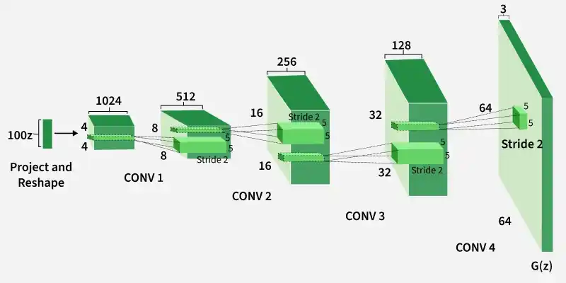

Deep Convolutional GAN (DCGAN) are among the most popular types of GANs used for image generation.

They are important because they:

- Uses Convolutional Neural Networks (CNNs) instead of simple multi-layer perceptrons (MLPs).
- Max pooling layers are replaced with convolutional stride helps in making the model more efficient.
- Fully connected layers are removed, which allows for better spatial understanding of images.

DCGANs are successful because they generate high-quality, realistic images.

#### Laplacian Pyramid GAN (LAPGAN)

Laplacian Pyramid GAN (LAPGAN) is designed to generate ultra-high-quality images by using a multi-resolution approach.

Working of LAPGAN:

- Uses multiple generator-discriminator pairs at different levels of the Laplacian pyramid.
- Images are first down sampled at each layer of the pyramid and upscaled again using Conditional GAN (CGAN).
- This process allows the image to gradually refine details and helps in reducing noise and improving clarity.

Due to its ability to generate highly detailed images, LAPGAN is considered a superior approach for photorealistic image generation.

#### Super Resolution GAN (SRGAN)

Super-Resolution GAN (SRGAN) is designed to increase the resolution of low-quality images while preserving details.

Working of SRGAN:

- Uses a deep neural network combined with an adversarial loss function.
- Enhances low-resolution images by adding finer details helps in making them appear sharper and more realistic.
- Helps to reduce common image upscaling errors such as blurriness and pixelation.

#### Cycle Generative Adversarial Network (CycleGAN)

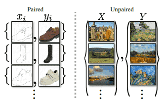

CycleGAN is a GAN architecture used for image-to-image translation without requiring paired training data. It uses two generators and two discriminators to transform images between domains and reconstruct the original image using cycle consistency loss.

Architecture of CycleGAN:

1. Generators

   Create new images in the target style.

   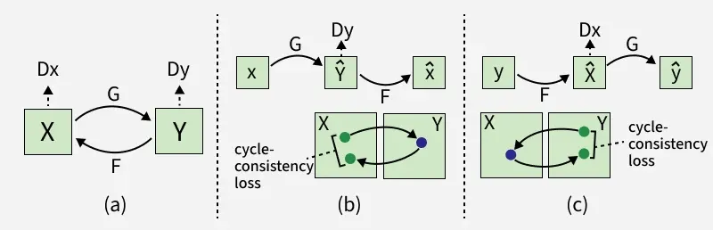

   CycleGAN has two generators $G$ and $F$:

   - $G$ transforms images from domain $X$ like photos to domain $Y$ like artwork.
   - $F$ transforms images from domain $Y$ back to domain $X$.

   The generator mapping functions are as follows:
   $$
   G: X \rightarrow Y \\
   F: Y \rightarrow X
   $$
   where $X$ is the input image distribution and $Y$ is the desired output distribution such as Van Gogh styles.

2. Discriminators

   Decide if images are real (from dataset) or fake (generated). There are two discriminators $D_x$ and $D_{\gamma}$.

   - $D_x$ distinguishes between real images from $X$ and generated images from $F(y)$.
   - $D_y$ distinguishes between real images from $Y$ and generated images from $G(x)$.

Cycle Consistency Loss:

1. Forward Cycle Consistency Loss

   Ensures that when we apply $G$ and then $F$ to an image we get back the original image.

   For example: $x \rightarrow G(x) \rightarrow F(G(x)) \approx x$

   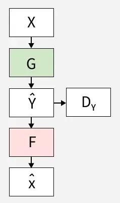

2. Backward Cycle Consistency Loss

   Ensures that when we apply $F$ and then $G$ to an image we get back the original image.

   For example: $x \underrightarrow{G} G(x) \underrightarrow{F} F(G(x)) \approx x$

   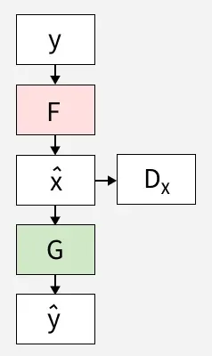

Cost Function:

1. Adversarial Loss

   Adversarial loss helps generators produce realistic images that can fool the discriminators.
   $$
   Loss_{advers}(G, D_y, X, Y) = \frac{1}{m}\sum(1 - D_y(G(x)))^{2} \\
   Loss_{advers}(F, D_x, Y, X) = \frac{1}{m}\sum(1 - D_x(F(y)))^{2}
   $$

   - Encourages generators to create realistic images
   - Helps discriminators distinguish real and fake images

2. Cycle Consistency Loss

   Cycle consistency loss ensures that translating an image to another domain and back reconstructs the original image.

   - Preserves important image content during translation
   - Ensures meaningful reversible mappings between domains

   $$
   Loss_{cyc}(G, F, X, Y) = \frac{1}{m}[(F(G(x_i)) - x_i) + (G(F(y_i)) - y_i)]
   $$

   The Cost function we used is the sum of adversarial loss and cyclic consistent loss:
   $$
   L(G, F, D_x, D_y) = L_{advers}(G, D_y, X, Y) + L_{advers}(F, D_x, Y, X) + \gamma L_{cycl}(G, F, X, Y)
   $$
   and our aim is:
   $$
   \underset{G, F\ D_x, D_y}{argminmax} L(G, F, D_x, D_y)
   $$

#### Super Resolution GAN (SRGAN)

Super-Resolution Generative Adversarial Networks (SRGANs) are used for image upscaling by converting low-resolution images into sharper and more realistic high-resolution images while preserving important textures and details.

SRGAN follows the GAN framework using two neural networks, a generator and a discriminator. The generator converts low-resolution images into super-resolution images, while the discriminator distinguishes between real high-resolution images and generated images.

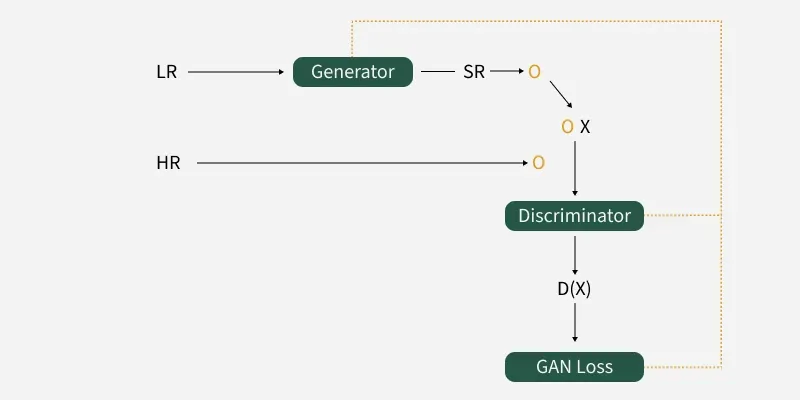

- Generator Architecture

  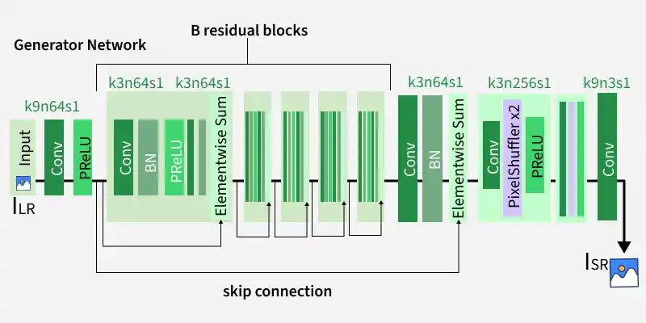

  The SRGAN generator uses a Residual Network (ResNet) architecture to generate high-resolution images effectively. Residual connections help improve gradient flow and support deeper network training.

- Discriminator Architecture

  

  The discriminator uses multiple convolutional layers to distinguish between real high-resolution images and generated images.

SRGAN uses a perceptual loss function that combines content loss and adversarial loss to improve both image quality and realism:

- Content Loss

  Traditional super-resolution methods typically use Mean Squared Error (MSE) as the content loss, which measures pixel-wise differences between generated and target images. However, MSE tends to produce overly smooth images because it averages over all possible high-resolution images that could relate to a given low-resolution input.
  $$
  l_{VGG/i,j}^{SR} = \frac{1}{W_{i,j}H_{i,j}} \sum_{x = 1}^{W_{i,j}} \sum_{y = 1}^{H_{i,j}}((\phi_{i,j}(I^{HR})_{x,y} - \phi_{i,j}(G_{\theta_{G}}(I^{LR}))_{x,y})^{2})
  $$

  - $l_{VGG/i,j}^{SR}$: Perceptual (VGG) loss at layer $(i, j)$.
  - $W_{i,j}H_{i,j}$: Width and height of the VGG feature map, used for normalization.
  - $\phi_{i,j}$: Feature map extracted from layer $(i,j)$ of the pre-trained VGG network.
  - $I^{HR}$: Ground-truth high-resolution image.
  - $I^{LR}$: Low-resolution input image.
  - $G_{\theta_{G}}(I^{LR})$: Super-resolved output image generated by the generator GGG.
  - $(x, y)$: Spatial position in the feature map.

- Adversarial Loss

  Adversarial loss encourages the generator to produce images that appear realistic to the discriminator.
  $$
  l_{Gen}^{SR} = \sum_{n = 1}^{N} - \log D_{\theta_{D}}(G_{\theta_{G}}(I^{LR}))
  $$

  - $l_{Gen}^{SR}$: Adversarial (generator) loss for super-resolution.
  - $N$: Total number of training samples.
  - $G_{\theta_{G}}(I^{LR})$: Super-resolved image generated by the generator GGG using low-resolution input $I^{LR}$.
  - $D_{\theta_{D}}(\cdot)$: Discriminator’s probability that the input image is real.
  - $-\log D_{\theta_{D}}(G_{\theta_{G}}(I^{LR}))$: Penalizes the generator if the discriminator easily detects the fake image.

- Total Loss - Perceptual loss
  $$
  l^{SR} = l_{X}^{SR} + 10^{-3}l_{Gen}^{SR}
  $$

  - $l^{SR}$: Overall super-resolution loss.
  - $l_{X}^{SR}$: Content loss (often based on VGG perceptual loss).
  - $l_{Gen}^{SR}$: Adversarial loss from the generator.

#### Style Generative Adversarial Networks (StyleGAN)

StyleGAN is a generative model developed by NVIDIA that produces highly realistic images by controlling image features at multiple levels, from overall structure to fine details such as texture and lighting. Unlike traditional GANs, StyleGAN separates style from content, allowing precise control over the appearance of generated images.

StyleGAN improves traditional GAN architecture by modifying the generator to achieve better control over image features and higher image quality:

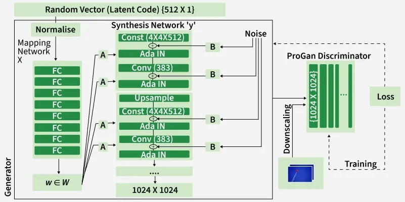

- Progressive Growing of Images

  StyleGAN starts training with low-resolution images and gradually increases the resolution up to 1024×1024. This stabilizes training and helps the model learn coarse structures before fine details.

- Bi-linear Sampling

  StyleGAN uses bi-linear sampling instead of nearest-neighbor sampling for resizing feature maps, producing smoother transitions and reducing artifacts.

- Mapping Network and Style Network

  Inplace of feeding a random latent vector $z$ into the generator, it first passes it through an 8-layer fully connected network.

  The input to the AdaIN is $y = (y_s, y_b)$ which is generated by applying ($A$) to ($w$). AdaIN operation is defined by the following equation:
  $$
  AdaIN(x_i, y) = y_{s,i}((x_i - \mu_{i}) / \sigma_{i}) + y_{b,i}
  $$
  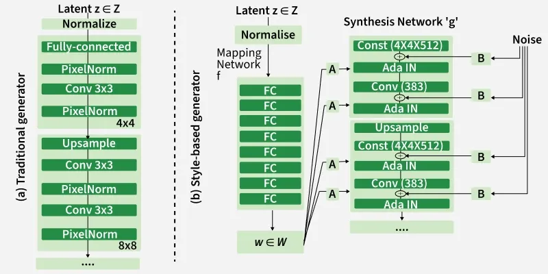

  where each feature map $x$ is normalized separately and then scaled and biased using the corresponding scalar components from style $y$. Thus the dimensional of $y$ is twice the number of feature maps $(x)$ on that layer. The synthesis network contains 18 convolutional layers 2 for each of the resolutions (4x4 - 1024x1024).

- Constant Input and Noise Injection

  StyleGAN uses a learned constant tensor instead of random noise as the generator input. Gaussian noise is added at each layer to create realistic random details such as freckles, wrinkles, and hair variations.

- Mixing Regularization

  Two latent vectors are mixed during training so different layers receive different styles. This improves feature diversity and robustness.

- Style Control at Different Resolutions

  StyleGAN’s synthesis network controls image style at different resolutions each affecting different aspects of the image.

- Feature Disentanglement

  To understand how well it separates features, two key metrics are used:

  - *Perceptual Path Length:* Measures how smooth the transition between two generated images is when interpolating between their latent vectors. Shorter path length shows smoother changes.
  - *Linear Separability*: Tests whether certain features like gender, age, etc and can be separated using a simple linear classifier in the latent space which shows how well features are disentangled .

### Autoencoder

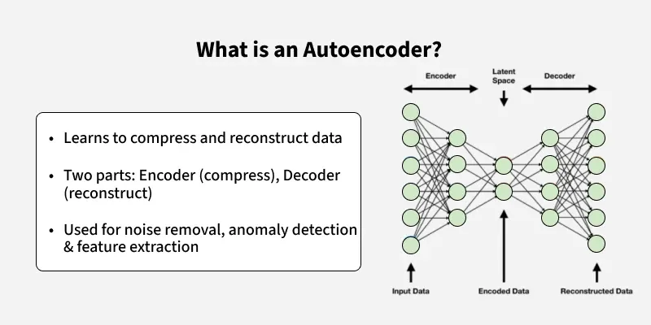

An autoencoder is a type of neural network architecture designed to efficiently compress (encode) input data down to its essential features, then reconstruct (decode) the original input from this compressed representation.

#### Architecture of Autoencoder

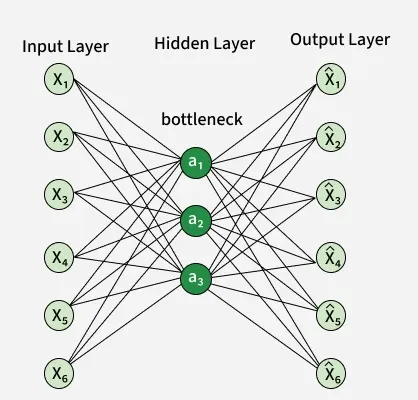

- Encoder

  It compress the input data into a smaller, more manageable form by reducing its dimensionality while preserving important information. It has three layers which are:

  1. Input Layer
  2. Hidden Layers
  3. Output (Latent Space)

- Bottleneck (Latent Space)

  The bottleneck is the smallest layer in the network that holds a compressed representation of the input data. It forces the model to keep only the most important features, helping it learn key patterns and improve generalization.

- Decoder

  It is responsible for taking the compressed representation from the latent space and reconstructing it back into the original data form:

  1. Hidden Layers: Progressively expand the latent vector back into a higher-dimensional space. Through successive transformations decoder attempts to restore the original data shape and details
  2. Output Layer: Produces the reconstructed output which aims to closely resemble the original input. The quality of reconstruction depends on how well the encoder-decoder pair can minimize the difference between the input and output during training.

#### Loss Function in Autoencoder Training

During training an autoencoder’s goal is to minimize the reconstruction loss which measures how different the reconstructed output is from the original input. The choice of loss function depends on the type of data being processed:

- Mean Squared Error (MSE)

  Commonly used for continuous data. It measures the average squared differences between the input and the reconstructed data.

- Binary Cross-Entropy

  Used for binary data (0 or 1 values). It calculates the difference in probability between the original and reconstructed output.

#### Efficient Representation in Autoencoders

Autoencoders learn compact and meaningful representations by applying constraints during training. After training, the encoder can be used to generate efficient feature representations for similar data.

- Small Hidden Layers: Forces the network to focus on important features and reduce redundancy
- Regularization: Uses L1 or L2 penalties to prevent overfitting and improve generalization
- Denoising: Adds noise during training so the model learns robust, noise-free features
- Activation Function Tuning: Promotes sparsity by activating only relevant neurons, reducing complexity

#### Denoising Autoencoder

Autoencoders are neural networks for unsupervised learning that compress input data into a low-dimensional space (using an encoder) and then reconstruct it (using a decoder), training the network to minimize the reconstruction error between the original input and its reconstructed output. If the hidden layer is too large, autoencoders may simply learn to replicate the input perfectly, functioning as an identity mapping and failing to extract meaningful features.

Architecture of The denoising autoencoder (DAE):

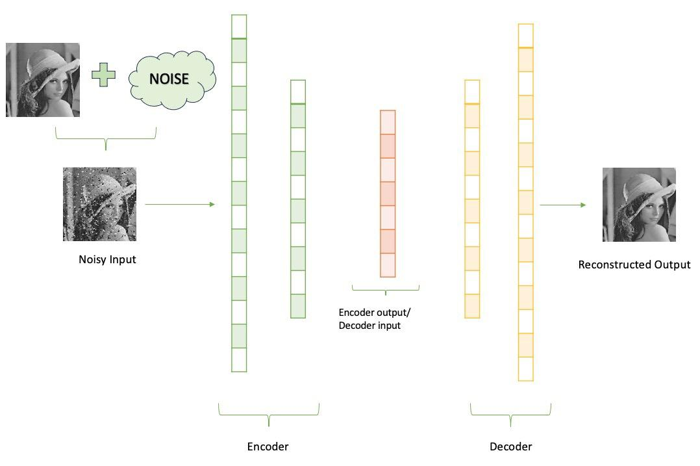

- Encoder

  A neural network (one or more layers) that transforms noisy input data into a lower-dimensional encoding. Noise can be introduced by adding Gaussian noise or randomly masking/missing some inputs.

- Decoder

  A neural network (one or more layers) that reconstructs the original data from the encoding. The loss is calculated between the decoder’s output and the original clean input, not the noisy one.

#### Sparse Autoencoder

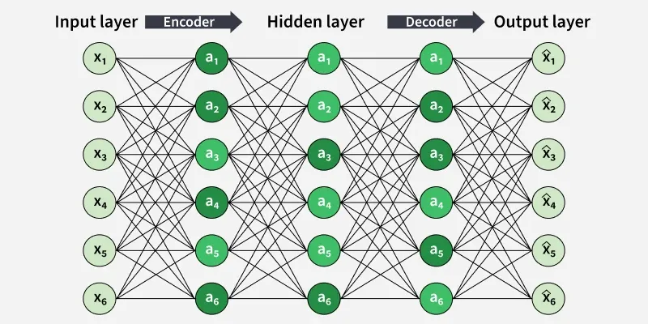

Sparse Autoencoders play an important role in deep learning. They are a special type of autoencoder that introduces a sparsity constraint on the hidden layer, forcing only a few neurons to activate at a time.

Sparse autoencoders combine an encoder, decoder and sparsity constrained loss function to learn compact meaningful representations. The loss function used is:
$$
L = ||X - \hat{X}||^{2} + \lambda \cdot Penalty(s)
$$
where:

- $X$: Input data
- $\hat{X}$: Reconstructed output
- $\lambda$: Regularization parameter
- $Penalty(s)$: A function penalizing deviations from sparsity

Training a sparse autoencoder follows the same workflow as a standard autoencoder but includes an additional step to enforce sparsity on the hidden layer:

1. Initialization: The network weights are initialized randomly or using pre-trained models to provide a stable starting point.

2. Forward Pass: Input data is passed through the encoder to obtain the latent (compressed) representation and then through the decoder to reconstruct the original input.

3. Loss Calculation: The total loss combines:

- Reconstruction error: MSE between $X$ and $\hat{X}$
- Sparsity penalty: Uses KL Divergence or L1 regularization to keep most hidden units inactive.

4. Backpropagation and Optimization: Gradients are computed from the combined loss and used to update the network weights, ensuring the model learns both accurate reconstruction and sparse feature representations.

#### Variational AutoEncoders (VAEs)

Variational Autoencoders (VAEs) are generative models that learn a smooth, probabilistic latent space, allowing them not only to compress and reconstruct data but also to generate entirely new, realistic samples. VAEs capture the underlying structure of a dataset and produce outputs that closely resemble the original data.

Architecture of Variational Autoencoder:

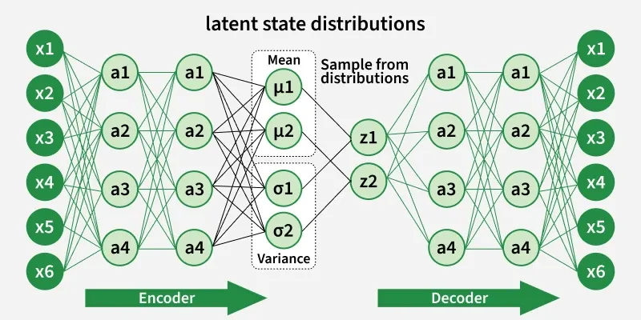

- Encoder (Understanding the Input)

  The encoder takes input data like images or text and learns its key features. Instead of outputting one fixed value, it produces two vectors for each feature:

  - $Mean (\mu)$ A central value representing the data.
  - $Standard Deviation(\sigma)$: It is a measure of how much the values can vary.

  These two values define a range of possibilities instead of a single number.

- Latent Space (Adding Some Randomness)

  Instead of encoding the input as one fixed point it pick a random point within the range given by the mean and standard deviation. This randomness lets the model create slightly different versions of data which is useful for generating new, realistic samples.

- Decoder (Reconstructing or Creating New Data)

  The decoder takes a random sample from the latent space and tries to reconstruct the original input. Since the encoder gives a range, the decoder can produce new data that is similar but not identical to what it has seen.

Suppose we have a distribution $z$ and we want to generate the observation $x$ from it.  In other words we want to calculate $p(z | x)$ We can do it by following way:
$$
p(z|x) = \frac{p(x|z)p(z)}{p(x)}
$$
But, the calculation of $p(x)$ can be difficult:
$$
p(x) = \int p(x|z)p(z)dz
$$
This usually makes it an intractable distribution. Hence, we need to approximate $p(z|x)$ to $q(z|x)$ to make it a tractable distribution. To better approximate $p(z|x)$ to $q(z|x)$ we will minimize the KL-divergence loss which calculates how similar two distributions are:
$$
\text{min } KL(q(z|x)||p(z|x))
$$
By simplifying the above minimization problem is equivalent to the following maximization problem :
$$
E_{q(z|x)} \log p(x | z) - KL(q(z|x)||p(z))
$$
The first term represents the reconstruction likelihood and the other term ensures that our learned distribution $q$ is similar to the true prior distribution $p$. Thus our total loss consists of two terms one is reconstruction error and other is KL divergence loss:
$$
Loss = L(x, \hat{x}) + \sum_{j}KL(q_j(z|x)||p(z))
$$

### Transformer Networks

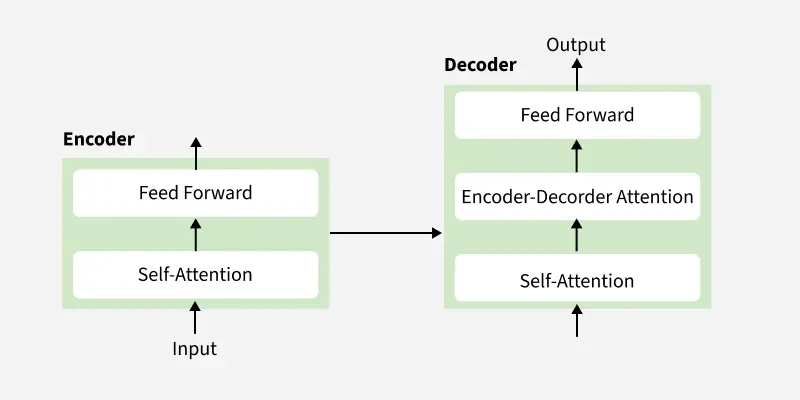

Transformer Networks do this by way of a self-attention mechanism, which results in a parallel process used for making the tokenization inputs faster and thus improved capturing of long-range dependencies.

### Siamese Neural Networks

A `Siamese Neural Network (SNN)` is a type of neural network architecture specifically designed to compare two inputs and determine their similarity. The network consists of two identical subnetworks that process the inputs independently but in parallel. The outputs of these subnetworks are then compared using a distance metric, allowing the network to learn whether the inputs are similar or dissimilar. SNNs are particularly useful in tasks where pairwise comparison is needed, such as in face recognition, signature verification, and one-shot learning.

#### Key Features of Siamese Neural Network

1. Identical Sub-networks

   A defining characteristic of Siamese Neural Networks is the use of identical subnetworks for processing each input. These subnetworks have the same architecture and parameters, ensuring that both inputs are transformed in the same way. This symmetry is crucial for learning meaningful comparisons between the inputs.

2. Shared Weights

   The identical subnetworks in an SNN share the same weights. This weight sharing ensures that the network learns consistent features from both inputs, maintaining the integrity of the comparison process. By sharing weights, the network effectively reduces the number of parameters, which helps in preventing overfitting and improves generalization.

3. Learning Similarity

   SNNs are designed to learn a similarity function that can distinguish between similar and dissimilar pairs. The network outputs a feature vector for each input, and the similarity between these vectors is calculated using a distance metric, such as Euclidean distance or cosine similarity. During training, the network adjusts its weights to minimize the distance for similar pairs and maximize the distance for dissimilar pairs.

4. Contrastive Loss

   Contrastive loss is a common loss function used in training Siamese Neural Networks. It is designed to minimize the distance between the outputs of similar pairs and maximize the distance between the outputs of dissimilar pairs.

   The contrastive loss function is defined as:
   $$
   L = \frac{1}{2}((1 - y)D^2 + y \text{ max }(0, m - D)^2)
   $$
   where $y$ is the label indicating whether the inputs are similar (0) or dissimilar (1), D is the distance between the feature vectors of the two inputs, and $m$ is a margin parameter that defines the minimum distance for dissimilar pairs.

#### Architecture of Siamese Neural Networks

1. Input Pairs and Processing

   In a Siamese Neural Network (SNN), the input consists of pairs of data points. Each pair is processed independently by two identical subnetworks, which are designed to extract meaningful features from the inputs.

2. Feature Extraction

   The identical subnetworks, also known as twin networks, are responsible for feature extraction. These subnetworks typically consist of convolutional layers (for images) or recurrent layers (for sequential data), followed by fully connected layers. The extracted features from each subnetwork are represented as high-dimensional vectors, often referred to as embeddings. These embeddings capture the essential characteristics of the inputs.

3. Comparison using Similarity Functions

   After feature extraction, the SNN compares the embeddings using a similarity function. This function quantifies how similar or dissimilar the inputs are, based on their feature representations. Two common similarity functions are Euclidean distance and cosine similarity.

4. Euclidean Distance

   The Euclidean distance measures the straight-line distance between two points in the embedding space.

   It is calculated as follows:
   $$
   D(x_1, x_2) = \sqrt{\sum (x_{1i} - x_{2i})^2}
   $$
   where $x_1$ and $x_2$ are the feature vectors of the two inputs. A smaller Euclidean distance indicates greater similarity between the inputs.

5. Cosine Similarity

   Cosine similarity measures the cosine of the angle between two vectors in the embedding space. It is calculated as follows:
   $$
   \text{cosine similarity}(x_1, x_2)= \frac{x_1 x_2}{||x_1|| \cdot ||x_2||}
   $$
   where $x_1 \cdot x_2$ is the dot product of the vectors, and $||x_1||$ and $||x_2||$ are their magnitudes. A cosine similarity close to 1 indicates that the vectors are aligned and thus similar.

### Capsule Networks (CapsNet)

A Capsule Neural Network (CapsNet) is an artificial neural network (ANN) in machine learning designed to emulate hierarchical relationships, drawing inspiration from the organizational principles of biological neural structures. CapsNets seek to replicate the hierarchical organization observed in biological neural systems.

#### Working of a Capsule Network

Capsules go through more steps:

1. Input vectors multiply with spatial-relationship-encoded weight matrices
2. Further multiplication with weights
3. Weighted sum of input vectors
4. Activation function application for vector output.

#### Architecture of Capsule Network

A kind of neural network architecture known as a capsule network (CapsNet) was created to get around some of the drawbacks of conventional convolutional neural networks (CNNs), particularly with regard to managing hierarchical relationships and perspective fluctuations. Capsule Networks' architecture is made up of various essential elements:

1. Encoder Network

   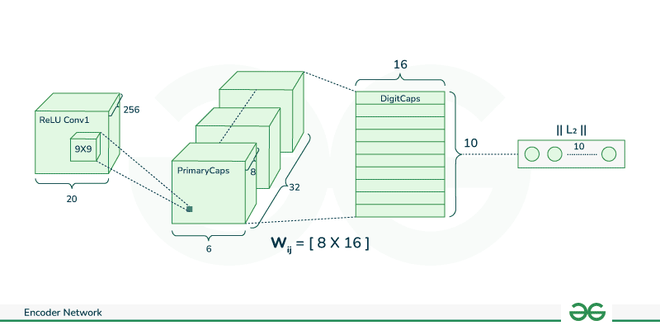

   It takes the image input and displays the image as a vector that contains all the instantiation parameters needed to render the image. Encoder further encapsulates the :

   - Convolutional layer

     A convolutional layer is frequently used at the start of a CapsNet to extract low-level features from the input photos.

   - PrimaryCaps layer

     This layer uses clusters of neurons known as capsules to record significant patterns. Every capsule in the input represents an instantiation parameter (like posture) of a certain kind of creature.

   - DigitCaps layer

     The center of CapsNets is the DigitCaps layer. In this layer, each capsule stands for a certain kind of thing (such a class of digits). The instantiation parameters and the likelihood that the entity will exist are both encoded in these capsules.

   Here is the loss equation:
   $$
   L_{k} = T_{k} max(0, m^{+} - ||v_k||)^2 + \lambda(1 - T_k)max(0, ||v_k|| - m^{-})^2
   $$
   where:

   - $L_k$ is the margin loss for the k-th digit capsule.
   - $T_k$ is a binary indicator.
   - $v_k$ is the activity vector of the k-th digit capsule.
   - $||v_k||$ is length of the activity vector.
   - $m^{+}$ is the positive margin.
   - $m^{-}$ is the negative margin.
   - $\lambda$ is a down-weighting factor for the loss from incorrect digit capsules.

2. Decoder Network

   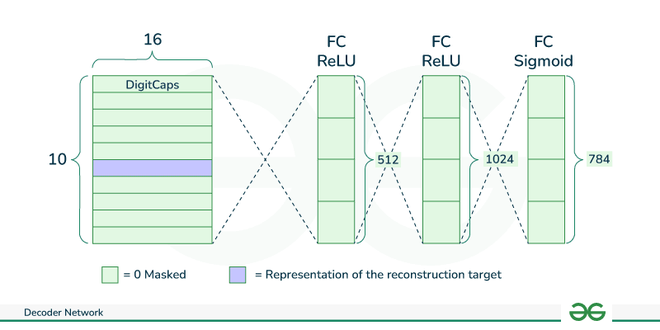
   
   In Capsule Networks, the Decoder Network is essential for recreating input images from the data contained in the DigitCapsules. The instantiation properties (such as pose and viewpoint) of the chosen DigitCapsules are utilized to rebuild the input data in the Capsule Network following the dynamic routing procedure.

### Spiking Neural Networks (SNN)

Spiking Neural Networks (SNNs) are brain-inspired neural networks that process information using discrete signals called spikes instead of continuous values like traditional neural networks.

#### Key Concepts in Spiking Neural Networks

1. Neurons and Spikes

   Neurons communicate by generating spikes when their membrane potential reaches a threshold.

2. Temporal Coding

   In SNNs, the timing of spikes carries important information.

3. Synaptic Weights and Plasticity

   Connections between neurons are controlled by synaptic weights, which change during learning.

#### Spiking Neural Networks

1. Membrane Potential and Firing Threshold

   Neurons accumulate incoming spikes in their membrane potential and fire when the threshold is reached.

2. Synaptic Integration

   Incoming spikes influence connected neurons through weighted synaptic connections.

3. Learning Rules

   SNNs learn by adjusting synaptic weights based on spike timing.

4. Neuron Models

   Different neuron models are used to simulate spiking behavior.

### Contrastive Language-Image Pre-training (CLIP)

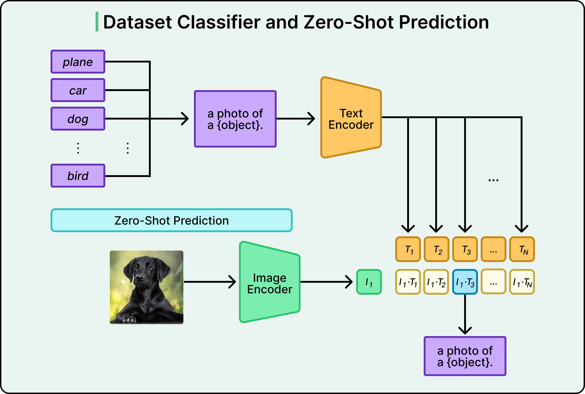

CLIP (Contrastive Language-Image Pre-training) is a neural network that connects vision and language. Released in January 2021, it can classify images into any categories you want without being specifically trained for that task. Just tell it what you’re looking for in plain English, and it can recognize it. This “zero-shot” capability makes CLIP different from almost every computer vision system that came before it.

---

## Mixed Precision

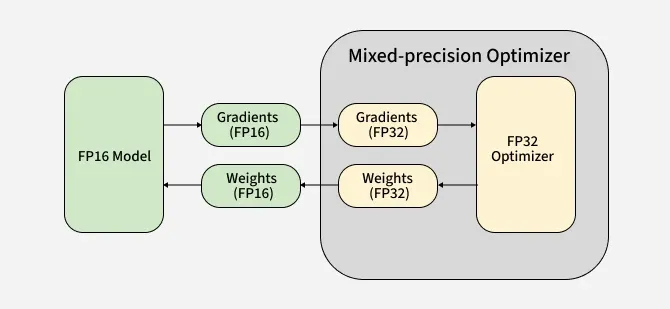

Mixed Precision Training is a deep learning optimization technique that uses both 16-bit (half precision) and 32-bit (single precision) floating point representations during model training. It is designed to reduce memory usage and speed up computation without significantly affecting model accuracy.

Mixed precision combines:

- Float32: for critical operations requiring high accuracy.
- Float16: for less sensitive operations where precision loss is acceptable.

Benefits:

1. Faster Training: Float16 operations execute faster on GPUs with specialized hardware (like NVIDIA Tensor Cores).
2. Lower Memory Usage: Reducing variable sizes from 32 bits to 16 bits nearly halves memory usage, enabling larger models or larger batch sizes.
3. Comparable Accuracy: When used with techniques like loss scaling, models trained with mixed precision perform similarly to full precision models.

---

## Perceptron

### Single Layer Perceptron (SLP)

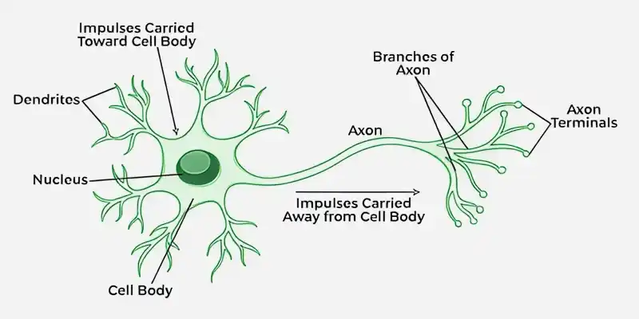

A `Single Layer Perceptron (SLP)` is inspired by biological neurons and their ability to process information. It is based on the concept of an artificial neuron, which acts as the basic building block of neural networks and processes inputs to produce an output.

### Multi-Layer Perceptron (MLP)

Multi-Layer Perceptron (MLP) consists of fully connected dense layers that transform input data from one dimension to another. It is called multi-layer because it contains an input layer, one or more hidden layers and an output layer. The purpose of an MLP is to model complex relationships between inputs and outputs.

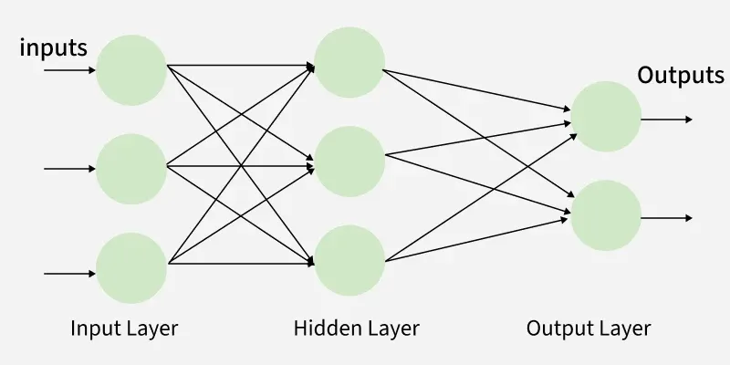

- Input Layer

  Each neuron or node in this layer corresponds to an input feature. For instance, if you have three input features the input layer will have three neurons.

- Hidden Layers

  MLP can have any number of hidden layers with each layer containing any number of nodes. These layers process the information received from the input layer.

- Output Layer

  The output layer generates the final prediction or result. If there are multiple outputs, the output layer will have a corresponding number of neurons.

#### Multi-Layer Perceptron Forward Propagation

1. Weighted Sum

   The neuron computes the weighted sum of the inputs:
   $$
   z = \sum_{i}w_i x_i + b
   $$
   where:

   - $x_i$ is the input feature.
   - $w_i$ is the corresponding weight.
   - $b$ is the bias term.

2. Activation Function

   The weighted sum $z$ is passed through an activation function to introduce non-linearity. Common activation functions include:

   - Sigmoid: $\sigma(z) = \frac{1}{1 + e^{-z}}$
   - ReLU (Rectified Linear Unit): $f(z) = max(0, z)$
   - Tanh (Hyperbolic Tangent): $tanh(z) = \frac{2}{1 + e^{-2z}} - 1$

#### Multi-Layer Perceptron Loss Function

Once the network generates an output the next step is to calculate the loss using a loss function. In supervised learning this compares the predicted output to the actual label.

For a classification problem the commonly used binary cross-entropy loss function is:
$$
L = \frac{1}{N}\sum_{i = 1}^{N}[y_i \log(\hat{y_i}) + (1 - y_i)\log(1 - \hat{y_i})]
$$
where:

- $y_i$ is the actual label.
- $\hat{y_i}$ is the predicted label.
- $N$ is the number of samples.

For regression problem the mean squared error (MSE) is often used:
$$
MSE = \frac{1}{N}\sum_{i = 1}^{N}(y_i - \hat{y_i})^2
$$

#### Multi-Layer Perceptron Backpropagation

The goal of training an MLP is to minimize the loss function by adjusting the network's weights and biases. This is achieved through backpropagation:

1. Gradient Calculation: The gradients of the loss function with respect to each weight and bias are calculated using the chain rule of calculus.
2. Error Propagation: The error is propagated back through the network, layer by layer.
3. Gradient Descent: The network updates the weights and biases by moving in the opposite direction of the gradient to reduce the loss: $w = w - \eta \cdot \frac{\partial L}{\partial w}$

where:

- $w$ is the weight.
- $\eta$ is the learning rate.
- $\frac{\partial L}{\partial w}$ is the gradient of the loss function with respect to the weight.

#### Multi-Layer Perceptron Optimization

MLPs rely on optimization algorithms to iteratively refine the weights and biases during training. Popular optimization methods include:

- Stochastic Gradient Descent (SGD): Updates the weights based on a single sample or a small batch of data: $w = w - \eta \cdot \frac{\partial L}{\partial w}$

- Adam Optimizer: An extension of SGD that incorporates momentum and adaptive learning rates for more efficient training:
  $$
  m_t = \beta_{1} m_{t - 1} + (1 - \beta_{1}) \cdot g_t \\
  v_t = \beta_{2} v_{t - 1} + (1 - \beta_{2}) \cdot g_{t}^{2}
  $$

Here $g_t$ represents the gradient at time $t$ and $\beta_{1}, \beta_{2}$ are decay rates.

---

## Activation Function

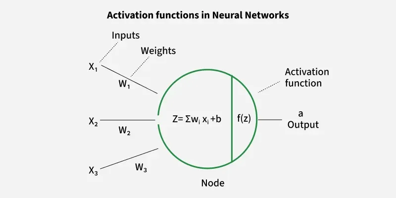

An activation function is applied to the weighted sum of inputs before producing the final output of a neuron. It introduces non-linearity, allowing the network to learn complex patterns.

### Linear Activation Function

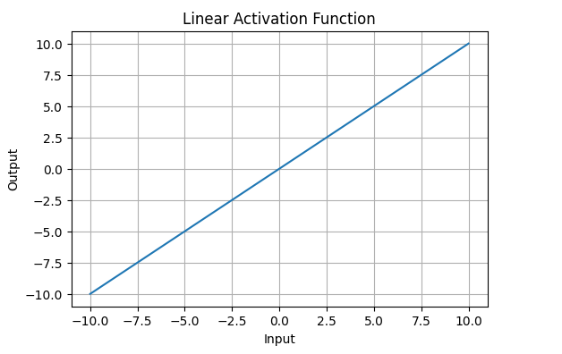

The Linear Activation Function resembles a straight line defined by $y = x$. No matter how many layers the neural network contains, if they all use linear activation functions, the output is a linear combination of the input.

### Non-Linear Activation Functions

#### Sigmoid Activation Function

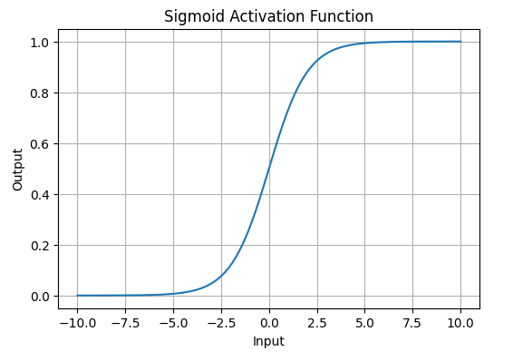

The Sigmoid Activation Function is characterized by an 'S' shape. It is mathematically defined as $A = \frac{1}{1 + e^{-x}}$. This formula ensures a smooth and continuous output that is essential for gradient-based optimization methods.

#### Tanh Activation Function

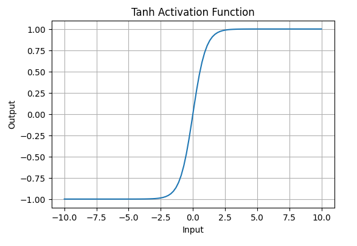

The Tanh function (hyperbolic tangent function) is a shifted version of the sigmoid, allowing it to stretch across the y-axis. It is defined as:
$$
f(x) = \tanh(x) = \frac{2}{1 + e^{-2x}} - 1
$$

- Outputs values from -1 to +1.
- Enables modeling of complex data patterns.
- Commonly used in hidden layers due to its zero-centered output, facilitating easier learning for subsequent layers.

#### ReLU (Rectified Linear Unit) Function

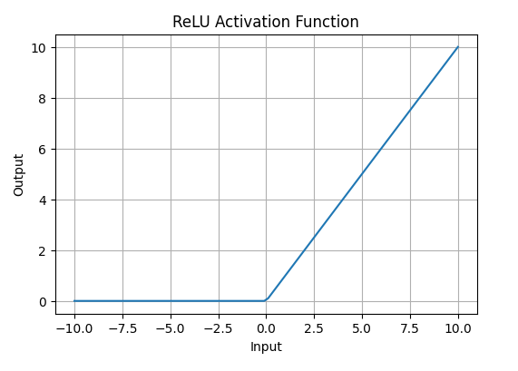

ReLU activation is defined by $A(x) = \max(0,x)$, this means that if the input x is positive, ReLU returns $x$, if the input is negative, it returns 0.

- Value Range is $[0, \infty)$, meaning the function only outputs non-negative values.
- Introduces non-linearity, enabling learning of complex patterns
- Computationally efficient due to simple operations
- Activates only positive neurons, making the network sparse and efficient
- Commonly used in hidden layers for faster training and better performance

#### Leaky ReLU

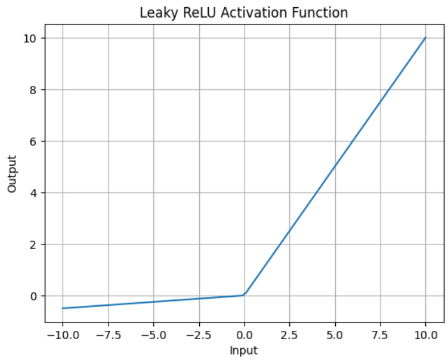
$$
f(x) = \begin{cases} x, & x > 0 \\ \alpha x, & x \leq 0 \end{cases}
$$

- Leaky ReLU is similar to ReLU but allows a small negative slope ($\alpha$, e.g., 0.01) instead of zero.
- Solves the “dying ReLU” problem, where neurons get stuck with zero outputs.
- Range: $(-\infty, \infty)$.
- Preferred in some cases for better gradient flow.

#### SoftPlus Function

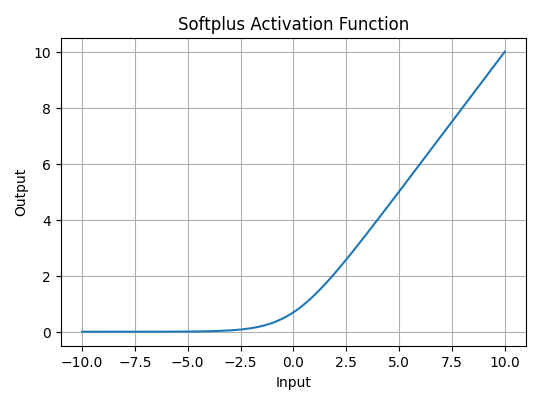

Softplus function is defined mathematically as: $A(x) = \log(1 + e^x)$. It is similar to ReLU but avoids sharp transitions by being fully differentiable.

### Exponential Linear Units

#### ELU (Exponential Linear Unit) Function

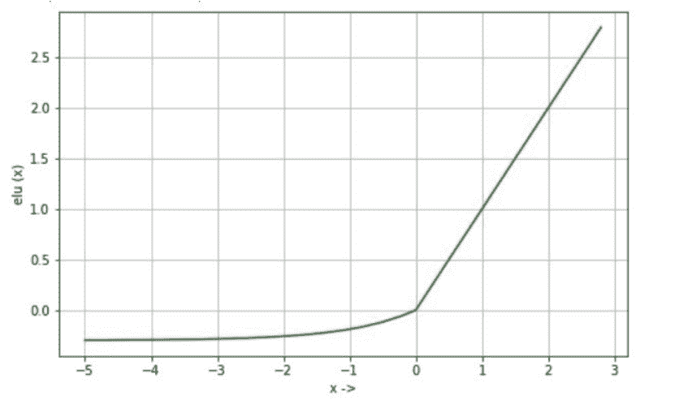

ELU (Exponential Linear Unit) is a non-linear activation function that improves learning speed and helps reduce the vanishing gradient problem. It behaves like ReLU for positive inputs but allows smooth negative values.
$$
f(x)=\begin{cases}x, & x>0 \\\alpha (e^{x}-1), & x \le 0\end{cases}
$$

- Output range is $(−\alpha, \infty)(-\alpha, \infty)(−\alpha, \infty)$
- Introduces non-linearity for learning complex patterns
- Allows negative outputs, helping maintain zero-centered activations
- Smooth and differentiable, supporting stable training

#### SELU (Scaled Exponential Linear Unit) Function

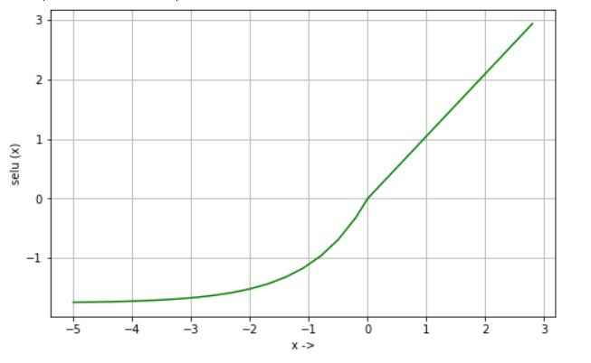

SELU is a scaled version of ELU designed for self-normalizing neural networks, helping maintain stable activations during training.
$$
f(x)=\lambda 
\begin{cases} 
x, & x>0 \\
\alpha (e^{x}-1), & x \le 0
\end{cases}
$$
where $\lambda \approx 1.05$ (scaling factor) and $a \approx 1.67$

- Output range is $(-\lambda\alpha, \infty)$
- Maintains near zero mean and unit variance (self-normalizing)
- Helps prevent vanishing and exploding gradients
- Works well in deep fully connected networks
- Can reduce the need for batch normalization in some cases

### Output Layer Activation Functions

#### Sigmoid Activation Function

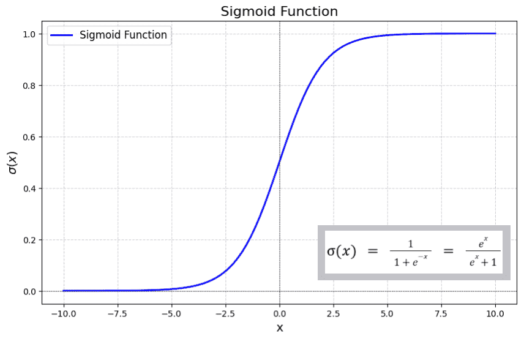

Sigmoid function produces an S-shaped curve and maps input values into a probability-like range between 0 and 1 and is used to find the final output of the neural network for binary classification problems. It is defined as:
$$
\sigma(x)=\frac{1}{1+e^{-x}}
$$

- Output range is (0,1)
- Produces probability-like outputs
- Commonly used in the output layer for binary classification
- Smooth and differentiable, useful for gradient-based learning

#### Softmax Function

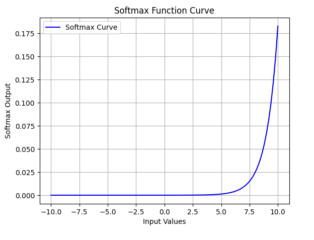

Softmax function is used for multi-class classification and converts raw output scores into probabilities for each class:

- Transforms outputs into values between 0 and 1
- Ensures all probabilities sum to 1
- Highlights the most likely class among multiple options
- Commonly used in the output layer for multi-class classification
- Helps interpret model outputs as probabilities

---

## Training and Evaluation of neural network

### Weight and Bias

Weights are numerical values that determine how much influence each input has on the output. They are adjusted during training to improve the model’s predictions.

Biases are additional parameters that shift the output of a neuron, helping the model learn patterns more effectively.

### Back Propagation

Backpropagation is an algorithm that trains neural networks by reducing prediction error. It works by propagating errors backward, computing gradients using the chain rule, and updating weights and biases to improve performance.

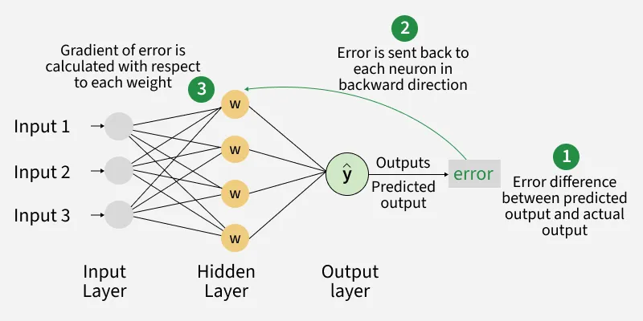

The Back Propagation algorithm involves two main steps:

1. Forward Pass Work

   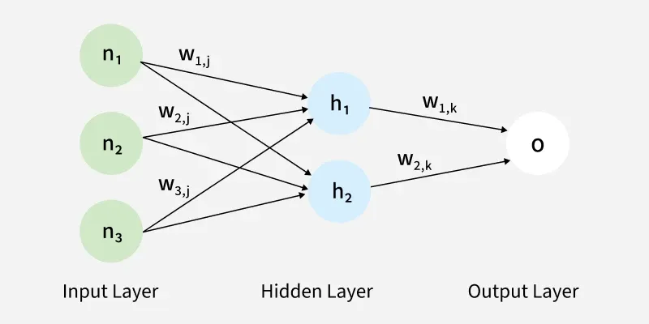

   In forward pass, input data moves through the network to generate an output.

2. Backward Pass

   In this step, the error between predicted and actual output is propagated backward to update weights and biases. Error is calculated (e.g., using Mean Squared Error):
   $$
   \text{MSE} = (\text{Predicted Output} - \text{Actual Output})^2
   $$

### Forward Propagation

Forward propagation is the initial phase of processing input data through the neural network to produce an output or prediction.

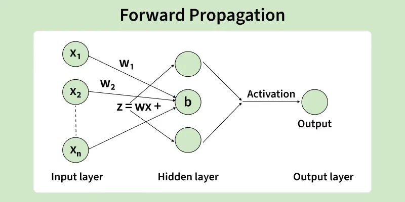

- Input Layer

  Receives raw data where each feature corresponds to a neuron. Data is often normalized or standardized before processing.

- Hidden layers

  The processed input passes through one or more hidden layers where most of the computation takes place. Each neuron performs a weighted sum of inputs and applies an activation function to capture non-linear patterns. The computation inside each neuron follows:
  $$
  Z = W \times X + b
  $$
  where:

  - $W$ represents the weights
  - $X$ is the input vector
  - $b$ is the bias term

  After this, an activation function such as ReLU or sigmoid is applied to produce the neuron’s output, which is then passed forward.

- Output Layer

  The final layer generates the model’s prediction. The choice of activation function depends on the task:

  - Softmax: multi-class classification
  - Sigmoid: binary classification
  - Linear: regression

- Predition

  The network produces its final output using current weights and biases, which is then evaluated against the true value.

  - Generates final prediction from the output layer
  - Compared with actual value using a loss function
  - Loss function calculates the error
  - Error is passed to backpropagation for weight updates

Consider a neural network with one input layer, two hidden layers and one output layer.

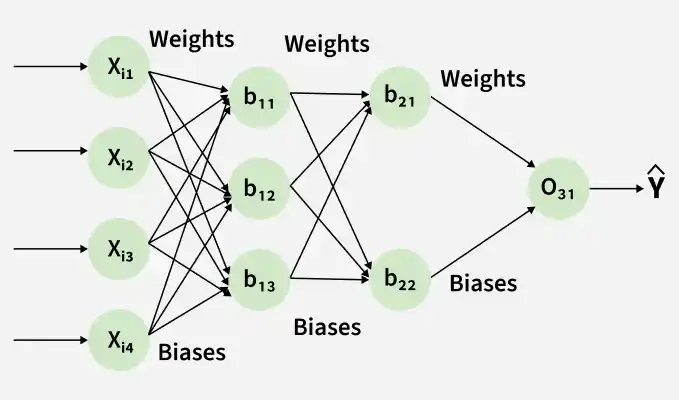

- Layer 1 (First Hidden Layer)

  The transformation is:
  $$
  A^{[1]} = \sigma(W^{[1]}X + b^{[1]})
  $$
  where:

  - $W^{[1]}$ is the weight matrix,
  - $X$ is the input vector,
  - $b^{[1]}$ is the bias vector,
  - $\sigma$ is the activation function.

- Layer 2 (Second Hidden Layer)

  We can have n number of hidden layers:
  $$
  A^{[n]} = \sigma(W^{[n]} A^{[n - 1]} + b^{[n]})
  $$

- Output Layer

  $Y = \sigma(W^{[3]}A^{[2]} + b^{[3]})$ where $Y$ is the final output. Thus the complete equation for forward propagation is:
  $$
  A^{[3]} = \sigma(\sigma(\sigma(XW^{[1]} + b^{[1]})W^{[2]} + b^{[2]})W^{[3]} + b^{[3]})
  $$
  This equation illustrates how data flows through the network:

  - Weights ($W$) determine the importance of each input
  - Biases ($b$) adjust activation thresholds
  - Activation functions ($\sigma$) introduce non-linearity to enable complex decision boundaries.

### Loss Function

A loss function measures how well a model’s predictions match the actual results by giving a numerical value for the error. A smaller value means better performance, and it guides the model during training.

#### Regression Loss Function

These are used when your model needs to predict a continuous number such as predicting the price of a product or age of a person. Popular regression loss functions are:

1. Mean Squared Error (MSE) Loss

   `Mean Squared Error (MSE) Loss` is one of the most widely used loss functions for regression tasks. It calculates the average of the squared differences between the predicted values and the actual values. It is simple to understand and sensitive to outliers because the errors are squared which can affect the loss.
   $$
   MSE = \frac{1}{n}\sum_{i = 1}^{n}(y_i - \hat{y_i})^2
   $$

2. Mean Absolute Error (MAE) Loss

   `Mean Absolute Error (MAE) Loss` is another commonly used loss function for regression. It calculates the average of the absolute differences between the predicted values and the actual values. It is less sensitive to outliers compared to MSE. But it is not differentiable at zero which can cause issues for some optimization algorithms.
   $$
   MAE = \frac{1}{n}\sum_{i = 1}^{n}|y_i - \hat{y_i}|
   $$

3. Huber Loss

   Huber Loss combines the advantages of MSE and MAE. It is less sensitive to outliers than MSE and differentiable everywhere unlike MAE. It requires tuning of the parameter $\sigma$. Huber Loss is defined as:
   $$
   \begin{cases}
   \frac{1}{2}(y_i - \hat{y_i})^2, &for |y_i|\\
   3n + 1, &if\  n\ is\ odd
   \end{cases}
   $$

#### Classification Loss Functions

Classification loss functions are used to evaluate how well a classification model's predictions match the actual class labels. There are different types of classification Loss functions:

1. Binary Cross-Entropy Loss (Log Loss)

   Binary Cross-Entropy Loss is also known as Log Loss and is used for binary classification problems. It measures the performance of a classification model whose output is a probability value between 0 and 1.
   $$
   \text{Binary Cross-Entropy} = -\frac{1}{n} \sum_{i = 1}^{n}[y_i \log(\hat{y_i}) + (1 - y_i)\log(1 - \hat{y_i})]
   $$
   where:

   - $n$ is the number of data points
   - $y_i$ is the actual binary label (0 or 1)
   - $\hat{y_i}$ is the predicted probability.

2. Categorical Cross-Entropy Loss

   Categorical Cross-Entropy Loss is used for multiclass classification problems. It measures the performance of a classification model whose output is a probability distribution over multiple classes.
   $$
   \text{Categorical Cross-Entropy} = -\sum_{i = 1}^{n} \sum_{j = 1}^{k} y_{ij}\log(\hat{y_{ij}})
   $$
   where:

   - $n$ is the number of data points
   - $k$ is the number of classes,
   - $y_{ij}$ is the binary indicator (0 or 1) if class label $j$ is the correct classification for data point i
   - $\hat{y_{ij}}$ is the predicted probability for class $j$.

3. Sparse Categorical Cross-Entropy Loss

   Sparse Categorical Cross-Entropy Loss is similar to Categorical Cross-Entropy Loss but is used when the target labels are integers instead of one-hot encoded vectors. It is efficient for large datasets with many classes.
   $$
   \text{Sparse Categorical Cross-Entropy} = -\sum_{i = 1}^{n}\log(\hat{y_{i, y_i}})
   $$
   where $y_i$ is the integer representing the correct class for data point $i$.

4. Kullback-Leibler Divergence Loss (KL Divergence)

   KL Divergence measures how one probability distribution diverges from a second expected probability distribution. It is often used in probabilistic models. It is sensitive to small differences in probability distributions.
   $$
   \text{KL Divergence} = \sum_{i = 1}^{n} \sum_{j = 1}^{k} y_{ij} \log(\frac{y_{ij}}{\hat{y_{ij}}})
   $$

5. Hinge Loss

   Hinge Loss is used for training classifiers, especially for support vector machines (SVMs). It is suitable for binary classification tasks as it is not differentiable at zero.
   $$
   \text{Hinge Loss} = \frac{1}{n} \sum_{i = 1}^{n} max(0, 1 - y_i \cdot \hat{y_i})
   $$
   where:

   - $y_i$ is the actual label (-1 or 1)
   - $\hat{y_i}$ is the predicted value.

#### Ranking Loss Functions

Ranking loss functions are used to evaluate models that predict the relative order of items. These are commonly used in tasks such as recommendation systems and information retrieval:

1. Contrastive Loss

   Contrastive Loss is used to learn embeddings such that similar items are closer in the embedding space while dissimilar items are farther apart. It is often used in Siamese networks.
   $$
   \text{Contrastive Loss} = \frac{1}{2N} \sum_{i = 1}^{N}(y_i \cdot d_{i}^{2} + (1 - y_i) \cdot max(0, m - d_i)^2)
   $$
   where:

   - $d_i$ is the distance between a pair of embeddings
   - $y_i$ is 1 for similar pairs and 0 for dissimilar pairs
   - $m$ is a margin.

2. Triplet Loss

   Triplet Loss is used to learn embeddings by comparing the relative distances between triplets: anchor, positive example and negative example.
   $$
   \text{Triplet Loss} = \frac{1}{N}\sum_{i = 1}^{N}[||f(x_{i}^{a}) - f(x_{i}^{p})||_{2}^{2} - ||f(x_{i}^{a}) - f(x_{i}^{n})||_{2}^{2} + \alpha]_{+}
   $$
   where:

   - $f(x)$ is the embedding function
   - $x_{i}^{a}$ is the anchor
   - $x_{i}^{p}$ is the positive example
   - $x_{i}^{n}$ is the negative example
   - $\alpha$ is a margin.

3. Margin Ranking Loss

   Margin Ranking Loss measures the relative distances between pairs of items and ensures that the correct ordering is maintained with a specified margin.
   $$
   \text{Margin Ranking Loss} = \frac{1}{N}\sum_{i = 1}^{N}max(0, -y_i \cdot (s_{i}^{+} - s_{i}^{-}) + margin)
   $$
   where:

   - $s_{i}^{+}$ and $s_{i}^{-}$ are the scores for the positive and negative samples
   - $y_i$ is the label indicating the correct ordering.

#### Image and Reconstruction Loss Functions

These loss functions are used to evaluate models that generate or reconstruct images ensuring that the output is as close as possible to the target images.

1. Pixel-wise Cross-Entropy Loss

   Pixel-wise Cross-Entropy Loss is used for image segmentation tasks where each pixel is classified independently.
   $$
   \text{Pixel-wise Cross-Entropy} = -\frac{1}{N}\sum_{i = 1}^{N}\sum_{c = 1}^{C}y_{i, c}\log(\hat{y_{e, c}})
   $$
   where:

   - $N$ is the number of of pixels,
   - $C$ is the number of classes
   - $y_{i, c}$ is the binary indicator for the correct class of pixel
   - $\hat{i,c}$ is the predicted probability for class $c$.

2. Dice Loss

   Dice Loss is used for image segmentation tasks and is particularly effective for imbalanced datasets. It measures the overlap between the predicted segmentation and the ground truth.
   $$
   \text{Dice Loss} = 1 - \frac{2\sum_{i = 1}^{N} y_i \hat{y_i}}{\sum_{i = 1}^{N}y_i + \sum_{i = 1}^{N} \hat{y_i}}
   $$
   where:

   - $y_i$ is the ground truth label
   - $\hat{y_i}$ is the predicted label.

3. Jaccard Loss (Intersection over Union, IoU)

   Jaccard Loss is also known as IoU Loss that measures the intersection over union of the predicted segmentation and the ground truth.
   $$
   \text{Jaccard Loss} = 1 - \frac{\sum_{i = 1}^{N} y_i \hat{y_i}}{\sum_{i = 1}^{N} y_i + \sum_{i = 1}^{N} \hat{y_i} - \sum_{i = 1}^{N} y_i \hat{y_i}}
   $$

4. Perceptual Loss

   Perceptual Loss measures the difference between high-level features of images rather than pixel-wise differences. It is often used in image generation tasks.
   $$
   \text{Perceptual Loss} = \sum_{i = 1}^{N}||\phi_{j}(y_i) - \phi_{j}(\hat{y_i})||_{2}^{2}
   $$
   where:

   - $\phi_{j}$ is a layer in a pre-trained network
   - $y_i$ and $\hat{y_i}$ are the ground truth and predicted images

5. Total Variation Loss

   Total Variation Loss encourages spatial smoothness in images by penalizing differences between adjacent pixels.
   $$
   \text{Total Variation Loss} = \sum_{i,j}((y_{i, j+1} - y_{i,j})^{2} + (y_{i + 1, j} - y_{i, j})^{2})
   $$

#### Adversarial Loss Functions

1. Adversarial Loss (GAN Loss)

   The standard GAN loss function involves a minimax game between the generator and the discriminator.
   $$
   min_{G}\ max_{D} \mathbb{E_{x \sim p_{data}(x)}}[\log D(x)] + \mathbb{E_{z \sim p_{z}(z)}}[\log(1 - D(G(z)))]
   $$

   - The discriminator tries to **maximize** the probability of correctly classifying real and fake samples.
   - The generator tries to **minimize** the discriminator’s ability to tell its outputs are fake.

2. Least Squares GAN Loss

   LSGAN modifies the standard GAN loss by using ***\*least squares error\**** instead of log loss make the training more stable:
   $$
   \text{Discriminator Loss}: min_{D} \frac{1}{2} \mathbb{E}_{x \sim p_{data}(x)}[(D(x) - 1)^{2}] + \frac{1}{2} \mathbb{E}_{z \sim p_z(z)}[D(G(z))^2] \\
   \text{Generator Loss}: min_{G} \frac{1}{2} \mathbb{E}_{z \sim p_z(z)}[(D(G(z)) - 1)^2]
   $$

#### Specialized Loss Functions

Specialized loss functions are designed for specific tasks such as sequence prediction, count data and cosine similarity.

1. CTC Loss (Connectionist Temporal Classification)

   CTC Loss is used for sequence prediction tasks where the alignment between input and output sequences is unknown.
   $$
   \text{CTC Loss} = -\log(p(y | x))
   $$
   where $p(y | x)$ is the probability of the correct output sequence given the input sequence.

2. Poisson Loss

   Poisson Loss is used for count data modeling the distribution of the predicted values as a Poisson distribution.
   $$
   \text{Poisson Loss} = \sum_{i = 1}^{N}(\hat{y_i} - y_{i}\log(\hat{y_i}))
   $$
   $\hat{y_i}$ is the predicted count and $y_i$ is the actual count.

3. Cosine Proximity Loss

   Cosine Proximity Loss measures the cosine similarity between the predicted and target vectors encouraging them to point in the same direction.
   $$
   \text{Cosine Proximity Loss} = -\frac{1}{N}\sum_{i = 1}^{N} \frac{y_i \cdot \hat{y_i}}{||y_i|| ||\hat{y_i}||}
   $$

4. Earth Mover's Distance (Wasserstein Loss)

   Earth Mover's Distance measures the distance between two probability distributions and is used in Wasserstein GANs.
   $$
   \text{Wasserstein Loss} = \mathbb{E}_{x \sim p_r}[D(x)] - \mathbb{E}_{z \sim p_z}[D(G(z))]
   $$

### Learning Rate

The learning rate is a key hyperparameter that controls how quickly a model learns by determining the step size during weight updates.

Formula:
$$
w = w - \alpha \cdot \nabla L(w)
$$
where:

- $w$ represents the weights
- $\alpha$ is the learning rate
- $\nabla L(w)$ is the gradient of the loss function

#### Fixed Learning Rate

A constant learning rate is maintained throughout training. Simple to implement and commonly used in basic models. Its limitation is that it lacks the ability to adapt on different training phases which may create sub optimal results.

#### Learning Rate Schedules

These techniques reduce the learning rate over time based on predefined rules to improve convergence:

- Step Decay: Reduces the learning rate by a fixed factor at set intervals (every few epochs).
- Exponential Decay: Continuously decreases the learning rate exponentially over training time.
- Polynomial Decay: Learning rate decays polynomially, offering smoother transitions compared to step or exponential methods.

#### Adaptive Learning Rate Methods

Adaptive methods adjust the learning rate dynamically based on gradient information, allowing better updates per parameter:

- AdaGrad: `AdaGrad` adapts the learning rate per parameter based on the squared gradients. It is effective for sparse data but may decay too quickly.
- RMSprop: `RMSprop` builds on AdaGrad by using a moving average of squared gradients to prevent aggressive decay.
- Adam (Adaptive Moment Estimation): `Adam` combines RMSprop with momentum to provide stable and fast convergence; widely used in practice.

#### Cyclic Learning Rate

The learning rate oscillates between a minimum and maximum value in a cyclic manner throughout training. It increases and then decreases the learning rate linearly in each cycle. Benefits include better exploration of the loss surface and leading to faster convergence.

#### Decaying Learning Rate

Gradually reduces the learning rate as training progresses. Helps the model take more precise steps towards the minimum. This improves stability in later epochs.

---

## Challenges

### Vanishing Gradient Problems

Vanishing gradients occur when gradients become extremely small during backpropagation, causing early layers to learn very slowly or stop learning. During backpropagation the gradient of the loss L with respect to a weight w_i in layer i is calculated using the chain rule:
$$
\frac{\partial L}{\partial w_i} = \frac{\partial L}{\partial a_n} \cdot \frac{\partial a_n}{\partial a_{n-1}} \cdot \frac{\partial a_{n-1}}{\partial a_{n-2}} \cdots \frac{\partial a_1}{\partial w_i}
$$
where:

- $L$: Loss function.
- $w_i$: Weight parameter in the layer.
- $a_n$: Activation output of layer.
- $\frac{\partial L}{\partial w_i}$: Gradient of loss with respect to weight.

### Exploding Gradients Problems

Exploding gradients occur when gradients grow too large during backpropagation, leading to unstable weight updates and divergence in loss. When derivatives or weights are greater than 1, their repeated multiplication across layers leads to exponential growth.
$$
\prod_{i=1}^{n} \frac{\partial a_i}{\partial a_{i-1}} \longrightarrow \infty
$$
The gradient update rule in gradient descent is:
$$
w_{t+1} = w_t - \eta \cdot \frac{\partial L}{\partial w_t}
$$
where:

- $w_i$: Current weight value at time step $t$.
- $\eta$: Learning rate.
- $\frac{\partial L}{\partial w_t}$: Gradient of loss with respect to weight.
- $w_{t+1}$: Updated weight after applying gradient descent.

If $\frac{\partial L}{\partial w_t}$ is too large weight updates become massive causing the model loss to oscillate or diverge.

---

## Summary

### Artificial Neural vs Biological Neural

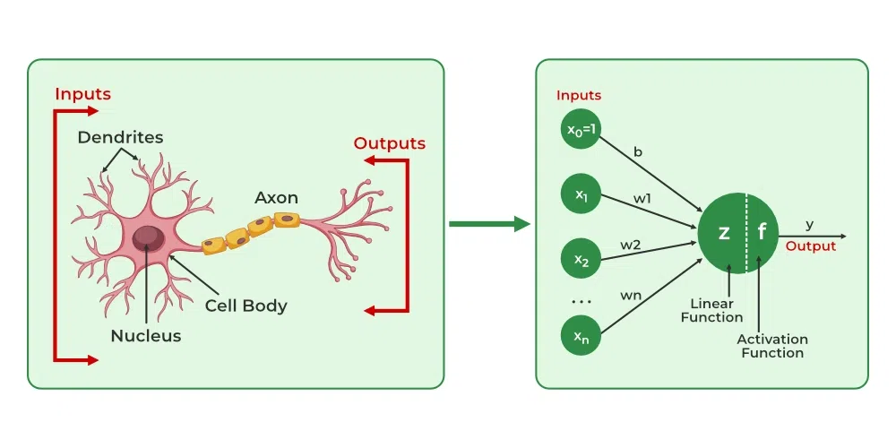

|         Aspect         |                      Biological Neurons                      |                      Artificial Neurons                      |
| :--------------------: | :----------------------------------------------------------: | :----------------------------------------------------------: |
|     **Structure**      |        Dendrites: Receive signals from other neurons.        | Input Nodes: Receive data and pass it on to the next layer.  |
|           -            |           Cell Body (Soma): Processes the signals.           |     Hidden Layer Nodes: Process and transform the data.      |
|           -            |     Axon: Transmits processed signals to other neurons.      |   Output Nodes: Produce the final result after processing.   |
|    **Connections**     |    Synapses: Links between neurons that transmit signals.    | Weights: Connections between neurons that control the influence of one neuron on another. |
| **Learning Mechanism** | Synaptic Plasticity: Changes in synaptic strength based on activity over time. | Backpropagation: Adjusts the weights based on errors in predictions to improve future performance. |
|     **Activation**     | Activation: Neurons fire when signals are strong enough to reach a threshold. | Activation Function: Maps input to output, deciding if the neuron should fire based on the processed data. |

### Convolutional Layers vs Fully Connected layers

|       **Aspect**        |             Convolutional Layers              |           Fully Connected Layers            |
| :---------------------: | :-------------------------------------------: | :-----------------------------------------: |
|    **Connectivity**     | Local (each neuron connects to local regions) | Global (each neuron connects to all inputs) |
|   **Parameter Count**   |            Lower (weight sharing)             |                   Higher                    |
| **Spatial Information** |    Preserved (via convolution operations)     | Lost (flattening removes spatial structure) |
|     **Typical Use**     |              Feature extraction               |         Classification, regression          |

### RNN vs Feedforward Neural Networks

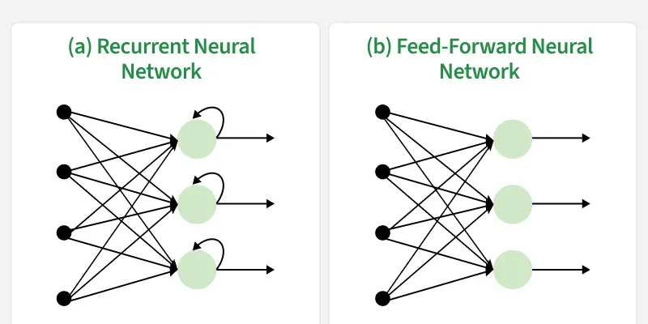

### GRU vs LSTM

|         **Feature**          |        **LSTM (Long Short-Term Memory)**         |            **GRU (Gated Recurrent Unit)**             |
| :--------------------------: | :----------------------------------------------: | :---------------------------------------------------: |
|       **Gates**        |            3 (Input, Forget, Output)             |                   2 (Update, Reset)                   |
|     **Cell State**     |              Yes it has cell state               |                No (Hidden state only)                 |
|   **Training Speed**   |             Slower due to complexity             |          Faster due to simpler architecture           |
| **Computational Load** |     Higher due to more gates and parameters      |        Lower due to fewer gates and parameters        |
|    **Performance**     | Often better in tasks requiring long-term memory | Performs similarly in many tasks with less complexity |

### Feed-Forward Neural Networks (FNN) vs Recurrent Neural Networks (RNN)

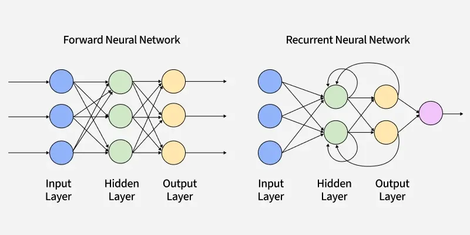

|      **Feature**      | **Feed-Forward Neural Network (FNN)**  |      **Recurrent Neural Network (RNN)**       |
| :-------------------: | :------------------------------------: | :-------------------------------------------: |
|     **Data Flow**     |        One-way (input → output)        |    Cyclic (can loop over previous states)     |
|      **Memory**       |               No memory                |         Has memory via hidden states          |
|     **Best For**      |  Static input (images, tabular data)   |  Sequential input (text, audio, time series)  |
|    **Complexity**     |                 Lower                  |                    Higher                     |
|   **Training Time**   |                 Faster                 |        Slower due to time dependencies        |
|  **Gradient Issues**  |               Less prone               | Can suffer from vanishing/exploding gradients |
| **Example Use Cases** | Image classification, object detection |    Sentiment analysis, speech recognition     |

---

## Reference

[1] [OpenAI CLIP: The Model That Learnt Zero-Shot Image Recognition Using Text](https://blog.bytebytego.com/p/openai-clip-the-model-that-learnt)

[2] [What is Mixed Precision Training?](https://www.geeksforgeeks.org/deep-learning/what-is-mixed-precision-training/)

[3] [Artificial Neural Networks and its Applications](https://www.geeksforgeeks.org/deep-learning/artificial-neural-networks-and-its-applications/)

[4] [Transformers in Machine Learning](https://www.geeksforgeeks.org/machine-learning/getting-started-with-transformers/)

[5] [Vanishing and Exploding Gradients Problems in Deep Learning](https://www.geeksforgeeks.org/deep-learning/vanishing-and-exploding-gradients-problems-in-deep-learning/)

[6] [Deep Learning Tutorial](https://www.geeksforgeeks.org/deep-learning/deep-learning-tutorial/)

[7] [Introduction To Neural Networks](https://www.geeksforgeeks.org/deep-learning/neural-networks-a-beginners-guide/)

[8] [Types of Neural Networks](https://www.geeksforgeeks.org/deep-learning/types-of-neural-networks/)

[9] [Introduction to Convolution Neural Network](https://www.geeksforgeeks.org/machine-learning/introduction-convolution-neural-network/)

[10] [Introduction To Convolution Layers](https://www.geeksforgeeks.org/machine-learning/what-are-convolution-layers/)

[11] [Activation Functions in Neural Networks](https://www.geeksforgeeks.org/machine-learning/activation-functions-neural-networks/)

[12] [Introduction to Pooling Layer in CNN](https://www.geeksforgeeks.org/deep-learning/introduction-to-pooling-layer-cnn/)

[13] [Introduction to Long Short Term Memory](https://www.geeksforgeeks.org/deep-learning/deep-learning-introduction-to-long-short-term-memory/)

[14] [Gated Recurrent Unit Networks](https://www.geeksforgeeks.org/machine-learning/gated-recurrent-unit-networks/)

[15] [Radial Basis Function Kernel - Machine Learning](https://www.geeksforgeeks.org/machine-learning/radial-basis-function-kernel-machine-learning/)

[16] [Self Organizing Maps - Kohonen Maps](https://www.geeksforgeeks.org/python/self-organising-maps-kohonen-maps/)

[17] [Deep Belief Network (DBN) in Deep Learning](https://www.geeksforgeeks.org/deep-learning/deep-belief-network-dbn-in-deep-learning/)

[18] [Generative Adversarial Network (GAN)](https://www.geeksforgeeks.org/deep-learning/generative-adversarial-network-gan/)

[19] [Denoising AutoEncoders In Machine Learning](https://www.geeksforgeeks.org/machine-learning/denoising-autoencoders-in-machine-learning/)

[20] [Sparse Autoencoders in Deep Learning](https://www.geeksforgeeks.org/deep-learning/sparse-autoencoders-in-deep-learning/)

[21] [Variational AutoEncoders](https://www.geeksforgeeks.org/machine-learning/variational-autoencoders/)

[22] [Siamese Neural Network in Deep Learning](https://www.geeksforgeeks.org/nlp/siamese-neural-network-in-deep-learning/)

[23] [Introduction to Capsule Neural Networks | ML](https://www.geeksforgeeks.org/deep-learning/capsule-neural-networks-ml/)

[24] [Spiking Neural Networks in Deep Learning](https://www.geeksforgeeks.org/deep-learning/spiking-neural-networks-in-deep-learning-/)

[25] [Single Layer Perceptron in TensorFlow](https://www.geeksforgeeks.org/python/single-layer-perceptron-in-tensorflow/)

[26] [Multi-Layer Perceptron Learning in Tensorflow](https://www.geeksforgeeks.org/deep-learning/multi-layer-perceptron-learning-in-tensorflow/)

[27] [Feedforward Neural Network](https://www.geeksforgeeks.org/deep-learning/feedforward-neural-network/)

[28] [What are radial basis function neural networks?](https://www.geeksforgeeks.org/deep-learning/what-are-radial-basis-function-neural-networks/)

[29] [Architecture and Learning process in neural network](https://www.geeksforgeeks.org/machine-learning/ml-architecture-and-learning-process-in-neural-network/)

[30] [Backpropagation in Neural Network](https://www.geeksforgeeks.org/machine-learning/backpropagation-in-neural-network/)

[31] [Architecture and Learning process in neural network](https://www.geeksforgeeks.org/machine-learning/ml-architecture-and-learning-process-in-neural-network/)

[32] [Layers in Artificial Neural Networks (ANN)](https://www.geeksforgeeks.org/deep-learning/layers-in-artificial-neural-networks-ann/)

[33] [Weights and Bias in Neural Networks](https://www.geeksforgeeks.org/deep-learning/the-role-of-weights-and-bias-in-neural-networks/)

[34] [What is Forward Propagation in Neural Networks](https://www.geeksforgeeks.org/deep-learning/what-is-forward-propagation-in-neural-networks/)

[35] [Backpropagation in Neural Network](https://www.geeksforgeeks.org/machine-learning/backpropagation-in-neural-network/)

[36] [Loss Functions in Deep Learning](https://www.geeksforgeeks.org/deep-learning/loss-functions-in-deep-learning/)

[37] [Learning Rate in Neural Network](https://www.geeksforgeeks.org/machine-learning/impact-of-learning-rate-on-a-model/)

[38] [Introduction to Padding](https://www.geeksforgeeks.org/machine-learning/cnn-introduction-to-padding/)

[39] [What is Fully Connected Layer in Deep Learning](https://www.geeksforgeeks.org/deep-learning/what-is-fully-connected-layer-in-deep-learning/)

[40] [Backpropagation in Convolutional Neural Networks](https://www.geeksforgeeks.org/computer-vision/backpropagation-in-convolutional-neural-networks/)

[41] [LeNet-5](https://www.geeksforgeeks.org/computer-vision/lenet-5-architecture/)

[42] [ML | Getting Started With AlexNet](https://www.geeksforgeeks.org/machine-learning/ml-getting-started-with-alexnet/)

[43] [VGG-Net Architecture Explained](https://www.geeksforgeeks.org/computer-vision/vgg-net-architecture-explained/)

[44] [VGG-16 | CNN model](https://www.geeksforgeeks.org/computer-vision/vgg-16-cnn-model/)

[45] [Understanding GoogLeNet Model - CNN Architecture](https://www.geeksforgeeks.org/machine-learning/understanding-googlenet-model-cnn-architecture/)

[46] [Residual Networks (ResNet) - Deep Learning](https://www.geeksforgeeks.org/deep-learning/residual-networks-resnet-deep-learning/)

[47] [Mobilenet V2 Architecture in Computer Vision](https://www.geeksforgeeks.org/computer-vision/mobilenet-v2-architecture-in-computer-vision/)

[48] [U-Net Architecture Explained](https://www.geeksforgeeks.org/machine-learning/u-net-architecture-explained/)

[49] [U-Net Architecture Explained](https://www.geeksforgeeks.org/machine-learning/u-net-architecture-explained/)

[50] [Bidirectional Recurrent Neural Network](https://www.geeksforgeeks.org/deep-learning/bidirectional-recurrent-neural-network/)

[51] [Bidirectional LSTM in NLP](https://www.geeksforgeeks.org/nlp/bidirectional-lstm-in-nlp/)

[52] [Conditional Generative Adversarial Network](https://www.geeksforgeeks.org/deep-learning/conditional-generative-adversarial-network/)

[53] [Cycle Generative Adversarial Network (CycleGAN)](https://www.geeksforgeeks.org/machine-learning/cycle-generative-adversarial-network-cyclegan-2/)

[54] [Super Resolution GAN (SRGAN)](https://www.geeksforgeeks.org/machine-learning/super-resolution-gan-srgan/)

[55] [StyleGAN - Style Generative Adversarial Networks](https://www.geeksforgeeks.org/machine-learning/stylegan-style-generative-adversarial-networks/)
