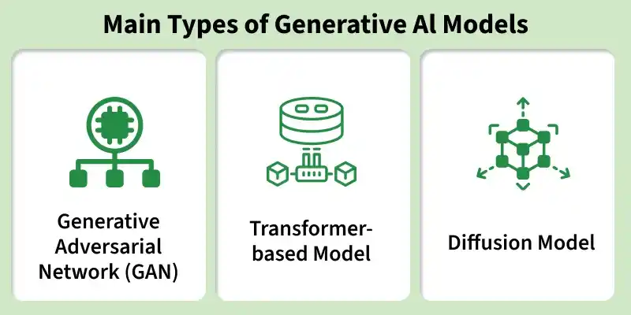
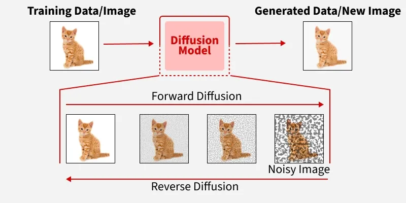
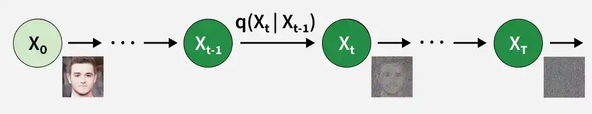
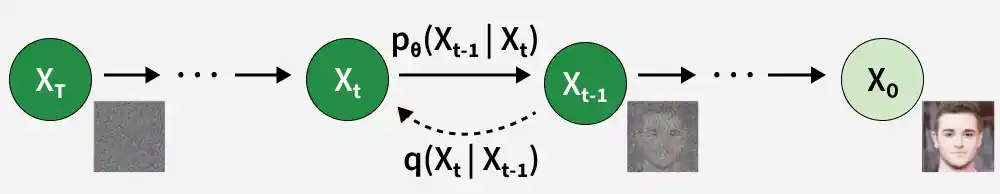
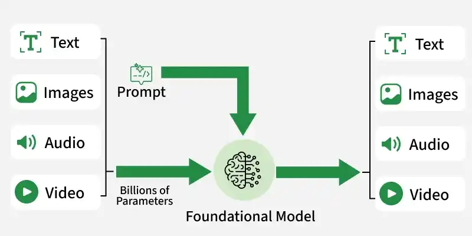

# Generative AI

[TOC]

Generative AI is a type of artificial intelligence designed to create new content such as text, images, music or even code by learning patterns from existing data. These models generate original outputs that are often indistinguishable from human-created content. These models use techniques like deep learning and neural networks to generate output.

## Types Of GenAI Model

### Autoregressive Models

Autoregressive Transformers Models generate sequences by predicting the next token based on all previous ones, moving step by step through the text.

The architecture relies on the transformer’s self-attention mechanism to capture context from the entire input so far, making it highly effective for natural language and code generation.

### Diffusion Models

Diffusion Models in Machine Learning are generative models that create new data by learning to reverse a process of gradually adding noise to training samples. They use neural networks and probabilistic principles to transform random noise into realistic, high-quality outputs.

Diffusion Models generate data by progressively transforming noise into structured outputs. This process can be divided into four components:

1. Forward Process

   

   The forward process gradually adds Gaussian noise to a data sample $x_0$ over several steps until it becomes nearly pure noise. This defines a sequence of noisy versions $x_1, x_2, ..., x_T$ that the model will learn to reverse.

   The forward diffusion process is represented using a distribution $q$, which describes how noise is added at each step:
   $$
   q(x_1 | x_{t - 1}) = N(x_t; \sqrt{1 - \beta_{t}} x_{t - 1}, \beta_{t}I)
   $$
   where:

   - $x_{t - 1}$: Data at the previous time step.
   - $x_t$: Data at the current time step after adding noise.
   - $\beta_{t}$: Variance schedule controlling how much noise is added at step $t$.
   - $I$: Identity matrix.
   - $N$: Gaussian (normal) distribution.

2. Reverse Process

   

   The reverse process reconstructs the original data from noisy inputs by predicting the clean sample at each step. This is modeled using a neural network that estimates the distribution of the previous step conditioned on the current noisy data.
   $$
   p(x_{t - 1} | x_t) = N(x_{t - 1}; \mu_{\theta}(x_t, t), \sigma_{t}^{2}I)
   $$
   where:

   - $\mu_{\theta}(x_t, t)$ is the mean predicted by the neural network.
   - $\sigma_{t}^{2}$ is the variance at step $t$.

3. Training the Model

   Training a diffusion model involves optimizing the neural network to predict the noise added during the forward process. The network learns to minimize the difference between predicted noise and actual noise, effectively learning how to reverse the diffusion.
   $$
   L(\theta) = E_{x_0, \epsilon, t}[\lvert \lvert \epsilon - \epsilon_{\theta}(x_t, t) \rvert \rvert^{2}]
   $$
   where:

   - $\epsilon$ is the actual noise.
   - $\epsilon_{\theta}(x_t, t)$ is the predicted noise by the network.

4. Score Matching

   Some diffusion models use score matching, which estimates the gradient of the log probability density (the score function). This helps improve the accuracy of the reverse process by better approximating the underlying data distribution.

   - Score matching provides a probabilistic foundation for reversing noise.
   - Enables more stable and high-quality sample generation.
   - Often used in continuous-time diffusion models and variants like DDPMs (Denoising Diffusion Probabilistic Models).

   $$
   L_{score}(\theta) = E_{x_0, t}[\lvert\lvert \nabla_{x_t} \log p(x_t | x_0) - \nabla_{x_t} \log_{p_{\theta}}(x_t) \rvert\rvert^2]
   $$

### Variational Autoencoders (VAEs) and Generative Adversarial Networks (GANs)

A **VAE** encodes data into a compressed latent space and then decodes it back with a probabilistic twist that encourages smooth, continuous representations. This makes them good for controllable generation and interpolation between styles.

VAE is a special kind of autoencoder that can generate new data instead of just compressing and reconstructing it. It has three main parts:

1. Encoder (Understanding the Input)

   The encoder takes input data like images or text and learns its key features. Instead of outputting one fixed value, it produces two vectors for each feature:

   - Mean ($\mu$): A central value representing the data.
   - Standard Deviation ($\sigma$): it is a measure of how much the values can vary.

2. Latent Space (Adding Some Randomness)

   Instead of encoding the input as one fixed point it pick a random point within the range given by the mean and standard deviation. This randomness lets the model create slightly different versions of data which is useful for generating new, realistic samples.

3. Decoder (Reconstructing or Creating New Data)

   The decoder takes the random sample from the latent space and tries to reconstruct the original input. Since the encoder gives a range, the decoder can produce new data that is similar but not identical to what it has seen.

**GANs**, in contrast, use two networks against each other a generator that tries to produce realistic outputs and a discriminator that tries to detect fakes.

### Encoder Decoder Models

The encoder-decoder model is a neural network used for tasks where both input and output are sequences, often of different lengths. It is commonly applied in areas like translation, summarization and speech processing.

## Workflow

### Training & Inference

Generative AI is trained on large datasets like text, images, audio or video using deep learning networks. During training, the model learns parameters (millions or billions of them) that help them predict or generate content. Here models generate output based on learned patterns and prompts provided

### Media Type

- Text

  Uses large language models (LLMs) to predict the next token in a sequence, enabling coherent paragraph or essay generation.

- Images

  Diffusion models like DALL·E or Stable Diffusion start with noise and iteratively denoise to create realistic visuals

- Speech

  Text-to-speech models synthesize human-like voice by modeling acoustic features based on prompt.

- Video

  Multimodal systems like Sora by OpenAI or Runway generate short, temporally coherent video clips from text or other prompts

### Agents

Modern systems often uses [agents](agent.md) which are semi-autonomous components that interact with the environment, obtain information and execute chains of tasks. These agents uses LLMs to reason, plan and act enabling workflows like querying databases, performing retrieval or controlling external APIs.

### Fine-Tuning

LLMs are trained on massive general corpora (e.g., web text) using self-supervised methods. These models become pre-trained models which can be further trained on domain-specific labeled data to adapt to specialized tasks or stylistic needs. This technique is called fine tuning and it can be done using:

### Retrieval-Augmented Generation (RAG)

Modern systems also uses RAG which enhances outputs by retrieving relevant documents at query time to ground the generation in accurate, up-to-date information, reducing hallucinations and improving factuality. The process typically involves:

- Indexing documents into embeddings stored in vector databases
- Retrieval of relevant passages
- Augmentation of the prompt with retrieved content
- Generation of grounded, informed responses

## Evaluation

Evaluating generative AI involves multiple dimensions because outputs can vary in accuracy, style, and usefulness depending on the task. Key aspects include:

1. Fact Accuracy and Hallucination Avoidance

   Benchmarks like BEIR and Natural Questions assess factual correctness. Techniques like RAG and fine-tuning reduce hallucinations and ground responses in reliable data.

2. Quality Metrics

   Outputs are judged on fluency, coherence, logical consistency, and contextual relevance. Commonly used metrics are BLEU, ROUGE, METEOR, FID, and IS.

3. Efficiency and Accuracy Trade-Offs

   LoRA and QLoRA help in balancing performance with computational cost, making models faster and lighter without losing quality.

4. Resilience to Retrieval Noise

   Advanced approaches like “Finetune-RAG” improve model accuracy by training the model to handle imperfect retrieval inputs, hence increasing factual reliability.

5. Creativity and Diversity

   Models should generate varied and original outputs rather than repetitive or biased ones.

6. Bias and Fairness

   Evaluation includes checking whether outputs reflect harmful stereotypes or unfair treatment of groups. Tools like Bias Benchmark for QA (BBQ) and StereoSet measure bias levels.

7. User Experience and Usefulness

   Beyond technical metrics, effectiveness is judged by how well the system supports users in real scenarios, like chatbots providing relevant, actionable responses.

## Reference

[1] [Understanding the GenAI Terminologies](https://blog.bytebytego.com/i/146654478/understanding-the-genai-terminologies)

[2] [What is Generative AI](https://www.geeksforgeeks.org/artificial-intelligence/what-is-generative-ai/)

[3] [Autoregressive (AR) Model for Time Series Forecasting](https://www.geeksforgeeks.org/data-analysis/autoregressive-ar-model-for-time-series-forecasting/)

[4] [Diffusion Models in Machine Learning](https://www.geeksforgeeks.org/artificial-intelligence/diffusion-models-in-machine-learning/)

[5] [Variational AutoEncoders](https://www.geeksforgeeks.org/machine-learning/variational-autoencoders/)