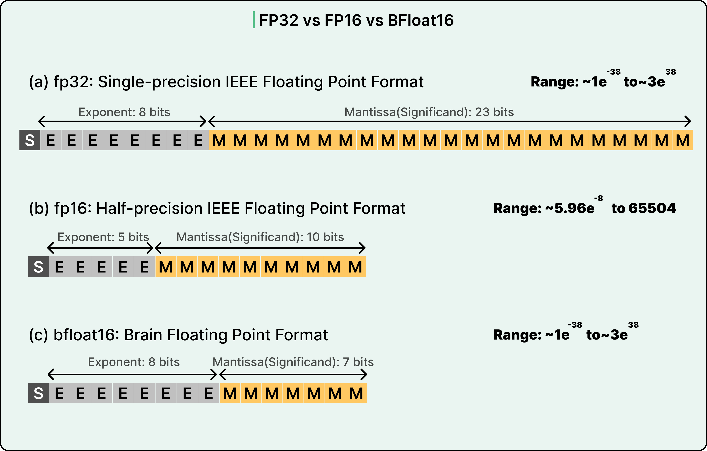
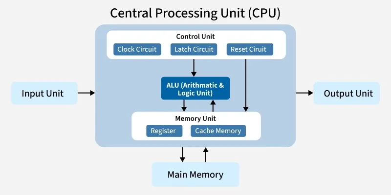
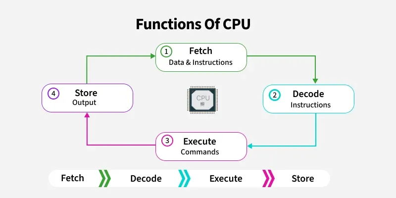
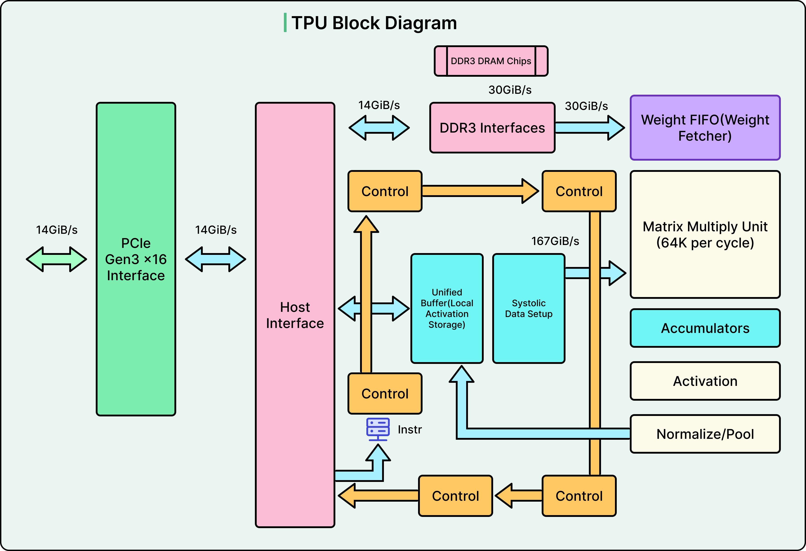
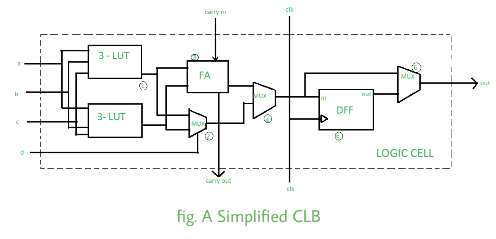
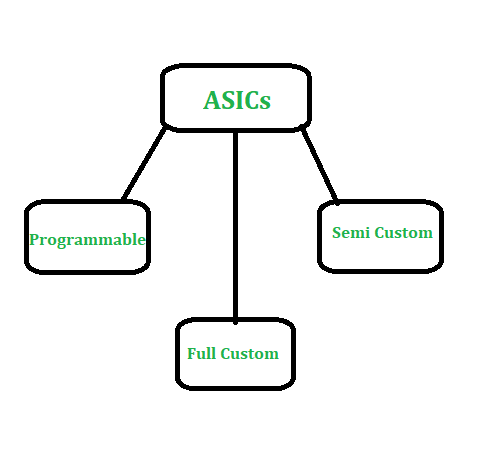
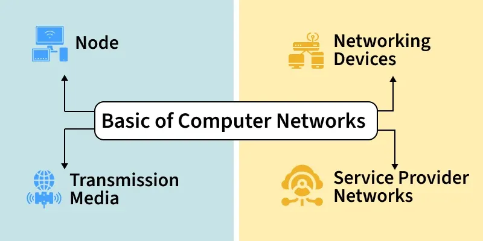

# AI Hardware

[TOC]

## Define

### Floating Point Format

## Central Processing Units (CPUs)

In a computer system, processing and control are handled by a crucial component responsible for executing instructions and managing operations.

- **Control Unit**: The control unit manages the CPU by sending signals like clock, hold, and reset to its parts. It ensures all components work together to complete tasks.
- **Arithmetic and Logic Unit (ALU)**: The ALU handles arithmetic tasks (like addition, subtraction, multiplication, division) and logical tasks (like AND, OR, comparisons). It uses addition for all calculations.
- **Memory Unit**: The memory unit stores data and instructions. Older CPUs used registers, but modern ones also have fast cache memory. The CPU fetches data from RAM, ROM, or hard disks and stores it in registers or cache during tasks.

### Functions

The functions of the CPU involve processing instructions from programs and controlling all operations within the computer. This is carried out through a sequence known as the Fetch-Decode-Execute-Store cycle:

- **Fetch:** The CPU retrieves the instruction from main memory (RAM).
- **Decode:** The Control Unit interprets the fetched instruction to determine the required operation.
- **Execute:** The CPU performs the operation using the appropriate hardware components, such as the ALU.
- **Store:** The result of the executed instruction is written back to memory or a register.

### CPU Make Computer Faster

Modern CPUs are designed to be super-efficient. Here are a few ways they speed things up:

- **Multiple Cores**: Many CPUs have multiple cores, which are like mini-CPUs that can work on different tasks at the same time. It’s like having several chefs in the kitchen instead of one.
- **Faster Clocks**: The clock speed (measured in GHz, like 3.5 GHz) determines how many instructions the CPU can handle per second.
- **Bigger Cache**: More cache means the CPU can store more data close by, reducing wait times.
- **Pipelining**: This lets the CPU start working on the next instruction before finishing the current one, like a factory line.

## Graphics Processing Units (GPUs)

GPUs are specialized hardware designed to accelerate computations that involve parallel processing, making them crucial for deep learning and other computationally intensive ML tasks. They are particularly effective in handling large-scale matrix operations, which are common in training neural networks.

TODO

## Tensor Processing Units (TPUs)

The TPU includes the following computational resources:

- **Matrix Multiplier Unit (MXU)**: 65, 536 8-bit multiply-and-add units for matrix operations.
- **Unified Buffer (UB)**: 24MB of SRAM that works as registers
- **Activation Unit (AU):** Hardwired activation functions.

There are 5 major high-level instruction sets devised to control how the above resources work:

|     TPU Instruction     |                           Function                           |
| :---------------------: | :----------------------------------------------------------: |
|    Read_Host_Memory     |                    Read data from memory                     |
|      Read_Weights       |                   Read weights from memory                   |
| MatrixMultiply/Convolve | Multiply or convolve with the data and weights, accumulate the results |
|        Activate         |                  Apply activation functions                  |
|    Write_Host_Memory    |                    Write result to memory                    |

## Field-Programmable Gate Arrays (FPGAs)

FPGA stands for **Field Programmable Gate Array,** which is an IC that can be programmed to perform a customized operation for a specific application. They have thousands of gates. In the field of VLSI FPGAs have been very popular. Languages such as VHDL and Verilog are used to write the code for FPGA programming.

### Architecture

### Types

Types of FPGA Based on their applications, FPGAs are classified as :

- **Low-End FPGAs: They consume less power than the other two and are less complex as no of gates is less.
- **Mid-Range FPGAs**: They consume more power than low-end FPGAs and have a larger number of gates, so more complex. They provide a balance between performance and cost.
- **High-End FPGAs**: They have a large gate density, so are more complex than mid-range. Their performance is better than low-end and mid-range FPGAs, but some High-End FPGAs.

## Application-Specific Integrated Circuits (ASICs)

ASIC stands for Application Specific Integrated Circuit. It is specially built for a specific application or purpose. If compared to any other device, ASIC has improved speed. Basically, it is an integrated circuit that's been specified for one specific purpose and is not software programmable to perform a wide variety of different tasks.

### Types

## Memory and Storage

### Random Access Memory (RAM)

RAM is crucial for the smooth operation of any computing system. In machine learning, it helps in loading and processing datasets, managing intermediate computations, and running multiple processes simultaneously.

### Storage

Storage is vital for housing datasets, models, and software. Fast and ample storage helps in quickly loading data and saving model checkpoints.

## Networking

Network speed and reliability are important for downloading datasets, accessing cloud services, and collaborating on distributed ML tasks.

## Motherboard

The motherboard connects all hardware components and determines compatibility and expandability.

## Cooling System

Effective cooling is crucial for maintaining optimal performance and preventing overheating of high-performance components like GPUs and CPUs.

## Power Supply Unit (PSU)

The PSU provides power to all components and must be able to supply sufficient wattage for your entire system.

## Summary

### Different Hardware Requirements for AI

| Hardware Type                                        | Strengths                                                    | Limitations                                                  | Best Use Cases                                               |
| ---------------------------------------------------- | ------------------------------------------------------------ | ------------------------------------------------------------ | ------------------------------------------------------------ |
| **CPUs (Central Processing Units)**                  | + **Versatility**: CPUs are general-purpose and can handle a wide variety of tasks beyond AI. + **Sequential Processing**: Good for any sort of work that either cannot be done in parallel well or has a very high single-thread performance requirement. + **Affordable**: In general, more widely available and often cheaper than specialized hardware. | + **Parallel Processing**: CPUs are less efficient than GPUs for tasks demanding massive parallelism, such as deep learning. + **Performance**: AI tasks, especially the training of big models, run more slowly on a CPU compared to a GPU or TPU. | + General-purpose computing. + Data preprocessing.        |
| **GPUs (Graphics Processing Units)**                 | + **Parallelism**: Parallelism makes it a great support for parallel processing, making it ideal for training deep learning models and running simulations. + **Optimization**: Supported by most of the AI frameworks, such as TensorFlow and PyTorch, through optimized libraries like NVIDIA's CUDA. + **Scalability**: Easily scalable to multiple GPUs in order to handle huge AI workloads. | + **Energy consumption**: being power-hungry in nature, GPUs exhibit increased energy costs. + **Cost**: High-performance GPUs are usually quite costly, with the cost multiplying in large deployments. | + Training deep learning models.  + Image and video processing. + Running large-scale simulations. |
| **TPUs (Tensor Processing Units)**                   | + **AI Optimization**: Specially designed for workloads of artificial intelligence, particularly for tensor operations used in deep learning. + **Performance**: Outperforms some performance benchmarks by GPUs in certain tasks, especially within the Google TensorFlow ecosystem. + **Efficiency**: Noticeably more power-efficient than GPUs for AI-type workloads. | + **Flexibility**: Less versatile than GPUs since TPUs are optimized for very specific types of AI tasks and may not use a wide range of frameworks. + **Accessibility**: It is mainly available through Google Cloud, which may limit its use outside this environment. | + TensorFlow-based deep learning tasks. + Large-scale AI model training. + Cloud-based AI deployments. |
| **FPGAs (Field-Programmable Gate Arrays)**           | + **Customization**: They can be reprogrammed, providing a balance between good performance and flexibility in optimization for specific AI tasks. + **Reduced Latency**: This is significant in that FPGAs can offer reduced latency compared to CPUs or GPUs and, therefore, prove ideal for real-time AI applications. + **Energy Efficiency**: Often — but not always — more energy efficient than CPUs and GPUs for specific tasks. | + **Programming Complexity**: Specialized knowledge in programming and optimization is required, which then becomes a barrier to wider usage. + **Performance**: Although flexible, the performance of FPGAs does not reach that of raw performance from GPUs or TPUs in large-scale AI tasks. | + Real-time AI applications. + Low-latency requirements. + Specialized, customizable AI tasks. |
| **ASICs (Application-Specific Integrated Circuits)** | + **Performance**: Best performance provided for specific tasks, as they are built to be application-specific. + **Power efficiency**: Highly power-efficient for the tasks at hand. | + Cost and Development Time: As ASICs are costly and take a lot of time in their development, they are recommended for high-volume, special-purpose applications. + Lack of flexibility: Once designed, the ASICs cannot be reprogrammed, and hence they find applications among only those targeted. | + High-volume, specialized AI applications. + Edge computing with specific AI functions. + Large-scale data centers. |

### TPUs vs GPUs

|        Feature        |                             GPUs                             |                             TPUs                             |
| :-------------------: | :----------------------------------------------------------: | :----------------------------------------------------------: |
|   **Architecture**    | GPUs are designed for rendering graphics and handling parallel tasks. | TPUs are specialized hardware developed by Google for AI tasks. |
|    **Flexibility**    | GPUs are versatile and used in gaming, video rendering, and AI. | TPUs are optimized specifically for tensor operations in AI. |
|    **Performance**    | GPUs excel in tasks requiring high precision and flexibility. |   TPUs provide superior performance for inferencing tasks.   |
| **Energy Efficiency** | GPUs are energy-efficient but can consume significant power under load. | TPUs are designed for high efficiency in specific AI tasks.  |
|   **Manufacturers**   |      Leading GPU manufacturers include NVIDIA and AMD.       |  Google is the primary developer and manufacturer of TPUs.   |
|     **Use Case**      |     GPUs are widely used in training complex AI models.      | TPUs are optimized for real-time inference and TensorFlow tasks. |
|      **Latency**      | GPUs can have higher latency in real-time tasks compared to TPUs. |   TPUs achieve low latency, typically around two seconds.    |
|    **Scalability**    | GPUs scale well for extensive computational tasks and large datasets. | TPUs are highly scalable within Google's ecosystem and cloud services. |
|  **Specialization**   | GPUs are general-purpose and cater to a broad range of applications. | TPUs are highly specialized for deep learning and AI operations. |
|    **Deployment**     | GPUs are commonly used in personal computers, data centers, and cloud services. | TPUs are primarily deployed within Google's infrastructure and cloud services. |

## Reference

[1] [Central Processing Unit (CPU)](https://www.geeksforgeeks.org/computer-science-fundamentals/central-processing-unit-cpu/)

[2] [Understanding Tensor Processing Units](https://www.geeksforgeeks.org/machine-learning/understanding-tensor-processing-units/)

[3] [FPGA Full Form](https://www.geeksforgeeks.org/digital-logic/fpga-full-form/)

[4] [ASIC Full Form](https://www.geeksforgeeks.org/electronics-engineering/asic-full-form/)

[5] [Basics of Computer Networking](https://www.geeksforgeeks.org/computer-networks/basics-computer-networking/)

[6] [Why AI Needs GPUs and TPUs: The Hardware Behind LLMs](https://blog.bytebytego.com/p/why-ai-needs-gpus-and-tpus-the-hardware)

[7] [Hardware Requirements for Artificial Intelligence](https://www.geeksforgeeks.org/artificial-intelligence/hardware-requirements-for-artificial-intelligence/)

[8] [TPUs vs GPUs in AI Application](https://www.geeksforgeeks.org/artificial-intelligence/tpus-vs-gpus-in-ai-application/)

[9] [Recommended Hardware for Running LLMs Locally](https://www.geeksforgeeks.org/deep-learning/recommended-hardware-for-running-llms-locally/)

[10] [Hardware Requirements for Machine Learning](https://www.geeksforgeeks.org/machine-learning/hardware-requirements-for-machine-learning/)