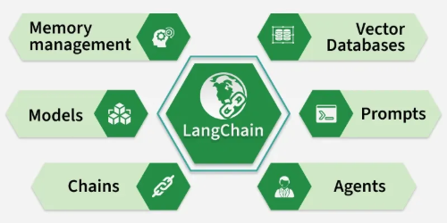
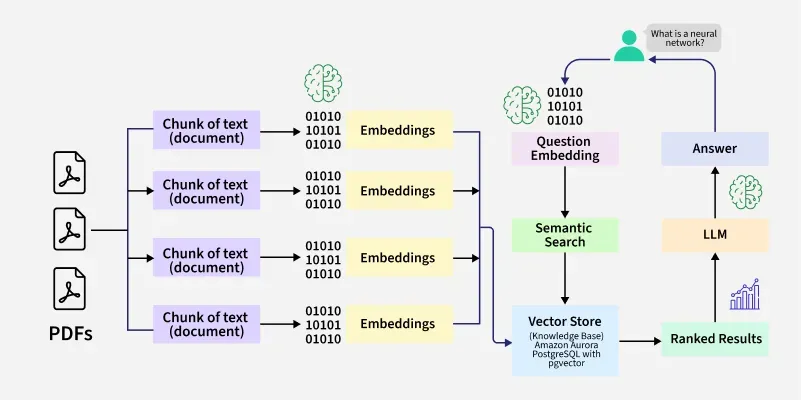

# LangChain

[TOC]

## Component

- Chains
- Prompt Management
- Agents
- Vector Database
- Models
- Memory Management

## Workflow

## Referece

[1] [Introduction to LangChain](https://www.geeksforgeeks.org/artificial-intelligence/introduction-to-langchain/)