# Large Language Model

[TOC]

Large Language Models (LLMs) are advanced AI systems built on deep neural networks designed to process, understand and generate human-like text.

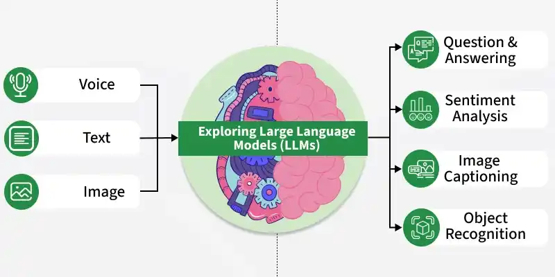

## Mathematical

### Embedding Vector

Every type of input, whether text, images, or audio, gets converted into the same type of mathematical representation called embedding vectors. Just as human brains convert light photons, sound waves, and written symbols into uniform neural signals, multimodal LLMs convert diverse data types into vectors that occupy the same mathematical space.

### Loss Functions

Think of it as a scoring system that provides a single number representing how wrong the model is. The higher the number, the worse the performance. The goal of training is to make this number as small as possible.

A good loss function must satisfy three critical requirements:

1. It must be specific. It needs to measure something concrete and not vague.
2. The loss function must be computable. The computer needs to calculate it quickly and repeatedly.
3. The loss function must be smooth. This is the trickiest requirement to grasp. Smoothness means the function’s output should change gradually as inputs change, without sudden jumps or breaks.

### Gradient Descent

Gradient descent is the algorithm that figures out how to adjust the billions of parameters inside a neural network to reduce the loss.

---

## Workflow

1. Input Text

   When you type “Hello world” into ChatGPT or Claude, the model isn’t processing those letters and spaces like you’re reading this post right now. It’s converting everything into numbers through a process most people never think about.

2. Preprocessing

   Text gets normalized. Unicode characters, spacing quirks, and special symbols, they all get cleaned up and standardized. “Hello world” becomes a consistent format that the model can actually work with.

3. Tokenization Algorithm

   The model splits text into tokens, and there are different approaches.

   - Character-based tokenization breaks everything down to individual characters.
   - Word-based splits on whole words. Cleaner but struggles with rare words and creates a massive vocabulary.
   - Subword-based is what modern LLMs actually use. It balances efficiency with flexibility, handling rare words by breaking them into known subword pieces.

---

## Tokenization

Language models are no longer limited to text. Today's AI systems can understand images, process audio, and even handle video, but they still need to convert everything into tokens first.

Each type of media requires completely different tokenization strategies, each with unique trade-offs between quality, efficiency, and semantic understanding.

### Image Tokenization

#### Patch Embeddings (Vision Transformer Style)

Patch embeddings divide images into fixed-size, non-overlapping “patches”. Each patch is treated as a single token, similar to how words function in text sequences. This allows the image to be processed into understandable units, just like text tokens.

#### Discrete VAE and Vector Quantization

Vector quantization is like creating a visual dictionary. It converts values into “buckets” so that AI can pattern-match image parts into buckets. 

#### CLIP-Style Contrastive Embeddings

Contrastive learning approaches like CLIP create embeddings in a shared vision-language space, which can then be discretized into pseudo-tokens for downstream tasks.

### Audio Tokenization

#### Codec Tokens (Neural Audio Codecs)

Neural audio codecs like EnCodec and SoundStream compress audio into token sequences while preserving quality. They map audio features to a finite set of learned codes using something called “vector quantization.”

#### Phoneme/Character Tokens (ASR-based)

Automatic Speech Recognition converts spoken audio into text representations, creating tokens that capture semantic content but discard acoustic properties.

#### Multi-Scale Token Stacks (Hierarchical Representations)

Hierarchical approaches use multiple token sequences at different temporal resolutions to capture both global structure and fine-grained details, similar to multi-scale image or video representations.

### Video Tokenization

The most common way that videos are tokenized today is to turn the video into video frames and send the video in as a sampling of images, with audio attached.

### Context Window

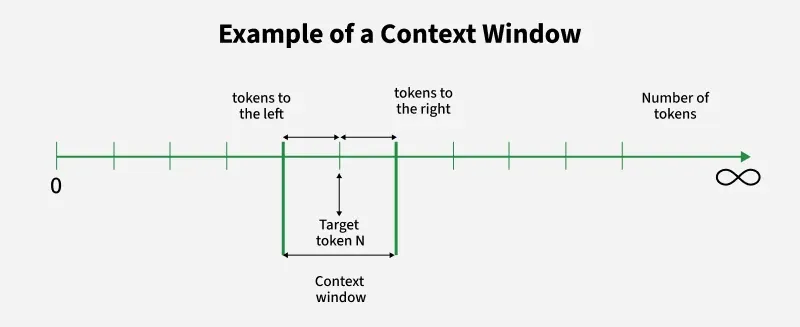

A *context window* refers to the span of text (usually in terms of tokens) that a model can consider at one time when making predictions or generating text. In simpler terms, it is the "lookback" or the amount of previous information that the model uses to make sense of the current input.

---

## Transformer

### Architecture

Transformers Architecture has become the foundation of some of the most popular LLMs, including GPT, Gemini, Claude, DeepSeek, and Llama.

### Converting Tokens to Embeddings

Neural networks cannot work directly with token IDs because they are just fixed identifiers. Each token ID gets mapped to a vector, a list of continuous numbers usually containing hundreds or thousands of dimensions. These are called embeddings.

### Attention Mechanism

The transformer layers implement the [attention mechanism](transformer.md), which is the key innovation that makes these models so powerful. Each transformer layer operates using three components for every token: queries, keys, and values. We can think of this as a fuzzy dictionary lookup where the model compares what it is looking for (the query) against all possible answers (the keys) and returns weighted combinations of the corresponding values.

---

## Training

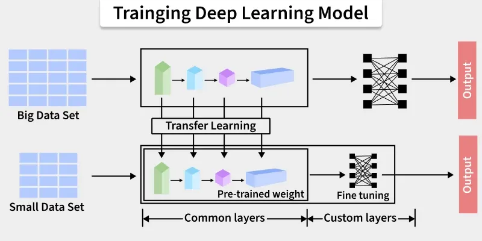

### Pre-Training

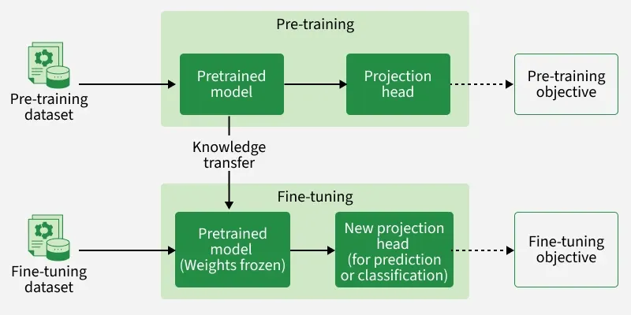

Pre-training is the initial phase in building machine learning models, especially large language models, where the system learns from large amounts of unlabeled data to capture general patterns and knowledge.

### Training Process

1. Feature Alignment
2. Visual Instruction Tuning

### Feature Alignment

#### Constitutional AI

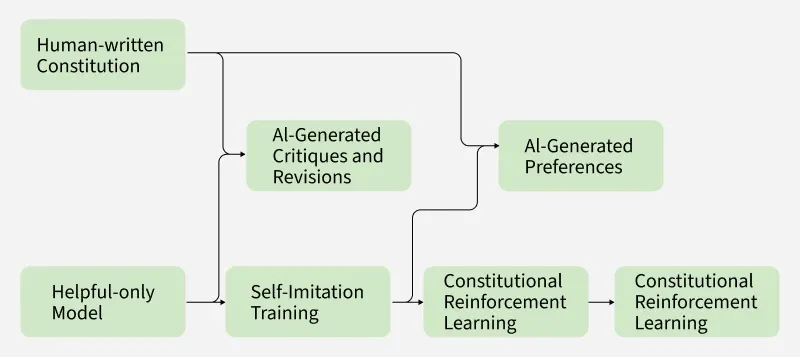

Constitutional AI is an approach to align artificial intelligence systems with human values by guiding their behaviour through a set of predefined principles and rules. Unlike traditional methods that rely heavily on human feedback Constitutional AI uses these written guidelines to help models make ethical, safe and consistent decisions during training.

Constitutional AI Workflow:

1. Supervised Fine Tuning

   In the first stage, the model is trained using human-generated responses that tell the model about desired behaviors. This process is similar to traditional supervised learning, where the model learns by mimicking high-quality examples. These examples are carefully chosen to reflect ethical, helpful and harmless responses setting the foundation for future self guided learning.

2. Self Critique and Revision

   Once the model has been fine tuned, it enters a stage where it generates multiple responses to the same prompt. Instead of relying on human evaluators, the model reviews and critiques its own answers using a predefined set of constitutional principles.

3. Reinforcement Learning with AI Feedback (RLAIF)

   In the final phase, the model is trained through reinforcement learning but instead of using human feedback to rank outputs, it uses its own constitutionally guided evaluations. The model compares its responses and rewards the ones that best align with its ethical rules. This technique called Reinforcement Learning with AI Feedback (RLAIF) enables the model to continuously refine its behavior while reducing dependence on human reviewers.

---

## Fine-Tuning

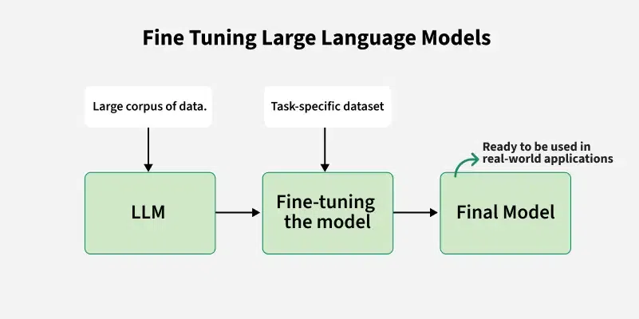

Fine-tuning allows a pre-trained model to adapt to a new task. This approach uses the knowledge gained from training a model on a large dataset and applying it to a smaller, domain-specific dataset. Fine-tuning involves adjusting the weights of the model's layers or updating certain parts of the model to improve its performance on the new task.

Fine-tuning typically involves the following steps:

1. Select a Pre-Trained Model

   The first step is to choose a pre-trained model that has been trained on a large, diverse dataset.

2. Freeze Initial Layers

   In fine-tuning, we usually freeze the weights of the earlier layers in the model. These layers capture basic features like edges or textures in images or simple words in text. Freezing these layers reduces the computational load as only the later layers will be trained.

3. Update Later Layers

   The later layers of the model are the ones that specialize in more specific features. These layers are typically fine-tuned to adjust the weights based on the new task.

4. Use a Smaller Learning Rate

   A key principle in fine-tuning is using a smaller learning rate compared to training from scratch. This ensures that the pre-trained weights are not drastically changed but are adjusted just enough to perform well on the new task.

5. Evaluate and Refine

   After training, it's important to evaluate the performance of the fine-tuned model on the specific task. Based on the evaluation, we may continue to adjust the learning rate, fine-tune more layers, or apply other modifications until the model performs optimally.

### Traditional Fine-Tuning

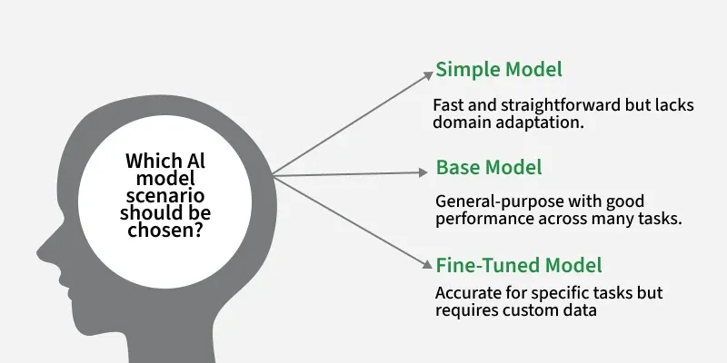

In its original form, fine-tuning involves updating all, or a significant portion, of a pre-trained model’s parameters. For models with hundreds of millions or even billions of parameters, this is a computationally intensive and resource-demanding process.

### Supervised Fine-Tuning (SFT)

`Supervised Fine-Tuning (SFT)` is a process of taking a pre-trained language model and further training it on a smaller, task-specific dataset with labeled examples. Its goal is to adjust the weights of the pre-trained model so that it performs better on our specific task without losing its general knowledge acquired during pre-training.

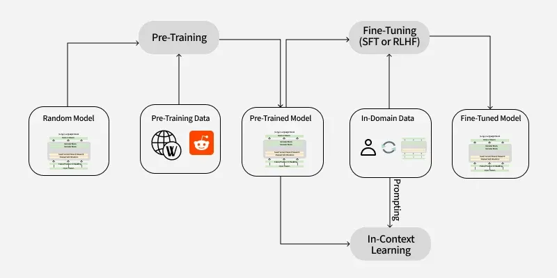

1. Pre-training

   LLM is initially trained on a large corpus of unlabeled text using masked language modeling, like predicting missing words in sentences. This helps the model develop a broad understanding of language syntax, semantics, and context.

2. Task-Specific Dataset Preparation

   A smaller dataset relevant to the target task is created. This dataset consists of input-output pairs where each input is associated with a label or response.

3. Fine-Tuning

   The pre-trained model is further trained on a task-specific dataset using supervised learning. During this process, the model’s parameters are updated to minimize the difference between its predictions and true labels.

4. Evaluation

   After fine-tuning, the model is evaluated on a validation set to assess its performance on the target task. If required, hyperparameters are tuned or additional training iterations are conducted.

5. Deployment

   Once the model achieves satisfactory results, it can be deployed for real-world use cases, such as customer support chatbots, content generation tools, or medical diagnosis systems.

### Instruction Fine-Tuning

Instruction Fine-Tuning is a specialized form of fine-tuning designed to align a model's behavior with human instructions or prompts. The idea is to train the model to follow specific instructions or prompts to perform a task, which can be useful for tasks that require reasoning or understanding complex queries.

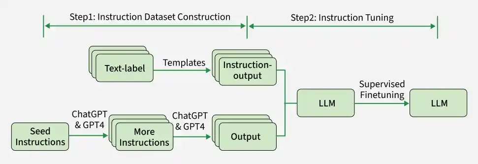

1. Data Collection

   A dataset of instruction-output pairs is curated. These pairs should cover a broad spectrum of tasks, including both simple and complex instructions.

2. Model Fine-Tuning

   The pre-trained LLM is fine-tuned on this dataset using supervised learning techniques. During training, the model learns to map instructions to appropriate outputs.

3. Evaluation and Iteration

   After fine-tuning, the model is evaluated on a validation set to assess its ability to follow instructions accurately. If necessary, additional data or rounds of fine-tuning are performed to improve performance.

### Parameter-Efficient Fine-Tuning (PEFT)

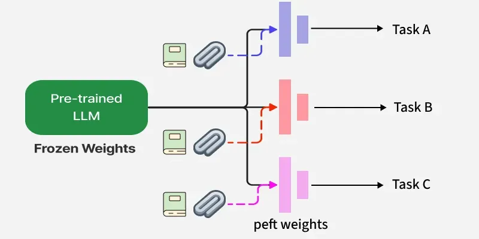

Parameter-Efficient Fine-Tuning (PEFT) is a technique that fine-tunes large pretrained language models (LLMs) for specific tasks by updating only a small subset of their parameters while keeping most of the model unchanged. This approach typically reduces computational costs and training time of LLMs for specialised tasks without retraining the entire model.

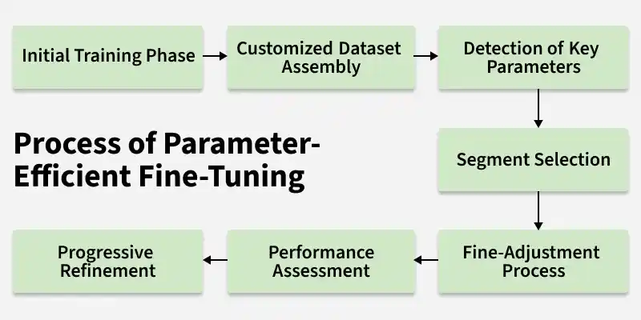

1. Start with a Pre-trained Model

   A large language model is first taken that has already learned general language patterns from vast amounts of training data. This pretrained knowledge serves as a strong foundation, allowing it to be efficiently fine-tuned for specific tasks.

2. Freeze the Core Model

   In PEFT, the original pre-trained model is not updated during training. Instead, its weights are kept fixed, and only a small set of additional parameters are trained for the new task.

3. Add Task-Specific Trainable Layers

   Instead of modifying the entire model, PEFT introduces small, task-specific components that can be trained while the main model stays frozen. These components capture the changes needed for the new task.

4. Train Only Selected Parameters

   In PEFT, training is focused only on the newly added or selected parameters, while the main model remains completely unchanged. This makes the fine-tuning process much more efficient and targeted.

5. Scalable and Efficient Deployment

   After fine-tuning, only the small task-specific components are stored and used, while the main pre-trained model remains the same. This makes deployment highly efficient and scalable.

#### Adapter Modules

Adapter modules are small neural network layers inserted between the layers of a pre-trained model. During fine-tuning, only these adapters are trained while the original model weights remain frozen, enabling efficient and modular learning.

#### LoRA (Low Rank Adaptation)

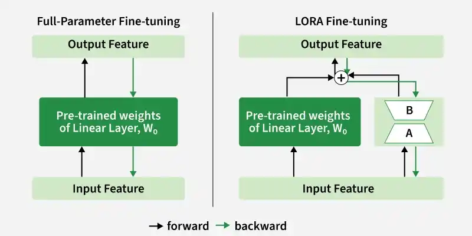

Low-Rank Adaptation (LoRA) is a parameter-efficient fine-tuning technique used to adapt large pre-trained models for specific tasks with minimal computational and memory overhead. As models grow larger, full fine-tuning becomes expensive. LoRA addresses this by reducing the number of trainable parameters, making the process faster and more efficient.

LoRA modifies the traditional fine-tuning process by introducing low-rank matrices into specific layers of a neural network allowing the model to adapt to new tasks without changing the entire model. Let's see how LoRA works:

1. Decomposing the Weight Matrix

   Instead of updating the entire weight matrix during fine-tuning, it approximates it using two smaller low-rank matrices $A$ and $B$. The adapted weight matrix ($W'$) is calculated as:
   $$
   W' = W + A \cdot B
   $$
   Here $W$ is the original weight matrix and $A$ and $B$ are the low-rank matrices. This decomposition allows the model to make task-specific adjustments without the need to retrain the entire model, drastically reducing the computational load.

2. Training Only the LoRA Parameters

   During the fine-tuning process, only the low-rank matrices $A$ and $B$ are updated while the original model weights $W$ remain frozen. This minimizes the number of parameters that need to be adjusted making fine-tuning faster and more memory-efficient compared to traditional methods where all model weights are updated.

3. Inference with Adapted Weights

   After fine-tuning, the adapted weight matrix W′ is used for inference. This helps the model to make predictions for specific tasks, fine-tuned with minimal computational resources. Since only the low-rank matrices are updated, it maintains efficiency even during inference.

#### QLoRA (Quantized Low-Rank Adapters)

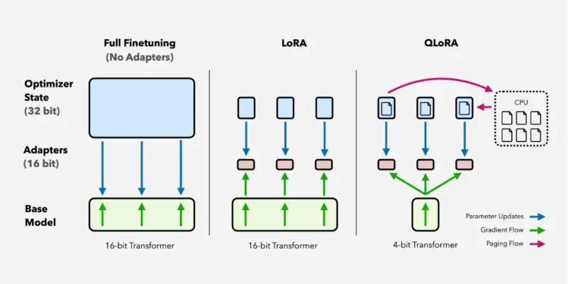

QLoRA is an advanced fine-tuning method that quantizes LLMs to reduce memory usage and applies [Low-Rank Adaptation (LoRA)](#LoRA (Low Rank Adaptation)) to train a subset of model parameters. This allows:

- Lower GPU memory requirements: Fine-tuning large models on consumer GPUs.
- Faster training: Using fewer parameters speeds up the process.
- Preserved model quality: Achieves similar performance to full fine-tuning.

Key Components of QLoRA:

1. 4-bit Quantization (NF4)

   QLoRA uses Normalized Float 4-bit (NF4) quantization, which is optimized for deep learning. Unlike traditional quantization techniques that may introduce numerical instability, NF4 maintains precision by normalizing values in a way that aligns well with deep neural networks.

2. LoRA Adapters

   Instead of modifying the full model, LoRA introduces small low-rank matrices into specific layers, allowing efficient adaptation with fewer parameters. These adapters fine-tune only critical layers such as query and value projections in transformer models. These layers are chosen because they play a central role in attention mechanisms, making fine-tuning more effective without modifying the entire model.

3. Memory: Efficient Training

   By combining quantization with LoRA, QLoRA significantly reduces VRAM usage, making fine-tuning feasible on consumer-grade GPUs. It achieves this by minimizing activation storage, reducing gradient computation, and enabling large-scale training on limited hardware.

#### DoRA (Weight-Decomposed Low-Rank Adaptation)

DoRA extends LoRA by introducing a weight-decomposition strategy, where model weights are separated into a scaling component and a low-rank update. This allows more precise control over parameter updates while keeping the process efficient.

#### Prefix Tuning

Prefix tuning is a PEFT technique where a small set of learnable prefix vectors is added to the model at each layer. These prefixes guide the model’s behavior for a specific task without modifying the original model parameters.

#### Promp Tuning

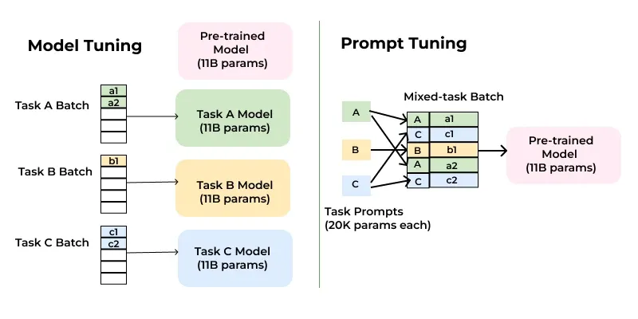

`Prompt tuning` is a technique that involves modifying the input to a pre-trained language model rather than altering the model's parameters. Instead of fine-tuning the entire model, prompt tuning focuses on designing task-specific "prompts" or instructions that guide the model to produce the desired output.

Prompt Tuning workflow:

1. Pre-trained Model

   Start with a pre-trained language model, such as GPT-3 or BERT. The model's parameters remain frozen during the process.

2. Task-Specific Prompts

   Design a prompt template that includes placeholders for the input data and task-specific instructions.

3. Soft Prompts

   Instead of using fixed, hand-crafted prompts, prompt tuning introduces *learnable soft prompts*. These are continuous vectors that are optimized during training to guide the model toward the desired behavior. Soft prompts are typically initialized randomly and then fine-tuned using gradient descent.

4. Training

   During training, only the soft prompts are updated, while the rest of the model remains unchanged. This significantly reduces the computational cost compared to full fine-tuning.

5. Inference

   At inference time, the learned soft prompts are prepended to the input, and the model generates predictions based on the combined input.

#### BitFit (Bias-Term Fine-Tuning)

BitFit fine-tunes only the bias terms of a neural network while keeping all other parameters frozen. Despite updating very few parameters, it can still achieve strong performance on many NLP tasks.

#### $(IA)^3$ (Infused Adapter by Inhibiting and Amplifying Inner Activations) 

$(IA)^3$ adjusts a model’s behavior by scaling its internal activations instead of adding new layers or heavily modifying weights. It introduces small, learnable parameters that control how information flows through the network.

### Reinforcement Learning from Human Feedback (RLHF)

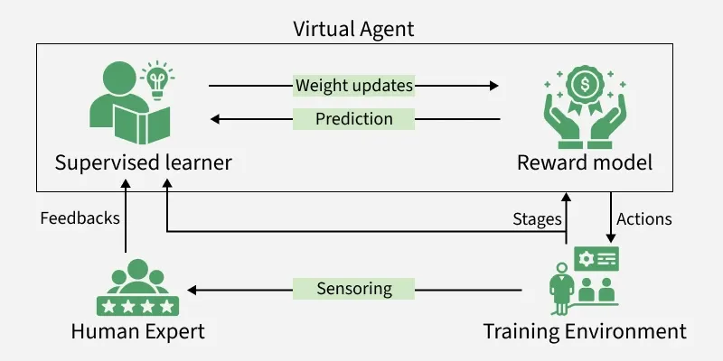

Reinforcement Learning from Human Feedback (RLHF) is a training approach used to align machine learning models, especially large language models, with human preferences and values. Instead of relying solely on predefined rules or labelled data, RLHF learns from human feedback or ratings, such as rankings or evaluations of model outputs, to guide learning.

It works in three stages:

1. Supervised Fine-Tuning (Initial Learning Phase)

   This stage adapts a large pre-trained language model to specific tasks through supervised learning on examples selected by human experts. It prepares the model to respond in ways aligned with human instructions and establishes a foundation for subsequent human-in-the-loop refinement.

2. Reward Model Training (Human Feedback Integration)

   Human evaluators rank or compare multiple completions produced by the model to provide better feedback which is unavailable in typical training data. This feedback trains a reward model that quantifies how desirable an output is which is crucial for guiding reinforcement learning.

3. Policy Optimization (Reinforcement Learning Refinement)

   Reinforcement Learning algorithms fine-tune the model to generate responses that maximize rewards predicted by the reward model. This step improves alignment with human preferences by reinforcing desirable outputs.

### Retrieval-Augmented Fine-Tuning (RAFT)

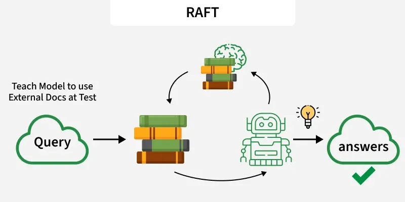

LLMs tend to be very good at general tasks related to NLP, they usually underperform for specialized domains, such as medicine or law. RAFT bridges this gap by bringing together retrieval augmented generation and fine-tuning. This hybrid method enables the model to recall domain-specific knowledge and reason contextually; it surpasses the more conventional methods on specialized datasets.

---

## Evaluation

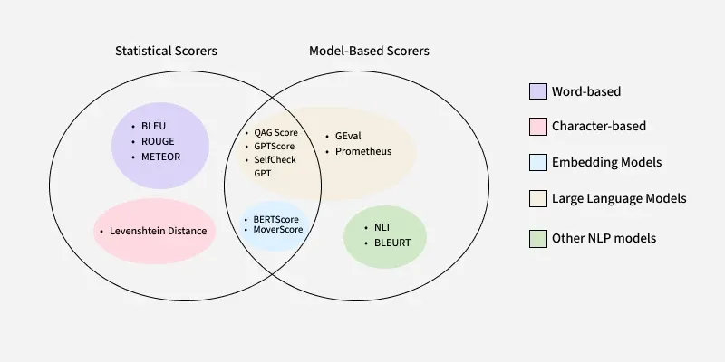

Scoring `Large Language Model (LLM)` outputs is crucial for assessing their performance. There are various methods for scoring, each suitable for different tasks and evaluation needs.

### Evaluation Metrics

Evaluating large language models (LLMs) involves assessing various metrics to ensure relevant, accurate, and appropriate outputs.

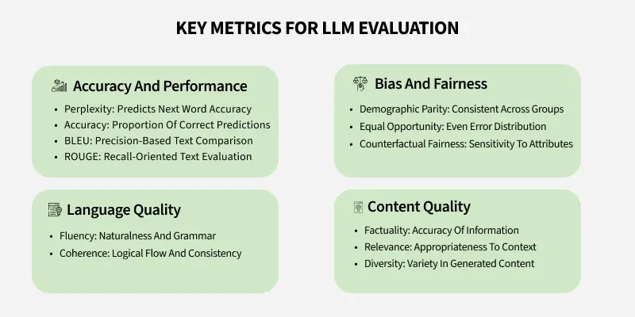

- Answer Relevancy

  Measures how well the response addresses the input (e.g., answering customer queries directly).

- Prompt Alignment

  Ensures the model follows instructions correctly (e.g., summarizing without adding unnecessary details).

- Correctness

  Assesses factual accuracy, critical in fields like healthcare or law.

- Hallucination

  Tracks fabricated or false information, which must be minimized to avoid harmful outcomes.

- Contextual Relevancy

  Evaluates how well RAG models use external data for accurate responses.

- Bias and Fairness

  Checks for harmful biases or stereotypes, crucial for fair decision-making and public interactions.

### Evaluation Process

1. Define success for our use case.
2. Create an initial evaluation set.
3. Choose our evaluation approach.
4. Set up an interation cycle.
5. Track performance over time.
6. Version everything

### Automatic Evaluation

Automatic evaluations are programmatic assessments that can run without human involvement.

Automatic evaluations shine when we need to catch obvious failures, run regression tests to ensure changes don’t break existing functionality, or quickly iterate on prompts. However, they can miss subtle issues that only human judgment would catch.

### Human Evaluation

Human evaluations take several forms. In preference ranking, evaluators compare multiple outputs and select which they prefer. Likert scales ask raters to score outputs on numerical scales across different dimensions. Task completion evaluations test whether the output accomplishes a specific goal.

### Model-Based Evaluation (LLM-as-a-Judge)

`Model-based evaluation`, also known as `LLM-as-a-judge`, involves using one `pre-trained LLM` to assess the output generated by another model based on predefined criteria. This approach allows for the evaluation of complex aspects such as `logical consistency`, `tone` and `coherence`, which traditional metrics often miss. Here are two prominent tools used in `Model-Based Evaluation`:

- `G-Eval:` It utilizes `GPT-3` or `GPT-4` to evaluate the output of another LLM. It works by breaking down the evaluation into multiple steps that align with human reasoning. G-Eval’s ability to simulate human judgment makes it an excellent tool for assessing the quality of generated outputs that need deep context analysis.
- `Prometheus:` It is another model-based evaluation tool that uses `LLama-2-Chat` for fine-tuning and evaluation. Unlike proprietary tools, Prometheus offers an open-source approach, enabling flexibility and accessibility for evaluating LLM performance across various tasks. This makes Prometheus a great tool for ensuring that LLMs provide factually accurate and coherent responses, especially in applications that demand high standards of factual alignment.

### Combining Statistical and Model-Based Scorers

While statistical metrics like `BLEU` and `ROUGE` are quick and useful, they often overlook deeper aspects like semantic meaning and contextual understanding. By combining these with `Model-Based Scorers`, we can achieve more accurate and flexible evaluations. For example:

- `BERTScore` leverages `BERT embeddings` to compare semantic similarity between the generated and reference text, making it ideal for tasks like machine translation and summarization, where meaning and context are crucial.
- `MoverScore` calculates the `Earth Mover’s Distance (EMD)` between word embeddings to measure the semantic overlap between the generated text and the reference, offering a more refined evaluation of how well the output matches the original content.

### Benchmark-Based Evaluations

The ML research community has developed standardized benchmark datasets for evaluating LLMs. These include datasets like MMLU (Massive Multitask Language Understanding) for general knowledge, HellaSwag for common sense reasoning, and HumanEval for code generation.

---

## Distillation

LLM Distillation is a specialized form of Knowledge Distillation(KD) that compresses large-scale LLMs into smaller, faster, and more efficient models while preserving a significant portion of the performance. It enables lightweight models to approximate the capabilities of massive LLMs, making them deployable on a broader range of applications and devices.

### LLM Distillation Techniques

1. Logit-Based Distillation

   The student model learns from the soft probability distributions of the teacher rather than just hard labels. It uses `Kullback-Leibler (KL)` divergence loss:
   $$
   L_{KD} = T^{2} \sum p_{teacher(x)} \log \frac{p_{teacher(x)}}{p_{student(x)}}
   $$
   where $T$(temperature) smooths the soft probabilities, helping the student generalize better.

2. Feature-Based Distillation

   Instead of just logits, the hidden representations from intermediate layers of the teacher model are transferred to the student. The student learns to mimic internal activations using an `L2 loss` or `mean squared error (MSE)` between corresponding layers.

3. Progressive Layer Dropping

   Instead of using all layers of the teacher model, the student selectively learns from a subset of layers to reduce redundancy.

4. Task-Specific Distillation

   The student model is fine-tuned on specific downstream tasks (e.g., sentiment analysis, summarization) to optimize performance for real-world applications.

---

## AI Guardrail

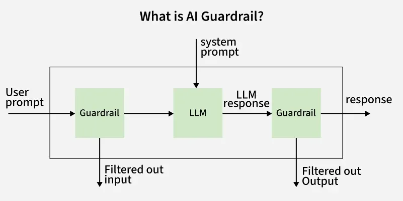

AI guardrails are safety mechanisms designed to keep AI systems on track and ensuring they behave responsibly and safely. Think of them as a set of policies, controls and technical measures that sit between AI model and the user interface. Their primary function is to intercept, block and mitigate risks in real time.

### AI Guardrail Workflow

AI guardrails constantly monitors both the input and output of AI systems. They rely on predefined rules and algorithms such as finetuned models or pipelines to detect potentially problematic content or behavior. This real time monitoring allows for immediate intervention when necessary, ensuring that the AI system operates within acceptable boundaries.

AI guardrails can be implemented through a combination of:

- Rule-Based Filters

  Simple checks that block or flag specific words, phrases or patterns.

- Algorithmic Monitoring

  Machine learning models that detect anomalies or risky behavior in real time.

- Policy Integration

  Embedding organizational or regulatory guidelines into the AI’s operational logic.

- Human Oversight

  Involving human reviewers for edge cases or high-risk scenarios.

### Types of AI Guardrails

|            **Type**            |                         **Purpose**                          |
| :----------------------------: | :----------------------------------------------------------: |
|     **Ethical Guardrails**     | Prevent bias, discrimination and ensure alignment with human values. |
|      **Legal Guardrails**      | Ensure compliance with laws and regulations like data privacy, financial rules, etc. |
|    **Technical Guardrails**    | Protect against technical failures, hallucinations and security threats. |
| **Data Compliance Guardrails** | Safeguard sensitive information and enforce data protection standards. |
| **Brand Alignment Guardrails** | Ensure AI outputs are consistent with brand voice and reputation. |

---

## Memory

### Short-Term Memory

TODO

### Long-Term Memory

TODO

---

## Multimodal LLMs

`Multimodal large language models (MLLMs)` integrate and process various types of data such as text, images, audio, and video to enhance understanding and generate responses.

### Key Components of MLLMs

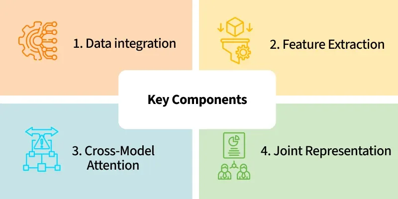

- Data Integration

  MLLMs use algorithms to combine data from multiple sources, ensuring that the information from each modality is accurately represented and integrated.

- Feature Extraction

  The model extracts relevant features from each type of input. For example, it might identify objects and their relationships in an image while understanding the context and meaning of accompanying text.

- Joint Representation

  By creating a joint representation of the multimodal data, the model can make inferences and generate outputs that consider all available information.

- Cross-Modal Attention

  Techniques like cross-modal attention help the model focus on relevant parts of the data from different modalities, improving its ability to generate coherent and contextually appropriate responses.

### Architecture of MLLMs

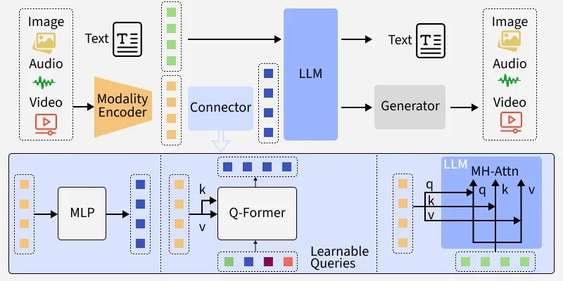

- Modality Encoder

  Specialized neural networks (like CNNs or Vision Transformers for images, audio models for sound and LLMs for text) process each input type, image, audio, video or text and convert them into high-dimensional feature embeddings.

- Connector (Aligner / Projector)

  This module transforms and synchronizes the varied modality embeddings, adapting them so they can be effectively interpreted and used by the central LLM. The connector may use techniques like MLPs, Q-Formers, or learnable queries to project modality features into a compatible space.

- Fusion Mechanism

  Information from all input types is integrated either at the feature level (early fusion), after preliminary processing (late fusion) or at multiple layers (hybrid fusion), enabling rich, context-aware cross-modal understanding.

- LLM Backbone

  The large language model(such as Gemini) serves as the reasoning core. It attends to and uses the fused multi-modal information to generate holistic, context-driven text outputs or to assist in further generative tasks like creating images, audio, or video.

---

## Challenges

### The Memory Problem

The memory problem isn’t a bug or a temporary glitch. It’s a fundamental architectural constraint that affects every Large Language Model (LLM) available today to some extent.

When we send a message to ChatGPT or Claude, these models don’t recall our previous exchanges from some stored memory bank. Instead, they reread the entire conversation from the very beginning, processing every single message from scratch to generate a new response.

The rereading of the conversation happens within something called a **context window**, which functions like a fixed-size notepad where the entire conversation must fit. Every LLM has this notepad with a specific capacity, and once it fills up, the system must erase earlier content to continue writing.

The core reason context windows can’t simply be made larger lies in how LLMs process text through something called the attention mechanism. This mechanism requires every word in the conversation to understand its relationship to every other word. It’s like organizing a meeting where everyone needs to have a one-on-one conversation with everyone else to fully understand the discussion.

The mathematics of this creates a quadratic growth problem, which means that doubling the input doesn’t just double the work, but quadruples it.

### Prompt Injection

Prompt injection is a security risk in artificial intelligence, where attackers manipulate inputs to influence how a language model responds. It exploits how models interpret prompts to produce unintended or harmful outputs.

Types of Prompt Injection:

1. Direct Prompt Injection

   Direct prompt injection involves inserting malicious instructions directly into the prompt, exploiting the model’s ability to process multiple commands in a single input. This type is straightforward and exploits the LLM's ability to process multiple instructions in a single input.

2. Indirect Prompt Injection

   Attackers manipulate the context or influence how the model interprets future inputs by setting a misleading context.

3. Prompt Injection through Social Engineering

   Attackers deceive users into entering malicious prompts unknowingly.

4. Contextual Prompt Injection

   By inserting misleading context early in a conversation, attackers influence how the model responds to later inputs.

Prompt injection follows a step-by-step process where malicious inputs manipulate how the model interprets instructions:

1. Malicious Input Creation

   The attacker crafts a prompt that appears normal but contains hidden or conflicting instructions

2. Model Processing

   The model processes the entire prompt without distinguishing between safe and malicious parts

3. Instruction Override

   The injected instructions override or conflict with the model’s intended behavior

4. Unintended Output

   The model generates responses that may leak data, perform unsafe actions or ignore restrictions

5. Potential Impact

   This can lead to security issues like data leakage, manipulation or unauthorized actions

### AI Hallucinations

AI hallucinations occur when a model generates incorrect, fabricated or misleading outputs that are not grounded in the input or training data. This typically happens when the model incorrectly identifies patterns, leading to unreliable results.

The impact can range from minor factual errors in text-based models to unrealistic outputs in generative systems. For example, a chatbot may provide incorrect answers despite appearing confident.

### Data Leakage

Data leakage occurs when a model unintentionally uses information that would not be available during real-world predictions. This leads to overly optimistic performance during validation, as the model learns patterns it should not have access to, resulting in poor generalization in practical scenarios.

Types of Data Leakage:

- Train-Test Contamination

  Occurs when information from the test dataset is unintentionally used during training. This makes the model appear highly accurate during evaluation but it fails to perform well on unseen real-world data.

- Target Leakage

  Happens when input features contain information that directly or indirectly reveals the target variable. For example, using future data or outcome-related features during training can lead to unrealistic predictions.

- Data Preprocessing Leakage

  Arises when preprocessing steps like scaling, normalization or encoding are applied before splitting the dataset. This allows information from the test set to influence the training process.

- Temporal Leakage

  Common in time-based data, where future information is used to predict past events. Since such data would not be available in real scenarios, it leads to misleading model performance.

---

## Example 1: DeepSeek 1-Pager

DeepSeek R1 used Group Relative Policy Optimization (GRPO), a reinforcement learning technique that improves reasoning efficiency by comparing multiple possible answers within the same context.

### DeepSeek-OCR

Instead of sending long context directly to an LLM, it turns it into an image, compresses that image into visual tokens, and then passes those tokens to the LLM.

Fewer tokens lead to lower computational cost from attention and a larger effective context window. This makes chatbots and document models more capable and efficient.

How is DeepSeek-OCR built? The system has two main parts:

1. Encoder: It processes an image of text, extracts the visual features, and compresses them into a small number of vision tokens.
2. Decoder: A Mixture of Experts language model that reads those tokens and generate text one token at a time, similar to a standard decoder-only transformer.

---

## Example 2: GPT-OSS-120B and GPT-OSS-20B

---

## Example 3: ChatGPT Prompts

1. When you send a query, the mode determines which model to use and how much work the system does.
2. Instant mode sends the query directly to a fast, non-reasoning model named GPT-5-main. It optimizes for latency and is used for simple or low-risk tasks like short explanations or rewrites.
3. Thinking mode uses a reasoning model named GPT-5-thinking that runs multiple internal steps before producing the final answer. This improves correctness on complex tasks like math or planning.
4. Auto mode adds a real-time router. A lightweight classifier looks at the query and decides whether to use GPT-5-main or GPT-5-thinking when deeper reasoning is needed.
5. Auto mode adds a real-time router. A lightweight classifier looks at the query and decides whether to use GPT-5-main or GPT-5-thinking when deeper reasoning is needed.
6. Across all modes, safeguards run in parallel at various stages. A fast topic classifier determines whether the topic is high-risk, followed by a reasoning monitor that applies stricter checks to ensure unsafe responses are blocked.

## Summary

### Evaluation Best Practices

1. Maintain a diverse, evolving eval suite that grows alongside our product.
2. Avoiding overfitting to the eval set is a real risk.
3. Be care the trap of gaming the metrics.
4. Do not neglect edge cases and adversarial examples.
5. Not relying solely on vibes and anecdotes is problematic.
6. In the rush to ship features, evaluation often gets deprioritized. But shipping without evals means we have no idea if we’re making things better or worse.

### Pros and Cons Of LLM Distillation

Benefits of LLM Distillation:

- **Computational Efficiency**: Smaller models require significantly less memory, computation power and storage. They enable LLMs to run on consumer hardware, mobile devices or edge computing environments.
- **Reduced Latency**: A distilled LLM provides faster inference times, making it more suitable for real-time applications such as chatbots and virtual assistants.
- **Lower Energy Consumption**: Deploying a lightweight model results in lower energy usage, which is crucial for sustainability and cost-effective AI solutions.
- **Maintained Performance**: Despite being smaller, a well-distilled model retains much of the accuracy and capabilities of the teacher model.

Challenges in LLM Distillation:

- **Trade-off Between Model Size and Performance**: Reducing model size too much can lead to significant performance degradation and finding the right balance is important for effective distillation.
- **Knowledge Transfer Limitations**: Some complex knowledge from the teacher model may be **lost** in the distillation process.
- **Computational Costs of Distillation**: The process itself is expensive because it requires training the student model on vast amounts of teacher-generated data.
- **Domain-Specific Adaptation**: Some tasks require domain-specific fine-tuning after distillation to ensure high accuracy.

### Fine-tuning vs Transfer Learning

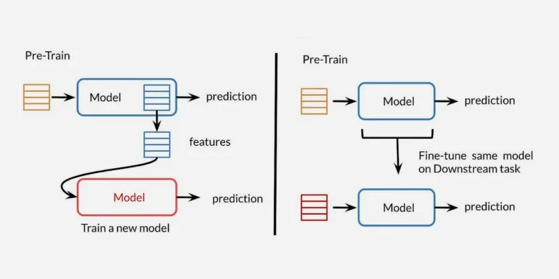

|       **Aspect**        |                    **Transfer Learning**                     |                       **Fine-Tuning**                        |
| :---------------------: | :----------------------------------------------------------: | :----------------------------------------------------------: |
|   **Training Scope**    | Only final layers are retrained; the rest of the model is frozen. | Entire model or specific layers is retrained allowing more adaptation. |
|  **Data Requirements**  | Works well with smaller datasets due to reusing pre-learned features. | May require more data as the model is adjusted more thoroughly. |
| **Computational Cost**  | Less computationally expensive as only the final layers are trained. | More computationally expensive due to retraining the entire model or more layers. |
|    **Adaptability**     | Limited adaptation to new tasks; mainly changes final layers. | More adaptable to new tasks, adjusting both feature extraction and classifier layers. |
| **Risk of Overfitting** | Lower risk of overfitting with smaller datasets since only the final layers are trained. | Higher risk of overfitting, especially with small datasets and a large number of trainable parameters. |

### Prompt Tuning vs Fine-Tuning vs Prompt Engineering

|       **Aspect**       |                   **Prompt Tuning**                   |                    **Fine-Tuning**                     |                    **Prompt Engineering**                    |
| :--------------------: | :---------------------------------------------------: | :----------------------------------------------------: | :----------------------------------------------------------: |
|        **Goal**        |      Improve output by adjusting input prompts.       | Adapt the model to a specific task/domain by training. |     Craft optimal inputs to guide the model's response.      |
| **Model Modification** |       Small learnable parameters or embeddings.       |      Model weights are updated through training.       |             No modification to the model itself.             |
|   **Data Required**    | May use a small amount of additional data for tuning. |    Requires a labeled dataset for the target task.     |         No new data is needed, just refined prompts.         |
|      **Use Case**      | Refining responses with minimal changes to the model. |  Specializing a model for a specific task or domain.   | Enhancing the model's ability to generate specific responses without retraining. |
|     **Complexity**     |                   Moderate to low.                    |               High (requires training).                |                       Low to moderate.                       |

### Full Fine-Tuning vs PEFT

|      **Attribute**      |                    **Full Fine-Tuning**                     |          **PEFT (Parameter-Efficient Fine-Tuning)**          |
| :---------------------: | :---------------------------------------------------------: | :----------------------------------------------------------: |
| **Parameters Updated**  | Updates every parameter of the model (billions of weights). | Updates only a small subset or adds small modules; base model stays frozen. |
| **Compute Requirement** |         Needs very high compute (multi-GPU / TPU).          |         Can run on a single GPU or modest hardware.          |
| **Storage Requirement** |   Stores a full model for each task; heavy storage usage.   |    Stores only small adapter weights; base model reused.     |
|     **Performance**     |       Strong results but expensive and less scalable.       |    Almost same performance but much cheaper and scalable.    |
|    **Practicality**     |     Difficult in low-resource setups; fits large labs.      | Practical for edge devices, startups, universities, research groups. |

### SFT vs General Fine-Tuning

|       **Aspect**       |      **Supervised Fine Tuning (SFT)**       |              **General Fine Tuning**              |
| :--------------------: | :-----------------------------------------: | :-----------------------------------------------: |
| **Data Requirements**  |         Labeled input-output pairs.         |   Unlabeled data, rewards or indirect feedback.   |
|     **Objective**      |         Task-specific performance.          |         General improvement or alignment.         |
|     **Techniques**     | Classification, translation, summarization. |   RLHF, domain adaptation, unsupervised tuning.   |
| **Computational Cost** |          Lower with PEFT methods.           | Higher like RLHF requires training reward models. |
|      **Use Case**      |    Well-defined tasks with labeled data.    | Alignment, open-ended generation, data scarcity.  |

### Fine-Tuning vs Supervised Fine-Tuning (SFT) vs Instruction Fine-Tuning

|       **Aspect**       | **Fine-Tuning**                             | **Supervised Fine-Tuning (SFT)**          | **Instruction Fine-Tuning**                                  |
| :--------------------: | :------------------------------------------ | :---------------------------------------- | :----------------------------------------------------------- |
|    **Primary Goal**    | Adapt to specific task/domain               | Improve task performance with labels      | Enhance instruction following ability                        |
|     **Data Type**      | Task-specific data                          | Labeled task-specific data                | Instruction-response pairs                                   |
|  **Model Adaptation**  | Adjusts model parameters for task           | Uses labels to guide parameter adjustment | Teaches model to map instructions to responses               |
|    **Flexibility**     | Moderate                                    | Moderate                                  | High                                                         |
| **Computational Cost** | Varies by task                              | Generally higher due to labels            | Can be higher due to diverse instructions                    |
|     **Use Cases**      | General-purpose adaptation like NLP and CV. | Task such as classification.              | Instruction-following models like chatbots and multi-task systems. |

### Instruction Tuning vs Multi-task Fine-tuning

|                    **Instruction Tuning**                    |                  **Multi-task Fine-tuning**                  |
| :----------------------------------------------------------: | :----------------------------------------------------------: |
| Teaches the model to follow explicit instructions and generalize across diverse tasks. | Optimize the model's performance on predefined, specific tasks. |
| Enhance adaptability and alignment with user intent for open-ended or novel instructions. | Improve accuracy and efficiency on a set of specialized, task-specific objectives. |
| Prioritize generalization, enabling the model to handle new or unseen instructions and tasks. | Focuses on specialization, limiting the model’s ability to generalize beyond its predefined tasks. |
| Datasets composed of instruction-output pairs covering a wide variety of tasks and instructions. | Task-specific datasets, where each dataset corresponds to a particular task (e.g., sentiment analysis). |

### QLoRA vs LoRA

|        **Aspect**        |                           **LoRA**                           |                          **QLoRA**                           |
| :----------------------: | :----------------------------------------------------------: | :----------------------------------------------------------: |
|      **Definition**      | Adds small low-rank trainable matrices to a pre-trained model for efficient fine-tuning. | Combines LoRA with quantized model weights to reduce memory usage and enable fine-tuning of very large models. |
|     **Memory Usage**     |       Moderate reduction compared to full fine-tuning.       | Significant reduction due to both low-rank adaptation and quantization. |
| **Hardware Requirement** | Can fine-tune large models but may still need high GPU memory. | Can fine-tune extremely large models on consumer-grade GPUs. |
|        **Speed**         | Faster than full fine-tuning but slower than QLoRA for extremely large models. | Faster and more memory-efficient for very large models due to reduced precision. |
|         **Goal**         | Efficient task adaptation while preserving pre-trained weights. |  Efficient adaptation of huge models with minimal hardware.  |
|      **Use Cases**       |    Domain-specific fine-tuning of LLMs like GPT or LLaMA.    | Fine-tuning very large LLMs (tens of billions of parameters) on limited hardware. |

### Constitutional AI vs RLHF

|      **Aspect**      |                    **Constitutional AI**                     |                           **RLHF**                           |
| :------------------: | :----------------------------------------------------------: | :----------------------------------------------------------: |
|    **Definition**    | Uses a predefined set of rules or principles to guide model behavior and self-correct outputs. | Uses human feedback to train a reward model and fine-tune the LLM via reinforcement learning. |
| **Feedback Source**  | Automated evaluation based on the constitution; minimal direct human intervention after initial setup. |           Human judgments and rankings of outputs.           |
| **Training Process** | The model self-rewrites or critiques its responses according to constitutional principles. | The model is rewarded for outputs that align with human preferences via reinforcement learning (e.g., PPO). |
|       **Goal**       | Ensure responses are aligned with ethical, safe or policy-based guidelines. | Align model outputs with human preferences for helpfulness, safety and accuracy. |
|   **Scalability**    | Easier to scale since human input is limited after defining principles. | Requires continuous human feedback which can be resource-intensive. |
|    **Use Cases**     | Safety-focused LLM deployment, reducing harmful or biased outputs. | General-purpose alignment for chatbots and instruction-following models like ChatGPT. |

### Agentic LLMs vs Chat-Based LLMs

|      **Aspect**      |                     **Chat-Based LLMs**                      |                       **Agentic LLMs**                       |
| :------------------: | :----------------------------------------------------------: | :----------------------------------------------------------: |
|    **Definition**    | Respond to user queries based on pre-trained knowledge and context in a conversational manner. | Operate as autonomous agents that plan, reason and take actions to achieve user-defined goals. |
|  **Functionality**   | Generates text responses; limited to answering questions or following instructions in a single turn. | Can interact with tools, APIs, databases and external environments, execute multi-step workflows and perform autonomous reasoning. |
| **Memory & Context** | Usually stateless or short-term context; forgets past interactions unless explicitly maintained. | Maintains short-term and long-term memory, allowing it to remember past actions and decisions over multiple steps. |
| **Decision-Making**  | Minimal or no decision-making; follows instructions passively. | Actively decides next actions, prioritizes tasks and plans sequences of steps to achieve goals. |
| **Tool Integration** | Rarely integrates with external tools; mostly text-only responses. | Can connect to APIs, databases, calculators and other software to gather information or perform actions. |
|    **Use Cases**     | Chatbots, Q&A systems, customer support, casual conversations. | Autonomous agents, RAG pipelines, multi-step task automation, personal assistants and workflow orchestration. |
|    **Complexity**    | Simple prompt-response behavior; lightweight and easier to deploy. | More complex; requires orchestration, tool integration and memory management. |

---

## Reference

[1] [How LLMs See Images, Audio, and More](https://blog.bytebytego.com/p/how-llms-see-images-audio-and-more)

[2] [DeepSeek 1-Pager](https://blog.bytebytego.com/p/ep148-deepseek-1-pager)

[3] [How Transformers Architecture Works?](https://blog.bytebytego.com/i/163736711/how-transformers-architecture-works)

[4] [How LLMs See the World](https://blog.bytebytego.com/i/177034686/how-llms-see-the-world)

[5] [The Memory Problem: Why LLMs Sometimes Forget Your Conversation](https://blog.bytebytego.com/p/the-memory-problem-why-llms-sometimes)

[6] [How Transformers Architecture Powers Modern LLMs](https://blog.bytebytego.com/p/how-transformers-architecture-powers)

[7] [A Guide to LLM Evals](https://blog.bytebytego.com/p/a-guide-to-llm-evals)

[8] [How Large Language Models Learn](https://blog.bytebytego.com/p/how-large-language-models-learn)

[9] [Multimodal LLMs Basics: How LLMs Process Text, Images, Audio & Videos](https://blog.bytebytego.com/p/multimodal-llms-basics-how-llms-process)

[10] [Why is DeepSeek-OCR such a BIG DEAL?](https://blog.bytebytego.com/i/177690588/why-is-deepseek-ocr-such-a-big-deal)

[11] [What is LLM Distillation?](https://www.geeksforgeeks.org/nlp/what-is-llm-distillation/)

[12] [Tokens and Context Windows in LLMs](https://www.geeksforgeeks.org/artificial-intelligence/tokens-and-context-windows-in-llms/)

[13] [What is Fine-Tuning?](https://www.geeksforgeeks.org/deep-learning/what-is-fine-tuning/)

[14] [Low Rank Adaptation (LoRA)](https://www.geeksforgeeks.org/deep-learning/low-rank-adaptation-lora/)

[15] [Fine Tuning Large Language Model (LLM)](https://www.geeksforgeeks.org/deep-learning/fine-tuning-large-language-model-llm/)

[16] [Difference Between Fine-Tuning and Transfer Learning](https://www.geeksforgeeks.org/machine-learning/what-is-the-difference-between-fine-tuning-and-transfer-learning/)

[17] [What is Prompt Tuning?](https://www.geeksforgeeks.org/artificial-intelligence/prompt-tuning/)

[18] [What is Parameter-Efficient Fine-Tuning (PEFT)?](https://www.geeksforgeeks.org/artificial-intelligence/what-is-parameter-efficient-fine-tuning-peft/)

[19] [Supervised Fine-Tuning (SFT) for LLMs](https://www.geeksforgeeks.org/artificial-intelligence/supervised-fine-tuning-sft-for-llms/)

[20] [Fine-Tuning Large Language Models (LLMs) Using QLoRA](https://www.geeksforgeeks.org/nlp/fine-tuning-large-language-models-llms-using-qlora/)

[21] [Fine-Tuning using LoRA and QLoRA](https://www.geeksforgeeks.org/deep-learning/fine-tuning-using-lora-and-qlora/)

[22] [Difference between Fine-Tuning, Supervised fine-tuning (SFT) and Instruction Fine-Tuning](https://www.geeksforgeeks.org/artificial-intelligence/difference-between-fine-tuning-supervised-fine-tuning-sft-and-instruction-fine-tuning/)

[23] [Instruction Tuning for Large Language Models](https://www.geeksforgeeks.org/artificial-intelligence/instruction-tuning-for-large-language-models/)

[24] [Retrieval-Augmented Fine-Tuning (RAFT)](https://www.geeksforgeeks.org/artificial-intelligence/retrieval-augmented-fine-tuning-raft/)

[25] [Constitutional AI](https://www.geeksforgeeks.org/artificial-intelligence/constitutional-ai/)

[26] [Introduction to LangChain](https://www.geeksforgeeks.org/artificial-intelligence/introduction-to-langchain/)

[27] [What is Pre Training and its Objective](https://www.geeksforgeeks.org/artificial-intelligence/what-is-pre-training-and-its-objective/)

[28] [Prompt Injection in LLM](https://www.geeksforgeeks.org/nlp/prompt-injection-in-llm/)

[29] [Introduction to AI Guardrails](https://www.geeksforgeeks.org/artificial-intelligence/what-are-ai-guardrails/)

[30] [AI Hallucinations](https://www.geeksforgeeks.org/artificial-intelligence/hallucination/)

[31] [Data Leakage](https://www.geeksforgeeks.org/machine-learning/data-leakage/)

[32] [How to Evaluate LLMs?](https://www.geeksforgeeks.org/artificial-intelligence/how-to-evaluate-llms/)

[33] [Multimodal Large Language Models](https://www.geeksforgeeks.org/artificial-intelligence/multimodal-large-language-models/)

[34] [Large Language Model (LLM)](https://www.geeksforgeeks.org/artificial-intelligence/large-language-model-llm/)

[35] [What is LLaMA?](https://www.geeksforgeeks.org/artificial-intelligence/what-is-llama/)