# Large Language Model

[TOC]

## Mathematical

### Embedding Vector

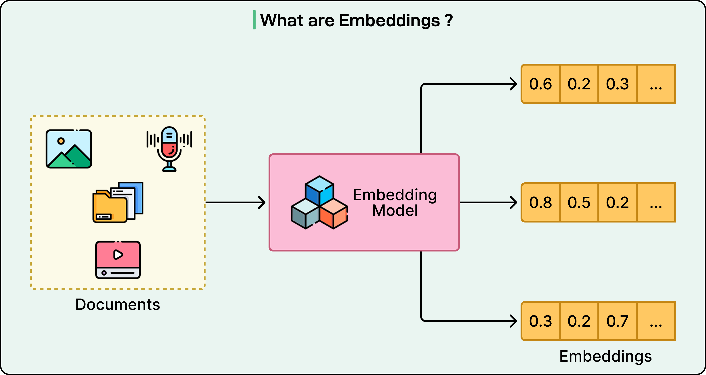

Every type of input, whether text, images, or audio, gets converted into the same type of mathematical representation called embedding vectors. Just as human brains convert light photons, sound waves, and written symbols into uniform neural signals, multimodal LLMs convert diverse data types into vectors that occupy the same mathematical space.

### Loss Functions

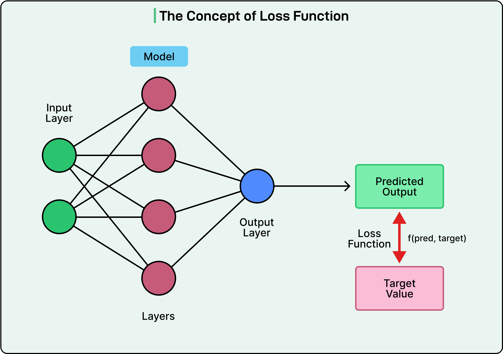

Think of it as a scoring system that provides a single number representing how wrong the model is. The higher the number, the worse the performance. The goal of training is to make this number as small as possible.

A good loss function must satisfy three critical requirements:

1. It must be specific. It needs to measure something concrete and not vague.
2. The loss function must be computable. The computer needs to calculate it quickly and repeatedly.
3. The loss function must be smooth. This is the trickiest requirement to grasp. Smoothness means the function’s output should change gradually as inputs change, without sudden jumps or breaks.

### Gradient Descent

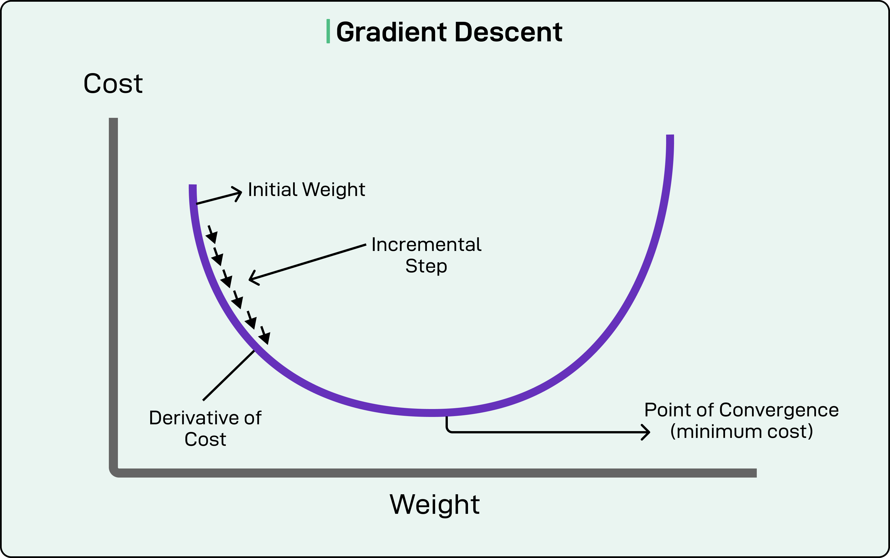

Gradient descent is the algorithm that figures out how to adjust the billions of parameters inside a neural network to reduce the loss.

---

## Workflow

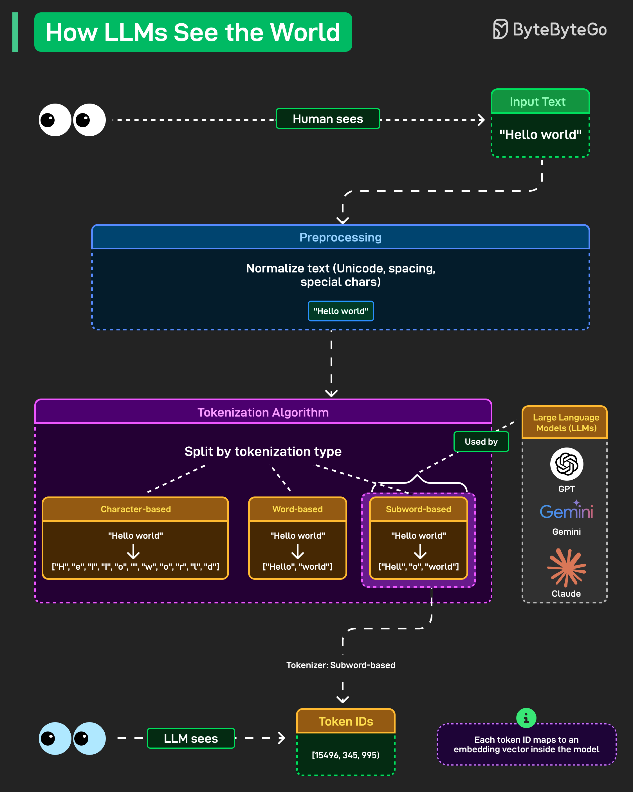

1. Input Text: When you type “Hello world” into ChatGPT or Claude, the model isn’t processing those letters and spaces like you’re reading this post right now. It’s converting everything into numbers through a process most people never think about.
2. Preprocessing: Text gets normalized. Unicode characters, spacing quirks, and special symbols, they all get cleaned up and standardized. “Hello world” becomes a consistent format that the model can actually work with.
3. Tokenization Algorithm: The model splits text into tokens, and there are different approaches.
   - Character-based tokenization breaks everything down to individual characters.
   - Word-based splits on whole words. Cleaner but struggles with rare words and creates a massive vocabulary.
   - Subword-based is what modern LLMs actually use. It balances efficiency with flexibility, handling rare words by breaking them into known subword pieces.

---

## Tokenization

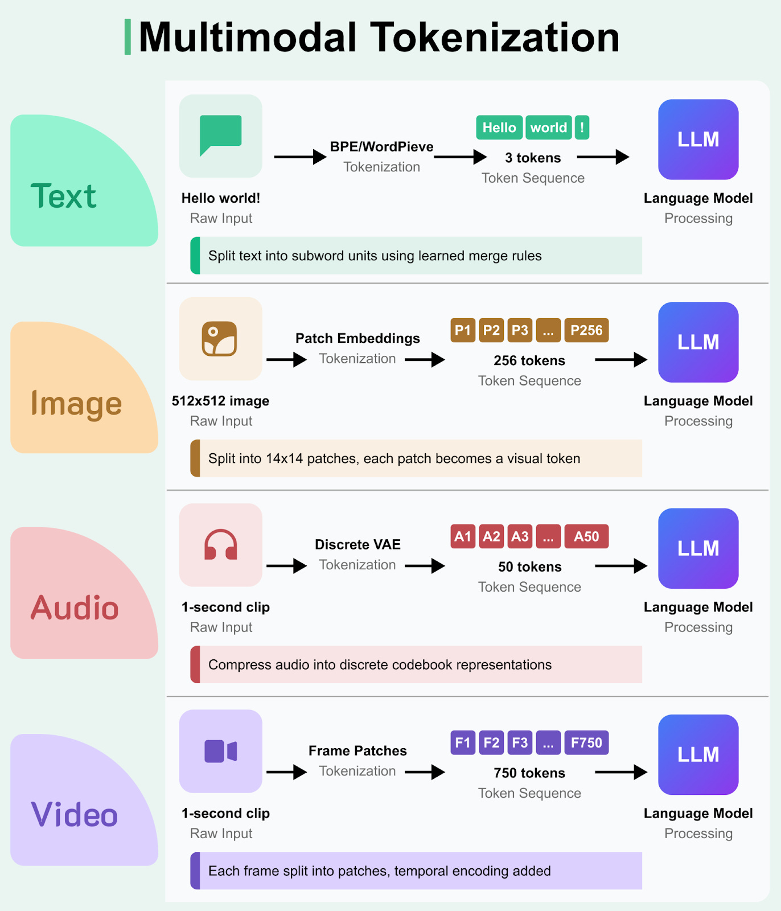

Language models are no longer limited to text. Today's AI systems can understand images, process audio, and even handle video, but they still need to convert everything into tokens first.

Each type of media requires completely different tokenization strategies, each with unique trade-offs between quality, efficiency, and semantic understanding.

### Image Tokenization

#### Patch Embeddings (Vision Transformer Style)

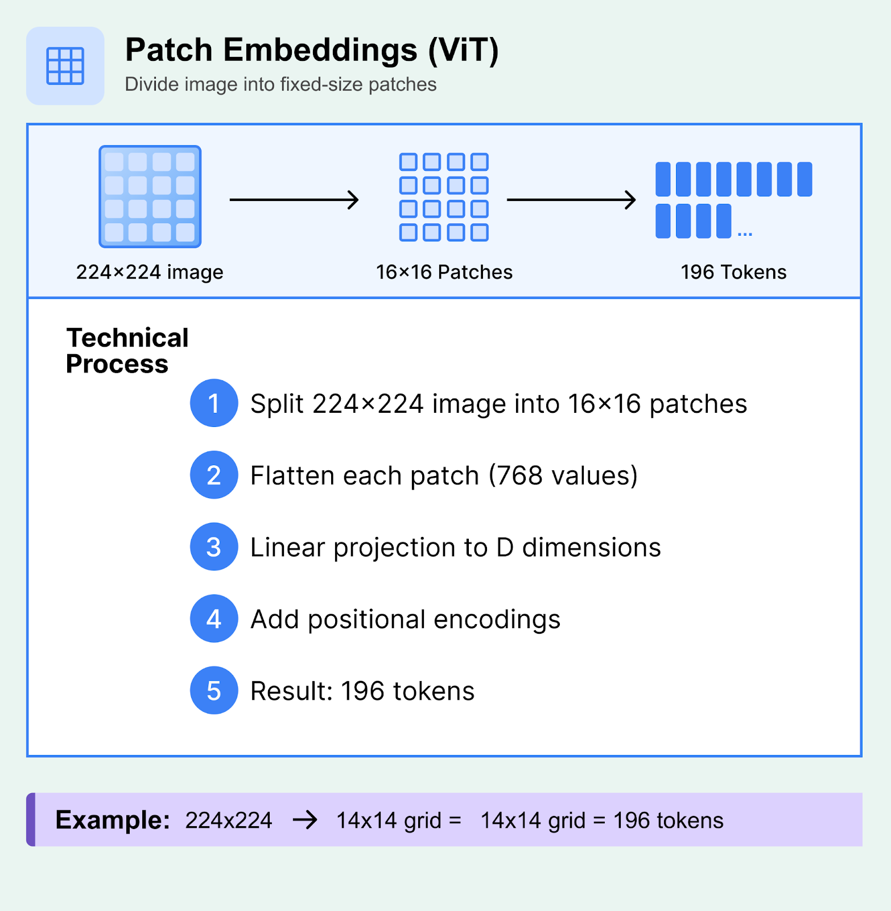

Patch embeddings divide images into fixed-size, non-overlapping “patches”. Each patch is treated as a single token, similar to how words function in text sequences. This allows the image to be processed into understandable units, just like text tokens.

#### Discrete VAE and Vector Quantization

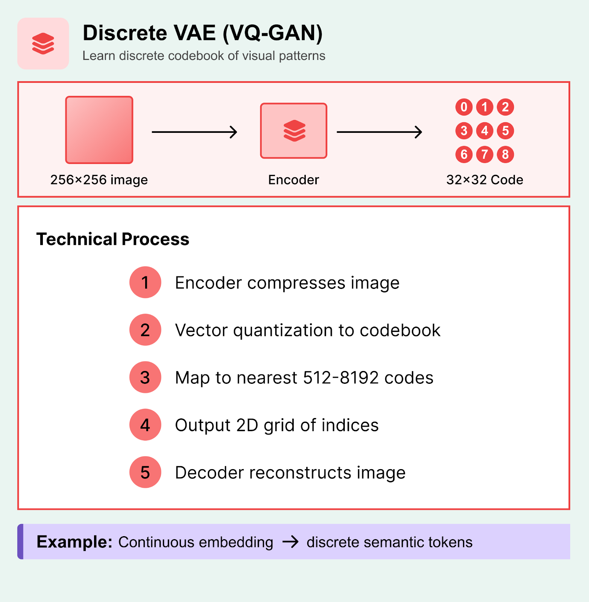

Vector quantization is like creating a visual dictionary. It converts values into “buckets” so that AI can pattern-match image parts into buckets. 

#### CLIP-Style Contrastive Embeddings

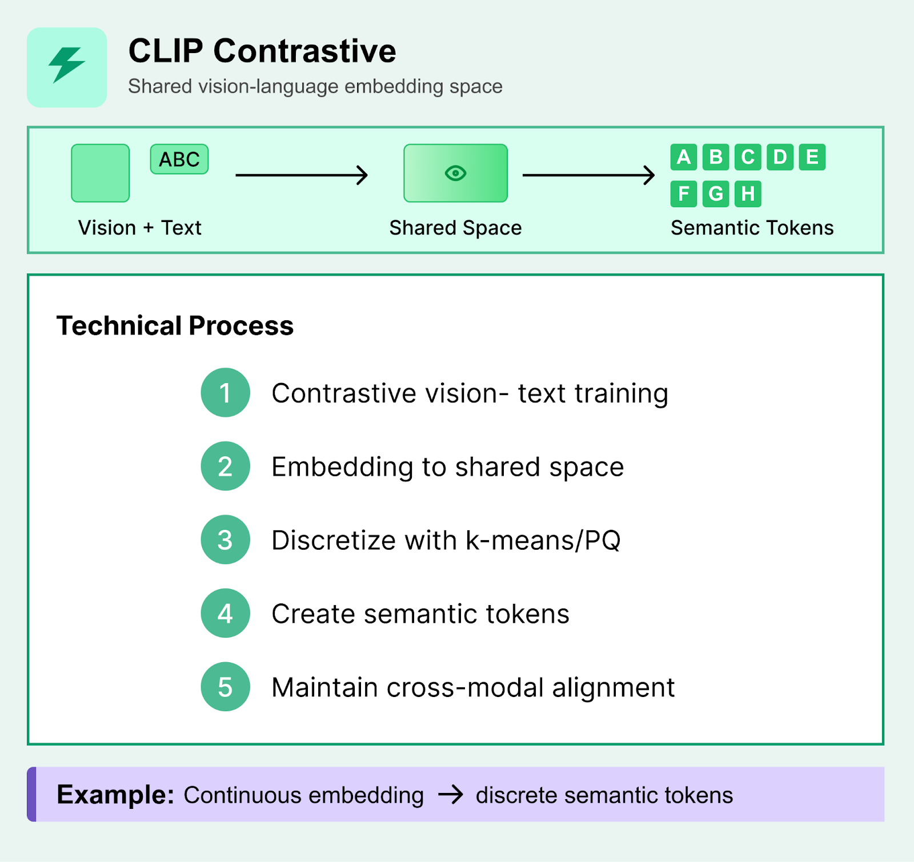

Contrastive learning approaches like CLIP create embeddings in a shared vision-language space, which can then be discretized into pseudo-tokens for downstream tasks.

### Audio Tokenization

#### Codec Tokens (Neural Audio Codecs)

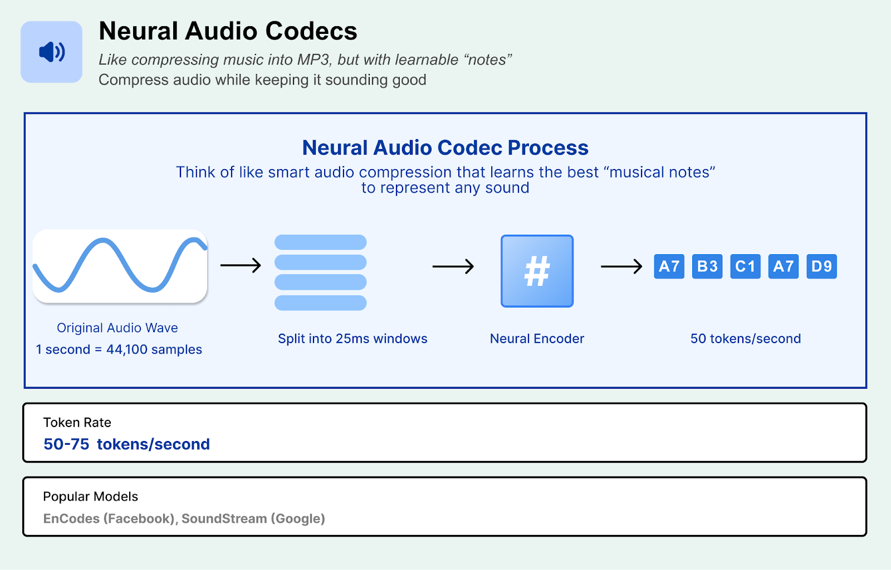

Neural audio codecs like EnCodec and SoundStream compress audio into token sequences while preserving quality. They map audio features to a finite set of learned codes using something called “vector quantization.”

#### Phoneme/Character Tokens (ASR-based)

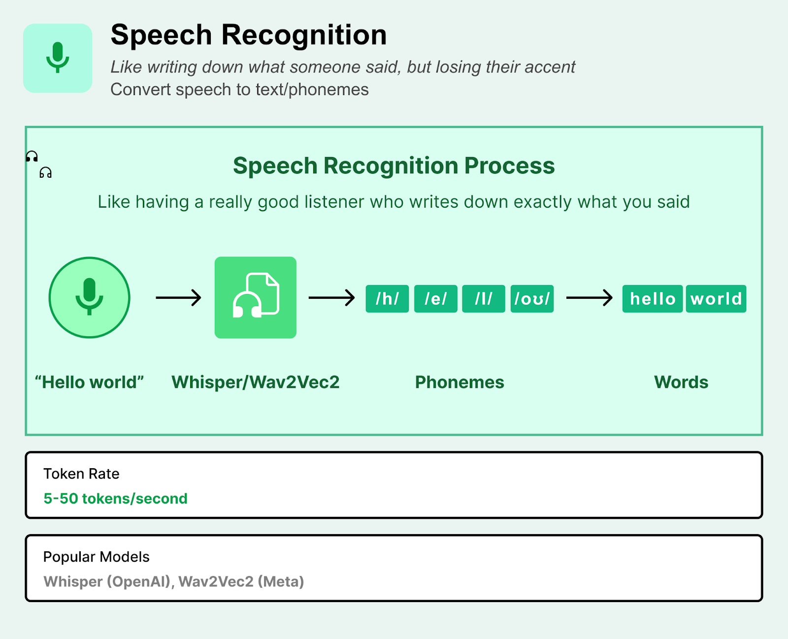

Automatic Speech Recognition converts spoken audio into text representations, creating tokens that capture semantic content but discard acoustic properties.

#### Multi-Scale Token Stacks (Hierarchical Representations)

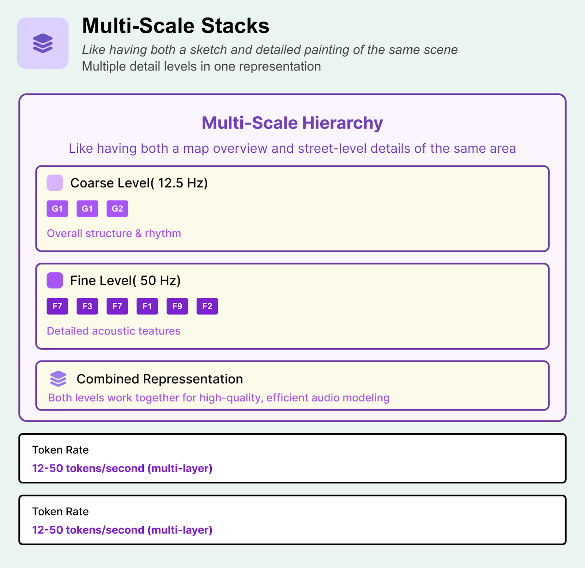

Hierarchical approaches use multiple token sequences at different temporal resolutions to capture both global structure and fine-grained details, similar to multi-scale image or video representations.

### Video Tokenization

The most common way that videos are tokenized today is to turn the video into video frames and send the video in as a sampling of images, with audio attached.

---

## Transformer

### Architecture

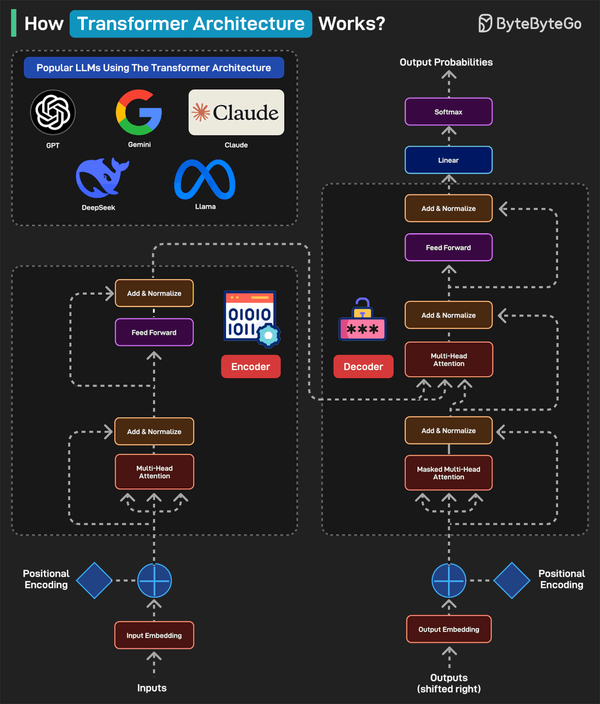

Transformers Architecture has become the foundation of some of the most popular LLMs, including GPT, Gemini, Claude, DeepSeek, and Llama.

### Converting Tokens to Embeddings

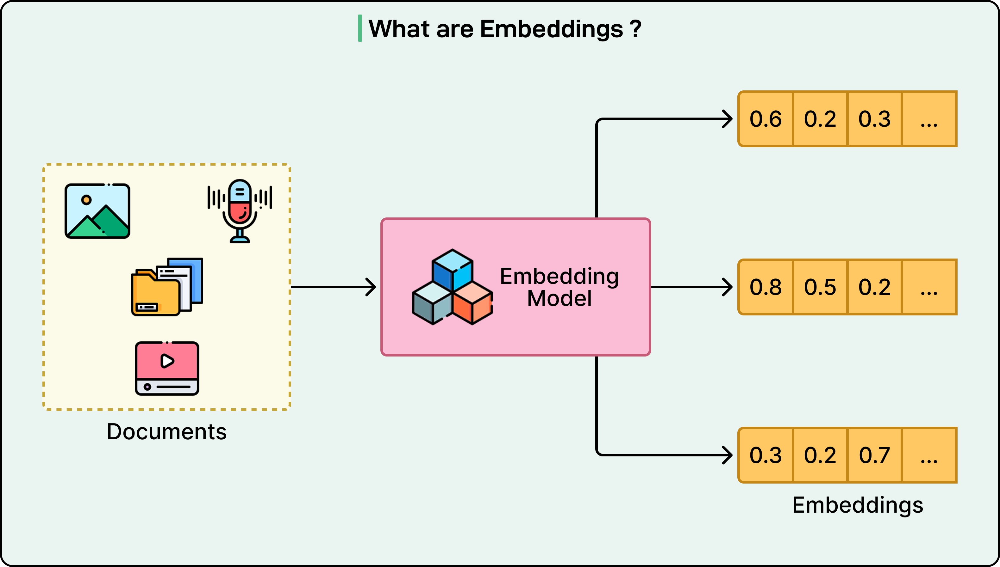

Neural networks cannot work directly with token IDs because they are just fixed identifiers. Each token ID gets mapped to a vector, a list of continuous numbers usually containing hundreds or thousands of dimensions. These are called embeddings.

### Attention Mechanism

The transformer layers implement the attention mechanism, which is the key innovation that makes these models so powerful. Each transformer layer operates using three components for every token: queries, keys, and values. We can think of this as a fuzzy dictionary lookup where the model compares what it is looking for (the query) against all possible answers (the keys) and returns weighted combinations of the corresponding values.

---

## Training

### Training Process

1. Feature Alignment
2. Visual Instruction Tuning

### Fine-Tuning

TODO

---

## Evaluation

### Evaluation Metrics

Beyond task-specific evaluation metrics, we often care about quality dimensions that cut across tasks.

- Is the output relevant to the input?
- Is it coherent and well-structured? Is it factually accurate?
- Is it helpful to the user?
- Does it avoid harmful content?

### Evaluation Process

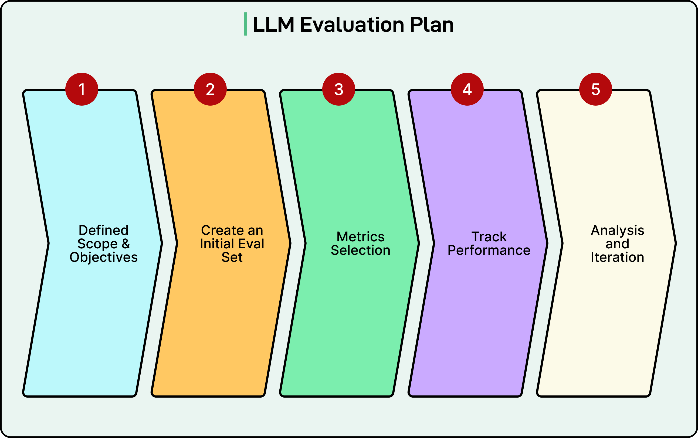

1. Define success for our use case.
2. Create an initial evaluation set.
3. Choose our evaluation approach.
4. Set up an interation cycle.
5. Track performance over time.
6. Version everything

### Automatic Evaluation

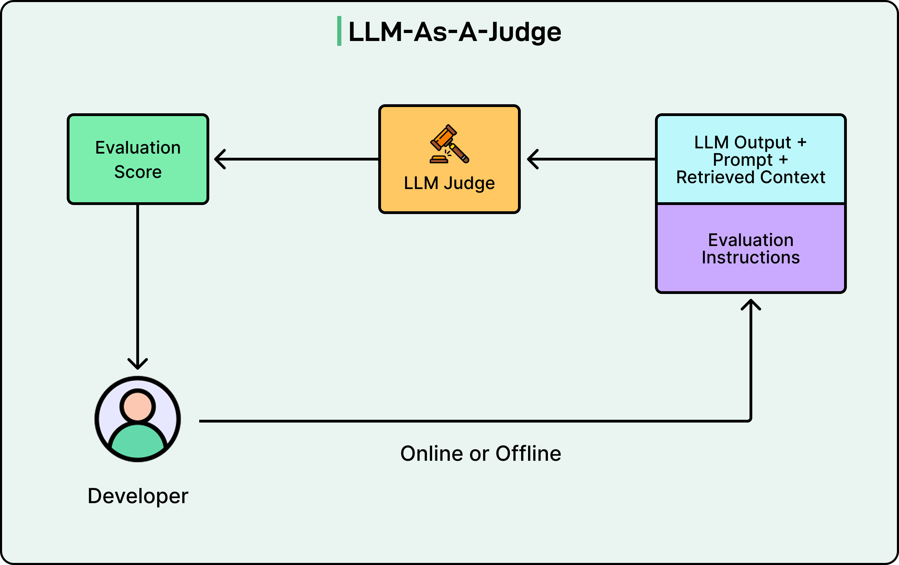

Automatic evaluations are programmatic assessments that can run without human involvement.

Automatic evaluations shine when we need to catch obvious failures, run regression tests to ensure changes don’t break existing functionality, or quickly iterate on prompts. However, they can miss subtle issues that only human judgment would catch.

### Human Evaluation

Human evaluations take several forms. In preference ranking, evaluators compare multiple outputs and select which they prefer. Likert scales ask raters to score outputs on numerical scales across different dimensions. Task completion evaluations test whether the output accomplishes a specific goal.

### Benchmark-Based Evaluations

The ML research community has developed standardized benchmark datasets for evaluating LLMs. These include datasets like MMLU (Massive Multitask Language Understanding) for general knowledge, HellaSwag for common sense reasoning, and HumanEval for code generation.

---

## Distillation

LLM Distillation is a specialized form of Knowledge Distillation(KD) that compresses large-scale LLMs into smaller, faster, and more efficient models while preserving a significant portion of the performance. It enables lightweight models to approximate the capabilities of massive LLMs, making them deployable on a broader range of applications and devices.

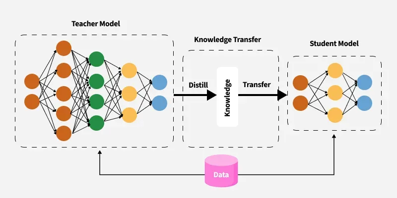

### LLM Distillation Techniques

1. Logit-Based Distillation

   The student model learns from the soft probability distributions of the teacher rather than just hard labels. It uses `Kullback-Leibler (KL)` divergence loss:
   $$
   L_{KD} = T^{2} \sum p_{teacher(x)} \log \frac{p_{teacher(x)}}{p_{student(x)}}
   $$
   where $T$(temperature) smooths the soft probabilities, helping the student generalize better.

2. Feature-Based Distillation

   Instead of just logits, the hidden representations from intermediate layers of the teacher model are transferred to the student. The student learns to mimic internal activations using an `L2 loss` or `mean squared error (MSE)` between corresponding layers.

3. Progressive Layer Dropping

   Instead of using all layers of the teacher model, the student selectively learns from a subset of layers to reduce redundancy.

4. Task-Specific Distillation

   The student model is fine-tuned on specific downstream tasks (e.g., sentiment analysis, summarization) to optimize performance for real-world applications.

---

## Challenges

### The Memory Problem

The memory problem isn’t a bug or a temporary glitch. It’s a fundamental architectural constraint that affects every Large Language Model (LLM) available today to some extent.

When we send a message to ChatGPT or Claude, these models don’t recall our previous exchanges from some stored memory bank. Instead, they reread the entire conversation from the very beginning, processing every single message from scratch to generate a new response.

The rereading of the conversation happens within something called a **context window**, which functions like a fixed-size notepad where the entire conversation must fit. Every LLM has this notepad with a specific capacity, and once it fills up, the system must erase earlier content to continue writing.

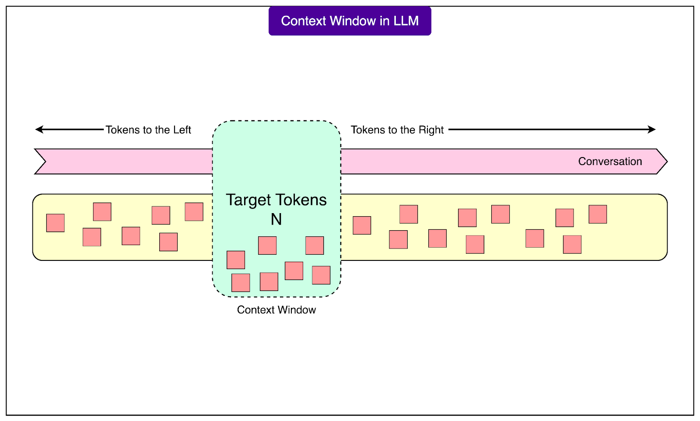

The core reason context windows can’t simply be made larger lies in how LLMs process text through something called the attention mechanism. This mechanism requires every word in the conversation to understand its relationship to every other word. It’s like organizing a meeting where everyone needs to have a one-on-one conversation with everyone else to fully understand the discussion.

The mathematics of this creates a quadratic growth problem, which means that doubling the input doesn’t just double the work, but quadruples it.

---

## Example 1: DeepSeek 1-Pager

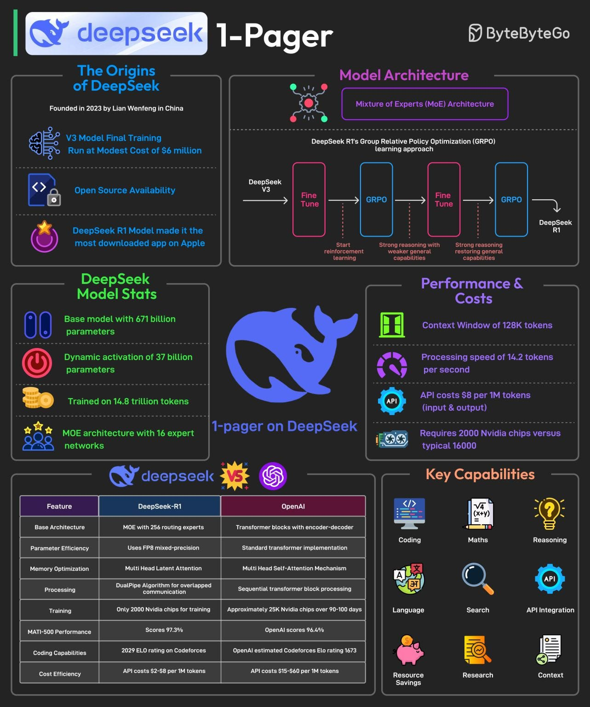

DeepSeek R1 used Group Relative Policy Optimization (GRPO), a reinforcement learning technique that improves reasoning efficiency by comparing multiple possible answers within the same context.

### DeepSeek-OCR

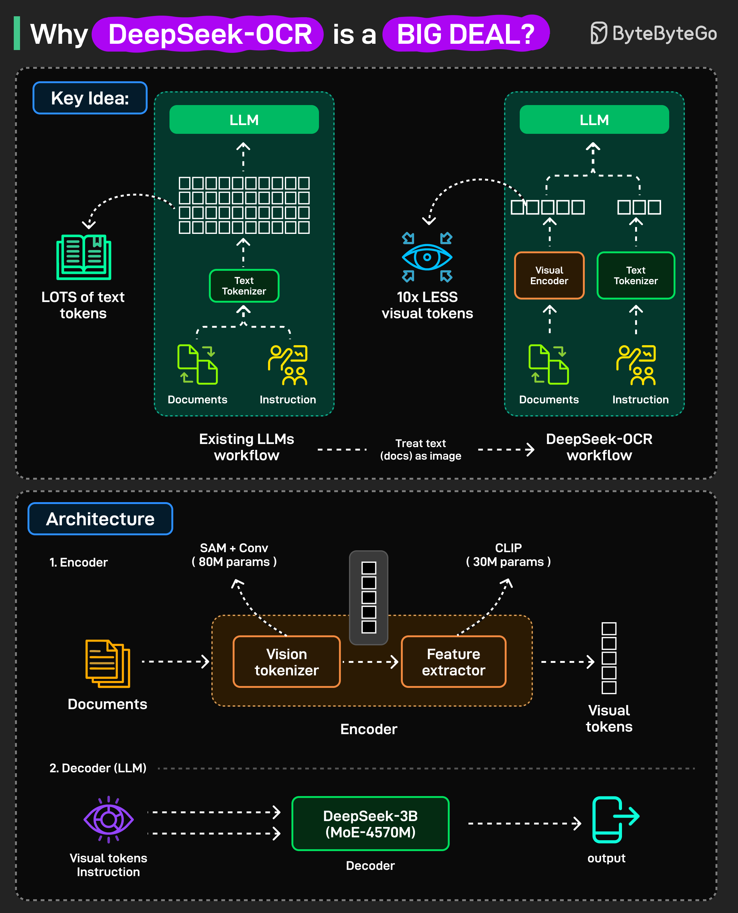

Instead of sending long context directly to an LLM, it turns it into an image, compresses that image into visual tokens, and then passes those tokens to the LLM.

Fewer tokens lead to lower computational cost from attention and a larger effective context window. This makes chatbots and document models more capable and efficient.

How is DeepSeek-OCR built? The system has two main parts:

1. Encoder: It processes an image of text, extracts the visual features, and compresses them into a small number of vision tokens.
2. Decoder: A Mixture of Experts language model that reads those tokens and generate text one token at a time, similar to a standard decoder-only transformer.

---

## Example 2: GPT-OSS-120B and GPT-OSS-20B

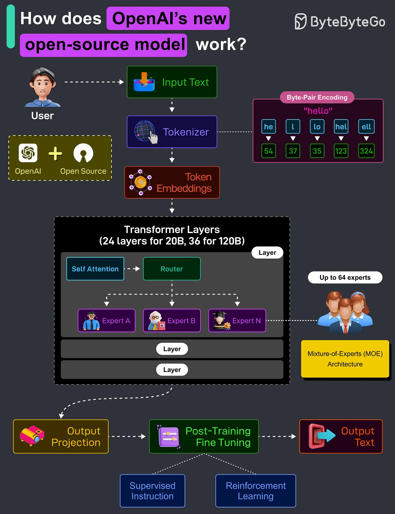

---

## Example 3: ChatGPT Prompts

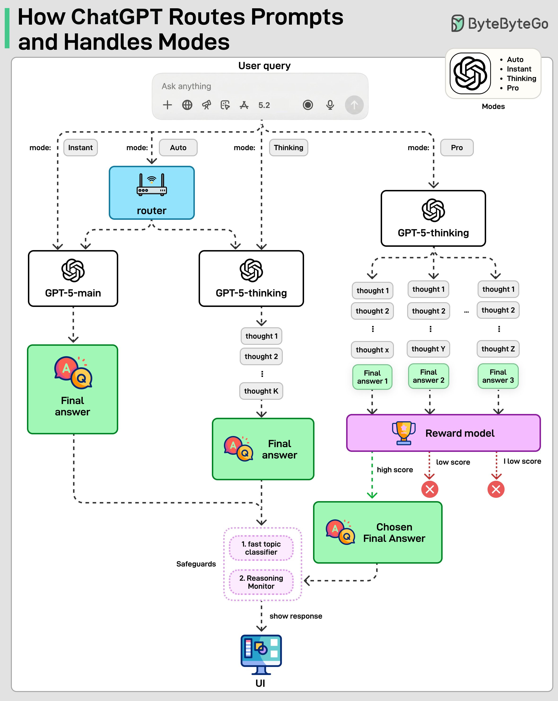

1. When you send a query, the mode determines which model to use and how much work the system does.
2. Instant mode sends the query directly to a fast, non-reasoning model named GPT-5-main. It optimizes for latency and is used for simple or low-risk tasks like short explanations or rewrites.
3. Thinking mode uses a reasoning model named GPT-5-thinking that runs multiple internal steps before producing the final answer. This improves correctness on complex tasks like math or planning.
4. Auto mode adds a real-time router. A lightweight classifier looks at the query and decides whether to use GPT-5-main or GPT-5-thinking when deeper reasoning is needed.
5. Auto mode adds a real-time router. A lightweight classifier looks at the query and decides whether to use GPT-5-main or GPT-5-thinking when deeper reasoning is needed.
6. Across all modes, safeguards run in parallel at various stages. A fast topic classifier determines whether the topic is high-risk, followed by a reasoning monitor that applies stricter checks to ensure unsafe responses are blocked.

---

## Summary

### Evaluation Best Practices

1. Maintain a diverse, evolving eval suite that grows alongside our product.
2. Avoiding overfitting to the eval set is a real risk.
3. Be care the trap of gaming the metrics.
4. Do not neglect edge cases and adversarial examples.
5. Not relying solely on vibes and anecdotes is problematic.
6. In the rush to ship features, evaluation often gets deprioritized. But shipping without evals means we have no idea if we’re making things better or worse.

### Prons and Cons Of LLM Distillation

Benefits of LLM Distillation:

- **Computational Efficiency**: Smaller models require significantly less memory, computation power and storage. They enable LLMs to run on consumer hardware, mobile devices or edge computing environments.
- **Reduced Latency**: A distilled LLM provides faster inference times, making it more suitable for real-time applications such as chatbots and virtual assistants.
- **Lower Energy Consumption**: Deploying a lightweight model results in lower energy usage, which is crucial for sustainability and cost-effective AI solutions.
- **Maintained Performance**: Despite being smaller, a well-distilled model retains much of the accuracy and capabilities of the teacher model.

Challenges in LLM Distillation:

- **Trade-off Between Model Size and Performance**: Reducing model size too much can lead to significant performance degradation and finding the right balance is important for effective distillation.
- **Knowledge Transfer Limitations**: Some complex knowledge from the teacher model may be ***\*lost\**** in the distillation process.
- **Computational Costs of Distillation**: The process itself is expensive because it requires training the student model on vast amounts of teacher-generated data.
- **Domain-Specific Adaptation**: Some tasks require domain-specific fine-tuning after distillation to ensure high accuracy.

---

## Reference

[1] [How LLMs See Images, Audio, and More](https://blog.bytebytego.com/p/how-llms-see-images-audio-and-more)

[2] [DeepSeek 1-Pager](https://blog.bytebytego.com/p/ep148-deepseek-1-pager)

[3] [How Transformers Architecture Works?](https://blog.bytebytego.com/i/163736711/how-transformers-architecture-works)

[4] [How LLMs See the World](https://blog.bytebytego.com/i/177034686/how-llms-see-the-world)

[5] [The Memory Problem: Why LLMs Sometimes Forget Your Conversation](https://blog.bytebytego.com/p/the-memory-problem-why-llms-sometimes)

[6] [How Transformers Architecture Powers Modern LLMs](https://blog.bytebytego.com/p/how-transformers-architecture-powers)

[7] [A Guide to LLM Evals](https://blog.bytebytego.com/p/a-guide-to-llm-evals)

[8] [How Large Language Models Learn](https://blog.bytebytego.com/p/how-large-language-models-learn)

[9] [Multimodal LLMs Basics: How LLMs Process Text, Images, Audio & Videos](https://blog.bytebytego.com/p/multimodal-llms-basics-how-llms-process)

[10] [Why is DeepSeek-OCR such a BIG DEAL?](https://blog.bytebytego.com/i/177690588/why-is-deepseek-ocr-such-a-big-deal)

[11] [What is LLM Distillation?](https://www.geeksforgeeks.org/nlp/what-is-llm-distillation/)