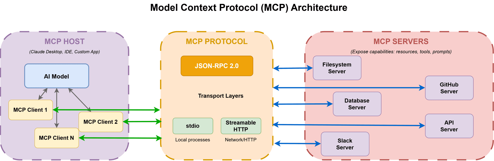
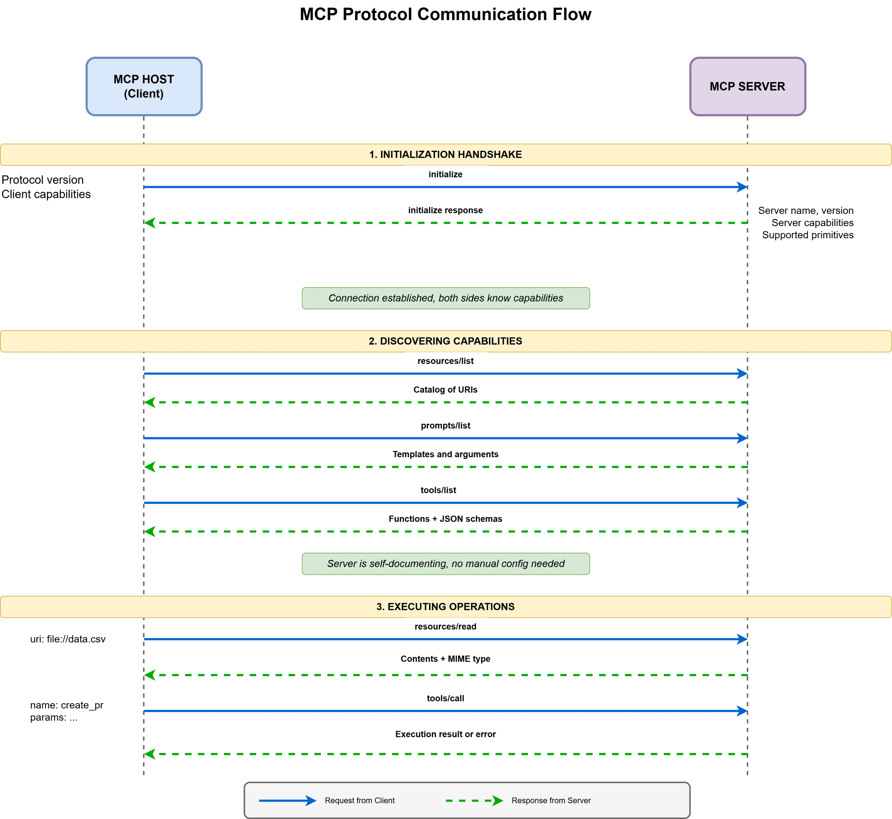

# Model Context Protocol

[TOC]


MCP (Model Context Protocol) is an open-source standard for connecting AI applications to external systems.


## Architecture



The key participants in the MCP architecture are:

- MCP Host: The AI application that coordinates and manages one or multiple MCP clients.
- MCP Clients: A component that maintains a connection to an MCP server and obtains context from an MCP server for the MCP host to use.
- MCP Server: A program that provides context to MCP cleints.

This architecture provides a clean separation of concerns:

- Hosts focus on orchestrating AI workflows without concerning themselves with data source specifics.
- Servers expose capabilities without knowing how models will use them.
- The protocol handles communication details transparently.

### Data Layer

The data layer implements a JSON-RPC 2.0 based exchange protocol that defines the message structure and semantics. 

This layer includes:

- Lifecycle management

  MCP is a stateful protocol that requires lifecycle management. The purpose of lifecycle management si to negotiate the capabilities that both client and server support.

  For example:

  ```json
  Initialize Request
  {
    "jsonrpc": "2.0",
    "id": 1,
    "method": "initialize",
    "params": {
      "protocolVersion": "2025-06-18",
      "capabilities": {
        "elicitation": {}
      },
      "clientInfo": {
        "name": "example-client",
        "version": "1.0.0"
      }
    }
  }
  ```

  ```json
  Initialize Response
  {
    "jsonrpc": "2.0",
    "id": 1,
    "result": {
      "protocolVersion": "2025-06-18",
      "capabilities": {
        "tools": {
          "listChanged": true
        },
        "resources": {}
      },
      "serverInfo": {
        "name": "example-server",
        "version": "1.0.0"
      }
    }
  }
  ```

- Server features

- Client features

- Utility features

### Transport Layer

The transport layer manages communication channels and authentication between clients and servers. It handles connection establishment, message framing, and secure communication between MCP participants. 

MCP suppoorts two transport mechanisms:

- Stdio(Standard Input/Ouput) transport
- Streamable HTTP transport


## Core Primitives

### Resources

Resources represent any data that can be read. This includes file contents, database records, API responses, live sensor data, or cached computations. Each resource uses a URI scheme, which makes it easy to identify and access different types of data.

### Prompts

Prompts provide reusable templates for common tasks. They encode expert knowledge and simplify complex instructions.

### Tools

Tools are functions a model can invoke to perform actions or computations. Unlike resources, which are read-only, or prompts, which provide guidance, tools modify state. Tools allow models to act, not just observe.


## Communication Flow



### Initialization Handshake

Communication between a host and an MCP server begins with a handshake that establishes the connection and negotiates supported features.

### Discovering Capabilities

Once initialization completes, the host can query the server for available capabilities.

### Executing Operations

With MCP, accessing resources is straightforward. The client sends a `resources/read` request with the resource URI. The server returns the contents, MIME type, and relevant metadata.


## Security

TODO


## Reference

[1] [Gihub/Model Context Protocol](https://github.com/modelcontextprotocol)

[2] [The Complete Guide to Model Context Protocol](https://machinelearningmastery.com/the-complete-guide-to-model-context-protocol/)

[3] [What is the Model Context Protocol (MCP)?](https://modelcontextprotocol.io/docs/getting-started/intro)