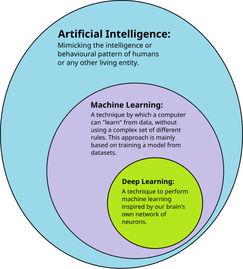
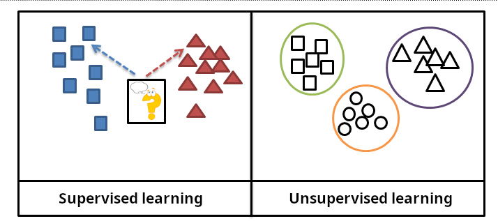
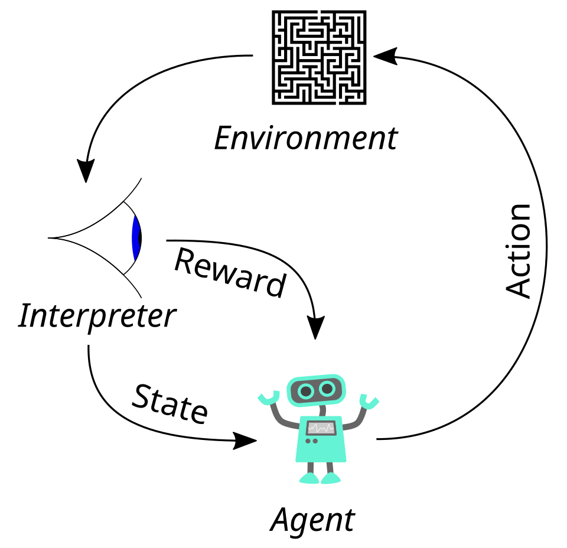
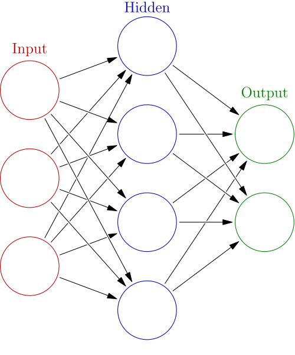
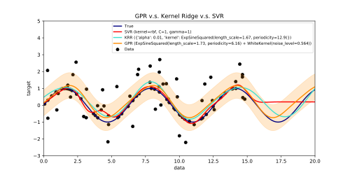

# Machine Learning

[TOC]

## Intro

Machine Learning(ML) is a subset of artificial intelligence(AI) focused on algorithms that can "learn" the patterns of training data and, subsequently, make accurate `inferences` about new data. This pattern recognition ability enables machine learning models to make decisions or predictions without explicit, hard-coded instructions.

ML finds application in many fields, including natural language processing, computer vision, speech recognition, email filtering, agriculture, and medicine. The application of ML to business problems is known as predictive analytics.

*Deep learning is a subset of machine learning, which is itself a subset of artificial intelligence.*

## Approaches

Machine learning approaches are traditionally divided into three broad categories, which correspond to learning paradigms, depending on the nature of the "signal" or "feedback" available to the learning system:

- **Supervised learning**: The computer is presented with example inputs and their desired outputs, given by a "teacher", and the goal is to learn a general rule that maps inputs to outputs.
- **Unsupervised learning**: No labels are given to the learning algorithm, leaving it on its own to find structure in its input. Unsupervised learning can be a goal in itself (discovering hidden patterns in data) or a means towards an end (feature learning).
- **Reinforcement learning**: A computer program interacts with a dynamic environment in which it must perform a certain goal. As it navigates its problem space, the program is provided feedback that's analogous to rewards, which it tries to maximise.
- **Other types**

**Note: Although each algorithm has advantages and limitations, no single algorithm works for all problems.**

### Supervised learning

Supervised learning algorithms train models for tasks requiring accuracy. Supervised machine learning powers both state-of-the-art deep learning models and a wide array of traditional ML models still widely employed across industries.

The types of supervised-learning algorithms include:

- classification
- regression
- ...

#### Self-supervised learning

Labeling data can become prohibitively costly and time-consuming for complex tasks and large datasets. Self-supervised learning entails training on tasks in which a supervisory signal is obtained directly from unlabeled data--hence "self" supervised.

#### Semi-supervised learning

Semi-supervised learning comprises techniques that use information from the available labeled data to make assumptions about the unlabeled data points so that the latter can be incorporated into supervised learning workflows.

### Unsupervised learning

Unsupervised learning algorithms find structures in data that has not been labelled, classified or categorized. Instead of responding to feedback, unsupervised learning algorithms identify commonalities in the data and react based on the presence or absence of such commonalities in each new piece of data.

### Reinforcement learning

Whereas supervised learning trains models by optimizing them to match ideal exemplars and unsupervised learning algorithms fit themselves to a dataset, reinforcement learning models are trained holistically through trial and error. In RL literature, an AI system is often referred to as an "agent".

## Deep Learning

In machine learning, deep learning(DL) focuses on utilizing multilayered neural networks to perform tasks such as classification, regression, and representation learning. The field takes inspiration from biological neuroscience and revolves around stacking artificial neurons into layers and "training" them to process data.

Deep learning algorithms can be applied to unsupervised learning tasks. This is an important benefit because unlabeled data is more abundant than the labeled data.

### Deep neural networks

A deep neural network(DNN) is an artificial neural network with multiple layers between the input and output layers. There are different types of neural networks, but they always consist of the same components: neurons, synapses, weights, biases, and functions. These components as a whole function in a way that mimics functions of the human brain, and can be trained like any other ML algorithm.

### Artificial neural networks(ANNs)

Artificial neural networks (ANNs), or connectionist systems, are computing systems vaguely inspired by the biological neural networks that constitute animal brains. Such systems "learn" to perform tasks by considering examples, generally without being programmed with any task-specific rules.

### Recurrent neural networks(CNNs)

Recurrent neural networks(RNNs) are designed to work on sequential data. Whereas a conventional feedforward neural network maps a single output, RNNs map a sequence of inputs to an output by operating in a recurrent loop in which the output for a given step in the input sequence serves as input to the computation for the following step. In effect, this creates an internal "memory", called the `hidden` state, that allows RNNs to understand context and order.

### Convolutional neural networks(CNNs)

Convolutional neural networks(CNNs) are used in computer vision. CNNs also have been applied to acoustic modeling for automatic speech recognition(ASR).

### Transformer models

The transformer model is a type of neural network architecture tha texcells at processing sequential data, most prominently associated with alrge language models (LLMs). Transformer models have also achieved elite performance in other fields of artificial intelligence(AI), such as computer vision, speech recognition and time series forecasting.

### Autoencoder

An autoencoder is a type of neural network architecture designed to efficiently compress (encode) input data down to its essential features, then reconstruct (decode) the original input from this compressed representation.

### Mamba model

Mamba is a neural network architecture, derived from state space models (SSMs), used for language modeling and other sequence modeling tasks. The Mamba architecture's fast inference speed and computational efficiency, particularly for long sequences, make it the first competitive alternative to the transformer architecture for autoregressive large language models(LLMs).

### Graph neural network

TODO

## Generative AI

TODO

## Models

A **machine learning model** is a type of mathematical model that, once "trained" on a given dataset, can be used to make predictions or classifications on new data. During training, a learning algorithm iteratively adjusts the model's internal parameters to minimise errors in it's predictions. By extension, the term "model" can refer to several levels of specificity, from a general class of models and their associated learning algorithms to a fully trained model with all its internal parameters tuned.

### Decision trees

Decision tree learning uses a **decision tree** as a predictive model to go from observations about an item(represented in the branches) to conclusions about the item's target value (represented in the leaves). It is one of the predictive modelling approaches used in statistics, data mining, and machine learning. Tree models where the target variable can take a discrete set of values are called classification trees; in these tree structures, leaves represent class labels, and branches represent conjunctions of features that lead to those class labels. Decision trees where the target variable can take continuous values (typically real numbers) are called regression trees.

### Random forest regression

Random forest regression(RFR) falls under the umbrella of decision tree-based models. RFR is an ensemble learning method that builds multiple decision trees and averages their predictions to improve accuracy and to avoid overfitting. To build decision trees, RFR uses bootstrapped sampling. RFR generates independent decision trees, and it can work on single-output data as well as multiple regressor tasks. This makes RFR compatible to be use in various applications.

### Support-vector machines

Support-vector machines (SVMs), also known as support-vector networks, are a set of related supervised learning methods used for classification and regression. Given a set of training example, each marked as belonging to one of two categories, an SVM training algorithm builds a model that predicts whether a new example falls into one category.

### Regression analysis

Regression analysis encompasses a large variety of statistical methods to estimate the relationship between input variables and their associated features.

### Bayesian networks

A Bayesian network, belief network, or directed acyclic graphical model is a probabilistic graphical model that represents a set of random variables and their conditional independence with a directed acyclic graph(DAG).

### Gaussian processes

A Gaussian process is a stochastic process in which every finite collection of the random variables in the process has a multivariate normal distribution, and it relies on a pre-defined covariance function, or kernel, that models how pairs of points relate to each other depending on their locations.

### Genetic algorithms

A genetic algorithm(GA) is a search algorithm and heuristic technique that mimics the process of natural selection, using methods such as mutation and crossover to generate new genotypes in the hope of finding good solutions to a given problem.

### Belief functions

The theory of belief functions, also referred to as evidence theory or Dempster-Shafer theory, is a general framework for reasoning with uncertainty, with understood connections to other frameworks such as probability, possibility and imprecise probability theories.

### Rule-based models

Rule-based machine learning (RBML) is a branch of machine learning that automatically discovers and learns 'rule' from data. It provides interpretable models, making it useful fo decision-making in fields like healthcare, fraud detection, and cybersecurity.

### Training models

Typically, machine learning models require a high quantity of reliable data to perform accurate predictions. When training a machine learning model, machine learning engineers need to target and collect a large and representative sample of data.S

### Federated learning

Federated learning is an adapted form of distributed artificial intelligence to train machine learning models that decentralises the training process, allowing for users' privacy to be maintained by not needing to send their data to a centralised server. This also increases efficiency by decentralising the training process to many devices.

## Reference

[1] [WIKIPEDIA: Machine learning](https://en.wikipedia.org/wiki/Machine_learning)

[2] [WIKIPEDIA: Deep Learning](https://en.wikipedia.org/wiki/Deep_learning)

[3] [IBM: What is machine learning?](https://www.ibm.com/think/topics/machine-learning)

[4] [IBM: What is a transformer model?](https://www.ibm.com/think/topics/transformer-model#1280257394)

[5] Ashish Vaswani; Noam Shazeer; Niki Parmar; Jakob Uszkoreit; Llion Jones; Aidan N. Gomez; Łukasz Kaiser; Illia Polosukhin . Attention Is All You Need

[6] [IBM: What is an autoencoder?](https://www.ibm.com/think/topics/autoencoder#763338462)

[7] [IBM: What is a Mamba model?](https://www.ibm.com/think/topics/mamba-model#763338463)

[8] [IBM: What is a GNN (graph neural network)?](https://www.ibm.com/think/topics/graph-neural-network#763338464)

