# Machine Learning

[TOC]

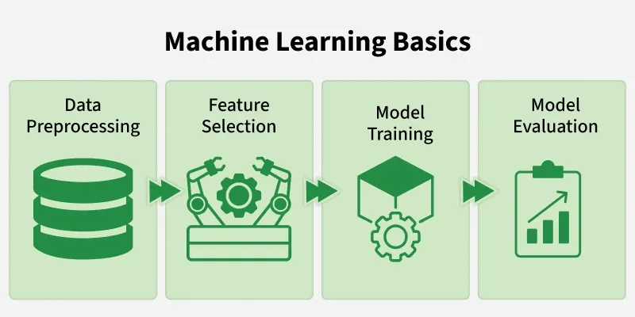

Machine learning is a branch of Artificial Intelligence that focuses on developing models and algorithms that let computers learn from data without being explicitly programmed for every task. In simple words, ML teaches systems to think and understand like humans by learning from the data.

## Intro

### Hierarchy

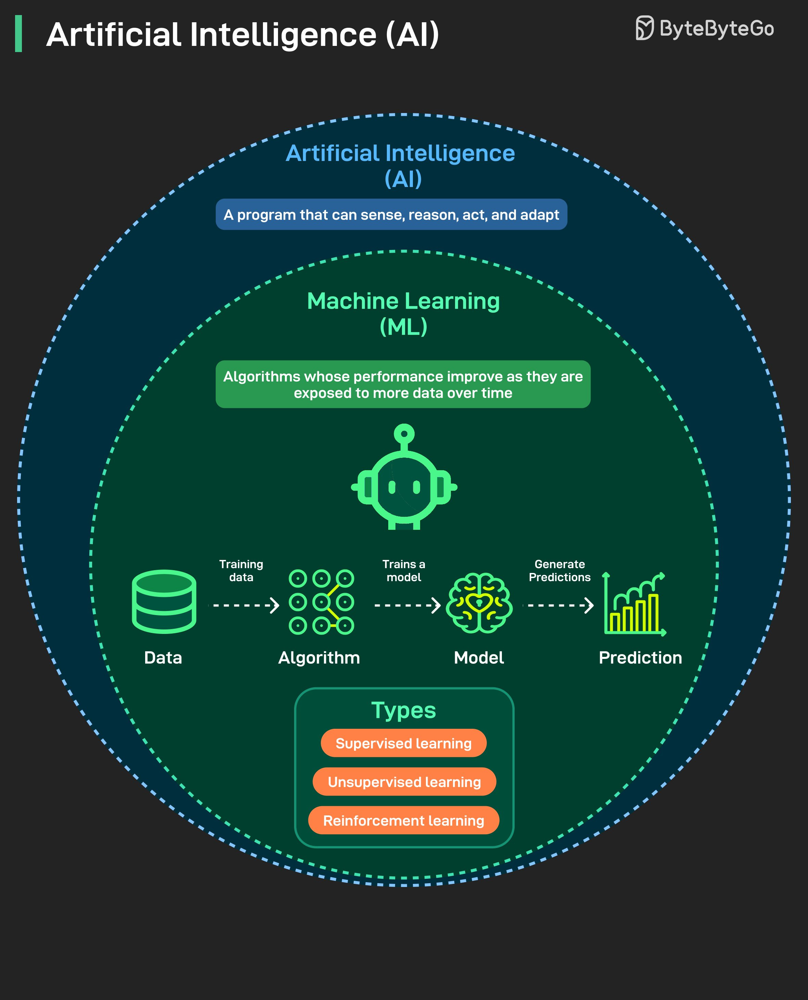

ML finds application in many fields, including natural language processing, computer vision, speech recognition, email filtering, agriculture, and medicine. The application of ML to business problems is known as predictive analytics.

### Types

Machine Learning is mainly divided into three core types:

- Supervised learning

  Trains models on labeled data to predict or classify new, unseen data.

- Unsupervised learning

  Finds patterns or groups in unlabeled data, like clustering or dimensionality reduction.

- Reinforcement learning

  Learns through trial and error to maximize rewards, ideal for decision-making tasks.

- Other: 

  - Self-Supervised Learning
  - Semi-Supervised Learning

**Note: Although each algorithm has advantages and limitations, no single algorithm works for all problems.**

### Deep Learning

In machine learning, [Deep Learning(DL)](dl.md) focuses on utilizing multilayered neural networks to perform tasks such as classification, regression, and representation learning. The field takes inspiration from biological neuroscience and revolves around stacking artificial neurons into layers and "training" them to process data.

Deep learning algorithms can be applied to unsupervised learning tasks. This is an important benefit because unlabeled data is more abundant than labeled data.

---

## Workflow

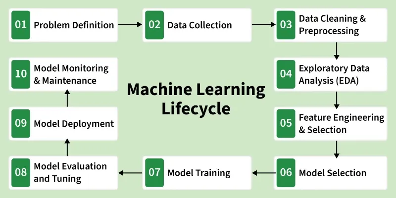

1. Problem Definition

   The first step is identifying and clearly defining the business problem. A well-framed problem provides the foundation for the entire lifecycle. Important things like project objectives, desired outcomes and the scope of the task are carefully designed during this stage.

2. Data Collection

   The data collection phase involves the systematic collection of datasets that can be used as raw data to train the model. The quality and variety of data directly affect the model’s performance.

3. Data Cleaning & Preprocessing

   Raw data is often messy and unstructured, and if we use this data directly to train, then it can lead to poor accuracy. We need to do data cleaning and preprocessing, which often involves:

4. Exploratory Data Analysis (EDA)

   To find patterns and characteristics hidden in the data, Exploratory Data Analysis (EDA) is used to uncover insights and understand the dataset's structure. During EDA, patterns, trends, and insights are provided that may not be visible to the naked eye. This valuable insight can be used to make an informed decision.

5. Feature Engineering & Selection

   Feature engineering and selection is a transformative process that involves selecting only relevant features to enhance model efficiency and prediction while reducing complexity.

6. Model Selection

   For a good machine learning model, model selection is a very important part, as we need to find a model that aligns with our defined problem, the nature of the data, the complexity of the problem, and the desired outcomes.

7. Model Training

   With the selected model, the machine learning lifecycle moves to the model training process. This process involves exposing the model to historical data, allowing it to learn patterns, relationships, and dependencies within the dataset.

8. Model Evaluation and Tuning

   Model evaluation involves rigorous testing against validation or test datasets to test the accuracy of the model on new unseen data. It provides insights into the model's strengths and weaknesses. If the model fails to achieve desired performance levels, we may need to tune the model again and adjust its hyperparameters to enhance predictive accuracy.

9. Model Deployment

   The model is ready for deployment for real-world applications. It involves integrating the predictive model with existing systems, allowing businesses to use it for informed decision-making.

10. Model Monitoring & Maintenance

    After deployment, models must be monitored to ensure they perform well over time. Regular tracking helps detect data drift, accuracy drops, or changing patterns, and retraining may be needed to keep the model reliable in real-world use.

### Data Cleaning

Data cleaning is the process of preparing raw data by detecting and correcting errors so it can be effectively used for analysis. It is a foundational step in data preprocessing that ensures datasets are suitable for analytical, statistical and machine learning tasks.

Data Cleaning Process:

1. Assess Data Quality

   The first step in data cleaning is to assess the quality of your data. This involves checking for:

   - Missing Values
   - Incorrect Values
   - Inconsistencies in Data Format

2. Remove Irrelevant Data

   Removing irrelevant or duplicate data ensures the dataset is clean, accurate, and meaningful, preventing skewed analysis and improving overall quality.

3. Fix Structural Errors

   Structural errors occur when data formats, naming conventions, or variable types are inconsistent, which can affect analysis accuracy. Correcting these issues ensures uniform and reliable data representation.

4. Handle Missing Data

   Missing data can introduce bias and reduce the reliability of the analysis. Properly addressing missing values helps maintain the integrity of your dataset.

5. Normalize Data

   Data normalization organizes the dataset to reduce redundancy and ensure consistency, making it easier to manage and analyze.

6. Identify and Manage Outliers

   Outliers are data points that deviate significantly from the rest of the dataset and can affect analysis accuracy. Properly handling them ensures more reliable insights.

### Data Preprocessing

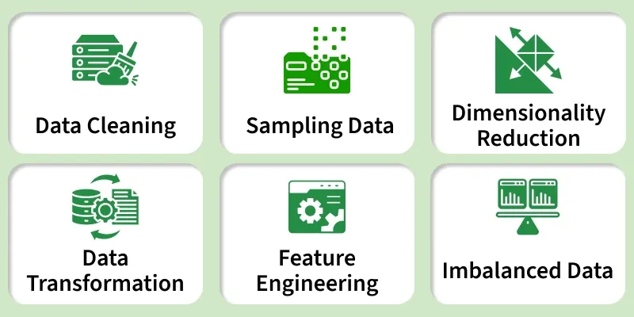

Data preprocessing involves cleaning, transforming, and organizing raw data to ensure it is accurate, consistent, and ready for modeling.

### Feature Engineering

Well-designed Feature engineering is the process of creating, transforming or selecting important features from raw data to improve model performance. These features help the model capture useful patterns and relationships in the data.

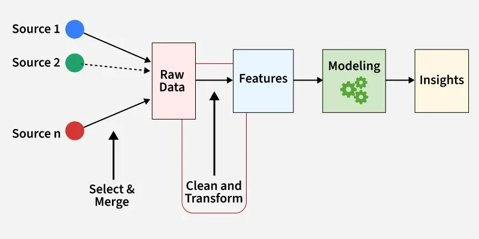

#### Feature Creation

Feature creation involves generating new features from domain knowledge or by observing patterns in the data. It can be:

- Domain-specific

  Created based on industry knowledge, like business rules.

- Data-driven

  Derived by recognizing patterns in data.

- Synthetic

  Formed by combining existing features.

#### Feature Transformation

Transformation adjusts features to improve model learning:

- Normalization & Scaling

  Adjust the range of features for consistency.

- Encoding

  Converts categorical data to numerical form, i.e., one-hot encoding.

- Mathematical transformations

  Like logarithmic transformations for skewed data.

#### Feature Extraction

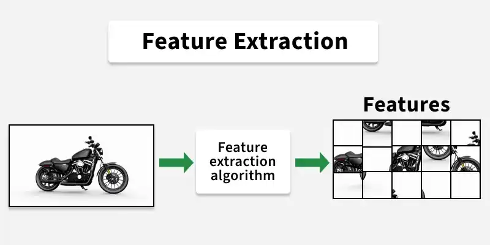

Transform existing features into a lower-dimensional or more informative representation (e.g., PCA).

1. Statistical Methods

   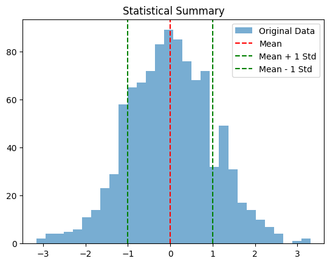

   Statistical methods are used in feature extraction to summarize and explain patterns of data.

2. Dimensionality reduction

   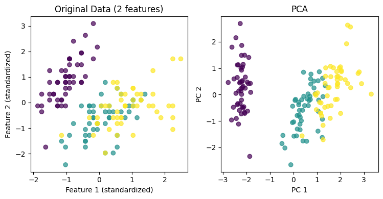

   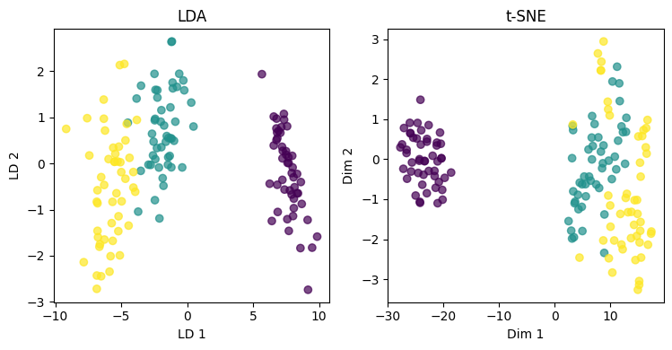

   Techniques like PCA(Principal Component Analysis), LDA(Linear Discriminant Analysis), and t-SNE(t-Distributed Stochastic Neighbor Embedding) reduce features while preserving important information.

3. Feature Extraction for Textual Data

   In Natural Language Processing (NLP), we often convert raw text into a format that machine learning models can understand.

4. Signal Processing Methods

   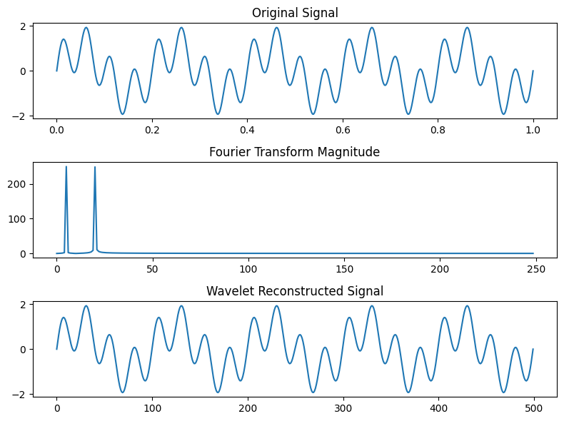

   It is used for analyzing time-series, audio, and sensor data.

5. Image Data Extraction

   

   Techniques for extracting features from images.

6. Aggregation & Combination

   Summing or averaging features to simplify the model.

#### Feature Selection

Feature selection involves choosing a subset of relevant features to use:

1. Filter methods

   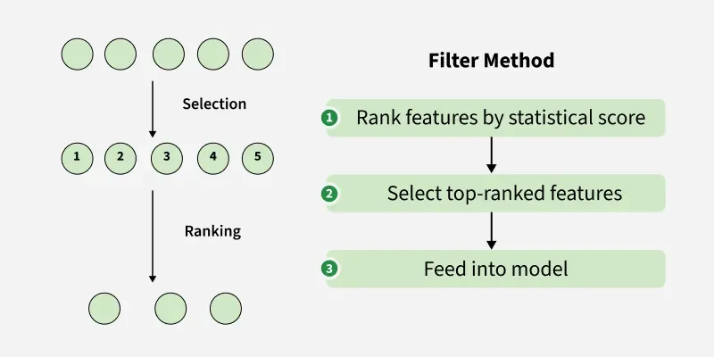

   Based on statistical measures like correlation.

2. Wrapper methods

   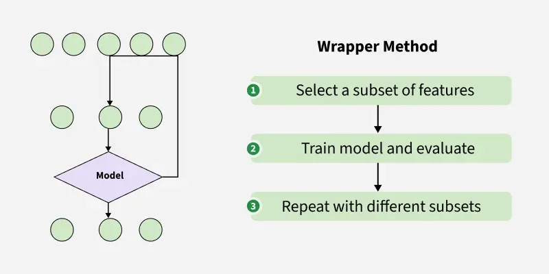

   Select based on model performance.

3. Embedded methods

   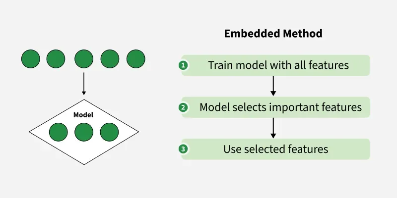

   Feature selection is integrated within model training.

#### Feature Scaling

Scaling ensures that all features contribute equally to the model. Include:

1. Absolute Maximum Scaling

   Absolute Maximum Scaling is a feature scaling method where each value is divided by the maximum absolute value of that feature. This transformation rescales the data so that values fall within the range of −1 to 1.

   Scaling Formula: $X_{scaled} = \frac{X_i}{max(|X|)}$.

2. Min-Max Scaling

   Min-Max Scaling rescales features by subtracting the minimum value and dividing by the difference between the maximum and minimum values. This usually maps feature values to the range 0 to 1 while preserving the original distribution.

   Scaling Formula: $X_{scaled} = \frac{X_i - X_{min}}{X_{max} - X_{min}}$.

3. Normalization (Vector normalization)

   Normalization scales each data sample so that its vector length (Euclidean norm) becomes 1. It focuses on the direction of data points rather than their magnitude, making it useful in tasks like text classification and clustering.

   Scaling Formula: $X_{scaled} = \frac{X_i}{||X||}$

   where

   - $X_i$ is each individual value.
   - $||X||$ represents the Euclidean norm (or length) of the vector $X$.
   - Normalizes each sample to unit length.
   - Useful for direction-based similarity metrics.

4. Standardization

   Standardization scales features by subtracting the mean and dividing by the standard deviation. This transforms the data so that features have zero mean and unit variance, which helps many machine learning models perform better.

   Scaling Formula: $X_{scaled} = \frac{X_i - \mu}{\sigma}$

   where

   - $\mu$ = mean, $\sigma$ = standard deviation.
   - Produces features with mean 0 and variance 1.
   - Effective for data approximately normally distributed.

5. Robust Scaling

   Robust Scaling scales features using the median and interquartile range (IQR) instead of the mean and standard deviation. This makes it less sensitive to outliers and skewed data, making it suitable for datasets with extreme values or noise.

   Scaling Formula: $X_{scaled} = \frac{X_i - X_{median}}{IQR}$

### Model Selection

### Model Training

### Model Evaluation and Tuning

#### Regularization

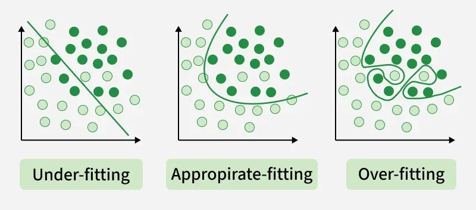

Regularization is a technique used in machine learning to prevent overfitting, which otherwise causes models to perform poorly on unseen data. By adding a penalty for complexity, regularization encourages simpler and more generalizable models.

Type of Regularization:

1. Lasso Regression

   A regression model which uses the L1 Regularization technique is called LASSO (Least Absolute Shrinkage and Selection Operator) regression. It adds the absolute value of magnitude of the coefficient as a penalty term to the loss function(L). This penalty can shrink some coefficients to zero which helps in selecting only the important features and ignoring the less important ones.
   $$
   Cost = \frac{1}{n} \sum_{i = 1}^{n}(y_i - \hat{y_i})^{2} + \lambda \sum_{j = 1}^{m}|W_j|
   $$
   where:

   - $m$: Number of Features
   - $n$: Number of Examples
   - $y_i$: Actual Target Value
   - $\hat{y_i}$: Predicted Target Value

2. Ridge Regression

   A regression model that uses the L2 regularization technique is called Ridge regression. It adds the squared magnitude of the coefficient as a penalty term to the loss function(L). It handles multicollinearity by shrinking the coefficients of correlated features, reducing their variance and preventing any single feature from dominating the model.
   $$
   Cost = \frac{1}{n}\sum_{i = 1}^{n}(y_i - \hat{y_i})^{2} + \lambda\sum_{j = 1}^{m}W_{j}^{2}
   $$
   where:

   - $n$: Number of examples or data points.
   - $m$: Number of features i.e predictor variables.
   - $y_i$: Actual target value for the $i$th example.
   - $\hat{y_i}$: Predicted target value for the $i$th example.
   - $W_i$: Coefficients of the features.
   - $\lambda$: Regularization parameter that controls the strength of regularization.

3. Elastic Net Regression

   Elastic Net Regression is a combination of both L1 as well as L2 regularization. It combines both L1 (absolute values) and L2 (squared values) penalties on the coefficients. With the help of an extra hyperparameter that controls the ratio of the L1 and L2 regularization.
   $$
   Cost = \frac{1}{n}\sum_{i = 1}^{n}(y_i - \hat{y_i})^{2} + \lambda((1 - \alpha)\sum_{j = 1}^{m}|W_j| + \alpha\sum_{j = 1}^{m}W_{j}^{2})
   $$
   where:

   - $n$: Number of examples (data points)
   - $m$: Number of features (predictor variables)
   - $y_i$: Actual target value for the $i$th example
   - $\hat{y_i}$: Predicted target value for the $i$the example
   - $W_i$: Coefficients of the features.
   - $\lambda$: Regularization parameter that controls the strength of regularization.
   - $\alpha$: Mixing parameter where $0 \leq \alpha \leq 1$ and $\alpha = 1$ corresponds to Lasso($L_1$) regularization, $\alpha = 0$ corresponds to Ridge ($L_2$) regularization and Values between 0 and 1 provide a balance of both L1 and L2 regularization.

#### Confusion Matrix

Confusion matrix is a simple table used to measure how well a classification model is performing. It compares the predictions made by the model with the actual results and shows where the model was right or wrong. This helps you understand where the model is making mistakes so you can improve it. It breaks down the predictions into four categories:

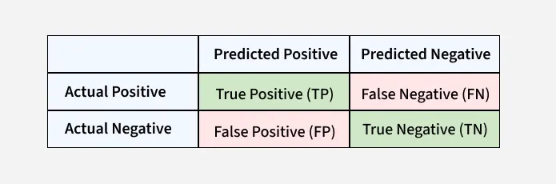

- True Positive (TP): The model correctly predicted a positive outcome i.e the actual outcome was positive.
- True Negative (TN): The model correctly predicted a negative outcome i.e the actual outcome was negative.
- False Positive (FP): The model incorrectly predicted a positive outcome i.e the actual outcome was negative. It is also known as a Type I error.
- False Negative (FN): The model incorrectly predicted a negative outcome i.e the actual outcome was positive.

Metrics Based on Confusion Matrix Data:

1. Accuracy

   Accuracy shows how many predictions the model got right out of all the predictions. It gives idea of overall performance but it can be misleading when one class is more dominant over the other. It can be calculated using the below formula:
   $$
   Accuracy = \frac{TP + TN}{TP + TN + FP + FN}
   $$

2. Precision

   Precision focus on the quality of the model’s positive predictions. It tells us how many of the "positive" predictions were actually correct. It is important in situations where false positives need to be minimized such as detecting spam emails or fraud. The formula of precision is:
   $$
   Precision = \frac{TP}{TP + FP}
   $$

3. Recall

   Recall measures how how good the model is at predicting positives. It shows the proportion of true positives detected out of all the actual positive instances. High recall is essential when missing positive cases has significant consequences like in medical tests.
   $$
   Recall = \frac{TP}{TP + FN}
   $$

4. F1-Score

   F1-score combines precision and recall into a single metric to balance their trade-off. It provides a better sense of a model’s overall performance particularly for imbalanced datasets. It is helpful when both false positives and false negatives are important though it assumes precision and recall are equally important but in some situations one might matter more than the other.
   $$
   F1 - Score = \frac{2 \cdot Precision \cdot Recall}{Precisioon + Recall}
   $$

5. Specificity

   Specificity is another important metric in the evaluation of classification models particularly in binary classification. It measures the ability of a model to correctly identify negative instances. Specificity is also known as the True Negative Rate Formula is given by:
   $$
   Specificity = \frac{TN}{TN + FP}
   $$

6. Type 1 and Type 2 error

   - Type 1 error: It occurs when the model incorrectly predicts a positive instance but the actual instance is negative. This is also known as a false positive. Type 1 Errors affect the precision of a model which measures the accuracy of positive predictions.
     $$
     \text{Type 1 Error} = \frac{FP}{FP + Tn}
     $$

   - Type 2 error: This occurs when the model fails to predict a positive instance even though it is actually positive. This is also known as a **false negative**. Type 2 Errors impact the **recall** of a model which measures how well the model identifies all actual positive cases.
     $$
     \text{Type 2 Error} = \frac{FN}{TP + FN}
     $$

#### Precision

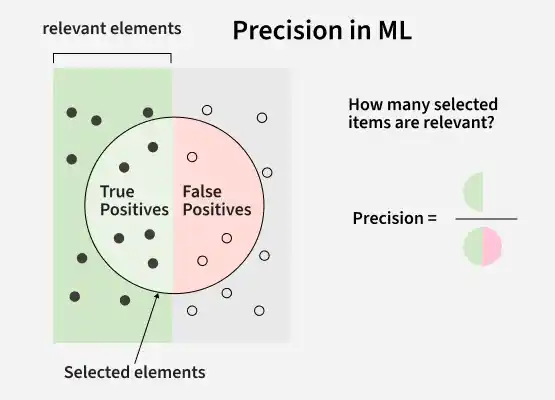

Precision is the ratio between the True Positives and all the Positives. It shows how many of the “yes” predictions made by the model were actually correct. It helps us reduce wrong “yes” guesses which are called false positives (FP). Precision is calculated as:
$$
\text{Precision} = \frac{True Positives (TP)}{\text{True Positives(TP)} + \text{False Positives (FP)}}
$$

#### Recall

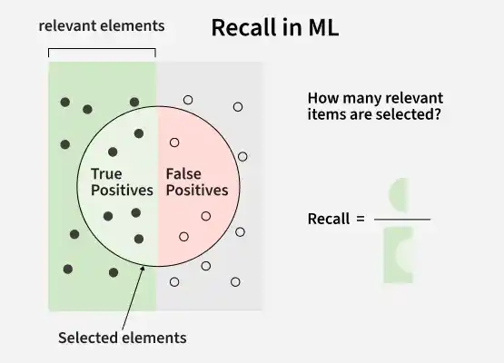

Recall tells us how well a model finds all the correct “yes” cases in the data. It checks how many real positive cases the model was able to correctly identify. The formula to calculate recall is:
$$
\text{Recall} = \frac{\text{True Positives (TP)}}{\text{True Positives (TP)} + \text{False Negatives (FN)}}
$$

#### F1 Score

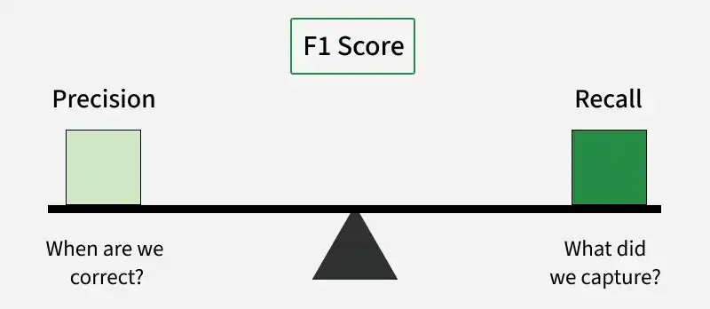

F1 Score is a metric used to evaluate the performance of a classification model. It combines [precision](#Precision) and [recall](#Recall) into a single value and is especially useful when the dataset has imbalanced classes. It helps evaluate a model by balancing both precision and recall.
$$
\text{F1 Score} = 2 \times \frac{Precision \times Recall}{Precision + Recall}
$$
The F1 score becomes high only when both precision and recall are high. If either of them decreases significantly, the F1 score will also decrease.

#### AUC-ROC Curve

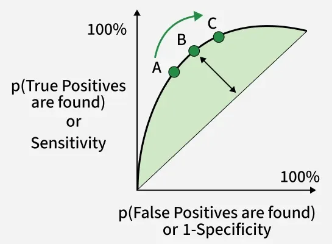

AUC-ROC curve is a graph used to check how well a binary classification model works. It helps us to understand how well the model separates the positive cases, like people with a disease, from the negative cases, like people without the disease, at different threshold levels. It shows how good the model is at telling the difference between the two classes by plotting:

- **True Positive Rate (TPR):** How often the model correctly predicts the positive cases also known as Sensitivity or Recall.
- **False Positive Rate (FPR):** How often the model incorrectly predicts a negative case as positive.
- **Specificity:** Measures the proportion of actual negatives that the model correctly identifies. It is calculated as 1 - FPR.

The AUC measures the model's ability to assign higher predicted probabilities to the positive class than to the negative class. Here’s how it work:

1. **Randomly choose a pair**: Pick one data point from the positive class (Class 1) and one from the negative class (Class 0).
2. **Check if the positive point has a higher predicted probability**: If the model assigns a higher probability to the positive data point than to the negative one for correct ranking.
3. **Repeat for all pairs**: We do this for all possible pairs of positive and negative examples.

#### Cross Validation

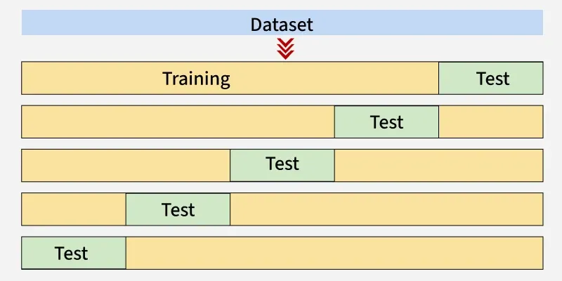

Cross-validation is a technique used to check how well a machine learning model performs on unseen data while preventing overfitting.

Validation Techniques:

1. Holdout Validation

   In Holdout Validation, the dataset is split into training and testing sets. Common splits include 70–30, 80–20 or 75–25 depending on the dataset size and problem. Making it simple and quick to apply.

2. LOOCV (Leave One Out Cross Validation)

   In this method the model is trained on the entire dataset except for one data point which is used for testing. This process is repeated for each data point in the dataset.

3. Stratified Cross-Validation

   It is a technique that ensures each fold of the cross-validation process has the same class distribution as the full dataset. This is useful for imbalanced datasets where some classes are underrepresented.

4. K-Fold Cross Validation

   K-Fold Cross Validation splits the dataset into **k** equal-sized folds. The model is trained on **k-1** folds and tested on the remaining fold. This process is repeated **k** times, each time using a different fold for testing.

5. Repeated K-Fold Cross Validation

   This method repeats the K-Fold cross-validation process multiple times with different random splits. It helps reduce the effect of randomness in data splitting and provides a more robust performance estimate.

#### Hyperparameter Tunning

Hyperparameter tuning is the process of selecting the optimal values for a machine learning model's hyperparameters. These are typically set before the actual training process begins and control aspects of the learning process itself. Effective tuning helps the model learn better patterns, avoid overfitting or underfitting and achieve higher accuracy on unseen data.

The two best strategies for Hyperparameter tuning are:

1. GridSearchCV

   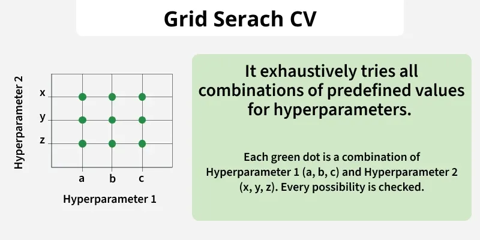

   GridSearchCV is a brute-force technique for hyperparameter tuning. It trains the model using all possible combinations of specified hyperparameter values to find the best-performing setup. It is slow and uses a lot of computer power, which makes it hard to use with big datasets or many settings.

2. RandomizedSearchCV

   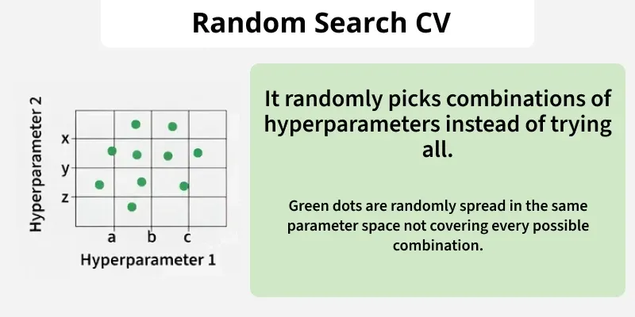

   As the name suggests RandomizedSearchCV picks random combinations of hyperparameters from the given ranges instead of checking every single combination like GridSearchCV.

3. Bayesian Optimization

   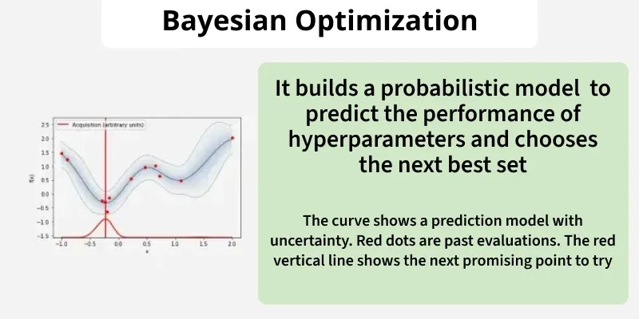

   Grid Search and Random Search can be inefficient because they blindly try many hyperparameter combinations, even if some are clearly not useful. Bayesian Optimization takes a smarter approach. It treats hyperparameter tuning like a mathematical optimization problem and learns from past results to decide what to try next.

### Model Deployment

### Model Monitoring & Maintenance

---

## Supervised learning

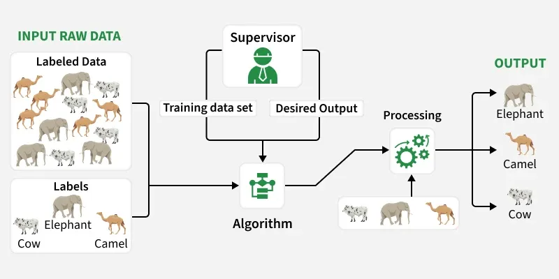

Supervised learning algorithms train models for tasks requiring accuracy. Supervised machine learning powers both state-of-the-art deep learning models and a wide array of traditional ML models still widely employed across industries.

The types of supervised-learning algorithms include:

- Classification

  Where the goal is to predict discrete labels or categories.

- Regression

  Where the aim is to predict continuous numerical values.

- ...

### Linear Regression

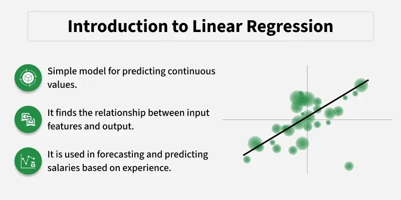

Linear Regression is a fundamental supervised learning algorithm used to model the relationship between a dependent variable and one or more independent variables. It predicts continuous values by fitting a straight line that best represents the data.

#### Types of Linear Regression

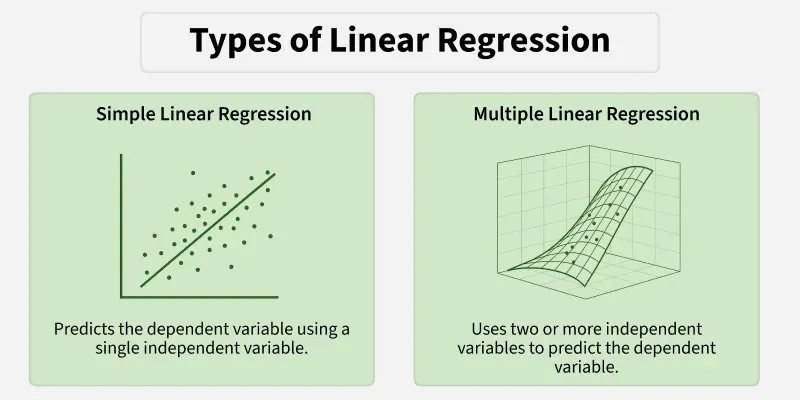

1. Simple Linear Regression

   Simple linear regression is used when we want to predict a target value (dependent variable) using only one input feature (independent variable). It assumes a straight-line relationship between the two.
   $$
   \hat{y} = \theta_{0} + \theta_{1}x
   $$
   where:

   - $\hat{y}$ is the predicted value
   - $x$ is the input (independent variable)
   - $\theta_{0}$ is the intercept (value of $\hat{y}$ when $x = 0$)
   - $\theta_{1}$ is the slope or coefficient (how much $\hat{y}$ changes with one unit of x)

2. Multiple Linear Regression

   Multiple linear regression involves more than one independent variable and one dependent variable. The equation for multiple linear regression is:
   $$
   \hat{y} = \theta_{0} + \theta_{1}x_1 + \theta_{2}x_2 + \cdots + \theta_{n}x_n
   $$
   where:

   - $\hat{y}$ is the predicted value
   - $x_1, x_2, ..., x_n$ are the independent variables
   - $\theta_{1}, \theta_{2}, ..., \theta_{n}$ are the coefficients (weights) corresponding to each predictor.
   - $\theta_{0}$ is the intercept.

#### Best Fit Line

In linear regression, the best-fit line is the straight line that most accurately represents the relationship between the independent variable (input) and the dependent variable (output). It is the line that minimizes the difference between the actual data points and the predicted values from the model.

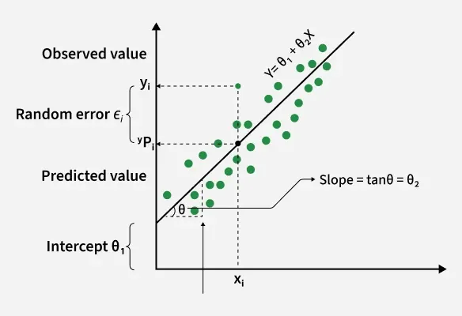

- $Y$ is called a dependent or target variable.
- $X$ is called an independent variable also known as the predictor of $Y$.
- $\theta_{1}$ represents the intercept, which is the value of $Y$ when $X = 0$.
- $\theta_{2}$ represents the slope, which shows how much $Y$ changes for a unit change in $X$.

For simple linear regression (with one independent variable), the best-fit line is represented by the equation:
$$
y = mx + b
$$
 where:

- $y$ is the predicted value (dependent variable)
- $x$ is the input (independent variable)
- $m$ is the slope of the line (how much y changes when x changes)
- $b$ is the intercept (the value of y when x = 0)

#### Hypothesis function

In linear regression, the hypothesis function is the equation used to make predictions about the dependent variable based on the independent variables. It represents the relationship between the input features and the target output.

For a simple case with one independent variable, the hypothesis function is:
$$
h(x) = \beta_{0} + \beta_{1}x
$$
where:

- $h(x)$ or $(\hat{y})$ is the predicted value of the dependent variable $(y)$.
- $x$ is the independent variable.
- $\beta_{0}$ is the intercept, representing the value of $y$ when $x$ is 0.
- $\beta_{1}$ is the slope, indicating how much $y$ changes for each unit change in $x$.

For a multiple linear regression (with more than one independent variable), the hypothesis function expands to:
$$
h(x_1, x_2, ..., x_k) = \beta_{0} + \beta_{1}x_1 + \beta_{2}x_2 + \cdots + \beta_{k}x_k
$$
where:

- $x_1, x_2, \cdots, x_k$ are the independent variables.
- $\beta_{0}$ is the intercept.
- $\beta_{1}, \beta_{2}, ..., \beta_{k}$ are the coefficients, representing the influence of each respective independent variable on the predicted output.

#### Cost Function in Linear Regression

In Linear Regression, the cost function measures how far the predicted values ($\hat{Y}$) are from the actual values ($Y$). It helps identify and reduce errors to find the best-fit line. The most common cost function used is Mean Squared Error (MSE), which calculates the average of squared differences between actual and predicted values:
$$
\text{Cost function(J)} = \frac{1}{n}\sum_{n}^{i}(\hat{y_i} - y_i)^2
$$
here:

- $\hat{y_i} = \theta_{1} + \theta_{2}x_{i}$

To minimize this cost, we use Gradient Descent, which iteratively updates $\theta_{1}$ and $\theta_{2}$ until the MSE reaches its lowest value. This ensures the line fits the data as accurately as possible.

#### Gradient Descent

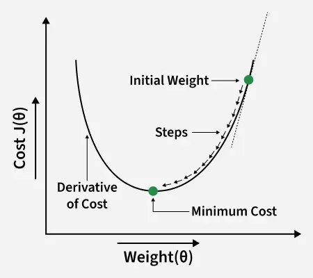

Gradient descent is an optimization technique used to train a linear regression model by minimizing the prediction error. It works by starting with random model parameters and repeatedly adjusting them to reduce the difference between predicted and actual values.

Various steps involved in the working fo Gradient Descent in Linear Regression:

1. Initializing Parameters

   Start with random initial values for the slope ($m$) and intercept ($b$).

2. Calculate the Cost Function

   Measure the error using the Mean Squared Error (MSE):

   $J(m, b) = \frac{1}{n}\sum_{i = 1}^{n}(y_i - (mx_i + b))^2$

3. Compute the Gradient

   Calculate how much the cost function changes with respect to $m$ and $b$.

   - For slope $m$:
     $$
     \frac{\partial J}{\partial m} = -\frac{2}{n}\sum_{i = 1}^{n}x_i(y_i - (mx_i + b))
     $$

   - For intercept $b$:
     $$
     \frac{\partial J}{\partial b} = -\frac{2}{n}\sum_{i = 1}^{n}(y_i - (mx_i + b))
     $$

4. Update Parameters

   Change m*m* and b*b* to reduce the error:

   - For slope $m$:
     $$
     m = m - \alpha \cdot \frac{\partial J}{\partial m}
     $$

   - For intercept $b$:
     $$
     b = b - \alpha \cdot \frac{\partial J}{\partial b}
     $$
     Here $\partial$ is the learning rate that controls the size of each update.

5. Repeat

   Keep repeating steps 2–4 until the error stops decreasing significantly.

### Logistic Regression

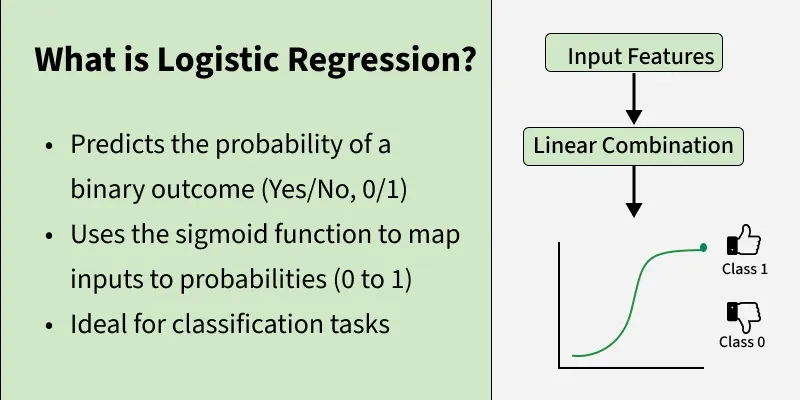

Logistic Regression is a supervised machine learning algorithm used for classification problems. Unlike linear regression, which predicts continuous values it predicts the probability that an input belongs to a specific class.

#### Types of Logistic Regression

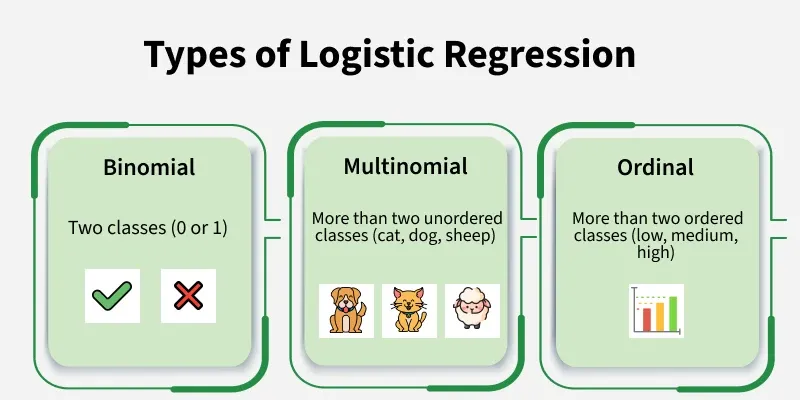

- **Binomial Logistic Regression**: This type is used when the dependent variable has only two possible categories.
- **Multinomial Logistic Regression**: This is used when the dependent variable has three or more possible categories that are not ordered.
- **Ordinal Logistic Regression**: This type applies when the dependent variable has three or more categories with a natural order or ranking.

#### Logistic Regression Workflow

Logistic regression computes a linear combination of input features $(z = w \cdot X + b)$ and passes it through a sigmoid function to produce a probability between 0 and 1. This probability is then used to assign the input to a class.

Suppose we have input features represented as a matrix:
$$
X = 
\begin{bmatrix}
x_{11} & \cdots & x_{1m} \\
x_{21} & \cdots & x_{2m} \\
\vdots & \ddots & \vdots \\
x_{n1} & \cdots & x_{nm}
\end{bmatrix}
$$
and the dependent variable is $Y$ having only binary value, i.e., 0 or 1. 
$$
Y = 
\begin{cases}
0, &\text{if Class 1}\\
1, &\text{if Class 2}
\end{cases}
$$
then, apply the multi-linear function to the input variable $X$.
$$
z = (\sum_{i = 1}^{n}w_i x_i) + b
$$
Here $x_i$ is the $i$th observation of $X$, $w_i = [w_1, w_2, w_3, ..., w_m]$ is the weights or coefficient and $b$ is the bias term also known as intercept. Simply this can be represented as the dot product of weight and bias.
$$
z = w \cdot X + b
$$
At this stage, $z$ is a continuous value from the linear regression. Logistic regression then applies the sigmoid function to $z$ to convert it into a probability between 0 and 1, which can be used to predict the class.

#### Logistic Regression Equation and Odds

It models the odds of the dependent event occurring which is the ratio of the probability of the event to the probability of it not occurring:
$$
\frac{p(x)}{1 - p(x)} = e^{z}
$$
Taking the natural logarithm of the odds gives the log-odds or logit:
$$
\begin{equation}\begin{split}
\log [\frac{p(x)}{1 - p(x)}] &= z \\
\log [\frac{p(x)}{1 - p(x)}] &= w \cdot X + b \\
\frac{p(x)}{1 - p(x)} &= e^{w \cdot X + b} \\
p(x) &= e^{w \cdot X + b} \cdot (1 - p(x)) \\
p(x) &= e^{w \cdot X + b} - e^{w \cdot X + b} \cdot p(x) \\
p(x) + e^{w \cdot X + b} \cdot p(x) &= e^{w \cdot X + b} \\
p(x)(1 + e^{w \cdot X + b}) &= e^{w \cdot X + b} \\
p(x) &= \frac{e^{w \cdot X + b}}{1 + e^{w \cdot X + b}}
\end{split}\end{equation}
$$
then the final logistic regression equation will be:
$$
p(X; b, w) = \frac{e^{w \cdot X + b}}{1 + e^{w \cdot X + b}} = \frac{1}{1 + e^{-w \cdot X + b}}
$$
This formula represents the probability of the input belonging to Class 1.

#### Likelihood Function for Logistic Regression

The goal is to find weights $w$ and bias $b$ that maximize the likelihood of observing the data.

For each data point $i$

- for $y = 1$, predicted probabilities will be: $p(X; b, w) = p(x)$
- for $y = 0$, The predicted probabilities will be: $1 - p(X; b, w) = 1 - p(x)$

$$
L(b, w) = \prod_{i = 1}^{n}p(x_i)^{y_i}(1 - p(x_i))^{1 - y_i}
$$

Taking natural logs on both sides:
$$
\begin{equation}\begin{split}
\log(L(b, w)) &= \sum_{i = 1}^{n}y_i \log p(x_i) + (1 - y_i) \log(1 - p(x_i)) \\
&= \sum_{i = 1}^{n}y_i \log p(x_i) + \log(1 - p(x_i)) - y_i \log(1 - p(x_i)) \\
&= \sum_{i = 1}^{n} \log (1 - p(x_i)) + \sum_{i = 1}^{n}y_i \log \frac{p(x_i)}{1 - p(x_i)} \\
&= \sum_{i = 1}^{n} -\log (1 - e^{-(w \cdot x_i + b)}) + \sum_{i = 1}^{n}y_i(w \cdot x_i + b) \\
&= \sum_{i = 1}^{n} -\log 1 + e^{w \cdot x_i + b} + \sum_{i = 1}^{n}y_i(w \cdot x_i + b) \\
\end{split}\end{equation}
$$
This is known as the log-likelihood function.

#### Cost Function in logistic regression

Logistic Regression is a supervised learning algorithm used for classification problems. To measure how well the model is performing, we use a cost function that evaluates how closely the predicted probabilities match the actual class labels. In Logistic Regression, the cost function is based on log loss (cross-entropy loss) instead of mean squared error.

The cost function is defined as:
$$
Cost(h_\theta(x), y) = -y \cdot \log(h_\theta(x)) - (1-y) \cdot \log(1-h_\theta(x))
$$
where:

- $h_\theta(x)$: Predicted probability using sigmoid
- $y$: Actual value (0 or 1)

#### Gradient of the log-likelihood function

To find the best $w$ and $b$ we use gradient ascent on the log-likelihood function. The gradient with respect to each weight $w_j$ is:
$$
\begin{equation}\begin{split}
\frac{\partial J(l(b, w))}{\partial w_j} &= -\sum_{i = 1}^{n}\frac{1}{1 + e^{w \cdot x_i + b}} e^{w \cdot x_i + b} x_{ij} + \sum_{i = 1}^{n}y_{i}x_{ij} \\
&= -\sum_{i = 1}^{n}p(x_i; b, w)x_{ij} + \sum_{i = 1}^{n}y_{i}x_{ij} \\
&= \sum_{i = 1}^{n}(y_i - p(x_i; b, w))x_{ij}
\end{split}\end{equation}
$$

### Decision Tree

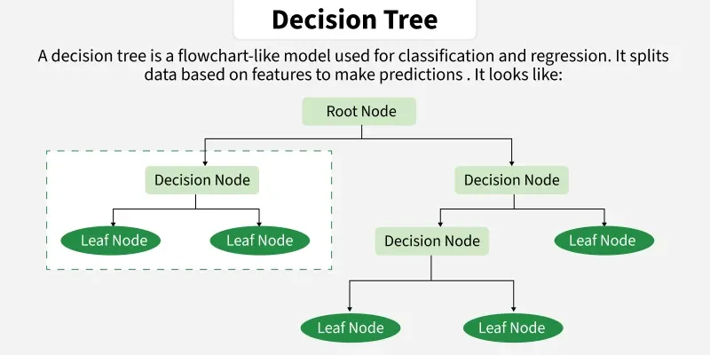

A decision tree is a supervised learning algorithm used for both classification and regression tasks. It has a hierarchical tree structure which consists of a root node, branches, internal nodes and leaf nodes.

#### Decision Tree Workflow

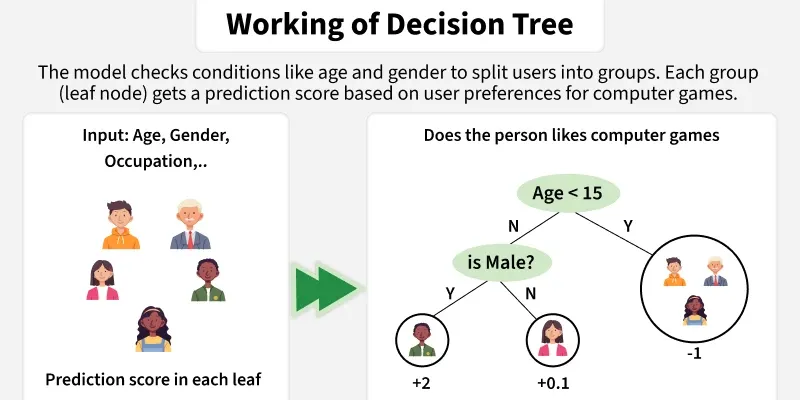

A decision tree splits the dataset based on feature values to create pure subsets ideally all items in a group belong to the same class. Each leaf node represents the final output, which can be a class label (in classification) or a continuous value (in regression).

#### Information Gain In Decision Tree

Information Gain tells us how useful a question (or feature) is for splitting data into groups. It measures how much the uncertainty decreases after the split. A good question will create clearer groups and the feature with the highest Information Gain is chosen to make the decision.

Suppose $S$ is a set of instances, $A$ is an attribute, $S_v$ is the subset of S with $A = v$ and Values ($A$) is the set of all possible values of $A$, then:
$$
Gain(S, A) = Entropy(S) - \sum_{v \in Values(A)}\frac{|S_v|}{|S|} \cdot Entropy(S_v)
$$

#### Gini Index In Decision Tree

Gini Index is a metric to measure how often a randomly chosen element would be incorrectly identified. It means an attribute with a lower Gini index should be preferred. 

Formula for Gini Index is given by:
$$
Gini = 1 - \sum_{i = 1}^{n}p_{i}^{2}
$$

#### ID3 (Iterative Dichotomiser 3)

ID3 (Iterative Dichotomiser 3) is a decision tree learning algorithm used for solving classification problems. It builds the tree using a top-down, greedy approach by selecting the attribute that provides the highest Information Gain which is calculated using entropy.

The ID3 algorithm constructs a decision tree by selecting the attribute that best splits the dataset at each step:

1. Initialize Root Node

2. Calculate Entropy

   Entropy measures the amount of randomness or impurity in a dataset. If all data points belong to the same class, entropy is 0 (pure node). If the data is evenly distributed among classes, entropy is higher, indicating more disorder.
   $$
   H(D) = -\sum_{i = 1}^{n}p_i \log_2(p_i)
   $$
   where:

   - $H(D)$: entropy of dataset D
   - $p_i$: probability of class $i$ in the dataset
   - $i$: number of classes

3. Compute Information Gain

   Information Gain measures how much entropy decreases after splitting the dataset based on a particular feature. The feature with the highest Information Gain is selected for the split because it provides the most useful information for classification.
   $$
   InformationGain = H(D) - \sum_{v = 1}^{V}\frac{|D_v|}{|D|}H(D_v)
   $$
   where:

   - $D$: original dataset
   - $D_v$: subset of the dataset after splitting on a feature value $v$
   - $|D_v|$: number of samples in subset $v$
   - $|D|$: total number of samples in the dataset
   - $V$: number of possible values of the feature

4. Select Best Attribute and Split

   The attribute with the highest Information Gain is selected, and the dataset is divided into subsets based on its values.

5. Repeat Recursively

   The same process continues for each subset until the node becomes pure or no attributes remain for further splitting, forming the final leaf nodes of the tree.

#### C4.5

C4.5 is an improved extension of the ID3 algorithm. It is designed to overcome several limitations of ID3, such as handling continuous attributes, managing missing values and reducing bias toward attributes with many values by using Gain Ratio instead of Information Gain.

C4.5 builds the decision tree by selecting the best attribute for splitting using Gain Ratio, which helps produce balanced splits and reduce bias toward attributes with many values:

1. Initialize Root Node

   The entire dataset is placed at the root node containing all training samples.

2. Compute Information Gain

   Information Gain is calculated for each attribute to measure how much entropy decreases after a split.

3. Compute Split Information

   Split Information measures how the dataset is distributed across different branches after splitting.
   $$
   \text{Split Information} = -\sum_{i = 1}^{n}\frac{|D_i|}{|D|}\log_{2}(\frac{D_i}{D})
   $$

4. Calculate Gain Ratio

   Gain Ratio normalizes Information Gain to avoid bias toward attributes with many distinct values.
   $$
   \text{Gain Ratio} = \frac{\text{Information Gain}}{\text{Split Information}}
   $$

5. Select Best Attribute and Split

   The attribute with the highest Gain Ratio is selected and the dataset is divided into subsets based on its values.

6. Repeat Recursively

   The same process continues for each subset until nodes become pure or no attributes remain, followed by post-pruning to simplify the tree.

#### CART (Classification and Regression Trees)

CART is a widely used decision tree algorithm that can handle both classification and regression problems. CART builds binary decision trees by repeatedly splitting the dataset into two subsets based on the most informative feature.

The algorithm evaluates different splits and chooses the one that creates the most homogeneous subsets:

1. Initialize Root Node

   The process begins with the entire dataset placed at the root node. This node contains all training samples before any splitting occurs.

2. Calculate Gini Impurity (for Classification)

   CART measures how impure the dataset is using Gini Impurity, which estimates the probability of incorrectly classifying a randomly chosen sample.
   $$
   Gini(D) = 1 - \sum_{i = 1}^{n}p_{i}^{2}
   $$
   where $p_i$ is the probability of class $i$ in dataset $D$.

3. Evaluate Possible Splits

   The algorithm examines different features and possible split points to determine how well they divide the data into more homogeneous groups.

4. Select the Best Split

   The feature and split point that produce the lowest Gini impurity (for classification) or maximum variance reduction (for regression) are selected to divide the dataset.

5. Create Binary Branches

   CART always creates binary splits, meaning each node is divided into exactly two child nodes (left and right), which simplifies the tree structure.

6. Repeat Recursively

   The same process continues for each subset, splitting the data until stopping criteria are met such as reaching pure nodes or a minimum number of samples.

#### CHAID (Chi-Square Automatic Interaction Detection)

CHAID is a decision tree algorithm mainly used for classification and regression analysis, especially when dealing with categorical variables. It builds trees by using statistical chi-square tests to identify the feature that has the strongest relationship with the target variable.

CHAID constructs the decision tree by analyzing the statistical relationship between each feature and the target variable using the chi-square test:

1. Initialize Root Node

   The entire dataset is placed at the root node, which contains all training samples before any splitting occurs.

2. Perform Chi-Square Test

   For each categorical feature, CHAID calculates the Chi-Square statistic to measure the strength of association between the feature and the target variable.
   $$
   X^2 = \sum \frac{(O_i - E_i)^2}{E_i}
   $$
   where:

   - $O_i$ represents the observed frequency
   - $E_i$ represents the expected frequency in each category

3. Select the Best Feature

   The feature with the highest chi-square value (indicating the strongest relationship with the target variable) is selected for splitting the dataset.

4. Create Multi-Way Branches

   CHAID divides the dataset into multiple subsets based on the categories of the selected feature, creating several branches from a single node.

5. Repeat Recursively

   The algorithm continues the same process for each subset until stopping criteria are met, such as reaching statistically insignificant splits or minimum node size.

#### Conditional Inference Trees

Conditional Inference Trees are decision tree models that use statistical hypothesis tests to select the best feature for splitting the dataset. Unlike algorithms such as CART, they use permutation-based tests to reduce bias toward variables with many categories. This makes them useful when working with datasets containing a mix of categorical and continuous variables.

Conditional Inference Trees construct the tree using a recursive partitioning process based on statistical significance tests:

1. Initialize Root Node

   The entire dataset is placed at the root node, containing all training samples before any splitting occurs.

2. Test Association Between Features and Target

   At each node, the algorithm performs statistical tests to evaluate the relationship between each predictor variable and the target variable.

3. Select the Most Significant Feature

   The feature with the strongest statistically significant association with the target variable (lowest p-value) is selected as the splitting variable.

4. Determine the Best Split Point

   The algorithm determines the optimal way to divide the data based on the selected feature, creating new subsets that maximize the statistical difference between groups.

5. Repeat Recursively

   The process is repeated for each subset until no statistically significant relationship remains or predefined stopping criteria are met.

### Support Vector Machines (SVM)

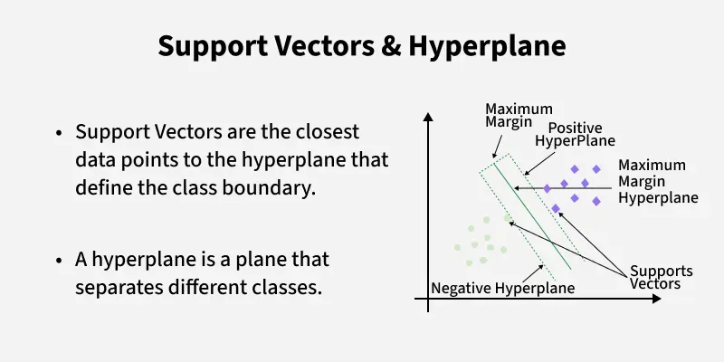

Support Vector Machine (SVM) is a supervised machine learning algorithm used for classification and regression tasks. It tries to find the best boundary known as hyperplane that separates different classes in the data.

#### SVM Workflow

The key idea behind the SVM algorithm is to find the hyperplane that best separates two classes by maximizing the margin between them. This margin is the distance from the hyperplane to the nearest data points (support vectors) on each side.

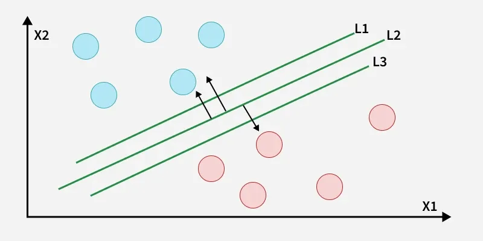

The best hyperplane, also known as the hard margin, is the one that maximizes the distance between the hyperplane and the nearest data points from both classes. This ensures a clear separation between the classes. So from the above figure, we choose L2 as the hard margin. Let's consider a scenario like shown below:

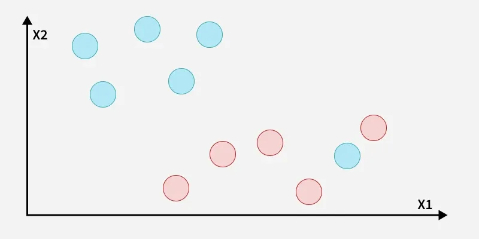

The blue ball in the boundary of red ones is an outlier of blue balls. The SVM algorithm has the characteristics to ignore the outlier and finds the best hyperplane that maximizes the margin. SVM can be sensitive to outliers, especially in the case of a hard margin, while soft margin SVM helps reduce their impact by allowing some misclassifications.

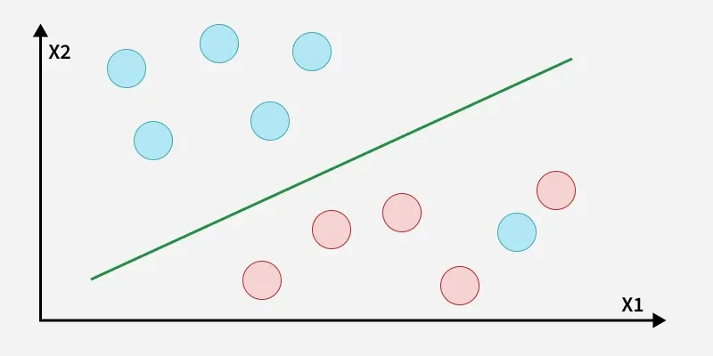

A soft margin allows for some misclassifications or violations of the margin to improve generalization. The SVM optimizes the following equation to balance margin maximization and penalty minimization:
$$
\text{Objective Function} = (\frac{1}{margin}) + \lambda \sum penalty
$$
When data is not linearly separable i.e it can't be divided by a straight line, SVM uses a technique called kernels to map the data into a higher-dimensional space where it becomes separable. This transformation helps SVM find a decision boundary even for non-linear data.

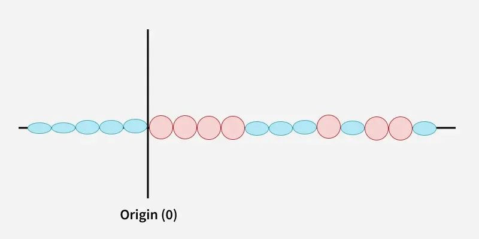

A kernel is a function that maps data points into a higher-dimensional space without explicitly computing the coordinates in that space. This allows SVM to work efficiently with non-linear data by implicitly performing the mapping. For example consider data points that are not linearly separable. By applying a kernel function SVM transforms the data points into a higher-dimensional space where they become linearly separable.

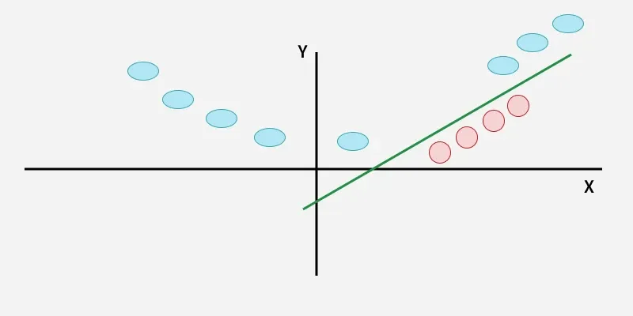

#### Equation for the linear hyperplane

The equation for the linear hyperplane can be written as:
$$
w^T x + b = 0
$$
where:

- $w$ is the normal vector to the hyperplane (the direction perpendicular to it).
- $b$ is the offset or bias term representing the distance of the hyperplane from the origin along the normal vector $w$.

#### Distance from a Data Point to the Hyperplane

The distance between a data point $x_i$ and the decision boundary can be calculated as:
$$
d_i = \frac{w^T x_i + b}{||w||}
$$
where $||w||$ represents the Euclidean norm of the weight vector $w$.

#### Liner SVM Classifier

Distance from a Data Point to the Hyperplane:
$$
\hat{y} = 
\begin{cases}
1: &w^Tx + b \geq 0 \\
-1: &w^Tx + b < 0
\end{cases}
$$
where $\hat{y}$ is the predicted label of a data point.

#### Optimization Problem for SVM

For a linearly separable dataset the goal is to find the hyperplane that maximizes the margin between the two classes while ensuring that all data points are correctly classified. This leads to the following optimization problem:
$$
\underset{w,b}{minimize} \frac{1}{2} ||w||^2
$$
Subject to the constraint:
$$
y_i(w^T x_i + b) \geq 1 \text{ for } i = 1, 2, 3, \cdots, m
$$
where:

- $y_i$ is the class label (+1 or -1) for each training instance.
- $x_i$ is the feature vector for the $i$-th training instance.
- $m$ is the total number of training instances.

The condition $y_i(w^T x_i + b) \geq 1$ ensures that each data point is correctly classified an dlies outside the margin.

#### Soft margin in Linear SVM Classifier

In the presence of outliers or non-separable data the SVM allows some misclassification by introducing slack variables $\zeta_{i}$. The optimization problem is modified as:
$$
\underset{w,b}{minimize}\frac{1}{2}||w||^2 + C\sum_{i = 1}^{m} \zeta_{i}
$$
Subject to the constraints:
$$
y_i(w^T x_i + b) \geq 1 - \zeta_{i} \text{ and } \zeta_{i} \geq 0 \text{ for } i= 1, 2, ..., m
$$
where:

- $C$ is a regularization parameter that controls the trade-off between margin maximization and penalty for misclassifications.
- $\zeta_{i}$ are slack variables that represent the degree of violation of the margin by each data point.

#### Dual Problem for SVM

The dual objective function is given by:
$$
max_{\alpha}\frac{1}{2} \sum_{i = 1}^{m} \sum_{j = 1}^{m} \alpha_{i} \alpha_{j} t_i t_j K(x_i, x_j) - \sum_{i = 1}^{m}\alpha_{i}
$$
where:

- $\alpha_{i}$ are the Lagrange multipliers associated with the $i$th training sample.
- $t_i$ is the class label for the $i$th training sample.
- $K(x_i, x_j)$ is the kernel function that computes the similarity between data points $x_i$ and $x_j$. The kernel allows SVM to handle non-linear classification problems by mapping data into a higher-dimensional space.

#### SVM Decision Boundary

Once the dual problem is solved, the decision boundary is given by:
$$
w = \sum_{i = 1}^{m} \alpha_{i} t_i K(x_i, x) + b
$$
where $w$ is the weight vector, $x$ is the test data point and $b$ is the bias term. Finally the bias term $b$ is determined by the support vectors which satisfy:
$$
t_i(w^T x_i - b) = 1 \Rightarrow b = w^T x_i - t_i
$$
where $x_i$ is any support vector.

### k-Nearest Neighbors (KNN)

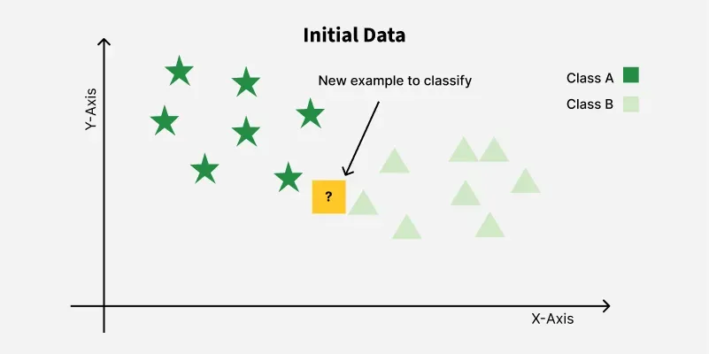

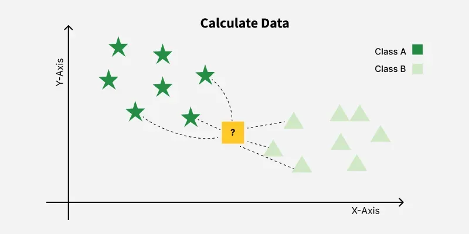

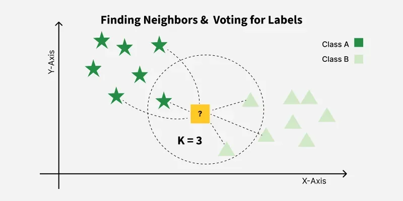

K‑Nearest Neighbor (KNN) is a simple and widely used machine learning technique for classification and regression tasks. It works by identifying the $K$ closest data points to a given input and making predictions based on the majority class or average value of those neighbors.

#### KNN workflow

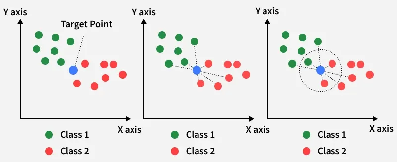

1. Selecting the optimal value of K
2. Calculating distance
3. Finding Nearest Neighbors
4. Voting for Classification or Taking Average for Regression

#### Decision Boundaries in KNN

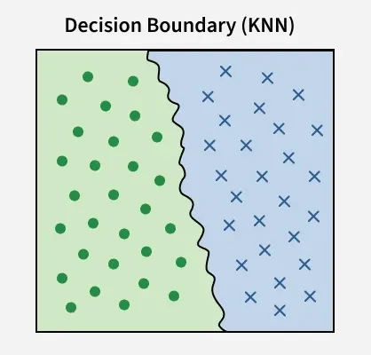

A decision boundary is a line or surface that divides different groups in a classification task. It shows which areas belong to which class based on what the model decides. K-Nearest Neighbours (KNN) algorithm operates on the principle that similar data points exist in close proximity within a feature space.

### Naive Bayes

Naive Bayes is a machine learning classification algorithm that predicts the category of a data point using probability. It assumes that all features are independent of each other. 

*Bayes’ Theorem* provides a principled way to reverse conditional probabilities. It is defined as:
$$
P(y | X) = \frac{P(X | y) \cdot P(y)}{P(X)}
$$

- $P(y | X)$: Posterior probability, probability of class $y$ given features $X$.
- $P(X | y)$: Likelihood, probability of features $X$ given class $y$.
- $P(y)$: Prior probability of class $y$.
- $P(X)$: Marginal likelihood or evidence.

(For more info, see: [../MATH/PROBABILITY_THEORY/bayes_theorem.md](../MATH/PROBABILITY_THEORY/bayes_theorem.md))

There are three types of Naive Bayes Model:

1. Gaussian Naive Bayes
2. Multinomial Naive Bayes
3. Bernoulli Naive Bayes

#### Key Features of Naive Bayes Classifier

The main idea behind the Naive Bayes classifier is to use Bayes' Theorem to classify data based on the probabilities of different classes given the features of the data. It is used mostly in high-dimensional text classification:

- The Naive Bayes Classifier is a simple probabilistic classifier, and it has a very small number of parameters, which are used to build ML models that can predict at a faster speed than other classification algorithms.
- It is a probabilistic classifier because it assumes that one feature in the model is independent of the existence of another feature. In other words, each feature contributes to the predictions with no relation to the others.
- Naive Bayes Algorithm is used in spam filtration, sentiment analysis, classifying articles and many more.

#### Naive Bayes Workflow

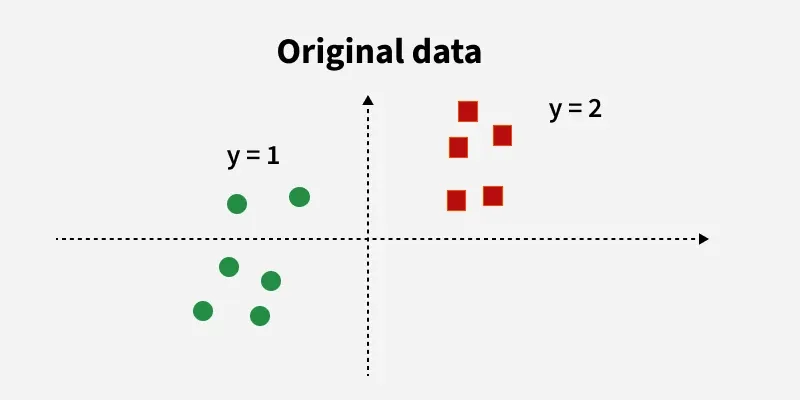

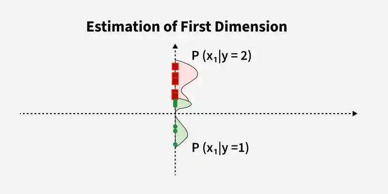

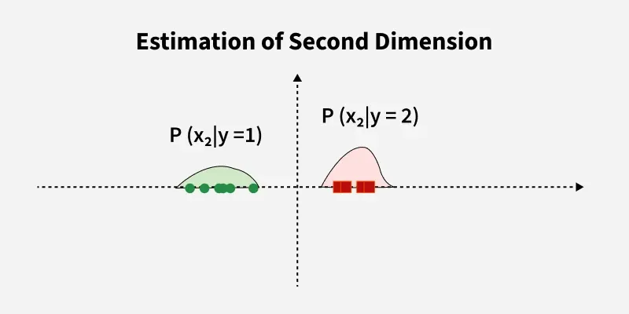

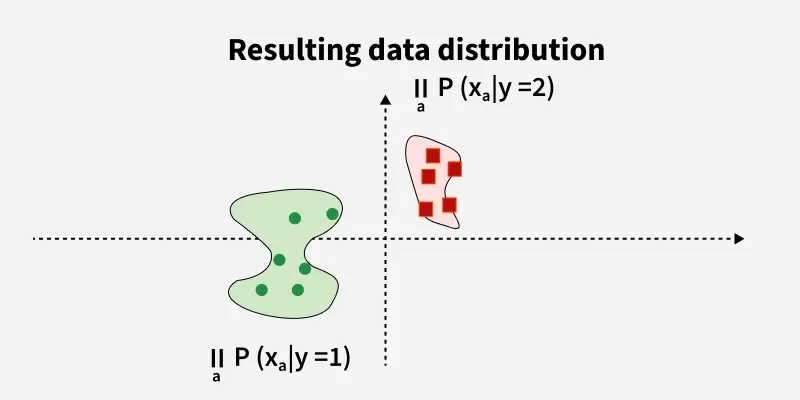

Here:

- Original data has two classes: green circles (y = 1) and red squares (y = 2).
- Estimate probability distribution along the first dimension i.e $P(x_1 | y = 1), P(x_1 | y = 2)$.
- Estimate probability distribution along the second dimension i.e $P(x_2 | y = 1), P(x_2 | y = 2)$.
- Combine both dimensions using conditional independence i.e $P(x | y) = \prod_{\alpha}P(x_{\alpha} | y)$

#### Gaussian Naive Bayes

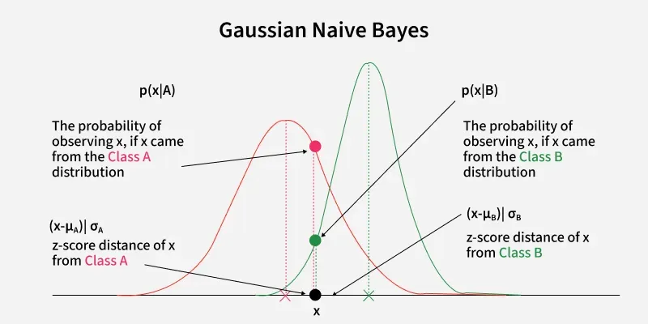

Gaussian Naive Bayes is a type of Naive Bayes method working on continuous attributes and the data features that follows Gaussian distribution throughout the dataset.

Gaussian Naive Bayes assumes that the likelihood ($P(x_i | y)$) follows the Gaussian Distribution for each $x_i$ within $y_k$. Therefore:
$$
P(x_i | y) = \frac{1}{\sigma \sqrt{2\pi}}e^{-\frac{(x - \mu)^2}{2 \sigma^{2}}}
$$
where:

- $x_i$ is the feature value.
- $\mu$ is the mean fo the feature values for a given class $y_k$.
- $\sigma$ is the standard deviation of the feature values for that class.
- $\pi$ is a constant (approximately 3.14159).
- $e$ is the base of the natural logarithm.

#### Bernoulli Naive Bayes

Bernoulli Naive Bayes is a subcategory of the Naive Bayes Algorithm. It is typically used when the data is binary and it models the occurrence of features using Bernoulli distribution.

In Bernoulli Naive Bayes model we assume that each feature is conditionally independent given the class $y$. This means that we can calculate the likelihood of each feature occurring as:
$$
p(x_i | y) = p(i | y)x_i + (1 - p(i | y))(1 - x_i)
$$

- $p(x_i | y)$ is the conditional probability of $x_i$ occuring provided $y$ has occurred.
- $i$ is the feature index.
- $x_i$ holds binary value either 0 or 1.

Bernoulli distribution is used for discrete probability calculation. It either calculates success or failure. Here the random variable is either 1 or 0 whose chance of occurring is either denoted by p or (1-p) respectively. The mathematical formula is given:
$$
f(x) = 
\begin{cases}
p^x * (1 - )^{1 - x}, &\text{if } x = 0.1\\
0, &\text{otherwise}
\end{cases}
$$
Now in the above function if we put $x = 1$ then the value of $f(x)$ is p and if we put $x = 0$ then the value of $f(x)$ is $1 - p$. Here p denotes the success of an event.

#### Multinomial Naive Bayes

Multinomial Naive Bayes is a variation of the Naive Bayes algorithm designed for discrete data. It is commonly used in text classification, where features represent word counts or frequencies.

Multinomial Naive Bayes classifies text using word frequencies. Naive Bayes assumes words are independent, while Multinomial refers to counting how often words appear in a document. The model learns from training data by analyzing how often words occur in each class, such as spam or not spam.

To estimate how likely each word is in a particular class like spam or not spam, we use a method called Maximum Likelihood Estimation (MLE). This helps find probabilities based on actual counts from our data. The formula is:
$$
\theta_{c, i} = \frac{count(w_i, c) + 1}{N + v}
$$

- $count(w_i, c)$ is the number of times word $w_i$ appears in documents of class $c$.
- $N$ is the total number of words in documents of class $c$.
- $v$ is the vocabulary size.

#### Complement Naive Bayes (CNB)

Complement Naive Bayes (CNB) is a variant of the Naive Bayes algorithm that is specifically designed to improve classification performance on imbalanced datasets and text classification tasks.

Workflow:

1. For each class, compute the complement frequency: the frequency of features in all other classes combined.
2. Estimate the conditional probabilities using these complement frequencies.
3. Normalize the values to ensure they form valid probability distributions.
4. Classify a sample by choosing the class with the maximum posterior probability.

For a class C and feature F:
$$
P(f | c) = \frac{count(f, \overline{c}) + \alpha}{\sum_{f'} count(f', \overline{c}) + \alpha \cdot |V|}
$$

- $count(f, \overline{c})$: count of feature $f$ in the complement of class c
- $\alpha$: smoothing parameter (Laplace smoothing)
- $|V|$: vocabulary size

### Random Forest (Bagging Algorithm)

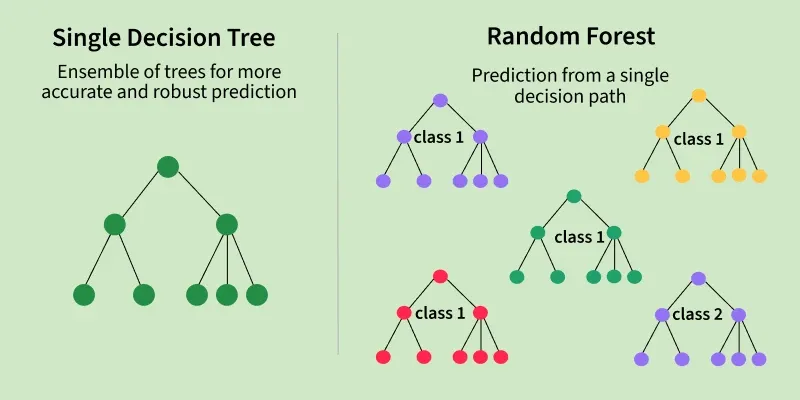

Random Forest is a machine learning algorithm that uses many decision trees to make better predictions. Each tree looks at different random parts of the data and their results are combined by voting for classification or averaging for regression which makes it as ensemble learning technique. This helps in improving accuracy and reducing errors.

#### Random Forest Workflow

1. `Bootstrap Sampling`: Random rows are picked (with replacement) to train each tree.
2. `Random Feature Selection`: Each tree uses a random set of features (not all features).
3. `Build Decision Trees`: Trees split the data using the best feature from their random set. Splitting continues until a stopping rule is met (like max depth).
4. `Make Predictions`: Each tree gives its own prediction.
5. `Majority Voting`: The final prediction is the one most tree agree on.

#### Random Forest Hyperparameter Tuning

Random Forest hyperparameter tuning involves optimizing model parameters to improve performance and accuracy. By adjusting settings like the number of trees, depth and feature selection, it is possible to build a more efficient and well‑generalized machine learning model. 

The different Hyperparameters can be tuned:

1. `n_estimators`: It defines the number of trees in the forest. More trees typically improve model performance but increase computational cost.
2. `max_features`: Limits the number of features to consider when splitting a node.
3. `max_depth`: Controls the maximum depth of each tree. A shallow tree may underfit while a deep tree may overfit. So choosing right value of it is important.
4. `max_leaf_nodes`: Limits the number of leaf nodes in the tree hence controlling its size and complexity. None means it takes an unlimited number of nodes.
5. `max_samples`: Apart from the features, we have a large set of training datasets. max_sample determines how much of the dataset is given to each individual tree. None means data.shape[0] is taken.
6. `min_sample_split`: Specifies the minimum number of samples required to split an internal node.

### Ensemble Learning

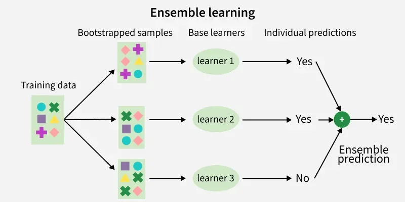

Ensemble learning is a method where multiple models are combined instead of using just one. Even if individual models are weak, combining their results gives more accurate and reliable predictions.

#### Bagging

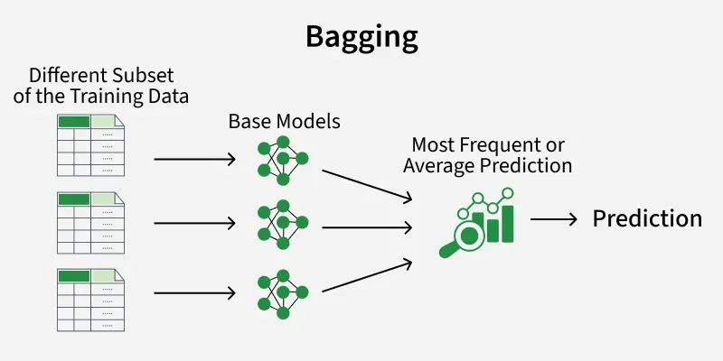

Bagging or Bootstrap Aggregating, works by training multiple base models independently and in parallel on different random subsets of the training data. These subsets are created using bootstrap sampling, where data points are randomly selected with replacement, allowing some samples to appear multiple times while others may be excluded.

Working of Bagging Classifier:

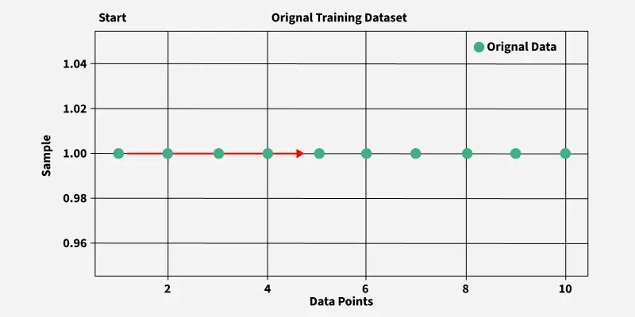

1. Bootstrap Sampling

   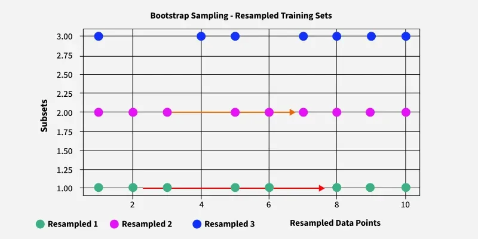

   From the original dataset, multiple training subsets are created by sampling with replacement. This generates diverse data views, reducing overfitting and improving model generalization.

2. Base Model Training

   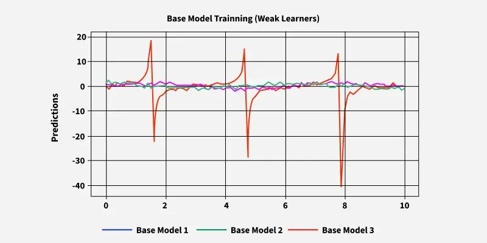

   Each bootstrap sample trains an independent base learner (e.g., decision trees, SVMs, neural networks).

3. Aggregation

   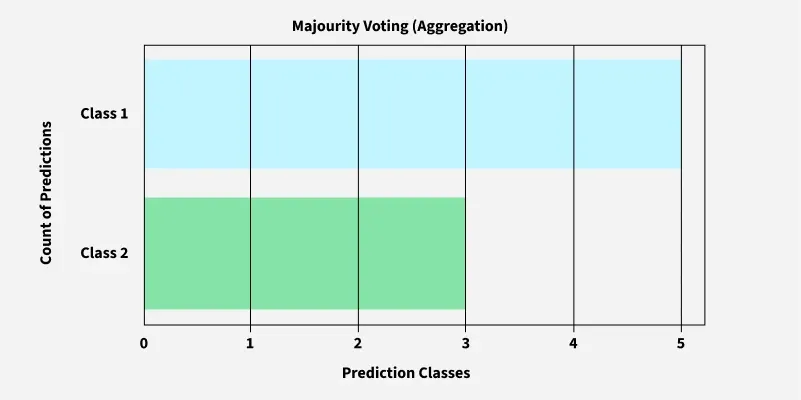

   Once trained, each base model generates predictions on new data. For classification, predictions are combined via majority voting; for regression, predictions are averaged to produce the final outcome.

4. Out-of-Bag (OOB) Evaluation

   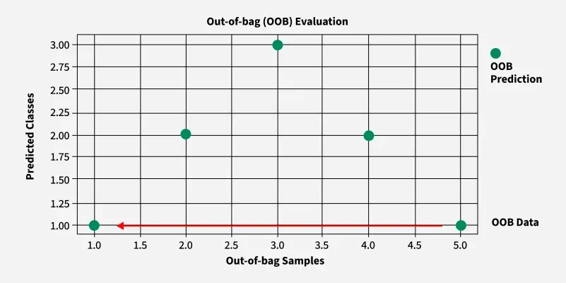

   Samples excluded from a particular bootstrap subset (called out-of-bag samples) provide a natural validation set for that base model. OOB evaluation offers an unbiased performance estimate without additional cross-validation.

#### Boosting

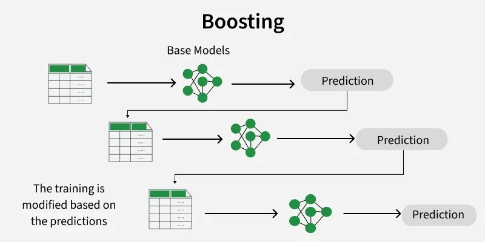

AdaBoost (Adaptive Boosting) is an ensemble learning technique that combines multiple weak classifiers to build a strong model. It works by sequentially focusing more on the misclassified data points from previous models.

#### Stacking

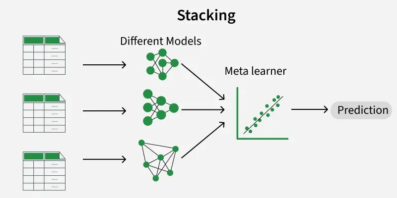

---

## Unsupervised learning

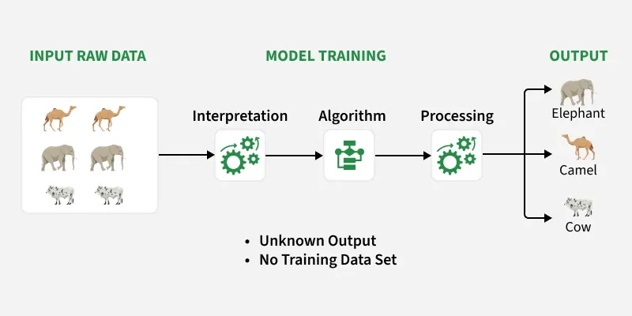

Unsupervised learning algorithms find structures in data that has not been labelled, classified, or categorized. Instead of responding to feedback, unsupervised learning algorithms identify commonalities in the data and react based on the presence or absence of such commonalities in each new piece of data.

### Clustering

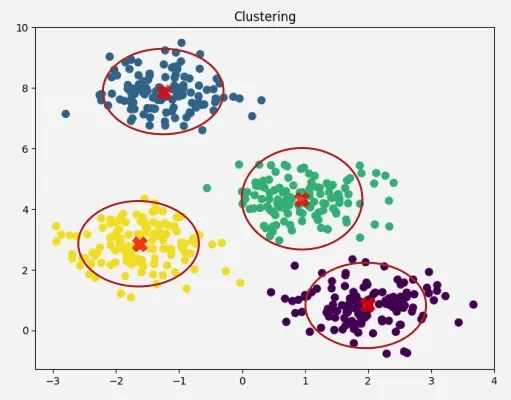

Clustering is an unsupervised machine learning technique used to group similar data points together without using labelled data. It helps discover hidden patterns or natural groupings in datasets by placing similar data points into the same cluster.

Types of Clustering:

1. Hard Clustering

   Hard clustering assigns each data point to exactly one cluster. A data point cannot belong to multiple clusters, making the grouping clear and easy to interpret.

   - Each data point belongs to only one cluster
   - No overlap between clusters
   - Simple and easy to interpret

2. Soft Clustering

   Soft clustering allows a data point to belong to multiple clusters with different probabilities. Instead of assigning a strict cluster, it gives a degree of membership to each cluster.

#### K-Means Clustering

K-Means Clustering groups similar data points into clusters without needing labeled data. It is used to uncover hidden patterns when the goal is to organize data based on similarity.

Working of k-Means Clustering:

1. Initialization

   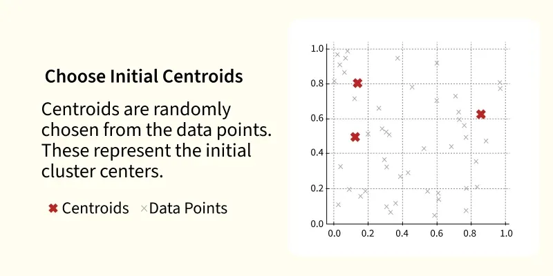

   We begin by randomly selecting k cluster centroids.

2. Assignment

   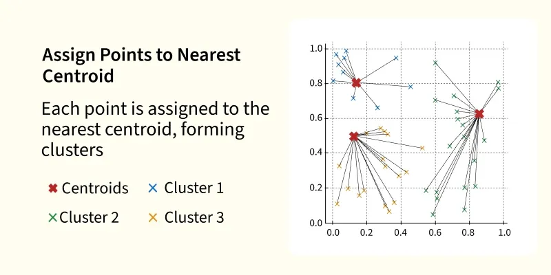

   Each data point is assigned to the nearest centroid, forming clusters.

3. Update

   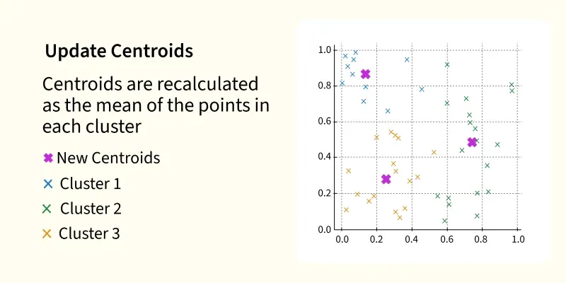

   After the assignment, we recalculate the centroid of each cluster by averaging the points within it.

4. Repeat

   

   This process repeats until the centroids no longer change or the maximum number of iterations is reached.

The Elbow Method is used to find the optimal number of clusters (k) in K-Means by analyzing how the clustering performance changes with different k values.

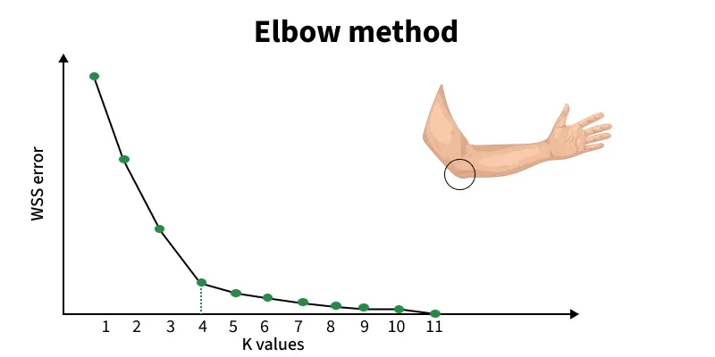

The Elbow Method works in the following steps:

1. We begin by selecting a range of k values (for example, 1 to 10).

2. For each k, we run K-Means and calculate WCSS (Within-Cluster Sum of Squares), which shows how close the data points are to their cluster centroids:
   $$
   \text{WCSS} = \sum_{i=1}^{k} \sum_{j=1}^{n_i} \text{distance}(x_j^{(i)}, c_i)^2 
   $$
   where $\text{distance}(x_j^{(i)}, c_i)$ represents the distance between the $j^{th}$ data point $x_j^{(i)}$ in cluster $i$ and the centroid $c_i$ of that cluster.

3. After computing WCSS for all $k$ values, we plot k vs WCSS.

4. WCSS always decreases as $k$ increases because more clusters reduce the internal spread.

5. However, after a certain point, the improvement becomes very small. This bend or “elbow” in the curve indicates the point where adding more clusters no longer gives meaningful improvement.

   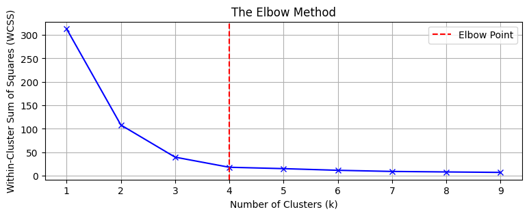

   - Before the elbow: WCSS drops quickly -> clusters become much better.
   - After the elbow: WCSS drops slowly -> extra clusters add little value and may lead to overfitting.

Two metrics commonly used in the Elbow Method are:

1. Distortion

   Distortion measures the average squared distance between each data point and its assigned cluster center. It's a measure of how well the clusters represent the data. A lower distortion value indicates better clustering.
   $$
   \text{Distortion} = \frac{1}{n} \sum_{i=1}^{n} \min_{c \in \text{clusters}} \left\| x_i - c \right\|^2 
   $$

   - $x_i$ is the $i^{th}$ data point
   - $c$ is a cluster center from the set of all cluster centroids
   - $\left\| x_i - c \right\|^2$ is the squared Euclidean distance between the data point and the cluster center
   - $n$ is the total number of data points

2. Inertia

   Inertia is the sum of squared distances of each data point to its closest cluster center. It's essentially the total squared error of the clustering. Like distortion, a lower inertia value suggests better clustering.
   $$
   \text{Inertia} = \sum_{i=1}^{n} \text{distance}(x_i, c_j^*)^2 
   $$

#### K-Medoids Clutering

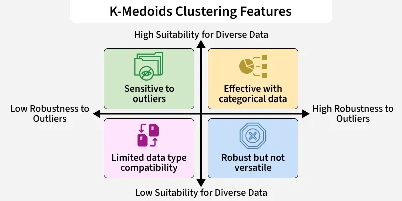

K-Medoids, also known as Partitioning Around Medoids (PAM), is a clustering algorithm introduced by Kaufman and Rousseeuw. It is similar to K-Means, but instead of using the mean of points as a cluster center, it uses an actual data point called a medoid.

A medoid is the most centrally located data point within a cluster. It minimizes the total dissimilarity with all other points in that cluster. The dissimilarity between a medoid $C_i$ and an object $P_i$ is given by: $E = |P_i - C_i|$.

The *total cost* (or objective function) of K-Medoids is defined as:
$$
c = \sum_{C_i} \sum_{P_i \in C_i}|P_i - C_i|
$$
K-Medoid workflow:

1. Initialize: Randomly select k data points from the dataset as initial medoids.
2. Assign Points: Assign each data point to the nearest medoid using a distance metric (e.g., Manhattan or Euclidean).
3. Update Step (Swap): For each medoid m, try swapping it with a non-medoid point ooo.
   - Recalculate the cost for this new configuration.
   - If the total cost decreases, accept the swap; otherwise, revert.
4. Repeat:Continue until no further cost reduction is possible.

#### Fuzzy Clustering

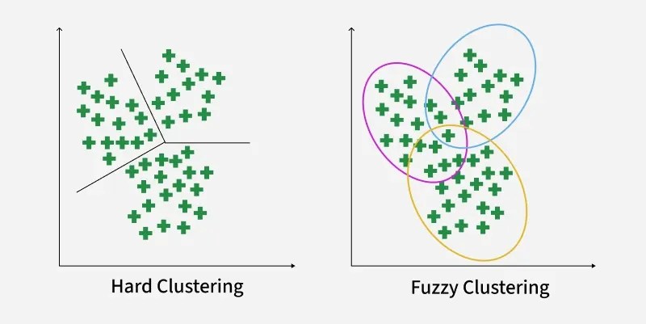

Fuzzy clustering allows each data point to belong to multiple clusters with different membership values. Instead of assigning a point to just one group, it captures how strongly a point relates to each cluster.

Fuzzy Clustering workflow:

1. **Initialize Membership Values Randomly:** Each data point is given random membership scores for all clusters. A point can partially belong to multiple clusters.

2. **Compute Cluster Centroids:** Centroids are calculated as weighted averages, where weights are membership values raised to the fuzziness parameter $m$:
   $$
   V_{ij} = \frac{\sum_{k=1}^{n} \gamma_{ik}^m \cdot x_{kj}}     {\sum_{k=1}^{n} \gamma_{ik}^m} 
   $$

   - $\gamma_{ik}$ = membership of point $k$ in cluster $i$.
   - $m$ = fuzziness parameter (usually 2).
   - $x_{kj}$ = value of feature $j$ for point $k$.

3. **Calculate Distance Between Data Points and Centroids:** Compute the Euclidean distance between each point and every centroid to determine proximity, which will be used to update memberships.

4. **Update Membership Values:** Membership values are updated inversely proportional to these distances. Points closer to a centroid get a higher membership.

   Updated membership $\gamma_{ik}$ for point $k$ in cluster $i$ is:
   $$
   \gamma_{ik} = \frac{1}{\sum_{j=1}^{c} \left(\frac{d_{ik}}{d_{jk}}\right)^{\frac{2}{m-1}}} 
   $$

5. **Repeat Until Convergence:** Steps 2–4 are repeated until the membership values stabilize, meaning there are no significant changes from one iteration to the next. This indicates that the clustering has reached an optimal state.

#### Gaussian Mixture Model (GMM)

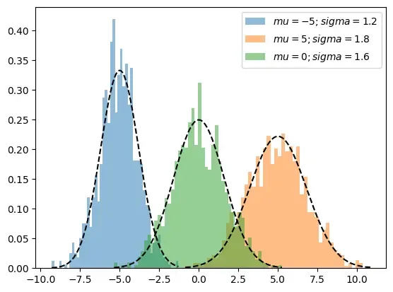

Gaussian Mixture Model (GMM) is a probabilistic clustering technique that models data as a combination of multiple Gaussian distributions, allowing more flexible grouping of data points.

GMM workflow:

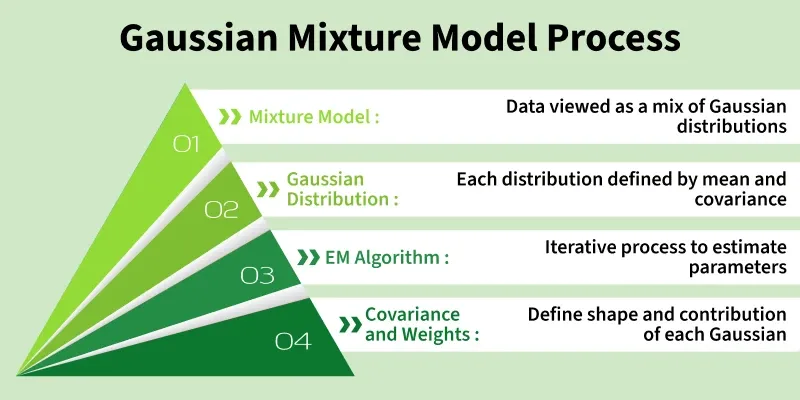

1. Posterior Probability (Cluster Responsibility)

   For a given data point $x_n$, the probability that it belongs to cluster $k$:
   $$
   P(z_n = k | x_n) = \frac{\pi_{k} \cdot N(x_n|\mu_{k}, \sum_{k})}{\sum_{j = 1}^{K} \pi_{j} \cdot N(x_n|\mu_{j}, \sum_{j})}
   $$

   where:

   - $z_n$ is a latent variable indicating cluster assignment.
   - $\pi_{k}$ is the mixing probability of the k-th Gaussian.
   - $N(x_n | \mu_{k}, \sum_{k})$ is the Gaussian distribution with mean $\mu_{k}$ and covariance $\sum_{k}$.

2. Likelihood of a Data Point

   The total likelihood of observing xnx_nxn under all Gaussians is:
   $$
   P(x_n) = \sum_{k = 1}^{K} \pi_{k} \cdot N(x_n | \mu_{k}, \sum_{k})
   $$
   This represents how well the mixture as a whole explains the data point.

3. Expectation-Maximization (EM) Algorithm

   GMM parameters are estimated using the EM algorithm:

   - E-step (Expectation): Compute the responsibility of each cluster for every data point using current parameter values.

   - E-step (Maximization): Update

     - Means $\mu_{k}$

     - Covariances $\sum_{k}$

     - Mixing coefficients using the responsibilities from the E-step. 

     The process continues until the model's log-likelihood stabilizes.

4. Log-Likelihood of the Mixture Model

   The objective optimized by EM is:
   $$
   L(\mu, \sum, \pi) = \prod_{n = 1}^{N} \sum_{k = 1}^{K} \pi_{k} \cdot N(x_n | \mu_{k}, \sum_{k})
   $$
   EM increases this likelihood in every iteration.

#### Expectation-Maximization Algorithm

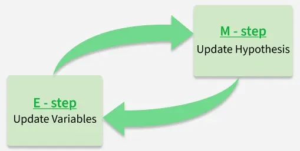

The Expectation-Maximization (EM) algorithm is an iterative optimization technique used to estimate unknown parameters in probabilistic models, particularly when the data is incomplete, noisy or contains hidden (latent) variables.

 It works in two steps:

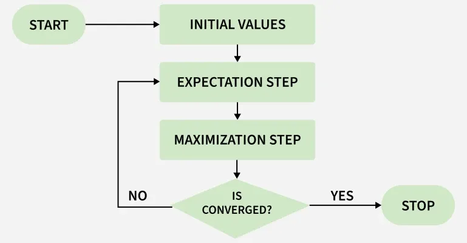

- E-step (Expectation Step): Using the current parameter estimates, the algorithm calculates the expected values of the missing or hidden variables. Essentially, it assigns probabilities or "responsibilities" to different hidden outcomes given the observed data.
- M-step (Maximization Step): With these updated expectations from the E-step, the algorithm then re-estimates the model parameters by maximizing the expected log-likelihood. This improves how well the model explains the observed data.

#### DBSCAN Clustering

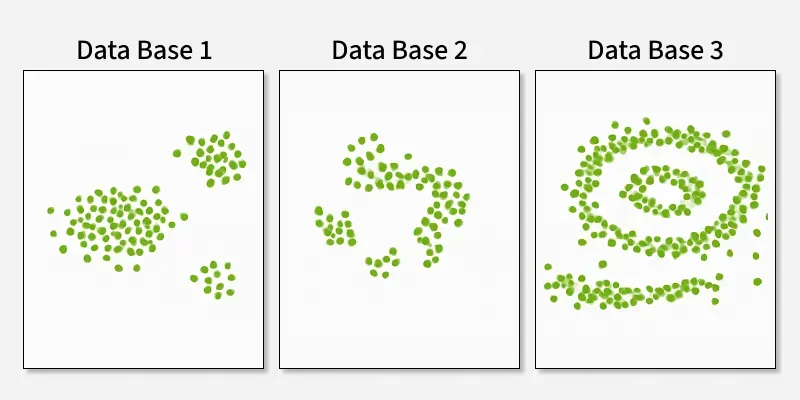

DBSCAN is a density-based clustering algorithm that groups data points that are closely packed together and marks outliers as noise based on their density in the feature space. It identifies clusters as dense regions in the data space separated by areas of lower density. Unlike K-Means or hierarchical clustering which assumes clusters are compact and spherical, DBSCAN perform well in handling real-world data irregularities such as:

- Arbitrary-Shaped Clusters: Clusters can take any shape not just circular or convex.
- Noise and Outliers: It effectively identifies and handles noise points without assigning them to any cluster.

The key parameters in DBSCAN:

- eps: This defines the radius of the neighborhood around a data point. If the distance between two points is less than or equal to eps they are considered neighbors. A common method to determine eps is by analyzing the k-distance graph.
- MinPts: This is the minimum number of points required within the *eps* radius to form a dense region. A general rule of thumb is to set MinPts >= D+1 where *D* is the number of dimensions in the dataset.

DBSCAN workflow:

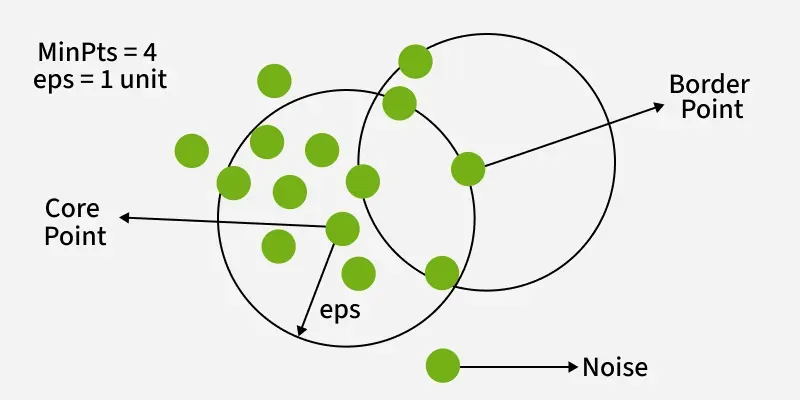

1. **Identify Core Points**: For each point in the dataset count the number of points within its eps neighborhood. If the count meets or exceeds MinPts mark the point as a core point.
2. **Form Clusters**: For each core point that is not already assigned to a cluster create a new cluster. Recursively find all density-connected points i.e points within the eps radius of the core point and add them to the cluster.
3. **Density Connectivity**: Two points a and b are density-connected if there exists a chain of points where each point is within the eps radius of the next and at least one point in the chain is a core point. This chaining process ensures that all points in a cluster are connected through a series of dense regions.
4. **Label Noise Points**: After processing all points any point that does not belong to a cluster is labeled as noise.

#### OPTICS Clustering

OPTICS (Ordering Points To Identify the Clustering Structure) is a density-based clustering algorithm similar to DBSCAN clustering. Unlike DBSCAN which struggles with varying densities. OPTICS does not directly assign clusters but instead creates a reachability plot which visually represents clusters.

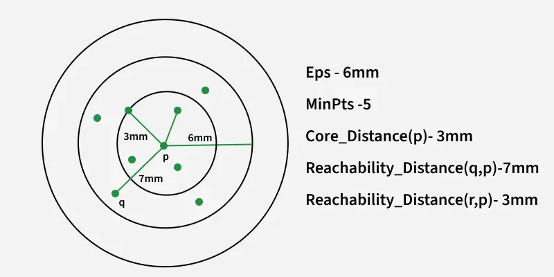

A reachability plot is a graph that helps visualize clustering structures. It shows the reachability distance of each point in the dataset. It makes it ordered way based on how OPTICS processes them. Here clusters appear as valleys in the plot where lower reachability distances indicate dense regions while peaks represent sparse regions or noise.

OPTICS workflow:

1. The algorithm selects a starting point and checks if it has at least MinPts neighbors within Eps.
2. If the point meets the density requirement it is marked as a core point and nearby points are then analyzed.
3. Reachability distance is computed for each neighboring point.
4. Points are then processed in order of their reachability distance hence forming a reachability plot.
5. Clusters appear as valleys i.e low reachability distances and noise appears as peaks i.e high reachability distances.

#### Agglomerative Clustering

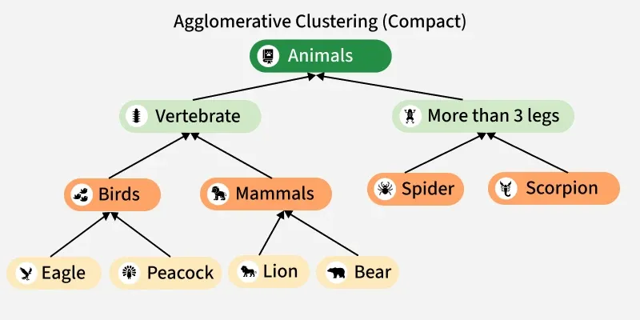

To group similar data points into clusters based on their proximity, Agglomerative Clustering is used which is a type of hierarchical clustering. It follows a bottom-up approach, where each data point starts as its own cluster and gradually merges with others based on similarity.

Agglomerative workflow:

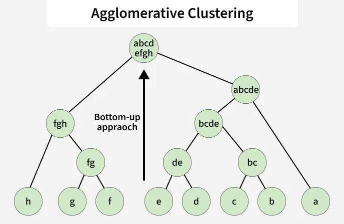

1. Start with all points separate:

   - Treat each data point as its own cluster like A, B, C, ...
   
   - Initially, you have n clusters for n data points.
   
2. Compute pairwise distances:
   
   - Calculate the distance between every pair of clusters.
   - Common choices include Euclidean, Manhattan or Cosine distance.
   - Store these values in a distance matrix.
   
3. Merge the nearest clusters:
   
   - Identify the two clusters that are closest based on the chosen linkage method such as single, complete, average or Ward linkage.
   - Combine them into a single new cluster.
   
4. Update distances:
   
   - Recalculate the distances between the newly formed cluster and all remaining clusters.
   - Use the same linkage rule to ensure consistency.
   
5. Repeat the process:
   
   - Continue merging clusters and updating distances iteratively.
   - Stop when you reach a predefined number of clusters (k) or a distance threshold.
   
6. Visualize the results:
   
   - Create a dendrogram to visualize how clusters merged at each step.
   - Choose a suitable cut on the dendrogram to obtain the final cluster groups.

#### Divisive Clustering

Divisive Clustering is a type of hierarchical clustering that follows a top-down approach. It starts by placing all data points into one large cluster and then recursively splits that cluster into smaller ones based on differences or distances between the points. This process continues until each cluster contains only similar data points or meets a stopping condition.

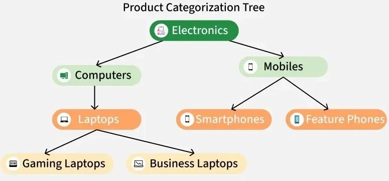

Divisive Clustering workflow:

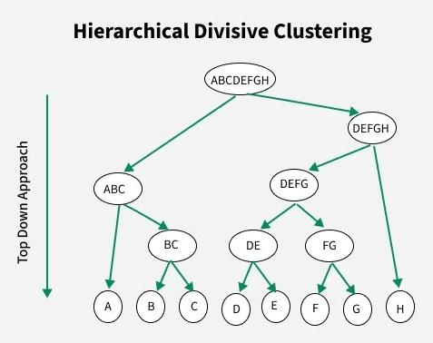

1. Start with all data points: Begin with one big group ABCDEFGH.
2. First split: Divide it into two groups ABC and DEFGH.
3. Split again: The group ABC is divided into A and BC while the group DEFGH is split into DEFG and H.
4. Keep dividing: We continue dividing these new groups. BC is split into B and C, DEFG is divided into DE and so on. At this stage most of the data points are now in their individual groups.
5. Finish: Stop when all points are separated.

### Dimensionality Reduction

#### Principal Component Analysis (PCA)

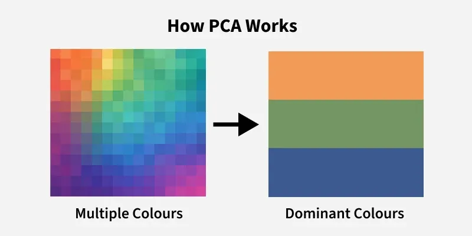

PCA (Principal Component Analysis) is a dimensionality reduction technique and helps us to reduce the number of features in a dataset while keeping the most important information. It changes complex datasets by transforming correlated features into a smaller set of uncorrelated components.

PCA workflow:

1. Standardize the data

   Different features may have different units and scales like salary vs. age. To compare them fairly PCA first standardizes the data by making each feature have:

   - A mean of 0
   - A standard deviation of 1

   $$
   Z = \frac{x - \mu}{\sigma}
   $$

   where:

   - $\mu$ is the mean of independent features $\mu = \{\mu_{1}, \mu_{2}, \cdots, \mu_{m}\}$
   - $\sigma$ is the standard deviation of independent features $\sigma = \{\sigma_{1}, \sigma_{2}, \cdots, \sigma_{m}\}$

2. Calculate Covariance Matrix

   Next PCA calculates the covariance matrix to see how features relate to each other whether they increase or decrease together. The covariance between two features $x_1$ and $x_2$ is:
   $$
   cov(x_1, x_2) = \frac{\sum_{i = 1}^{n}(x1_{i} - \overline{x1})(x2_{i} - \overline{x2})}{n - 1}
   $$
   where:

   - $\overline{x1}$ and $\overline{x2}$ are mean values of features $x_1$ and $x_2$.
   - $n$ is the number of data points

3. Find the principal components

   PCA identifies new axes where the data spreads out the most:

   - **1st Principal Component (PC1):** The direction of maximum variance (most spread).
   - **2nd Principal Component (PC2):** The next best direction, perpendicular to PC1 and so on.

   These directions come from the eigenvectors of the covariance matrix and their importance is measured by eigenvalues. For a square matrix $A$ an eigenvector $X$ (a non-zero vector) and its corresponding eigenvalue $\lambda$ satisfy:
   $$
   AX = \lambda X
   $$
   This means:

   - When $A$ acts on $X$ it only stretches or shrinks $X$ by the scalar $\lambda$.
   - The direction of $X$ remains unchanged, hence eigenvectors define "stable directions" of $A$.

4. Pick the Top Directions & Transform Data

   After calculating the eigenvalues and eigenvectors PCA ranks them by the amount of information they capture. We then:

   1. Select the top k components that capture most of the variance like 95%.
   2. Transform the original dataset by projecting it onto these top components.

   

#### T-distributed Stochastic Neighbor Embedding (t-SNE) Algorithm

T-distributed Stochastic Neighbor Embedding (t-SNE) is a non linear dimensionality reduction technique used for visualizing high-dimensional data in a lower-dimensional space mainly in 2D or 3D. Unlike linear methods such as Principal Component Analysis (PCA), t-SNE focus on preserving the local structure and pattern of the data.

#### Non-Negative Matrix Factorization

Non-Negative Matrix Factorization (NMF) is a technique used to break down large dataset into smaller meaningful parts while ensuring that all values remain non-negative.

For a matrix A of dimensions $m \times n$ where each element is $\geq 0$ NMF factorizes it into two matrices $W$ and $H$ with dimensions $m \times k$ and $k \times n$ respectively where both matrices contain only non-negative elements:
$$
A_{m \times n} \approx W_{m \times k} \cdot H_{k \times n}
$$
where:

- $A$: Original input matrix (a linear combination of $W$ and $H$)
- $W$: Feature matrix (basis components)
- $H$: Coefficient matrix (weights associated with $W$)
- $k$: Rank (dimensionality of the reduced representation where $k \leq min(m, n)$)

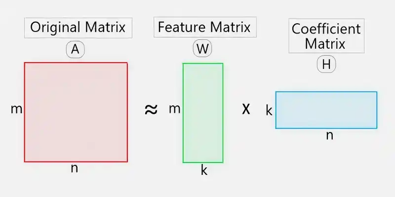

NMF helps to identify hidden patterns in data by assuming that each data point can be represented as a combination of fundamental features found in $W$.

NMF decomposes a data matrix $A$ into two smaller matrices $W$and $H$ using an iterative optimization process that minimizes reconstruction error:

1. **Initialization**: Start with random non-negative values for $W$ and $H$.
2. **Iterative Update**: Modify $W$ and $H$ to minimize the difference between $A$ and $W \times H$.
1. **Stopping Criteria**: The process stops when:
   - The reconstruction error stabilizes.
   - A set number of iterations is reached.

#### Independent Component Analysis

Independent Component Analysis (ICA) is a technique used to separate mixed signals into their independent, non-Gaussian components. Its aim is to find a linear transformation of data that maximizes statistical independence among the components.

Statistical independence refers to the idea that two random variables: X and Y are independent if knowing one does not affect the probability of the other. Mathematically, this means the joint probability of X and Y is equal to the product of their individual probabilities.
$$
P(X \cap Y) = P(X) \cdot P(Y) or P(X \cap Y) = P(X) \cdot P(Y)
$$
ICA operates under two key assumptions:

1. The source signals are statistically independent of each other.
2. The source signals have non-Gaussian distributions.

The observed random vector is $X = (x_1, \cdots, x_m)^{T}$ representing the observed data with m components. The hidden components are represented by the random vector $S = (s_1, \cdots, s_n)^{T}$ where $n$ is the number of hidden sources. The observed data $X$ is transformed into hidden components $S$ using a linear static transformation representation by the matrix $W$
$$
S = WX
$$
The goal is to transform the observed data $X$ in a way that the resulting hidden components are independent. The independence is measured by some function $F(s_1, \cdots, s_n)$. The task is to find the optimal transformation matrix $W$ that maximizes the independence of hidden components.

#### Isomap

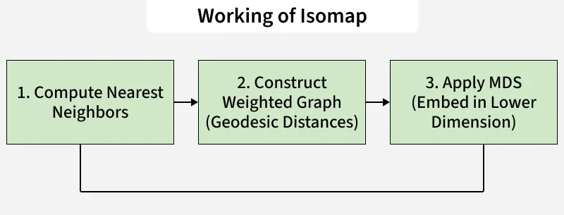

Isomap (Isometric Mapping) is a non-linear dimensionality reduction method that reduces features while keeping the structure of the data intact. It works well when the data lies on a curved or complex surface.

Isomap workflow:

1. Calculate Pairwise Distances

   First we find the Euclidean distances between all pairs of data points.

2. Find Nearest Neighbors

   For each point find the closest other points based on distance.

3. Create a Neighborhood Graph

   Connect each point to its nearest neighbors to form a graph.

4. Calculate Geodesic Distances

   Use algorithms like Floyd-Warshall to measure the shortest paths between points by following the graph connections.

5. Perform Dimensional Reduction

   Move points into a simpler space while keeping their distances as accurate as possible.

#### Locally Linear Embedding (LLE)

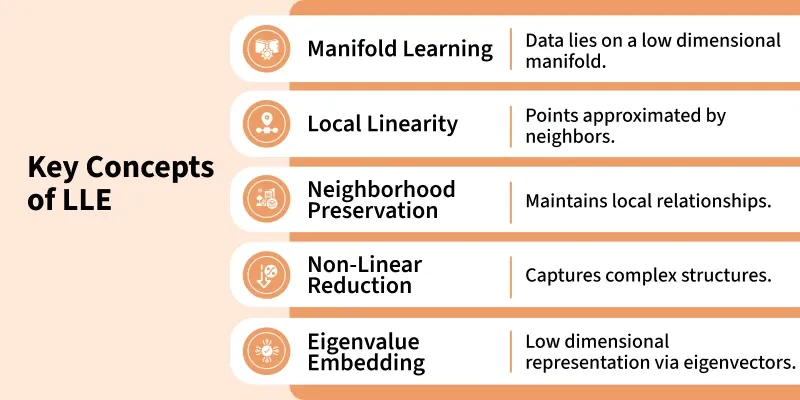

Locally Linear Embedding (LLE) is a non-linear dimensionality reduction technique used in machine learning to uncover meaningful structures in high-dimensional data. Unlike linear methods such as PCA, LLE preserves the local relationships among data points making it effective for visualizing and analyzing complex datasets without losing the important shape or structure of the data.

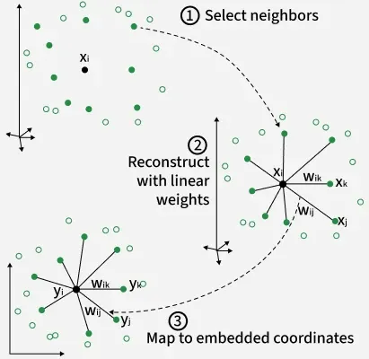

The LLE algorithm can be broken down into several steps:

1. Neighborhood Selection:

   - For each data point in the high dimensional space, it identifies its k-nearest neighbors.
   - This step is crucial because it assumes each point can be approximated by a linear combination of its neighbors capturing local structure.

2. Weight Matrix Construction:

   - It computes weights for each point to represent it as a linear combination of its neighbors.
   - The weights are chosen to minimize reconstruction error often using linear regression.
   - All weights together form a weight matrix that encodes local relationships in the dataset.

3. Global Structure Preservation:

   - Using the weight matrix, It finds a lower dimensional embedding that best preserves these local linear relationships.
   - This is done by minimizing a cost function that measures how well each point can be reconstructed from its neighbors in the reduced space.

4. Output Embedding:

   - The result is a low dimensional representation of the data that captures the essential structure while preserving neighborhood relationships.
   - This embedding can be used for visualization, clustering or further analysis.

Here’s a basic overview of how it works mathematically:

1. Neighborhood Selection:

   - For each data point $x_i \in R^D$, identify its k-nearest neighbors $x_j$.
   - Let the neighbors of $x_i$ be $N(i)$.

2. Compute Reconstruction Weights:

   - Represent $x_i$ as a linear combination of its neighbors:
     $$
     x_i \approx \sum_{j \in N(i)}w_{ij}x_{j}
     $$

   - Minimize the reconstruction error to find weights $w_{ij}$:
     $$
     \epsilon(W) = \sum_{i}||x_i - \sum_{j \in N(i)}w_{ij}x_{j}||^{2}
     $$

   - Constraint: $\sum_{j \in N(i)}w_{ij} = 1$

   - Usually solved using linear regression.

3. Compute Low Dimensional Embedding:

   - Find low dimensional vectors $y_i \in \mathbb{R}^d (d \ll D)$ that preserve the weights:
     $$
     \Phi(Y) = \sum_{i}||y_i - \sum_{j \in N(i)}w_{ij}y_{j}||^{2}
     $$

   - Center: $\sum_{i}y_{i} = 0$

   - Scale: $\frac{1}{N}\sum_{i}y_{i} y_{i}^{T} = I$

   - Solve the eigenvalue problem: $MY = \lambda Y$, $M = (I - W)^{T}(I - W)$

   - Select the bottom $d + 1$ eigenvectors, discard the smallest eigenvector corresponding to eigenvalue 0.

4. Output:

   The resulting low dimensional coordinates Y*Y* preserve the local linear structure of the original high dimensional data.

### Association Rule

#### Apriori Algorithm

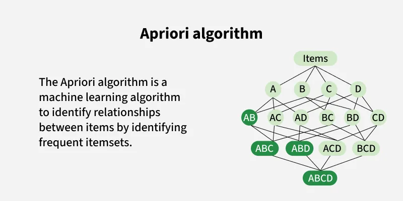

Apriori Algorithm is a data mining technique used to identify items that frequently appear together in large datasets. It helps discover relationships and association rules between items, making it widely used in market basket analysis.

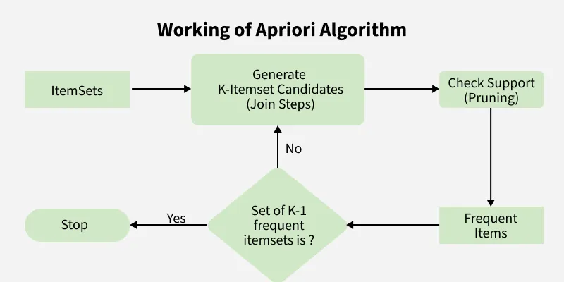

1. Identifying Frequent Item-Sets
2. Creating Possible Item Group
3. Removing Infrequent Item Groups
4. Generating Association Rules

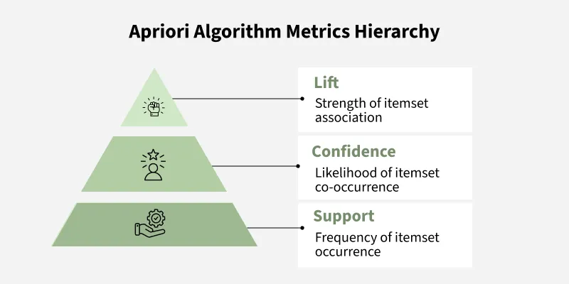

1. Support

   Support measures how frequently an item or item-set appears in the dataset relative to the total number of transactions.
   $$
   Support(X) = \frac{\text{Number of transactions containing } X}{\text{Total number of transactions}}
   $$

   - Indicates the overall occurrence of an item-set
   - Higher support means the item-set appears more frequently

2. Confidence

   Confidence measures the likelihood that item Y is purchased when item X is purchased.
   $$
   Confidence(X \rightarrow Y) =\frac{Support(X \cup Y)}{Support(X)}
   $$

   - Indicates the strength of association between items
   - Shows how often items occur together

3. Lift

   Lift measures how much more likely two items are purchased together compared to random chance.
   $$
   Lift(X \rightarrow Y) =\frac{Confidence(X \rightarrow Y)}{Support(Y)}
   $$

   - Evaluates the strength of item relationships
   - Lift greater than 1 indicates a positive association

#### Frequent Pattern Growth Algorithm

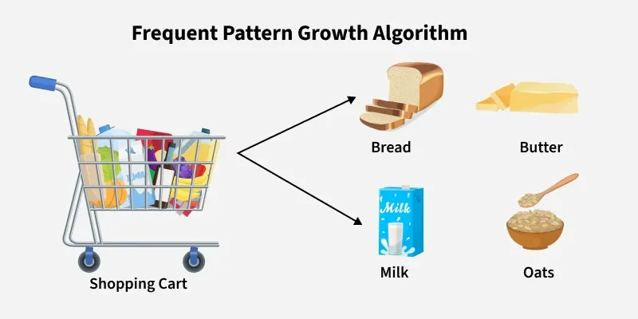

The FP-Growth (Frequent Pattern Growth) algorithm efficiently mines frequent itemsets from large transactional datasets. Unlike the Apriori algorithm which suffers from high computational cost due to candidate generation and multiple database scans. FP-Growth avoids these inefficiencies by compressing the data into an FP-Tree (Frequent Pattern Tree) and extracts patterns directly from it.

FP-Growth workflow:

1. Data Compression

   First FP-Growth compresses the dataset into a smaller structure called the Frequent Pattern Tree (FP-Tree). This tree stores information about item sets (collections of items) and their frequencies without need to generate candidate sets like Apriori does.

2. Mining the Tree

   The algorithm then examines this tree to identify patterns that appear frequently based on a minimum support threshold. It does this by breaking the tree down into smaller "conditional" trees for each item making the process more efficient.

3. Generating Patterns

   Once the tree is built and analyzed the algorithm generates the frequent patterns (itemsets) and the rules that describe relationships between items.

#### ECLAT Algorithm

ECLAT stands for Equivalence Class Clustering and bottom-up Lattice Traversal. It is a data mining algorithm used to find frequent itemsets in a dataset. These frequent itemsets are then used to create association rules which helps to identify patterns in data. It is an improved alternative to the Apriori algorithm by providing better scalability and computational efficiency.

ECLAT workflow:

1. Create the Tidset

   The first step is to generate the tidset for each individual item.

2. Calculate the Support of Itemsets by Intersecting Tidsets

   ECLAT then proceeds by recursively combining the tidsets. The support of an itemset is determined by the intersection of tidsets.

3. Recursive Call and Generation of Larger Itemsets

   The algorithm continues recursively by combining pairs of itemsets (k-itemsets) checking the support by intersecting the tidsets. The recursion continues until no further frequent itemsets can be generated.

4. Stop When No More Frequent Itemsets Can Be Found

   The algorithm stops once no more itemset combinations meet the minimum support threshold.

---

## Reinforcement learning

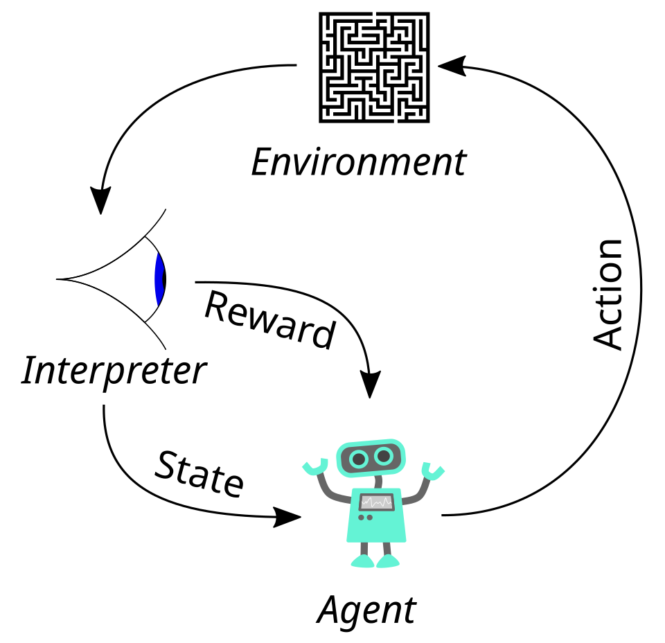

Whereas supervised learning trains models by optimizing them to match ideal exemplars and unsupervised learning algorithms fit themselves to a dataset, reinforcement learning models are trained holistically through trial and error. In RL literature, an AI system is often referred to as an "agent".

### Bellman Equation

The Bellman Equation is a formula used in reinforcement learning to calculate the value of a state. It says that the value of a state is equal to the reward received now plus the expected value of the next state. This helps an agent make better decisions by considering both immediate and future rewards. It is based on the principle of optimality which means the best value of a state depends on the immediate reward and the value of the next state.

#### Bellman Equation for State Value Function

State value function denoted as $V(s)$ under a given policy represents the expected cumulative reward when starting from state s and following that policy:
$$
V^{\pi}(s) = \mathbb{E}[R(s,a) + \gamma V^{\pi }(s')]
$$
Expanding this equation with transition probabilities we get:
$$
V^{\pi}(s) = \sum_{a \in A} \pi(a | s) \sum_{s' \in S} P(s' | s, a) \left[ R(s, a) + \gamma V^{\pi}(s') \right]
$$
where:

- $V^{\pi}(s)$: Value function of state $s$ under policy.
- $P(s' | s, a)$: Transition probability from state s to state s' when taking action a.
- $R(s, a)$: Reward obtained after taking action a in state $s$.
- $\gamma$: Discount factor controlling the importance of future rewards.
- $\pi(a | s)$: Probability of taking action a in state s under policy.

Q-function $(Q(s, a))$ represents the expected return for taking action a in state s and following the policy afterward:
$$
Q^{\pi}(s, a) = \mathbb{E} \left[ R(s, a) + \gamma V^{\pi}(s') \right]
$$
Expanding it using transition probabilities:
$$
Q^{\pi}(s, a) = \sum_{s' \in S} P(s' | s, a) \left[ R(s, a) + \gamma \sum_{a'} \pi(a' | s') Q^{\pi}(s', a') \right]
$$
This equation helps compute the expected future rewards based on both current action a and subsequent policy actions.

#### Bellman Optimality Equations

For an optimal policy $\pi^*$, the Bellman equation becomes:

1. Optimal State Value Function
   $$
   V^*(s) = \max_{a} \sum_{s'} P(s' | s, a) \left[ R(s, a) + \gamma V^*(s') \right]
   $$

2. Optimal Action Value Function ([Q-Learning](#Q-Learning))
   $$
   Q^*(s, a) = \sum_{s'} P(s' | s, a) \left[ R(s, a) + \gamma \max_{a'} Q^*(s', a') \right]
   $$

These equations form the foundation for Dynamic Programming, Temporal Difference (TD) Learning and Q-Learning.

### Model-Based Methods

#### Markov Decision Processes (MDPs)

Markov Decision Process (MDP) is a framework for decision-making under uncertainty and is formally defined by a tuple (S, A, P, R, γ), representing states, actions, transition probabilities, rewards and the discount factor.

An MDP has five main parts:

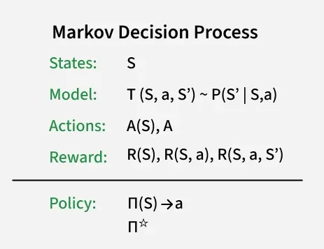

1. $States (S)$: A state is a situation or condition the agent can be in.
2. $Actions (A)$: An action is something the agent can do.
3. $\text{Transition Model} (T)$: The model tells us what happens when an action is taken in a state.
4. $Reward (R)$: A reward is a number given to the agent after it takes an action. If the reward is positive, it means the result of the action was good. If the reward is negative, it means the outcome was bad, or there was a penalty help the agent learn what’s good or bad.
5. $Policy (\pi)$: A policy is the agent’s plan. The goal is to find the best policy that helps the agent earn the highest total reward over time.

#### Monte Carlo Tree Search

Monte Carlo Tree Search (MCTS) is a method used for problems with very large decision spaces, such as game Go, which has around 10170 possible states. It builds a search tree step-by-step using random simulations to choose better moves.

MCTS workflow:

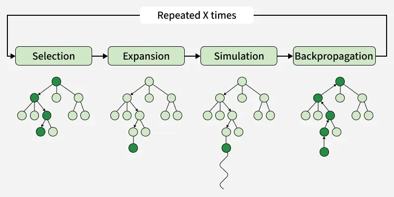

1. Selection

   Starting at the root node, MCTS moves down the tree using a selection rule. The most common rule is UCT (Upper Confidence Bounds for Trees), which balances:

   - Exploitation: choosing moves with higher average reward
   - Exploration: trying moves with less information

2. Expansion

   When the selection phase reaches a leaf node that isn't terminal, the algorithm expands the tree by adding one or more child nodes representing possible actions from that state.

3. Simulation Phase

   From the newly added node, a random playout is performed until reaching a terminal state. During this phase, moves are chosen randomly or using simple heuristics, making the simulation computationally inexpensive.

4. Backpropagation Phase

   The result of the simulation is propagated back up the tree to the root, updating statistics (visit counts and win rates) for all nodes visited during the selection phase.

The selection phase relies on the `UCB1 (Upper Confidence Bound)` formula to determine which child node to visit next:
$$
UCB1(i) = \overline{X_i} + c\sqrt{\frac{\ln N}{n_i}}
$$
where:

- $\overline{X_i}$ is the average reward of node $i$
- $c$ is the exploration parameter (typically $\sqrt{2}$)
- $N$ is the total number of visits to the parent node
- $n_i$ is the number of visits to node $i$

### Model-Free Methods

#### Q-Learning

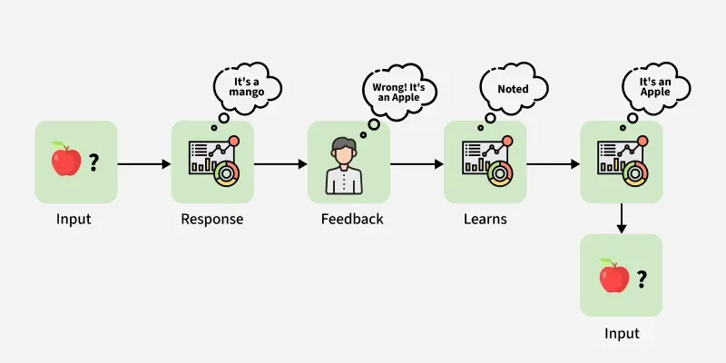

Q-Learning is a popular model-free reinforcement learning algorithm that helps an agent learn how to make the best decisions by interacting with its environment. Instead of needing a model of the environment the agent learns purely from experience by trying different actions and seeing their results.

The Key Components of Q-Learning:

1. Q-Values or Action-Values

   Q-values represent the expected rewards for taking an action in a specific state. These values are updated over time using the Temporal Difference (TD) update rule.

2. Rewards and Episodes

   The agent moves through different states by taking actions and receiving rewards. The process continues until the agent reaches a terminal state which ends the episode.

3. Temporal Difference or TD-Update

   The agent updates Q-values using the formula:
   $$
   Q(S, A) \leftarrow Q(S, A) + \alpha(R + \gamma Q(S', A') - Q(S, A))
   $$
   where:

   - $S$ is the current state.
   - $A$ is the action taken by the agent.
   - $S'$ is the next state the agent moves to.
   - $A'$ is the best next action in state $S'$.
   - $R$ is the reward received for taking action A in state $S$.
   - $\gamma (Gamma)$ is the discount factor which balances immediate rewards with future rewards.
   - $\alpha (Alpha)$ is the learning rate determining how much new information affects the old Q-values.

4. $\epsilon$-greedy Policy (Exploration vs Exploitation)

   The $\epsilon$-greedy policy helps the agent decide which action to take based on the current Q-value estimates:

   - Exploitation: The agent picks the action with the highest Q-value with probability $1 - \epsilon$. This means the agent uses its current knowledge to maximize rewards.
   - Exploration: With probability $\epsilon$, the agent picks a random action, exploring new possibilities to learn if there are better ways to get rewards. This allows the agent to discover new strategies and improve its decision-making over time.

Q-Learning workflow:

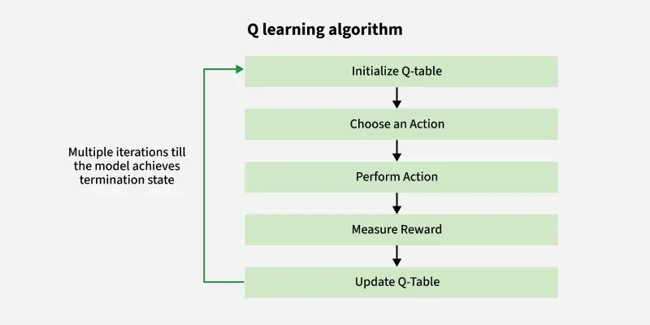

1. Start at a State (S)

   The environment provides the agent with a starting state which describes the current situation or condition.

2. Agent Selects an Action (A)

   Based on the current state and the agent chooses an action using its policy. This decision is guided by a Q-table which estimates the potential rewards for different state-action pairs. The agent typically uses an ε-greedy strategy:

   - It sometimes explores new actions (random choice).
   - It mostly exploits known good actions (based on current Q-values).

3. Action is Executed and Environment Responds

   The agent performs the selected action. The environment then provides:

   - A *new state (S′)* — the result of the action.
   - A *reward (R)* — feedback on the action's effectiveness.

4. Learning Algorithm Updates the Q-Table

   The agent updates the Q-table using the new experience:

   - It adjusts the value for the state-action pair based on the received reward and the new state.
   - This helps the agent better estimate which actions are more beneficial over time.

5. Policy is Refined and the Cycle Repeats

   With updated Q-values the agent:

   - Improves its policy to make better future decisions.
   - Continues this loop — observing states, taking actions, receiving rewards and updating Q-values across many episodes.

Methods for Determining Q-values:

1. Temporal Difference (TD):

   Temporal Difference is calculated by comparing the current state and action values with the previous ones. It provides a way to learn directly from experience, without needing a model of the environment.

2. Bellman's Equation:

   [Bellman Equation](#Bellman Equation) is a recursive formula used to calculate the value of a given state and determine the optimal action. It is fundamental in the context of Q-learning and is expressed as:
   $$
   Q(s, a) = R(s, a) + \gamma max_{a} Q(s', a)
   $$
   where:
   
   - $Q(s, a)$ is the Q-value for a given state-action pair.
   - $R(s, a)$ is the immediate reward for taking action $a$ in state $s$.
   - $\gamma$is the discount factor, representing the importance of future rewards.
   - $max_{a}Q(s', a)$ is the maximum Q-value for the next state $s'$ and all possible actions.

#### SARSA

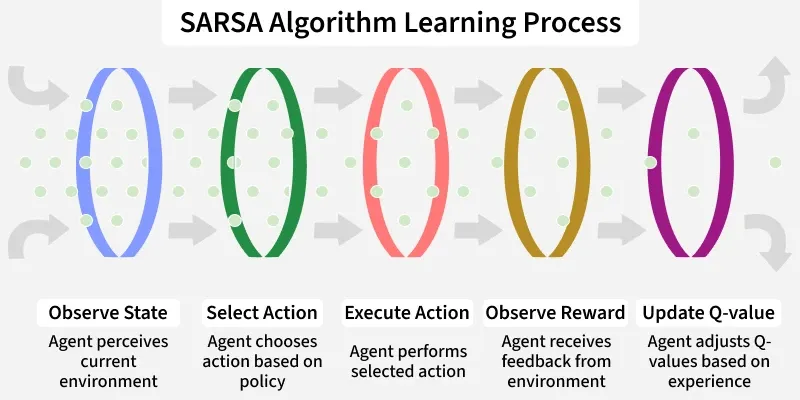

SARSA (State-Action-Reward-State-Action) is an on-policy reinforcement learning (RL) algorithm that helps an agent to learn an optimal policy by interacting with its environment. The agent explores its environment, takes actions, receives feedback and continuously updates its behavior to maximize long-term rewards.

Components of the SARSA Algorithm are as follows:

1. State (S): The current situation or position in the environment.
2. Action (A): The decision or move the agent makes in a given state.
3. Reward (R): The immediate feedback or outcome the agent receives after taking an action.
4. Next State (S'): The state the agent transitions to after taking an action.
5. Next Action (A'): The action the agent will take in the next state based on its current policy.
6. Discount Factor (γ): Determines how much importance is given to future rewards compared to immediate rewards.

SARSA updates the Q-value using the [Bellman Equation](#Bellman Equation) for SARSA:
$$
Q(s_t, a_t) \leftarrow Q(s_t, a_t) + \alpha[r_{t + 1} + \gamma Q(s_{t + 1}, a_{t + 1}) - Q(s_t, a_t)]
$$
where:

- $Q(s_t, a_t)$ is the current Q-value for the state-action pair at time step $t$.
- $\alpha$ is the learning rate (a value between 0 and 1) which determines how much the Q-values are updated.
- $r_{t + 1}$ is immediate reward the agent receives after taking action $a_t$ in state $s_t$.
- $\gamma$ is the discount factor (between 0 and 1) which shows the importance of future rewards.
- $Q(s_{t + 1}, a_{t + 1})$ is the Q-value for the next state-action pair.

SARSA Algorithm Steps:

1. Initialize Q-values

   Begin by setting arbitrary values for the Q-table (for each state-action pair).

2. Choose Initial State

   Start the agent in an initial state $s_0$.

3. Episode Loop

   For each episode (a complete run through the environment) we set the initial state $s_t$ and choose an action $a_t$ based on a policy like $\epsilon$.

4. Step Loop

   For each step in the episode:

   - Take action $a_t$ observe reward $R_{t + 1}$ and transition to the next state s_{t + 1}.
   - Choose the next action $a_{t + 1}$ based on the policy for state $s_{t + 1}$.
   - Update the Q-value for the state-action pair $(s_t, a_t)$ using the SARSA update rule.
   - Set $s_t = s_{t + 1}$ and $a_t = a_{t + 1}$.

5. End Condition

   Repeat until the episode ends either because the agent reaches a terminal state or after a fixed number of steps.

SARSA uses an exploration-exploitation strategy to choose actions. A common strategy is $\epsilon - greedy$:

- *Exploration*: With probability $\epsilon$, the agent chooses a random action (exploring new possibilities).
- *Exploitation*: With probability $1 - \epsilon$, the agent chooses the action with the highest Q-value for the current state (exploiting its current knowledge).

Over time, $\epsilon$ is often decayed to shift from exploration to exploitation as the agent gains more experience in the environment.

#### REINFORCE Algorithm

REINFORCE is a method used in reinforcement learning to improve how decisions are made. It learns by trying actions and then adjusting the chances of those actions based on the total reward received afterwards. Unlike other methods that estimate how good each action is REINFORCE directly learns the best way to choose actions. This makes it useful for tasks where there are many possible actions or continuous choices and when it is hard to estimate the value of each action.

The REINFORCE algorithm works in the following steps:

1. Collect Episodes

   The agent interacts with the environment for a fixed number of steps or until an episode is complete, following the current policy. This generates a trajectory consisting of states, actions and rewards.

2. Calculate Returns

   For each time step $t$, calculate the return $G_t$ which is the total reward obtained from time $t$ onwards. Typically, this is the discounted sum of rewards:
   $$
   G_{t} = \sum_{k = t}^{T}\gamma^{k - t}
   $$
   where $\gamma$ is the discount factor, $T$ is the final time step of the episode and $R_k$ is the reward received at time step $k$.

3. Policy Gradient Update

   The policy parameters $\theta$ are updated using the following formula:
   $$
   \theta_{t + 1} = \theta_{t} + \alpha \nabla_{\theta}\log \pi_{\theta}(a_t | s_t)G_t
   $$
   where:

   - $\alpha$ is the learning rate.
   - $\pi_{\theta}(a_t | s_t)$ is the probability of taking action $a_t$ at state $s_t$, according to the policy.
   - $G_t$ is the return or cumulative reward obtained from time step $t$ onwards.
   - The gradient $\nabla_{\theta} \log \pi_{\theta}(a_t | s_t)$ represents how much the policy probability for action $a_t$ at state $s_t$ should be adjusted based on the obtained return.

4. Repeat

   This process is repeated for several episodes, iteratively updating the policy in the direction of higher rewards.

#### Actor-Critic Algorithm

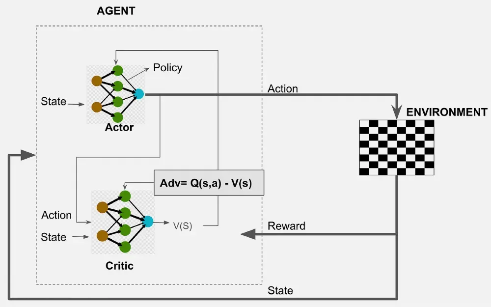

Actor-Critic Algorithm is a type of reinforcement learning algorithm that combines two parts i.e the Actor which selects actions and the Critic which evaluates them. This helps the agent learn more effectively by balancing decision-making and feedback. In the actor-critic method the actor learns how to make decisions and the critic checks how good those decisions are.

There are two key terms:

1. Policy (Actor):
   - The policy denoted as $\pi (a | s)$, represents the probability of taking action a in state $s$.
   - The actor seeks to maximize the expected return by optimizing this policy.
   - The policy is modeled by the actor network and its parameters are denoted by $\theta$.
2. Value Function (Critic):
   - The value function, denoted as $V(s)$, estimates the expected cumulative reward starting from state $s$.
   - The value function is modeled by the critic network and its parameters are denoted by $w$.

Actor Critic Algorithm objective Function:

1. Policy Gradient (Actor)
   $$
   \nabla_{\theta}J(\theta) \approx \frac{1}{N}\sum_{i = 0}^{N} \nabla_{\theta} \log \pi_{\theta}(a_i | s_i) \cdot A(s_i, a_i)
   $$
   here:

   - $J(\theta)$ represents the expected return under the policy parameterized by $\theta$
   - $\pi_{\theta}(a | s)$ is the policy function
   - $N$ is the number of sampled experiences
   - $A(s, a)$ is the advantage function representing the advantage of taking action a in state $s$
   - $i$ represents the index of the sample

2. Value Function Update (Critic)
   $$
   \nabla_{w}J(w) \approx \frac{1}{N}\sum_{i = 1}^{N} \nabla_{w}(V_{w}(s_i) - Q_{w}(s_i, a_i))^{2}
   $$
   here:

   - $\nabla_{w}J(w)$ is the gradient of the loss function with respect to the critic's parameters $w$.
   - $N$ is number of samples.
   - $V_{w}(s_i)$ is the critic's estimate of value of state s with parameter $w$.
   - $Q_{w}(s_i, a_i)$ is the critic's estimate of the action-value of taking action $a$.
   - $i$ represents the index of the sample.

The update rules for the actor and critic involve adjusting their respective parameters using gradient ascent (for the actor) and gradient descent (for the critic):

1. Actor Update
   $$
   \theta_{t + 1} = \theta_{t} + \alpha \nabla_{\theta}J(\theta_{t})
   $$
   here:

   - $\alpha$: learning rate for the actor.
   - $t$ is the time step within an episode.

2. Critic Update
   $$
   w_t = w_t - \beta \nabla_{w}J(w_t)
   $$
   here:

   - $w$ represents the parameters of the critic network
   - $\beta$ is the learning rate for the critic

The advantage function, $A(s, a)$ measures the advantage of taking action $a$ in state $s$ over the expected value of the state under the current policy.
$$
A(s, a) = Q(s, a) - V(s)
$$
The advantage function, then, provides a measure of how much better or worse an action is compared to the average action.

#### Asynchronous Advantage Actor - Critic (A3C)

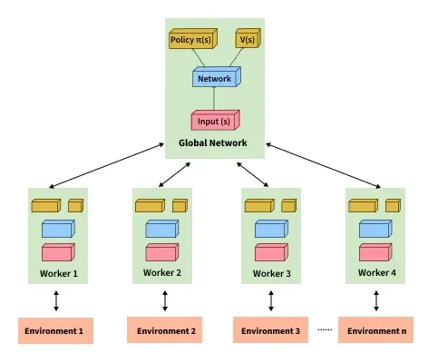

Asynchronous Advantage Actor-Critic (A3C) uses a shared global network along with multiple worker agents that operate in parallel. Each worker interacts with its own environment, learns independently, and contributes updates to the global model, enabling faster and more stable training.

Asynchronous Training:

> A3C runs several agents in parallel, each interacting independently with a separate copy of the environment. These workers collect experience at different rates and send updates simultaneously to a central global network. This parallelism helps:
>
> - Speed up training
> - Provide diverse experience to avoid overfitting
> - Reduce sample correlation (a common issue in reinforcement learning)

Actor-Critic Framework:

> A3C uses two interconnected models:
>
> - Actor: Learns the policy $\pi(a | s)$ which defines the probability of taking action $a$ in state $s$.
> - Critic: Learns the value function $V(s)$ which estimates how good a given state is.

Advantage Function:

> Rather than using raw rewards alone, A3C incorporates the advantage function, defined as:
> $$
> A(s, a) = Q(s, a) - V(s)
> $$
> This measures how much better (or worse) an action is compared to the expected value of the state. Using this helps:
>
> - Provide clearer learning signals
> - Reduce the variance in policy gradient updates.

---

## Semi Supervised Learning

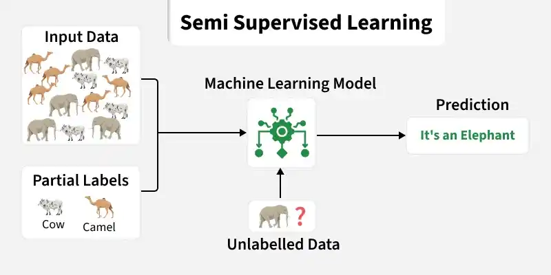

### Semi Supervised Classification

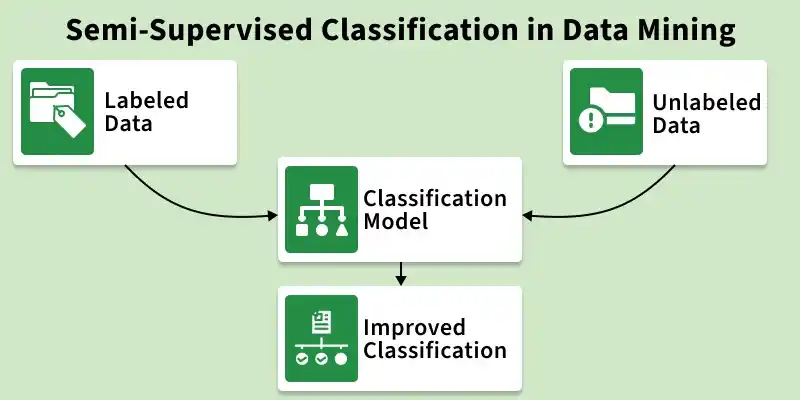

Semi supervised classification is a technique in data mining that uses both labeled and unlabeled data to build a classification model. Usually, only a small portion of the dataset has labels, while the remaining data is unlabeled. The model learns patterns from both types of data to improve classification performance.

Semi Supervised Classification workflow:

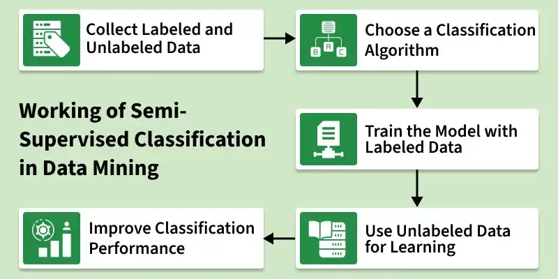

1. Collect Labeled and Unlabeled Data

   Gather a dataset that contains a small amount of labeled data and a large amount of unlabeled data.

2. Choose a Classification Algorithm

   Select a suitable classification algorithm that can work with both labeled and unlabeled data.

3. Train the Model with Labeled Data

   The model first learns patterns and relationships using the available labeled data.

4. Use Unlabeled Data for Learning

   The model then uses the unlabeled data to discover additional patterns and improve its understanding.

5. Improve Classification Performance

   By combining both types of data, the model becomes better at classifying new or unseen data.

### Self-Training

Self-training is a semi-supervised learning technique where a model is initially trained on a small labelled dataset and then iteratively refined using its own predictions.

Steps of a Semi-Supervised Learning process using pseudo-labeling:

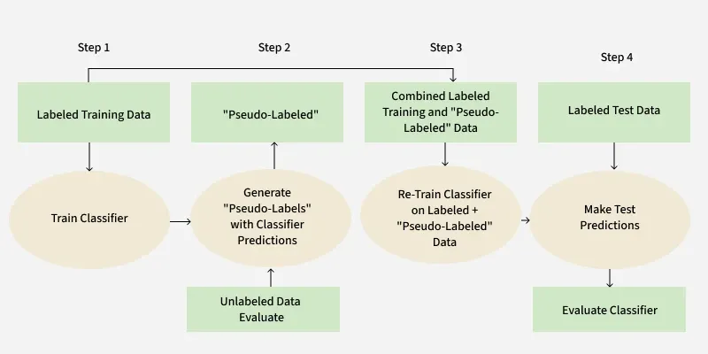

1. Train on Labelled Data: Start with a model trained on a small labelled dataset.
2. Generate Pseudo-Labels: Use the trained model to predict labels for the unlabeled data. Filter these predictions by confidence thresholds (e.g., only accept predictions with high probabilities).
3. Augment Training Data: Add the pseudo-labeled samples to the original labeled dataset.
4. Iterative Refinement: Retrain the model on the augmented dataset. Repeat the process until the model's performance converges or a predefined number of iterations is reached.

### Few Shot learning

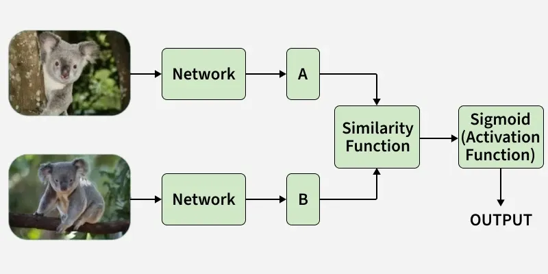

Few-Shot Learning is a machine learning approach where models learn to perform new tasks or recognize new classes using only a few labeled samples. Supervised learning needs large datasets, FSL aims to mimic human learning, allowing models to generalize from limited examples.

Few Shot workflow:

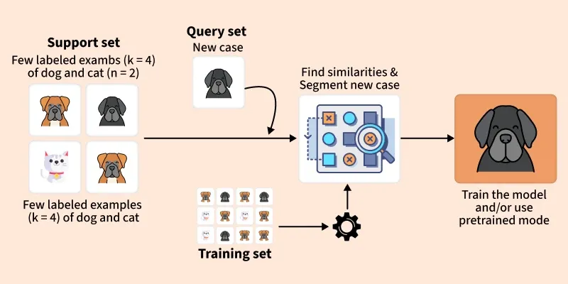

In Few Shot Learning each task is generally divided into two key parts the Support Set and the Query Set. These two sets play a vital role in helping the model learn from a few labeled examples and then generalize to new unseen samples.

Support Set (S):

The Support Set is a small collection of labeled examples used for learning represented as:
$$
S = \{(x_1, y_), (x_2, y_2), \cdots, (x_k, y_k)\}
$$
where:

- $x_i$ represents the data point
- $y_i$ is the corresponding label for that data point

Query Set (Q):

The Query Set contains unlabeled examples used to test the model’s ability to generalize.
$$
Q = \{x_1', x_2', \cdots, x_m'\}
$$
The model’s task is to predict the labels for these query samples based on what it has learned from the Support Set.

---

## Forecasting Models

### ARIMA

ARIMA (Autoregressive Integrated Moving Average) model is used for forecasting time series data. It has some components that allow the model to capture patterns such as trends. For seasonal patterns, an extension called Seasonal ARIMA (SARIMA) is used. Its components are:

1. Autoregression (AR)

   The autoregressive part (AR) of an ARIMA model is represented by the parameter $p$. It signifies the dependence of the current observation on its previous values. Mathematically, an AR(p) model can be represented as:
   $$
   Y_t = c + \phi_{1}Y_{t - 1} + \phi_{2}Y_{t - 2} + \cdots + \phi_{p}Y_{t - p} + \epsilon_{t}
   $$
   here:

   - $Y_t$ is the current observation
   - $c$ is a constant
   - $\phi_{1}$ to $\phi_{2}$ are the autoregressive parameters
   - $\epsilon_{t}$ represents the error term at time $t$

2. Differencing (I)

   The differencing part of ARIMA is represented by the parameter $d$. It involves transforming a non stationary time series into a stationary one by differencing consecutive observations. We can apply the differencing operation multiple times until stationarity is achieved. The formula for differencing is:straightforward:
   $$
   Y_{t}' = Y_{t} - Y_{t - 1}
   $$
   here:

   - $Y_{t}'$ is the differenced series at time $t$
   - $Y_t$ is the original series at time $t$
   - $Y_{t - 1}$ is the value of the series at the previous time step

   The differencing process is typically applied multiple times until stationarity is achieved. The notation $I(d)$ indicates the order of differencing required for stationarity.

3. Moving Average (MA)

   The moving average part (MA) of an ARIMA model is represented by the parameter $q$. It indicates the dependence of the current observation on the previous forecast errors. Mathematically, an $MA(q)$ model can be represented as:
   $$
   Y_t = c + \epsilon_{t} + \theta_{1}\epsilon_{t - 1} + \theta_{2}\epsilon_{t - 2} + \cdots + \theta_{q}\epsilon_{t - q}
   $$
   here:

   - $Y_t$ is the current observation
   - $c$ is a constant
   - $\epsilon_{t}$ is the error at time $t$
   - $\theta_{1}$ to $\theta_{1}$ are the moving average parameters

### SARIMA

SARIMA or Seasonal Autoregressive Integrated Moving Average is an extension of the traditional ARIMA model, specifically designed for time series data with seasonal patterns. While ARIMA is great for non-seasonal data, SARIMA introduces seasonal components to handle periodic fluctuations and provides better forecasting capabilities for seasonal data.

The SARIMA model is represented as:
$$
SARIMA(p, d, q)(P, D, Q, s)
$$

- $p$: Autoregressive order
- $d$: Number of non-seasonal differences
- $q$: Moving average order
- $P$: Seasonal autoregressive order
- $D$: Seasonal differencing order
- $Q$: Seasonal moving average order
- $s$: Length of the seasonal period (e.g., 12 for monthly data)

The SARIMA model can be expressed mathematically as:
$$
(1 - \phi_{1}B)(1 - \Phi_{1}B^s)(1 - B)(1 - B^s)y_t = (1 + \theta_{1}B)(1 + \Theta_{1}B^s)\epsilon_{t}
$$

- $y_t$: The observed time series at time $t$.
- $B$: The backshift operator (lag operator)
- $\phi_{1}$: Non-seasonal autoregressive coefficient
- $\Phi_{1}$: Seasonal autoregressive coefficient
- $\theta_{1}$: Non-seasonal moving average coefficient
- $\Theta_{1}$: Seasonal moving average coefficient
- $s$: Seasonal period
- $\epsilon_{t}$: The white noise error term

### Exponential Smoothing

Exponential Smoothing is a statistical technique used to forecast future observations by assigning exponentially decreasing weights to past data points. It is applied in scenarios where data shows randomness, trends or seasonality.

Types of Exponential Smoothing:

1. Simple or Single Exponential Smoothing

   Simple Smoothing is a forecasting method used for time series data that does not exhibit a trend or seasonality. It relies on univariate data and uses a single parameter called alpha ($\alpha$) or the smoothing factor.

   - $\alpha$ determines how much weight is given to the current observation versus the past estimates.
   - A smaller $\alpha$ gives more importance to past predictions, while a larger $\alpha$ emphasizes recent observations.
   - The value of $\alpha$ typically ranges from 0 to 1.

   The formula for simple smoothing is as follows:
   $$
   s_t = \alpha x_t + (1 - \alpha)s_{t - 1} = s_{t - 1} + \alpha(x_t - s_{t - 1})
   $$
   where:

   - $s_t$: smoothed statistic (simple weighted average of current observation $x_t$)
   - $s_{t - 1}$: previous smoothed statistic
   - $\alpha$: smoothing factor of data; $0 < \alpha < 1$
   - $t$: time period

2. Double Exponential Smoothing

   Double Exponential Smoothing is a method used to forecast the trend of a time series that does not have seasonality. It's also called Holt’s Trend Model, second-order smoothing or Holt’s Linear Smoothing.

   - It accounts for trends in the data by introducing a trend component.
   - It uses alpha $\alpha$ to smooth the level of the series.
   - It uses beta $\beta$ to smooth the trend or rate of change.
   - It supports both additive and multiplicative trends.

   The formulas for Double exponential smoothing are as follows:
   $$
   s_t = \alpha x_t + (1 - \alpha)(s_{t - 1} + b_{t - 1}) \\
   \beta_{t} = \beta(s_t - s_{t - 1}) + (1 - \beta)b_{t - 1}
   $$
   where:

   - $b_t$: best estimate of the trend at time $t$
   - $\beta$: trend smoothing factor; $0 < \beta < 1$

3. Holt-Winters' Exponential Smoothing

   Triple exponential smoothing also known as Holt-Winters smoothing is a smoothing method used to predict time series data with both a trend and seasonal component. Gamma ($\gamma$) is used to control the effect of seasonal component.

   The formulas for the triple exponential smoothing are as follows:
   $$
   s_0 = x_0 \\
   s_t = \alpha(x_t / c_{t - L}) + (1 - \alpha)(s_{t - 1} + b_{t - 1}) \\
   b_t = \beta(s_t - s_{t - 1}) + (1 - \beta)b_{t - 1} \\
   c_t = \gamma\frac{x_t}{s_t} + (1 - \gamma)c_{t - L}
   $$
   where:

   - $s_t$: smoothed statistic
   - $s_{t - 1}$: previous smoothed statistic
   - $\alpha$: smoothing factor of data ($0 < \alpha < 1$)
   - $t$: time period
   - $b_t$:
   - $\beta$:
   - $c_{t}$:
   - $\gamma$:

---

## Summary

### Comparison of Various Feature Scaling Techniques

|                Type                 |                   Method Description                   | Sensitivity to Outliers  |                Typical Use Cases                |
| :---------------------------------: | :----------------------------------------------------: | :----------------------: | :---------------------------------------------: |
|    **Absolute Maximum Scaling**     |  Divides values by max absolute value in each feature  |           High           |           Sparse data, simple scaling           |
| **Min-Max Scaling (Normalization)** |      Scales features to by min-max normalization       |           High           |     Neural networks, bounded input features     |
|   **Normalization (Vector Norm)**   |  Scales each sample vector to unit length (norm = 1)   | Not applicable (per row) | Direction-based similarity, text classification |
|    **Standardization (Z-Score)**    | Centers features to mean 0 and scales to unit variance |         Moderate         | Most ML algorithms, assumes approx. normal data |
|         **Robust Scaling**          |         Centers on median and scales using IQR         |           Low            |    Data with outliers, skewed distributions     |

### Feature Selection vs Feature Extraction

|       **Aspect**       |                      Feature Selection                       |                      Feature Extraction                      |
| :--------------------: | :----------------------------------------------------------: | :----------------------------------------------------------: |
|     **Definition**     | Selecting a subset of relevant features from the original set | Transforming the original features into a new set of features |
|      **Purpose**       |                    Reduce dimensionality                     | Transform data into a more manageable or informative representation |
|      **Process**       |         Filtering, wrapper methods, embedded methods         | Signal processing, statistical techniques, transformation algorithms |
|       **Output**       |                 Subset of selected features                  |               New set of transformed features                |
| **Computational Cost** |                          Lower cost                          |    May be higher, especially for complex transformations     |
|  **Interpretability**  |        Retains interpretability of original features         |    May lose interpretability depending on transformation     |

### Linear Regression vs Logistic Regression

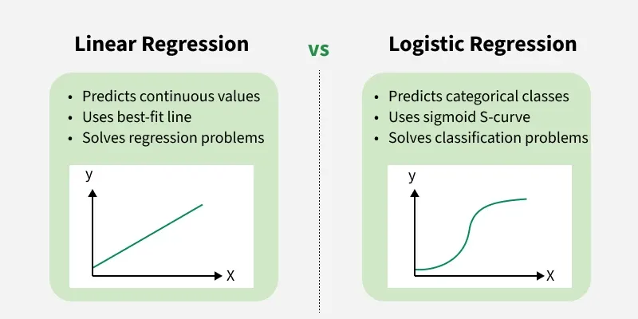

|          Aspect         |                 Linear Regression                 |                Logistic Regression                |
| :--------------------------------: | :----------------------------------------------------------: | :----------------------------------------------------------: |
|        Definition       | Linear regression is used to predict the continuous dependent variable using a given set of independent variables. | Logistic regression is used to predict the categorical dependent variable using a given set of independent variables. |
|       Problem Type      |          It is used for solving regression problem.          |       It is used for solving classification problems.        |
|       Output Type       |    In this we predict the value of continuous variables.     |     In this we predict values of categorical variables.      |
|   Curve/Model Fitting   |                In this we find best fit line.                |                   In this we find S-Curve.                   |
|    Estimation Method    | Least square estimation method is used for estimation of accuracy. | Maximum likelihood estimation method is used for estimation of accuracy. |
|      Output Example     | The output must be continuous value such as price, age etc.  | Output must be categorical value such as 0 or 1, Yes or No, etc. |
| Relationship Requirement| It required linear relationship between dependent and independent variables. |             It not required linear relationship.             |
|       Collinearity      | There may be collinearity between the independent variables. | There should be little to no collinearity between independent variables. |

### ID3 vs C4.5 vs CART vs CHAID vs Conditional Inference Trees

|            Algorithm            |                       Splitting Method                       |                     When to Use                      |
| :-----------------------------: | :----------------------------------------------------------: | :--------------------------------------------------: |
|             **ID3**             |  Entropy and Information Gain on categorical features only   |     Simple classification with categorical data      |
|            **C4.5**             | Gain Ratio handles continuous and categorical features applies pruning | Mixed data types with better generalization than ID3 |
|            **CART**             | Gini Impurity for classification variance reduction for regression binary splits | Classification and regression tasks on tabular data  |
|            **CHAID**            |  Chi-Square test multi-way splits for categorical features   |    Large datasets with many categorical variables    |
| **Conditional Inference Trees** | Statistical hypothesis and permutation tests unbiased splits |   Mixed data types and unbiased feature selection    |

### Linear SVM vs Non-Linear SVM

|      **Feature**       |                 Linear SVM                 |                  Non-Linear SVM                  |
| :--------------------: | :----------------------------------------: | :----------------------------------------------: |
| **Decision Boundary**  |        Straight line or hyperplane         |           Curved or complex boundaries           |
|  **Data Separation**   | Works well when data is linearly separable |     Suitable for non-linearly separable data     |
|    **Kernel Usage**    |     No kernel or uses a linear kernel      | Uses non-linear kernels (e.g., RBF, polynomial)  |
| **Computational Cost** |     Generally faster and less complex      |          More computationally intensive          |
|  **Example Use Case**  |    Spam detection with simple features     | Image classification, or handwriting recognition |

### Difference Between Different Naive Bayes Model

|          **Aspect**           |                   **Gaussian Naive Bayes**                   |                 **Multinomial Naive Bayes**                  |                  **Bernoulli Naive Bayes**                   |
| :---------------------------: | :----------------------------------------------------------: | :----------------------------------------------------------: | :----------------------------------------------------------: |
|    **Feature Type**     |              Continuous (real-valued features)               |      Discrete (count data or frequency-based features)       |           Binary (presence or absence of features)           |
|     **Assumption**      |    Assumes data follows a Gaussian (normal) distribution     |       Assumes data follows a multinomial distribution        |    Assumes data follows a Bernoulli (binary) distribution    |
|   **Common Use Case**   |  Suitable for continuous features like height, weight, etc.  |        Suitable for text classification (word counts)        | Suitable for binary classification tasks (e.g., spam detection) |
| **Data Representation** |         Features are treated as continuous variables         |    Features are treated as discrete counts or frequencies    |        Features are treated as binary (0 or 1) values        |
| **Mathematical Model**  | Uses Gaussian distribution (mean and variance) for each feature | Uses the multinomial distribution for word counts in text classification | Uses Bernoulli distribution (probability of a feature being present) |
|       **Example**       | Predicting whether an email is spam based on numeric features |  Predicting whether a document is spam based on word counts  | Classifying a document as spam or not based on word presence |

### Multinomial Naive vs Gaussian Naive Bayes

|                   Multinomial Naive Bayes                    |                     Gaussian Naive Bayes                     |
| :----------------------------------------------------------: | :----------------------------------------------------------: |
| It is specially designed for discrete data, particularly text data. | It is suitable for continuous data where features follow a Gaussian distribution. |
| It assumes features and represent its counts like word counts. |    It assumes a Gaussian distribution for the likelihood.    |
| It is commonly used in NLP for document classification tasks. | It is commonly used in tasks involving continuous data such as medical diagnosis, fraud detection and weather prediction. |
| The likelihood of each feature is calculated using the multinomial distribution. | The likelihood of each feature is modelled using the Gaussian distribution. |
| It is more efficient when the number of features is very high like in text datasets with thousands of words. |    It may not perform well on non-normal or sparse data.     |

### OPTICS vs DBSCAN

|          **Feature**          |                            OPTICS                            |                            DBSCAN                            |
| :---------------------------: | :----------------------------------------------------------: | :----------------------------------------------------------: |
| **Handles Varying Densities** |         Can detect clusters of different densities.          | Struggles with varying densities as it requires a single epsilon value for all points. |
|  **Cluster Identification**   | Uses a reachability plot for cluster extraction and identifies hierarchical structures. |  Directly assigns clusters without hierarchical structure.   |
|  **Hierarchical Structure**   |              Yes it can detect nested clusters.              |       No it does not support hierarchical clustering.        |
|    **Runtime Complexity**     | Higher due to sorting and ordering of reachability distances. |          Lower as it processes fewer calculations.           |
|        **Memory Cost**        | Requires more memory as it maintains a priority queue (Min Heap) for reachability. |                     Lower memory usage.                      |
|     **Fewer Parameters**      | Less sensitive to the epsilon parameter and can work with a large max_eps, but still uses a neighborhood radius internally. | Requires careful tuning of epsilon and minPts parameters for effective clustering. |
|      **Noise Handling**       | Does not directly identify noise points but high reachability distances may indicate noise. | Directly identify core points, boundary points and noise points. |
|    **Cluster Extraction**     | Produces a reachability distance plot for flexible extraction at different granularities. | Assigns clusters directly based on density criteria without additional plots. |

### PCA vs ICA

|     **Parameters**     |         **Principal Component Analysis (PCA)**         |        **Independent Component Analysis (ICA)**        |
| :--------------------------: | :----------------------------------------------------------: | :----------------------------------------------------------: |
|        **Goal**        |  Reduces the dimensions to avoid the problem of overfitting  | Decomposes the mixed signal into its independent source signals |
| **Type of Components** |             Deals with the Principal Components              |            Deals with the Independent Components             |
| **Focus on Variance**  |              Focuses on maximizing the variance              | Doesn't focus on the issue of variance among the data points |
|   **Orthogonality**    | Focuses on the mutual orthogonality property of the principal components | Doesn't focus on the mutual orthogonality of the components  |
|    **Independence**    |  Doesn't focus on the mutual independence of the components  |     Focuses on the mutual independence of the components     |
|    **Typical Use**     |           Mainly used for dimensionality reduction           |   Mainly used for signal separation and feature extraction   |

### PCA vs LLE vs Isomap vs t-SNE

|      **Feature**       |        PCA        |           LLE            |              Isomap              |             t-SNE              |
| :--------------------: | :---------------: | :----------------------: | :------------------------------: | :----------------------------: |
|        **Type**        |      Linear       |        Non Linear        |            Non Linear            |           Non Linear           |
|        **Goal**        | Maximize variance | Preserve local structure |    Preserve global distances     |  Preserve local similarities   |
|  **Global Structure**  |        Yes        |            No            |               Yes                |               No               |
|  **Local Structure**   |      Limited      |           Yes            |               Yes                |              Yes               |
| **Computational Cost** |        Low        |         Moderate         |          Moderate-High           |              High              |
|      **Best Use**      |  Linear datasets  |   Non Linear manifolds   | Non Linear with global structure | High dimensional visualization |

### FP-Growth vs Apriori Algorithm

|         Feature          |             FP-Growth              |             Apriori              |
| :----------------------: | :--------------------------------: | :------------------------------: |
| **Candidate generation** |            Not required            |              Needed              |
|      **Data scans**      |                 2                  |             Several              |
|        **Speed**         |    Efficient for large datasets    | Slower because of repeated scans |
|      **Memory use**      | Higher (requires a tree structure) |              Lower               |
|      **Complexity**      |    More difficult to implement     |    Simpler to grasp and build    |

### Apriori vs ECLAT

|      **Aspect**       |                Apriori                 |                   ECLAT                    |
| :-------------------: | :------------------------------------: | :----------------------------------------: |
|    **Data Format**    |   Horizontal (transactions as rows)    | Vertical (items linked to transaction IDs) |
|  **Search Strategy**  |       Breadth-First Search (BFS)       |          Depth-First Search (DFS)          |
|  **Database Scans**   |        Multiple scans required         |             Fewer scans needed             |
| **Memory Efficiency** |         Less memory-efficient          |           More memory-efficient            |
|       **Speed**       | Slower, especially with large datasets |   Faster due to vertical representation    |

### SARSA vs Q-Learning

|         **Feature**          |                      SARSA (On-Policy)                      |           Q-Learning (Off-Policy)            |
| :--------------------------: | :---------------------------------------------------------: | :------------------------------------------: |
| **Policy Used for Learning** |            Learns from actions it actually takes            |  Learns from best possible actions (max Q)   |
|       **Update Uses**        |                         $Q(s’, a’)$                         |              $max^{a}Q(s', a)$               |
|    **Exploration Effect**    |                     Included in updates                     |              Ignored in updates              |
|         **Behavior**         | Learns a safer policy because updates depend on exploration |       Learns more aggressive policies        |
|    **Convergence Speed**     |                           Slower                            |                    Faster                    |
|         **Best For**         |       Environments where exploration affects outcomes       | Environments where optimal actions are clear |

## Reference

[1] Ashish Vaswani; Noam Shazeer; Niki Parmar; Jakob Uszkoreit; Llion Jones; Aidan N. Gomez; Łukasz Kaiser; Illia Polosukhin. Attention Is All You Need

[2] [WIKIPEDIA: Machine learning](https://en.wikipedia.org/wiki/Machine_learning)

[3] [WIKIPEDIA: Deep Learning](https://en.wikipedia.org/wiki/Deep_learning)

[4] [IBM: What is machine learning?](https://www.ibm.com/think/topics/machine-learning)

[5] [IBM: What is a transformer model?](https://www.ibm.com/think/topics/transformer-model#1280257394)

[6] [IBM: What is an autoencoder?](https://www.ibm.com/think/topics/autoencoder#763338462)

[7] [IBM: What is a Mamba model?](https://www.ibm.com/think/topics/mamba-model#763338463)

[8] [IBM: What is a GNN (graph neural network)?](https://www.ibm.com/think/topics/graph-neural-network#763338464)

[9] [A piece of knowledge each day: AI and Machine Learning (ML)](https://blog.bytebytego.com/p/ep183-mcp-vs-api-whats-the-difference)

[10] [Naive Bayes Classifiers](https://www.geeksforgeeks.org/machine-learning/naive-bayes-classifiers/)

[11] [Logistic Regression in Machine Learning](https://www.geeksforgeeks.org/machine-learning/understanding-logistic-regression/)

[12] [Support Vector Machine (SVM) Algorithm](https://www.geeksforgeeks.org/machine-learning/support-vector-machine-algorithm/)

[13] [Random Forest Algorithm in Machine Learning](https://www.geeksforgeeks.org/machine-learning/random-forest-algorithm-in-machine-learning/)

[14] [Machine Learning Tutorial](https://www.geeksforgeeks.org/machine-learning/machine-learning/)

[15] [Data Cleaning](https://www.geeksforgeeks.org/data-analysis/data-cleaning-introduction/)

[16] [Data Preprocessing in Python](https://www.geeksforgeeks.org/data-analysis/data-preprocessing-machine-learning-python/)

[17] [Feature Engineering - Scaling, Normalization and Standardization](https://www.geeksforgeeks.org/machine-learning/feature-engineering-scaling-normalization-and-standardization/)

[18] [Feature Engineering](https://www.geeksforgeeks.org/machine-learning/what-is-feature-engineering/)

[19] [Feature Selection Techniques in Machine Learning](https://www.geeksforgeeks.org/machine-learning/feature-selection-techniques-in-machine-learning/)

[20] [Regularization in Machine Learning](https://www.geeksforgeeks.org/machine-learning/regularization-in-machine-learning/)

[21] [Understanding the Confusion Matrix in Machine Learning](https://www.geeksforgeeks.org/machine-learning/confusion-matrix-machine-learning/)

[22] [Understanding the Confusion Matrix in Machine Learning](https://www.geeksforgeeks.org/machine-learning/confusion-matrix-machine-learning/)

[23] [Precision and Recall in Machine Learning](https://www.geeksforgeeks.org/machine-learning/precision-and-recall-in-machine-learning/)

[24] [F1 Score in Machine Learning](https://www.geeksforgeeks.org/machine-learning/f1-score-in-machine-learning/)

[25] [AUC-ROC Curve in Machine Learning](https://www.geeksforgeeks.org/machine-learning/auc-roc-curve/)

[26] [Cross Validation in Machine Learning](https://www.geeksforgeeks.org/machine-learning/cross-validation-machine-learning/)

[27] [Hyperparameter Tuning](https://www.geeksforgeeks.org/machine-learning/hyperparameter-tuning/)

[28] [Linear Regression in Machine learning](https://www.geeksforgeeks.org/machine-learning/ml-linear-regression/)

[29] [Gradient Descent in Linear Regression](https://www.geeksforgeeks.org/machine-learning/gradient-descent-in-linear-regression/)

[30] [Logistic Regression in Machine Learning](https://www.geeksforgeeks.org/machine-learning/understanding-logistic-regression/)

[31] [Cost function in Logistic Regression](https://www.geeksforgeeks.org/machine-learning/ml-cost-function-in-logistic-regression/)

[32] [Decision Tree in Machine Learning](https://www.geeksforgeeks.org/machine-learning/decision-tree-introduction-example/)

[33] [Decision Tree Algorithms](https://www.geeksforgeeks.org/machine-learning/decision-tree-algorithms/)

[34] [Support Vector Machine (SVM) Algorithm](https://www.geeksforgeeks.org/machine-learning/support-vector-machine-algorithm/)

[35] [Understanding Decision Boundaries in K-Nearest Neighbours (KNN)](https://www.geeksforgeeks.org/machine-learning/understanding-decision-boundaries-in-k-nearest-neighbors-knn/)

[36] [Gaussian Naive Bayes](https://www.geeksforgeeks.org/machine-learning/gaussian-naive-bayes/)

[37] [Multinomial Naive Bayes](https://www.geeksforgeeks.org/machine-learning/multinomial-naive-bayes/)

[38] [Bernoulli Naive Bayes](https://www.geeksforgeeks.org/machine-learning/bernoulli-naive-bayes/)

[39] [Complement Naive Bayes (CNB) Algorithm](https://www.geeksforgeeks.org/machine-learning/complement-naive-bayes-cnb-algorithm/)

[40] [Random Forest Algorithm in Machine Learning](https://www.geeksforgeeks.org/machine-learning/random-forest-algorithm-in-machine-learning/)

[41] [Random Forest Hyperparameter Tuning in Python](https://www.geeksforgeeks.org/machine-learning/random-forest-hyperparameter-tuning-in-python/)

[42] [Ensemble Learning](https://www.geeksforgeeks.org/machine-learning/a-comprehensive-guide-to-ensemble-learning/)

[43] [Bagging Classifier](https://www.geeksforgeeks.org/machine-learning/what-is-bagging-classifier/)

[44] [AdaBoost in Machine Learning](https://www.geeksforgeeks.org/machine-learning/adaboost-in-machine-learning/)

[45] [Clustering in Machine Learning](https://www.geeksforgeeks.org/machine-learning/clustering-in-machine-learning/)

[46] [K means Clustering – Introduction](https://www.geeksforgeeks.org/machine-learning/k-means-clustering-introduction/)

[47] [Elbow Method for optimal value of k in KMeans](https://www.geeksforgeeks.org/machine-learning/elbow-method-for-optimal-value-of-k-in-kmeans/)

[48] [K-Medoids clustering in Machine Learning](https://www.geeksforgeeks.org/machine-learning/k-medoids-clustering-in-machine-learning/)

[49] [Gaussian Mixture Model](https://www.geeksforgeeks.org/machine-learning/gaussian-mixture-model/)

[50] [Expectation-Maximization Algorithm - ML](https://www.geeksforgeeks.org/machine-learning/ml-expectation-maximization-algorithm/)

[51] [DBSCAN Clustering in ML - Density based clustering](https://www.geeksforgeeks.org/machine-learning/dbscan-clustering-in-ml-density-based-clustering/)

[52] [OPTICS Clustering - ML](https://www.geeksforgeeks.org/machine-learning/ml-optics-clustering/)

[53] [Fuzzy Clustering - ML](https://www.geeksforgeeks.org/machine-learning/ml-fuzzy-clustering/)

[54] [Agglomerative Clustering](https://www.geeksforgeeks.org/machine-learning/agglomerative-clustering/)

[55] [Divisive Clustering](https://www.geeksforgeeks.org/artificial-intelligence/divisive-clustering/)

[56] [T-distributed Stochastic Neighbor Embedding (t-SNE) Algorithm - ML](https://www.geeksforgeeks.org/machine-learning/ml-t-distributed-stochastic-neighbor-embedding-t-sne-algorithm/)

[57] [Non-Negative Matrix Factorization](https://www.geeksforgeeks.org/machine-learning/non-negative-matrix-factorization/)

[58] [Independent Component Analysis - ML](https://www.geeksforgeeks.org/machine-learning/ml-independent-component-analysis/)

[59] [Isomap - A Non-linear Dimensionality Reduction Technique](https://www.geeksforgeeks.org/machine-learning/isomap-a-non-linear-dimensionality-reduction-technique/)

[60] [Swiss Roll Reduction with LLE in Scikit Learn](https://www.geeksforgeeks.org/machine-learning/swiss-roll-reduction-with-lle-in-scikit-learn/)

[61] [Locally Linear Embedding in Machine Learning](https://www.geeksforgeeks.org/machine-learning/locally-linear-embedding-in-machine-learning/)

[62] [Apriori Algorithm](https://www.geeksforgeeks.org/machine-learning/apriori-algorithm/)

[63] [Frequent Pattern Growth Algorithm](https://www.geeksforgeeks.org/machine-learning/frequent-pattern-growth-algorithm/)

[64] [ECLAT Algorithm - ML](https://www.geeksforgeeks.org/machine-learning/ml-eclat-algorithm/)

[65] [Markov Decision Process](https://www.geeksforgeeks.org/machine-learning/markov-decision-process/)

[66] [Bellman Equation](https://www.geeksforgeeks.org/machine-learning/bellman-equation/)

[67] [Monte Carlo Tree Search (MCTS) in Machine Learning](https://www.geeksforgeeks.org/machine-learning/monte-carlo-tree-search-mcts-in-machine-learning/)

[68] [Q-Learning in Reinforcement Learning](https://www.geeksforgeeks.org/machine-learning/q-learning-in-python/)

[69] [SARSA (State-Action-Reward-State-Action) in Reinforcement Learning](https://www.geeksforgeeks.org/machine-learning/sarsa-reinforcement-learning/)

[70] [REINFORCE Algorithm](https://www.geeksforgeeks.org/machine-learning/reinforce-algorithm/)

[71] [Actor-Critic Algorithm in Reinforcement Learning](https://www.geeksforgeeks.org/machine-learning/actor-critic-algorithm-in-reinforcement-learning/)

[72] [Asynchronous Advantage Actor Critic (A3C) algorithm](https://www.geeksforgeeks.org/machine-learning/asynchronous-advantage-actor-critic-a3c-algorithm/)

[73] [Semi Supervised Classification](https://www.geeksforgeeks.org/machine-learning/semi-supervised-classification/)

[74] [Self-Training in Semi-Supervised Learning](https://www.geeksforgeeks.org/machine-learning/self-training-in-semi-supervised-learning/)

[75] [Few-shot learning in Machine Learning](https://www.geeksforgeeks.org/machine-learning/few-shot-learning-in-machine-learning/)

[76] [ARIMA (Auto-Regressive Integrated Moving Average)](https://www.geeksforgeeks.org/machine-learning/model-selection-for-arima/)

[77] [SARIMA (Seasonal ARIMA)](https://www.geeksforgeeks.org/machine-learning/sarima-seasonal-autoregressive-integrated-moving-average/)

[78] [Exponential Smoothing (Holt-Winters)](https://www.geeksforgeeks.org/artificial-intelligence/exponential-smoothing-for-time-series-forecasting/)

[79] [ARIMA](https://www.geeksforgeeks.org/machine-learning/model-selection-for-arima/)

[80] [SARIMA (Seasonal Autoregressive Integrated Moving Average)](https://www.geeksforgeeks.org/machine-learning/sarima-seasonal-autoregressive-integrated-moving-average/)

[81] [Exponential Smoothing for Time Series Forecasting](https://www.geeksforgeeks.org/artificial-intelligence/exponential-smoothing-for-time-series-forecasting/)
