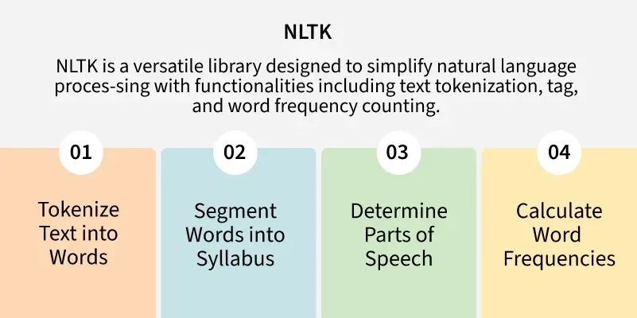

# Natural Language Processing (NLP)

[TOC]

Natural Language Processing (NLP) helps machines to understand and process human languages, either in text or audio form. It is used across a variety of applications, from speech recognition to language translation and text summarization.

## Tasks

## Workflow

### Lexical and Morphological Analysis

**Lexical Analysis** focuses on identifying and processing words (or lexemes) in a text. It breaks down the input text into individual tokens that are meaningful units of language, such as words or phrases.

**Morphological Analysis** deals with *morphemes*, which are the smallest units of meaning in a word. It is important for understanding the structure of words and their parts by identifying free morphemes and bound morphemes.

#### Tokenization

Tokenization is the process of breaking text into smaller units called tokens, which helps machines process and analyze language effectively.

Types of Tokenization in NLP:

#### POS(Part-of-Speech) Tagging

Parts of Speech (PoS) tagging is a fundamental task in Natural Language Processing (NLP) where each word in a sentence is assigned a grammatical category such as noun, verb, adjective or adverb. This process helps machines to understand the structure and meaning of sentences by identifying the roles of words and their relationships.

- **Rule-based POS tagging** assigns POS tags based on predefined grammatical rules. These rules are crafted based on morphological features (like word endings) and syntactic context, making the approach highly interpretable and transparent.
- **Statistical POS Tagging** uses probabilistic models to assign grammatical categories (e.g noun, verb, adjective) to words in a text. Unlike rule-based methods, which rely on handcrafted rules, it learns patterns from large annotated corpora using machine learning techniques.
- **Transformation-Based Tagging (TBT)** refines POS tags through a series of context-based transformations. Unlike statistical taggers that rely on probabilities or rule-based taggers, it starts with initial tags and improves them iteratively by applying transformation rules.

#### Stemming

Stemming is an important text-processing technique that reduces words to their base or root form by removing prefixes and suffixes. This process standardizes words which helps to improve the efficiency and effectiveness of various natural language processing (NLP) tasks.

#### Lemmatization

Lemmatization is an important text pre-processing technique in Natural Language Processing (NLP) that reduces words to their base form, known as a "lemma."

### Syntactic Analysis

**Parsing**, also known as **syntactic analysis**, is the process of analyzing a sequence of [tokens](https://www.geeksforgeeks.org/compiler-design/token-patterns-and-lexems/) to determine the grammatical structure of a program. It takes the stream of tokens, which are generated by a lexical analyzer or tokenizer, and organizes them into a parse tree or syntax tree.

Types of Parsing:

#### TOP DOWN PARSERS (TDP)

Method of building a parse tree from the start symbol (root) down to the leaves (end symbols). The parser begins with the highest-level rule and works its way down, trying to match the input string step by step.

#### BOTTOM UP PARSERS (BUP)

Method of building a parse tree starting from the leaf nodes (the input symbols) and working towards the root node (the start symbol). The goal is to reduce the input string step by step until we reach the start symbol, which represents the entire language.

### Semantic Analysis

**Semantic Analysis** focuses on understanding the meaning behind words and sentences. It ensures that the text is not only grammatically correct but also logically coherent and contextually relevant. It aims to understand dictionary definitions of words and their usage in context and also find whether the arrangement of words in a sentence makes logical sense.

#### Named Entity Recognition (NER)

TODO

#### Word Sense Disambiguation (WSD)

TODO

### Disclosure integration

**Disclosure integration** is the process of understanding how individual sentences or segments of text connect and relate to each other within a broader context. This phase ensures that the meaning of a text is consistent and coherent across multiple sentences or paragraphs. It is important for understanding long or complex texts where the meaning focuses on previous statements.

### Pragmatic Analysis

Pragmatic analysis helps in understanding the deeper meaning behind words and sentences by looking beyond their literal meanings. While semantic analysis looks at the direct meaning, it considers the speaker's or writer's intentions, tone, and context of the communication.

## Text Representation Techniques

### One Hot Encoding

One‑Hot Encoding is a data preprocessing technique used to convert categorical variables into a numerical format that machine learning models can understand. It represents each category as a separate binary column, where a value of **1** indicates the presence of that category, and **0** indicates its absence.

**Workflow:**

Imagine we have a dataset with fruits, their categorical values, and corresponding prices. Using one-hot encoding, we can transform these categorical values into numerical form. For example:

- Wherever the fruit is "Apple," the Apple column will have a value of 1, while the other fruit columns (like Mango or Orange) will contain 0.

- This pattern ensures that each categorical value gets its own column represented with binary values (1 or 0), making it usable for machine learning models.

  | **Fruit** | **Categorical value of fruit** | **Price** |
  | :-------: | :----------------------------: | :-------: |
  |   apple   |               1                |     5     |
  |   mango   |               2                |    10     |
  |   apple   |               1                |    15     |
  |  orange   |               3                |    20     |

  The output after applying one-hot encoding on the data is given as follows,

  | **Fruit_apple** | **Fruit_mango** | **Fruit_orange** | **price** |
  | :-------------: | :-------------: | :--------------: | :-------: |
  |        1        |        0        |        0         |     5     |
  |        0        |        1        |        0         |    10     |
  |        1        |        0        |        0         |    15     |
  |        0        |        0        |        1         |    20     |

### Bag of words (BoW) model

In Natural Language Processing (NLP), text data must be converted into numerical form so that machine learning algorithms can process it. The Bag of Words (BoW) model is a simple and commonly used method for this purpose.

- Converts text (sentence, paragraph, or document) into a collection of words
- Counts how often each word appears in the text
- Ignores word order and grammar, focusing only on frequency

### TF-IDF (Term Frequency-Inverse Document Frequency)

TF-IDF (Term Frequency–Inverse Document Frequency) is a statistical method used in natural language processing and information retrieval to evaluate how important a word is to a document in relation to a larger collection of documents. TF-IDF combines two components:

1. **Term Frequency (TF):** Measures how often a word appears in a document. A higher frequency suggests greater importance. If a term appears frequently in a document, it is likely relevant to the document’s content
   $$
   TF(t, d) = \frac{\text{Number of times term t appears in document d}}{\text{Total number of terms in document d}}
   $$

2. **Inverse Document Frequency (IDF):** Reduces the weight of common words across multiple documents while increasing the weight of rare words. If a term appears in fewer documents, it is more likely to be meaningful and specific
   $$
   IDF(t, D) = \log \frac{\text{Total number of documents in corpus D}}{\text{Number of documents containing term t}}
   $$

### N-gram

N-gram is a language modelling technique that is defined as the contiguous sequence of n items from a given sample of text or speech. The N-grams are collected from a text or speech corpus. Items can be:

- Words like “This”, “article”, “is”, “on”, “NLP” → unigrams
- Word pairs likw “This article”, “article is”, “is on”, “on NLP” → bigrams
- Triplets (trigrams) or larger combinations

#### N-gram Language Model

N-gram models predict the probability of a word given the previous $n − 1$ words. For example, a trigram model uses the preceding two words to predict the next word:

**Goal:** Calculate $p(w∣h)$, the probability that the next word is $w$, given context/history $h$.

Example: For the phrase: “This article is on…”, if we want to predict the likelihood of “NLP” as the next word:

> p("NLP" | "This", "article", "is", "on")

**Chain Rule of Probability**

The probability of a sequence of words is computed as:
$$
P(w_1, w_2, ..., w_n) = \prod_{i = 1}^{n} P(w_i | w_1, w_2, ..., w_{i - 1})
$$
**Markov Assumption**

To reduce complexity, N-gram models assume the probability of a word depends only on the previous n−1 words
$$
P(w_i | w_1, ..., w_{i - 1}) \approx P(w_i | w_{i - (n - 1)}, ..., w_{i - 1})
$$

#### Evaluating Language Models

1. **Entropy**: Measures the uncertainty or information content in a distribution.
   $$
   H(p) = \sum_{x}p(x) \cdot (- \log{(p(x))})
   $$
   It always give non negative.

2. **Cross-Entropy:** Measures how well a probability distribution predicts a sample from test data.
   $$
   H(p, q) = - \sum_{x}p(x) \log{(q(x))}
   $$
   Usually ≥ entropy; reflects model “surprise” at the test data.

3. **Perplexity:** Exponential of cross-entropy; lower values indicate a better model.
   $$
   Perplexity(W) = \sqrt[N]{\prod_{i = 1}^{N} \frac{1}{P(w_i | w_{i - 1})}}
   $$

### Latent Semantic Analysis (LSA)

Latent Semantic Analysis (LSA) is a method used to find hidden meanings in text. It looks at how words appear in different documents and discovers patterns in their usage. Instead of just counting how often words show up LSA tries to understand the context and relationship between words. It works by turning text into a big table of word counts and then using math to shrink that table down keeping only the most important parts. This helps computers group similar words and documents together based on meaning not just exact words.

### Latent Dirichlet Allocation (LDA)

Latent Dirichlet Allocation (LDA), the most widely applied topic modeling method, works as an unsupervised probabilistic model. It assumes that similar documents will share similar word usage and thus, will likely belong to the same topics. Each document is viewed as a mixture of topics and each topic is characterized by a distribution over words.

## Text Embedding Techniques

### Word2Vec

Word2Vec is a word embedding technique in NLP that represents words as vectors in a continuous space. Developed by Google, it captures semantic relationships by assigning similar vectors to words with similar meanings.

Two main architectures:

- CBOW (Continuous Bag of Words)

  

  The CBOW model predicts the current word given context words within a specific window. The input layer contains the context words and the output layer contains the current word. The hidden layer contains the dimensions we want to represent the current word present at the output layer. 

- Skip Gram

  

  The Skip gram predicts the surrounding context words within specific window given current word. The input layer contains the current word and the output layer contains the context words. The hidden layer contains the number of dimensions in which we want to represent current word present at the input layer.

### GloVe

GloVe (Global Vectors for Word Representation) is an unsupervised learning algorithm that generates dense word embeddings by analyzing co-occurrence patterns in a large text corpus, capturing semantic relationships between words.

**Workflow:**

1. Preprocess the Text

   First, we split the text into individual words (tokenization) so that we can work with them.

2. Creating the Vocabulary

   After tokenization, we create a list of all unique words in the text and then count how often each word appears.

3. Building a Co-occurrence Matrix

   Now, we build a co-occurrence matrix where we count how often each word appears near other words in a given context (usually within a window of fixed size around the word).

4. Performing Dot Product

   The aim is to learn word vectors such that the dot product of two word vectors reflects how often the words co-occur in the context. This ensures that words that appear in similar contexts will have similar vector representations.

5. Training the Word Vectors

   The model learns word embeddings by adjusting vectors based on how often words appear together. It aims to capture meaningful relationships between words using co-occurrence information.

   - Optimizes word vectors by minimizing the difference between predicted and actual co-occurrence relationships
   - Uses measures like Pointwise Mutual Information (PMI) to represent word associations
   - Adjusts vectors so that words with similar contexts have similar representations

6. Embedding Matrix

   After training, the model outputs an embedding matrix where each word is represented by a dense vector. These vectors are able to capture the semantic and syntactic relationships between words.

### FastText

FastText embeddings are a type of word embedding developed by Facebook's AI Research (FAIR) lab. They are based on the idea of subword embeddings, which means that instead of representing words as single entities, FastText breaks them down into smaller components called character n-grams. By doing so, FastText can capture the semantic meaning of morphologically related words, even for out-of-vocabulary words or rare words, making it particularly useful for handling languages with rich morphology or for tasks where out-of-vocabulary words are common.

### ELMo

ELMo (Embeddings from Language Models) generates word vectors by considering the entire sentence. Unlike traditional methods, ELMo derives word meanings from the internal states of a deep bi-directional LSTM network trained as a language model.

**Workflow:**

1. Pre-training Phase

   

   A bidirectional language model (biLM) is trained on a large text corpus. The model uses two separate LSTMs:

   - The forward LSTM reads the sentence from left to right and predicts the next word.
   - The backward LSTM reads from right to left and predicts the previous word.

2. Task-specific Integration

   Once trained, the biLM is used to generate embeddings for specific NLP tasks.

   - ELMo embeddings are added to the input of a downstream model, such as a classifier.
   - biLM can be either frozen to preserve general knowledge or fine-tuned on the specific task to improve performance.
   - The downstream model learns to use these embeddings for improved predictions.

### BERT

BERT (Bidirectional Encoder Representations from Transformers) is a machine learning model designed for natural language processing tasks, focusing on understanding the context of text.

**Workflow:**

**Architecture:**

BERT uses a multilayer bidirectional Transformer encoder to understand text by capturing context from both directions. Unlike the original Transformer, which has both encoder and decoder, BERT uses only the encoder for language understanding tasks.

### Doc2Vec

Doc2Vec is also called a Paragraph Vector a popular technique in Natural Language Processing that enables the representation of documents as vectors. 

Doc2Vec is a neural network-based approach that learns the distributed representation of documents. It is an unsupervised learning technique that maps each document to a fixed-length vector in a high-dimensional space. The vectors are learned in such a way that similar documents are mapped to nearby points in the vector space. This enables us to compare documents based on their vector representation and perform tasks such as document classification, clustering, and similarity analysis.

There are two main variants of the Doc2Vec approach: 

- Distributed Memory (DM)

  

- Distributed Bag of Words (DBOW)

  

### RoBERTa

The rise of transformer models brought major progress in natural language processing, especially with BERT. RoBERTa (Robustly Optimized BERT Pretraining Approach) kept the same architecture but refined the training process to achieve better results. By making some minor changes in BERT, RoBERTa produced stronger language representations without changing the model’s core design.

### DistilBERT

**DistilBERT** is a distilled version of BERT meaning it is trained using *knowledge distillation* a technique where a smaller model (student) learns from a larger model (teacher). It retains 97% of BERT’s performance while being 40% smaller and 60% faster making it highly efficient for NLP tasks such as text classification, sentiment analysis and question-answering.

**Workflow:**

## Model Training

TODO

## Libraries

### NLTK

Natural Language Processing (NLP) plays an important role in enabling machines to understand and generate human language. Natural Language Toolkit (NLTK) stands out as one of the most widely used libraries. It provides a combination of linguistic resources, including text processing libraries and pre-trained models, which makes it ideal for both academic research and practical applications.

## Summary

### Tokenization Challenges

### Stemming vs Lemmatization

|                           Stemming                           |                        Lemmatization                         |
| :----------------------------------------------------------: | :----------------------------------------------------------: |
| Reduces words to their root form, often resulting in invalid words. | Reduces words to their base form (lemma), ensuring a valid word. |
|             Based on simple rules or algorithms.             | Considers the word's meaning and context to return the base form. |
|             May not always produce a valid word.             |                Always produces a valid word.                 |
|                  Example: "Better" → "bet"                   |                  Example: "Better" → "good"                  |
|                  No context is considered.                   |          Considers the context and part of speech.           |

### Bottom-Up vs Top-Down Parser

|       Feature       |               Top-down Parsing               |           Bottom-up Parsing           |
| :-----------------: | :------------------------------------------: | :-----------------------------------: |
|    **Direction**    |      Builds a tree from root to leaves.      |  Builds a tree from leaves to root.   |
|   **Derivation**    |          Uses leftmost derivation.           | Uses rightmost derivation in reverse. |
|   **Efficiency**    | Can be slower, especially with backtracking. | More efficient for complex grammars.  |
| **Example Parsers** |        Recursive descent, LL parser.         |       Shift-reduce, LR parser.        |

### BERT vs GPT

|                                      |                             BERT                             |                             GPT                              |
| :----------------------------------: | :----------------------------------------------------------: | :----------------------------------------------------------: |
|           **Architecture**           | Bidirectional; predicts masked words based on left, right context. | Unidirectional; predicts next word given preceding context.  |
|     **Pre-training Objectives**      | BERT is pre-trained using a masked language model objective and next sentence prediction. |     GPT is pre-trained using Next word prediction only.      |
|      **Context Understanding**       |         Strong at understanding and analyzing text.          | Strong in generating coherent and contextually relevant text. |
|       **Tasks and Use Cases**        | Commonly used in tasks like text classification, NER, sentiment analysis, and QA | Applied to tasks like text generation, chat, summarization, etc. |
| **Fine-tuning vs Few-Shot Learning** | Fine-tuning with labeled data to adapt its pre-trained representations to the task at hand. | GPT is designed to perform few-shot or zero-shot learning, where it can generalize with minimal task-specific data. |

### BERT vs RoBERTa

|       Feature        |        BERT         |                RoBERTa                |
| :------------------: | :-----------------: | :-----------------------------------: |
|   **Architecture**   | Transformer Encoder |             Same as BERT              |
| **Masking Strategy** |       Static        |                Dynamic                |
|  **Training Data**   |        16GB         |                 160GB                 |
|    **Batch Size**    |         256         |              Up to 8,000              |
|  **Training Steps**  |         1M          | 500K–1.5M (varied across experiments) |
|    **Optimizer**     |        Adam         |    Adam with tuned hyperparameters    |

## Reference

[1] [Natural Language Processing (NLP) Tutorial](https://www.geeksforgeeks.org/nlp/introduction-to-natural-language-processing-nlp/)

[2] [Phases of Natural Language Processing (NLP)](https://www.geeksforgeeks.org/machine-learning/phases-of-natural-language-processing-nlp/)

[3] [NLTK - NLP](https://www.geeksforgeeks.org/python/nltk-nlp/)

[4] [NLP Libraries in Python](https://www.geeksforgeeks.org/nlp/nlp-libraries-in-python/)

[5] [What is Tokenization?](https://www.geeksforgeeks.org/nlp/what-is-tokenization/)

[6] [POS(Parts-Of-Speech) Tagging in NLP](https://www.geeksforgeeks.org/nlp/nlp-part-of-speech-default-tagging/)

[7] [Introduction to Stemming](https://www.geeksforgeeks.org/machine-learning/introduction-to-stemming/)

[8] [Parsing - Introduction to Parsers](https://www.geeksforgeeks.org/compiler-design/introduction-of-parsing-ambiguity-and-parsers-set-1/)

[9] [Lemmatization with NLTK](https://www.geeksforgeeks.org/python/python-lemmatization-with-nltk/)

[10] [One Hot Encoding in Machine Learning](https://www.geeksforgeeks.org/machine-learning/ml-one-hot-encoding/)

[11] [Bag of words (BoW) model in NLP](https://www.geeksforgeeks.org/nlp/bag-of-words-bow-model-in-nlp/)

[12] [Understanding TF-IDF (Term Frequency-Inverse Document Frequency)](https://www.geeksforgeeks.org/machine-learning/understanding-tf-idf-term-frequency-inverse-document-frequency/)

[13] [N-Gram Language Modelling with NLTK](https://www.geeksforgeeks.org/nlp/n-gram-language-modelling-with-nltk/)

[14] [Latent Semantic Analysis](https://www.geeksforgeeks.org/machine-learning/latent-semantic-analysis/)

[15] [Latent Dirichlet Allocation and Topic Modelling](https://www.geeksforgeeks.org/machine-learning/latent-dirichlet-allocation-and-topic-modelling/)

[16] [Word Embedding using Word2Vec](https://www.geeksforgeeks.org/python/python-word-embedding-using-word2vec/)

[17] [Glove Word Embedding in NLP](https://www.geeksforgeeks.org/nlp/glove-word-embedding-in-nlp/)

[18] [Word Embeddings Using FastText](https://www.geeksforgeeks.org/nlp/word-embeddings-using-fasttext/)

[19] [Overview of Word Embedding using Embeddings from Language Models (ELMo)](https://www.geeksforgeeks.org/python/overview-of-word-embedding-using-embeddings-from-language-models-elmo/)

[20] [BERT Model - NLP](https://www.geeksforgeeks.org/nlp/explanation-of-bert-model-nlp/)

[21] [Doc2Vec in NLP](https://www.geeksforgeeks.org/nlp/doc2vec-in-nlp/)

[22] [Overview of RoBERTa model](https://www.geeksforgeeks.org/machine-learning/overview-of-roberta-model/)

[23] [DistilBERT in Natural Language Processing](https://www.geeksforgeeks.org/nlp/distilbert-in-natural-language-processing/)