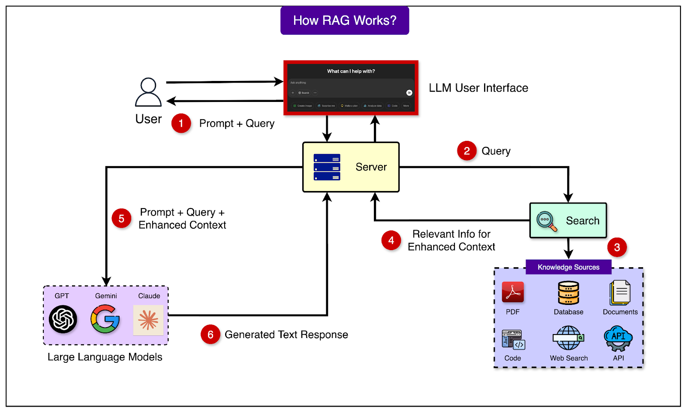
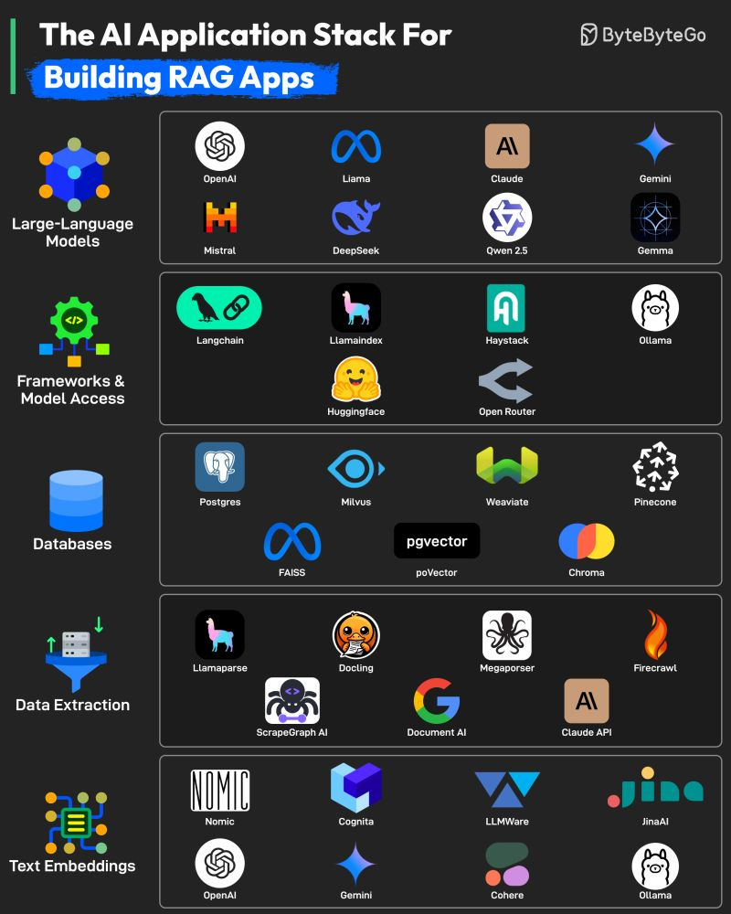
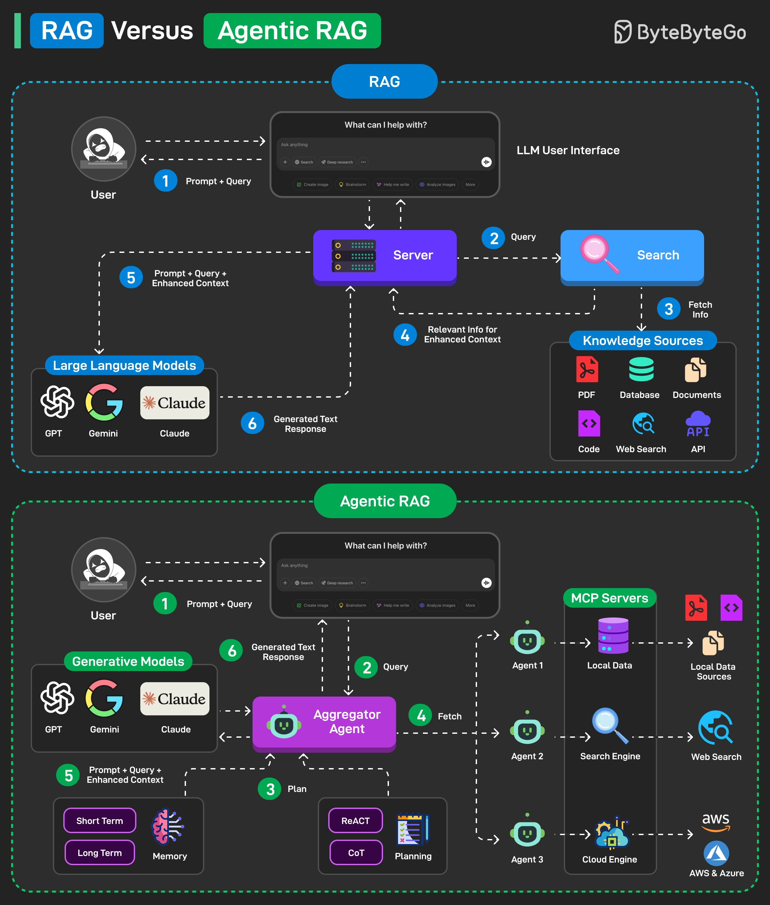
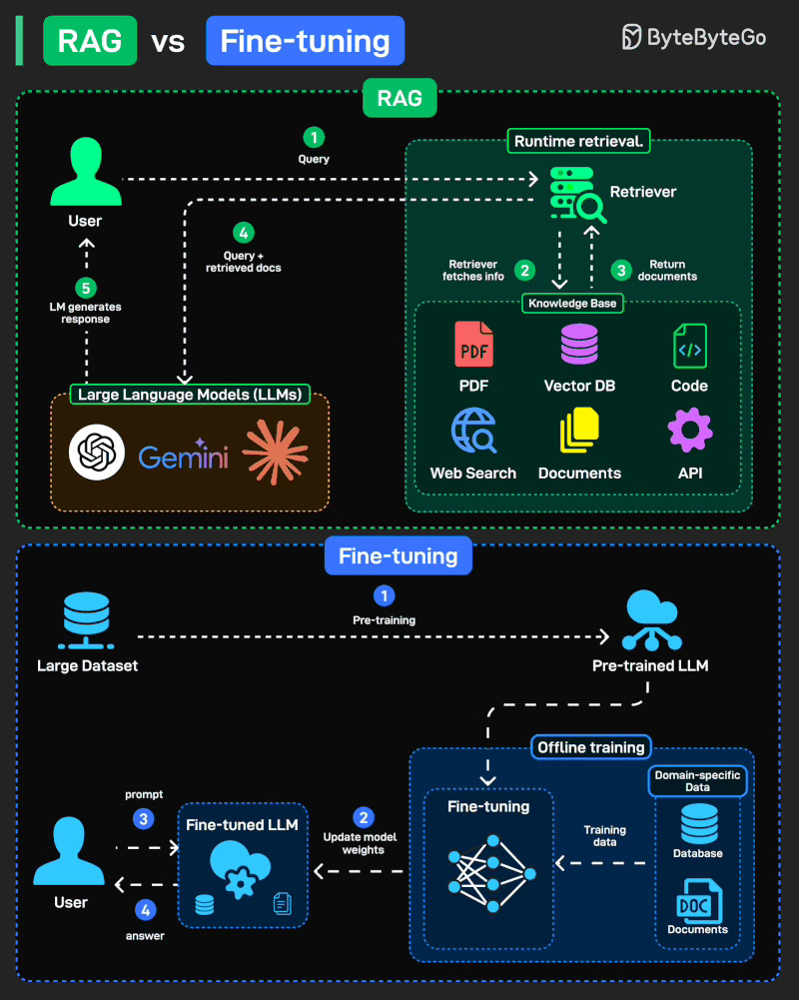

[中文版](rag_zh.md) | English

# RAG

[TOC]

RAG (Retrieval Augmented Generation) is a method that combines information retrieval with large language models to generate answers.

## Workflow

Retrieval-Augmented Generation (RAG) represents one of the most promising approaches to dealing with **context window limitations** (see: [Large Language Model#The Memory Problem](llm.md)). Instead of trying to fit everything into the LLM’s limited notepad, RAG systems work like having a smart librarian who quickly fetches only the relevant information needed for each specific question.

1. When we ask a question, the RAG system first searches through vast external databases to find relevant documents or passages.
2. It then inserts only these specific pieces of information into the context window along with our question.
3. The LLM generates its answer based on this freshly retrieved, highly relevant information. Rather than holding an entire library’s worth of knowledge in the context window, the system grabs just the specific books needed for each query.

This approach can make a reasonably sized context window feel almost limitless. The external database can contain millions of documents, far more than any context window could hold. For tasks like searching technical documentation, answering questions from knowledge bases, or finding specific information from large datasets, RAG systems excel.

## Tool Stack

## Summary

### RAG vs Agentic RAG

### RAG vs Fine-tuning

RAG (Retrieval-Augmented Generation): Fetches knowledge at runtime from external sources (docs, DBs, APIs). Flexible, always fresh.

Fine-tuning: Offline training that updates model weights with domain-specific data, making the model an expert in your field.

## Reference

[1] [The AI Application Stack for Building RAG Apps](https://blog.bytebytego.com/p/ep167-top-20-ai-concepts-you-should)

[2] [RAG vs Agentic RAG](https://blog.bytebytego.com/i/167003530/rag-vs-agentic-rag)

[3] [RAG vs Fine-tuning: Which one should you use?](https://blog.bytebytego.com/i/177034686/rag-vs-fine-tuning-which-one-should-you-use)

[4] [How RAG Helps with Context Windows?](https://blog.bytebytego.com/i/176340112/how-rag-helps-with-context-windows)