[中文版](rag_zh.md) | English

# RAG

[TOC]


## Intro

**RAG (Retrieval Augmented Generation)** is a method that combines information retrieval with large language models to generate answers.


### What Problems does RAG solve

1. Hallucinations

   Traditional generative models can produce incorrect information. RAG reduces this risk by retrieving verified, external data to ground responses in factual knowledge.

2. Outdated Information

   Static models rely on training data that may become outdated. It dynamically retrieves latest information ensuring relevance and accuracy in real time.

3. Contextual Relevance

   Generative models often struggle with maintaining context in complex or multi turn conversations. RAG retrieves relevant documents to enrich the context improving coherence and relevance.

4. Domain Specific Knowledge

   Generic models may lack expertise in specialized fields. It integrates domain specific external knowledge for tailored and precise responses.

5. Cost and Efficiency

   Fine tuning large models for specific tasks is expensive. It eliminates the need for retraining by dynamically retrieving relevant data reducing costs and computational load.

6. Scalability Across Domains

   It is adaptable to diverse industries from healthcare to finance without extensive retraining making it highly scalable.

### Challenges

1. Complexity

   Combining retrieval and generation adds complexity to the model requires careful tuning and optimization to ensure both components work seamlessly together.

2. Latency

   The retrieval step can introduce latency making it challenging to deploy RAG models in real time applications.

3. Quality of Retrieval

   The overall performance heavily depends on the quality of the retrieved documents. Poor retrieval can lead to suboptimal generation, undermining the model’s effectiveness.

4. Bias and Fairness

   It can inherit biases present in the training data or retrieved documents, necessitating ongoing efforts to ensure fairness and mitigate biases.

### Retrieval Component

The retrieval component identifies relevant data to assist in generating accurate responses. Dense Passage Retrieval (DPR) is a common model that is used to perform retrieval.

### Generative Component

After retrieval, the relevant data is passed to the generative model (like BART or GPT), which combines it with the query to generate the final response.


## Architecture

RAG follows a structured workflow where a query is processed, relevant information is retrieved and a final response is generated using both retrieved data and model knowledge.

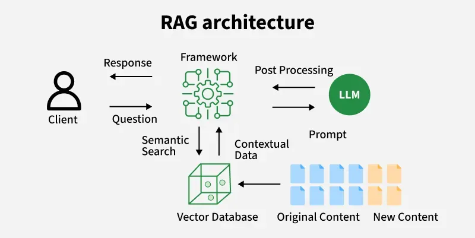

1. Query Processing

   The input query is first pre-processed and prepared for further steps, ensuring it is in a suitable form for embedding.

2. Embedding Model

   The query is passed through an embedding model that converts it into a vector capturing its semantic meaning.

3. Vector Database Retrieval

   This vector is used to search a vector database to find documents that are most similar to the query.

4. Retrieved Contexts

   The system retrieves the documents that are closest to the query. These documents are then forwarded to the generative model to help it craft a response.

5. LLM Response Generation

   The LLM combines the original query with the retrieved context to generate a coherent and accurate response.

6. Response

   The final response integrates both the model’s internal knowledge and the retrieved information, making it more relevant and up-to-date.

### Components

1. Document Loader and Chunker

   Raw documents (text, PDFs, web pages) are loaded and split into smaller, manageable chunks for indexing.

2. Embeddings Model

   Converts text chunks and user queries into semantic vector representations capturing meaning.

3. Vector Store (Index)

   Stores embeddings and supports efficient similarity search to retrieve relevant chunks.

4. Retriever

   Queries the vector store to find top relevant chunks based on the user’s input.

5. Generative LLM : Takes the query plus retrieved chunks as input and generates a grounded, coherent response.

6. Chain/Orchestration

   Integrates all above components into an end-to-end pipeline, managing retrieval, prompt construction and generation.

7. Memory (optional but important)

   Maintains conversation history or other contextual information for multi-turn interactions (covered in the LangChain-specific implementation).


## Workflow

Retrieval-Augmented Generation (RAG) represents one of the most promising approaches to dealing with **context window limitations** (see: [Large Language Model#The Memory Problem](llm.md)). Instead of trying to fit everything into the LLM’s limited notepad, RAG systems work like having a smart librarian who quickly fetches only the relevant information needed for each specific question.


1. Creating External Data

   External data from APIs, databases, or documents is chunked, converted into embeddings, and stored in a vector database to build a knowledge library.

2. Retrieving Relevant Information

   User queries are converted into vectors and matched against stored embeddings to fetch the most relevant data, ensuring accurate responses.

3. Augmenting the LLm Prompt

   Retrieved content is added to the user's query, giving the LLM extra context to work with.

4. Answer Generation

   LLM uses both the query and retrieved data to generate a factually accurate, context-aware response.

5. Keeping Data Updated

   External data and embeddings are refreshed regularly in real time or scheduled so the system always retrieves the latest information.

This approach can make a reasonably sized context window feel almost limitless. The external database can contain millions of documents, far more than any context window could hold. For tasks like searching technical documentation, answering questions from knowledge bases, or finding specific information from large datasets, RAG systems excel.

### Initial Setup

TODO

### Data Preparation

Raw data sources like PDFs or web pages may contain a mix of text, images, tables, and other elements, so it’s important to clean and extract just the useful information.

#### Data Loading

TODO

#### Text Chunking


Text chunking, also known as text segmentation, involves dividing text into smaller units that can be processed more efficiently. These units can be sentences, paragraphs, or even phrases, depending on the application.

The common text chunking techniques:

1. Fixed-Size Chunking

   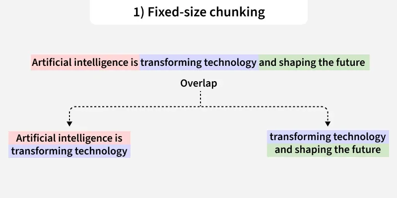

   Fixed-size chunking involves dividing the text into chunks of a predefined size, typically based on the number of characters or tokens.

2. Recursive Chunking

   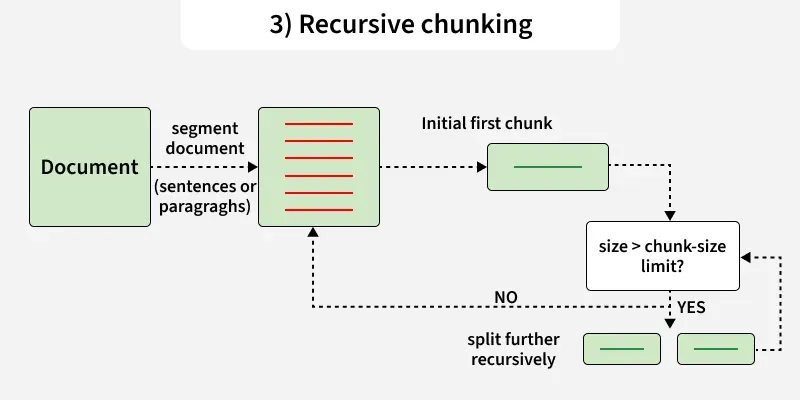

   Recursive chunking divides the text hierarchically using a set of separators. If the initial chunks are too large, the method recursively splits them until the desired size is achieved.

3. Semantic Chunking

   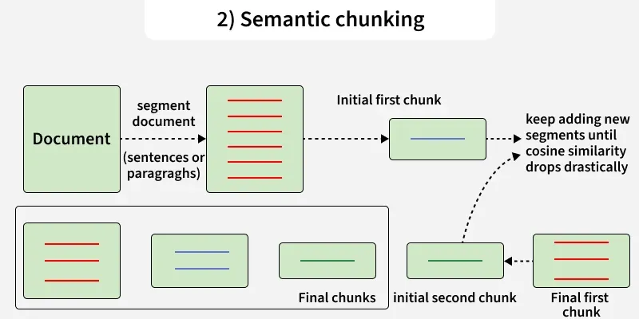

   Semantic chunking involves grouping sentences or phrases based on their semantic similarity. This method often uses clustering algorithms or embedding models.

4. Token-Based Chunking

   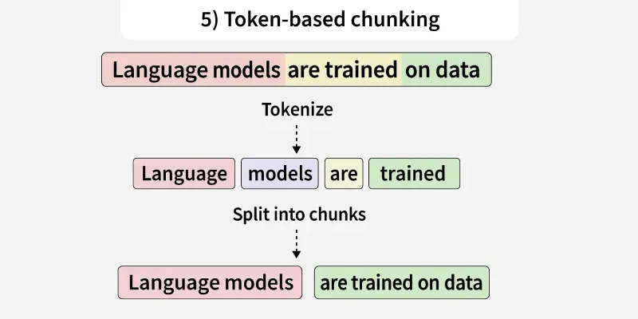

   Splits text based on model token limits.

5. Document-Based Chunking

   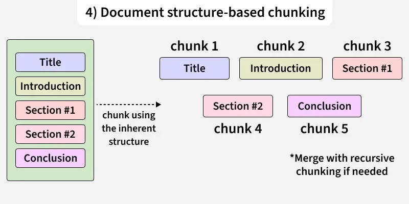

   Breaks structured documents into logical sections.

### Index Construction


#### Vector Embedding


Vector embedding is a digital fingerprint or a numerical representation of words or other pieces of data. Each object is transformed into a list of numbers called a vector. These vectors capture properties of the object in a more manageable and understandable form for machine learning models.

Types of vector embeddings:

1. Word embedding

   

   Word embeddings captures not only the semantic meaning of words but also their contextual relationship to other words which help them to classify similarities and cluster different points based on their properties and features.

2. Sentence embedding

   

   Sentence embeddings represent the entire sentence as a single vector that captures its overall meaning. It aims at finding the semantic meaning of entire phrases or sentences rather than individual words. They are generated with SBERT or other variants of sentence transformers.

3. Image embedding

   

   Image embeddings transforms images into numerical representations through which our model can perform image search, object recognition, and image generation.

4. Multimodal embedding

   

   Multimodal embedding combines different types of data models into a shared embedding space.

The key evaluations:

- Consine Similarity
- Dot Product
- Euclidean Distance

#### Vector Database


A vector database is a specialized type of database designed to store, index, and search high-dimensional vector representations of data known as embeddings. Unlike traditional databases that rely on exact matches, vector databases use similarity search techniques such as cosine similarity or Euclidean distance to find items that are semantically or visually similar.

#### Index Optimization

TODO

### Query and Retrieval


#### Hybrid Search

#### Query Construction


#### Text2SQL


#### Query Rewriting and Routing

TODO

### Generation Integration

#### Formatted Generation

TODO


## Evaluation


The quality of a RAG system cannot be judged by feeling alone. The industry typically uses several dimensions for quantitative evaluation:

- Retrieval relevance ("does the retrieved content contain the answer?")
- Generation quality:
  - semantic faithfulness ("is the meaning of the answer correct?")
  - lexical appropriateness ("are technical terms used correctly?")

### Evaluation Metrics

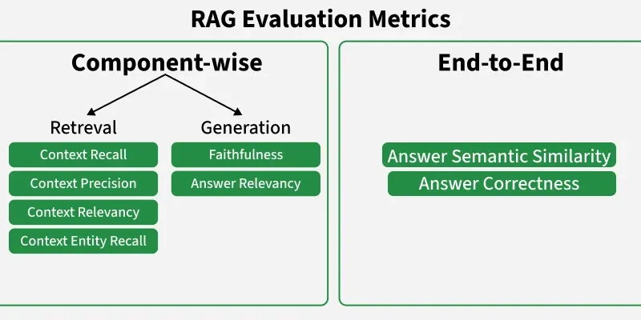

#### Retrieval Level Metrics

1. Precision

   Portion of retrieved documents that are actually relevant.
   $$
   Precision = \frac{TP}{TP + FP}
   $$

2. Recall

   Portion of relevant documents that were successfully retrieved.
   $$
   Recal = \frac{TP}{TP + FN}
   $$

3. F1-Score

   Harmonic mean of precision and recall, balancing both.
   $$
   F1-Score = 2 \times \frac{Precision \times Recall}{Precision + Recall}
   $$

4. Hit Rate

   Shows how often retrieved answers exactly match the expected ones, higher is better.
   $$
   \text{Hit Rate} = \frac{\text{Total Number of Queries Number of Queries with at least one relevant document retrieved}}{\text{Total Number of Queries}}
   $$

5. Mean Reciprocal Rank (MRR)

   Measures how quickly the correct answer appears in the ranked results, higher is better.
   $$
   MRR = \frac{1}{N}\sum_{i = 1}^{N} \frac{1}{rank_{i}}
   $$

   - $N$: Total number of queries
   - $rank$: rank position of the first relevant document for the $i$th query

6. Mean Average Precision (MAP)

   Evaluates ranking quality across multiple queries.
   $$
   MAP = \frac{1}{N} \sum_{i = 1}^{N}AP_{i} \\
   AP_{i} = \frac{1}{R_i} \sum_{k = 1}^{n}P_{i}(k) \times rel_{i}(k)
   $$

   - $N$: total number of queries
   - $AP_{i}$: average precision for the $i$th query
   - $R_i$: number of relevant documents for query $i$
   - $P_i(k)$: precision at cutoff $k$
   - $rel_{i}(k)$: 1 if the document at rank k is relevant, else 0

7. Normalized Discounted Cumulative Gain (nDCG)

   Rewards highly relevant documents appearing earlier in results.
   $$
   nDCG_{p} = \frac{DCG_{p}}{IDCG_{p}} \\
   DCG_{p} = \sum_{i = 1}^{p} \frac{2^{rel_{i}} - 1}{\log_{2}(i + 1)} \\
   IDCG_{p} = \sum_{i = 1}^{p} \frac{2^{rel_{i}^{ideal}} - 1}{\log_{2}(i + 1)}
   $$

   - $p$: rank position cutoff
   - $rel_{i}$: relevance score of the document at rank $i$
   - $rel_{i}^{ideal}$: relevance of document at rank $i$ in ideal ordering

8. Recall@k and Precision@k

   Check relevance within the top k retrieved items.
   $$
   Recall@k = \frac{\text{|\{relevant documents in top k\}|}}{\text{|\{total relevant documents\}|}} \\
   Precision@k = \frac{\text{|\{relevant documents in top k\}|}}{k}
   $$

9. Similarity Measures (Cosine, BM25)

   Quantify how closely retrieved documents match the query.
   $$
   \text{Cosine Similarity} = \cos(\theta) = \frac{A \cdot B}{||A||\ ||B||}
   $$

#### Generation Level Metrices

1. BLUE, ROUGE, METEOR, BERT Score

   Compare generated text with reference answers for similarity.

   Here we have illustrated BLEU.
   $$
   BLEU = BP \cdot exp(\sum_{n = 1}^{N} w_n \log p_n)
   $$

   - $p_n$: modified n-gram precision
   - $w_n$: weight for n-gram
   - $BP$: Brevity Penalty

2. Perplexity

   Measures how well the model predicts the next word, lower perplexity is better.
   $$
   Perplexity(W) = P(w_1, w_2, \cdots, w_N)^{-\frac{1}{N}} = exp(-\frac{1}{N} \sum_{i = 1}^{N} \log P(w_i | w_1, \cdots, w_{i - 1}))
   $$

3. Factual Consistency

   Checks if generated content aligns with retrieved information.
   $$
   \text{Factual Consistency} = \frac{|\text{Words in Response} \cap \text{Words in Reference}|}{|\text{Words in Response}|}
   $$

4. Fluency and Readability

   Assesses how natural and easy to understand the text is.
   $$
   \text{Fluency Score} = \frac{\text{Total Words}}{\text{Total Sentences}} \\
   \text{Flesch Reading Ease} = 206.835 - 1.015(\frac{\text{Total Words}}{\text{Total Sentences}}) - 84.6(\frac{\text{Total Syllables}}{\text{Total Words}})
   $$
   
5. Diversity and Novelty

   Evaluates variety and originality in generated responses.
   $$
   Distinct-n = \frac{|\text{Unique n-grams in responses}|}{|\text{Total n-grams in responses}|} \\
   Novelty = \frac{|\text{Words in current response not seen in previous responses}|}{|\text{Total words in current response}|}
   $$

#### End-to-End RAG System Evaluation

1. Answer Relevance and Context Utilization

   Checks if the system’s answers address the user’s query and effectively use the retrieved information.
   $$
   \text{Answer Relevance} = \frac{|\text{Words in Response} \cap \text{Words in Reference}|}{|\text{Words in Reference}|} \\
   \text{Context Utilization} = \frac{|\text{Words in Response} \cap \text{Words in Retrieved Docs}|}{|\text{Words in Response}|}
   $$

2. Groundedness

   Measures whether the generated text is supported by the retrieved sources reducing the risk of hallucinations.
   $$
   Groundedness = \frac{|\text{Words in Response} \cap \text{Words in Retrieved Docs}|}{|\text{Words in Response}|}
   $$

3. Hallucination Rate

   Tracks how often the system produces information that is incorrect or not backed by sources.
   $$
   \text{Hallucianation Rate} = \frac{|\text{Words in Response} - \text{Words in Retrieved Docs}|}{|\text{Words in Response}|}
   $$

4. Response Coherence and Readability

   Ensures the generated answers are clear, logically structured and easy to understand.
   $$
   \text{Coherence} = \frac{\text{Total Words in Response}}{\text{Number of Sentences in Response}}
   $$

5. Relevancy Score

   Measures how well the system’s output matches the user’s query intent.
   $$
   \text{Relevancy Score} = \frac{|\text{Words in Response} \cap \text{Words in Query}|}{|\text{Words in Query}|}
   $$

### Evaluation Workflow

1. Set Goals

   Define what matters most—accuracy, relevance, fluency or groundedness.

2. Pick Metrics

   - Retrieval level: Precision, Recall, F1, MRR, nDCG.
   - Generation level: BLEU, ROUGE, METEOR, BERTScore, Perplexity.
   - End-to-end: Groundedness, Hallucination Rate, Factual Consistency, Answer Relevance.

3. Automate

   Use tools like NLTK, ROUGE-score, BERTScore or Textstat for quick evaluation.

4. Add Human Review

   Rate responses for clarity, accuracy and informativeness.

5. Analyze Results

   Visualize performance, compare models and find weak spots.

6. Iterate

   Refine retrieval and generation steps to improve factuality and coherence.

### Evaluation Tools

#### LlamaIndex Evaluation

TODO

#### RAGAS

TODO

#### Phoenix

TODO


## Optimization

### Alternative Rules

|                Method                |                         Description                          |                         When to Use                          |
| :----------------------------------: | :----------------------------------------------------------: | :----------------------------------------------------------: |
|          Prompt Engineering          | Adjusts the input prompt to guide model behavior without changing its training. | When you need a quick and simple solution for specific tasks or queries. |
| Retrieval-Augmented Generation (RAG) | Combines retrieval and generation to use external data for more factual and context-aware responses. | When you want the model’s responses to include real-time, relevant information from external sources. |
|             Fine-Tuning              |  Retrains the model on a smaller, domain-specific dataset.   | When you need better performance on a particular topic or industry data. |
|             Pre-Training             | Trains the model from scratch using a large and diverse dataset. | When you want to build a strong foundation for later customization and adaptation. |

### Lost in the middle problem

TODO

### Chunk Overlap

Chunk overlap refers to the technique of including a small portion of text from the end of one chunk at the beginning of the next chunk. This helps maintain continuity between chunks and prevents important information from being lost when text is split. It is especially useful when sentences or ideas span across multiple chunks.

1. Maintains Context Flow

   Overlapping small portions of text ensures that important information crossing chunk boundaries is preserved.

2. Reduces Context Loss

   When a sentence spans two chunks, overlaps prevent missing meaning during retrieval.

3. Improves Answer Accuracy

   Retrieval models gain continuity, leading to clearer and more complete responses.

4. Better Semantic Understanding

   Overlaps enhance embeddings by preserving transitional phrases and linked ideas.

### Select The Right Chunk Size

Choosing the right chunk size depends on the type of document and the use case. If chunks are too large, the model may include unnecessary data. If chunk is too small, it may lose essential meaning. Some recommended chunk sizes in [LangChain](#LangChain) are:

- 300–500 Tokens: Useful for most general documents where moderate context is needed.
- 600–900 Tokens: Ideal for technical guides and manuals requiring deeper reference context.
- 100–200 Tokens: Effective for short chats, logs or small knowledge fragments.


## Knowledge Graph RAG

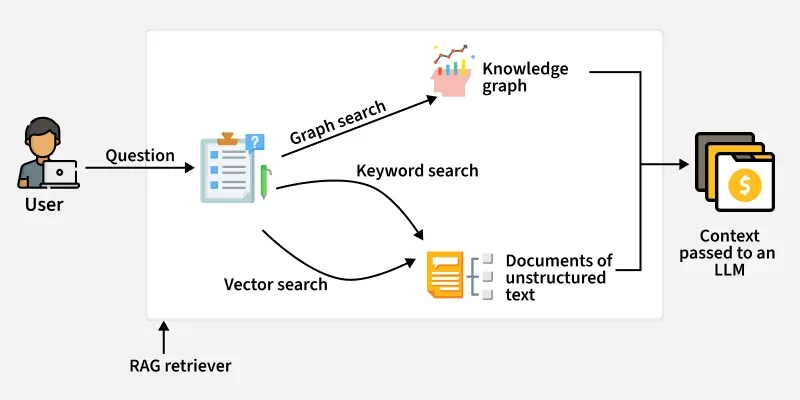

A Knowledge Graph in RAG(Retrieval-Augmented Generation) is a structured representation of information where entities (nodes) and their relationships (edges) are explicitly modeled. It allows a RAG system to retrieve relevant knowledge, understand context, and perform inferential reasoning, enabling the language model to generate more accurate, coherent, and explainable responses.

### Knowledge Graph RAG Workflow

1. Data Collection and Preprocessing

   Data is collected from various sources, cleaned, and processed to identify key entities and relationships for graph creation.

2. Knowledge Graph Construction

   Entities turn into nodes and relationships into edges, each with unique IDs and properties to enable efficient querying and reasoning.

3. Storage in a Graph Database

   The graph is stored in databases like Neo4j, enabling fast searches and traversals, with indexes speeding up keyword and property-based queries.

4. Querying and Traversal

   Queries explore the graph by following relationships, helping the system uncover hidden connections and infer new knowledge.

5. Integration with RAG

   The knowledge graph gives structured context to the language model, which can be combined with embeddings or other data to improve answer accuracy.

6. Response Generation

   Language model uses the retrieved knowledge to generate clear, fact-based responses, with the graph ensuring accuracy, context, and explainability.


## Vectorless RAG

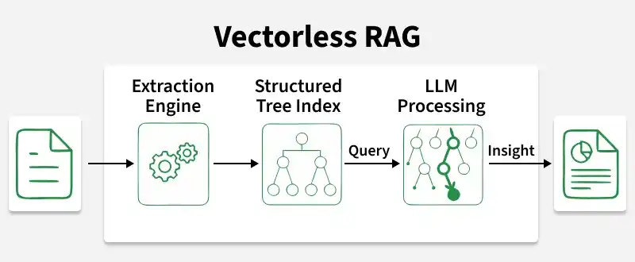

Vectorless RAG is an retrieval-augmented generation approach that retrieves relevant information from documents without relying on vector embeddings. Instead, it organizes content into indexed pages or structured sections, allowing fast keyword‑based retrieval before passing the selected context to a language model for generating accurate responses.

### Workflow of Vectorless RAG

Vectorless RAG with PageIndex is a reasoning-driven retrieval approach designed to overcome the limitations of traditional vector databases. Instead of using mathematical similarity (vectors), it organizes the document like a tree and allows the model to logically decide where to look next similar to how a human scans chapters and sections.

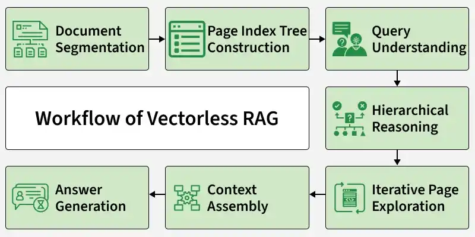

1. Document Segmentation

   The document is first divided into meaningful pages instead of random text chunks. This keeps related information together.

2. PageIndex Tree Construction

   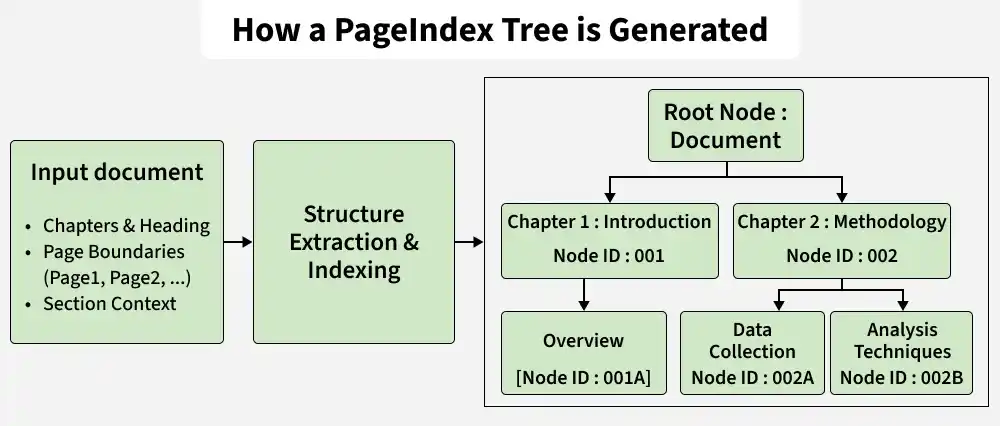

   After splitting the document, a tree-like structure is created to organize it properly.

3. Query Understanding

   When a question is asked, the model first tries to understand what the user is looking for.

4. Hierarchical Reasoning-Based Retrieval

   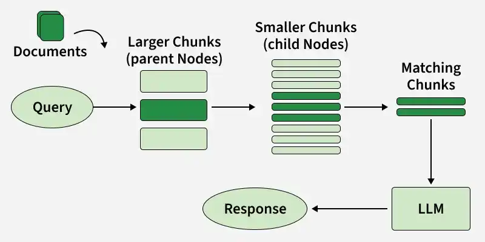

5. Iterative Page Exploration

   PageIndex uses an iterative reasoning loop to refine retrieval.

6. Context Assembly

   Once relevant pages are identified, only those pages are passed to the LLM.

7. Answer Generation

   Finally, the model generates the answer using only the selected relevant pages.


## Self-RAG

Retrieval Augmented Generation combines a Large Language Model (LLM) with an external knowledge source to improve response accuracy and reduce hallucinations. Self-Reflective Retrieval Augmented Generation builds on this by letting the model decide when to retrieve information using reflection tokens.

Self-RAG outperforms traditional RAG because of:

1. Dynamic Retrieval

   Adaptively decides when and how to retrieve information, rather than retrieving irrelevant and fixed amount of data.

2. Self Critical Evaluation

   Critiques its own generated responses to assess the quality and relevance of the retrieved documents and the generated response such that it is well supported by evidence from the retrieved document.

3. Overcomes Hallucinations

   Continuously checks and improves its answers to reduce chances of adding false or unsupported information.

4. Lower Latency and Cost

   Avoids unnecessary retrieval steps hence cutting cost and time required during running the pipeline. This ensures the system remains efficient while still maintaining access to external knowledge when truly necessary.

5. High Scalability and Explainability

   Reduces load by retrieving selectively, unlike RAG in which retrieval becomes slower and more expensive as the knowledge base grows.

### Reflection Tokens

Reflection tokens are special tokens acting as signals that are added to the language model's vocabulary to decide the need for retrieval and then self-evaluate the quality of generation. It makes the thinking process controllable and transparent during the inference phase. These tokens represent the self-reflection property during the reasoning process. 

Types of Reflection Tokens:

1. Retrieval Decision Tokens

   It suggests whether the current query can be answered confidently using its own knowledge base gained during training or the LLM requires to extract external, factual information from knowledge base. There are two types of Retrieval Tokens i.e [Retrieve] and [No Retrieval].

2. Critique Quality Tokens

   It indicates the relevance, supportiveness, and usefulness of the retrieved information. Some of the Critique Quality Tokens are [ISREL], [ISSUP], and ISUSE].

### Training Framework for Self RAG

Self RAG Architecture is trained through a two-step process involving a generator and a critic model, using special reflection tokens. 

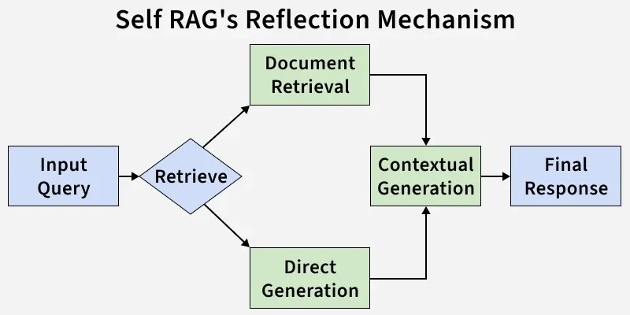

1. Critic Model Training

   The critic is trained on input–output pairs with reflection tokens (from human and LLM annotations) to decide when retrieval is needed and to judge response quality.

2. Data Augmentation with Reflection Tokens

   The training dataset for the Generator is augmented by inserting reflection tokens generated by the Critic, helping it learn both language generation and when retrieval is needed.

3. Developing the Generator Model

   Generator's vocabulary is expanded to include reflection tokens, so it can generate both natural responses and self reflective markers, enabling it to produce fluent text, decide on retrieval and self-check its answers.

4. Training

   With the augmented dataset, Self RAG is trained to generate answers and reflection tokens. This allows the system to not only answer but also self monitor, evaluate evidence and adjust retrieval behavior dynamically.

5. Model Refinement and Optimization

   After initial training, the system can be fine tuned for specific domains or tasks. During fine tuning, weights associated with reflection tokens can be adjusted to prioritize desired characteristics. This makes Self RAG adaptable and customizable depending on use cases.


## Agentic RAG

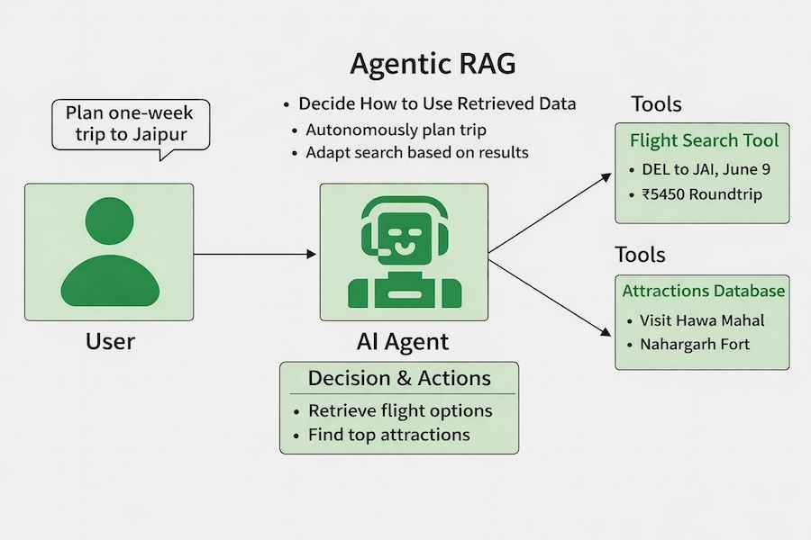

Agentic RAG enhances traditional Retrieval Augmented Generation by enabling AI agents to not only retrieve information but also decide how to use it, introducing autonomous decision making for more flexible and intelligent responses.

### Types of Agents in Agentic RAG

Agentic RAG uses different types of agents, each designed to handle specific roles in the workflow for efficient and intelligent processing.

- Routing Agent

  Analyzes queries and routes them to the most suitable RAG pipeline, such as summarization or question answering.

- One-Shot Query Planning Agent

  Breaks complex queries into independent subqueries, processes them in parallel and combines results into a final answer.

- Tool Use Agent

  Integrates external tools like APIs or databases to fetch real time or specialized data before generating responses.

- ReAct Agent (Reason + Act)

  Iteratively reasons and takes actions, selecting tools and refining steps to handle multi step queries.

- Dynamic Planning and Execution Agent

  Creates detailed step by step plans for complex workflows, coordinating tools and data sources systematically.

### Architecture of Agentic RAG

#### Single Agent RAG (Router)

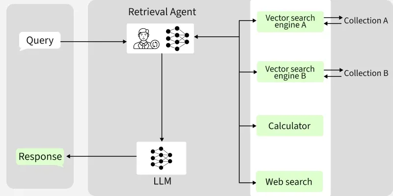

A single intelligent agent routes each query to the most appropriate data source or tool, making it efficient for simple tasks.

#### Multi Agent RAG

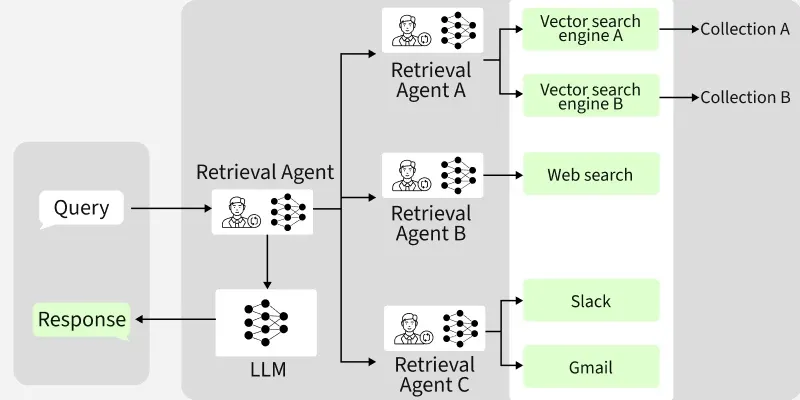

A master agent coordinates multiple specialized sub-agents, each handling specific tools or data sources, enabling efficient processing of complex queries.

#### Agentic Orchestration

Agentic orchestration coordinates agents to plan, validate, and refine workflows dynamically, enabling adaptive and intelligent responses.

### Agentic RAG Workflow

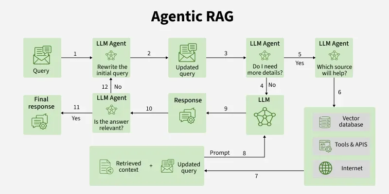

- Query Input

  The user submits a query, initiating the process.

- Query Refinement

  An LLM agent reviews and rewrites the query for clarity, if needed, ensuring optimal data retrieval.

- Information Sufficiency

  The agent checks if further details are needed. If so, more information is gathered before proceeding.

- Source Selection

  The agent determines the best source for the query vector database, APIs/tools or internet based on context.

- Data Retrieval

  The chosen source is queried and relevant context is collected.

- Context Integration

  Retrieved context is combined with the updated query to enrich understanding.

- Response Generation

  The LLM produces a response using the enhanced context and query.

- Answer Validation

  The agent verifies whether the response is relevant to the original question.

- Final Output

  If validated, the system delivers a precise, context aware final response.


## Multimodal Retrieval Augmented Generation (Multimodal RAG)

Multimodal Retrieval-Augmented Generation combines text, images, audio, and video with retrieval to enhance generative models, enabling more accurate, context-aware and informative responses beyond single modality systems.

### Multimodal RAG Architecture

Multimodal RAG follows a structured pipeline that processes multiple data types and converts them into embeddings for efficient retrieval and generation.

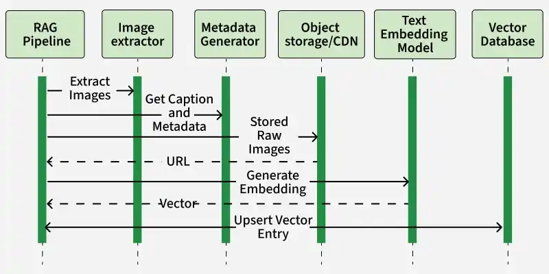

1. RAG Pipeline

   controls the workflow. It pulls source documents (or user uploads) and hands off any embedded images to the next component.

2. Image Extractor

   receives raw inputs, isolates each image and forwards them to the Metadata Generator.

3. Metadata Generator

   creates a natural‑language caption and any other metadata for each image. It pushes the raw image files into an Object Storage or CDN then retrieves their public URLs.

4. Object Storage / CDN

   stores the original images and returns stable URLs which the pipeline uses for downstream embedding.

5. Text Embedding Model

   takes the captions or image URLs plus prompts and converts them into fixed‑size vectors.

6. Vector Database

   inserts the embeddings with associated metadata and URLs into FAISS, ChromaDB, etc making them instantly searchable for later retrieval.

### Multimodal RAG Workflow

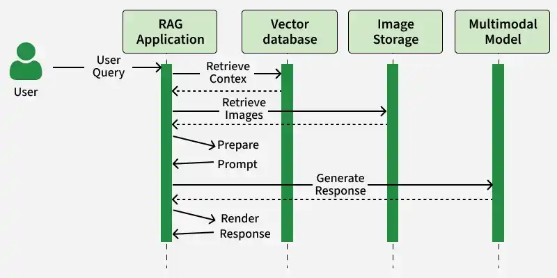

Multimodal RAG improves performance by using diverse data sources, enabling better understanding and more accurate responses.


## Branched RAG

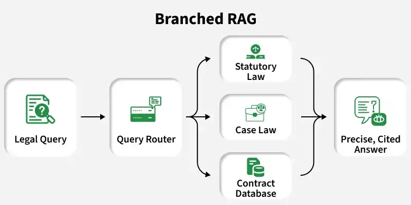

Branched Retrieval‑Augmented Generation (Branched RAG) is a type of RAG system where multiple retrieval paths operate in parallel to handle complex queries. Each branch retrieves and processes information independently and the combined outputs improve answer accuracy and reasoning depth.

Branched RAG is an advanced technique where a user query is divided into multiple paths or branches instead of following a single retrieval flow. In this approach:

- A single query is split into multiple reasoning or retrieval branches.
- Each branch retrieves different but relevant information from various sources.
- The model processes these branches independently to explore multiple perspectives.
- The outputs from all branches are then combined to produce a more accurate and well-informed final response.

### Components of Branched RAG

- External Knowledge Source

  Stores domain specific or general information such as documents, databases, APIs or knowledge bases used for retrieval.

- Branch Generator

  Breaks the user query into multiple reasoning paths or sub-queries to explore different perspectives.

- Embedding Model

  Converts text into numerical vector representations that capture semantic meaning.

- Vector Database

  Stores embeddings and enables fast similarity search for retrieving relevant information.

- Branch Retrievers

  Each branch independently retrieves relevant documents based on its specific context or interpretation.

- Branch Processing Module

  Processes and analyses retrieved information separately for each branch.

- Aggregation Layer

  Combines outputs from multiple branches to create a unified understanding.

- LLM (Generator)

  Generates the final response using combined information from all branches.

### Working of Branched RAG

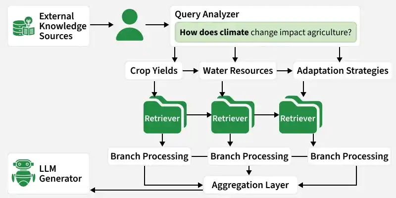

1. Query Understanding

   The system receives a user query and analyses its intent, scope and keywords to determine whether the query contains multiple aspects, sub-questions or reasoning paths.

2. How the Query Is Split (Branch Creation)

   After understanding the query, it is divided into multiple logical branches:

   1. The query is decomposed into independent sub-queries based on intent, entities or reasoning requirements
   2. Each branch targets a specific sub-topic or interpretation
   3. Branching can be based on:
      - Different concepts in the query
      - Multiple entities or timeframes
      - Alternative reasoning paths like facts, comparisons, causes, examples, etc

   This allows the system to explore multiple directions instead of following a single retrieval path.

3. Parallel Retrieval

   Each branch retrieves relevant information independently from external sources such as:

   - Vector databases
   - Knowledge graphs
   - Documents or APIs

   This happens in parallel, reducing latency and increasing information.

4. Independent Processing

   The retrieved information from each branch is processed separately:

   - Each branch performs focused reasoning
   - Noise is reduced by keeping contexts isolated
   - The model can apply deeper analysis specific to that sub-topic

5. How Outputs Are Aggregated (Aggregation and Fusion)

   Once all branches finish processing, their outputs are combined using aggregation logic:

   - Relevant results are ranked or scored based on relevance
   - Redundant or conflicting information is filtered
   - Key insights from each branch are merged into a single coherent context

   This step ensures completeness without duplication.

6. Final Response Generation

   The LLM generates the final answer using the aggregated context:

   - Combines insights from all branches
   - Maintains logical flow and consistency
   - Produces a context-aware and well-rounded response


## Adaptive RAG

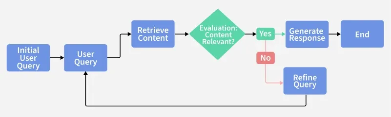

Adaptive RAG enhances Retrieval Augmented Generation (RAG) systems by the analyzing the complexity of the input query and then selecting the most appropriate retrieval strategy which ensures optimal performance with less computation. It uses a classifier to analyze each query.

### Adaptive RAG Workflow

1. User Query

   The system receives a query from the user. 

2. Query Analysis

   A classifier is responsible for analyzing complexity of the user query.

   - If simple, no retrieval is needed.
   - If moderate, only in one step retrieval step fetches relevant documents.
   - If complex, a multi step retrieval approach iterates over multiple document sources.

   Classifier model is trained on input user query $q$ and the output is the complexity category $c \in \{0, 1\}$ where 0 indicates query can't be broken down further and 1 indicates can be decomposed further.
   $$
   c = Classifier(q), c \in \{0, 1\}
   $$
   The classifier is built on top of the model by adding a linear layer followed by a Sigmoid activation function to assess query complexity.

3. Retrieval Strategy: Based on the query type, the system adapts its retrieval approach:

   - Simple

     LLM answers directly from its trained knowledge and skips retrieval.

   - Moderate

     Executes a single retrieval pass from the document index.

   - Complex

     Uses multi hop adaptive retrieval to retrieve large set of relevant documents.

4. Adaptive Filtering and Quality Check: Multiple quality assurance evidence steps are executed and retrieved documents are scored for relevance to ensure accuracy. Irrelevant, noisy or outdated documents are removed.

   - Single Step Retrieval

     Knowledge base is $D$, the query is q and the retriever is Retriever(). The retriever uses q as input to search the knowledge base and returns relevant documents $D_i$.
     $$
     r_d = Retriever(q; D)φ
     $$

   - Multi Step Retrieval

     $q_1$ and $q_2$ are two simple queries, we first use $q_1$ to retrieve $n$ relevant documents then $\{q_1 ,q_2 ,D_i)$ to obtain m relevant documents.
     $$
     RD_1 = Retriever_{1}(q_1) \\
     RD_2 = Retriever_{2}(q_1, q_2, d_i), d_{i} \in RD_{1}
     $$

5. Evidence Fusion

   Incorporates knowledge from multiple retrieved documents, resolves conflicts between sources and combines overlapping evidences.

6. Answer Generation

   If the answer doesn't rely on retrieved documents, the system can again go through the same process and regenerate the answer by combining retrieved knowledge with it's internal knowledge.
   $$
   answer = LLM(prompt, d_1, d_2, ...)
   $$


## Corrective Retrieval Augmented Generation (CRAG)

CRAG improves Retrieval-Augmented Generation by incorporating a self correction mechanism that evaluates and refines retrieved knowledge reducing errors and improving accuracy, while RAG retrieves documents and uses them to guide an LLM’s response. CRAG handles noisy, irrelevant or misleading data. It can be coupled with various RAG based approaches.

The technique is based upon a `feedback loop` that continuously evaluates the quality of retrieved documents and provides evaluation. 

### CRAG Workflow

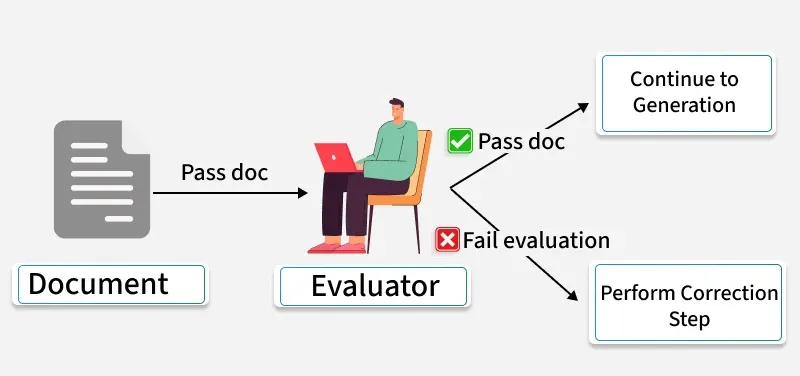

1. Input Query

   The process begins with an input query like “What do koalas eat?”.

2. Retrieval (Vanilla RAG)

   The documents from knowledge base are selected based on their relevance to the input query. The retriever finds top K relevant documents based only on similarity.

3. Retrieval Evaluator

   The relevance and quality of each document concerning the input query is assessed. The evaluator assigns a relevance score to each document.

4. Decision

   Based on previous step, a decision is made.

   - Correct: If at least one document has a high relevance score then it is relevant and accurate.
   - Incorrect: If all documents have low relevance scores then they are irrelevant or incorrect.
   - Ambiguous: If the relevance scores are neither low nor high then there is uncertainty about the overall quality.

5. Corrective Step  (if Correct)

   This ensures only the most accurate and context specific documents are kept.

   - Filter: Removes low quality or outdated documents.
   - Rerank: Combines similarity, quality and freshness to reorder docs.
   - Duplication: Prevents repeated or duplicated results.
   - Web Search (if Incorrect): If the documents are incorrect, web search is conducted to retrieve additional relevant information from the internet to make the knowledge base dynamic.

6. Combining Knowledge (if Ambiguous)

   If the documents are ambiguous, it combines both internal knowledge from initial retrieval and external knowledge from web search.

7. Answer Generation

   The [LLM](llm.md) uses uses only corrected, refined or newly retrieved information to generate more accurate and factual response.


## LightRAG

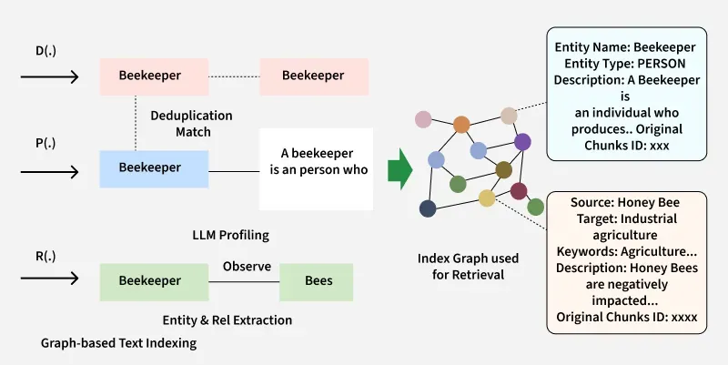

LightRAG is a new framework that  integrating graph-based text indexing and a dual level retrieval paradigm, enabling LLMs to generate responses that are both contextually rich and highly relevant.


## Embedding Model

### CLIP (Contrastive Language-Image Pre-training)


CLIP or Contrastive Language-Image Pretraining is an advanced AI model developed by OpenAI and UC Berkeley. It has the unique ability to understand and relate both textual descriptions and images. It uses a novel training method that contrasts pairs of images and text, which makes it a highly useful tool for various real-world applications


## Challenges

### Knowledge Conflict in RAG

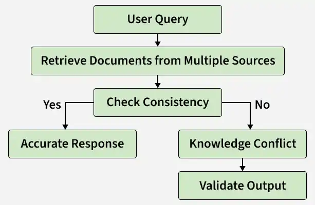

Knowledge conflict in Retrieval‑Augmented Generation (RAG) occurs when the retrieved information contains contradictory or inconsistent facts, which can lead to inaccurate or confusing model outputs. Since RAG systems rely on external data sources, differences in data quality or context can create conflicts during response generation.

To effectively manage knowledge conflict, several techniques can be applied in RAG systems:

1. Source Ranking

   It is a method where retrieved documents are ordered based on their reliability and relevance. The system gives more importance to higher-quality and accurate sources to reduce the impact of conflicting information.

2. Metadata Filtering

   It uses structured attributes such as date, author and source type (category of information source) to remove low-quality or outdated documents before generation. This helps ensure that only relevant and reliable information is used.

3. Handling Uncertainty

   Handling uncertainty enables the system to recognize conflicting information and avoid forcing a single definite answer. This helps in generating more transparent and reliable responses.

4. Improved Retrieval Techniques

   This approach focuses on enhancing the retrieval process to ensure that only highly relevant and contextually accurate documents are selected, reducing noise and potential conflicts.

5. Cross-Verification

   It compares information across multiple sources to identify consistent and reliable facts before generating a response. It helps filter out conflicting or unsupported data.

6. Confidence Scoring

   It assigns a reliability score to each retrieved piece of information based on factors like relevance and source quality.


## Example 1: PDF Summarizer using RAG

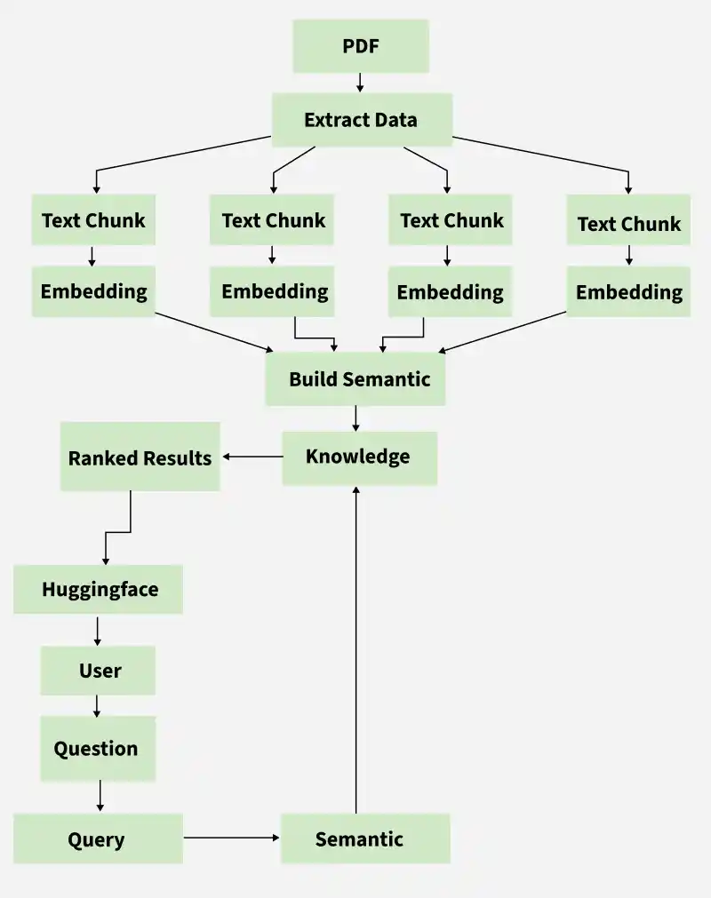

1. Install the Dependencies

   ```shell
   pip3 install langchain langchain-community pypdf sentence-transformers faiss-cpu transformers
   
   # or
   pip install langchain langchain-community pypdf sentence-transformers faiss-cpu transformers
   ```

2. Import Required Libraries and Configure Logging

   ```python
   import os
   import logging
   import shlex
   from langchain.text_splitter import RecursiveCharacterTextSplitter
   from langchain_community.document_loaders import PyPDFLoader
   from langchain_community.embeddings import HuggingFaceEmbeddings
   from langchain_community.vectorstores import FAISS
   from langchain.chains import RetrievalQA
   from langchain_community.llms import HuggingFacePipeline
   from transformers import AutoTokenizer, AutoModelForSeq2SeqLM, pipeline
   
   logging.basicConfig(level=logging.INFO)
   logger = logging.getLogger(__name__)
   ```

3. Define the RAG System Class

   ```python
   class LocalRAGSystem:
       def __init__(self):
           self.documents = []
           self.vector_store = None
           self.embeddings = None
           self.llm = None
           self.qa_chain = None
   ```

4. Upload the PDFs

   ```python
       def upload_pdfs(self):
           raw_paths = input(
               "Enter PDF path(s) separated by commas or shell-style spaces: "
           ).strip()
           if "," in raw_paths:
               pdf_paths = [path.strip() for path in raw_paths.split(",") if path.strip()]
           else:
               pdf_paths = shlex.split(raw_paths)
   
           valid_paths = [
               path for path in pdf_paths if os.path.isfile(path) and path.lower().endswith(".pdf")
           ]
           if not valid_paths:
               raise FileNotFoundError("No valid PDF files were selected.")
   
           logger.info(f"Selected PDFs: {valid_paths}")
           return valid_paths
   ```

5. Load and Parse PDF Documents

   ```python
       def load_documents(self, pdf_paths):
           for pdf_path in pdf_paths:
               loader = PyPDFLoader(pdf_path)
               documents = loader.load()
               self.documents.extend(documents)
   
           logger.info(f"Loaded {len(self.documents)} pages in total.")
   ```

6. Split Documents into Chunks for Embeddings

   ```python
       def split_documents(self, chunk_size=1000, chunk_overlap=200):
           text_splitter = RecursiveCharacterTextSplitter(
               chunk_size=chunk_size, chunk_overlap=chunk_overlap)
           self.document_chunks = text_splitter.split_documents(self.documents)
           logger.info(f"Split into {len(self.document_chunks)} chunks.")
   ```

7. Setup Embedding Model for Vector Store

   ```python
       def setup_embeddings(self, model_name="sentence-transformers/all-MiniLM-L6-v2"):
           self.embeddings = HuggingFaceEmbeddings(model_name=model_name)
           logger.info(f"Embedding model {model_name} loaded.")
   
   ```

8. Create a Vector Store Using FAISS

   ```python
       def create_vector_store(self):
           self.vector_store = FAISS.from_documents(
               self.document_chunks, self.embeddings)
           logger.info("Created the FAISS vector store.")
   ```

9. Setup a Local Language Model

   ```python
       def setup_local_llm(self, model_id="google/flan-t5-base", device="auto"):
           tokenizer = AutoTokenizer.from_pretrained(model_id)
           model = AutoModelForSeq2SeqLM.from_pretrained(model_id, device_map=device)
           pipe = pipeline("text2text-generation", model=model,
                           tokenizer=tokenizer, max_new_tokens=512, temperature=0.7)
           self.llm = HuggingFacePipeline(pipeline=pipe)
           logger.info(f"Local LLM {model_id} ready.")
   ```

10. Setup the RetrievalQA Chain

    ```python
        def setup_qa_chain(self, k=3):
            self.qa_chain = RetrievalQA.from_chain_type(
                llm=self.llm,
                chain_type="stuff",
                retriever=self.vector_store.as_retriever(search_kwargs={"k": k})
            )
            logger.info(f"Retrieval QA chain set with top {k} documents retrieved.")
    ```

11. Answer Questions Using the RAG System

    ```python
        def answer_question(self, question):
            answer = self.qa_chain.run(question)
            logger.info(f"Answered question: {question}")
            return answer
    ```

12. Run the Setup

    ```python
        def run_setup(self, chunk_size=1000, chunk_overlap=200, model_id="google/flan-t5-base", k=3):
            pdf_paths = self.upload_pdfs()
            self.load_documents(pdf_paths)
            self.split_documents(chunk_size=chunk_size, chunk_overlap=chunk_overlap)
            self.setup_embeddings()
            self.create_vector_store()
            self.setup_local_llm(model_id=model_id)
            self.setup_qa_chain(k=k)
            logger.info("RAG summarizer is ready to answer questions.")
    ```

13. Example Usage

    ```python
    if __name__ == "__main__":
        rag = LocalRAGSystem()
        rag.run_setup()
    
        q1 = "What is the main topic of these documents?"
        print(f"Q: {q1}\nA: {rag.answer_question(q1)}")
    
        q2 = "Summarize the key points from the documents."
        print(f"Q: {q2}\nA: {rag.answer_question(q2)}")
    ```

    

## Summary

### Advantage

1. Dual Improvement in accuracy and trustworthiness
2. Timeliness guarantee
3. Significant overall cost-effectiveness
4. Flexible and modular scalability

Risk-Graded Application Scenarios:

| Risk Level      | Examples                             | RAG Applicability                          |
| --------------- | ------------------------------------ | ------------------------------------------ |
| **Low Risk**    | Translation/Grammar checking         | High reliability                           |
| **Medium Risk** | Contract drafting/Legal consultation | Requires human review                      |
| **High Risk**   | Evidence analysis/Visa decisions     | Requires strict quality control mechanisms |

### RAG vs Agentic RAG


RAG (Retrieval Augmented Generation) is a method that combines information retrieval with large language models to generate answers. Here’s how RAG works on a high level:

1. The model retrieves relevant data from data sources and then extracts it to a vector database from the pre-indexed model.
2. Augment the prompts by retrieving information and merging it with the query prompt.
3. A Large Language Model (like GPT, Claude, or Gemini) understands the combined query and generates the final response.

Agentic RAG improves on this by introducing AI agents that can make decisions, select tools, and even refine queries for more accurate and flexible responses. Here’s how Agentic RAG works on a high level:

1. The user query is directed to an AI Agent for processing.
2. The agent uses short-term and long-term memory to track query context. It also formulates a retrieval strategy and selects appropriate tools for the job.
3. The data fetching process can use tools such as vector search, multiple agents, and MCP servers to gather relevant data from the knowledge base.
4. The agent then combines retrieved data with a query and system prompt. It passes this data to the LLM.
5. LLM processes the optimized input to answer the user’s query.

### RAG vs Fine-tuning


RAG (Retrieval-Augmented Generation): Fetches knowledge at runtime from external sources (docs, DBs, APIs). Flexible, always fresh.

[Large Language Model#Fine-Tuning](llm.md): Offline training that updates model weights with domain-specific data, making the model an expert in your field.

When choosing a technical path, a key consideration is the balance between cost and benefit. Typically, we should prioritize the solution with the least modification to the model and the lowest cost, so the technical selection path often follows this order: Prompt Engineering -> Retrieval-Augmented Generation(RAG) -> Fine-tuning.

|                             |                             RAG                              | **Fine Tuning**                                              |
| :-------------------------: | :----------------------------------------------------------: | ------------------------------------------------------------ |
|     **Nature of Task**      | RAG is ideal for tasks requiring contextual understanding and the incorporation of external knowledge, like question answering or content summarization, financial report generation, etc. | Fine-tuning is suitable for tasks where adaptation to specific patterns within a domain is crucial, like sentiment analysis, document classification, or for more creative tasks (music or novel generation). |
|    **Data Availability**    | RAG always requires a knowledge base for effective retrieval, which may limit applicability in domains with sparse external information. | Fine-tuning is more adaptable to scenarios with limited task-specific data, leveraging pre-existing knowledge during the pre-training phase. |
| **Computational Intensity** | RAG is very computationally intensive, particularly during the retrieval process, potentially affecting real-time applications. | Fine-tuning generally less computationally demanding, making it more suitable for applications with strict latency requirements. |
|    **Output Diversity**     | RAG excels in generating diverse and contextually relevant outputs due to its knowledge retrieval mechanism. | Fine-tuning can only efficiently adapt to specific domains during training, and we need to perform overall re-training for working in new domains. |
|    **Knowledge Source**     | RAG fully depends on external knowledge sources, which may introduce biases or inaccuracies depending on the quality of the retrieved information. | Fine-tuning can't be biased but limited to the knowledge encoded during pre-training, with potential challenges in adapting to entirely new or niche domains. |
|        **Use Cases**        | RAG is well-suited for tasks that benefit from a blend of generative capabilities and access to external information, like chatbots in customer support or ChatGPT. | Fine-tuning is effective for domain-specific applications like healthcare document analysis or sentiment analysis in specific industries. |
|   **Training Complexity**   | RAG involves joint training for both generative and retrieval components, adding complexity to the training process. | Fine-tuning involves simpler training procedures, especially when leveraging pre-trained models with readily available task-specific datasets. |

### RAG vs Traditional QA

|         **Feature**          | **Traditional QA (BERT, GPT)** |        **RAG (Retriever + Generator)**        |
| :--------------------------: | :----------------------------: | :-------------------------------------------: |
|  Knowledge Source  |     Fixed (Training Data)      |            Dynamic (External Docs)            |
|    Answer Type     |     Extracted or Generated     |             Retrieved + Generated             |
|  Factual Accuracy  |            Limited             |            High (Uses Latest Info)            |
|  Contextual Depth  |            Limited             |         More comprehensive responses          |
|    Scalability     |            Moderate            |      High (Handles vast knowledge bases)      |
| Computational Cost |             Lower              |        Higher (Due to retrieval step)         |
|      Latency       |              Low               | Higher (Retrieval adds extra processing time) |

### RAG vs Closed-Book Models

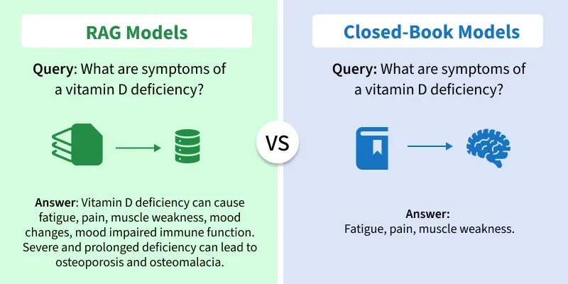

|       **Feature**       |                        **RAG Model**                         |                    **Closed-book Model**                     |
| :---------------------: | :----------------------------------------------------------: | :----------------------------------------------------------: |
|      **Main Idea**      | Looks up information from external sources before answering. |    Uses only internal knowledge learned during training.     |
|  **Knowledge Source**   | Combines both built-in memory and outside data (databases, documents, APIs). |            Relies completely on pre-trained data.            |
|   **Data Freshness**    | Can access up-to-date information depending on the connected data source |      Outdated after training — cannot access new data.       |
|      **Accuracy**       | High — less likely to make up facts because it checks external info. |     Moderate — may produce incorrect or old information.     |
|   **Explainability**    |      Can show the source of information or references.       | Can explain reasoning, but cannot reliably trace answers to external sources |
|        **Setup**        | Needs extra setup with databases or vector stores (like ChromaDB, FAISS, ElasticSearch). |            Simple setup — model works standalone.            |
|        **Speed**        |      Slightly slower because of the retrieval process.       |             Faster since no retrieval is needed.             |
|    **Storage Needs**    | Requires extra space for storing embeddings or external documents. |                  Needs only the model file.                  |
| **Updating Knowledge**  |    Easy — update or add new data to the external source.     |           Hard — needs retraining or fine-tuning.            |
| **Internet Connection** | Not required; can work with either online or local data sources |                 Not required; works offline.                 |
|      **Use Cases**      | Research tools, company knowledge bots, live fact-based systems. | Creative writing, general chat, summarization, reasoning tasks. |
|      **Examples**       | ChatGPT with retrieval, Bing Copilot, Perplexity AI, Gemini Advanced. |    GPT-3, early ChatGPT, Gemini Pro (without retrieval).     |

### RAG vs Knowledge Graph RAG

|      **Parameters**       |           **RAG (Retrieval-Augmented Generation)**           |               **Knowledge Graph Enhanced RAG**               |
| :-----------------------: | :----------------------------------------------------------: | :----------------------------------------------------------: |
|     **Core Approach**     | Retrieve information from unstructured text and generate responses |    Combine Knowledge Graphs with RAG to enable structured    |
|    **Knowledge Type**     |       Works with unstructured documents or text chunks       |      Uses both structured and unstructured information       |
|   **Retrieval Method**    |      Performs vector similarity search using embeddings      |  Uses hybrid retrieval with graph queries and vector search  |
|  **Data Representation**  |     Stores text in chunks without explicit relationships     |              Represents data as nodes and edges              |
| **Context Understanding** |     Limited to text similarity and surface-level meaning     | Captures deep semantic and relational context between entities. |
| **Reasoning Capability**  |      Retrieves facts but cannot infer new relationships      | Enables multi-hop reasoning and logical inference across connected nodes |

### RAG vs Vectorless RAG

|         **Feature**         |               **Vector RAG**                |                      **Vectorless RAG**                      |
| :-------------------------: | :-----------------------------------------: | :----------------------------------------------------------: |
|    **Retrieval Method**     |      Uses embedding similarity search       |          Uses logical reasoning and tree navigation          |
| **Document Representation** | Converts text into high-dimensional vectors |         Organizes text into a hierarchical page tree         |
|     **Search Process**      | Retrieves top-k similar chunks in one step  | Looks through major sections first, then focuses on exact information |
|      **Context Usage**      |     May include loosely related chunks      |            Selects only logically relevant pages             |
|    **Computation Cost**     |  Requires embedding generation and storage  |               Does not require vector storage                |

### RAG vs CRAG (Corrective RAG)

|           **Feature**           |        **RAG (Retrieval-Augmented Generation)**        |     **CRAG (Corrective Retrieval-Augmented Generation)**     |
| :-----------------------------: | :----------------------------------------------------: | :----------------------------------------------------------: |
|          **Core Idea**          | Retrieve documents then generate using them as context | Adds an evaluation and correction step before using retrieved documents |
|   **Handling Bad Retrieval**    | No built-in self-check, relies on quality of retrieval | Uses a retrieval evaluator to detect low quality docs and correct them |
|    **Correction Mechanism**     |                          None                          | Triggers corrective actions: filtering, re-retrieval, decomposition |
|      **Use of Web Search**      | May use external sources but not inherently corrective | Integrates large scale web search if retrieval fails or is ambiguous |
| **Robustness to Hallucination** |    Some risk of hallucination if retrieval is poor     |       Some risk of hallucination if retrieval is poor        |

### Agentic RAG vs Traditional RAG

|     **Feature**     |                     **Traditional RAG**                      |                       **Agentic RAG**                        |
| :-----------------: | :----------------------------------------------------------: | :----------------------------------------------------------: |
| **Decision-Making** | Reactive, no autonomous decisions. It follows predefined workflows. | Proactive, autonomously decides what to retrieve and how to act. |
| **Data Retrieval**  | Uses fixed, predefined sources like documents and databases. | Dynamically retrieves from multiple, diverse external sources. |
|   **Flexibility**   |  Low flexibility; static retrieval and generation methods.   | High flexibility; adapts retrieval and processing strategies |
|  **Adaptability**   | Limited adaptability; struggles with new or dynamic inputs.  | Highly adaptable; continuously refines and improves performance. |
|    **Autonomy**     | Dependent on explicit user queries; no self-initiated action. |   Operates independently, learns and adapts in real-time.    |
|    **Use Case**     |       Suitable for FAQs, simple Q&A and static search.       | Ideal for dynamic chatbots, recommendation systems and complex workflows. |

### Branched RAG vs Simple RAG

|           **Feature**            |          **Simple RAG**           |                   **Branched RAG**                   |
| :------------------------------: | :-------------------------------: | :--------------------------------------------------: |
|           **Approach**           | Uses a single retrieval pipeline. |  Splits query into multiple branches for retrieval.  |
|       **Query Processing**       |   Processes query as one unit.    | Breaks query into sub-parts and analyses separately. |
|     **Information Coverage**     | Limited to one retrieval context. |       Broader coverage from multiple sources.        |
|          **Complexity**          |   Simple and easy to implement.   |         More complex due to branching logic.         |
| **Performance on Complex Tasks** | Best for straightforward queries. |      Better for multi-step or complex problems.      |
|          **Use Cases**           | Basic chatbots, document search.  |    Research assistants, advanced reasoning tasks.    |

### Milvus vs Other Vector Databases

|      Feature / Database       |             Milvus              |         Pinecone          |    Weaviate     |         Chroma         |            FAISS            |
| :---------------------------: | :-----------------------------: | :-----------------------: | :-------------: | :--------------------: | :-------------------------: |
|        **Open Source**        |               Yes               |            No             |       Yes       |          Yes           |             Yes             |
|        **Scalability**        |       High (distributed)        | Very High (managed cloud) |      High       |        Moderate        |           Limited           |
|        **Index Types**        |    IVF, HNSW, ANNOY, DiskANN    |        Proprietary        |      HNSW       |          HNSW          |          IVF, Flat          |
|       **Hybrid Search**       |               Yes               |            Yes            |       Yes       |           No           |             No              |
|    **Metadata Filtering**     |               Yes               |            Yes            |       Yes       |          Yes           |             No              |
|    **Deployment Options**     |         On-prem / Cloud         |        Cloud only         |      Both       |         Local          |            Local            |
| **Integration with ML Tools** | Excellent (LangChain, PyMilvus) |         Moderate          |    Excellent    |          Good          |            Good             |
|         **Best For**          |   Production-grade AI systems   |      Enterprise SaaS      | Semantic search | Lightweight RAG setups | Research and offline search |

### Semantic Search vs Vector Search

| **Feature**                | **Vector Search**                                            | **Semantic Search**                                          |
| :------------------------- | :----------------------------------------------------------- | :----------------------------------------------------------- |
| Representation   | Numeric embeddings (vectors)                                 | Contextual, language-based understanding (NLP)               |
| Data Types       | Text, images, audio (multi-modal)                            | Primarily text                                               |
| Architecture     | FAISS, HNSW, ANN indexes                                     | Transformer models (BERT, GPT), NLP pipelines                |
| Speed            | High (especially on large datasets)                          | Slower, more computationally intensive                       |
| Context Handling | Captures statistical similarity                              | Deep contextual and intent understanding                     |
| Scalability      | Highly scalable                                              | Scalable with distributed ML, but resource-intensive         |
| Accuracy         | Good for similarity, limited context                         | High, especially for nuanced or ambiguous queries            |
| Limitations      | Requires efficient indexing, computationally intensive for large datasets | Requires sophisticated NLP models, context ambiguity in some cases |

### FiD vs FiE

|       **Aspect**       |               **Fusion-in-Decoder(FiD)**               |              **Fusion-in-Encoder(FiE)**               |
| :--------------------: | :----------------------------------------------------: | :---------------------------------------------------: |
|    **Fusion Point**    |          Fusion occurs in the decoding phase.          | Fusion happens at the encoding phase before decoding. |
| **Process Separation** |      Retrieval and generation are kept separate.       |   Retrieval and generation are processed together.    |
|     **Efficiency**     | Slower due to separate retrieval and generation steps. |  Faster due to simultaneous process in encoder phase  |
|     **Complexity**     |                      More Complex                      |                        Simpler                        |
|    **Performance**     |                Higher-quality response                 |              Quicker response generation              |

### Comparative Analysis of Metrics

|    **Metric Type**     |                         **Examples**                         |                        **Strengths**                         |                        **Weaknesses**                        |
| :--------------------: | :----------------------------------------------------------: | :----------------------------------------------------------: | :----------------------------------------------------------: |
| **Retrieval Metrics**  |            Hit Rate, MRR, Precision, Recall, nDCG            | Simple, interpretable, directly measures relevance and ranking quality |     Don’t evaluate answer quality, fluency or coherence      |
| **Generation Metrics** |          BLEU, ROUGE, METEOR, BERTScore, Perplexity          |          Quantitative, widely used, easy to compute          |  May miss semantic meaning, context or factual correctness   |
| **End-to-End Metrics** | Answer Relevance, Groundedness, Hallucination Rate, Coherence |  Holistic evaluation of system, includes factual grounding   | Harder to compute automatically, may require human evaluation |
|  **Human Evaluation**  |      Rating scales, Pairwise comparison, Expert review       | Captures nuance, context, readability and factual correctness |       Time consuming, subjective, not easily scalable        |

### LlamaIndex vs LangChain

|     **Aspect**     |                  **LlamaIndex**                  |                     **LangChain**                     |
| :----------------: | :----------------------------------------------: | :---------------------------------------------------: |
|     **Focus**      | Data ingestion, indexing and retrieval pipelines |      Language model orchestration and generation      |
|    **Indexing**    | Multiple optimized index types for diverse data  | Emphasis on generative workflows rather than indexing |
|    **Querying**    |     Semantic search and knowledge retrieval      |     Advanced LLM driven text generation and tasks     |
| **Learning Curve** |    More accessible for data integration tasks    |     Requires deeper understanding of LLM chaining     |


## Reference

[1] [datawhalechina/all-in-rag](https://github.com/datawhalechina/all-in-rag)

[1] [The AI Application Stack for Building RAG Apps](https://blog.bytebytego.com/p/ep167-top-20-ai-concepts-you-should)

[2] [RAG vs Agentic RAG](https://blog.bytebytego.com/i/167003530/rag-vs-agentic-rag)

[3] [RAG vs Fine-tuning: Which one should you use?](https://blog.bytebytego.com/i/177034686/rag-vs-fine-tuning-which-one-should-you-use)

[4] [How RAG Helps with Context Windows?](https://blog.bytebytego.com/i/176340112/how-rag-helps-with-context-windows)

[5] [What is Retrieval-Augmented Generation (RAG)?](https://blog.bytebytego.com/i/159794025/what-is-retrieval-augmented-generation-rag)

[6] [Lost in the Middle: How Language Models Use Long Contexts](https://arxiv.org/abs/2307.03172)

[7] [RAG vs Traditional QA](https://www.geeksforgeeks.org/nlp/rag-vs-traditional-qa/)

[8] [What is RAG?](https://blog.bytebytego.com/i/174052561/what-is-rag)

[9] [How to Build RAG Pipelines for LLM Projects?](https://www.geeksforgeeks.org/blogs/how-to-build-rag-pipelines-for-llm-projects/)

[10] [How to Chunk Text Data: A Comparative Analysis](https://www.geeksforgeeks.org/data-analysis/how-to-chunk-text-data-a-comparative-analysis/)

[11] [What are Vector Embeddings?](https://www.geeksforgeeks.org/nlp/what-are-vector-embeddings/)

[12] [Retrieval-Augmented Generation for Knowledge-Intensive NLP Tasks](https://arxiv.org/abs/2005.11401)

[13] [What is a Vector Database?](https://www.geeksforgeeks.org/data-science/what-is-a-vector-database/)

[14] [Milvus](https://www.geeksforgeeks.org/data-science/milvus/)

[15] [CLIP (Contrastive Language-Image Pretraining)](https://www.geeksforgeeks.org/deep-learning/clip-contrastive-language-image-pretraining/)

[16] [What is FAISS?](https://www.geeksforgeeks.org/data-science/what-is-faiss/)

[17] [Build a RAG agent with LangChain](https://docs.langchain.com/oss/python/langchain/rag)

[18] [Semantic Search vs Vector Search](https://www.geeksforgeeks.org/nlp/semantic-vs-vector-search/)

[19] [The RAG Triad](https://www.trulens.org/getting_started/core_concepts/rag_triad/)

[20] [RAG Vs Fine-Tuning for Enhancing LLM Performance](https://www.geeksforgeeks.org/nlp/rag-vs-fine-tuning-for-enhancing-llm-performance/)

[21] [Chunking Strategies](https://www.geeksforgeeks.org/artificial-intelligence/chunking-strategies/)

[22] [RAG Architecture](https://www.geeksforgeeks.org/nlp/rag-architecture/)

[23] [Knowledge Graphs for RAG](https://www.geeksforgeeks.org/artificial-intelligence/knowledge-graphs-for-rag/)

[24] [Self RAG (Retrieval Augmented Generation)](https://www.geeksforgeeks.org/artificial-intelligence/self-rag-retrieval-augmented-generation/)

[25] [Agentic RAG](https://www.geeksforgeeks.org/artificial-intelligence/what-is-agentic-rag/)

[26] [Vectorless RAG: PageIndex](https://www.geeksforgeeks.org/artificial-intelligence/vectorless-rag-pageindex/)

[27] [Multimodal Retrieval Augmented Generation (Multimodal RAG)](https://www.geeksforgeeks.org/artificial-intelligence/multimodal-retrieval-augmented-generation-multimodal-rag/)

[28] [Evaluation Metrics for Retrieval-Augmented Generation (RAG) Systems](https://www.geeksforgeeks.org/nlp/evaluation-metrics-for-retrieval-augmented-generation-rag-systems/)

[29] [Implementing Branched RAG](https://www.geeksforgeeks.org/data-science/implementing-branched-rag/)

[30] [Introduction to Branched RAG](https://www.geeksforgeeks.org/data-science/branched-rag/)

[31] [PDF Summarizer using RAG](https://www.geeksforgeeks.org/data-science/pdf-summarizer-using-rag/)

[32] [What is LlamaIndex](https://www.geeksforgeeks.org/machine-learning/what-is-llamaindex/)

[33] [Adaptive Retrieval Augmented Generation](https://www.geeksforgeeks.org/artificial-intelligence/adaptive-retrieval-augmente)

[34] [Knowledge Conflict in RAG](https://www.geeksforgeeks.org/artificial-intelligence/knowledge-conflict-in-rag/)

[35] [Corrective Retrieval Augmented Generation (CRAG)](https://www.geeksforgeeks.org/artificial-intelligence/corrective-retrieval-augmented-generation-crag/)

[36] [LightRAG](https://www.geeksforgeeks.org/artificial-intelligence/lightrag/)