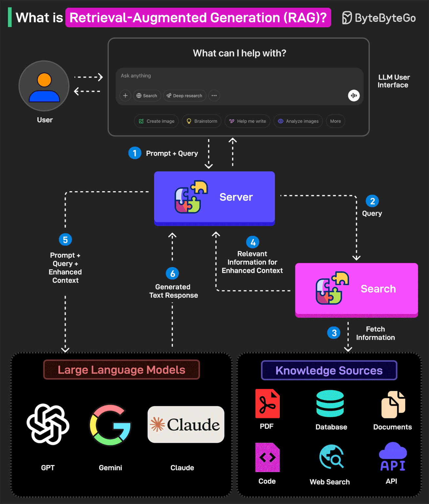

[中文版](rag_zh.md) | English

# RAG

[TOC]

RAG (Retrieval Augmented Generation) is a method that combines information retrieval with large language models to generate answers.

## Workflow

Retrieval-Augmented Generation (RAG) represents one of the most promising approaches to dealing with **context window limitations** (see: [Large Language Model#The Memory Problem](llm.md)). Instead of trying to fit everything into the LLM’s limited notepad, RAG systems work like having a smart librarian who quickly fetches only the relevant information needed for each specific question.

1. When we ask a question, the RAG system first searches through vast external databases to find relevant documents or passages.
2. It then inserts only these specific pieces of information into the context window along with our question.
3. The LLM generates its answer based on this freshly retrieved, highly relevant information. Rather than holding an entire library’s worth of knowledge in the context window, the system grabs just the specific books needed for each query.

This approach can make a reasonably sized context window feel almost limitless. The external database can contain millions of documents, far more than any context window could hold. For tasks like searching technical documentation, answering questions from knowledge bases, or finding specific information from large datasets, RAG systems excel.

## Tool Stack

## Summary

### RAG vs Agentic RAG

RAG (Retrieval Augmented Generation) is a method that combines information retrieval with large language models to generate answers. Here’s how RAG works on a high level:

1. The model retrieves relevant data from data sources and then extracts it to a vector database from the pre-indexed model.
2. Augment the prompts by retrieving information and merging it with the query prompt.
3. A Large Language Model (like GPT, Claude, or Gemini) understands the combined query and generates the final response.

Agentic RAG improves on this by introducing AI agents that can make decisions, select tools, and even refine queries for more accurate and flexible responses. Here’s how Agentic RAG works on a high level:

1. The user query is directed to an AI Agent for processing.
2. The agent uses short-term and long-term memory to track query context. It also formulates a retrieval strategy and selects appropriate tools for the job.
3. The data fetching process can use tools such as vector search, multiple agents, and MCP servers to gather relevant data from the knowledge base.
4. The agent then combines retrieved data with a query and system prompt. It passes this data to the LLM.
5. LLM processes the optimized input to answer the user’s query.

### RAG vs Fine-tuning

RAG (Retrieval-Augmented Generation): Fetches knowledge at runtime from external sources (docs, DBs, APIs). Flexible, always fresh.

Fine-tuning: Offline training that updates model weights with domain-specific data, making the model an expert in your field.

## Reference

[1] [The AI Application Stack for Building RAG Apps](https://blog.bytebytego.com/p/ep167-top-20-ai-concepts-you-should)

[2] [RAG vs Agentic RAG](https://blog.bytebytego.com/i/167003530/rag-vs-agentic-rag)

[3] [RAG vs Fine-tuning: Which one should you use?](https://blog.bytebytego.com/i/177034686/rag-vs-fine-tuning-which-one-should-you-use)

[4] [How RAG Helps with Context Windows?](https://blog.bytebytego.com/i/176340112/how-rag-helps-with-context-windows)

[5] [What is Retrieval-Augmented Generation (RAG)?](https://blog.bytebytego.com/i/159794025/what-is-retrieval-augmented-generation-rag)