[中文版](rag_zh.md) | English

# RAG

[TOC]

RAG (Retrieval Augmented Generation) is a method that combines information retrieval with large language models to generate answers.

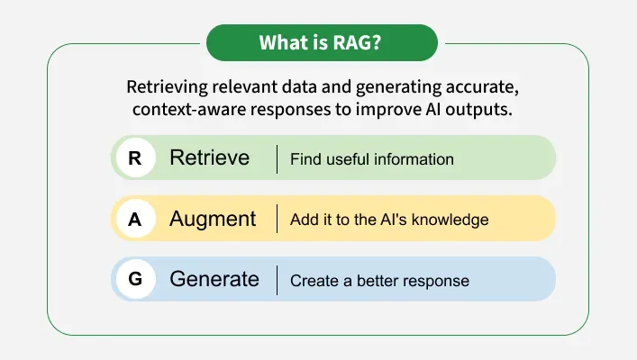

## Components

### External Knowledge Source

### Text Chunking and Preprocessing

#### LangChain

[LangChain](https://github.com/langchain-ai/langchain) is a framework for building agents and LLM-powered applications. It helps you chain together interoperable components and third-party integrations to simplify AI application development — all while future-proofing decisions as the underlying technology evolves.

#### Unstructured

The [Unstructured](https://docs.unstructured.io/open-source/introduction/overview) open source library offers an open-source toolkit designed to simplify the ingestion and pre-processing of diverse data formats, including images and text-based documents such as PDFs, HTML files, Word documents, and more. With a focus on optimizing data workflows for Large Language Models (LLMs), the Unstructured open source library provides modular functions and connectors that work seamlessly together. This cohesive system ensures efficient transformation of unstructured data into structured formats, while also offering adaptability to various platforms and use cases.

### Embedding Model

#### CLIP (Contrastive Language-Image Pre-training)

CLIP or Contrastive Language-Image Pretraining is an advanced AI model developed by OpenAI and UC Berkeley. It has the unique ability to understand and relate both textual descriptions and images. It uses a novel training method that contrasts pairs of images and text which makes it highly useful tool for various real-world applications

### Vector Database

#### Milvus

Milvus is an open-source vector database designed for managing and searching large-scale embedding data efficiently. It is widely used in AI, machine learning, and semantic search applications where similarity search and retrieval play a key role.

#### FAISS

[Faiss](https://github.com/facebookresearch/faiss) (Facebook AI Similarity Search) is an open-source library developed by Meta for efficient similarity search and clustering of dense vectors. It is designed to handle datasets ranging from a few million to over a billion high-dimensional vectors, making it a backbone for modern recommendation systems, search engines, and AI applications.

### Query Encoder

### Retriever

### Prompt Augmentation Layer

### LLM (Generator)

### Updater (Optional)

## Workflow

Retrieval-Augmented Generation (RAG) represents one of the most promising approaches to dealing with **context window limitations** (see: [Large Language Model#The Memory Problem](llm.md)). Instead of trying to fit everything into the LLM’s limited notepad, RAG systems work like having a smart librarian who quickly fetches only the relevant information needed for each specific question.

1. Creating External Data

   External data from APIs, databases, or documents is chunked, converted into embeddings, and stored in a vector database to build a knowledge library.

2. Retrieving Relevant Information

   User queries are converted into vectors and matched against stored embeddings to fetch the most relevant data, ensuring accurate responses.

3. Augmenting the LLm Prompt

   Retrieved content is added to the user's query, giving the LLM extra context to work with.

4. Answer Generation

   LLM uses both the query and retrieved data to generate a factually accurate, context-aware response.

5. Keeping Data Updated

   External data and embeddings are refreshed regularly in real time or scheduled so the system always retrieves the latest information.

This approach can make a reasonably sized context window feel almost limitless. The external database can contain millions of documents, far more than any context window could hold. For tasks like searching technical documentation, answering questions from knowledge bases, or finding specific information from large datasets, RAG systems excel.

### Initial Setup

TODO

### Data Preparation

Raw data sources like PDFs or web pages may contain a mix of text, images, tables, and other elements, so it’s important to clean and extract just the useful information.

#### Data Loading

TODO

#### Text Chunking

Text chunking, also known as text segmentation, involves dividing text into smaller units that can be processed more efficiently. These units can be sentences, paragraphs, or even phrases, depending on the application.

The common text chunking techniques:

1. Fixed-Size Chunking

   Fixed-size chunking involves dividing the text into chunks of a predefined size, typically based on the number of characters or tokens.

2. Sentence Splitting

   Sentence splitting involves dividing the text into individual sentences using punctuation marks.

3. Recursive Chunking

   Recursive chunking divides the text hierarchically using a set of separators. If the initial chunks are too large, the method recursively splits them until the desired size is achieved.

4. Semantic Chunking

   Semantic chunking involves grouping sentences or phrases based on their semantic similarity. This method often uses clustering algorithms or embedding models.

5. Content-Aware Chunking

   Content-aware chunking adapts the chunking strategy based on the nature of the text. For instance, it can use different separators for different content types (e.g., paragraphs, lists).

6. Propositional Chunking

   Propositional chunking involves breaking down text into atomic units called propositions, each representing a distinct fact or idea

### Index Construction

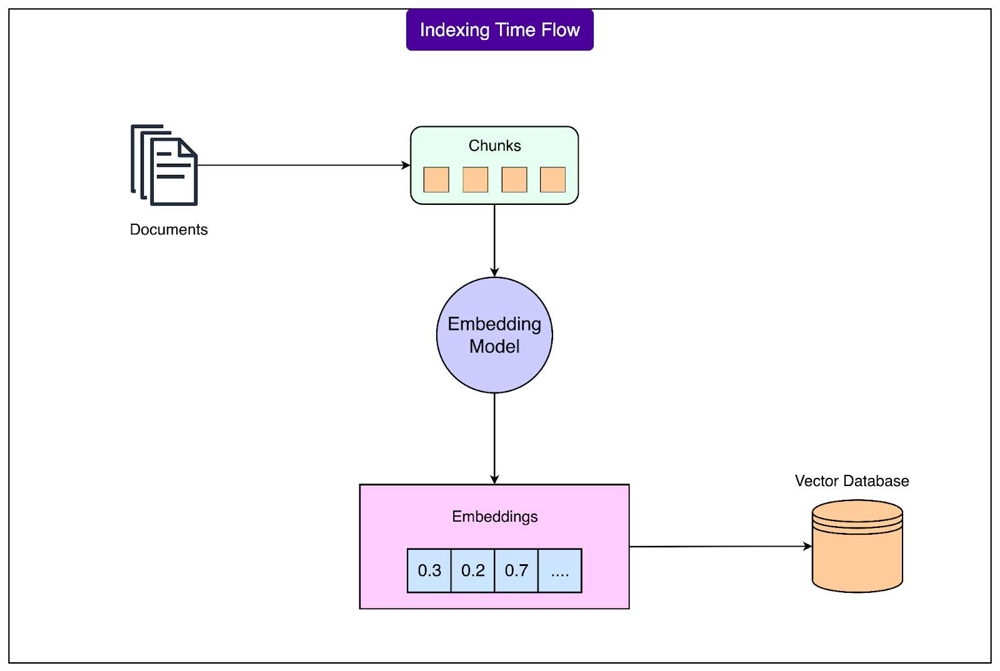

#### Vector Embedding

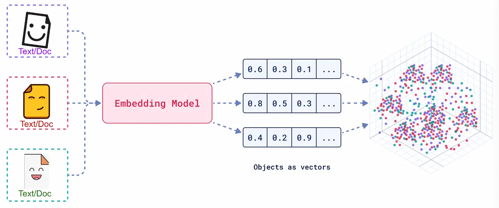

Vector embedding is a digital fingerprint or a numerical representation of words or other pieces of data. Each object is transformed into a list of numbers called a vector. These vectors capture properties of the object in a more manageable and understandable form for machine learning models.

Types of vector embeddings:

1. Word embedding

   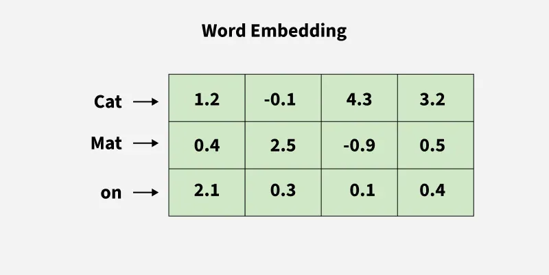

   Word embeddings captures not only the semantic meaning of words but also their contextual relationship to other words which help them to classify similarities and cluster different points based on their properties and features.

2. Sentence embedding

   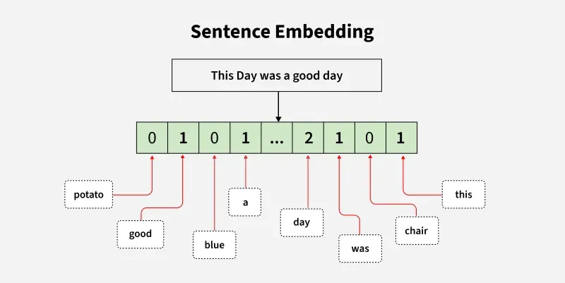

   Sentence embeddings represent the entire sentence as a single vector that captures its overall meaning. It aims at finding the semantic meaning of entire phrases or sentences rather than individual words. They are generated with SBERT or other variants of sentence transformers.

3. Image embedding

   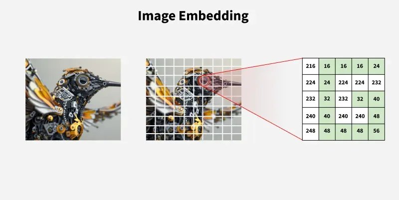

   Image embeddings transforms images into numerical representations through which our model can perform image search, object recognition, and image generation.

4. Multimodal embedding

   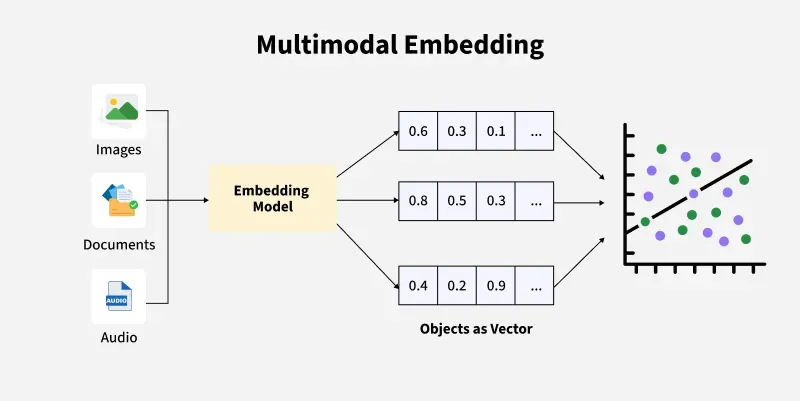

   Multimodal embedding combines different types of data models into a shared embedding space.

The key evaluations:

- Consine Similarity
- Dot Product
- Euclidean Distance

#### Vector Database

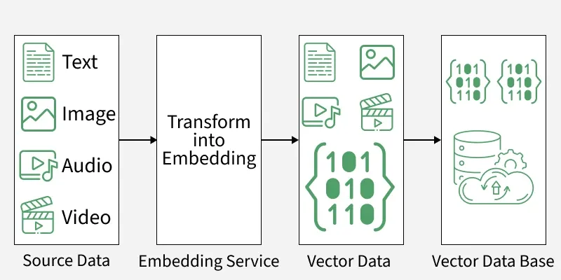

A vector database is a specialized type of database designed to store, index and search high dimensional vector representations of data known as embeddings. Unlike traditional databases that rely on exact matches vector databases use similarity search techniques such as cosine similarity or Euclidean distance to find items that are semantically or visually similar.

#### Index Optimization

TODO

### Query and Retrieval

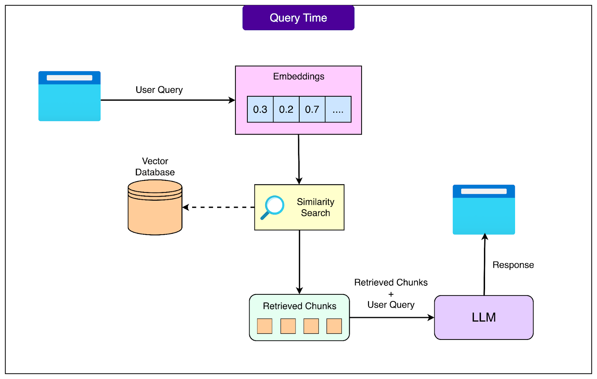

#### Hybrid Search

#### Query Construction

#### Text2SQL

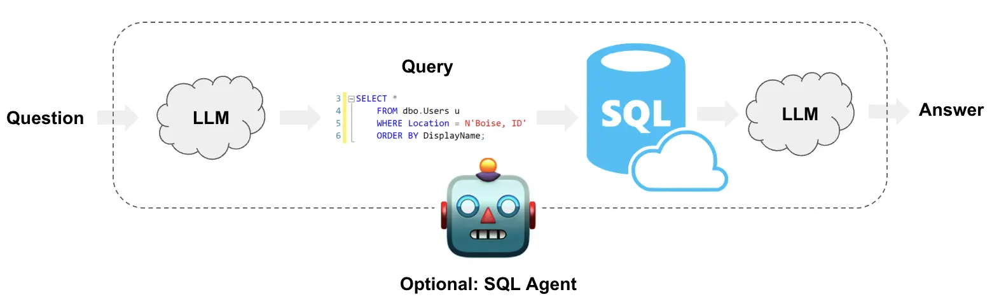

#### Query Rewriting and Routing

TODO

### Generation Integration

#### Formatted Generation

TODO

## Evaluation

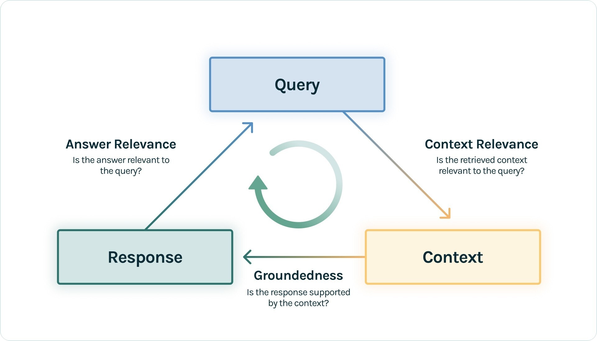

The quality of a RAG system cannot be judged by feeling alone. The industry typically uses several dimensions for quantitative evaluation:

- Retrieval relevance (does the retrieved content contain the answer?)
- Generation quality:
  - semantic faithfulness (is the meaning of the answer correct?)
  - lexical appropriateness (are technical terms used correctly?)

### Evaluation Tools

#### LlamaIndex Evaluation

TODO

#### RAGAS

TODO

#### Phoenix

TODO

## Optimization

### Alternative Rules

|                Method                |                         Description                          |                         When to Use                          |
| :----------------------------------: | :----------------------------------------------------------: | :----------------------------------------------------------: |
|          Prompt Engineering          | Adjusts the input prompt to guide model behavior without changing its training. | When you need a quick and simple solution for specific tasks or queries. |
| Retrieval-Augmented Generation (RAG) | Combines retrieval and generation to use external data for more factual and context-aware responses. | When you want the model’s responses to include real-time, relevant information from external sources. |
|             Fine-Tuning              |  Retrains the model on a smaller, domain-specific dataset.   | When you need better performance on a particular topic or industry data. |
|             Pre-Training             | Trains the model from scratch using a large and diverse dataset. | When you want to build a strong foundation for later customization and adaptation. |

### Lost in the middle problem

TODO

## Summary

### Advantage

1. Dual Improvement in accuracy and trustworthiness
2. Timeliness guarantee
3. Significant overall cost-effectiveness
4. Flexible and modular scalability

Risk-Graded Application Scenarios:

| Risk Level      | Examples                             | RAG Applicability                          |
| --------------- | ------------------------------------ | ------------------------------------------ |
| **Low Risk**    | Translation/Grammar checking         | High reliability                           |
| **Medium Risk** | Contract drafting/Legal consultation | Requires human review                      |
| **High Risk**   | Evidence analysis/Visa decisions     | Requires strict quality control mechanisms |

### RAG vs Agentic RAG

RAG (Retrieval Augmented Generation) is a method that combines information retrieval with large language models to generate answers. Here’s how RAG works on a high level:

1. The model retrieves relevant data from data sources and then extracts it to a vector database from the pre-indexed model.
2. Augment the prompts by retrieving information and merging it with the query prompt.
3. A Large Language Model (like GPT, Claude, or Gemini) understands the combined query and generates the final response.

Agentic RAG improves on this by introducing AI agents that can make decisions, select tools, and even refine queries for more accurate and flexible responses. Here’s how Agentic RAG works on a high level:

1. The user query is directed to an AI Agent for processing.
2. The agent uses short-term and long-term memory to track query context. It also formulates a retrieval strategy and selects appropriate tools for the job.
3. The data fetching process can use tools such as vector search, multiple agents, and MCP servers to gather relevant data from the knowledge base.
4. The agent then combines retrieved data with a query and system prompt. It passes this data to the LLM.
5. LLM processes the optimized input to answer the user’s query.

### RAG vs Fine-tuning

RAG (Retrieval-Augmented Generation): Fetches knowledge at runtime from external sources (docs, DBs, APIs). Flexible, always fresh.

Fine-tuning: Offline training that updates model weights with domain-specific data, making the model an expert in your field.

When choosing a technical path, a key consideration is the balance between cost and benefit. Typically, we should prioritize the solution with the least modification to the model and the lowest cost, so the technical selection path often follows this order: Prompt Engineering -> Retrieval-Augmented Generation(RAG) -> Fine-tuning.

### RAG vs Traditional QA

|         **Feature**          | **Traditional QA (BERT, GPT)** |        **RAG (Retriever + Generator)**        |
| :--------------------------: | :----------------------------: | :-------------------------------------------: |
|  Knowledge Source  |     Fixed (Training Data)      |            Dynamic (External Docs)            |
|    Answer Type     |     Extracted or Generated     |             Retrieved + Generated             |
|  Factual Accuracy  |            Limited             |            High (Uses Latest Info)            |
|  Contextual Depth  |            Limited             |         More comprehensive responses          |
|    Scalability     |            Moderate            |      High (Handles vast knowledge bases)      |
| Computational Cost |             Lower              |        Higher (Due to retrieval step)         |
|      Latency       |              Low               | Higher (Retrieval adds extra processing time) |

### Milvus vs Other Vector Databases

|      Feature / Database       |             Milvus              |         Pinecone          |    Weaviate     |         Chroma         |            FAISS            |
| :---------------------------: | :-----------------------------: | :-----------------------: | :-------------: | :--------------------: | :-------------------------: |
|        **Open Source**        |               Yes               |            No             |       Yes       |          Yes           |             Yes             |
|        **Scalability**        |       High (distributed)        | Very High (managed cloud) |      High       |        Moderate        |           Limited           |
|        **Index Types**        |    IVF, HNSW, ANNOY, DiskANN    |        Proprietary        |      HNSW       |          HNSW          |          IVF, Flat          |
|       **Hybrid Search**       |               Yes               |            Yes            |       Yes       |           No           |             No              |
|    **Metadata Filtering**     |               Yes               |            Yes            |       Yes       |          Yes           |             No              |
|    **Deployment Options**     |         On-prem / Cloud         |        Cloud only         |      Both       |         Local          |            Local            |
| **Integration with ML Tools** | Excellent (LangChain, PyMilvus) |         Moderate          |    Excellent    |          Good          |            Good             |
|         **Best For**          |   Production-grade AI systems   |      Enterprise SaaS      | Semantic search | Lightweight RAG setups | Research and offline search |

### Semantic Search vs Vector Search

| **Feature**                | **Vector Search**                                            | **Semantic Search**                                          |
| :------------------------- | :----------------------------------------------------------- | :----------------------------------------------------------- |
| Representation   | Numeric embeddings (vectors)                                 | Contextual, language-based understanding (NLP)               |
| Data Types       | Text, images, audio (multi-modal)                            | Primarily text                                               |
| Architecture     | FAISS, HNSW, ANN indexes                                     | Transformer models (BERT, GPT), NLP pipelines                |
| Speed            | High (especially on large datasets)                          | Slower, more computationally intensive                       |
| Context Handling | Captures statistical similarity                              | Deep contextual and intent understanding                     |
| Scalability      | Highly scalable                                              | Scalable with distributed ML, but resource-intensive         |
| Accuracy         | Good for similarity, limited context                         | High, especially for nuanced or ambiguous queries            |
| Limitations      | Requires efficient indexing, computationally intensive for large datasets | Requires sophisticated NLP models, context ambiguity in some cases |

### Tool Stack

## Reference

[1] [datawhalechina/all-in-rag](https://github.com/datawhalechina/all-in-rag)

[1] [The AI Application Stack for Building RAG Apps](https://blog.bytebytego.com/p/ep167-top-20-ai-concepts-you-should)

[2] [RAG vs Agentic RAG](https://blog.bytebytego.com/i/167003530/rag-vs-agentic-rag)

[3] [RAG vs Fine-tuning: Which one should you use?](https://blog.bytebytego.com/i/177034686/rag-vs-fine-tuning-which-one-should-you-use)

[4] [How RAG Helps with Context Windows?](https://blog.bytebytego.com/i/176340112/how-rag-helps-with-context-windows)

[5] [What is Retrieval-Augmented Generation (RAG)?](https://blog.bytebytego.com/i/159794025/what-is-retrieval-augmented-generation-rag)

[6] [Lost in the Middle: How Language Models Use Long Contexts](https://arxiv.org/abs/2307.03172)

[7] [RAG vs Traditional QA](https://www.geeksforgeeks.org/nlp/rag-vs-traditional-qa/)

[8] [What is RAG?](https://blog.bytebytego.com/i/174052561/what-is-rag)

[9] [How to Build RAG Pipelines for LLM Projects?](https://www.geeksforgeeks.org/blogs/how-to-build-rag-pipelines-for-llm-projects/)

[10] [How to Chunk Text Data: A Comparative Analysis](https://www.geeksforgeeks.org/data-analysis/how-to-chunk-text-data-a-comparative-analysis/)

[11] [What are Vector Embeddings?](https://www.geeksforgeeks.org/nlp/what-are-vector-embeddings/)

[12] [Retrieval-Augmented Generation for Knowledge-Intensive NLP Tasks](https://arxiv.org/abs/2005.11401)

[13] [What is a Vector Database?](https://www.geeksforgeeks.org/data-science/what-is-a-vector-database/)

[14] [Milvus](https://www.geeksforgeeks.org/data-science/milvus/)

[15] [CLIP (Contrastive Language-Image Pretraining)](https://www.geeksforgeeks.org/deep-learning/clip-contrastive-language-image-pretraining/)

[16] [What is FAISS?](https://www.geeksforgeeks.org/data-science/what-is-faiss/)

[17] [Build a RAG agent with LangChain](https://docs.langchain.com/oss/python/langchain/rag)

[18] [Semantic Search vs Vector Search](https://www.geeksforgeeks.org/nlp/semantic-vs-vector-search/)

[19] [The RAG Triad](https://www.trulens.org/getting_started/core_concepts/rag_triad/)