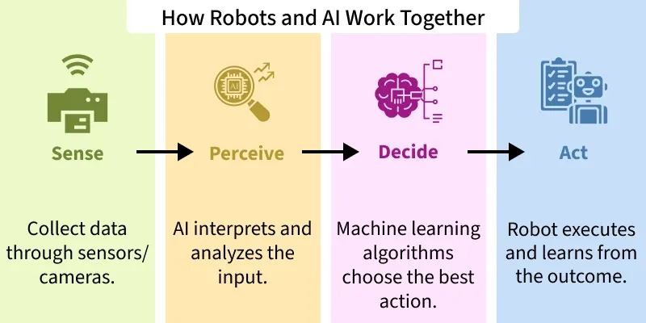

# Robotics

[TOC]

## Robotic Process Automation

**Robotic Process Automation (RPA)** defines automation through software robots (or bots) to reduce manual labor in repetitive and rule-based tasks. RPA is based largely on [Machine Learning](#ml.md) and the use of [Artificial Intelligence (AI)](#summary.md) to build software robots or bots for running business-oriented activities. These bots simulate human actions in a myriad of ways, such as *entering data into systems, processing transactions, responding to e-mails, and creating reports.* *RPA* operates by interacting with existing systems, applications, and data sources just like a human user would, but much faster and more accurately.

## Reference

[1] [Artificial Intelligence in Robotics](https://www.geeksforgeeks.org/artificial-intelligence/artificial-intelligence-in-robotics/)

[2] [What is Robotics Process Automation](https://www.geeksforgeeks.org/blogs/robotics-process-automation-an-introduction/)
