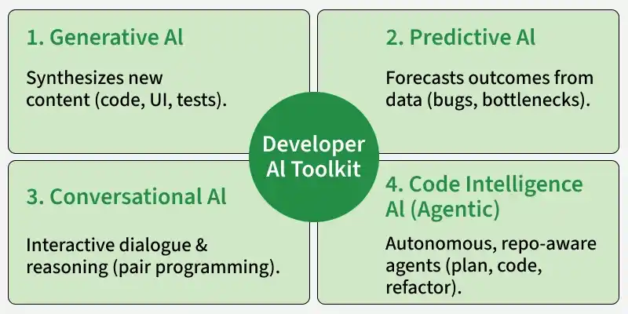
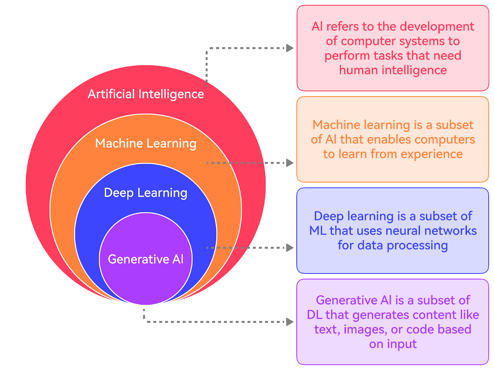
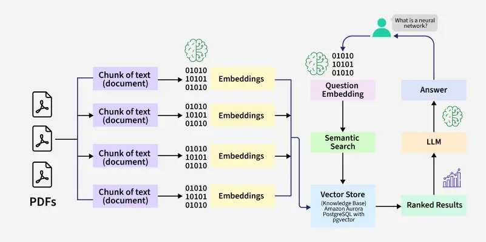
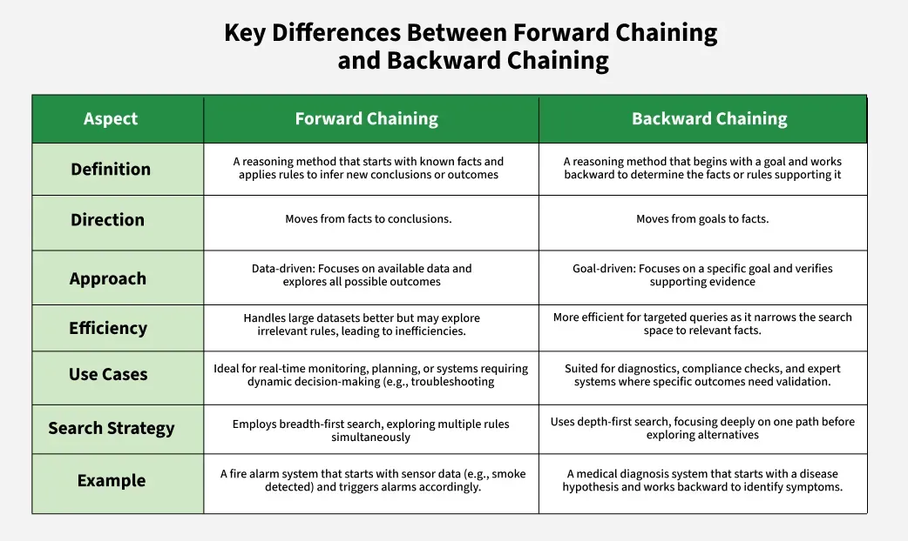

# AI Summary

[TOC]

Artificial Intelligence (AI) refers to the simulation of human intelligence in machines, allowing them to perform tasks that typically require human cognitive functions such as learning, reasoning, problem-solving, perception, and decision-making.

## AI Types

### Types of AI Based on Functionalities

|            **Basis**             |        **Reactive AI**         |   **Limited Memory AI**    |        **Theory of Mind AI**         |                **Self-Aware AI**                |
| :------------------------------: | :----------------------------: | :------------------------: | :----------------------------------: | :---------------------------------------------: |
| Level of Intelligence  |      Basic response-based      |     Learned from data      |     Social/emotional (emerging)      |         Conscious-level (hypothetical)          |
|    Learning Ability    |          No learning           |   Learns from past data    | Limited/experimental social learning |     Self-reflective learning (theoretical)      |
|    Decision-Making     | Rule-based, immediate response | Data-driven, probabilistic | Context + emotion + intention-based  |         Fully autonomous, self-directed         |
| Interaction Complexity |    Simple, fixed responses     | Context-aware interaction  |    Human-like social interaction     | Highly advanced, human-equivalent (theoretical) |
|   Real-World Status    |          Fully exists          |     Widely used today      |            Research stage            |                Not yet achieved                 |

### Types of AI Models

### Developer AI Toolkit

## Hierarchy

## Workflow

## Machine Learning (ML)

### Supervised Machine Learning

### Unsupervised Machine Learning

### Reinforcement Machine Learning

## Deep Learning

### Neural Networks

### Artificial Neural Networks (ANNs)

### Convolutional Neural Networks (CNNs)

### Recurrent Neural Networks (RNNs)

### Long Short-Term Memory Networks (LSTMs)

### Generative Adversarial Networks (GANs)

### Autoencoders

## Natural Language Processing (NLP)

### Phase

## Computer Vision

## Generative AI

## Agentic AI

### Types of Agents

1. Simple Reflex Agents

   Simple reflex agents act only on the current perception of the environment using predefined condition–action rules. They do not rely on past experiences or predict future outcomes and respond directly using simple “if–then” logic.

2. Model-Based Reflex Agents

   

   Model-based reflex agents maintain an internal model of the environment to handle situations where full information is not directly available. This helps them make better decisions by considering changes in the environment and the impact of their actions.

3. Goal-Based Agents

   

   Goal-based agents choose their actions by focusing on a specific objective and evaluating how different choices can help achieve it. Instead of reacting only to the current situation, they plan ahead and consider possible future outcomes.

4. Utility-Based Agents

   

   Utility-based agents go beyond simply achieving goals by evaluating how beneficial each action is using a utility function, which measures the overall “value” or satisfaction of an outcome. This helps them choose the best option when dealing with trade-offs or uncertainty.

5. Learning Agents

   

   Learning agents improve their behavior over time by using feedback from past actions. They continuously refine their internal models to make better decisions in future situations.

6. Multi-Agent Systems (MAS)

   

   Multi-agent systems consist of multiple autonomous agents that interact within a shared environment, where they may cooperate, compete, or do both depending on the situation.

7. Hierarchical Agents

   

   Hierarchical agents organize decision-making in layers, where higher levels focus on planning and lower levels handle execution. This structure helps manage complex tasks by separating strategy from operational details.

### AI Agent Roadmap

## Other

### Knowledge Representation

Knowledge Representation (KR) in AI focuses on how machines store and organize real-world information so they can reason, learn, and make intelligent decisions like humans.

- **Declarative Knowledge:** Knowledge about facts and concepts it answers what something is . Example: Paris is the capital of France.
- **Procedural Knowledge:** Knowledge about how to perform a task or solve a problem. Example: Steps to sort numbers using an algorithm.
- **Meta knowledge:** Knowledge about other knowledge or how knowledge is used. Example: Knowing that a certain rule works better for solving math problems.
- **Heuristic Knowledge:** Experience-based knowledge or rules of thumb used by experts. Example: A doctor using past experience to guess a possible disease.
- **Structural Knowledge:** Knowledge that shows relationships between concepts. Example: A car is a type of vehicle.

### Inference

In AI, inference rules serve as guiding principles for deriving valid conclusions from existing data. These rules underpin the construction of proofs, which constitute chains of reasoning leading to desired outcomes. Within these rules lie key terminologies that delineate relationships between propositions connected by various logical connectives:

- Implication

  Symbolized by A → B, implication denotes that proposition A implies proposition B, suggesting a cause-and-effect relationship.

- Converse

  Flipping the implication, placing B on the left and A on the right (B → A), though the converse doesn't ensure the original implication's validity.

- Contrapositive

  The negation of the converse (¬B → ¬A), offering an equivalent implication with both propositions negated.

- Inverse

  Symbolized by ¬A → ¬B, the inverse represents the negation of the original implication, albeit not guaranteeing its truth.

### Hardware

### Library/Tools

### NLP Python Library

## AI Algorithms

## Challenge

### Ignorable Problems

These are minor issues that have little or no effect on the AI system’s overall performance. They are often harmless and do not require immediate attention.

Examples:

- Small inaccuracies in predictions that don't affect the final result like a slight error in image classification.
- Minor issues in data preprocessing that don't change the outcome.

### Recoverable Problems

Recoverable problems are those where the AI system encounters an issue but can be fixed with intervention, either automatically or manually, such as error-handling functions.

Examples:

- Missing data that can be filled in using statistical methods.
- System crashes that can be fixed by restoring from a backup.

### Irrecoverable Problems

These are severe issues that cause permanent damage or failure, making it impossible for the system to recover. They can lead to significant performance loss.

Examples:

- Corrupted training data that causes bias and reduces the model's effectiveness.
- Adversarial attacks that make the model untrustworthy.
- Overfitting where the model becomes too specialized and cannot adapt to new data.

### Constraint Satisfaction Problems (CSP)

A *Constraint Satisfaction Problem* is a mathematical problem where the solution must meet a number of constraints. In CSP, the objective is to assign values to variables such that all the constraints are satisfied. Many AI applications use CSPs to solve decision-making problems that involve managing or arranging resources under strict guidelines.

## Application

### AI in Manufacturing

### AI in Transportation

## Tools and Framework

### Framework

#### LangChain

[LangChain](https://github.com/langchain-ai/langchain) is a framework for building agents and LLM-powered applications. It helps you chain together interoperable components and third-party integrations to simplify AI application development — all while future-proofing decisions as the underlying technology evolves.

LangChain enables Retrieval-Augmented Generation (RAG) by combining document processing, vector storage, and LLMs to generate accurate, context-aware responses. It connects embeddings, vector databases, and models into a smooth workflow.

#### LangGraph

LangGraph is an open-source framework from [RAG#LangChain](rag.md) designed to build and manage AI agent workflows using graph-based structures. It allows developers to define workflows as nodes and edges, making complex agent interactions more structured, scalable, and easier to control.

1. Start

   The process begins with the agent (Assistant) initiating an interaction or task.

2. Assistant

   The process begins with the agent (Assistant) initiating an interaction or task.

3. Enter Write Sequence

   If the task requires writing assistance like generating content, the workflow enters a dedicated writing sequence.

4. Write Assistant

   This specialized module focuses on the writing process. It may loop with tools for refining or editing before completing the sequence.

5. Leave Write Sequence

   Once the writing task is complete the system exits the write mode.

6. Writer Sensitive Tools and Assistant Tools

   These nodes provide specialized capabilities. Depending on the state the Assistant routes tasks to tools that enhance writing or perform sensitive operations.

7. End

   The process concludes once the desired outcome is achieved and all necessary tools have been executed.

#### AutoGen

AutoGen allows you to develop AI agents that can chat with each other or involve humans in the loop. It is like a collaborative workspace where agents can run code, pull in data from tools, or get human feedback to complete a task.

#### CrewAI

As the name suggests, CrewAI is all about teamwork. It orchestrates teams of AI agents with roles like writers and editors, processing tasks in a structured workflow. It utilizes LLMs and tools (APIs, Internet, code, etc) to efficiently manage complex task execution and data flow.

#### LlamaIndex

[LlamaIndex](https://github.com/run-llama/llama_index) is an open-source framework that helps connect private and domain-specific data with large language models to build context-aware AI applications. It simplifies data ingestion, indexing and querying for better and more efficient outputs.

#### Semantic Kernel

Semantic Kernel connects AI services (OpenAI, Calude, Hugging Face models, etc) with a plugin-based architecture that supports skills, templates, and API integrations for flexible workflows. It supports text search and custom workflows for applications.

### Libraries

#### NLTK

Natural Language Processing (NLP) plays an important role in enabling machines to understand and generate human language. Natural Language Toolkit (NLTK) stands out as one of the most widely used libraries. It provides a combination of linguistic resources, including text processing libraries and pre-trained models, which makes it ideal for both academic research and practical applications.

#### Unstructured

The [Unstructured](https://docs.unstructured.io/open-source/introduction/overview) open source library offers an open-source toolkit designed to simplify the ingestion and pre-processing of diverse data formats, including images and text-based documents such as PDFs, HTML files, Word documents, and more. With a focus on optimizing data workflows for Large Language Models (LLMs), the Unstructured open source library provides modular functions and connectors that work seamlessly together. This cohesive system ensures efficient transformation of unstructured data into structured formats, while also offering adaptability to various platforms and use cases.

## Summary

### AI Agent vs MCP vs RAG

An AI agent is a software program that can interact with its environment, gather data, and use that data to achieve predetermined goals. AI agents can choose the best actions to perform to meet those goals.

Model Context Protocol (MCP) is an open standard that allows AI models (like Claude) to connect to databases, APIs, file systems, and other tools without needing custom code for each new integration.

RAG (Retrieval-Augmented Generation) is about what the model knows at runtime. The model stays frozen. No retraining. When a user asks a question, a retriever fetches relevant documents (PDFs, code, vector DBs), and those are injected into the prompt.

### Traditional AI vs Agentic AI

|      Feature       |                        Traditional AI                        |                          Agentic AI                          |
| :----------------: | :----------------------------------------------------------: | :----------------------------------------------------------: |
| **Core Function**  |            Performs specific, preprogrammed tasks            |      Executes tasks autonomously using predefined goals      |
| **Typical output** | Deterministic results—answers, classifications, predictions  |           Actions, decisions, multi-step workflows           |
|    **Autonomy**    | Low as it requires explicit instructions, operates within set boundaries | High as it plans, adapts, and makes decisions with minimal human direction |
|    **Learning**    | Learns from labeled data, often needs retraining for new situations | Learns from experience, adapts strategies and workflows in real time |
|   **Use cases**    |      Data sorting, image recognition, basic diagnostics      | Workflow automation, dynamic planning, virtual assistants, problem solving |
|  **Scalability**   |          Requires manual oversight as systems grow.          | Oversees and coordinates whole systems hence reducing manual monitoring. |
|  **Adaptability**  |  Struggles with unexpected changes and may need retraining.  | Adjusts strategies and learns in real time and is best suited for fast-changing situations. |
| **Business value** |   Automates simple, rule-based jobs, increases consistency   | Automates complex operations, reduces manual work, and enables personalized tasks |

### AI vs ML vs DL

|       **Aspect**        |                              AI                              |                              ML                              |                              DL                              |
| :---------------------: | :----------------------------------------------------------: | :----------------------------------------------------------: | :----------------------------------------------------------: |
| **Scope & Application** | Broad – includes ML, DL, expert systems, robotics, computer vision, NLP, symbolic AI, etc. | Narrower – focuses on data-driven algorithms and statistical learning. |  Narrowest – focuses specifically on deep neural networks.   |
|   **Core Techniques**   | Rule-based systems, search algorithms, expert systems, ML, DL, reinforcement learning, NLP. | Supervised learning, unsupervised learning, reinforcement learning, regression, classification, clustering. | CNNs (Convolutional Neural Networks), RNNs (Recurrent Neural Networks), LSTMs, Transformers, GANs. |
|      **Data Type**      | Can work with structured, semi-structured or unstructured data depending on the approach. | Mainly structured and labeled data (though some algorithms handle unstructured data). |  Primarily unstructured data (images, audio, text, video).   |
| **Learning Dependency** | May or may not involve learning (AI can be purely rule-based). |        Always involves learning from historical data.        | Fully dependent on large-scale learning with neural networks. |
|  **Model Complexity**   | Can range from simple decision trees to complex hybrid AI systems. | Relatively simpler – linear models, trees, SVMs, ensemble methods. | Very complex – multi-layer neural networks with millions to billions of parameters. |
|  **Computation Power**  | Low to high, depending on the AI technique (expert systems vs DL). |      Moderate – runs well on CPUs for most algorithms.       |  Very high – requires GPUs/TPUs for training large models.   |

### Generative AI vs Traditional AI

|      **Aspect**      |                      **Traditional AI**                      |                  **Generative AI (GenAI)**                   |
| :------------------: | :----------------------------------------------------------: | :----------------------------------------------------------: |
|    **Definition**    | Traditional AI focuses on analyzing existing data, identifying patterns and making predictions or decisions based on predefined logic or learned patterns. | Generative AI focuses on creating new and original content—such as text, images or audio—by learning patterns from existing data. |
|     **Purpose**      | To analyze data and assist in decision-making or automation of specific tasks. | To generate new data or content that mimics human creativity. |
|   **Output Type**    | Predictive or analytical outputs (e.g., classification, recommendation). | Creative or generative outputs (e.g., text, images, videos, code). |
|    **Data Usage**    |  Uses data to train models that make accurate predictions.   | Uses data to learn structure and generate novel examples from it. |
|     **Examples**     |      Spam detection, credit scoring, medical diagnosis.      |             ChatGPT, DALL·E, Midjourney, Gemini.             |
| **Techniques Used**  | Machine learning algorithms, decision trees, regression models, and rule-based systems. | Deep learning models like Transformers, Diffusion models, and GANs. |
| **Interaction Type** |                Task-specific and rule-driven.                |           Conversational, open-ended and creative.           |

### Generative AI vs Agentic AI

|      **Aspect**       |                  **Generative AI (GenAI)**                   |                        **Agentic AI**                        |
| :-------------------: | :----------------------------------------------------------: | :----------------------------------------------------------: |
|    **Definition**     | Generative AI focuses on creating new content such as text, images, videos or code by learning from existing data. | Agentic AI focuses on autonomous decision-making and goal-oriented actions by interacting with environments, tools or systems. |
|   **Core Function**   |  Generates creative outputs based on learned data patterns.  | Acts independently to plan, reason and execute tasks to achieve objectives. |
|   **Primary Goal**    |            Content creation and idea generation.             |             Task automation and problem-solving.             |
|    **Dependency**     |         Works based on prompts or input from users.          |   Can operate with minimal human input once a goal is set.   |
|  **Key Components**   |    Large Language Models (LLMs), Diffusion Models, GANs.     | LLMs combined with reasoning, memory, planning and tool-use capabilities. |
|     **Examples**      |           ChatGPT (for text), DALL·E (for images).           |        AutoGPT, LangGraph Agents, ReAct-based Agents.        |
|    **Output Type**    |                  Static (produces content).                  | Dynamic (takes actions, makes decisions, adapts to outcomes). |
| **Human Involvement** |          High – relies on user input and direction.          |         Low – can self-direct and manage workflows.          |

### Generative AI vs Multimodal AI

|      **Aspect**      |                      **Generative AI**                       |                      **Multimodal AI**                       |
| :------------------: | :----------------------------------------------------------: | :----------------------------------------------------------: |
|    **Definition**    |     AI systems that generate new content or data outputs     | AI systems that integrate and process multiple modalities simultaneously |
| **Primary Function** |            Create new content, images, text, etc.            |   Combine and process information from multiple modalities   |
|  **Input Modality**  | Typically operates within a single modality (e.g., text or images) | Processes inputs from multiple modalities (e.g., text, image, audio) |
|   **Output Type**    |        Outputs new content based on learned patterns         |   Outputs integrated information from different modalities   |
|     **Examples**     | Deep Generative Models (GANs, VAEs), text generation models  | Smart assistants (e.g., Alexa, Google Assistant), systems handling image-text data |
|    **Use Cases**     | Creative tasks (art generation, music composition), text synthesis | Information retrieval, intelligent assistants, multimedia processing |
| **Key Technologies** |           GANs, VAEs, language models (GPT, BERT)            | Speech recognition, computer vision, natural language understanding |

### Variational Autoencoder (VAE) vs Standard Autoencoder

|       **Aspect**       |                  **Standard Autoencoder**                   |              **Variational Autoencoder (VAE)**               |
| :--------------------: | :---------------------------------------------------------: | :----------------------------------------------------------: |
|    **Latent Space**    |     Deterministic – each input maps to a single point.      | Probabilistic – each input maps to a distribution (mean and variance). |
|      **Purpose**       | Dimensionality reduction, feature learning, reconstruction. | Generative modeling, data synthesis, learning underlying distributions. |
|       **Output**       |                    Reconstructed input.                     | Reconstructed input or novel samples generated from latent distribution. |
|      **Training**      |         Minimizes reconstruction loss (e.g., MSE).          | Minimizes reconstruction loss plus KL divergence to regularize latent space. |
| **Generative Ability** |    Cannot generate truly new data outside training set.     | Can generate novel data by sampling from latent distribution. |
|     **Use Cases**      |         Denoising, compression, feature extraction.         | Image/text generation, anomaly detection, creative AI tasks. |

### Diffusion Model vs GANs

|             **Aspect**              |          **GANs (Generative Adversarial Networks)**          |                     **Diffusion Models**                     |
| :---------------------------------: | :----------------------------------------------------------: | :----------------------------------------------------------: |
|           **Definition**            | GANs are generative models where a generator creates data and a discriminator evaluates it, improving both through adversarial training. | Diffusion models generate data by iteratively denoising random noise, learning how to reverse a noise process step by step. |
| **Performance (Quality of Output)** | Can produce highly realistic data quickly, but sometimes suffers from mode collapse (limited diversity). | Usually generates high-quality and diverse outputs, often sharper than GANs, especially for complex data. |
|       **Training Stability**        | Training is often unstable due to adversarial nature; careful tuning is required. | Training is generally more stable, as it is based on a likelihood optimization rather than adversarial competition. |
|       **Speed of Generation**       |               Fast at inference once trained.                | Slower, as generation involves multiple iterative denoising steps. |
|         **Data Diversity**          |  May generate less diverse samples if mode collapse occurs.  | High diversity due to probabilistic sampling in latent space. |
|            **Use Cases**            |    Image synthesis, video generation, data augmentation.     | Image generation, audio/video synthesis, high-fidelity generative tasks. |

### Cross-Attention vs Self-Attention

|   **Aspect**   |                     **Cross-attention**                      |                      **Self-attention**                      |
| :------------: | :----------------------------------------------------------: | :----------------------------------------------------------: |
| **Definition** |   Allows the decoder to use information from the encoder.    | Allows each word in a sequence to focus on other words in the same sequence. |
|    **Uses**    | Used in tasks like translation, where the model must look at the entire input (encoder) while generating output. | Used to understand relationships within a single input (e.g. text) without external context. |
|   **Focus**    | Focuses on picking useful information from another part of the model. | Focuses on how words in the same sentence relate to each other. |
| **Data Flow**  | Involves interaction between two different data parts (encoder and decoder). |  Data flows within the same sequence (internal attention).   |
|  **Example**   | In translation, cross-attention helps the decoder choose the right words from the encoder. | In text analysis, self-attention helps the model understand how words in the sentence connect. |

### Fine-tuning vs Transfer Learning

|        **Aspect**        |                       **Fine-Tuning**                        |                    **Transfer Learning**                     |
| :----------------------: | :----------------------------------------------------------: | :----------------------------------------------------------: |
|      **Definition**      | Fine-tuning is the process of taking a pre-trained model and further training it on a specific task or dataset to improve performance for that task. | Transfer learning is a broader concept where knowledge learned from one task or domain is applied to a different but related task or domain. |
|        **Scope**         |        Usually focuses on a specific downstream task.        | Can be applied to multiple tasks or domains, not limited to a single task. |
| **Training Requirement** |          Often requires task-specific labeled data.          | May require less data for the new task since it uses existing learned knowledge. |
|  **Model Modification**  | Can involve adjusting weights of the entire model or only certain layers. | Often involves reusing pre-trained model features, sometimes freezing layers and only training a few new layers. |
|         **Goal**         | Optimize a pre-trained model to maximize performance on a target task. | Uses prior knowledge to accelerate learning and improve performance on a new, related task. |
|      **Use Cases**       | Fine-tuning GPT for legal document summarization, BERT for sentiment analysis. | Using ImageNet pre-trained CNNs for medical image classification, BERT for different NLP tasks. |

### RAG vs Fine-tuning

|                             |                             RAG                              | **Fine Tuning**                                              |
| :-------------------------: | :----------------------------------------------------------: | ------------------------------------------------------------ |
|     **Nature of Task**      | RAG is ideal for tasks requiring contextual understanding and the incorporation of external knowledge, like question answering or content summarization, financial report generation, etc. | Fine-tuning is suitable for tasks where adaptation to specific patterns within a domain is crucial, like sentiment analysis, document classification, or for more creative tasks (music or novel generation). |
|    **Data Availability**    | RAG always requires a knowledge base for effective retrieval, which may limit applicability in domains with sparse external information. | Fine-tuning is more adaptable to scenarios with limited task-specific data, leveraging pre-existing knowledge during the pre-training phase. |
| **Computational Intensity** | RAG is very computationally intensive, particularly during the retrieval process, potentially affecting real-time applications. | Fine-tuning generally less computationally demanding, making it more suitable for applications with strict latency requirements. |
|    **Output Diversity**     | RAG excels in generating diverse and contextually relevant outputs due to its knowledge retrieval mechanism. | Fine-tuning can only efficiently adapt to specific domains during training, and we need to perform overall re-training for working in new domains. |
|    **Knowledge Source**     | RAG fully depends on external knowledge sources, which may introduce biases or inaccuracies depending on the quality of the retrieved information. | Fine-tuning can't be biased but limited to the knowledge encoded during pre-training, with potential challenges in adapting to entirely new or niche domains. |
|        **Use Cases**        | RAG is well-suited for tasks that benefit from a blend of generative capabilities and access to external information, like chatbots in customer support or ChatGPT. | Fine-tuning is effective for domain-specific applications like healthcare document analysis or sentiment analysis in specific industries. |
|   **Training Complexity**   | RAG involves joint training for both generative and retrieval components, adding complexity to the training process. | Fine-tuning involves simpler training procedures, especially when leveraging pre-trained models with readily available task-specific datasets. |

### MCP vs A2A Protocol

Google’s Agent-to-Agent (A2A) Protocol enables AI agents to communicate and collaborate, allowing them to delegate tasks, share results, and enhance each other’s capabilities.

|        **Feature**         |                    **Agent2Agent (A2A)**                     |               **Model Context Protocol (MCP)**               |
| :------------------------: | :----------------------------------------------------------: | :----------------------------------------------------------: |
|     **Primary Focus**      | Facilitates communication and collaboration between autonomous agents. | Enables interaction between a model and external tools or data sources. |
|       **Originator**       |                            Google                            |                          Anthropic                           |
| **Key Technical Concepts** | Agent Cards, Tasks, Messages (Parts), HTTP/JSON-RPC, SSE for real-time streaming. |       Host, Client, Server, Tools, Resources, Prompts.       |
|     **Communication**      | Task-based, asynchronous communication with potential natural language tasks. | Structured requests for accessing external tools and contextual data, typically using specific schemas like JSON Schema. |
|    **Primary Use Case**    | Supports collaborative workflows across independent agents in various systems. | Facilitates AI models' access to external data, files, and APIs. |

### Symbolic AI vs Connectionist AI

|          **Aspect**          |                       **Symbolic AI**                        |                     **Connectionist AI**                     |
| :--------------------------: | :----------------------------------------------------------: | :----------------------------------------------------------: |
|        **Definition**        | AI based on explicit rules and logic to represent knowledge. |  AI based on neural networks, learning patterns from data.   |
| **Knowledge Representation** | Uses symbols, facts and logic statements (e.g., “IF…THEN…” rules). | Uses distributed representations across nodes in a network.  |
|         **Learning**         |        Limited learning; mostly pre-programmed rules.        |             Learns from data; adapts over time.              |
|         **Example**          |       Expert systems, Prolog-based reasoning systems.        | Neural networks for pattern recognition, speech or image recognition. |
|        **Strengths**         |        Good at reasoning, explainable, interpretable.        |         Good at handling noisy or unstructured data.         |
|       **Limitations**        |             Cannot handle ambiguity well; rigid.             |        Difficult to interpret; “black-box” behavior.         |

### Parametric vs Non-Parametric Models

|   **Aspect**    |                   **Parametric Models**                   |                **Non-Parametric Models**                |
| :-------------: | :-------------------------------------------------------: | :-----------------------------------------------------: |
| **Definition**  |         Models with a fixed number of parameters.         |   Models where number of parameters grows with data.    |
| **Assumption**  | Assumes a specific functional form for data distribution. |  Makes few or no assumptions about data distribution.   |
|  **Learning**   |   Learns a fixed set of parameters from training data.    |    Learns data patterns directly from training data.    |
|   **Example**   |          Linear regression, Logistic regression.          |       k-Nearest Neighbors (k-NN), Decision Trees.       |
|  **Strengths**  |         Efficient, simpler, easier to interpret.          |       Flexible, can model complex distributions.        |
| **Limitations** |   Limited flexibility; may underfit if model is wrong.    | Computationally expensive; may overfit with small data. |

### Deterministic vs Stochastic Environment

|         **Aspect**         |                **Deterministic Environment**                 |                  **Stochastic Environment**                  |
| :------------------------: | :----------------------------------------------------------: | :----------------------------------------------------------: |
|     **Predictability**     |             Outcomes are completely predictable.             | Outcomes are uncertain and can vary even with the same initial conditions and actions. |
|        **Modeling**        | Models are simpler as they do not need to account for uncertainty. | Models must incorporate uncertainty, often making them more complex. |
|       **Techniques**       | Uses algorithmic approaches like depth-first search, breadth-first search, A* algorithm. | Employs probabilistic reasoning, Bayesian networks, Markov decision processes, and reinforcement learning. |
|        **Examples**        |               Chess, checkers, puzzle solving.               | Autonomous driving, stock market analysis, weather forecasting. |
|  **Control and Planning**  | Planning and control are straightforward due to the lack of randomness. | Planning must consider multiple potential outcomes and adapt dynamically. |
| **Testing and Validation** | Easier to test and validate because scenarios can be exactly reproduced. | Testing is challenging due to inherent randomness; scenarios cannot be exactly reproduced. |

### Forward Chaining vs Backward Chaining

## Reference

[1] [What is Artificial Intelligence (AI)](https://www.geeksforgeeks.org/artificial-intelligence/what-is-artificial-intelligence-ai/)

[2] [Types of AI Based on Capabilities](https://www.geeksforgeeks.org/artificial-intelligence/types-of-ai-based-on-capabilities/)

[3] [Types of AI Based on Functionalities](https://www.geeksforgeeks.org/artificial-intelligence/types-of-ai-based-on-functionalities/)

[4] [Machine Learning Tutorial](https://www.geeksforgeeks.org/machine-learning/machine-learning/)

[5] [What is a Neural Network](https://www.geeksforgeeks.org/deep-learning/neural-networks-a-beginners-guide/)

[6] [Artificial Neural Networks and its Applications](https://www.geeksforgeeks.org/deep-learning/artificial-neural-networks-and-its-applications/)

[7] [Introduction to Convolution Neural Network](https://www.geeksforgeeks.org/machine-learning/introduction-convolution-neural-network/)

[8] [Introduction to Recurrent Neural Networks](https://www.geeksforgeeks.org/machine-learning/introduction-to-recurrent-neural-network/)

[9] [Generative Adversarial Network (GAN)](https://www.geeksforgeeks.org/deep-learning/generative-adversarial-network-gan/)

[10] [Supervised Machine Learning](https://www.geeksforgeeks.org/machine-learning/supervised-machine-learning/)

[11] [What is Unsupervised Learning](https://www.geeksforgeeks.org/machine-learning/unsupervised-learning/)

[12] [Reinforcement Learning](https://www.geeksforgeeks.org/machine-learning/what-is-reinforcement-learning/)

[13] [Phases of Natural Language Processing (NLP)](https://www.geeksforgeeks.org/machine-learning/phases-of-natural-language-processing-nlp/)

[14] [What is LSTM - Long Short Term Memory?](https://www.geeksforgeeks.org/deep-learning/deep-learning-introduction-to-long-short-term-memory/)

[15] [Autoencoders in Machine Learning](https://www.geeksforgeeks.org/machine-learning/auto-encoders/)

[16] [EP129: The Ultimate Walkthrough of the Generative AI Landscape](https://blog.bytebytego.com/p/ep129-the-ultimate-walkthrough-of)

[17] [EP167: Top 20 AI Concepts You Should Know](https://blog.bytebytego.com/p/ep167-top-20-ai-concepts-you-should)

[18] [The Open Source AI Stack](https://blog.bytebytego.com/i/155048027/the-open-source-ai-stack)

[19] [AI Agent versus MCP](https://blog.bytebytego.com/i/164838806/ai-agent-versus-mcp)

[20] [How does AI work?](https://www.geeksforgeeks.org/artificial-intelligence/how-does-ai-work/)

[21] [Artificial Intelligence (AI) Algorithms](https://www.geeksforgeeks.org/artificial-intelligence/ai-algorithms/)

[22] [Agentic AI vs. Traditional AI](https://www.geeksforgeeks.org/artificial-intelligence/agentic-ai-vs-traditional-ai/)

[23] [What is Agentic AI](https://www.geeksforgeeks.org/artificial-intelligence/what-is-agentic-ai/)

[24] [Types of AI Based on Functionalities](https://www.geeksforgeeks.org/artificial-intelligence/types-of-ai-based-on-functionalities/)

[25] [Artificial intelligence vs Machine Learning vs Deep Learning](https://www.geeksforgeeks.org/artificial-intelligence/artificial-intelligence-vs-machine-learning-vs-deep-learning/)

[26] [Problem Solving in Artificial Intelligence](https://www.geeksforgeeks.org/artificial-intelligence/problem-solving-in-artificial-intelligence/)

[27] [AI in Manufacturing : Revolutionizing the Industry](https://www.geeksforgeeks.org/artificial-intelligence/ai-in-manufacturing-revolutionizing-the-industry/)

[28] [AI in Transportation](https://www.geeksforgeeks.org/artificial-intelligence/ai-in-transportation/)

[29] [Agents in AI](https://www.geeksforgeeks.org/artificial-intelligence/agents-artificial-intelligence/)

[30] [What is Multimodal AI?](https://www.geeksforgeeks.org/artificial-intelligence/what-is-multimodal-ai/)

[31] [Types of AI Developers Should Know](https://www.geeksforgeeks.org/software-engineering/types-of-ai-developers-should-know/)

[32] [Inference in AI](https://www.geeksforgeeks.org/artificial-intelligence/inference-in-ai/)

[33] [Deterministic vs Stochastic Environment in AI](https://www.geeksforgeeks.org/artificial-intelligence/deterministic-vs-stochastic-environment-in-ai/)

[34] [Difference between Backward and Forward Chaining](https://www.geeksforgeeks.org/artificial-intelligence/difference-between-backward-and-forward-chaining/)