# AI Summary

[TOC]

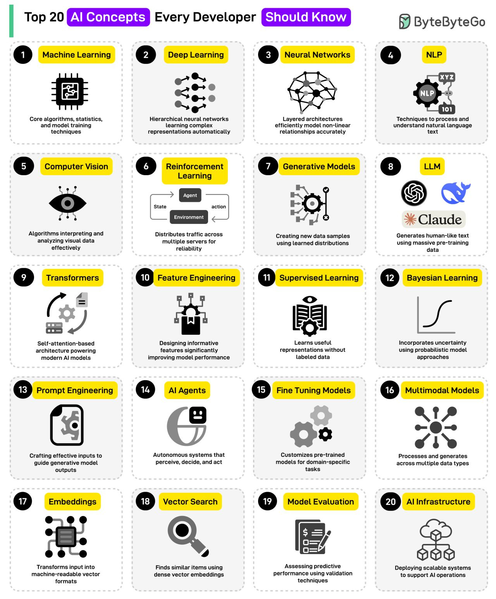

Artificial Intelligence (AI) refers to the simulation of human intelligence in machines, allowing them to perform tasks that typically require human cognitive functions such as learning, reasoning, problem-solving, perception, and decision-making.

## AI Types

### Types of AI Based on Functionalities

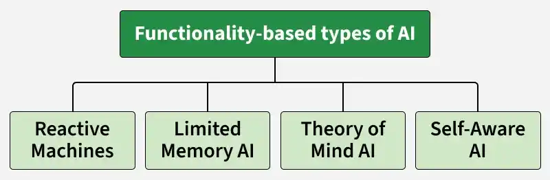

|            **Basis**             |        **Reactive AI**         |   **Limited Memory AI**    |        **Theory of Mind AI**         |                **Self-Aware AI**                |
| :------------------------------: | :----------------------------: | :------------------------: | :----------------------------------: | :---------------------------------------------: |
| Level of Intelligence  |      Basic response-based      |     Learned from data      |     Social/emotional (emerging)      |         Conscious-level (hypothetical)          |
|    Learning Ability    |          No learning           |   Learns from past data    | Limited/experimental social learning |     Self-reflective learning (theoretical)      |
|    Decision-Making     | Rule-based, immediate response | Data-driven, probabilistic | Context + emotion + intention-based  |         Fully autonomous, self-directed         |
| Interaction Complexity |    Simple, fixed responses     | Context-aware interaction  |    Human-like social interaction     | Highly advanced, human-equivalent (theoretical) |
|   Real-World Status    |          Fully exists          |     Widely used today      |            Research stage            |                Not yet achieved                 |

### Types of AI Models

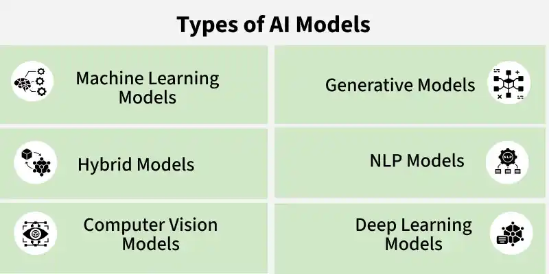

## Hierarchy

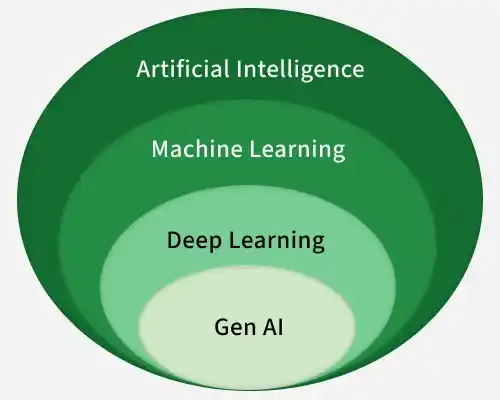

## Workflow

## Machine Learning (ML)

### Supervised Machine Learning

### Unsupervised Machine Learning

### Reinforcement Machine Learning

## Deep Learning

### Neural Networks

### Artificial Neural Networks (ANNs)

### Convolutional Neural Networks (CNNs)

### Recurrent Neural Networks (RNNs)

### Long Short-Term Memory Networks (LSTMs)

### Generative Adversarial Networks (GANs)

### Autoencoders

## Natural Language Processing (NLP)

### Phase

## Computer Vision

## Generative AI

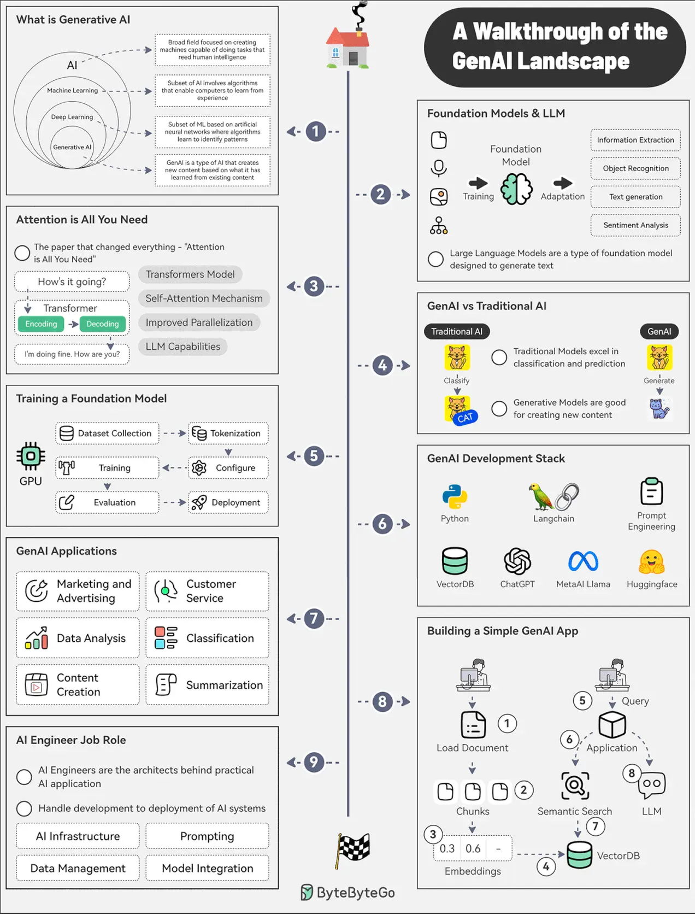

## Agentic AI

### Types of Agents

1. Simple Reflex Agents

   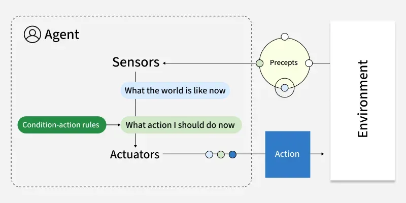Simple reflex agents act only on the current perception of the environment using predefined condition–action rules. They do not rely on past experiences or predict future outcomes and respond directly using simple “if–then” logic.

2. Model-Based Reflex Agents

   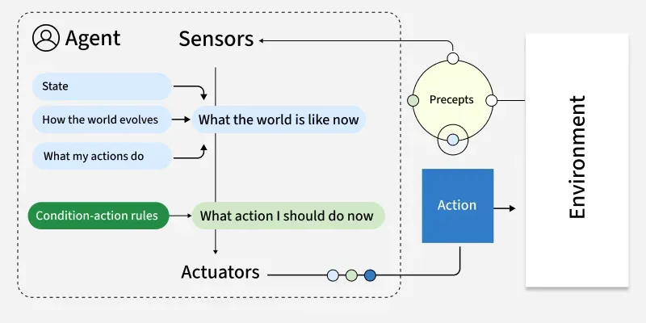

   Model-based reflex agents maintain an internal model of the environment to handle situations where full information is not directly available. This helps them make better decisions by considering changes in the environment and the impact of their actions.

3. Goal-Based Agents

   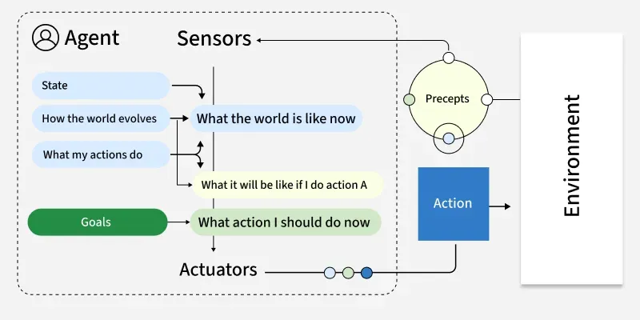

   Goal-based agents choose their actions by focusing on a specific objective and evaluating how different choices can help achieve it. Instead of reacting only to the current situation, they plan ahead and consider possible future outcomes.

4. Utility-Based Agents

   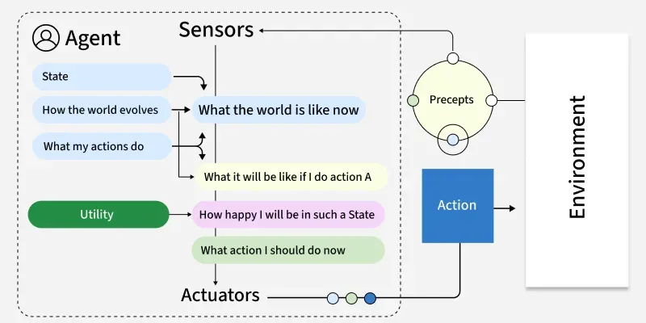

   Utility-based agents go beyond simply achieving goals by evaluating how beneficial each action is using a utility function, which measures the overall “value” or satisfaction of an outcome. This helps them choose the best option when dealing with trade-offs or uncertainty.

5. Learning Agents

   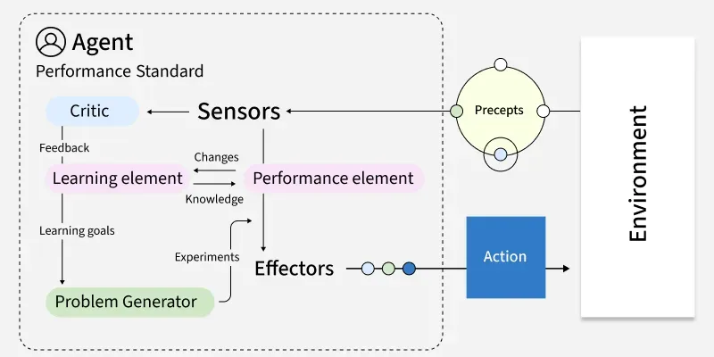

   Learning agents improve their behavior over time by using feedback from past actions. They continuously refine their internal models to make better decisions in future situations.

6. Multi-Agent Systems (MAS)

   

   Multi-agent systems consist of multiple autonomous agents that interact within a shared environment, where they may cooperate, compete, or do both depending on the situation.

7. Hierarchical Agents

   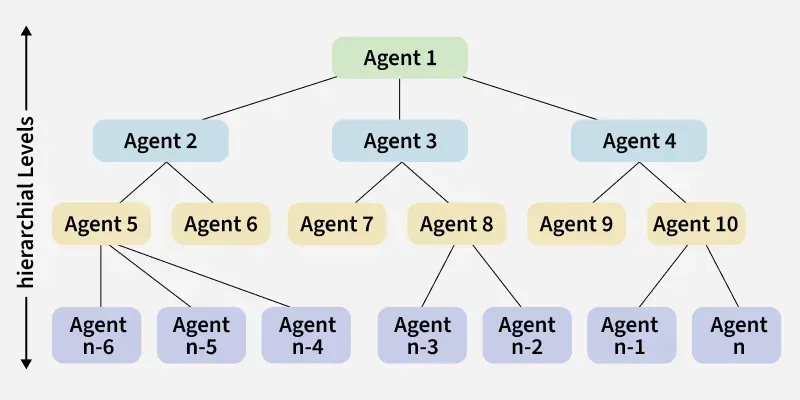

   Hierarchical agents organize decision-making in layers, where higher levels focus on planning and lower levels handle execution. This structure helps manage complex tasks by separating strategy from operational details.

## Other

### Knowledge Representation

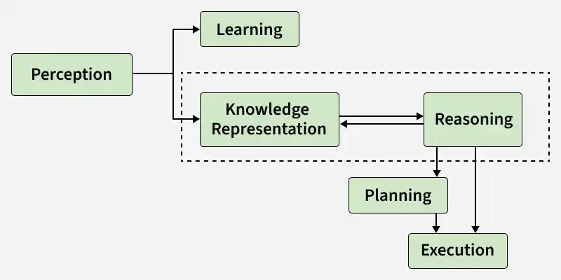

Knowledge Representation (KR) in AI focuses on how machines store and organize real-world information so they can reason, learn, and make intelligent decisions like humans.

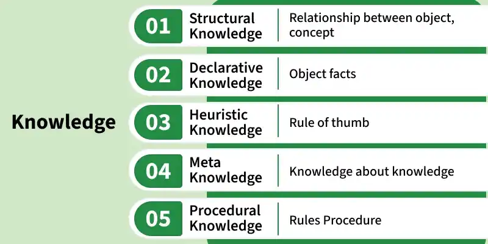

- **Declarative Knowledge:** Knowledge about facts and concepts it answers what something is . Example: Paris is the capital of France.
- **Procedural Knowledge:** Knowledge about how to perform a task or solve a problem. Example: Steps to sort numbers using an algorithm.
- **Meta knowledge:** Knowledge about other knowledge or how knowledge is used. Example: Knowing that a certain rule works better for solving math problems.
- **Heuristic Knowledge:** Experience based knowledge or rules of thumb used by experts. Example: A doctor using past experience to guess a possible disease.
- **Structural Knowledge:** Knowledge that shows relationships between concepts. Example: A car is a type of vehicle.

### Hardware

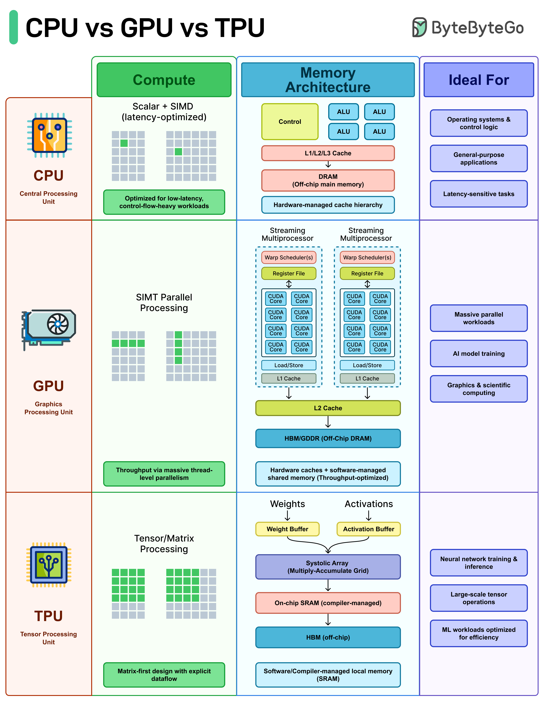

### Library/Tools

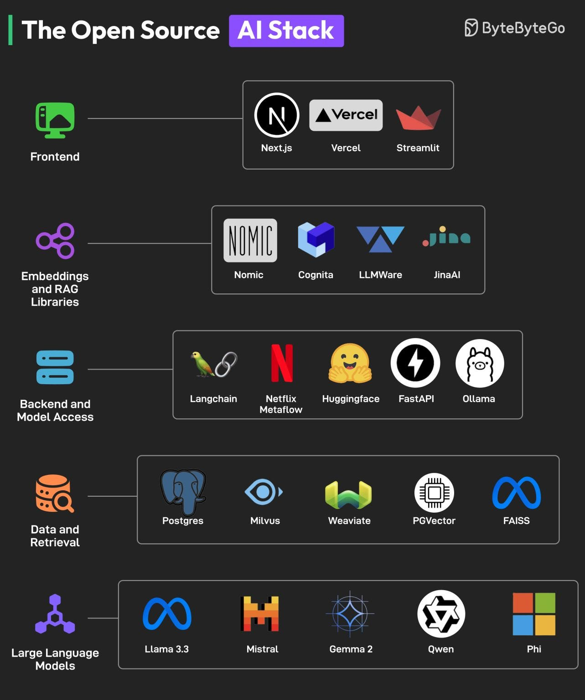

### NLP Python Library

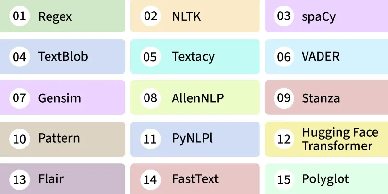

## AI Algorithms

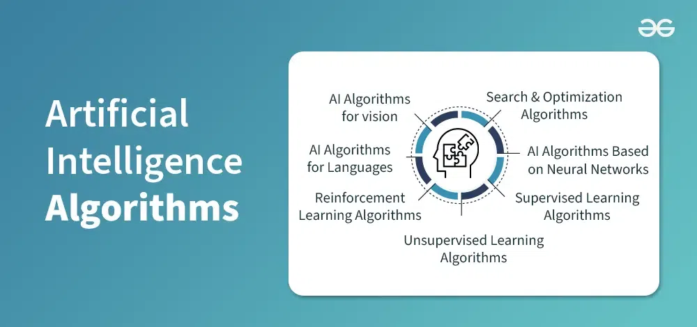

## Challenge

### Ignorable Problems

These are minor issues that have little or no effect on the AI system’s overall performance. They are often harmless and do not require immediate attention.

Examples:

- Small inaccuracies in predictions that don't affect the final result like a slight error in image classification.
- Minor issues in data preprocessing that don't change the outcome.

### Recoverable Problems

Recoverable problems are those where the AI system encounters an issue but can be fixed with intervention, either automatically or manually, such as error-handling functions.

Examples:

- Missing data that can be filled in using statistical methods.
- System crashes that can be fixed by restoring from a backup.

### Irrecoverable Problems

These are severe issues that cause permanent damage or failure, making it impossible for the system to recover. They can lead to significant performance loss.

Examples:

- Corrupted training data that causes bias and reduces the model's effectiveness.
- Adversarial attacks that make the model untrustworthy.
- Overfitting where the model becomes too specialized and cannot adapt to new data.

### Constraint Satisfaction Problems (CSP)

A *Constraint Satisfaction Problem* is a mathematical problem where the solution must meet a number of constraints. In CSP, the objective is to assign values to variables such that all the constraints are satisfied. Many AI applications use CSPs to solve decision-making problems that involve managing or arranging resources under strict guidelines.

CSPs can be classified into different types based on their constraints and problem characteristics:

1. *Binary CSPs*: In these problems, each constraint involves only two variables. Like in a scheduling problem, the constraint could specify that task A must be completed before task B.
2. *Non-Binary CSPs*: These problems have constraints that involve more than two variables. For instance, in a seating arrangement problem, a constraint could state that three people cannot sit next to each other.
3. *Hard and Soft Constraints*: Hard constraints must be strictly satisfied, while soft constraints can be violated but at a certain cost. This is often used in real-world applications where not all constraints are equally important.

In CSP it involves the interaction of variables, domains and constraints. Below is a structured representation of how CSP is formulated:

1. Finite Set of Variables $(V_1, V_2, ..., V_n)$: The problem consists of a set of variables, each of which needs to be assigned a value that satisfies the given constraints.
2. Non-Empty Domain for Each Variable ($D_1, D_2, ..., D_n$): Each variable has a domain a set of possible values that it can take.
3. Finite Set of Constraints ($C_1, C_2, ..., C_m$): Constraints restrict the possible values that variables can take. Each constraint defines a rule or relationship between variables.
4. Constraint Representation: Each constraint $C_i$ is 
5. represented as a pair of (scope, relation) where:
   - *Scope:* The set of variables involved in the constraint.
   - *Relation:* A list of valid combinations of variable values that satisfy the constraint.

## Application

### AI in Manufacturing

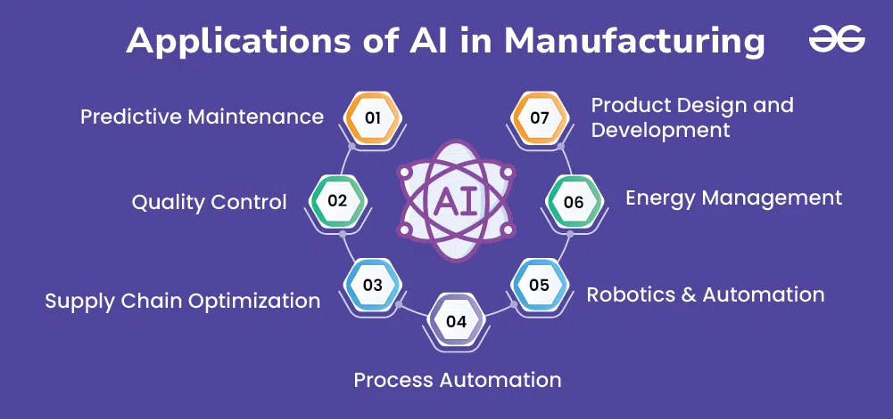

### AI in Transportation

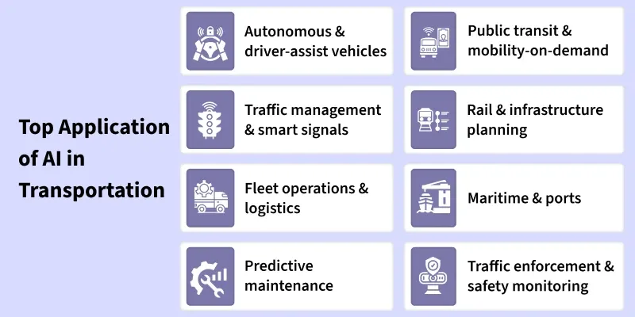

## Summary

### AI Agent vs MCP vs RAG

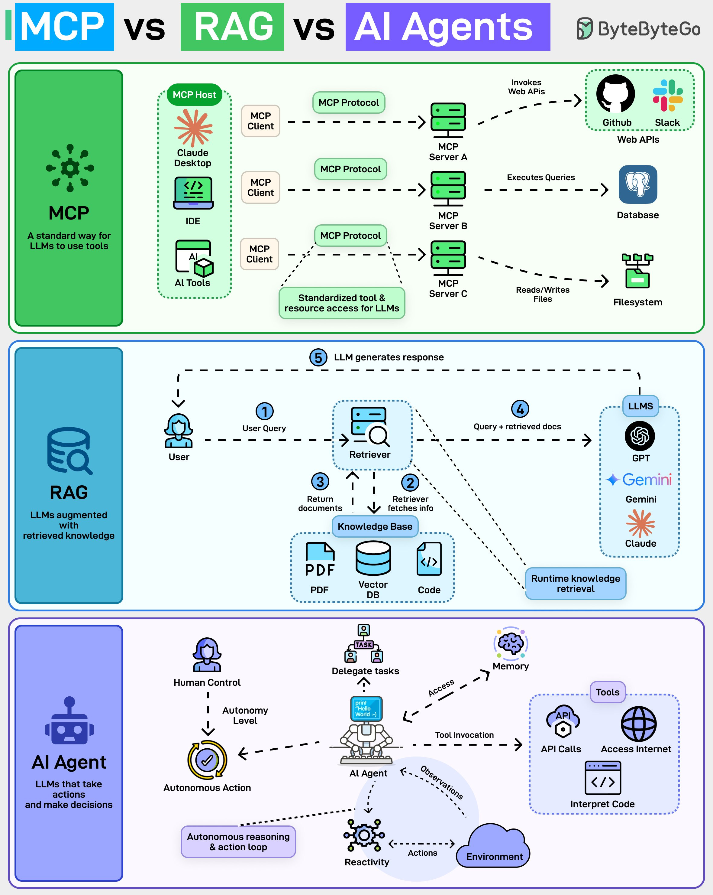

An AI agent is a software program that can interact with its environment, gather data, and use that data to achieve predetermined goals. AI agents can choose the best actions to perform to meet those goals.

Model Context Protocol (MCP) is an open standard that allows AI models (like Claude) to connect to databases, APIs, file systems, and other tools without needing custom code for each new integration.

RAG (Retrieval-Augmented Generation) is about what the model knows at runtime. The model stays frozen. No retraining. When a user asks a question, a retriever fetches relevant documents (PDFs, code, vector DBs), and those are injected into the prompt.

### Traditional AI vs Agentic AI

|      Feature       |                        Traditional AI                        |                          Agentic AI                          |
| :----------------: | :----------------------------------------------------------: | :----------------------------------------------------------: |
| **Core Function**  |            Performs specific, preprogrammed tasks            |      Executes tasks autonomously using predefined goals      |
| **Typical output** | Deterministic results—answers, classifications, predictions  |           Actions, decisions, multi-step workflows           |
|    **Autonomy**    | Low as it requires explicit instructions, operates within set boundaries | High as it plans, adapts, and makes decisions with minimal human direction |
|    **Learning**    | Learns from labeled data, often needs retraining for new situations | Learns from experience, adapts strategies and workflows in real time |
|   **Use cases**    |      Data sorting, image recognition, basic diagnostics      | Workflow automation, dynamic planning, virtual assistants, problem solving |
|  **Scalability**   |          Requires manual oversight as systems grow.          | Oversees and coordinates whole systems hence reducing manual monitoring. |
|  **Adaptability**  |  Struggles with unexpected changes and may need retraining.  | Adjusts strategies and learns in real time and is best suited for fast-changing situations. |
| **Business value** |   Automates simple, rule-based jobs, increases consistency   | Automates complex operations, reduces manual work, and enables personalized tasks |

### AI vs ML vs DL

|       **Aspect**        |                              AI                              |                              ML                              |                              DL                              |
| :---------------------: | :----------------------------------------------------------: | :----------------------------------------------------------: | :----------------------------------------------------------: |
| **Scope & Application** | Broad – includes ML, DL, expert systems, robotics, computer vision, NLP, symbolic AI, etc. | Narrower – focuses on data-driven algorithms and statistical learning. |  Narrowest – focuses specifically on deep neural networks.   |
|   **Core Techniques**   | Rule-based systems, search algorithms, expert systems, ML, DL, reinforcement learning, NLP. | Supervised learning, unsupervised learning, reinforcement learning, regression, classification, clustering. | CNNs (Convolutional Neural Networks), RNNs (Recurrent Neural Networks), LSTMs, Transformers, GANs. |
|      **Data Type**      | Can work with structured, semi-structured or unstructured data depending on the approach. | Mainly structured and labeled data (though some algorithms handle unstructured data). |  Primarily unstructured data (images, audio, text, video).   |
| **Learning Dependency** | May or may not involve learning (AI can be purely rule-based). |        Always involves learning from historical data.        | Fully dependent on large-scale learning with neural networks. |
|  **Model Complexity**   | Can range from simple decision trees to complex hybrid AI systems. | Relatively simpler – linear models, trees, SVMs, ensemble methods. | Very complex – multi-layer neural networks with millions to billions of parameters. |
|  **Computation Power**  | Low to high, depending on the AI technique (expert systems vs DL). |      Moderate – runs well on CPUs for most algorithms.       |  Very high – requires GPUs/TPUs for training large models.   |

## Reference

[1] [What is Artificial Intelligence (AI)](https://www.geeksforgeeks.org/artificial-intelligence/what-is-artificial-intelligence-ai/)

[2] [Types of AI Based on Capabilities](https://www.geeksforgeeks.org/artificial-intelligence/types-of-ai-based-on-capabilities/)

[3] [Types of AI Based on Functionalities](https://www.geeksforgeeks.org/artificial-intelligence/types-of-ai-based-on-functionalities/)

[4] [Machine Learning Tutorial](https://www.geeksforgeeks.org/machine-learning/machine-learning/)

[5] [What is a Neural Network](https://www.geeksforgeeks.org/deep-learning/neural-networks-a-beginners-guide/)

[6] [Artificial Neural Networks and its Applications](https://www.geeksforgeeks.org/deep-learning/artificial-neural-networks-and-its-applications/)

[7] [Introduction to Convolution Neural Network](https://www.geeksforgeeks.org/machine-learning/introduction-convolution-neural-network/)

[8] [Introduction to Recurrent Neural Networks](https://www.geeksforgeeks.org/machine-learning/introduction-to-recurrent-neural-network/)

[9] [Generative Adversarial Network (GAN)](https://www.geeksforgeeks.org/deep-learning/generative-adversarial-network-gan/)

[10] [Supervised Machine Learning](https://www.geeksforgeeks.org/machine-learning/supervised-machine-learning/)

[11] [What is Unsupervised Learning](https://www.geeksforgeeks.org/machine-learning/unsupervised-learning/)

[12] [Reinforcement Learning](https://www.geeksforgeeks.org/machine-learning/what-is-reinforcement-learning/)

[13] [Phases of Natural Language Processing (NLP)](https://www.geeksforgeeks.org/machine-learning/phases-of-natural-language-processing-nlp/)

[14] [What is LSTM - Long Short Term Memory?](https://www.geeksforgeeks.org/deep-learning/deep-learning-introduction-to-long-short-term-memory/)

[15] [Autoencoders in Machine Learning](https://www.geeksforgeeks.org/machine-learning/auto-encoders/)

[16] [EP129: The Ultimate Walkthrough of the Generative AI Landscape](https://blog.bytebytego.com/p/ep129-the-ultimate-walkthrough-of)

[17] [EP167: Top 20 AI Concepts You Should Know](https://blog.bytebytego.com/p/ep167-top-20-ai-concepts-you-should)

[18] [The Open Source AI Stack](https://blog.bytebytego.com/i/155048027/the-open-source-ai-stack)

[19] [AI Agent versus MCP](https://blog.bytebytego.com/i/164838806/ai-agent-versus-mcp)

[20] [How does AI work?](https://www.geeksforgeeks.org/artificial-intelligence/how-does-ai-work/)

[21] [Artificial Intelligence (AI) Algorithms](https://www.geeksforgeeks.org/artificial-intelligence/ai-algorithms/)

[22] [Agentic AI vs. Traditional AI](https://www.geeksforgeeks.org/artificial-intelligence/agentic-ai-vs-traditional-ai/)

[23] [What is Agentic AI](https://www.geeksforgeeks.org/artificial-intelligence/what-is-agentic-ai/)

[24] [Types of AI Based on Functionalities](https://www.geeksforgeeks.org/artificial-intelligence/types-of-ai-based-on-functionalities/)

[25] [Artificial intelligence vs Machine Learning vs Deep Learning](https://www.geeksforgeeks.org/artificial-intelligence/artificial-intelligence-vs-machine-learning-vs-deep-learning/)

[26] [Problem Solving in Artificial Intelligence](https://www.geeksforgeeks.org/artificial-intelligence/problem-solving-in-artificial-intelligence/)

[27] [AI in Manufacturing : Revolutionizing the Industry](https://www.geeksforgeeks.org/artificial-intelligence/ai-in-manufacturing-revolutionizing-the-industry/)

[28] [AI in Transportation](https://www.geeksforgeeks.org/artificial-intelligence/ai-in-transportation/)

[29] [Agents in AI](https://www.geeksforgeeks.org/artificial-intelligence/agents-artificial-intelligence/)