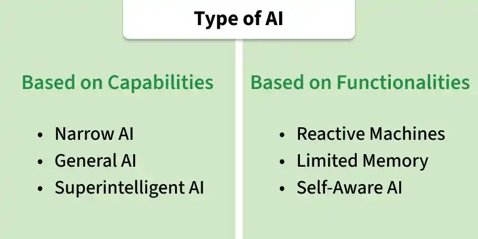
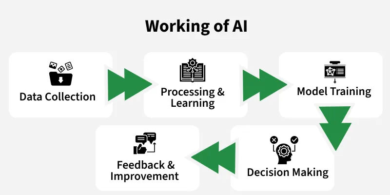
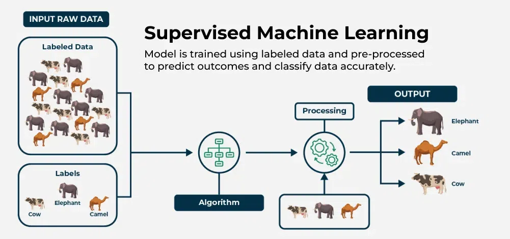
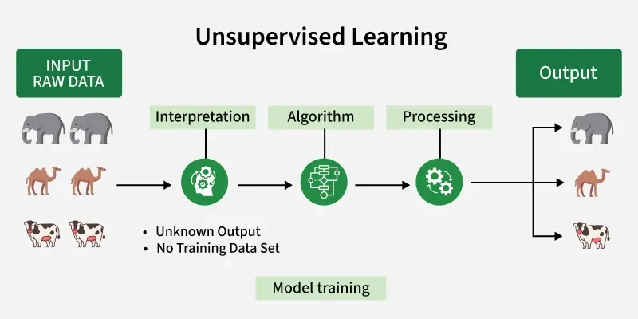
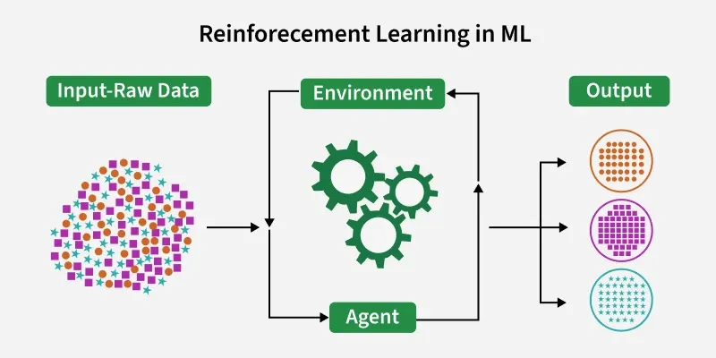
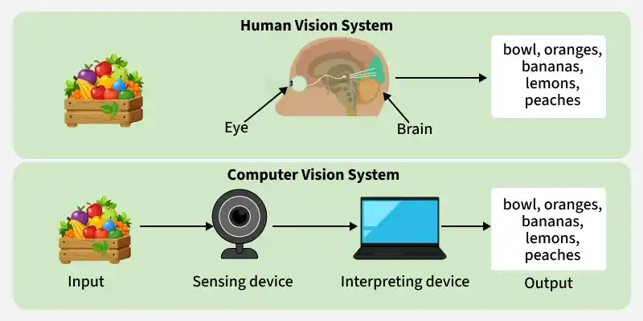

# AI Summary

[TOC]

## Types

## Workflow

## Machine Learning (ML)

### Supervised Machine Learning

### Unsupervised Machine Learning

### Reinforcement Machine Learning

## Deep Learning

### Neural Networks

### Artificial Neural Networks (ANNs)

### Convolutional Neural Networks (CNNs)

### Recurrent Neural Networks (RNNs)

### Long Short-Term Memory Networks (LSTMs)

### Generative Adversarial Networks (GANs)

### Autoencoders

## Natural Language Processing (NLP)

### Phase

## Computer Vision

## Generative AI

TODO

## Agentic AI

TODO

## Reference

[1] [What is Artificial Intelligence (AI)](https://www.geeksforgeeks.org/artificial-intelligence/what-is-artificial-intelligence-ai/)

[2] [Types of AI Based on Capabilities](https://www.geeksforgeeks.org/artificial-intelligence/types-of-ai-based-on-capabilities/)

[3] [Types of AI Based on Functionalities](https://www.geeksforgeeks.org/artificial-intelligence/types-of-ai-based-on-functionalities/)

[4] [Machine Learning Tutorial](https://www.geeksforgeeks.org/machine-learning/machine-learning/)

[5] [What is a Neural Network](https://www.geeksforgeeks.org/deep-learning/neural-networks-a-beginners-guide/)

[6] [Artificial Neural Networks and its Applications](https://www.geeksforgeeks.org/deep-learning/artificial-neural-networks-and-its-applications/)

[7] [Introduction to Convolution Neural Network](https://www.geeksforgeeks.org/machine-learning/introduction-convolution-neural-network/)

[8] [Introduction to Recurrent Neural Networks](https://www.geeksforgeeks.org/machine-learning/introduction-to-recurrent-neural-network/)

[9] [Generative Adversarial Network (GAN)](https://www.geeksforgeeks.org/deep-learning/generative-adversarial-network-gan/)

[10] [Supervised Machine Learning](https://www.geeksforgeeks.org/machine-learning/supervised-machine-learning/)

[11] [What is Unsupervised Learning](https://www.geeksforgeeks.org/machine-learning/unsupervised-learning/)

[12] [Reinforcement Learning](https://www.geeksforgeeks.org/machine-learning/what-is-reinforcement-learning/)

[13] [Phases of Natural Language Processing (NLP)](https://www.geeksforgeeks.org/machine-learning/phases-of-natural-language-processing-nlp/)

[14] [What is LSTM - Long Short Term Memory?](https://www.geeksforgeeks.org/deep-learning/deep-learning-introduction-to-long-short-term-memory/)

[15] [Autoencoders in Machine Learning](https://www.geeksforgeeks.org/machine-learning/auto-encoders/)