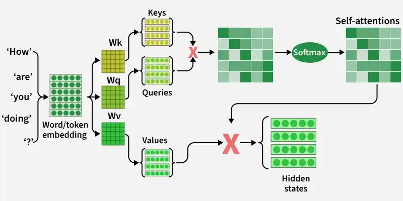
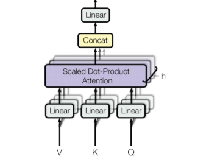
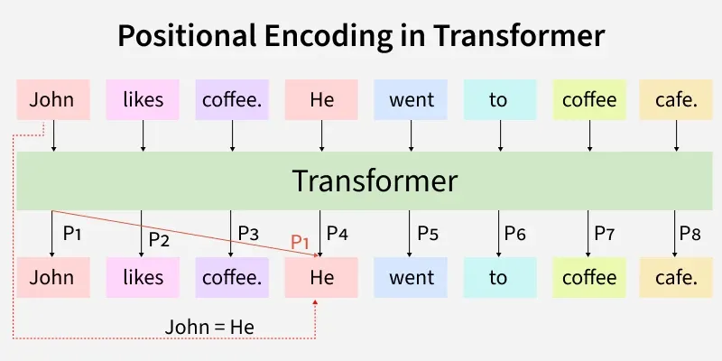

# Transformer

[TOC]

A transformer is a neural network architecture used for various machine learning tasks, especially in natural language processing and computer vision. It focuses on understanding relationships within data to process information more effectively.

## Intro

Transformer architecture uses attention to process an entire sentence at once instead of reading words sequentially. This helps overcome limitations of models like RNNs and LSTMs that process data step by step.

## Architecture

The encoder and decoder work together to transform the input into the desired output, such as translating a sentence from one language to another or generating a response to a query.

### Encoder

The primary function of the encoder is to create a high-dimensional representation of the input sequence that the decoder can use to generate the output. The encoder consists of multiple layers, and each layer is composed of two main sub-layers:

1. [Self-Attention Mechanism](#Self-Attention Mechanism): This sub-layer allows the encoder to weigh the importance of different parts of the input sequence differently to capture dependencies regardless of their distance within the sequence.
2. [Feed-Forward Neural Network](#Position-wise Feed-Forward Networks): This sub-layer consists of two linear transformations with a ReLU activation in between. It processes the output of the self-attention mechanism to generate a refined representation.

### Decoder

The decoder in the transformer also consists of multiple identical layers. Its primary function is to generate the output sequence based on the representations provided by the encoder and the previously generated tokens of the output.

Each decoder layer consists of three main sub-layers:

1. Masked Self-Attention Mechanism: Similar to the encoder's self-attention mechanism, but its main purpose is to prevent attending to future tokens to maintain the autoregressive property (no cheating during generation).
2. Encoder-Decoder Attention Mechanism: This sub-layer allows the decoder to focus on relevant parts of the encoder's output representation. This allows the decoder to focus on relevant parts of the input, essential for tasks like translation.
3. Feed-Forward Neural Network: This sub-layer processes the combined output of the masked self-attention and encoder-decoder attention mechanisms.

### Position-wise Feed-Forward Networks

The Feed-Forward Networks consist of two linear transformations with a ReLU activation. It is applied independently to each position in the sequence. This transformation helps refine the encoded representation at each position.

Mathematically: $FFN(x) = ReLU(xW_1 + b_1)W_2 + b_2$

This helps the transformer learn complex representations of input features.

### Layer Normalization and Residual Connections

Layer Normalization stabilizes training by normalizing inputs.

Residual Connections help avoid vanishing gradients by adding the original input to the output of the sub-layer by establishing skip connections from inputs to outputs:
$$
\text{Output} = \text{LayerNorm}(x + \text{SubLayer}(x))
$$
This addition helps in preserving the original input information which is crucial for learning complex representations.

## Attention Mechanism

### Self-Attention Mechanism

The self-attention mechanism allows transformers to determine which words in a sentence are most relevant to each other. This is done using a scaled dot-product attention approach.

Each word in a sequence is mapped to three vectors:

  - $Query (Q)$
  - $Key(K)$
  - $Value(V)$

Attention scores are computed as: $\text{Attention}(Q, K, V) = \text{softmax}(\frac{QK^T}{\sqrt{d_k}})V$.

### Multi-Head Self-Attention Mechanism

Multi-head attention extends the self-attention mechanism by applying it multiple times in parallel, with each "head" learning different aspects of the input data. This allows the model to capture a richer set of relationships within the input sequence. The outputs of these heads are then concatenated and linearly transformed to produce the final output.

Given an input sequence $X$ the self-attention mechanism computes three matrices: queries $Q$, keys $K$ and values $V$ and values $V$ by multiplying $X$ with learned weight matrices $W_Q$, $W_K$ and $W_V$.
$$
Q = XW_Q , \quad K = X W_K, \quad V = XW_V
$$
The attention scores are computed as:
$$
\text{Attention}(Q, K, V) = \text{softmax}\left(\frac{QK^T}{\sqrt{d_k}}\right)
$$
For *multi-head attention*, we apply self-attention multiple times:
$$
\text{MultiHead}(Q, K, V) = \text{Concat}(\text{head}_1, \ldots, \text{head}_h) W_O
$$
where each head is computed as:
$$
\text{head}_i = \text{Attention}(QW_Q^i, KW_K^i, VW_V^i)
$$
where:

- $W_{Q_i}$, $W_{K_i}$, $W_{V_i}$ are learned projection matrices for the i-th head.

### Cross-Attention Mechanism

The cross-attention mechanism is a key part of the Transformer model. It allows the decoder to access and use relevant information from the encoder. This helps the model focus on important details, ensuring tasks like translation are accurate.

The formula for *Cross-attention* is very similar to *self-attention*, except the query (Q) comes from the decoder's output and the key (K), value (V) come from the encoder's output.
$$
\text{Attention}(Q, K, V) = \text{softmax}\left(\frac{QK^T}{\sqrt{d_k}}\right)
$$
Here, $d_k$ is the dimensionality of the keys.

Cross-Attention takes about $O(n^2 \cdot d)$ time.

- $n$ is how long the input sequence is (like the number of words in a sentence).
- $d$ is how big the vectors are (like the size of each word's embedding).

The $n^2$ part comes from comparing each word with every other word, which makes a big $n \times n$ matrix.

Cross-Attention needs about $O(n^2)$ space. This is because it has to store the attention matrix, which is $n \times n$.

## Positional Encoding

Positional encoding is a technique that adds information about the position of each token in the sequence to the input embeddings. This helps transformers to understand the relative or absolute position of tokens which is important for differentiating between words in different positions and capturing the structure of a sentence.

### Sinusoidal Positional Encoding Formula

The most common method for calculating positional encodings is based on sinusoidal functions. The intuition behind using sine and cosine functions is that they provide a smooth, periodic encoding of positions that allows for easy interpolation and generalization across sequences of varying lengths.

For each position ($pos$) in the sequence and each dimension i*i* in the positional encoding vector, the following formula is used:
$$
\text{Even-indexed dimensions:} PE_{pos, 2i} = sin(\frac{pos}{10000^{\frac{2i}{d_{model}}}}) \\
\text{Odd-indexed dimensions:} PE_{pos, 2i + 1} = cos(\frac{pos}{10000^{\frac{2i}{d_{model}}}})
$$
where:

- $PE_{pos, 2i}$: The positional encoding at position $pos$ for the $2i^{th}$ dimension.
- $pos$: The position of the token in the sequence (starting from 0).
- $i$: The index of the dimension within the positional encoding vector (for each $i$, we have two formulas: one for $2i$ (sine) and another for $2i + 1$ (consine).
- $d_{model}$: The dimensionality of the model (the embedding size e.g 512, 1024, etc).
- The exponential term $10000^{\frac{2i}{d_{model}}}$: This controls how the sine wave's frequency changes with the dimension.

## Summary

### Cross-Attention vs Self-Attention

|   **Aspect**   |                     **Cross-attention**                      |                      **Self-attention**                      |
| :------------: | :----------------------------------------------------------: | :----------------------------------------------------------: |
| **Definition** |   Allows the decoder to use information from the encoder.    | Allows each word in a sequence to focus on other words in the same sequence. |
|    **Uses**    | Used in tasks like translation, where the model must look at the entire input (encoder) while generating output. | Used to understand relationships within a single input (e.g. text) without external context. |
|   **Focus**    | Focuses on picking useful information from another part of the model. | Focuses on how words in the same sentence relate to each other. |
| **Data Flow**  | Involves interaction between two different data parts (encoder and decoder). |  Data flows within the same sequence (internal attention).   |
|  **Example**   | In translation, cross-attention helps the decoder choose the right words from the encoder. | In text analysis, self-attention helps the model understand how words in the sentence connect. |

## Reference

[1] Ashish Vaswani; Llion Jones; Noam Shazeer; Aidan N. Gomez; Niki Parmar; Jakob Uszkoreit; Łukasz Kaiser; Illia Polosukhin . Attention Is All You Need . 2017

[2] [Transformers in Machine Learning](https://www.geeksforgeeks.org/machine-learning/getting-started-with-transformers/)

[3] [Cross-Attention Mechanism in Transformers](https://www.geeksforgeeks.org/nlp/cross-attention-mechanism-in-transformers/)

[4] [Self - Attention in NLP](https://www.geeksforgeeks.org/nlp/self-attention-in-nlp/)

[5] [Positional Encoding in Transformers](https://www.geeksforgeeks.org/nlp/positional-encoding-in-transformers/)