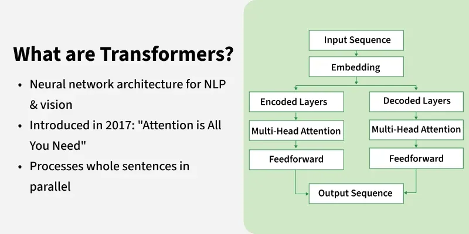
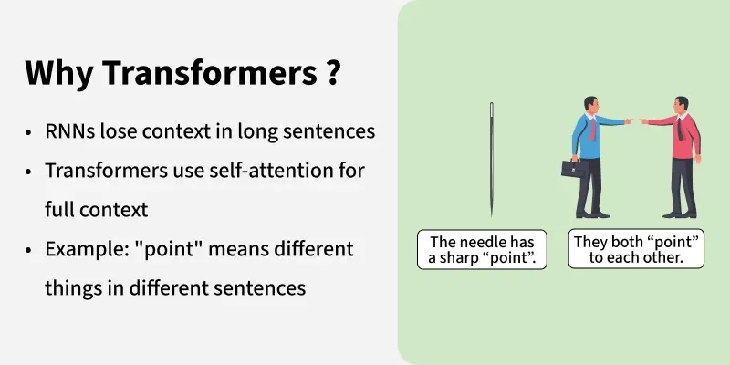
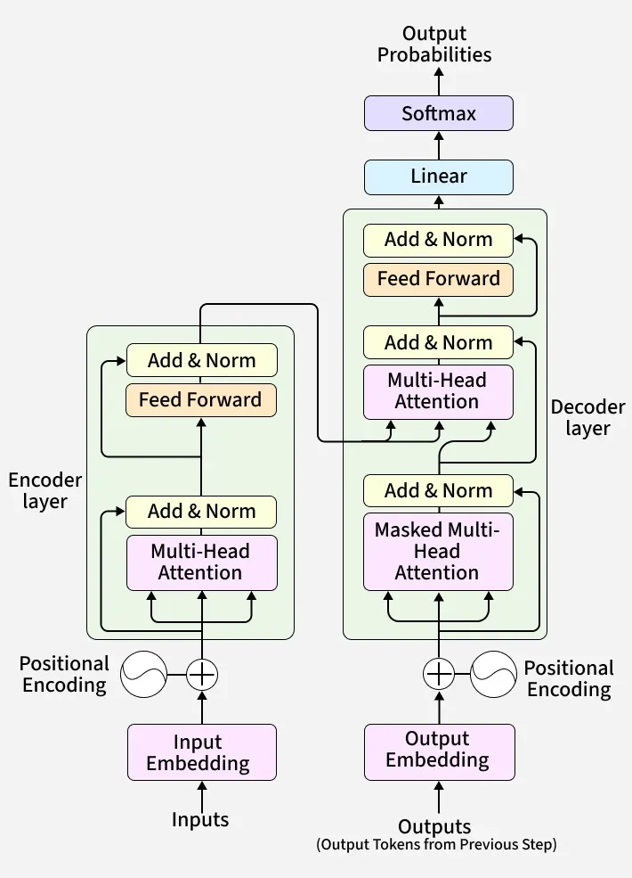

# Transformer

[TOC]

A transformer is a neural network architecture used for various machine learning tasks, especially in natural language processing and computer vision. It focuses on understanding relationships within data to process information more effectively.

## Intro

Transformer architecture uses attention to process an entire sentence at once instead of reading words sequentially. This helps overcome limitations of models like RNNs and LSTMs that process data step by step.

### Core Concepts

1. Self-Attention mechanism

   The self attention mechanism allows transformers to determine which words in a sentence are most relevant to each other. This is done using a scaled dot-product attention approach.

     Each word in a sequence is mapped to three vectors:

     - $Query (Q)$
     - $Key(K)$
     - $Value(V)$

     Attention scores are computed as: $Attention(Q, K, V) = fotmax(\frac{QK^T}{\sqrt{d_k}})V$.

2. Multi-Head Attention

   Instead of one attention mechanism, transformers use multiple attention heads running in parallel. Each head captures different relationships or patterns in the data, enriching the model’s understanding.

3. Positional Encoding

   Unlike RNNs, transformers lack an inherent understanding of word order since they process data in parallel. To solve this problem Positional Encodings are added to token embeddings providing information about the position of each token within a sequence.

4. Position-wise Feed-Forward networks

   The Feed-Forward Networks consist of two linear transformations with a ReLU activation. It is applied independently to each position in the sequence.This transformation helps refine the encoded representation at each position.

   Mathematically: $FFN(x) = ReLU(xW_1 + b_1)W_2 + b_2$

5. Add & Norm (Residual Connections and Layer Normalization)

   Each sub-layer in the transformer (such as self-attention and feed-forward networks) is followed by an Add & Norm step.

     - Residual Connection (Add): The input of a layer is added to its output. This helps in preserving information and prevents vanishing gradients in deep networks.
     - Layer Normalization (Norm): The combined output is normalized to stabilize training and improve convergence.

6. Embeddings

   Transformers cannot work with raw words as they need numbers. So, each input token (word or subword) is converted into a vector, called an embedding.

7. Encoder-Decoder Architecture

   The encoder-decoder structure is key to transformer models. The encoder processes the input sequence into a vector, while the decoder converts this vector back into a sequence. Each encoder and decoder layer includes self-attention and feed-forward layers.

   Transformers apply attention in three different places:

   - Encoder Self-Attention
     - Q, K, V all come from the encoder’s previous layer.
     - Every word can attend to every other word in the input.
     - This helps the encoder understand full context (long-range meaning).
   - Decoder Self-Attention (Masked)
     - Q, K, V all come from the decoder’s previous layer.
     - Future tokens are masked (blocked), so each position only sees previous tokens.
     - This keeps decoding auto-regressive i.e the model predicts one word at a time.
   - Encoder–Decoder Attention
     - Queries come from the decoder.
     - Keys and Values come from the encoder output.
     - This lets the decoder look at important parts of the input sentence while generating output.

8. Softmax Layer for Output Prediction

   After the decoder processes the sequence, it must predict the next token.

     - The decoder output is passed through a linear layer (whose weights are shared with embeddings).
     - Then the softmax function converts these scores into probabilities.
     - The token with the highest probability becomes the predicted next word.

## Reference

[1] Ashish Vaswani; Llion Jones; Noam Shazeer; Aidan N. Gomez; Niki Parmar; Jakob Uszkoreit; Łukasz Kaiser; Illia Polosukhin . Attention Is All You Need . 2017

[2] [Transformers in Machine Learning](https://www.geeksforgeeks.org/machine-learning/getting-started-with-transformers/)