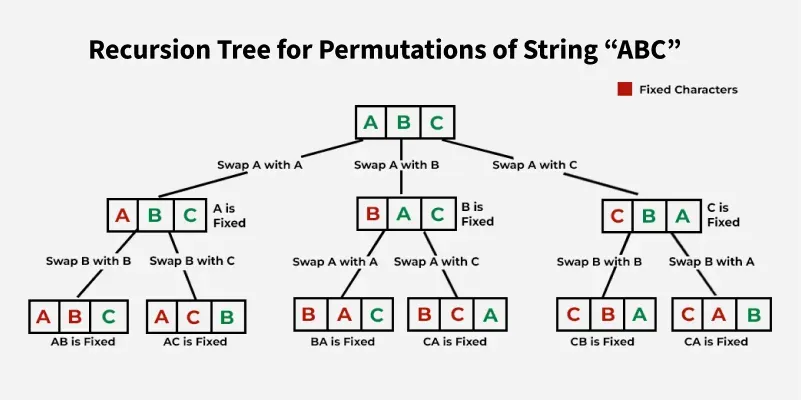

# Backtracking Problem

[TOC]


#### Generates all permutations of a string using recursion and backtracking.

```c++
void permutation_backtracking(std::vector<std::string>& arr, std::string& str, int idx)
{
    if (idx == str.size())
    {
        arr.push_back(str);
        return;
    }
    for (int i = idx; i < str.size(); ++i)
    {
        // swap
        char tmp = str[idx];
        str[idx] = str[i];
        str[i] = tmp;
        // backtracking
        permutation_backtracking(arr, str, idx + 1);
        // swap last time
        tmp = str[idx];
        str[idx] = str[i];
        str[i] = tmp;
    }
}
```

- Time Complexity: $O(n * n!)$
- Space Complexity: $O(n!)$

