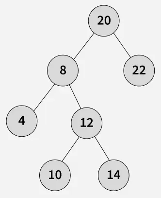
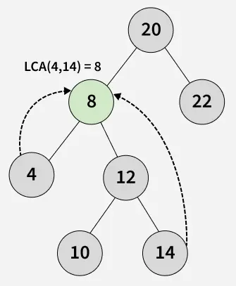

# Binary Tree Problem

[TOC]


### Checks if a binary tree is balanced using a recursive approach.

```c++
struct tree_node 
{
    int val;
    tree_node* left;
    tree_node* right;
    tree_node(int v) : val(v), left(nullptr), right(nullptr) {}
};

// Returns the height of the subtree, or -1 if it is unbalanced.
int check_height(tree_node* node) 
{
    if (!node) 
        return 0;

    int left_height = check_height(node->left);
    if (left_height == -1) 
        return -1;

    int right_height = check_height(node->right);
    if (right_height == -1) 
        return -1;

    if (std::abs(left_height - right_height) > 1) 
        return -1;

    return 1 + std::max(left_height, right_height);
}

bool is_balanced(tree_node* root) 
{
    return check_height(root) != -1;
}
```

Complexity Analysis:

- Time Complexity: $O(n)$.
- Space Complexity: $O(h)$. (where `h` is the tree height.)


### Find the lowest common ancestor in a binary search tree.





```c++
struct node
{
    int val;
    node* left;
    node* right;
    node(int x) : val(x), left(nullptr), right(nullptr) {}
};

node* find_lca(node* root, node* p, node* q)
{
    while(root)
    {
        if (p->val < root->val && q->val < root->val)
            root = root->left;
        else if(p->val > root->val && q->val > root->val)
            root = root->right;
        else
            return root;
    }
    return nullptr;
}
```

Complexity Analysis:

- Time Complexity:

  The time complexity of the function in a binary search tree is $O(h)$, where $h$ is the height of the tree.

  - Best Case(balanced BST): $O(\log n)$, where $n$ is the number of nodes.
  - Worst Case(skewed BST): $O(n)$, where $n$ is the number of nodes.

- Space Complexity: $O(1)$.


### Check if a binary tree is a valid binary search tree using in-order traversal.

```c++
struct node 
{
    int val;
    node* left;
    node* right;
    node(int x) : val(x), left(nullptr), right(nullptr) {}
};

bool bst_inorder(node* root, node*& prev) 
{
    if (!root) 
        return true;

    if (!bst_inorder(root->left, prev)) 
        return false;

    if (prev && root->val <= prev->val) 
        return false;

    prev = root;
    return bst_inorder(root->right, prev);
}
```

Complexity Analysis:

- Time Complexity: $O(n)$, where $n$ is the number of nodes in the tree.

- Space Complexity: $O(h)$, where $h$ is the height of the tree, due to the recursion stack.


### Level-Order traversal of a binary tree. Process each level layer by layer, storing nodes in a list. Classic for breadth-first search.

```c++
struct node 
{
    int val;
    node* left;
    node* right;
    node(int x) : val(x), left(nullptr), right(nullptr) {}
};

std::list<int> bfs_lvl_order(node* root) 
{
    std::list<int> ret;
    if (!root)
        return ret;

    std::queue<node*> q;
    q.push(root);
    while (!q.empty())
    {
        for (int i = 0; i < q.size(); ++i)
        {
            node* curr_node = q.front();
            q.pop();
            
            ret.push_back(curr_node->val);
            if (curr_node->left)
                q.push(curr_node->left);
            if (curr_node->right)
                q.push(curr_node->right);
        }
    }

    return ret;
}
```

Complexity Analysis:

| Scenario     | Time Complexity | Space Complexity |
| :----------- | :-------------- | :--------------- |
| Best Case    | O(n)            | O(n)             |
| Average Case | O(n)            | O(n)             |
| Worst Case   | O(n)            | O(n)             |
