# AVL Tree

[TOC]


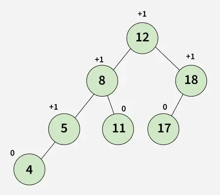

An AVL tree is defined as a self-balancing Binary Search Tree (BST) where the difference between the heights of the left and right subtrees for any node cannot be more than one.

## Properties

- The heights of the left and right subtrees of every node differ by at most one.
- Every subtree is an AVL tree.
- For every node, its balance factor (height of left subtree - height of right subtree) is -1, 0, or 1.


## Nodes

Implement:

```c++
template <typename T> 
struct Node 
{
    T key; // The value of the node
    Node* left; // Pointer to the left child
    Node* right; // Pointer to the right child
    int height; // Height of the node in the tree

    // Constructor to initialize a node with a given key
    Node(T k) : key(k), left(nullptr), right(nullptr), height(1) {}
};
```


## Rotation

### Right Rotation (RR)

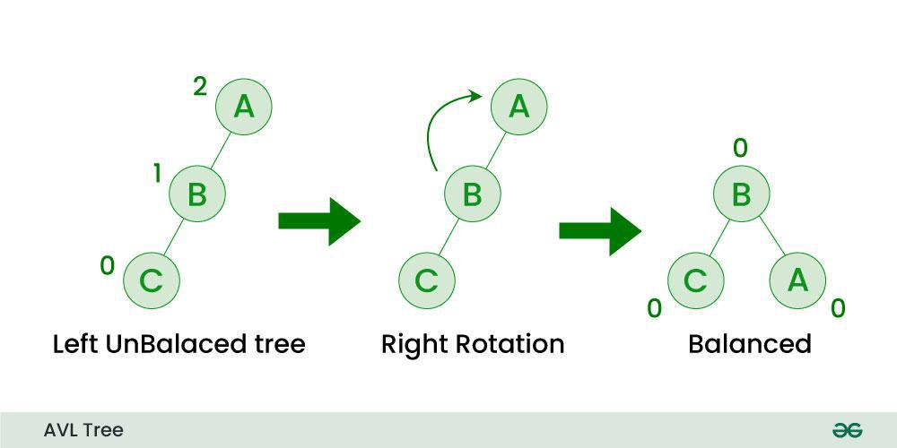

The Right Rotation (RR) is applied in an AVL tree when a node becomes unbalanced due to an insertion into the right subtree of its right child, leading to a Left Imbalance. To correct this imbalance, the unbalanced node is rotated 90° to the right (clockwise) along the top edge connected to its parent.

### Left Rotation (LL)

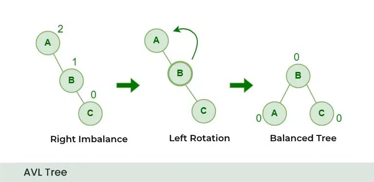

The Left Rotation (LL) is used to balance a node that becomes unbalanced due to an insertion into the left subtree of its left child, also resulting in a Left Imbalance. The solution is to rotate the unbalanced node 90° to the left (anti-clockwise) along the top edge connected to its parent.

### Left Right Rotation (LR)

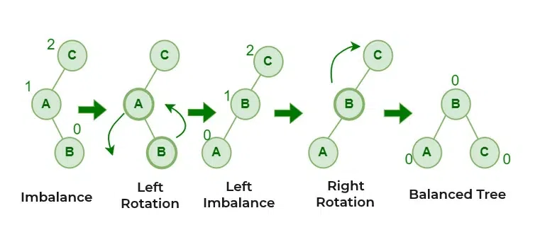

The Left-Right Rotation (LR) is necessary when the left child of a node is right-heavy, creating a double imbalance. This situation is resolved by performing a left rotation on the left child, followed by a right rotation on the original node.

### Right-Left Rotation (RL)

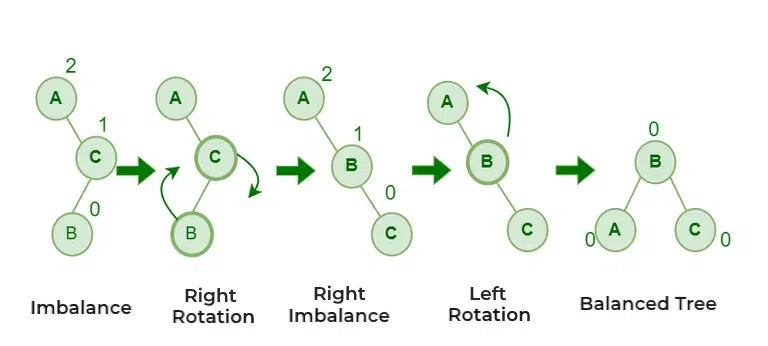

The Right-Left Rotation (RL) is used when the right child of a node is left-heavy. This imbalance is corrected by performing a right rotation on the right child, followed by a left rotation on the original node.

### Rotation Implement

```c++
// function to perform a right rotation on a subtree
Node<T>* right_rotate(Node<T>* y)
{
    Node<T>* x = y->left;
    Node<T>* T2 = x->right;

    // Perform rotation
    x->right = y;
    y->left = T2;

    // Update heights
    y->height = std::max(height(y->left), height(y->right)) + 1;
    x->height = std::max(height(x->left), height(x->right)) + 1;

    // Return new root
    return x;
}

// function to perform a left rotation on a subtree
Node<T>* left_rotate(Node<T>* x)
{
    Node<T>* y = x->right;
    Node<T>* T2 = y->left;

    y->left = x;
    x->right = T2;

    // Update heights
    x->height = std::max(height(x->left), height(x->right)) + 1;
    y->height = std::max(height(y->left), height(y->right)) + 1;

    // Return new root
    return y;
}
```


## Insertion

Algorithm:

1. Start at the root.
2. Compare the new value with the current node.
3. If less, move to the left child. If greater, move to the right child.
4. Repeat until reaching a null position.
5. Insert the new node at this position.
6. Update the height of the current node.
7. Calculate the balance factor of the current node.
8. If the balance factor is >1 or <-1, perform necessary rotations:
   - Left-Left case: Right rotation
   - Left-Right case: Left rotation on the left child, then right rotation.
   - Right-Right case: Left rotation
   - Right-Left case: Right rotation on the right child, then left rotation.
9. Repeat steps 6-8 while moving back up to the root.

Example:

1. Insert 15

   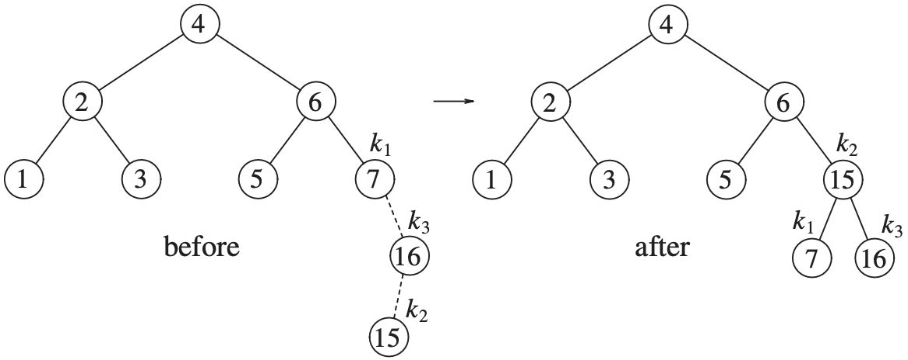

2. Insert 14

   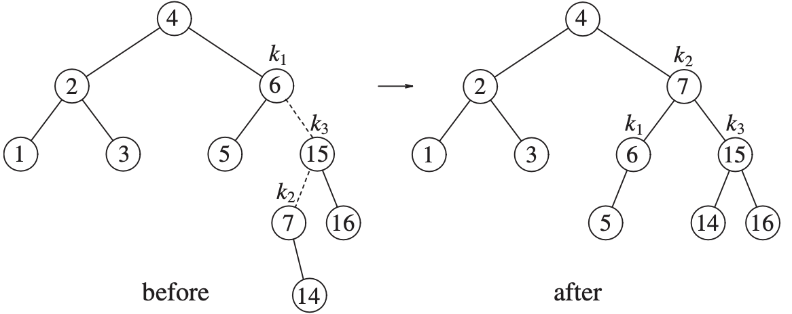

3. Insert 13

   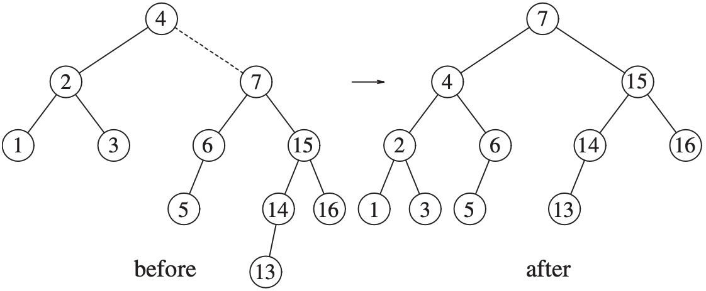

4. Insert 12

   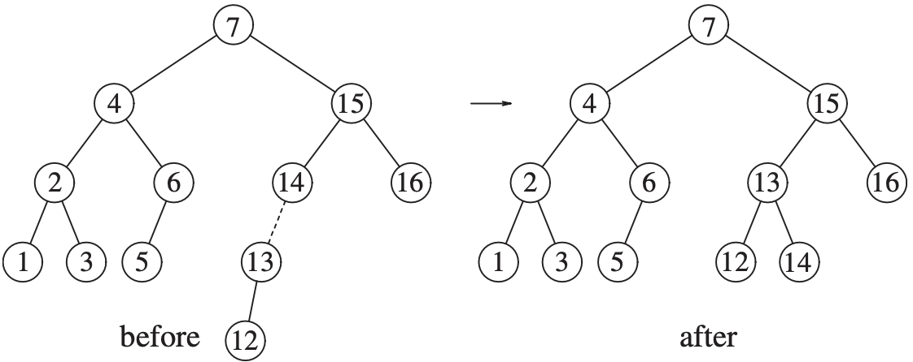

5. Insert 11，10，8

   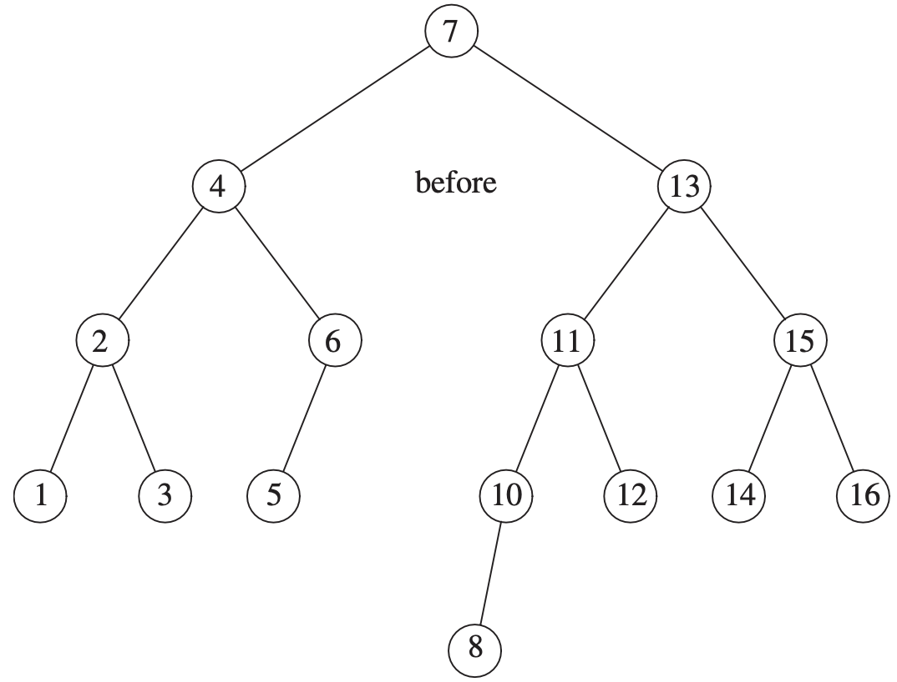

6. Insert 9

   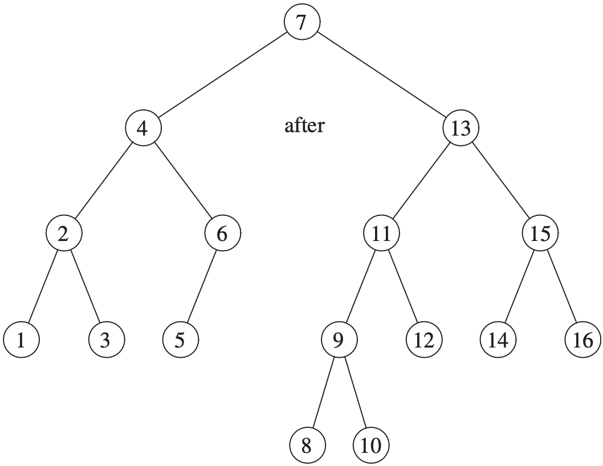

Implement:

```c++
Node<T>* insert(Node<T>* node, T key)
{
    // Perform the normal BST insertion
    if (node == nullptr)
        return new Node<T>(key);

    if (key < node->key)
        node->left = insert(node->left, key);
    else if (key > node->key)
        node->right = insert(node->right, key);
    else
        return node;

    // Update height of this ancestor node
    node->height = 1 + std::max(
        height(node->left), height(node->right));

    // Get the balance factor of this ancestor node
    int balance = balance_factor(node);

    // If this node becomes unbalanced, then there are 4
    // cases

    // Left heavy
    if (balance > 1) 
    {
        if (balance_factor(node->left) >= 0) 
        {
            return right_rotate(node);          // LL
        } 
        else 
        {
            node->left = left_rotate(node->left); // LR
            return right_rotate(node);
        }
    }

    // Right heavy
    if (balance < -1) 
    {
        if (balance_factor(node->right) <= 0) 
        {
            return left_rotate(node);           // RR
        } 
        else 
        {
            node->right = right_rotate(node->right); // RL
            return left_rotate(node);
        }
    }

    return node;
}
```

Complexity:

| Scenario     | Time Complexity | Space Complexity |
| :----------- | :-------------- | :--------------- |
| Best Case    | $O(\log n)$     | $O(\log n)$     |
| Average Case | $O(\log n)$     | $O(\log n)$     |
| Worst Case   | $O(\log n)$     | $O(\log n)$     |


## Deletion

Algorithm:

1. Start at the root.
2. Search for the node to delete.
3. If the node is a leaf, simply remove it.
4. If the node has one child, replace it with its child.
5. If the node has two children:
   - Find the in-order successor (minimum value in the right subtree).
   - Replace the node to be deleted with the in-order successor.
   - Delete the in-order successor from its original position.
6. Update the height of the current node.
7. Calculate the balance factor of the current node.
8. If the balance factor is >1 or <-1, perform necessary rotations:
   - Left-Left case: Right rotation
   - Left-Right case: Left rotation on the left child, then right rotation
   - Right-Right case: Left rotation
   - Right-Left case: Right rotation on the right child, then left rotation
9. Repeat steps 6-8 while moving back up to the root.

Example:

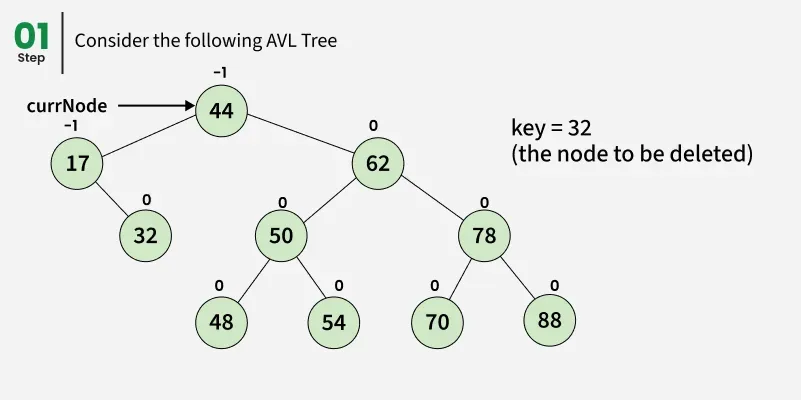

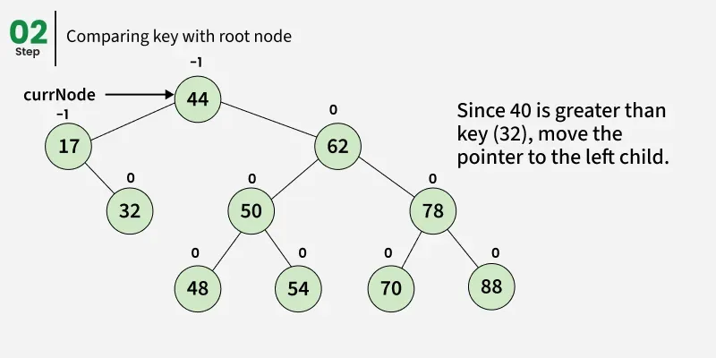

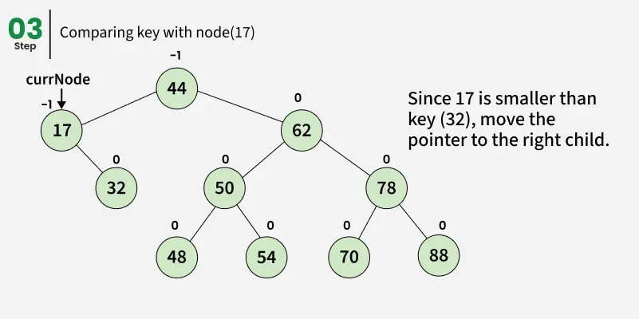

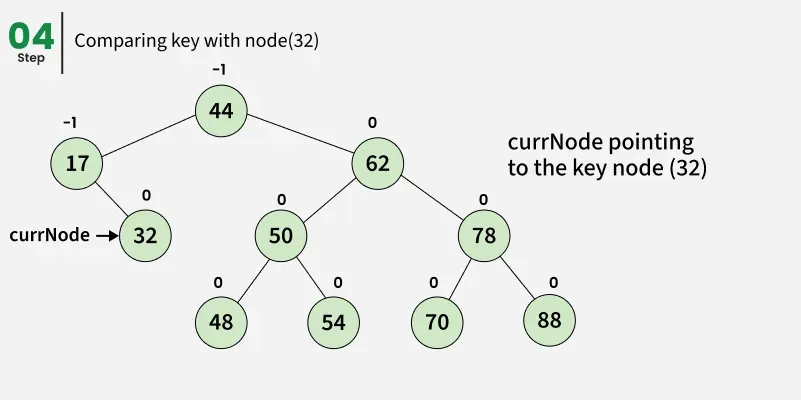

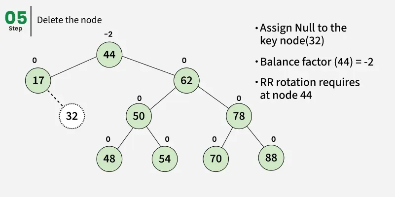

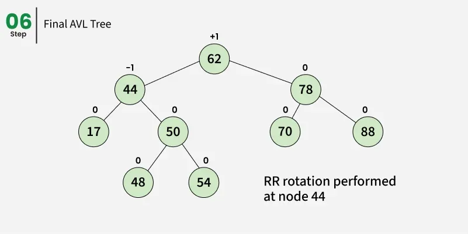

Implement:

```c++
int height(Node<T>* node)
{
    if (node == nullptr)
        return 0;
    return node->height;
}

Node<T>* min_value_node(Node<T>* node)
{
    Node<T>* current = node;
    while (current->left != nullptr)
        current = current->left;
    return current;
}

int balance_factor(Node<T>* node)
{
    if (node == nullptr)
        return 0;
    return height(node->left) - height(node->right);
}

Node<T>* delete_node(Node<T>* root, T key)
{
    // Perform standard BST delete
    if (root == nullptr)
        return root;

    if (key < root->key)
    {
        root->left = delete_node(root->left, key);
    }
    else if (key > root->key)
    {
        root->right = delete_node(root->right, key);
    }
    else 
    {
        // Node with only one child or no child
        if ((root->left == nullptr) || (root->right == nullptr)) 
        {
            Node<T>* temp = root->left ? root->left : root->right;

            if (temp == nullptr) 
            {
                delete root;
                return nullptr;
            } 
            else 
            {
                Node<T>* old = root;
                root = temp;
                delete old;
            }
        }
        else 
        {
            Node<T>* temp = min_value_node(root->right);
            root->key = temp->key;
            root->right = delete_node(root->right, temp->key);
        }
    }

    if (root == nullptr)
        return root;

    // Update height of the current node
    root->height = 1 + std::max(
        height(root->left), height(root->right));

    // Get the balance factor of this node
    int balance = balance_factor(root);

    // If this node becomes unbalanced, then there are 4 cases
    // Left Left Case
    if (balance > 1 && balance_factor(root->left) >= 0)
        return right_rotate(root);

    // Left Right Case
    if (balance > 1 && balance_factor(root->left) < 0) 
    {
        root->left = left_rotate(root->left);
        return right_rotate(root);
    }

    // Right Right Case
    if (balance < -1 && balance_factor(root->right) <= 0)
        return left_rotate(root);

    // Right Left Case
    if (balance < -1 && balance_factor(root->right) > 0) 
    {
        root->right = right_rotate(root->right);
        return left_rotate(root);
    }

    return root;
}
```

Complexity:

| Scenario     | Time Complexity | Space Complexity |
| :----------- | :-------------- | :--------------- |
| Best Case    | $O(\log n)$     | $O(\log n)$     |
| Average Case | $O(\log n)$     | $O(\log n)$     |
| Worst Case   | $O(\log n)$     | $O(\log n)$     |


## Searching

Algorithm:

1. Start from the root.
2. Compare the value with the current node.
3. If equal, return true.
4. If less, move to the left child.
5. If greater, move to the right child.
6. Repeat until found or reach a leaf node.

Example:

Implement:

```c++
bool search(Node<T>* root, T key)
{
    if (root == nullptr)
        return false;
    if (root->key == key)
        return true;
    if (key < root->key)
        return search(root->left, key);
    return search(root->right, key);
}
```

Complexity:

| Scenario     | Time Complexity | Space Complexity |
| :----------- | :-------------- | :--------------- |
| Best Case    | $O(1)$          | $O(1)$          |
| Average Case | $O(\log n)$     | $O(\log n)$     |
| Worst Case   | $O(\log n)$     | $O(\log n)$     |


## Reference

[1] Thomas H.Cormen; Charles E.Leiserson; Ronald L. Rivest; Clifford Stein. Introduction to Algorithms. 3th Edition

[2] Mark Allen Weiss.Data Structures and Algorithm Analysis in C++.4ED

[3] [AVL Tree Data Structure](https://www.geeksforgeeks.org/dsa/introduction-to-avl-tree/)

[4] [AVL Tree Data Structure](https://www.geeksforgeeks.org/dsa/introduction-to-avl-tree/)

[5] [C++ Program to Implement AVL Tree](https://www.geeksforgeeks.org/cpp/cpp-program-to-implement-avl-tree/)
