English | [中文版](b_tree_zh.md)

# B-Tree

[TOC]


## B-Tree

`(balance tree, self-balancing tree)` is a self-balancing tree that keeps data ordered. This data structure allows searching, sequential access, insertion, and deletion operations all in logarithmic time. It is suitable for storage systems that read and write relatively large blocks of data, such as databases and file systems.

### Properties

A B-tree of order $M$ is an $M$-ary tree with the following properties:

1. The data items are stored at leaves.
2. The nonleaf nodes store up to $M - 1$ keys to guide the searching; key $i$ represents the smallest key in the subtree $i + 1$.
3. The root is either a leaf or has between two and $M$ children.
4. All nonleaf nodes (except the root) have between $\lceil M / 2 \rceil$ and $M$ children.
5. All leaves are at the same depth and have between $\lceil L / 2 \rceil$ and $L$ data items, for some $L$ (the determination of $L$ is described shortly).

**Theorem**: If $n \geq 1$, then for any $n$-key B-tree $T$ of height $h$ and a minimum degree $t \geq 2$, $h \leq log_t\frac{n + 1}{2}$.

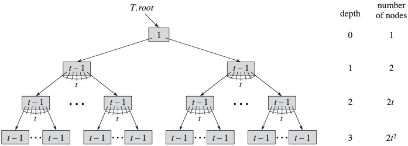

### Nodes

- Root node

	The number of child nodes can be 0

- Internal node

	All nodes except leaf and root nodes can have a **variable number** of child nodes.

- Leaf node

	Has no child nodes, nor pointers to child nodes.

Implementation:

```c++
template <typename T, int ORDER>
class Node 
{
public:
    T keys[ORDER - 1]; 
    Node* children[ORDER]; 
    int n;
    bool leaf; 

    Node(bool isLeaf = true) : n(0), leaf(isLeaf) 
    {
        for (int i = 0; i < ORDER; i++)
            children[i] = nullptr;
    }
};
```

### Search

Start from the root node and recursively traverse the tree from top to bottom.

Algorithm:
$$
\begin{align}
& B-TREE-SEARCH(x, k) \\
& i = 1 \\
& while\ i \leqslant x.n\ and\ k > x.key_i \\
& \qquad i = i + 1 \\
& if\ i \leqslant x.n\ and\ k == x.key \\
& \qquad return(x, i) \\
& elseif\ x.leaf \\
& \qquad return\ NIL \\
& else\ DISK-READ(x.c_i, k)
\end{align}
$$

1. Start from the root.
2. For each node:
   - If the key is present in the node, return the node.
   - If the node is a leaf, return null.
   - Recursively search the appropriate child.

Example:

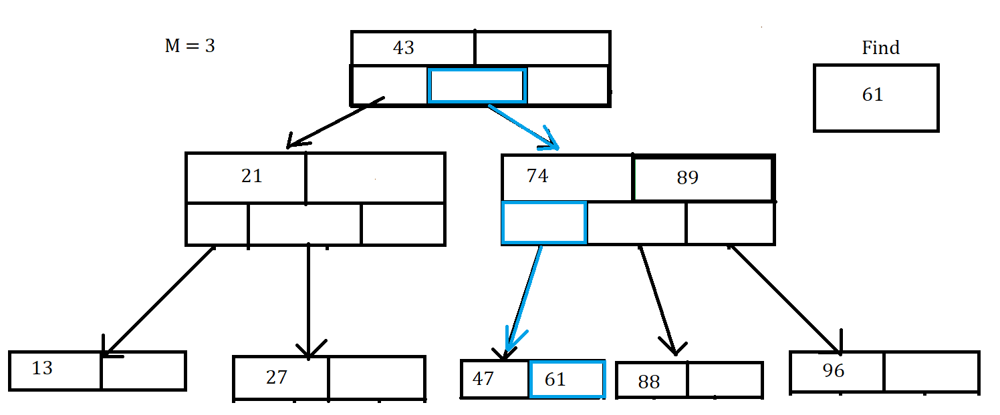

1. Compare with the root node, 61 > 43, go right.
2. Compare with the 61 and [74, 89], 61 < 74, go left.
3. Compare with the 61 and [47, 61], 61 == 61, found and return.

Implementation:

```c++
Node<T, ORDER>* search(Node<T, ORDER>* x, T k) 
{
    int i = 0;
    while (i < x->n && k > x->keys[i])
        i++;

    if (i < x->n && k == x->keys[i])
        return x;

    if (x->leaf)
        return nullptr;

    return search(x->children[i], k);
}
```

Complexity:

| Scenario     | Time Complexity | Space Complexity |
| :----------- | :-------------- | :--------------- |
| Best Case    | $O(1)$          | $O(1)$           |
| Average Case | $O(\log n)$     | $O(\log n)$     |
| Worst Case   | $O(\log n)$     | $O(\log n)$     |

Notice: With iterative traversal, auxiliary space is $O(1)$; the $O(\log n)$ space above comes from recursive call stack usage.

### Insertion

To insert a new key, we go down from the root to the leaf. Before traversing down to a node, we first check if the node is full. If the node is full, we split it to create space.

Algorithm:
$$
\begin{align}
& B-TREE-INSERT(T, k) \\
& r = T.root \\
& if\ r.n == 2t - 1 \\
& \qquad s = ALLOCATE-NODE() \\
& \qquad T.root = s \\
& \qquad s.leaf = FALSE \\
& \qquad s.n = 0 \\
& \qquad s.c_1 = r \\
& \qquad B-TREE-SPLIT-CHILD(s, k) \\
& \qquad B-TREE-INSERT-NONFULL(s, k) \\
& else\ B-TREE-INSERT-NONFULL(r, k)
\end{align}
$$

1. If the root is full, create a new root and split the old root.
2. Call insertNonFull on the appropriate node.
3. In insertNonFull:
   - If the node is a leaf, insert the key in the correct position.
   - If the node is not a leaf, find the correct child and:
   - If the child is full, split it.
   - Recursively call insertNonFull on the appropriate child.


Example:

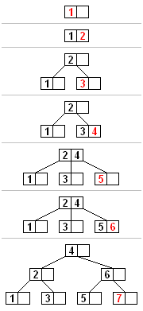

Implementation:

```go
void split_child(Node<T, ORDER>* x, int i) 
{
    Node<T, ORDER>* y = x->children[i];
    Node<T, ORDER>* z = new Node<T, ORDER>(y->leaf);
    z->n = ORDER / 2 - 1;
    for (int j = 0; j < ORDER / 2 - 1; j++)
        z->keys[j] = y->keys[j + ORDER / 2];

    if (!y->leaf) 
    {
        for (int j = 0; j < ORDER / 2; j++)
            z->children[j] = y->children[j + ORDER / 2];
    }

    y->n = ORDER / 2 - 1;
    for (int j = x->n; j >= i + 1; j--)
        x->children[j + 1] = x->children[j];

    x->children[i + 1] = z;
    for (int j = x->n - 1; j >= i; j--)
        x->keys[j + 1] = x->keys[j];

    x->keys[i] = y->keys[ORDER / 2 - 1];
    x->n = x->n + 1;
}

void insert_non_full(Node<T, ORDER>* x, T k) 
{
    int i = x->n - 1;
    if (x->leaf) 
    {
        while (i >= 0 && k < x->keys[i]) 
        {
            x->keys[i + 1] = x->keys[i];
            i--;
        }

        x->keys[i + 1] = k;
        x->n = x->n + 1;
    } 
    else 
    {
        while (i >= 0 && k < x->keys[i])
            i--;

        i++;
        if (x->children[i]->n == ORDER - 1) 
        {
            split_child(x, i);
            if (k > x->keys[i])
                i++;
        }
        insert_non_full(x->children[i], k);
    }
}

void insert(T k) 
{
    if (root->n == ORDER - 1) 
    {
        Node<T, ORDER>* s = new Node<T, ORDER>(false);
        s->children[0] = root;
        root = s;
        split_child(s, 0);
        insert_non_full(s, k);
    } 
    else
        insert_non_full(root, k);
}
```

Complexity:

| Scenario     | Time Complexity | Space Complexity |
| :----------- | :-------------- | :--------------- |
| Best Case    | $O(\log n)$     | $O(1)$           |
| Average Case | $O(\log n)$     | $O(1)$           |
| Worst Case   | $O(\log n)$     | $O(\log n)$     |

Notice: Worst-case space becomes $O(\log n)$ when splits propagate up multiple levels (and/or a recursive call stack is used). Iterative insertion uses $O(1)$ auxiliary space.

### Deletion

Algorithm:

1. Search for the key to be deleted.

   - If the key is in a leaf node:
     - Remove the key if the node has more than the minimum keys.
     - If not, borrow a key from a sibling or merge with a sibling.

   - If the key is in an internal node:
     - Replace with predecessor or successor from the appropriate child.
     - Recursively delete the predecessor or successor.

2. Ensure all nodes maintain the minimum number of keys.

3. If the root is left with no keys, make its only child the new root.

Example:

1. Deleting a leaf key (32) from B-Tree

   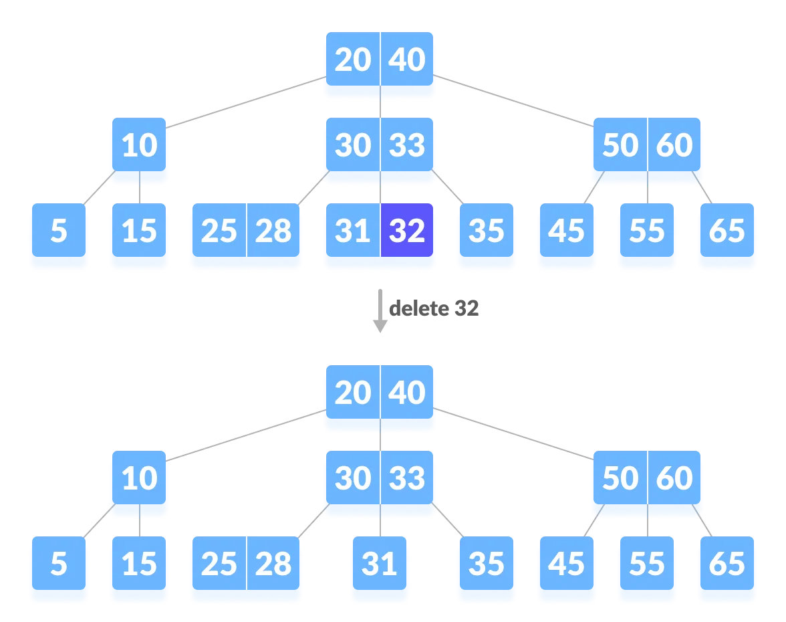

2. Deleting a leaf key (31) from B-Tree

   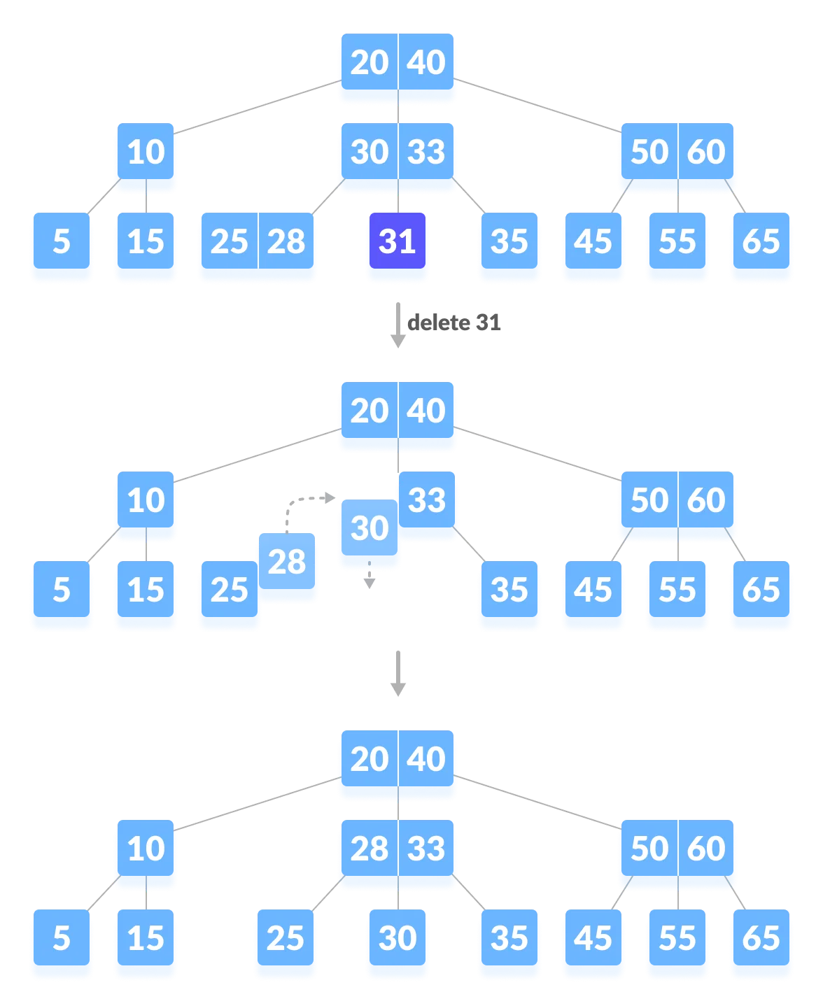

   (Visit the immediate left sibling. The left sibling node has more than a minimum number of keys, then borrow a key from this node.)

3. Deleting a leaf key (30) from B-Tree

   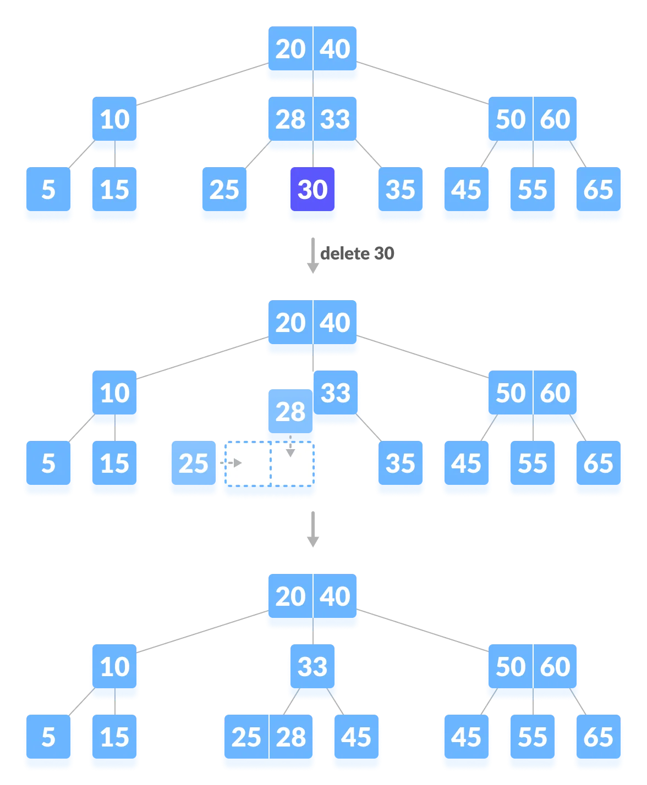

(Both the immediate sibling nodes already have a minimum number of keys, then merge the node with either the left sibling node or the right sibling node.)

Implementation:

```go
T get_predecessor(Node<T, ORDER>* node, int idx) 
{
    Node<T, ORDER>* current = node->children[idx];
    while (!current->leaf)
        current = current->children[current->n];

    return current->keys[current->n - 1];
}

T get_successor(Node<T, ORDER>* node, int idx) 
{
    Node<T, ORDER>* current = node->children[idx + 1];
    while (!current->leaf)
        current = current->children[0];

    return current->keys[0];
}

void merge(Node<T, ORDER>* node, int idx) 
{
    Node<T, ORDER>* child = node->children[idx];
    Node<T, ORDER>* sibling = node->children[idx + 1];
    child->keys[ORDER / 2 - 1] = node->keys[idx];
    for (int i = 0; i < sibling->n; ++i)
        child->keys[i + ORDER / 2] = sibling->keys[i];

    if (!child->leaf) 
    {
        for (int i = 0; i <= sibling->n; ++i)
            child->children[i + ORDER / 2] = sibling->children[i];
    }

    for (int i = idx + 1; i < node->n; ++i)
        node->keys[i - 1] = node->keys[i];

    for (int i = idx + 2; i <= node->n; ++i)
        node->children[i - 1] = node->children[i];

    child->n += sibling->n + 1;
    node->n--;
    delete sibling;
}

void remove_from_leaf(Node<T, ORDER>* node, int idx) 
{
    for (int i = idx + 1; i < node->n; ++i)
        node->keys[i - 1] = node->keys[i];

    node->n--;
}

void remove_from_non_leaf(Node<T, ORDER>* node, int idx) 
{
    T k = node->keys[idx];
    if (node->children[idx]->n >= ORDER / 2) 
    {
        T pred = get_predecessor(node, idx);
        node->keys[idx] = pred;
        remove(node->children[idx], pred);
    } 
    else if (node->children[idx + 1]->n >= ORDER / 2) 
    {
        T succ = get_successor(node, idx);
        node->keys[idx] = succ;
        remove(node->children[idx + 1], succ);
    } 
    else 
    {
        merge(node, idx);
        remove(node->children[idx], k);
    }
}

void remove(Node<T, ORDER>* node, T k) 
{
    int idx = 0;
    while (idx < node->n && node->keys[idx] < k)
        ++idx;

    if (idx < node->n && node->keys[idx] == k) 
    {
        if (node->leaf)
            remove_from_leaf(node, idx);
        else
            remove_from_non_leaf(node, idx);
    } 
    else 
    {
        if (node->leaf) 
        {
            cout << "The key " << k << " is not present in the tree\n";
            return;
        }

        bool flag = ((idx == node->n) ? true : false);
        if (node->children[idx]->n < ORDER / 2)
            fill(node, idx);

        if (flag && idx > node->n)
            remove(node->children[idx - 1], k);
        else
            remove(node->children[idx], k);
    }
}
```

Complexity:

| Scenario     | Time Complexity | Space Complexity |
| :----------- | :-------------- | :--------------- |
| Best Case    | $O(\log n)$     | $O(1)$           |
| Average Case | $O(\log n)$     | $O(\log n)$     |
| Worst Case   | $O(\log n)$     | $O(\log n)$     |

Notice: With iterative traversal/rebalancing, auxiliary space is $O(1)$; the $O(\log n)$ space above comes from recursive call stack usage.

---


## B+ Tree

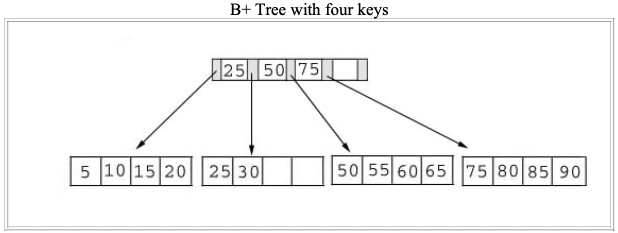

B+ tree is an improved version of B-tree, with higher query performance; by maximizing the data in each internal node, it reduces the tree height and thus the frequency of rebalancing.

### Properties

- Every node in a B+ Tree, except the root, will hold a maximum of $m$ children and ($m - 1$) keys, and a minimum of $\lceil \frac{m}{2} \rceil$ children and $\lceil \frac{m - 1}{2} \rceil$ keys, since the order of the tree is $m$.
- The root node must have no less than two children and at least one search key.
- All the paths in a B tree must end at the same level, i.e., the leaf nodes must be at the same level.
- A B+ tree always maintains sorted data.

### Nodes

In a B+ Tree, nodes are of two main types:

- Internal Nodes

  Internal nodes are used for indexing and routing purposes within the tree. They do not store actual data values but rather keys that help in navigating the tree.

- Leaf Nodes

  Leaf nodes store the actual data values. All the data in a B+ Tree is contained within the leaf nodes.

implementation:

```c++
struct Node 
{
    bool is_leaf;
    std::vector<int> keys;
    std::vector<Node*> children;     // internal nodes
    std::vector<std::string> values; // leaf nodes
    Node* parent;
    Node* next;

    explicit Node(bool leaf)
        : is_leaf(leaf), parent(nullptr), next(nullptr) {}
};

Node* root;
```

### Insertion

Algorithm:

| Leaf Page Full | Index page Full | Action                                                       |
| -------------- | --------------- | ------------------------------------------------------------ |
| NO             | NO              | 1. Place the record in sorted position in the appropriate leaf page. |
| YES            | NO              | 1. Split the leaf page.<br>2. Place Middle Key in the index page in sorted order.<br>3. Left leaf page contains records with keys below the middle key.<br>4. Right leaf page contains records with keys equal to or greater than the middle key. |
| YES            | YES             | 1. Split the leaf page.<br>2. Records with keys < middle key go to the left leaf page. <br>3. Records with keys >= middle key go to the right leaf page.<br>4. Split the index page.<br>5. Keys < middle key go to the left index page.<br>6. Keys > middle key go to the right index page.<br>7. The middle key goes to the next (higher level) index.<br>8. (IF the next level index page is full, continue splitting the index.) |

Complexity:

| Scenario     | Time Complexity | Space Complexity |
| :----------- | :-------------- | :--------------- |
| Best Case    | $O(\log n)$     | $O(1)$           |
| Average Case | $O(\log n)$     | $O(1)$           |
| Worst Case   | $O(\log n)$     | $O(\log n)$     |

Notice: Worst-case space becomes $O(\log⁡ n)$ when splits propagate up multiple levels (and/or a recursive call stack is used).

Example: 

1. Insert a record with a key value of 28 into the B+ tree.

   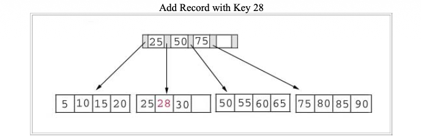

2. Insert a record with a key value of 70 into our B+ tree.

   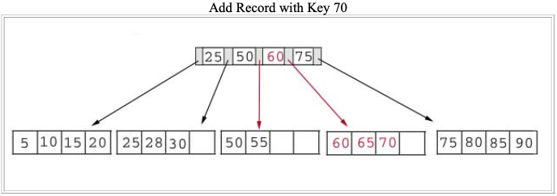

   (This record should go in the leaf page containing 50, 55, 60, and 65. Unfortunately this page is **full**. The middle key of 60 is placed in the index page between 50 and 75, so we must split the page to: ([50, 55], [60, 65, 70]) )

3. Add a record containing a key value of 95 to our B+ tree.

   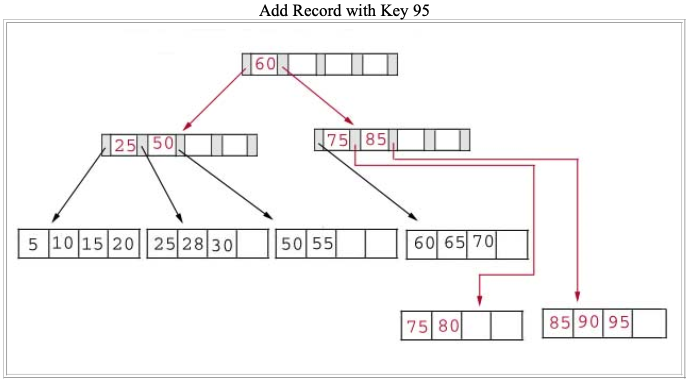

   (This record belongs in the page containing 75, 80, 85, and 90. Since this page is full we split it into two pages:([75, 80], [85, 90, 95]); Unfortunately, the index page is also full, so we split the index page: ([25, 50], [75, 85], [60])).

Implementation:

```c++
Node* root;
int order; // max children for internal node

void insert(int key, const std::string& value) 
{
    Node* leaf = find_leaf(key);
    auto it = std::lower_bound(leaf->keys.begin(), leaf->keys.end(), key);
    size_t idx = static_cast<size_t>(it - leaf->keys.begin());

    if (it != leaf->keys.end() && *it == key) 
    {
        leaf->values[idx] = value;
        return;
    }

    leaf->keys.insert(it, key);
    leaf->values.insert(leaf->values.begin() + idx, value);
    if (static_cast<int>(leaf->keys.size()) > max_keys())
        split_leaf(leaf);
}
```

### Deletion

Algorithm:

| Leaf Page Below Fill Factor | Index Page Below Fill Factor | Action                                                       |
| --------------------------- | ---------------------------- | ------------------------------------------------------------ |
| NO                          | NO                           | 1. Delete the record from the leaf page. Arrange keys in ascending order to fill void. If the key of the deleted record appears in the index page, use the next key to replace it. |
| YES                         | NO                           | 1. Combine the leaf page and its sibling. Change the index page to reflect the change. |
| YES                         | YES                          | 1. Combine the leaf page and its sibling.<br>2. Adjust the index page to reflect the change.<br>3. Combine the index page with its sibling.<br>4. (Continue combining index pages until you reach a page with the correct fill factor or you reach the root page.) |

Complexity:

| Scenario     | Time Complexity | Space Complexity |
| :----------- | :-------------- | :--------------- |
| Best Case    | $O(\log n)$     | $O(1)$           |
| Average Case | $O(\log n)$     | $O(1)$           |
| Worst Case   | $O(\log n)$     | $O(\log n)$     |

Notice: Worst-case space becomes $O(\log n)$ when merges/redistributions propagate up multiple levels (and/or a recursive call stack is used).

Example:

1. Deleting the record with key 70 from the B+ tree.

   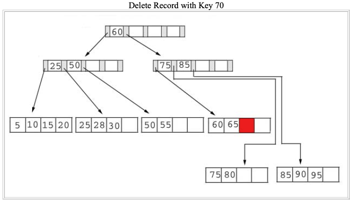

2. Delete the record containing 25 from the B+ tree.

   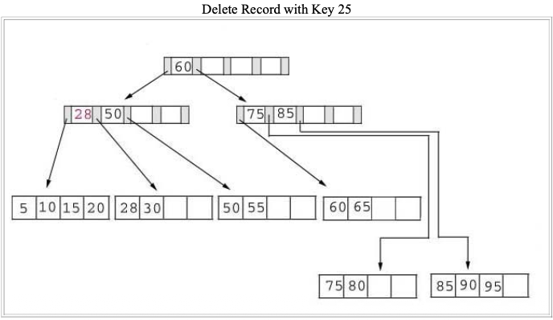

   (This record is found in the leaf node containing 25, 28, and 30. The fill factor will be 50% after the deletion; however, 25 appears in the index page. Thus, when we delete 25 we must replace it with 28 in the index page.)

3. Delete 60 from the B+ tree.

   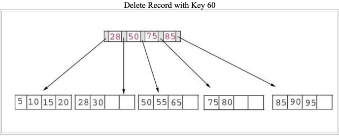

   1. The leaf page containing 60 (60 65) will be below the fill factor after the deletion. Thus, we must combine leaf pages.

   2. With recombined pages, the index page will be reduced by one key. Hence, it will also fall below the fill factor. Thus, we must combine index pages.

   3. Sixty appears as the only key in the root index page. Obviously, it will be removed with the deletion.

Implemention:

```c++
Node* root;
int order; // max children for internal node

bool remove(int key) 
{
    Node* leaf = find_leaf(key);
    if (leaf == nullptr)
        return false;

    auto it = lower_bound(leaf->keys.begin(), leaf->keys.end(), key);
    if (it == leaf->keys.end() || *it != key)
        return false;

    size_t idx = static_cast<size_t>(it - leaf->keys.begin());
    leaf->keys.erase(it);
    leaf->values.erase(leaf->values.begin() + idx);

    rebalance_after_delete(leaf);
    return true;
}
```

### Search

Algorithm:

1. Begin the search from the root node.
2. Compare the key with the keys in the current node:
   - If the key is less than a key in the node, follow the corresponding child pointer.
   - If the key is greater, move to the next key or child pointer.
3. Continue this process until you reach the leaf node.
4. Look for the key in the leaf node.

Complexity:

| Scenario     | Time Complexity | Space Complexity |
| :----------- | :-------------- | :--------------- |
| Best Case    | $O(\log n)$     | $O(1)$           |
| Average Case | $O(\log n)$     | $O(1)$           |
| Worst Case   | $O(\log n)$     | $O(\log n)$     |

Notice: Worst-case space becomes $O(\log n)$ only for recursive implementations; iterative search uses $O(1)$ auxiliary space.

Implementation:

```c++
Node* root;
int order; // max children for internal node

Node* find_leaf(int key) const 
{
    Node* current = root;
    while (current != nullptr && !current->is_leaf) 
    {
        size_t i = 0;
        while (i < current->keys.size() && key >= current->keys[i])
            ++i;

        current = current->children[i];
    }
    return current;
}

bool search(int key, std::string* out_value = nullptr) const 
{
    Node* leaf = find_leaf(key);
    if (leaf == nullptr)
        return false;

    auto it = lower_bound(leaf->keys.begin(), leaf->keys.end(), key);
    if (it == leaf->keys.end() || *it != key)
        return false;

    if (out_value != nullptr) 
    {
        size_t idx = static_cast<size_t>(it - leaf->keys.begin());
        *out_value = leaf->values[idx];
    }
    return true;
}
```

---


## Summary

### B-Tree vs B+Tree vs LSM Tree

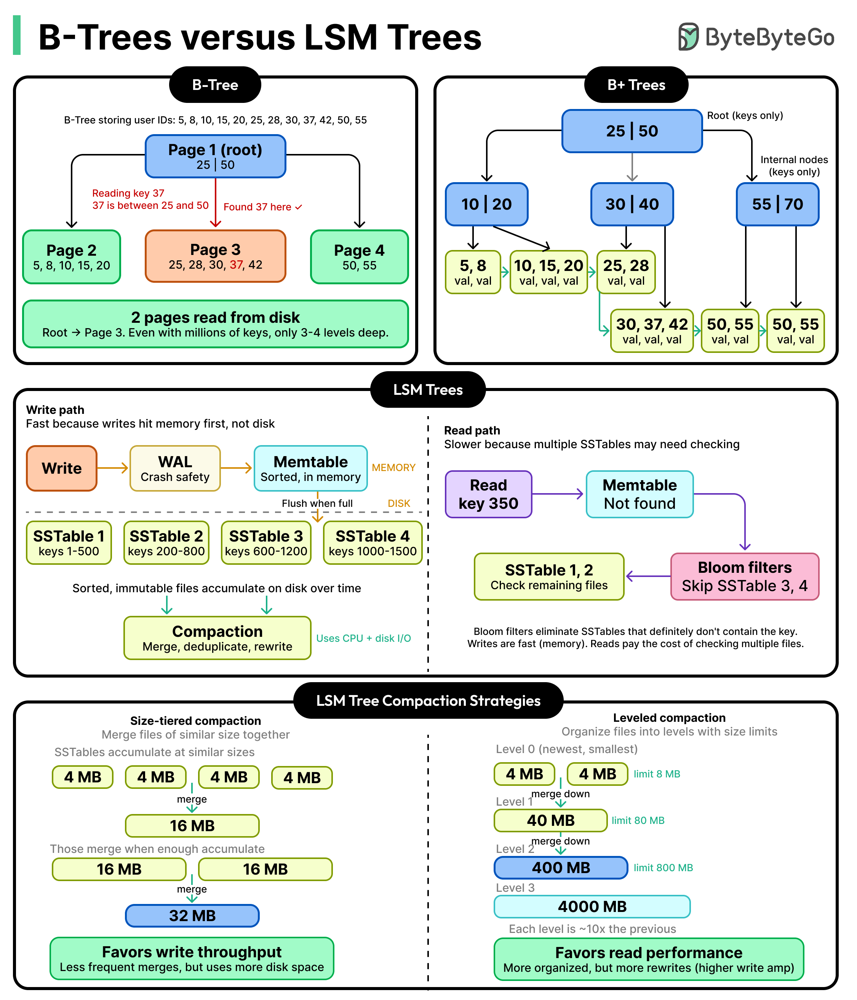

| Basis of Comparison |                            B tree                            |                           B+ tree                            |
| :-----------------: | :----------------------------------------------------------: | :----------------------------------------------------------: |
|    **Pointers**     |        All internal and leaf nodes have data pointers        |              Only leaf nodes have data pointers              |
|     **Search**      | Since all keys are not available at leaf, search often takes more time. | All keys are at leaf nodes, hence search is faster and more accurate. |
| **Redundant Keys**  |       No duplicate of keys is maintained in the tree.        | Duplicate of keys are maintained and all nodes are present at the leaf. |
|    **Insertion**    | Insertion takes more time and it is not predictable sometimes. |   Insertion is easier and the results are always the same.   |
|    **Deletion**     | Deletion of the internal node is very complex and the tree has to undergo a lot of transformations. | Deletion of any node is easy because all node are found at leaf. |
|   **Leaf Nodes**    |     Leaf nodes are not stored as structural linked list.     |       Leaf nodes are stored as structural linked list.       |
|     **Access**      |          Sequential access to nodes is not possible          |     Sequential access is possible just like linked list      |
|     **Height**      |        For a particular number nodes height is larger        |  Height is lesser than B tree for the same number of nodes   |
|   **Application**   |          B-Trees used in Databases, Search engines           |   B+ Trees used in Multilevel Indexing, Database indexing    |
| **Number of Nodes** |     Number of nodes at any intermediary level ‘l’ is 2l.     |      Each intermediary node can have n/2 to n children.      |

### B-Tree vs AVL Tree

|                          AVL Trees                           |                            B-Tree                            |
| :----------------------------------------------------------: | :----------------------------------------------------------: |
|          It is a self-balancing binary search tree           |            It is a multi-way tree(N - ary tree).             |
|          Every node contains at most 2 child nodes           |      In this tree, nodes can have multiple child nodes       |
| It has a balance factor whose value is either -1, 0, or 1. **Balance factor =** (height of left subtree)-(height of right subtree) or **Balance factor =** (height of right subtree)-(height of left subtree) | B-Tree is defined by the term minimum degree ‘t‘. The value of ‘t‘ depends upon disk block size. Every node except the root must contain at least t-1 keys. The root may contain a minimum of 1 key. |
| AVL tree has a height of log(N) (Where N is the number of nodes). | B-tree has a height of log(M*N) (Where ‘M’ is the order of tree and N is the number of nodes). |

---


## References

[1] Thomas H.Cormen; Charles E.Leiserson; Ronald L. Rivest; Clifford Stein. Introduction to Algorithms. 3th Edition

[2] [B+ TREES](res/b_plus_trees.pdf)

[3] [Wikipedia - B-Tree](https://en.wikipedia.org/wiki/B-tree)

[4] [Wikipedia - B+ Tree](https://en.wikipedia.org/wiki/B%2B_tree)

[5] [Bp-Tree: A Predictive B+-Tree for Reducing Writes on Phase Change Memory](res/bptree.pdf)

[6] [Introduction of B+ Tree](https://www.geeksforgeeks.org/dbms/introduction-of-b-tree/)

[7] [B+ Trees](https://www.tutorialspoint.com/data_structures_algorithms/b_plus_trees.htm)

[8] [C++ Program to Implement B+ Tree](https://www.geeksforgeeks.org/cpp/cpp-program-to-implement-b-plus-tree/)

[9] [B-Trees vs LSM Trees: Comparison and Trade-Offs](https://blog.bytebytego.com/p/b-trees-vs-lsm-trees-comparison-and?utm_source=publication-search)
