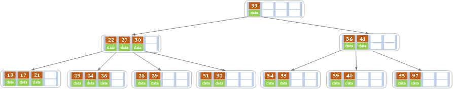
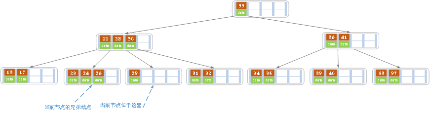
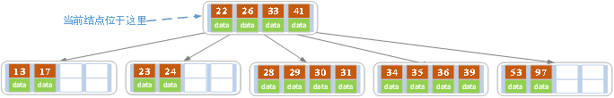

# 平衡树

[TOC]


## B树

`(balance tree，自平衡树)`，是一种自平衡树，能够保持数据有序。

这种数据结构能够让查找数据，顺序访问，插入数据及删除的动作，都在对数时间内完成。

适用于读写相对大的数据块的存储系统，例如数据库和文件系统。

### 应用

1. 文件系统：HPFS，HFS，HFS+，ResiserFS，XFS，Ext3FS，JFS
2. 数据库：ORACLE，MYSQL，SQLSERVER

### 结构

- 根节点

  子节点数量可以为0

- 内部节点

  除叶子节点和根节点之外的所有节点，可以拥有**可变数量**的子节点；

- 叶子节点

  没有子节点，也没有指向子节点的指针；

### 特征

一个m阶的B树有以下属性：

1. **所有节点关键字按照递增次序排列，并遵循左小右大原则**
2. **每一个节点最多有m个子节点**
3. **每个非叶子结点（除根节点）最少有`m/2`个子节点**
4. **如果根节点不是叶子结点，那么它至少有2个子节点**
5. **有k个子节点的非叶子节点拥有`k-1`个键**
6. **所有叶子节点都在同一层**

### 查找

从根节点开始，从上到下递归遍历树；

例，搜索字母E：


1. 先拿根节点比较，E<M，向左找
2. 拿到D和G，D<E<G，找中间
3. 拿到E和F，E=E，返回关键字和指针信息，如果找不到就返回null

### 插入

插入一条记录（key-value）：如果B树中已存在需要插入的键值对，用新的value替换旧的value；如果不存在，进行插入操作：

1. 判断当前节点key的个数是否小于等于最大值

   - 是

     根据要插入的key值，找到叶子节点并插入，结束。

   - 否

     1. 从该节点的原有元素和新的元素中选择出中位数
     2. 小于这个中位数的元素放入左边节点，大于这个中位数的元素放入右边节点，中位数作为分隔值
     3. 分隔值被插入到父节点中，可能会造成父节点分裂，分裂父节点时可能又会使它的父节点分裂，一直上升到根节点；如果没有父节点，就创建一个新的根节点（增加高度）


例：向B树插入数据：


实现：

```go

```

### 删除

- 删除叶子节点中的元素
  1. 搜索要删除的元素
  2. 如果它在叶子结点，将它从中删除
  3. 如果发生了下溢出，重新平衡树

- 删除内部节点中的元素
  1. 选择一个新的分隔符（左子树中最大的元素或右子树中最小的元素），将它从叶子节点中移除，替换掉被删除的元素作为新的分隔值
  2. 前一步删除了一个叶子结点中的元素，如果这个叶子结点拥有的元素数量小于最低要求，那么从这一叶子节点开始重新进行平衡

例，删除5阶B树：

- 原始状态



- 删除21（删除后节点中关键字个数仍然大于等于2，删除结束）


- 删除27（27位于非叶子节点，可以用27的后继28替换它，然后删除28）



- 重新平衡（当前叶子结点的记录的个数小于2，而它的兄弟节点中有3个记录；从兄弟节点中“借取”一个key，28节点下移，26节点上移）


- 删除32


- 重新平衡（当前节点中只有key，而兄弟节点中仅有2个key；让30节点下移，跟他的两个子节点合并，成为一个新的节点）


- 删除40


- 重新平衡（当前节点的记录数小于2，兄弟节点中没有多余key；父节点中的key下移，和兄弟节点（左或右）合并）


- 再次平衡



实现：

```go

```

### 重新平衡

- 如果缺少元素节点的右兄弟存在且拥有多余的元素，那么向左旋转
  1. 将父节点的分隔值复制到缺少元素节点的最后
  2. 将父节点的分隔值替换为右兄弟的第一个元素
  3. 树重新平衡
- 否则，如果缺少元素节点的左兄弟存在且拥有多余的元素，向右旋转
  1. 将父节点的分隔值复制到缺少元素节点的第一个节点
  2. 将父节点的分隔值替换为左兄弟的最后一个元素
  3. 树重新平衡
- 否则，如果它的两个直接兄弟节点都只有最小数量的元素，那么将它与一个直接兄弟节点以及父节点中它们的分隔值合并
  1. 将分隔值复制到左边的节点
  2. 将右边节点中所有的元素移动到左边节点
  3. 将父节点中的分隔值和空的右子树移除
     - 如果父节点是根节点并且没有元素了，那么释放它并且让合并之后的节点成为新的根节点（树的深度减少）
     - 否则，如果父节点的元素数量小于最小值，重新平衡父节点

达到重新平衡的特征：

1. 叶子结点都在同一层
2. 每个节点的关键字数为子树个数`-1`（子树个数k介于树的阶`M`和它的`1/2`）
3. 子树的关键字保证左小右大的顺序

实现：

```go

```

### 复杂度

| -    | 平均        | 最差        |
| ---- | ----------- | ----------- |
| 空间 | $O(n)$      | $O(n)$      |
| 搜索 | $O(\log n)$ | $O(\log n)$ |
| 插入 | $O(\log n)$ | $O(\log n)$ |
| 删除 | $O(\log n)$ | $O(\log n)$ |

---


## B+树

B+树是对B树的一种改进，它比B树的查询性能更高；通过最大化在每个内部节点内的子节点的数据来减少树的高度，从而降低平衡发生的频率。

### 应用

### 结构

- 内部节点（索引节点）
- 叶子节点

### 特征

1. 有n棵子树的非叶子节点中含有n个关键字（B树是`n-1`个），这些关键字不保存数据，只用来索引，所有数据都保存在叶子节点。
2. 所有的叶子结点中包含了全部关键字的信息，及指向含这些关键字记录的指针，且叶子结点本身依关键字的大小自小而大顺序链接。
3. 所有的非叶子节点可以看成是索引部分，节点中仅含其子树中的最大（或最小）关键字。
4. 通常在`B+`树上有两个头指针，一个指向根节点，一个指向关键字最小的叶子结点。
5. 同一个数字会在不同节点中重复出现，根节点的最大元素就是`B+`树的最大元素。

### 查找

自根节点开始，自顶向下遍历树，二分查找；

#### 实现

### 插入

1. 若为空树，创建一个叶子结点，然后将记录插入其中，此时这个叶子结点也是根节点，插入操作结束
2. 

实现：

### 删除

实现：

### INNODB

---


## `B*`树

是B+树的变体，在B+树的非根和非叶子结点在增加指向兄弟的指针


## 区别

| -         | B树                  | B+树 |
| --------- | -------------------- | ---- |
| 平衡操作  |                      |      |
| 查找      | 必须使用中序遍历扫库 |      |
| 区间查询  | 不支持               | 支持 |
| 键值长度  | 无法改变键值最大长度 |      |
| `I/O`操作 |                      |      |


## 展望未来

### Bp-Tree

TODO


## 参考

- [维基百科-B树](https://zh.wikipedia.org/wiki/B%E6%A0%91)
- [维基百科-B+树](https://zh.wikipedia.org/wiki/B%2B%E6%A0%91)
- [B树和B+树的插入、删除图文详解](https://www.cnblogs.com/nullzx/p/8729425.html)
- [B树，B+树，红黑树应用场景笔记](https://blog.csdn.net/qq_36183935/article/details/81095212)
- [B+ trees](res/b+trees.pdf)
- [Bp-Tree: A Predictive B+-Tree for Reducing Writes on Phase Change Memory](res/bptree.pdf)

