English | [中文版](balance_tree_zh.md)

# Balanced Tree

[TOC]


## B-Tree

`(balance tree, self-balancing tree)` is a self-balancing tree that keeps data ordered.

This data structure allows searching, sequential access, insertion, and deletion operations all in logarithmic time.

It is suitable for storage systems that read and write relatively large blocks of data, such as databases and file systems.

### Applications

1. File systems: HPFS, HFS, HFS+, ResiserFS, XFS, Ext3FS, JFS
2. Databases: ORACLE, MYSQL, SQLSERVER

### Structure

- Root node

	The number of child nodes can be 0

- Internal node

	All nodes except leaf and root nodes, can have a **variable number** of child nodes;

- Leaf node

	Has no child nodes, nor pointers to child nodes;

### Features

A B-tree of order $M$ has the following properties:

1. **All node keys are arranged in ascending order and follow the left-small, right-large principle**
2. **Each node has at most m child nodes**
3. **Each non-leaf node (except the root) has at least `m/2` child nodes**
4. **If the root node is not a leaf, it has at least 2 child nodes**
5. **A non-leaf node with k child nodes has `k-1` keys**
6. **All leaf nodes are at the same level**

### Search

Start from the root node and recursively traverse the tree from top to bottom;

Example, search for letter E:

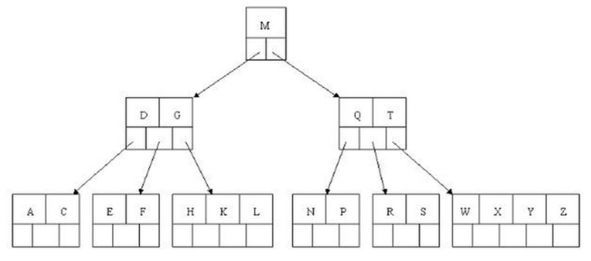

1. Compare with the root node, E<M, go left
2. Get D and G, D<E<G, go to the middle
3. Get E and F, E=E, return the key and pointer info, if not found return null

### Insertion

Insert a record (key-value): If the key-value pair to be inserted already exists in the B-tree, replace the old value with the new value; if not, perform the insertion:

1. Check if the number of keys in the current node is less than or equal to the maximum

	 - Yes

		 Find the leaf node according to the key to be inserted and insert, done.

	 - No

		 1. Select the median from the original elements and the new element of the node
		 2. Elements less than the median go to the left node, greater go to the right node, the median acts as a separator
		 3. The separator is inserted into the parent node, which may cause the parent to split, and this may propagate up to the root; if there is no parent, create a new root (increase height)


Example: Insert data into a B-tree:

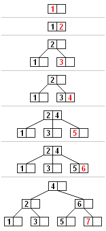

Implementation:

```go
TODO
```

### Deletion

- Delete an element from a leaf node
	1. Search for the element to delete
	2. If it is in a leaf node, delete it
	3. If underflow occurs, rebalance the tree

- Delete an element from an internal node
	1. Choose a new separator (the largest element in the left subtree or the smallest in the right), remove it from the leaf, and replace the deleted element as the new separator
	2. The previous step deletes an element from a leaf; if the leaf now has fewer elements than required, rebalance starting from this leaf

Example, delete from a 5-order B-tree:

- Initial state

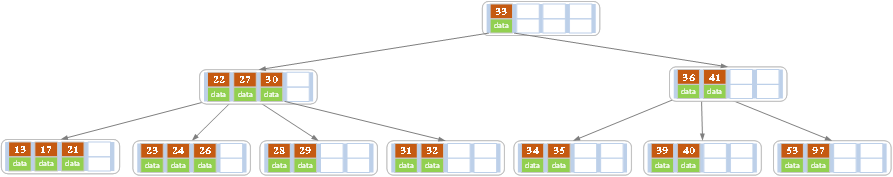

- Delete 21 (after deletion, the number of keys in the node is still >=2, done)

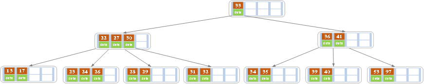

- Delete 27 (27 is in an internal node, can be replaced by its successor 28, then delete 28)

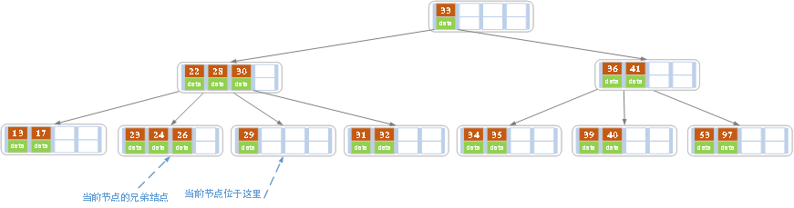

- Rebalance (the current leaf has fewer than 2 keys, but its sibling has 3; borrow a key from the sibling, 28 moves down, 26 moves up)

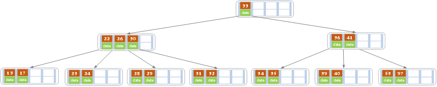

- Delete 32

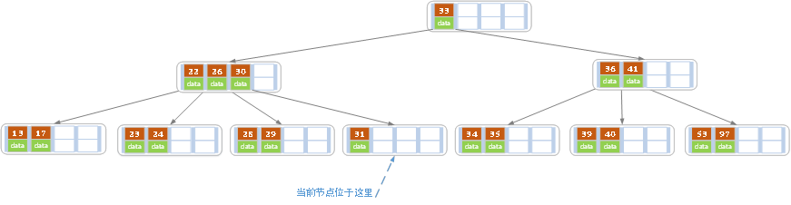

- Rebalance (the current node has only one key, and the sibling has only 2; 30 moves down and merges with its two children to form a new node)

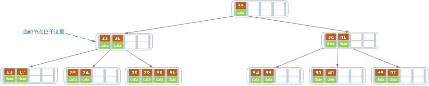

- Delete 40

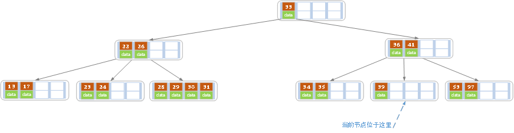

- Rebalance (the current node has fewer than 2 keys, and the sibling has no extra; the parent's key moves down and merges with the sibling)

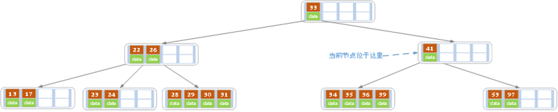

- Rebalance again

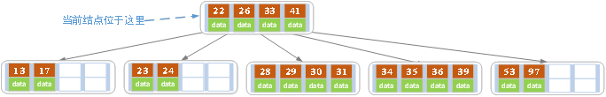

Implementation:

```go
TODO
```

### Rebalancing

- If the right sibling of the node lacking elements exists and has extra elements, rotate left
	1. Copy the parent's separator to the end of the lacking node
	2. Replace the parent's separator with the first element of the right sibling
	3. Rebalance the tree
- Else, if the left sibling exists and has extra elements, rotate right
	1. Copy the parent's separator to the first element of the lacking node
	2. Replace the parent's separator with the last element of the left sibling
	3. Rebalance the tree
- Else, if both siblings have only the minimum number of elements, merge the node with a sibling and the parent's separator
	1. Copy the separator to the left node
	2. Move all elements from the right node to the left
	3. Remove the separator and empty right subtree from the parent
		 - If the parent is the root and has no elements, free it and let the merged node become the new root (tree height decreases)
		 - Else, if the parent now has fewer than the minimum, rebalance the parent

Rebalancing features:

1. All leaf nodes are at the same level
2. Each node's number of keys is the number of subtrees minus one (subtree count k is between order $M$ and $M/2$)
3. Keys in subtrees maintain left-small, right-large order

Implementation:

```go
TODO
```

### Complexity

|      | Average      | Worst        |
| ---- | -----------  | -----------  |
| Space| $O(n)$       | $O(n)$       |
| Search| $O(\log n)$ | $O(\log n)$  |
| Insert| $O(\log n)$ | $O(\log n)$  |
| Delete| $O(\log n)$ | $O(\log n)$  |

---


## B+ Tree

B+ tree is an improved version of B-tree, with higher query performance; by maximizing the data in each internal node, it reduces the tree height and thus the frequency of rebalancing.

### Applications

### Structure

- Internal node (index node)
- Leaf node

### Features

1. A non-leaf node with n subtrees contains n keys (B-tree has n-1); these keys do not store data, only for indexing, all data is stored in leaf nodes.
2. All leaf nodes contain all key information and pointers to the records, and leaf nodes are linked in order.
3. All non-leaf nodes can be seen as index parts, only containing the maximum (or minimum) key in their subtrees.
4. Usually, a B+ tree has two head pointers, one to the root, one to the smallest leaf.
5. The same number may appear in different nodes; the largest element in the root is the largest in the B+ tree.

### Search

Start from the root, traverse top-down, binary search;

#### Implementation

### Insertion

1. If the tree is empty, create a leaf node and insert the record; this leaf is also the root, done.
2. TODO

Implementation: TODO

### Deletion

Implementation: TODO

### INNODB

TODO

---


## B* Tree

Is a variant of B+ tree, in B+ tree, non-root and non-leaf nodes add pointers to siblings

---


## Differences

| -         | B-Tree               | B+ Tree |
| --------- | -------------------- | ------- |
| Balancing |                      |         |
| Search    | Must use in-order    |         |
| Range     | Not supported        | Supported|
| Key length| Cannot change max    |         |
| I/O       |                      |         |

---


## Future Prospects

### Bp-Tree

TODO

---


## References

- [Wikipedia - B-Tree](https://en.wikipedia.org/wiki/B-tree)
- [Wikipedia - B+ Tree](https://en.wikipedia.org/wiki/B%2B_tree)
- [B-Tree and B+ Tree Insertion, Deletion Illustrated](https://www.cnblogs.com/nullzx/p/8729425.html)
- [B-tree, B+ tree, Red-Black tree application notes](https://blog.csdn.net/qq_36183935/article/details/81095212)
- [B+ trees](res/b+trees.pdf)
- [Bp-Tree: A Predictive B+-Tree for Reducing Writes on Phase Change Memory](res/bptree.pdf)
