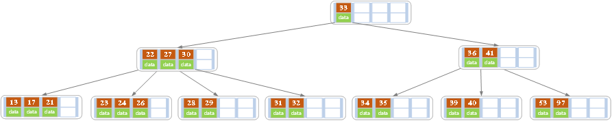
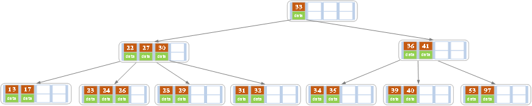
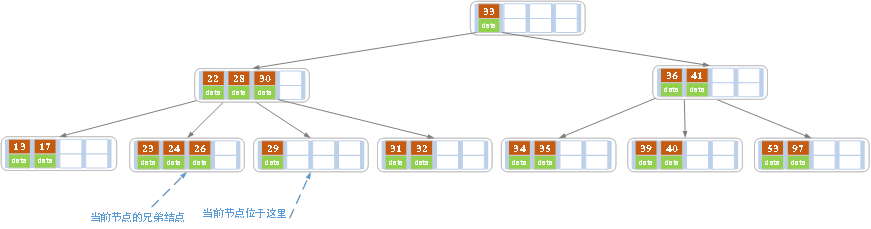
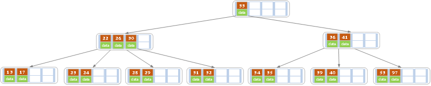
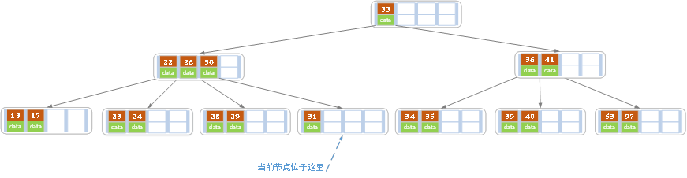
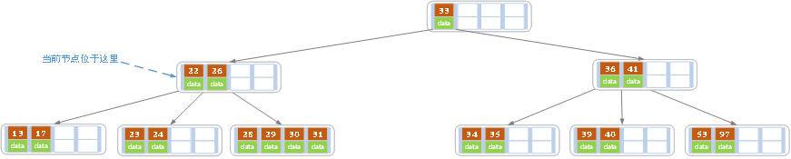
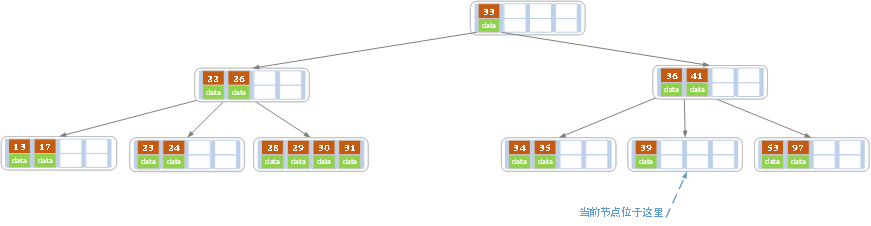
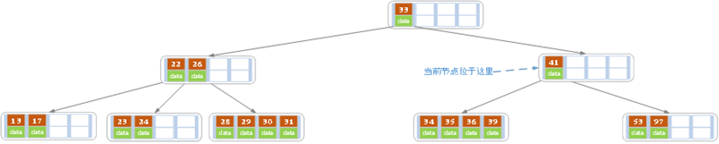
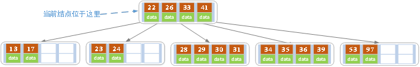

English | [中文版](balance_tree_zh.md)

# Balanced Tree

[TOC]


## B-Tree

`(balance tree, self-balancing tree)` is a self-balancing tree that keeps data ordered.

This data structure allows searching, sequential access, insertion, and deletion operations all in logarithmic time.

It is suitable for storage systems that read and write relatively large blocks of data, such as databases and file systems.

### Applications

1. File systems: HPFS, HFS, HFS+, ResiserFS, XFS, Ext3FS, JFS
2. Databases: ORACLE, MYSQL, SQLSERVER

### Structure

- Root node

	The number of child nodes can be 0

- Internal node

	All nodes except leaf and root nodes, can have a **variable number** of child nodes;

- Leaf node

	Has no child nodes, nor pointers to child nodes;

### Features

A B-tree of order $M$ has the following properties:

1. **All node keys are arranged in ascending order and follow the left-small, right-large principle**
2. **Each node has at most m child nodes**
3. **Each non-leaf node (except the root) has at least `m/2` child nodes**
4. **If the root node is not a leaf, it has at least 2 child nodes**
5. **A non-leaf node with k child nodes has `k-1` keys**
6. **All leaf nodes are at the same level**

### Search

Start from the root node and recursively traverse the tree from top to bottom;

Example, search for letter E:


1. Compare with the root node, E<M, go left
2. Get D and G, D<E<G, go to the middle
3. Get E and F, E=E, return the key and pointer info, if not found return null

### Insertion

Insert a record (key-value): If the key-value pair to be inserted already exists in the B-tree, replace the old value with the new value; if not, perform the insertion:

1. Check if the number of keys in the current node is less than or equal to the maximum

	 - Yes

		 Find the leaf node according to the key to be inserted and insert, done.

	 - No

		 1. Select the median from the original elements and the new element of the node
		 2. Elements less than the median go to the left node, greater go to the right node, the median acts as a separator
		 3. The separator is inserted into the parent node, which may cause the parent to split, and this may propagate up to the root; if there is no parent, create a new root (increase height)


Example: Insert data into a B-tree:


Implementation:

```go
TODO
```

### Deletion

- Delete an element from a leaf node
	1. Search for the element to delete
	2. If it is in a leaf node, delete it
	3. If underflow occurs, rebalance the tree

- Delete an element from an internal node
	1. Choose a new separator (the largest element in the left subtree or the smallest in the right), remove it from the leaf, and replace the deleted element as the new separator
	2. The previous step deletes an element from a leaf; if the leaf now has fewer elements than required, rebalance starting from this leaf

Example, delete from a 5-order B-tree:

- Initial state



- Delete 21 (after deletion, the number of keys in the node is still >=2, done)



- Delete 27 (27 is in an internal node, can be replaced by its successor 28, then delete 28)



- Rebalance (the current leaf has fewer than 2 keys, but its sibling has 3; borrow a key from the sibling, 28 moves down, 26 moves up)



- Delete 32



- Rebalance (the current node has only one key, and the sibling has only 2; 30 moves down and merges with its two children to form a new node)



- Delete 40



- Rebalance (the current node has fewer than 2 keys, and the sibling has no extra; the parent's key moves down and merges with the sibling)



- Rebalance again



Implementation:

```go
TODO
```

### Rebalancing

- If the right sibling of the node lacking elements exists and has extra elements, rotate left
	1. Copy the parent's separator to the end of the lacking node
	2. Replace the parent's separator with the first element of the right sibling
	3. Rebalance the tree
- Else, if the left sibling exists and has extra elements, rotate right
	1. Copy the parent's separator to the first element of the lacking node
	2. Replace the parent's separator with the last element of the left sibling
	3. Rebalance the tree
- Else, if both siblings have only the minimum number of elements, merge the node with a sibling and the parent's separator
	1. Copy the separator to the left node
	2. Move all elements from the right node to the left
	3. Remove the separator and empty right subtree from the parent
		 - If the parent is the root and has no elements, free it and let the merged node become the new root (tree height decreases)
		 - Else, if the parent now has fewer than the minimum, rebalance the parent

Rebalancing features:

1. All leaf nodes are at the same level
2. Each node's number of keys is the number of subtrees minus one (subtree count k is between order $M$ and $M/2$)
3. Keys in subtrees maintain left-small, right-large order

Implementation:

```go
TODO
```

### Complexity

|      | Average      | Worst        |
| ---- | -----------  | -----------  |
| Space| $O(n)$       | $O(n)$       |
| Search| $O(\log n)$ | $O(\log n)$  |
| Insert| $O(\log n)$ | $O(\log n)$  |
| Delete| $O(\log n)$ | $O(\log n)$  |

---


## B+ Tree


B+ tree is an improved version of B-tree, with higher query performance; by maximizing the data in each internal node, it reduces the tree height and thus the frequency of rebalancing.

### Properties

- Every node in a B+ Tree, except the root, will hold a maximum of $m$ children and ($m - 1$) keys, and a minimum of $\lceil \frac{m}{2} \rceil$ children and $\lceil \frac{m - 1}{2} \rceil$ keys, since the order of the tree is $m$.
- The root node must have no less than two children and at least one search key.
- All the paths in a B tree must end at the same level, i.e., the leaf nodes must be at the same level.
- A B+ tree always maintains sorted data.

### Nodes

In a B+ Tree, nodes are of two main types:

- Internal Nodes

  Internal nodes are used for indexing and routing purposes within the tree. They do not store actual data values but rather keys that help in navigating the tree.

- Leaf Nodes

  Leaf nodes store the actual data values. All the data in a B+ Tree is contained within the leaf nodes.

implementation:

```c++
struct Node 
{
    bool is_leaf;
    std::vector<int> keys;
    std::vector<Node*> children;     // internal nodes
    std::vector<std::string> values; // leaf nodes
    Node* parent;
    Node* next;

    explicit Node(bool leaf)
        : is_leaf(leaf), parent(nullptr), next(nullptr) {}
};

Node* root;
```

### Insertion

Algorithm:

| Leaf Page Full | Index page Full | Action                                                       |
| -------------- | --------------- | ------------------------------------------------------------ |
| NO             | NO              | 1. Place the record in sorted position in the appropriate leaf page. |
| YES            | NO              | 1. Split the leaf page.<br>2. Place Middle Key in the index page in sorted order.<br>3. Left leaf page contains records with keys below the middle key.<br>4. Right leaf page contains records with keys equal to or greater than the middle key. |
| YES            | YES             | 1. Split the leaf page.<br>2. Records with keys < middle key go to the left leaf page. <br>3. Records with keys >= middle key go to the right leaf page.<br>4. Split the index page.<br>5. Keys < middle key go to the left index page.<br>6. Keys > middle key go to the right index page.<br>7. The middle key goes to the next (higher level) index.<br>8. (IF the next level index page is full, continue splitting the index.) |

Complexity:

| Scenario     | Time Complexity | Space Complexity |
| :----------- | :-------------- | :--------------- |
| Best Case    | $O(\log n)$     | $O(1)$           |
| Average Case | $O(\log n)$     | $O(1)$           |
| Worst Case   | $O(\log n)$     | $O(\log n)$     |

Notice: Worst-case space becomes $O(\log⁡ n)$ when splits propagate up multiple levels (and/or a recursive call stack is used).

Example: 

1. Insert a record with a key value of 28 into the B+ tree.

   

2. Insert a record with a key value of 70 into our B+ tree.

   

   (This record should go in the leaf page containing 50, 55, 60, and 65. Unfortunately this page is **full**. The middle key of 60 is placed in the index page between 50 and 75, so we must split the page to: ([50, 55], [60, 65, 70]) )

3. Add a record containing a key value of 95 to our B+ tree.

   

   (This record belongs in the page containing 75, 80, 85, and 90. Since this page is full we split it into two pages:([75, 80], [85, 90, 95]); Unfortunately, the index page is also full, so we split the index page: ([25, 50], [75, 85], [60])).

Implementation:

```c++
Node* root;
int order; // max children for internal node

void insert(int key, const std::string& value) 
{
    Node* leaf = find_leaf(key);
    auto it = std::lower_bound(leaf->keys.begin(), leaf->keys.end(), key);
    size_t idx = static_cast<size_t>(it - leaf->keys.begin());

    if (it != leaf->keys.end() && *it == key) 
    {
        leaf->values[idx] = value;
        return;
    }

    leaf->keys.insert(it, key);
    leaf->values.insert(leaf->values.begin() + idx, value);
    if (static_cast<int>(leaf->keys.size()) > max_keys())
        split_leaf(leaf);
}
```

### Deletion

Algorithm:

| Leaf Page Below Fill Factor | Index Page Below Fill Factor | Action                                                       |
| --------------------------- | ---------------------------- | ------------------------------------------------------------ |
| NO                          | NO                           | 1. Delete the record from the leaf page. Arrange keys in ascending order to fill void. If the key of the deleted record appears in the index page, use the next key to replace it. |
| YES                         | NO                           | 1. Combine the leaf page and its sibling. Change the index page to reflect the change. |
| YES                         | YES                          | 1. Combine the leaf page and its sibling.<br>2. Adjust the index page to reflect the change.<br>3. Combine the index page with its sibling.<br>4. (Continue combining index pages until you reach a page with the correct fill factor or you reach the root page.) |

Complexity:

| Scenario     | Time Complexity | Space Complexity |
| :----------- | :-------------- | :--------------- |
| Best Case    | $O(\log n)$     | $O(1)$           |
| Average Case | $O(\log n)$     | $O(1)$           |
| Worst Case   | $O(\log n)$     | $O(\log n)$     |

Notice: Worst-case space becomes $O(\log n)$ when merges/redistributions propagate up multiple levels (and/or a recursive call stack is used).

Example:

1. Deleting the record with key 70 from the B+ tree.

   

2. Delete the record containing 25 from the B+ tree.

   

   (This record is found in the leaf node containing 25, 28, and 30. The fill factor will be 50% after the deletion; however, 25 appears in the index page. Thus, when we delete 25 we must replace it with 28 in the index page.)

3. Delete 60 from the B+ tree.

   

   1. The leaf page containing 60 (60 65) will be below the fill factor after the deletion. Thus, we must combine leaf pages.

   2. With recombined pages, the index page will be reduced by one key. Hence, it will also fall below the fill factor. Thus, we must combine index pages.

   3. Sixty appears as the only key in the root index page. Obviously, it will be removed with the deletion.

Implemention:

```c++
Node* root;
int order; // max children for internal node

bool remove(int key) 
{
    Node* leaf = find_leaf(key);
    if (leaf == nullptr)
        return false;

    auto it = lower_bound(leaf->keys.begin(), leaf->keys.end(), key);
    if (it == leaf->keys.end() || *it != key)
        return false;

    size_t idx = static_cast<size_t>(it - leaf->keys.begin());
    leaf->keys.erase(it);
    leaf->values.erase(leaf->values.begin() + idx);

    rebalance_after_delete(leaf);
    return true;
}
```

### Search

Algorithm:

1. Begin the search from the root node.
2. Compare the key with the keys in the current node:
   - If the key is less than a key in the node, follow the corresponding child pointer.
   - If the key is greater, move to the next key or child pointer.
3. Continue this process until you reach the leaf node.
4. Look for the key in the leaf node.

Complexity:

| Scenario     | Time Complexity | Space Complexity |
| :----------- | :-------------- | :--------------- |
| Best Case    | $O(\log n)$     | $O(1)$           |
| Average Case | $O(\log n)$     | $O(1)$           |
| Worst Case   | $O(\log n)$     | $O(\log n)$     |

Notice: Worst-case space becomes $O(\log n)$ only for recursive implementations; iterative search uses $O(1)$ auxiliary space.

Implementation:

```c++
Node* root;
int order; // max children for internal node

Node* find_leaf(int key) const 
{
    Node* current = root;
    while (current != nullptr && !current->is_leaf) 
    {
        size_t i = 0;
        while (i < current->keys.size() && key >= current->keys[i])
            ++i;

        current = current->children[i];
    }
    return current;
}

bool search(int key, std::string* out_value = nullptr) const 
{
    Node* leaf = find_leaf(key);
    if (leaf == nullptr)
        return false;

    auto it = lower_bound(leaf->keys.begin(), leaf->keys.end(), key);
    if (it == leaf->keys.end() || *it != key)
        return false;

    if (out_value != nullptr) 
    {
        size_t idx = static_cast<size_t>(it - leaf->keys.begin());
        *out_value = leaf->values[idx];
    }
    return true;
}
```

---


## B* Tree

Is a variant of B+ tree, in B+ tree, non-root and non-leaf nodes add pointers to siblings

---


## Future Prospects

### Bp-Tree

TODO

---


## Summary

### B-Tree vs B+Tree vs LSM Tree


---


## References

[1] [B+ TREES](res/b_plus_trees.pdf)

[2] [Wikipedia - B-Tree](https://en.wikipedia.org/wiki/B-tree)

[3] [Wikipedia - B+ Tree](https://en.wikipedia.org/wiki/B%2B_tree)

[4] [B-Tree and B+ Tree Insertion, Deletion Illustrated](https://www.cnblogs.com/nullzx/p/8729425.html)

[5] [B-tree, B+ tree, Red-Black tree application notes](https://blog.csdn.net/qq_36183935/article/details/81095212)

[6] [Bp-Tree: A Predictive B+-Tree for Reducing Writes on Phase Change Memory](res/bptree.pdf)

[7] [Introduction of B+ Tree](https://www.geeksforgeeks.org/dbms/introduction-of-b-tree/)

[8] [B+ Trees](https://www.tutorialspoint.com/data_structures_algorithms/b_plus_trees.htm)

[9] [C++ Program to Implement B+ Tree](https://www.geeksforgeeks.org/cpp/cpp-program-to-implement-b-plus-tree/)

[10] [B-Trees vs LSM Trees: Comparison and Trade-Offs](https://blog.bytebytego.com/p/b-trees-vs-lsm-trees-comparison-and?utm_source=publication-search)
