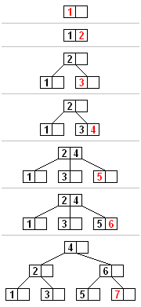

[TOC]

# B/B+树

## B树

`(balance tree，自平衡树)`，是一种自平衡树，能够保持数据有序。

这种数据结构能够让查找数据，顺序访问，插入数据及删除的动作，都在对数时间内完成。

适用于读写相对大的数据块的存储系统，例如磁盘。

### 结构

- 根节点

  子节点数量可以为0

- 内部节点

  除叶子节点和根节点之外的所有节点，可以拥有**可变数量**的子节点；

- 叶子节点

  没有子节点，也没有指向子节点的指针；

一个m阶的B树有以下属性：

1. 所有节点关键字按照递增次序排列，并遵循左小右大原则
2. 每一个节点最多有m个子节点
3. 每个非叶子结点（除根节点）最少有`m/2`个子节点
4. 如果根节点不是叶子结点，那么它至少有2个子节点
5. 有k个子节点的非叶子节点拥有`k-1`个键
6. 所有叶子节点都在同一层

### 搜索

从根节点开始，从上到下递归遍历树；

例，搜索字母E：

1. 先拿根节点比较，E<M，向左找
2. 拿到D和G，D<E<G，找中间
3. 拿到E和F，E=E，返回关键字和指针信息，如果找不到就返回null

### 插入

插入一条记录（key-value）：如果B树中已存在需要插入的键值对，用新的value替换旧的value；如果不存在，进行插入操作：

1. 判断当前节点key的个数是否小于等于最大值

   - 满足

     根据要插入的key值，找到叶子节点并插入，结束。

   - 不满足

     1. 从该节点的原有元素和新的元素中选择出中位数
     2. 小于这个中位数的元素放入左边节点，大于这个中位数的元素放入右边节点，中位数作为分隔值
     3. 分隔值被插入到父节点中，可能会造成父节点分裂，分裂父节点时可能又会使它的父节点分裂，一直上升到根节点；如果没有父节点，就创建一个新的根节点（增加高度）

例：向B树插入数据：

### 删除

有两种常用的删除策略：

1. 定位并删除元素，调整树
2. 从上到下调整树，遇到要删的元素直接删除

### 缺点

- 无法改变键值的最大长度

## B+树

## 参考

- [维基百科-B树](https://zh.wikipedia.org/wiki/B%E6%A0%91)
- [维基百科-B+树](https://zh.wikipedia.org/wiki/B%2B%E6%A0%91)
- [B树和B+树的插入、删除图文详解](https://www.cnblogs.com/nullzx/p/8729425.html)

