English | [中文版](binary_tree_zh.md)

# Binary Tree

[TOC]


A binary tree is a tree in which no node can have more than two children. A property of a binary tree that is sometimes important is that the depth of an average binary tree is considerably smaller than $N$.

## Binary Tree

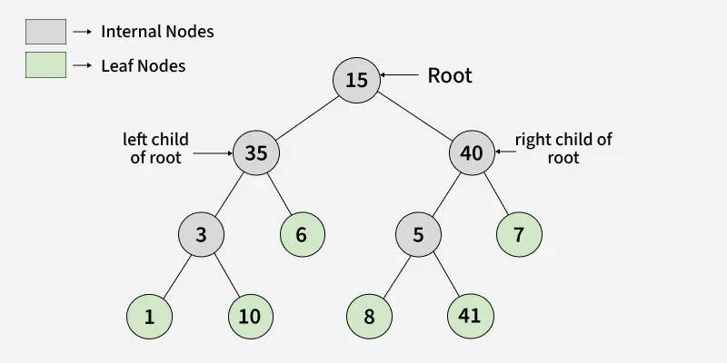

### Properties

- The maximum number of nodes at level $L$ The height of a binary tree is $2^L$.
- The maximum number of nodes in a binary tree of height $H$ is $2^{H+1} – 1$.
- Total number of leaf nodes in a binary tree = total number of nodes with $2$ children + $1$.
- In a Binary Tree with $N$ nodes, the minimum possible height, or the minimum number of levels is $\lfloor \log_2 N \rfloor$.
- A Binary Tree with $L$ leaves have at least $\lceil \log_2 L \rceil + 1$ levels.

### Types

#### Full Binary Tree

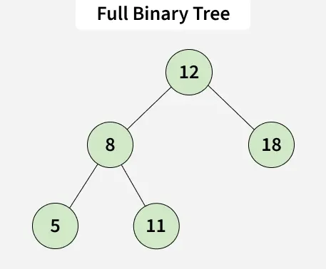

A full Binary tree is a special type of binary tree in which every parent node/internal node has either two or no children.

#### Degenerate Binary Tree

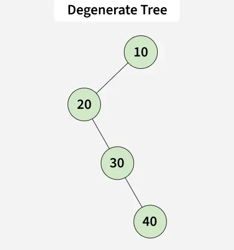

A degenerate or pathological tree is a tree having a single child, either left or right.

#### Skewed Binary Tree

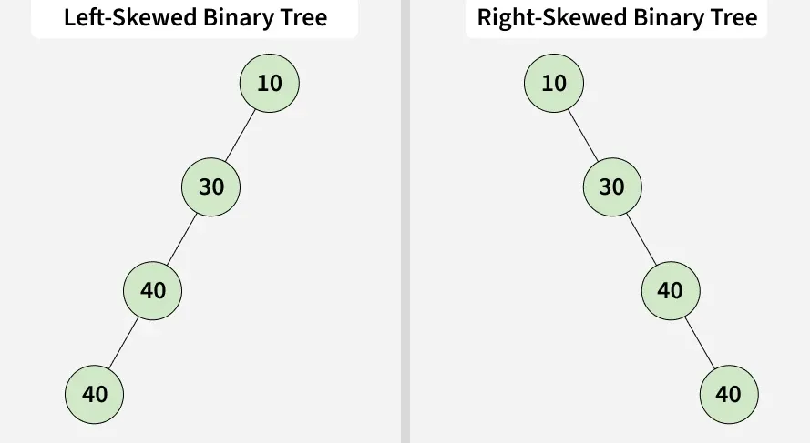

A skewed binary tree is a pathological/degenerate tree in which the tree is either dominated by the left nodes or the right nodes. Thus, there are two types of skewed binary trees:

- left-skewed binary tree.
- right-skewed binary tree.

#### Complete Binary Tree

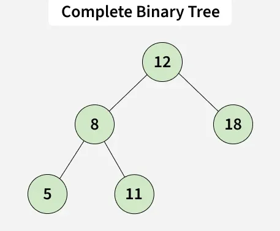

A complete binary tree is just like a full binary tree, but with two major differences

1. Every level must be completely filled
2. All the leaf elements must lean towards the left.
3. The last leaf element might not have a right sibling, i.e. a complete binary tree doesn't have to be a full binary tree.

#### Perfect Binary Tree

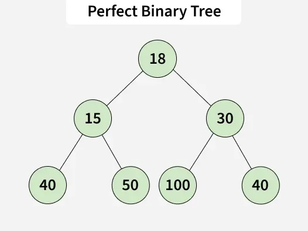

A perfect binary tree is a type of binary tree in which every internal node has exactly two child nodes and all the leaf nodes are at the same level.

#### Balanced Binary Tree

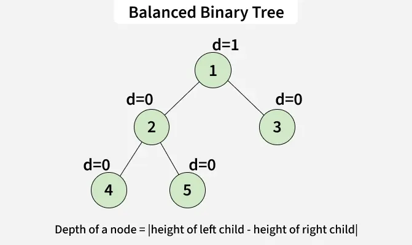

It is a type of binary tree in which the difference between the height of the left and the right subtree for each node is either 0 or 1.

#### Others

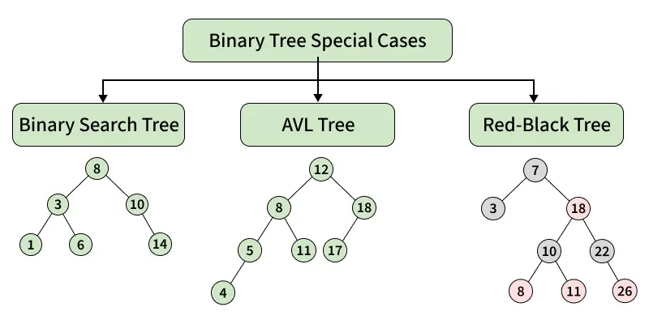

### Node

Implementation:

```c++
struct node
{
  int data;
  node* left;
  node* right;
  
  node(int val) : data(val), left(nullptr), right(nullptr) {}
};
```

### Insertion

Example:

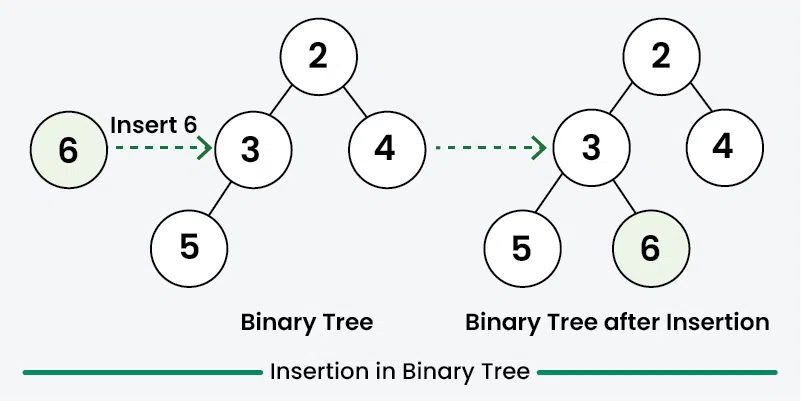

Implementation:

```c++
Node* insert_node(Node* root, int data) 
{
  // If the tree is empty, assign new Node address to root
  if (root == nullptr) 
  {
    root = new Node(data);
    return root;
  }

  // Else, do level order traversal until we find an empty
  // place, i.e. either left child or right child of some
  // Node is pointing to NULL.
  std::queue<Node*> q;
  q.push(root);
  while (!q.empty()) 
  {  
    // Fron a front element in queue
    Node* curr = q.front();
    q.pop();

    // First check left if left is null 
    // insert Node in left otherwise check for right
    if (curr->left == nullptr)
    {
      curr->left = new Node(data);
      return root;
    }
    q.push(curr->left);

    if (curr->right == nullptr)
    {
      curr->right = new Node(data);
      return root;
      
    }
    q.push(curr->right);
  }
  return root;
};
```

Complexity:

| Scenario     | Time Complexity | Space Complexity |
| :----------- | :-------------- | :--------------- |
| Best Case    | $O(1)$          | $O(1)$           |
| Average Case | $O(n)$          | $O(n)$           |
| Worst Case   | $O(n)$          | $O(n)$           |

This insertion uses a level-order traversal with a queue to find the first available child position.
If the tree is empty, or the root immediately has an empty child slot, the insertion finishes in constant time. In the average and worst cases, the algorithm may visit most nodes before finding an empty position, and the queue can grow to hold a full level of the tree, which is $O(n)$ in the worst case.

### Deletion

Example:

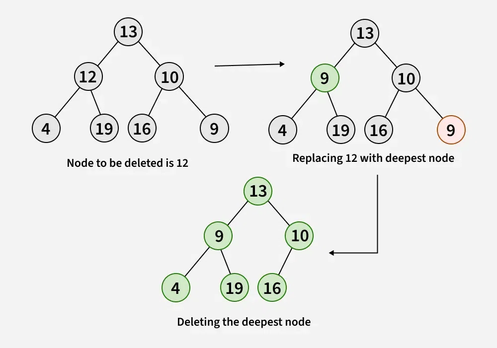

Implementation:

```sql
void delete_deepst(Node* root, Node* deep_node) 
{
  std::queue<Node*> q;
  q.push(root);
  Node* curr;
  while (!q.empty()) 
  {
    curr = q.front();
    q.pop();

    // If current node is the deepest node, delete it
    if (curr == deep_node) 
    {  
      curr = nullptr;
      delete (deep_node);
      return;
    }

    // Check the right child first
    if (curr->right) 
    {
      // If right child is the deepest node, delete it
      if (curr->right == deep_node) 
      {
        curr->right = nullptr;
        delete (deep_node);
        return;
      } 
      q.push(curr->right);
    }

    // Check the left child
    if (curr->left) 
    {
      // If left child is the deepest node, delete it
      if (curr->left == deep_node) 
      {
        curr->left = nullptr;
        delete (deep_node);
        return;
      } 
      q.push(curr->left);
    }
  }
};

Node* deletion(Node* root, int key) 
{
  // If the tree is empty, return null
  if (root == nullptr)
      return nullptr;

  // If the tree has only one node
  if (root->left == nullptr && root->right == nullptr) 
  {
    // If the root node is the key, delete it
    if (root->data == key)
        return nullptr;
    else
        return root;
  }

  std::queue<Node*> q;
  q.push(root);
  Node* curr;
  Node* keyNode = nullptr;
  // Level order traversal to find the deepest node and the key node
  while (!q.empty()) 
  {
    curr = q.front();
    q.pop();

    // If current node is the key node
    if (curr->data == key)
        keyNode = curr;

    if (curr->left)
        q.push(curr->left);

    if (curr->right)
        q.push(curr->right);
  }

  // If key node is found, replace its data with the deepest node
  if (keyNode != nullptr) 
  {  
    // Store the data of the deepest node
    int x = curr->data;  
  
    // Replace key node data with deepest
    // node's data
    keyNode->data = x;  
  
    // Delete the deepest node
    delete_deepst(root, curr);  
  }
  return root;
};
```

Complexity:

| Scenario     | Time Complexity | Space Complexity |
| :----------- | :-------------- | :--------------- |
| Best Case    | $O(1)$          | $O(1)$           |
| Average Case | $O(n)$          | $O(n)$           |
| Worst Case   | $O(n)$          | $O(n)$           |

This deletion handles the trivial single-node tree in constant time. Otherwise, it performs a level-order traversal to locate both the target node and the deepest node, and if the target exists, it performs another level-order traversal to remove the deepest node. Each traversal is linear in the number of nodes, so the total time remains $O(n)$, and the queue may hold up to one full level of the tree, giving $O(n)$ auxiliary space in the worst case.

### Search

Example:

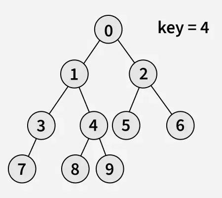

Implementation:

```c++
bool search(Node* root, int key) 
{
  if (root == nullptr) 
    return false;

  if (root->data == key) 
    return true;

  return search(root->left, key) || search(root->right, key);
}
```

Complexity:

| Scenario     | Time Complexity | Space Complexity |
| :----------- | :-------------- | :--------------- |
| Best Case    | $O(1)$          | $O(1)$           |
| Average Case | $O(n)$          | $O(h)$           |
| Worst Case   | $O(n)$          | $O(n)$           |

This search performs a recursive depth-first traversal. Because a general binary tree does not enforce any ordering between nodes, the algorithm may need to inspect many nodes before finding the key, so the average and worst-case time complexity are both $O(n)$. The auxiliary space comes from the recursion stack: it is $O(h)$ for a tree of height $h$, which becomes $O(n)$ in the worst case for a skewed tree.

---


## Binary Search Trees

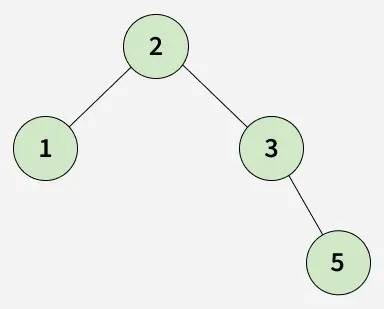

Binary search tree is a data structure that quickly allows us to maintain a sorted list of numbers.

### Properties

- All nodes of left subtree are less than the root node
- All nodes of right subtree are more than the root node
- Both subtrees of each node are also BSTs i.e. they have the above two properties

### Nodes

Implementation:

```c++
struct Node 
{
    int data;
    Node* left;
    Node* right;

    Node(int val) 
    {
        data = val;
        left = right = nullptr;
    }
};
```

### Insert

Example:

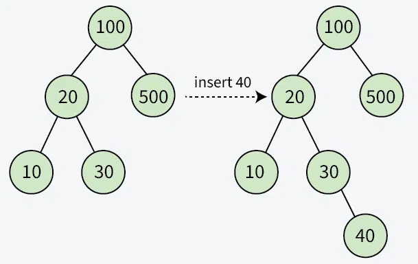

Implementation:

```c++
Node* insert(Node* root, int key) 
{
    // If the tree is empty, return a new node
    if (root == nullptr)
        return new Node(key);

    // Otherwise, recur down the tree
    if (key < root->data)
        root->left = insert(root->left, key);
    else
        root->right = insert(root->right, key);

    // Return the (unchanged) node pointer
    return root;
}
```

Complexity:

| Scenario     | Time Complexity | Space Complexity |
| :----------- | :-------------- | :--------------- |
| Best Case    | $O(1)$          | $O(1)$           |
| Average Case | $O(\log n)$     | $O(\log n)$      |
| Worst Case   | $O(n)$          | $O(n)$           |

This insertion follows one root-to-leaf path. Therefore, its running time is proportional to the tree height $h$, i.e. $O(h)$. In a reasonably balanced BST, $h = O(\log n)$, while in a skewed BST, $h = O(n)$. Because this implementation is recursive, the auxiliary space is also $O(h)$ Due to the call stack.

### Delete

Example:

- Case 1: Node has No Children (Leaf Node)

  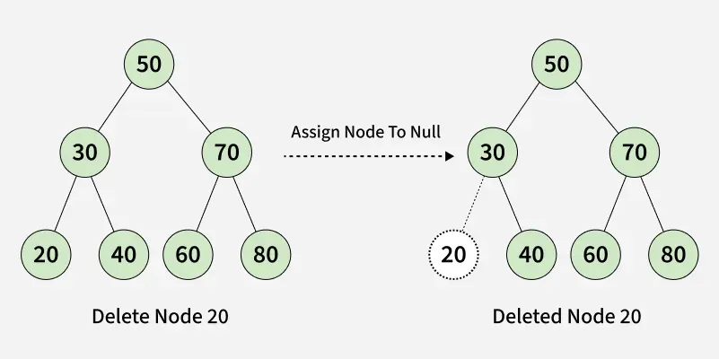

- Case 2: Node has One Child (Left or Right Child)

  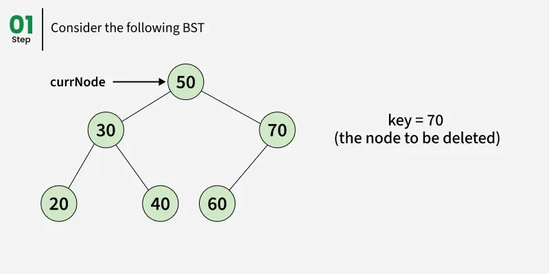

  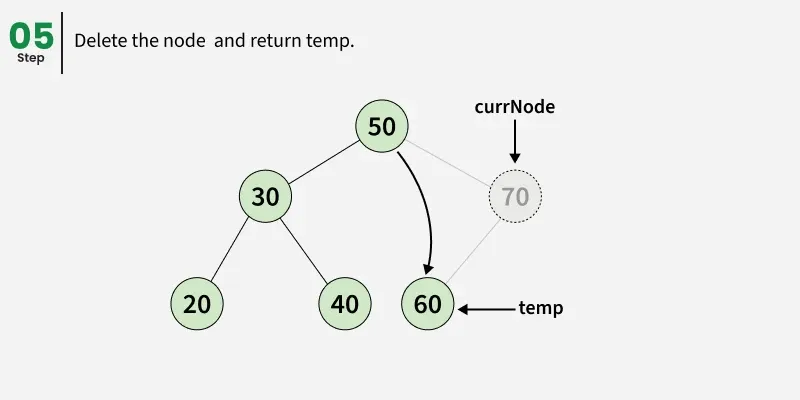

- Case 3: Node has Two Children

  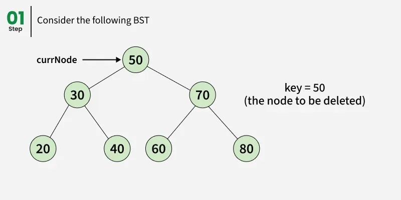

  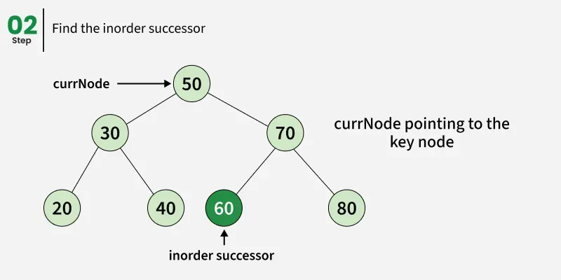

  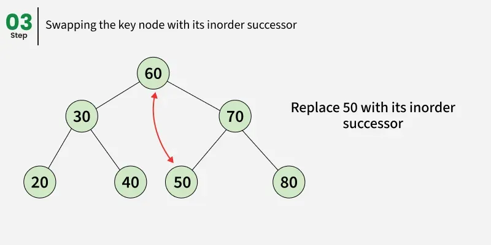

  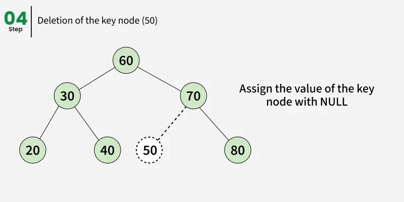

  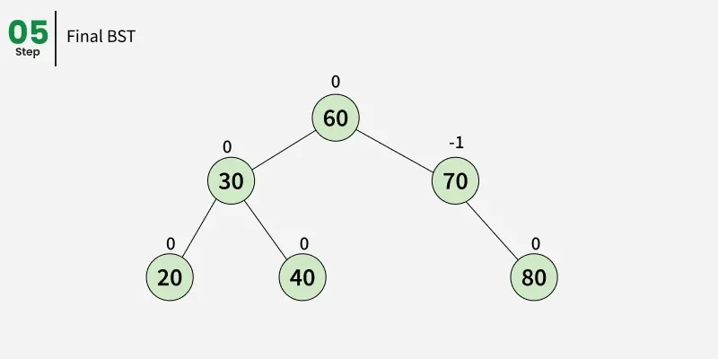

Implementation:

```c++
// Delete a node with value x from BST
Node* del_node(Node* root, int x) 
{
    if (root == nullptr)
        return root;

    if (root->data > x)
    {
        root->left = del_node(root->left, x);
    }
    else if (root->data < x)
    {
        root->right = del_node(root->right, x);
    }
    else 
    {
        // Node with 0 or 1 child
        if (root->left == nullptr) 
        {
            Node* temp = root->right;
            delete root;
            return temp;
        }
        if (root->right == nullptr) 
        {
            Node* temp = root->left;
            delete root;
            return temp;
        }

        // Node with 2 children
        Node* curr = root->right;
        while (curr != nullptr && curr->left != nullptr)
            curr = curr->left;

        root->data = curr->data;
        root->right = del_node(root->right, curr->data);
    }
    return root;
}
```

Complexity:

| Scenario     | Time Complexity | Space Complexity |
| :----------- | :-------------- | :--------------- |
| Best Case    | $O(1)$          | $O(1)$           |
| Average Case | $O(\log n)$     | $O(\log n)$      |
| Worst Case   | $O(n)$          | $O(n)$           |

This deletion also follows paths whose length is bounded by the tree height $h$, so its running time is $O(h)$. In a balanced BST, $h = O(\log n)$; in a skewed BST, $h = O(n)$. The implementation is recursive, so auxiliary space is $O(h)$ due to the recursion stack.

### Search

Example:

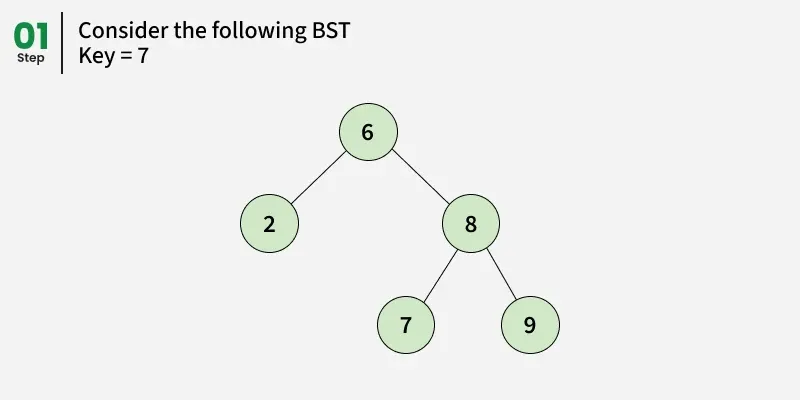

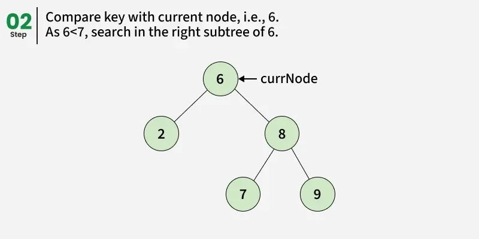

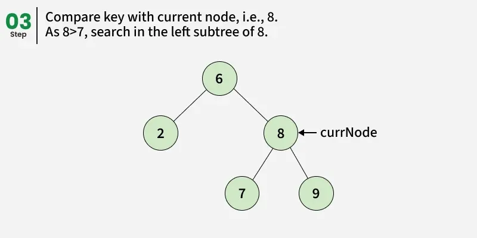

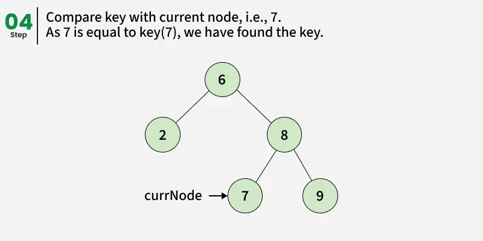

Implementation:

```c++
bool search(Node* root, int key) 
{
    // root is null -> return false
    if (root == nullptr) 
        return false;

    // if root has key -> return true
    if (root->data == key) 
        return true;

    if (key > root->data) 
        return search(root->right, key);
    else
        return search(root->left, key);
}
```

Complexity:

| Scenario     | Time Complexity | Space Complexity |
| :----------- | :-------------- | :--------------- |
| Best Case    | $O(1)$          | $O(1)$           |
| Average Case | $O(\log n)$     | $O(\log n)$      |
| Worst Case   | $O(n)$          | $O(n)$           |

This search examines at most one root-to-leaf path, so the running time is $O(h)$, where $h$ is the tree height. In a balanced BST, $h = O(\log n)$, while in a skewed BST, $h = O(n)$. Because the implementation is recursive, auxiliary space is $O(h)$ due to the recursion stack.

### Average-Case Analysis

The sum of the depths of all nodes in a tree is known as the `internal path length`.

**Result** The average depth over all nodes in a tree is $O(\log N)$ on the assumption that all insertion sequences are equally likely.

**Proof** Let $D(N)$ be the internal path length for some tree $T$ of $N$ nodes. $D(1) = 0$. An N-node tree consists of an $i$-node left subtree and an $(N - i - 1)$-node right subtree, plus a root at depth zero for $0 \leq i < N$. $D(i)$ is the internal path length of the left subtree with respect to tis root. In the main tree, all these nodes are one level deeper. The same holds for the right subtree. Thus, we get the recurrence: 
$$
D(N) = D(i) + D(N-i-1) + N - 1
$$
, If all subtree sizes are equally likely, which is true for binary search trees (since the subtree size depends only on the relative rank of the first element inserted into the tree), but not binary trees, then the average value of both $D(i)$ and $D(N - i - 1)$ is $(1/N) \sum_{j=0}^{N-1} D(j)$. This yields:
$$
D(N) \frac{2}{N} \left[ \sum_{j=0}^{N-1} D(j)\right] + N - 1
$$
, obtaining an average value of $D(N) = O(N \log N)$. Thus, the expected depth of any node is $O(logN)$.

---


## Balanced Binary Tree

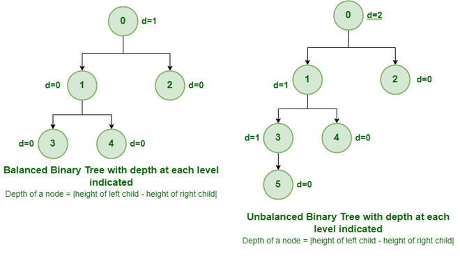

A balanced binary tree is a tree where the heights of the left and right subtrees of any node differ by at most one. This balance condition is maintained through rotations during insertions and deletions.

### Property

- The height difference between the lseft and right subtrees of any node is at most 1.
- Both the left and right subtrees are also balanced binary trees.
- The height of an empty tree is considered -1.
- The height of a tree with one node is 0.

### Rotation

Algorithm:

- Right Rotation
  1. Make the left child of the current node the new root of the subtree.
  2. Make the old root the right child of the new root.
  3. Update the heights of the nodes.
- Left Rotation
  1. Make the right child of the current node the new root of the subtree.
  2. Make the old root the left child of the new root.
  3. Update the heights of the nodes.

Implement:

```c++
// Right rotation function
Node* rotate_right(Node* y)
{
    Node* x = y->left;
    Node* T2 = x->right;

    x->right = y;
    y->left = T2;

    update_height(y);
    update_height(x);

    return x;
}

// Left rotation function
Node* rotate_left(Node* x)
{
    Node* y = x->right;
    Node* T2 = y->left;

    y->left = x;
    x->right = T2;

    update_height(x);
    update_height(y);

    return y;
}
```

Complexity:

| Scenario     | Time Complexity | Space Complexity |
| :----------- | :-------------- | :--------------- |
| Best Case    | $O(1)$          | $O(1)$           |
| Average Case | $O(1)$          | $O(1)$           |
| Worst Case   | $O(1)$          | $O(1)$           |

A single left or right rotation updates a fixed number of pointers and recomputes heights for a constant number of nodes. No traversal is needed, and only a few temporary pointers are used, so both time and auxiliary space are $O(1)$ in all cases.

### Insert

Algorithm:

1. Perform a standard BST insertion.
2. Update the height of the ancestors nodes.
3. Check the balance factor of the ancestors.
4. If the node becomes unbalanced, perform one of the four rotations:
   - Left-Left Case: Right Rotation
   - Left-Right Case: Left Rotation followed by Right Rotation
   - Right-Right Case: Left Rotation
   - Right-Left Case: Right Rotation followed by Left Rotation

Implement:

```c++
Node* insert(Node* node, int key)
{
    // Perform the normal BST insertion
    if (!node)
        return new Node(key);

    if (key < node->data)
        node->left = insert(node->left, key);
    else if (key > node->data)
        node->right = insert(node->right, key);
    else
        return node; // Duplicate keys are not allowed

    // Update height of this ancestor node
    node->height = 1 + std::max(height(node->left), height(node->right));

    // Get the balance factor to check whether this node became unbalanced
    int balance = (node ? height(node->left) - height(node->right) : 0);

    // If the node becomes unbalanced, there are 4 cases Left Left Case
    if (balance > 1 && key < node->left->data)
        return rotate_right(node);

    // Right Right Case
    if (balance < -1 && key > node->right->data)
        return rotate_left(node);

    // Left Right Case
    if (balance > 1 && key > node->left->data) 
    {
        node->left = rotate_left(node->left);
        return rotate_right(node);
    }

    // Right Left Case
    if (balance < -1 && key < node->right->data) 
    {
        node->right = rotate_right(node->right);
        return rotate_left(node);
    }

    return node;
}
```

Complexity:

| Scenario     | Time Complexity | Space Complexity |
| :----------- | :-------------- | :--------------- |
| Best Case    | $O(1)$          | $O(1)$           |
| Average Case | $O(\log n)$    | $O(\log n)$      |
| Worst Case   | $O(\log n)$    | $O(\log n)$      |

Balanced binary tree insertion (e.g., AVL insertion) first follows a single root-to-leaf path, then may perform one or two local rotations while returning up that same path. Since the tree height is kept at $h = O(\log n)$, the insertion time is $O(\log n)$ in average and worst cases. The recursive implementation uses call-stack space proportional to height, so auxiliary space is $O(\log n)$ (and $O(1)$ in the best case when inserting into an empty tree).

### Delete

Algorithm:

1. Perform a standard BST deletion.
2. Update the height of the ancestors nodes.
3. Check the balance factor of the ancestors.
4. If the node becomes unbalanced, perform one of the four rotations as in insertion.

Implement:

```c++
// Function to delete a node
Node* remove(Node* node, int key)
{
    // Perform standard BST delete
    if (!node)
        return nullptr;

    if (key < node->data)
    {
        node->left = remove(node->left, key);
    }
    else if (key > node->data)
    {
        node->right = remove(node->right, key);
    }
    else 
    {
        if (!node->left || !node->right) 
        {
            Node* temp = (node->left ? node->left : node->right);
            if (!temp) 
            {
                temp = node;
                node = nullptr;
            }
            else
            {
                *node = *temp;
            }
            delete temp;
        }
        else {
            Node* temp = find_min(node->right);
            node->data = temp->data;
            node->right = remove(node->right, temp->data);
        }
    }

    if (!node)
        return nullptr;

    // Update height of the current node
    update_height(node);

    // Get the balance factor
    int balance = balance_factor(node);

    // Balance the node if it has become unbalanced

    // Left Left Case
    if (balance > 1 && balance_factor(node->left) >= 0)
        return rotate_right(node);

    // Left Right Case
    if (balance > 1 && balance_factor(node->left) < 0) {
        node->left = rotate_left(node->left);
        return rotate_right(node);
    }

    // Right Right Case
    if (balance < -1 && balance_factor(node->right) <= 0)
        return rotate_left(node);

    // Right Left Case
    if (balance < -1
        && balance_factor(node->right) > 0) {
        node->right = rotate_right(node->right);
        return rotate_left(node);
    }

    return node;
}
```

Complexity:

| Scenario     | Time Complexity | Space Complexity |
| :----------- | :-------------- | :--------------- |
| Best Case    | $O(1)$          | $O(1)$           |
| Average Case | $O(\log n)$    | $O(\log n)$      |
| Worst Case   | $O(\log n)$    | $O(\log n)$      |

Balanced binary tree deletion (e.g., AVL deletion) follows a root-to-node path to remove the key, then updates heights and rebalances on the way back toward the root. The rebalancing at each visited node is constant-time, and at most one root-to-leaf path is involved, so total time is $O(h) = O(\log n)$ for average and worst cases. With this recursive implementation, auxiliary space is the recursion stack $O(h)=O(\log n)$ (and $O(1)$ in the best case, such as deleting the only node).


---


## Expression Tree

The expression tree is a binary tree in which each internal node corresponds to the operator and each leaf node corresponds to the operand.

In expression trees, leaf nodes are operands and non-leaf nodes are operators. That means an expression tree is a binary tree where internal nodes are operators and leaves are operands. An expression tree consists of binary expressions. But for a unary operator, one subtree will be empty. 

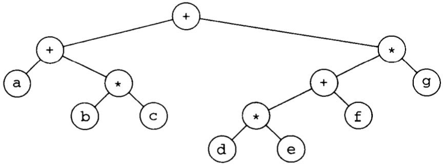

Expression tree for $(a+b*c)+((d*e+f)*g)$

### Construction

- The user will provide a postfix expression for which the program will construct the expression tree. 
- In-order traversal of a binary tree/expression tree will provide an Infix expression of the given input.

### Example

Constructing an Expression Tree:

1. suppose the input is: `a b + c d e + * *`

2. The first two symbols are operands, so we create one-node trees and push pointers to them onto a stack

   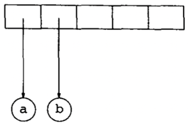

3. A `+` is read, so two pointers to trees are popped, a new tree is formed, and a pointer to it is pushed onto the stack

   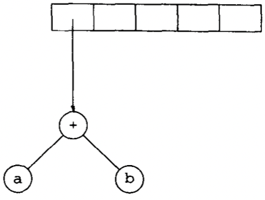

4. c, d, and e are read, and for each a one-node tree is created and a pointer to the corresponding tree is pushed onto the stack

   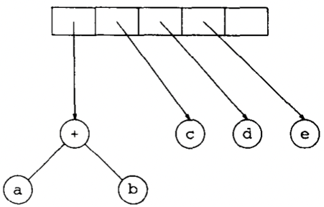

5. a `+` is read, so two trees are merged

   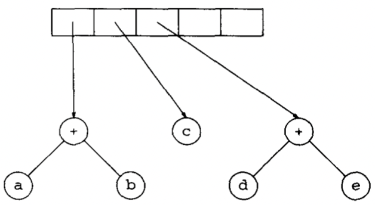

6. A `*` is read, so we pop two tree pointers and form a new tree with a `*` as root

   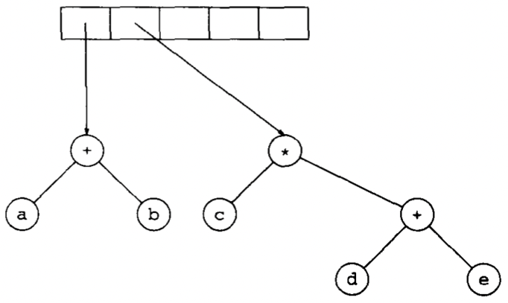

7. The last symbol is read, two trees are merged, and a pointer to the final tree is left on the stack

   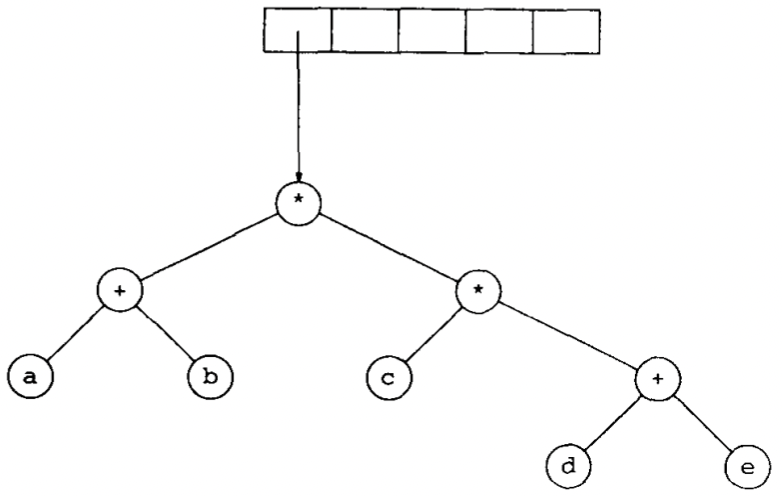

### Implement

```c++
struct Node 
{
	std::string token;
	Node* left;
	Node* right;

	explicit Node(const std::string& t) : token(t), left(nullptr), right(nullptr) {}
};

bool is_operator(const std::string& token) 
{
	return token == "+" || token == "-" || token == "*" || token == "/" || token == "^";
}

int precedence(const std::string& op) 
{
	if (op == "+" || op == "-") return 1;
	if (op == "*" || op == "/") return 2;
	if (op == "^") return 3;
	return 0;
}

bool is_number(const std::string& token) 
{
	if (token.empty()) 
        return false;

	size_t i = 0;
	if (token[i] == '-') 
    {
		if (token.size() == 1) return false;
		++i;
	}
	for (; i < token.size(); ++i)
		if (!isdigit(static_cast<unsigned char>(token[i]))) 
            return false;

	return true;
}

std::vector<std::string> tokenize(const std::string& expr) 
{
	std::vector<std::string> tokens;
	for (size_t i = 0; i < expr.size();) 
    {
		const char c = expr[i];
		if (isspace(static_cast<unsigned char>(c))) 
        {
			++i;
			continue;
		}

		// Support negative integers, e.g., -12 or (3 + -5).
		if (c == '-' 
            && i + 1 < expr.size() 
            && isdigit(static_cast<unsigned char>(expr[i + 1])) 
            && (tokens.empty() || tokens.back() == "(" || is_operator(tokens.back()))) 
        {
			size_t j = i + 1;
			while (j < expr.size() && isdigit(static_cast<unsigned char>(expr[j]))) 
                ++j;

			tokens.push_back(expr.substr(i, j - i));
			i = j;
			continue;
		}

		if (isdigit(static_cast<unsigned char>(c))) 
        {
			size_t j = i;
			while (j < expr.size() && isdigit(static_cast<unsigned char>(expr[j]))) 
                ++j;

			tokens.push_back(expr.substr(i, j - i));
			i = j;
			continue;
		}

		if (c == '(' || c == ')' || c == '+' || c == '-' || c == '*' || c == '/' || c == '^') 
        {
			tokens.push_back(std::string(1, c));
			++i;
			continue;
		}

		throw std::invalid_argument("Unsupported character in expression.");
	}
	return tokens;
}

std::vector<std::string> infix_to_postfix(const std::vector<std::string>& tokens) 
{
	std::vector<std::string> output;
	std::stack<std::string> ops;
	for (const std::string& token : tokens) 
    {
		if (is_number(token)) 
        {
			output.push_back(token);
		} 
        else if (token == "(") 
        {
			ops.push(token);
		} 
        else if (token == ")") 
        {
			while (!ops.empty() && ops.top() != "(") 
            {
				output.push_back(ops.top());
				ops.pop();
			}
			if (ops.empty())
				throw std::invalid_argument("Mismatched parentheses.");

			ops.pop();
		} 
        else if (is_operator(token)) 
        {
			while (!ops.empty() 
                && is_operator(ops.top()) 
                && (precedence(ops.top()) > precedence(token) 
                    || (precedence(ops.top()) == precedence(token) 
                    && token != "^"))) 
            {
				output.push_back(ops.top());
				ops.pop();
			}
			ops.push(token);
		} 
        else 
        {
			throw std::invalid_argument("Invalid token.");
		}
	}

	while (!ops.empty()) 
    {
		if (ops.top() == "(" || ops.top() == ")") 
			throw std::invalid_argument("Mismatched parentheses.");

		output.push_back(ops.top());
		ops.pop();
	}

	return output;
}

Node* build_expression_tree(const std::vector<std::string>& postfix) 
{
	std::stack<Node*> st;
	for (const std::string& token : postfix) 
    {
		if (is_number(token)) 
        {
			st.push(new Node(token));
		} 
        else if (is_operator(token)) 
        {
			if (st.size() < 2)
				throw std::invalid_argument("Invalid postfix expression.");

			Node* right = st.top(); st.pop();
			Node* left = st.top(); st.pop();

			Node* opNode = new Node(token);
			opNode->left = left;
			opNode->right = right;
			st.push(opNode);
		}
        else 
        {
			throw std::invalid_argument("Invalid token in postfix expression.");
		}
	}

	if (st.size() != 1)
		throw std::invalid_argument("Invalid postfix expression.");

	return st.top();
}

double evaluate(Node* root) 
{
	if (!root) 
        throw std::invalid_argument("Empty tree.");

	if (!is_operator(root->token))
		return std::stod(root->token);

	const double leftVal = evaluate(root->left);
	const double rightVal = evaluate(root->right);

	if (root->token == "+") 
        return leftVal + rightVal;
	if (root->token == "-") 
        return leftVal - rightVal;
	if (root->token == "*") 
        return leftVal * rightVal;
	if (root->token == "/") 
    {
		if (rightVal == 0.0)
			throw std::domain_error("Division by zero.");

		return leftVal / rightVal;
	}
	if (root->token == "^") 
        return std::pow(leftVal, rightVal);

	throw std::invalid_argument("Unknown operator.");
}

void inorder(Node* root) 
{
	if (!root) 
        return;

	const bool op = is_operator(root->token);
	if (op) 
        std::cout << "(";

	inorder(root->left);
	std::cout << root->token;
	inorder(root->right);
	if (op) 
        std::cout << ")";
}

void preorder(Node* root) 
{
	if (!root) 
        return;

	std::cout << root->token << " ";
	preorder(root->left);
	preorder(root->right);
}

void postorder(Node* root) 
{
	if (!root) 
        return;

	postorder(root->left);
	postorder(root->right);
	std::cout << root->token << " ";
}

void delete_tree(Node* root) 
{
	if (!root) 
        return;

	delete_tree(root->left);
	delete_tree(root->right);
	delete root;
}

std::string join_tokens(const std::vector<std::string>& tokens) 
{
	std::ostringstream out;
	for (size_t i = 0; i < tokens.size(); ++i) 
    {
		if (i) out << ' ';
		out << tokens[i];
	}
	return out.str();
}
```

Complexity:

| Scenario     | Time Complexity | Space Complexity |
| :----------- | :-------------- | :--------------- |
| Best Case    | $O(1)$          | $O(1)$           |
| Average Case | $O(\log n)$     | $O(\log n)$      |
| Worst Case   | $O(\log n)$     | $O(\log n)$      |

---


## Reference

[1] Thomas H.Cormen; Charles E.Leiserson; Ronald L. Rivest; Clifford Stein. Introduction to Algorithms. 3th Edition

[2] Mark Allen Weiss.Data Structures and Algorithm Analysis in C++.4ED

[3] [Balanced Binary Tree in C++](https://www.geeksforgeeks.org/cpp/balanced-binary-tree-in-cpp/)

[4] [Check if a Binary Tree is BST or not](https://www.geeksforgeeks.org/dsa/a-program-to-check-if-a-binary-tree-is-bst-or-not/)

[5] [Introduction to Binary Tree](https://www.geeksforgeeks.org/dsa/introduction-to-binary-tree/)

[6] [Binary Search Tree](https://www.geeksforgeeks.org/dsa/binary-search-tree-data-structure/)

[7] [Balanced Binary Tree](https://www.geeksforgeeks.org/dsa/balanced-binary-tree/)

[8] [Balanced Binary Tree definition & meaning in DSA](https://www.geeksforgeeks.org/dsa/balanced-binary-tree-definition-meaning-in-dsa/)

[9] [Balanced Binary Tree in C++](https://www.geeksforgeeks.org/cpp/balanced-binary-tree-in-cpp/)
