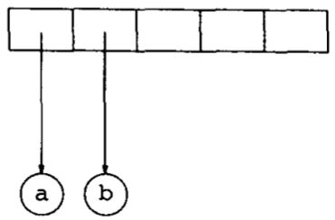
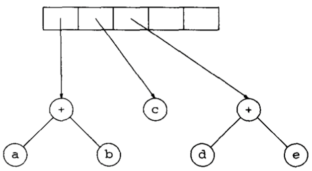
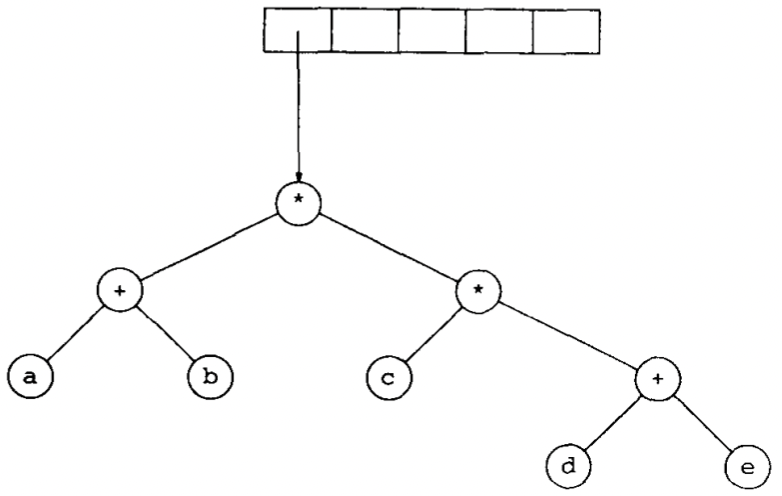
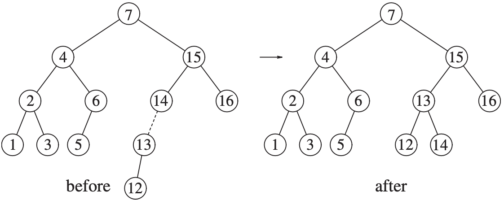

# 二叉树

<!-- vim-markdown-toc GFM -->

* [术语](#术语)
* [一般二叉树](#一般二叉树)
* [表达式树](#表达式树)
    - [实现](#实现)
    - [示例](#示例)
* [二叉查找树](#二叉查找树)
    - [插入](#插入)
    - [删除](#删除)
    - [查找](#查找)
    - [示例](#示例-1)
* [AVL树](#avl树)
    - [单旋转（single rotation）](#单旋转single-rotation)
    - [双旋转（double rotation）](#双旋转double-rotation)
* [伸展树](#伸展树)
* [B树](#b树)
* [红黑树](#红黑树)
* [标准库中的set和map](#标准库中的set和map)
    - [set](#set)
    - [map](#map)
    - [set和map的实现](#set和map的实现)
* [参考](#参考)

<!-- vim-markdown-toc -->


`二叉树（binary tree）` 是一棵每个结点都不能有多于两个儿子的树；平均二叉树的深度要比结点个数$N$小得多。


## 术语

`中缀表达式（infix expression）`

`中序遍历（inorder traversal）`

`后序遍历（postorder traversal）`

`前序遍历（preorder traversal）`


## 一般二叉树


*一般二叉树*

```c++
struct BinaryNode
{
  Object     element;
  BinaryNode *left;
  BinaryNode *right;
};
```


## 表达式树

### 实现

`表达式树（expression tree）` 树叶是`操作数（operand）`，其他结点是`操作符（operator）`。


$(a+b*c)+((d*e+f)*g)$的表达式树

### 示例

构造一棵表达式树：

1. 假设输入为 `a b + c d e + * *`；

2. 前两个符号是操作数，因此创建两棵单结点树并将指向它们的指针压入栈中；

   

3. "+"被读入，因此指向两棵树的指针被弹出，形成一棵新的树，并将指向它的指针压入栈中；

   

4. c，d和e被读入，在每个单结点树创建后，指向对应的树的指针被压入栈中；

   

5. 读入"+"号，因此两棵树合并；

   

6. 读入`"*"`号，因此，弹出两棵树的指针并形成一棵新的树，`"*"`号是他的根；

   

7. 读入最后一个符号，两棵树合并，而窒息那个最后的树的指针被留在栈中。

   


## 二叉查找树

二叉查找树的平均深度是$O(log\ N)$，一般不必担心栈空间用尽。

```c++
// 二叉查找树的框架
template <typename Comparable>
class BinarySearchTree
{
public:
    BinarySearchTree();
    BinarySearchTree(const BinarySearchTree& rhs);
    ~BinarySearchTree() {
        makeEmpty();
    };

private:
    struct BinaryNode
    {
        Comparable element;
        BinaryNode* left;
        BinaryNode* right;

        BinaryNode(const Comparable& theElement, BinaryNode* lt, BinaryNode* rt)
            : element(theElement), left(lt), right(rt) {}
    };

    BinaryNode* root;
};
```

### 插入

```c++
void insert(const Comparable& x, BinaryNode* & t) const {
        if (t == NULL)
            t = new BinarySearchTree(x, NULL, NULL);
        else if (x < t->element)
            insert(x, t->left);
        else if (t->element < x)
            insert(x, t->right);
        else
            // todo
};
```

### 删除

```c++
void remove(const Comparable& x, BinaryNode* & t) const {
        if (t == NULL)
            return;
        if (x < t->element)
            remove(x, t->left);
        else if(t->element < x)
            remove(x, t->right);
        else if(t->left != NULL && t->right != NULL)
        {
            t->element = findMin(t->right)->element;
            remove(t->element, t->right);
        }
        else
        {
            BinaryNode* oldNode = t;
            t = (t->left != NULL) ? t->left : t->right;
            delete oldNode;
        }
};
```

### 查找

```c++
    BinaryNode* findMin(BinaryNode* t) const {
        if (t == NULL)
            return NULL;
        if (t->left == NULL)
            return t;
        return findMin(t->left);
    };

    BinaryNode* findMax(Binarynode* t) const {
        if (t != NULL)
            while(t->right != NULL)
                t = t->right;
        return t;
    };
```

### 示例

TODO


## AVL树

`AVL(Adelson-Velskii and Landis)树` 带有平衡条件（balance condition）的二叉查找树；其必须满足以下条件：

1. 必须保证树的深度是$O(logN)$; 
2. 要求每个结点都必须有相同高度（高度最多相差1）的左子树和右子树；

```c++
struct AvlNode
{
    Comparable element;
    AvlNode*   left;
    AvlNode*   right;
    int        height;

    AvlNode(const Comparable& theElement, AvlNode* lt, AvlNode* rt, int h = 0)
        : element(theElement), left(lt), right(rt), height(h){};

  	// 使用后序遍历计算高度
    int height(AvlNode* t) const 
    {
        return t == NULL ? -1 : t->height;
    }

    void insert(const Comparable& x, AvlNode* &t)
    {
        if (t == NULL)
            t = new AvlNode(x, NULL, NULL);
        else if(x < t->element)
        {
            insert(x, t->left);
            if (height(t->left) - height(t->right) == 2)
                if (x < t->left->element)
                    rotateWithLeftChild(t);
                else
                    doubleWithLeftChild(t);
        }
        else if(t->element < x)
        {
            insert(x, t->right);
            if (height(t->right) - height(t->left) == 2)
                if (t->right->element < x)
                    rotateWithRightChild(t);
                else
                    doubleWithRightChild(t);
        }
        else
            // TODO
        t->height = max(height(t->left), height(t->right)) + 1;
    }

    void rotateWithLeftChild(AvlNode* & k2)
    {
        AvlNode *k1 = k2->left;
        k2->left = k1->right;
        k1->right = k2;
        k2->height = max(height(k2->left), height(k2->right)) + 1;
        k1->height = max(height(k1->left), k2->height) + 1;
        k2 = k1;
    }

    void doubleWithLeftChild(AvlNode * & k3)
    {
        rotateWithRightChild(k3->left);
        rotateWithLeftChild(k3);
    }
};
```

### 单旋转（single rotation）


*单旋转*

### 双旋转（double rotation）


*双旋转*

示例：

1. 插入15

   
   
2. 插入14

   

3. 插入13

   

4. 插入12

   

5. 插入11，10，8

   

6. 插入9

   


## 伸展树

`伸展树（splay tree）` 它保证从空树开始任意连续$M$次对树的操作最多花费$O(Mlog\ N)$时间；当一个节点被访问后，它就要经过一系列AVL树的旋转被推到根上。


## B树

参考[平衡树](balance_tree.md)


## 红黑树

参考[红黑树](rb_tree.md)


## 标准库中的set和map

### set

set是一个排序后的容器，该容器不允许重复；set特有的操作是高效的插入，删除和执行基本查找。

STL定义了以下insert/erase函数：

```c++
pair<iterator, bool> insert(const Object& x); // 如果已存在，插入失败
pair<iterator, bool> insert(iterator hint, const Object& x); // 如果已存在，插入失败

int erase(const Object& x);
iterator erase(iterator itr);
iterator erase(iterator start, iterator end);
```

使用示例：

```c++
set<int> s;
for (int i = 0; i < 1000000; i++)
  s.insert(s.end(), i);
```

### map

map用来存储排序后的由键和值组成的项的集合，键必须唯一，但是多个键可以对应同一值；所以只不需要唯一。

map的`operator[]`不能用于常量的map，例：

```c++
map<string, double> salaries;
salaries["Pat"] = 75000.00;

map<string, double>::const_iterator itr;
itr = salaries.find("Chris");
if (itr == salaries.end())
	cout << "end" << endl;
else
  cout << itr->second << endl;
```

### set和map的实现

C++需要set和map支持在最坏的情况下对基本的操作如：insert，erase和find仅消耗对数时间，底层实现是平衡二叉查找树（以RB-tree居多）。

如何高效地将迭代器推进到下一个节点的方法：

1. 当迭代器构造完成后，每一个迭代器都将一个包含set项的数组作为自己的数据存储；这没有用：这使得在修改过set后返回一个迭代器的任何例程的实现都不可能高效；例如：erase，insert。
2. 使迭代器维持一个栈，用来存储通向当前结点的路径上的结点。基于这个信息，可以推出在迭代器中的下一个结点，它可能是当前结点的右子树所包含的最小项，或者是最近的在其左子树中包含当前结点的祖先。这使得迭代器有一点大，并且使得迭代器的代码很笨拙。
3. 使查找树中的每一个结点除了存储其儿子外，也存储其父亲。迭代器不会很大，但是现在每个结点都需要额外的存储空间，而且迭代代码还是很笨拙。
4. 使每个结点保持额外的链接：一个至下一个较小结点，另一个至下一个较大结点。这样也占用空间，但是此时的迭代过程就很容易实现，而且很容易对这些链接进行维护。
5. 仅为那些左侧或右侧的链接为NULL的结点保持额外的链接，通过使用额外的布尔变量使得例程可以指示出是否一个左链接正在作为标准二叉查找树的左链接或者至下一个较小结点的链接而使用，对于右结点也做同样处理。


## 参考

[1] [美]Mark Allen Weiss.数据结构与算法分析-C++描述.3ED
