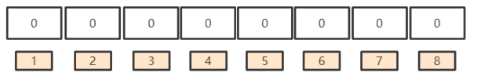
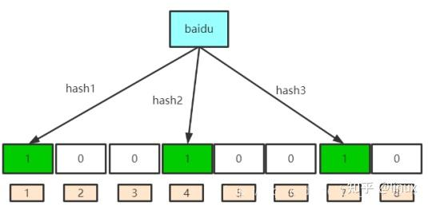
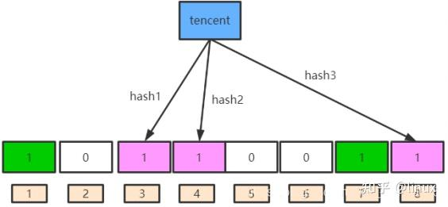
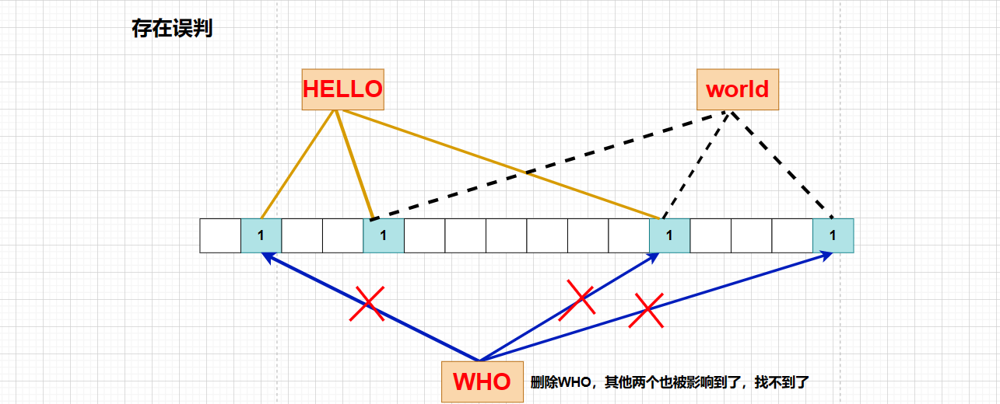

[Chinese](bloom_filter_zh.md) | English

# Bloom Filter

[TOC]

To determine whether an element is in a set, one generally thinks of saving all elements and then confirming by comparison. Data structures like linked lists, trees, and hash tables follow this approach. These data structures show disadvantages when faced with particularly large amounts of data:

- High storage capacity ratio; considering the load factor, usually the space cannot be completely filled
- When the data volume is particularly large, it will consume a lot of memory space. If you store keys like URLs, the memory consumption is too severe
- If using hashmap, once the existing elements exceed half of the total capacity, expansion generally needs to be considered, because as the number of elements increases, hash collisions will increase, reducing to the efficiency of linked list storage

The Bloom filter is a compact and ingenious probabilistic data structure proposed by Burton Howard Bloom in 1970. Its characteristics are efficient insertion and query, and it can tell you "a certain thing must not exist or may exist". It uses multiple hash functions to map data to a bitmap structure. This method not only improves query efficiency but also saves a lot of memory space. Bloom filters are generally used in scenarios with particularly large amounts of data.

## Principle

The principle of the Bloom filter is that when an element is added to a set, K hash functions map this element to K points in a bit array, and set them to 1. During retrieval, we only need to check whether these points are all 1s to (roughly) know whether the element is in the set or not: if any of these points is 0, the element being checked is definitely not present; if all are 1, the element being checked is likely present. This is the basic idea of Bloom filter. So a Bloom filter may produce false positives, but not false negatives.

Why does Bloom filter need to use multiple hash functions?

- The problem hash faces is collision. Assuming the hash function is good, if our bit array length is m points, then if we want to reduce the collision rate to, for example, 1%, this hash table can only accommodate m/100 elements
- The solution is relatively simple: use a Bloom filter with K > 1, that is, K functions map each element to K bits, because the false positive rate will be reduced significantly, and if parameters k and m are chosen well, approximately half of m will be set to 1

An important concept: for a specific hash function and a specific value, the value returned by that hash function is fixed every time. It is impossible for the return value to be different between multiple calls.

### Data Structure

A Bloom filter is a bit vector or a bit array (the numbers below are indexes). As shown in the figure:

### Addition and Query

Bloom filter addition principle: use K hash functions to pass the element into these K hash functions and map them to K points in the bit vector, and set the K mapped points to 1

Bloom filter query principle:

- Use K hash functions to pass the element into these K hash functions and map them to K points in the bit vector
- If any of these points is 0, the element being checked definitely does not exist
- If all these points return 1, the element being checked likely exists (because the Bloom filter has errors), but it's not necessarily 100% certain

For example, suppose our Bloom filter has three hash functions named hash1, hash2, and hash3:

1. For the element "baidu", we call three hash functions to map it to three positions in the bit vector (1, 4, 7 respectively), and set the corresponding positions to 1

   

2. Now for the element "tencent", we also call three hash functions to map it to three positions in the bit vector (3, 4, 8 respectively), and set the corresponding positions to 1

   

3. The positions 1, 3, 4, 7, 8 of the entire bit vector are now set to 1. The index 4 is overwritten because both "baidu" and "tencent" set it to 1. The overlapped index is related to the false positive rate.

4. Query an element that does not exist and confirm that it definitely does not exist: for example, suppose we query the element "dongshao", and calling the above three hash functions returns indexes 1, 5, 8. From the above figure, we know that the index 5 is 0, so the element "dongshao" definitely does not exist, because if it did exist, that position 5 should have been set to 1.

5. Query the element "baidu", but cannot determine with certainty that it exists: we pass "baidu" into the above three hash functions, the hash returns the corresponding index values 1, 4, 7. We find that the indexes 1, 4, 7 are all 1, so we determine that the element "baidu" may exist.

### Deletion

We generally cannot delete elements from a Bloom filter. Consider the following situations:

- Because we need to delete the element, we must be 100% sure that the element exists in the Bloom filter, but the Bloom filter, due to its false positive rate, cannot determine with certainty whether the element exists

  

- Also, counter wraparound can cause problems.

- If we delete a bit position corresponding to an element by setting it to 0, then if these bit positions are also being used by other elements, those other elements will return 0 when querying, thus thinking the element does not exist and causing false negatives.

## False Positive Rate

Bloom filters allow a certain degree of false judgments. The false positive rate is also called "false positive"

The false positive rate generally occurs during query

For example, when we query "baidu" above, since "baidu" was previously inserted, why can't we be 100% certain that it definitely exists?

- Because when the element "tencent" was inserted, it set index 4 to 1
- Suppose when we query "baidu", the actual return is that indexes 1, 7 are 1, and index 4 is 0. But index 4 was overwritten by tencent to 1, so finally "baidu" sees indexes 1, 4, 7 are all 1, and we cannot be 100% certain that the element "baidu" exists

Therefore, as more and more values are added, the number of bits in the bit vector that are set to 1 increases, thus the false positive rate becomes larger. For example, when querying "taobao", if all hash functions happen to return corresponding bits that are all 1, then the Bloom filter may also think the element "taobao" exists.

## False Positive Probability

**Assertion 1: The more hash functions and fewer inserted elements, the lower the false positive rate**

**Proof:**

Suppose the hash functions in the Bloom filter satisfy the simple uniform hashing assumption: each element is equally likely to hash to any of the m slots, independent of where other elements hash

If m is the number of bits (the length of the bit vector table), then the probability that a specific bit position is not set to 1 when an element is inserted by a specific hash function is:
$$
1 - \frac{1}{m}
$$
Then the probability that none of the k hash functions set it is, and as k increases, the probability becomes smaller:
$$
(1 - \frac{1}{m})^k
$$
If n elements are inserted, but none of them set it, the probability is:
$$
(1 - \frac{1}{m})^{kn}
$$
Now consider the query phase. If all k bits corresponding to a queried element are set to 1, we can determine it's in the set. Therefore, the probability p of falsely determining an element is:
$$
(1 - (1 - \frac{1}{m})^{kn})^k
$$
Now consider the query phase. If all k bits corresponding to a queried element are set to 1, we can determine it's in the set. Therefore, the probability p of falsely determining an element is:
$$
(1 - (1 - \frac{1}{m})^{kn})^k
$$
Since:
$$
(1 + x)^{\frac{1}{x}} \sim e
$$
When $x \rightarrow 0$, and:
$$
- \frac{1}{m}
$$
When m is large, approaches 0, so:
$$
(1 - (1 - \frac{1}{m})^{kn})^k = (1 - (1 - \frac{1}{m})^{-m \frac{-kn}{m}})^k \sim (1 - e^{-\frac{nk}{m}})^k
$$
From the above formula, it can be seen that when m increases or n decreases, the false positive rate decreases.

## Summary

Advantages:

- The time complexity of adding and querying elements is O(K), (K is the number of hash functions, generally quite small), independent of the data size.
- Hash functions are independent of each other, convenient for hardware parallel computing.
- The Bloom filter does not need to store the elements themselves, which has great advantages in certain situations with strict confidentiality requirements.
- When able to tolerate a certain false positive rate, the Bloom filter has great space advantages over other data structures.
- When the data volume is very large, the Bloom filter can represent the entire set, which other data structures cannot.
- Bloom filters using the same set of hash functions can perform intersection, union, and difference operations.

Disadvantages:

- It has false positive rate and cannot accurately determine whether an element is in the set (remedy: establish a whitelist, store data that may be falsely determined).
- Cannot retrieve the element itself.
- Generally does not provide deletion operations.

### Application Scenarios

- Scenarios where absolute accuracy is not required

  For example, when registering a nickname in a game: if it's not in the filter it definitely doesn't exist, it hasn't been used; if it is, it might be a false positive.

- Scenarios requiring high lookup efficiency

  On the client, look up a user's ID against the server's, adding a Bloom filter layer to improve lookup efficiency.

## References

[1] [Wikipedia - Bloom filter](https://en.wikipedia.org/wiki/Bloom_filter)

[2] [C++ Data Structures and Algorithms: Bloom Filter (Bloom Filter) Principles and Implementation](https://zhuanlan.zhihu.com/p/557308262)

[3] [C++ BloomFilter——Bloom Filter](https://cloud.tencent.com/developer/article/2341670)

