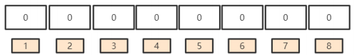
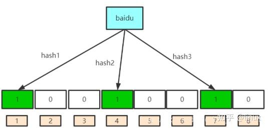
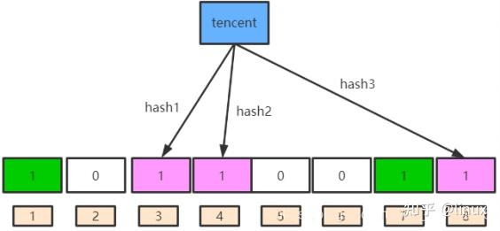
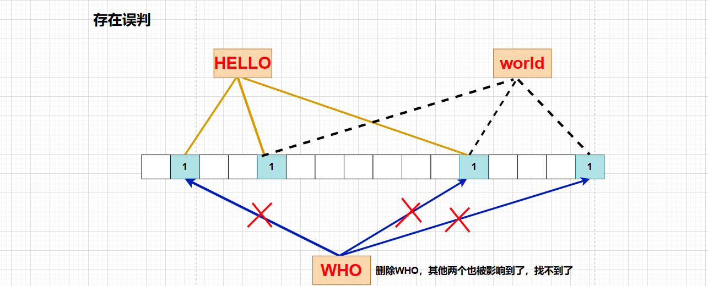

中文版 | [English](bloom_filter.md)

# 布隆过滤器

[TOC]

如果想要判断一个元素是不是在一个集合里，一般想到的是将所有元素保存起来，然后通过比较确定。链表，树、哈希表等数据结构都是这种思路。这些数据结构面对数据量特别大的时候显现的缺点：

- 存储容量占比高，考虑到负载因子的存在，通常空间是不能被用满的
- 当数据量特别大时，会占用大量的内存空间。如果存储了类似于URL这样的key，那么内存消费太严重
- 如果使用hashmap，如果已有元素超过了总容量的一半之后，一般就需要考虑扩容了，因为元素多了之后哈希冲突就会增加，退化为链表存储的效率了

布隆过滤器是由布隆（Burton Howard Bloom）在1970年提出的 一种紧凑型的、比较巧妙的概率型数据结构，特点是高效地插入和查询，可以用来告诉你 “某样东西一定不存在或者可能存在”，它是用多个哈希函数，将一个数据映射到位图结构中。此种方式不仅可以提升查询效率，也可以节省大量的内存空间。布隆过滤器一般使用在数据量特别大的场景下。

## 原理

布隆过滤器的原理是，当一个元素被加入集合时，通过K个散列函数将这个元素映射成一个位数组中的K个点，把它们置为1。检索时，我们只要看看这些点是不是都是1就（大约）知道集合中有没有它了：如果这些点有任何一个0，则被检元素一定不在；如果都是1，则被检元素很可能在。这就是布隆过滤器的基本思想。所以布隆过滤器可能会产生假阳性（误报），但不会产生假阴性（漏报）。

为什么布隆过滤器要使用多个Hash函数？

- Hash面临的问题就是冲突。假设Hash函数是良好的，如果我们的位阵列长度为m个点，那么如果我们想将冲突率降低到例如 1%，这个散列表就只能容纳 m/100个元素
- 解决方法较简单，使用K>1的布隆过滤器，即K个函数将每个元素改为对应于K个bits，因为误判度会降低很多，并且如果参数k和m选取得好，一半的m可被置为1

一个重要的概念：针对于一个特定的哈希函数和一个特定的值，那么该哈希函数返回的值每次都是固定的，不可能出现多次调用之间出现哈希函数返回值不同的情况。

### 数据结构

布隆过滤器是一个bit向量或者说是一个bit数组（下面的数字为索引）。如图所示：

### 添加和查询

布隆过滤器添加原理：利用K个Hash函数，将元素传入到这K个Hash函数中，并且映射到bit向量的K个点中，并且将映射到的K个点置为1

布隆过滤器查询原理：

- 利用K个Hash函数，将元素传入到这K个Hash函数中，并且映射到bit向量的K个点中
- 如果这些点中有任何一个为0，则被检测的元素一定不存在
- 如果这些点都返回1，则被检测的元素很可能（因为布隆过滤器存在误差）存在，但是不一定百分百存在

举例，假设我们的布隆过滤器有三个哈希函数，分别名为hash1、hash2、hash3：

1. 针对于“baidu”这个元素，我们调用三个哈希函数，将其映射到bit向量的三个位置（分别为1、4、7），并且将对应的位置置为1

   

2. 现在针对于“tencent”这个元素，我们也调用三个哈希函数，将其映射到bit向量的三个位置（分别为3、4、8），并且将对应的位置置为1

   

3. 整个bit向量的1、3、4、7、8这几个位置被置为1了。其中4这个索引被覆盖了，因为“baidu”和“tencent”都将其置为1，覆盖的索引与误判率有关。

4. 去查询一个不存在的元素，并且确定其肯定不存在：例如现在我们去查询“dongshao”这个元素，假设调用上面的三个哈希函数返回的索引是1、5、8，通过上图我们知道5这个索引处为0，因此“dongshao”这个元素一定不存在，因为如果存在的话，那么5这个位置应该被置为1才对。

5. 去查询“baidu”这个元素，不能判断其百分百存在：我们将“baidu”传入上面的三个哈希函数中，哈希返回的对应索引值为1、4、7，发现1、4、7这几个索引处都为1，因此我们判断“baidu”这个元素可能存在。

### 删除

我们一般不能从布隆过滤器中删除元素。考虑下面几种情况：

- 因为要删除该元素，我们必须百分百确保该元素存在于布隆过滤器中，而布隆过滤器由于存在误判率，无法确定该元素百分百存在于布隆过滤器内

  

- 另外计数器回绕也会造成问题。

- 如果我们因为某一个元素而将其对应的bit位删除变为0，那么如果这些bit位也是其他元素正在使用的，那么其他元素在查询时就会返回0，从而认为元素不存在而造成误判。

## 误判率

布隆过滤器允许存在一定的误判断，误判率也称为“假阳”

误判率一般是出现在查询的时候

例如上面我们去查询“baidu”的时候，由于“baidu”之前被我们插入过，为什么还不能百分百确定它一定存在呢？

- 因为“tencent”这个元素在插入的时候，将4这个索引置为1了
- 假设我们查询“baidu”的时候实际返回的是1、7索引为1，4索引为0。而4索引又被tencent覆盖为1，所以最终“baidu”最终看到的是1、4、7索引都为1，我们不能百分百确定“baidu”这个元素存在

因此，当随着增加的值越来越多时，bit向量被置为1的数量也就会越来越多，因此误判率会越来越大。例如，当查询“taobao”时，万一所有的哈希函数返回的对应bit都为1，那么布隆过滤器可能也认为“taobao”这个元素存在

## 误判概率

**断言1：哈希函数越多、插入元素越少，误判率越低**

**证明：**

假设布隆过滤器中的hash函数满足simple uniform hashing(简单一致散列)假设：每个元素都等概率地hash到m个slot中的任何一个，与其它元素被hash到哪个slot无关

若m为bit数（向量表的长度）， 则对某一特定bit位在一个元素由某特定hash函数插入时没有被置位为1的概率为：
$$
1 - \frac{1}{m}
$$
则k个hash函数中没有一个对其置位的概率为，随着k的增加，概率会变小：
$$
(1 - \frac{1}{m})^k
$$
如果插入了n个元素，但都没有将其置位的概率为：
$$
(1 - \frac{1}{m})^{kn}
$$
现在考虑查询阶段，若对应某个待查询元素的k bits全部置位为1，则可判定其在集合中。 因此将某元素误判的概率p为：
$$
(1 - (1 - \frac{1}{m})^{kn})^k
$$
现在考虑查询阶段，若对应某个待query元素的k bits全部置位为1，则可判定其在集合中。 因此将某元素误判的概率p为：
$$
(1 - (1 - \frac{1}{m})^{kn})^k
$$
由于：
$$
(1 + x)^{\frac{1}{x}} \sim e
$$
当$x \rightarrow 0$时，并且：
$$
- \frac{1}{m}
$$
当m很大时趋近于0，所以：
$$
(1 - (1 - \frac{1}{m})^{kn})^k = (1 - (1 - \frac{1}{m})^{-m \frac{-kn}{m}})^k \sim (1 - e^{-\frac{nk}{m}})^k
$$
从上式中可以看出，当m增大或n减小时，都会使得误判率减小。

## 总结

优点：

- 增加和查询元素的时间复杂度为:O(K), (K为哈希函数的个数，一般比较小)，与数据量大小无关。
- 哈希函数相互之间没有关系，方便硬件并行运算。
- 布隆过滤器不需要存储元素本身，在某些对保密要求比较严格的场合有很大优势。
- 在能够承受一定的误判时，布隆过滤器比其他数据结构有这很大的空间优势。
- 数据量很大时，布隆过滤器可以表示全集，其他数据结构不能。
- 使用同一组散列函数的布隆过滤器可以进行交、并、差运算。

缺点：

- 有误判率，不能准确判断元素是否在集合中(补救方法：再建立一个白名单，存储可能会误判的数据)。
- 不能获取元素本身。
- 一般不提供删除操作。

### 应用场景

- 不需要一定准确的场景

  比如游戏注册时候的昵称的判重：如果不在那就是不在，没被使用，在的话可能会被误判。

- 需要高查找效率的场景

  客户端中查找一个用户的ID与服务器中的是否相同，在增加一层布隆过滤器提高查找效率。

## 参考

[1] [维基百科-布隆过滤器](https://zh.wikipedia.org/wiki/%E5%B8%83%E9%9A%86%E8%BF%87%E6%BB%A4%E5%99%A8)

[2] [C++数据结构与算法：布隆过滤器（Bloom Filter）原理与实现](https://zhuanlan.zhihu.com/p/557308262)

[3] [C++ BloomFilter——布隆过滤器](https://cloud.tencent.com/developer/article/2341670)
