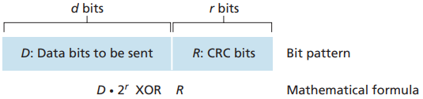

[中文版](crc_zh.md) | English

# CRC

[TOC]

A cyclic redundancy check (CRC) is an error-detecting code commonly used in digital networks and storage devices to detect accidental changes to digital data. 

`Cyclic redundancy check (CRC)` codes are also known as `polynomial codes`, since it is possible to view the bit string to be sent as a polynomial whose coefficients are the 0 and 1 values in the bit string, with operations on the bit string interpreted as polynomial arithmetic.

## Reference

- [WIKIPEDIA-Cyclic redundancy check](https://en.wikipedia.org/wiki/Cyclic_redundancy_check)
- [crccalc.com](https://crccalc.com/?crc=123456789&method=&datatype=ascii&outtype=hex)
