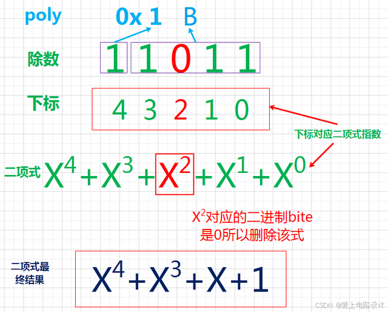
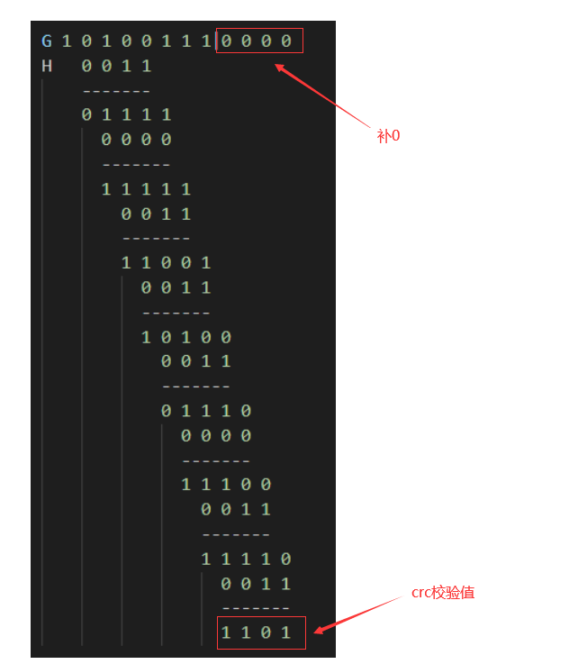
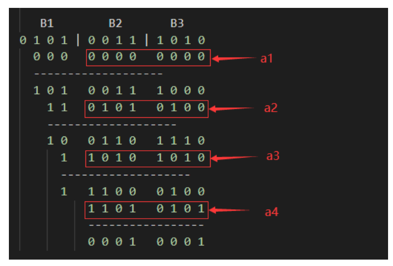
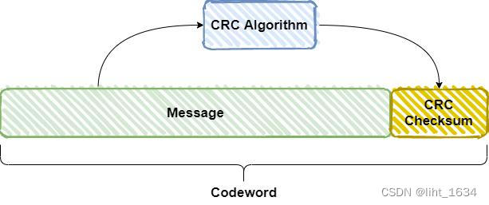

English | [中文版](crc_zh.md)

# CRC Algorithm

[TOC]

CRC (Cyclic Redundancy Check) is a method used to verify the accuracy of digital transmission on communication links (by establishing a relationship between data bits and check bits through certain mathematical operations).

## Definition

### Polynomial

For CRC standard divisors, polynomials (or binomials) are generally used; as shown in the figure below, the divisor 11011 (poly value 0x1B) is represented as the binomial G(X) = X^4+X^3+X^1+1, where the exponent of X represents that the bit is 1 (the least significant bit is 0):

**Note:**

- The polynomial used as the divisor can be chosen randomly or according to international standards, but the highest and lowest bits must both be "1".

### Polynomial Short Notation

With a basic understanding of CRC, the first and last bits of the polynomial must be 1, and the 1 at the front will always be 0 in the next calculation step, so it is omitted, resulting in a short notation. For example, the short notation for divisor 11011 is 1011. For the CRC_16 standard G(X) = X^16+X^15+X^2+1 (16#18005), the poly value is actually 8005, which uses the short notation.

### Data Width

Data width refers to the length (number of bits) of the CRC check code. With the concept of CRC operation and polynomials, this is easy to understand. The CRC length is always one less than the divisor's bit length, which matches the length of the short notation.

## Principle

The basic idea of the CRC algorithm is to treat the transmitted data as a very long number. This number is divided by another number, and the remainder is used as the check data and appended to the original data.

Suppose the data to be checked is g: 10100111, which can be represented as the algebraic polynomial g(x) = x^7 + x^5 + x^2 + x + 1. The divisor polynomial h(x) can be freely chosen or selected according to international standards. If the degree of h(x) is m, the CRC algorithm is called crc-m, such as crc-32, crc-16, etc.

### 1-bit Calculation Method

Append m zeros to the data g to be checked, then divide by the m-degree polynomial **h(x)**. The remainder is the CRC code.
The following example uses h(x) = x^4 + x^1 + x1, i.e., **h=10011**; for example:

### Table Lookup Method

Since the 1-bit calculation method moves 1 bit at a time, the computation is very large and time-consuming; therefore, the table lookup method can greatly reduce computation time. For example:

Suppose the data to be calculated is **g = 0101 0011 1010…**, and the divisor polynomial is **h=1 1101 0101**; the data g is divided into 3 blocks: B1, B2, B3. When moving 4 bits, after B1 is shifted out, the entire data becomes
R=0001 0001. Obviously, B2B3 xor a1 xor a2 xor a3 xor a4 = R
Define A = a1 xor a2 xor a3 xor a4. Upon careful observation, A's value is uniquely determined by B1, and since B1 has 4 bits, there are 2^4 = 16 possible values. The corresponding 16 A values can be calculated and placed in a table, which is the table in the CRC table lookup method.

## CRC Check

Specifically, the CRC check principle involves the following steps:

1. Select a standard divisor (P-bit binary string).
2. Add P-1 zeros to the data to be sent (M bits), then divide this new (M+P-1 bits) number by the standard divisor using modulo-2 division. The remainder is the CRC check code (note: the remainder must be one bit less than the divisor; pad with zeros if necessary).
3. Attach this check code to the original M-bit data to form a new M+P-1 bit data, and send it to the receiver.
4. The receiver divides the received data by the standard divisor. If the remainder is 0, the data is considered correct.

### Check Order

If, during communication, the lower bits of the data are received first, the direction of data movement is reversed (i.e., reverse check), and the order of the divisor polynomial must also be reversed.

## CRC Standards

| Algorithm | Polynomial | Notation |
| --------- | :----------------------------------------------------------- | ----------- |
| CRC-8   | $X^8 + X^2 + X + 1$                                          | 0x107       |
| CRC-12  | $X^{12} + X^{11} + X^{3} + X^{2} + X + 1$                    | 0x180F      |
| CRC-16  | $X^{16} + x^{15} + x^{2}+1$                                  | 0x18005     |
| CCITT   | $                                                            | 0x11021     |
| CRC-32  | $X^{32}+X^{26}+X^{23}+X^{22}+X^{16}+X^{12}+X^{11}+X^{10}+X^{8}+X^7+X^5+X^4+X^2+X^1+1$ | 0x104C11DB7 |
| CRC-32C | $X^{32} + X^{28} + X^{27} + X^{26} + X^{25} + X^{23} + X^{22} + X^{20} + X^{19} + X^{18} + X^{14} + X^{13} + X^{9} + X^{8} + X^{6} + 1$ | 0x11EDC6F41 |

## References

- [CRC RevEng](https://reveng.sourceforge.io/crc-catalogue/all.htm)
- [Detailed CRC (C code)](https://liht1634.blog.csdn.net/article/details/124328005?spm=1001.2101.3001.6661.1&utm_medium=distribute.pc_relevant_t0.none-task-blog-2%7Edefault%7Ebaidujs_baidulandingword%7ECtr-1-124328005-blog-7882789.235%5Ev43%5Epc_blog_bottom_relevance_base2&depth_1-utm_source=distribute.pc_relevant_t0.none-task-blog-2%7Edefault%7Ebaidujs_baidulandingword%7ECtr-1-124328005-blog-7882789.235%5Ev43%5Epc_blog_bottom_relevance_base2&utm_relevant_index=1)
- [On-line CRC calculation and free library](https://www.lammertbies.nl/comm/info/crc-calculation)
- [Detailed CRC algorithm and code implementation](https://cloud.tencent.com/developer/article/2063788)
- [Detailed CRC table lookup method](https://blog.csdn.net/weixin_47409662/article/details/120098915)
- [Introduction to CRC algorithm](https://blog.csdn.net/liyuanbhu/article/details/7882789)
- [CRC-32](https://blog.csdn.net/qq_40019719/article/details/147627122)
