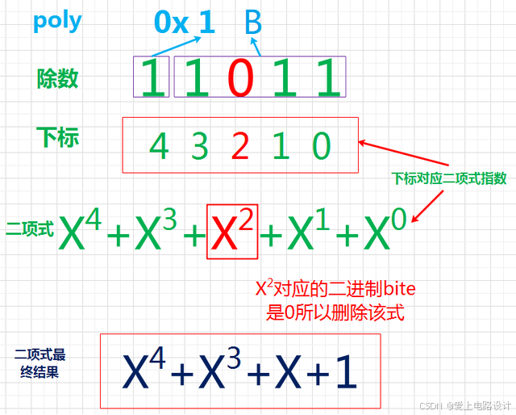

中文版 | [English](crc.md)

# CRC 算法

[TOC]

CRC(Cyclic Redundance Check)循环冗余校验，是一种用于校验通信链路上数字传输准确性的计算方法(通过某种数学运算来建立数据位和校验位的约定关系)。

## 定义

### 多项式

对于 CRC 标准除数，一般使用多项式(或二项式)公式表示；如下图中除数 11011(poly 值为 0x1B)的二项式为 G(X) = X^4+X^3+X^1+1，X 的指数就代表了该 bit位上的数据为 1(最低位为 0):

**注意**:

- 作为除数的多项式可以随机选择，也可按国际上通行的标准选择，但最高位和最低位必须均为“1”。

### 多项式简记式

通过对 CRC 的基本了解我，多项式的首尾必定为 1，而这个 1 的位置在下一步计算一定为 0，所以就把前面这个1给省略掉了，出现了一个叫简记式的东西，如上例中除数 11011 的简记式为 1011。对于 CRC_16 标准下 G(X) = X^16+X^15+X^2+1(16#18005) 的 poly 值实际上是 8005，这里使用的就是简记式。

### 数据宽度

数据宽度指的就是 CRC 校验码的长度(二进制位数)，知道了 CRC 的运算概念和多项式，就可以理解这个概念了，CRC 长度始终要比除数位数少 1，与简记式长度一致。

## 原理

CRC 算法的基本思想是将传输的数据当做一个位数很长的数。将这个数除以另一个数。得到的余数作为校验数据附加到原数据后面。

假设需要检验的数据 g :10100111，这串二进制码可以表示为代数多项式g(x) = x^7 + x^5 + x^2 + x +1, 而作为除数的多项式 h(x) 可以自由选择或者按照国际标准选择，一般h(x)的阶数如果是m，则此CRC算法称为crc-m，比如crc-32，crc-16等。

### 1bit计算法

在需要检验的数据g的后面添加m个0，然后除以m阶多项式**h(x)**,得到的余数就是crc编码
下方例子采用h(x) = x^4 + x^1 + x1 ,即**h=10011**；例：

### 查表法

由于1bit计算法每次移动1bit，计算量非常大，耗时太久；所以，采用查表法可以大大缩短计算时间；例：

假设需要计算的数据 **g = 0101 0011 1010…**，除数多项式 **h=1 1101 0101**；将需要计算的数据g分成了3块:B1,B2,B3，当移动4bit，即B1移出后，整个数据变为了
R=0001 0001，显然，B2B3 xor a1 xor a2 xor a3 xor a4 = R
定义A = a1 xor a2 xor a3 xor a4,仔细观察可以发现，A的值由B1唯一确定，而B1有4bit，即有2^4 = 16种取值，相应的可以计算出对应得16种A，16种A放在一个表格table里面，这就是CRC查表法中的表。

## CRC校验

具体来说，CRC校验原理就是以下几个步骤：

1. 选定一个标准除数(P 位二进制数据串)。
1. 在要发送的数据(M 位)后面加上 P-1位0，然后将这个新数 (M+P-1位) 以模2 除法的方式除以上面这个标准除数，所得到的余数也就是该数据的 CRC 校验码(注：余数必须比除数少且只少一位，不够就补 0)。
1. 将这个校验码附在原 M位数据后面，构成新的 M+P-1位数据，发送给接收端。
1. 接收端将接收到的数据除以标准除数，如果余数为 0 则认为数据正确。

### 校验顺序

如果在通讯过程中，先接到低位的数据，将数据的移动方向逆向（即逆序校验），同*除数多项式也得将顺序调转。

## CRC标准

| 算法    | 多项式                                                       | 表示法      |
| ------- | :----------------------------------------------------------- | ----------- |
| CRC-8   | $X^8 + X^2 + X + 1$                                          | 0x107       |
| CRC-12  | $X^{12} + X^{11} + X^{3} + X^{2} + X + 1$                    | 0x180F      |
| CRC-16  | $X^{16} + x^{15} + x^{2}+1$                                  | 0x18005     |
| CCITT   | $                                                            | 0x11021     |
| CRC-32  | $X^{32}+X^{26}+X^{23}+X^{22}+X^{16}+X^{12}+X^{11}+X^{10}+X^{8}+X^7+X^5+X^4+X^2+X^1+1$ | 0x104C11DB7 |
| CRC-32C | $X^{32} + X^{28} + X^{27} + X^{26} + X^{25} + X^{23} + X^{22} + X^{20} + X^{19} + X^{18} + X^{14} + X^{13} + X^{9} + X^{8} + X^{6} + 1$ | 0x11EDC6F41 |

## 参考

- [CRC RevEng](https://reveng.sourceforge.io/crc-catalogue/all.htm)
- [详述循环冗余校验CRC(C代码)](https://liht1634.blog.csdn.net/article/details/124328005?spm=1001.2101.3001.6661.1&utm_medium=distribute.pc_relevant_t0.none-task-blog-2%7Edefault%7Ebaidujs_baidulandingword%7ECtr-1-124328005-blog-7882789.235%5Ev43%5Epc_blog_bottom_relevance_base2&depth_1-utm_source=distribute.pc_relevant_t0.none-task-blog-2%7Edefault%7Ebaidujs_baidulandingword%7ECtr-1-124328005-blog-7882789.235%5Ev43%5Epc_blog_bottom_relevance_base2&utm_relevant_index=1)
- [On-line CRC calculation and free library](https://www.lammertbies.nl/comm/info/crc-calculation)
- [CRC校验算法详解及代码实现通俗易懂](https://cloud.tencent.com/developer/article/2063788)
- [CRC校验查表法详解](https://blog.csdn.net/weixin_47409662/article/details/120098915)
- [循环冗余校验（CRC）算法入门引导](https://blog.csdn.net/liyuanbhu/article/details/7882789)
- [CRC-32](https://blog.csdn.net/qq_40019719/article/details/147627122)
