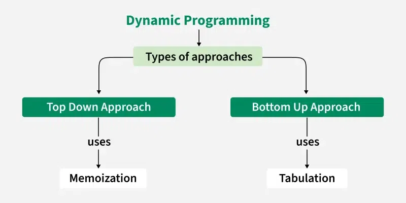
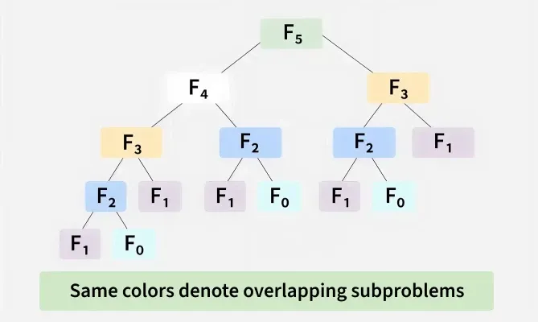

# Dynamic Programming Algorithm

[TOC]


Dynamic programming is an important algorithmic paradigm that decomposes a problem into a series of smaller subproblems and avoids redundant computation by storing the solutions to subproblems, thereby significantly improving time efficient.

## Approaches

Dynamic programming can be achieved using two approaches:

- Top-Down Approach (Memoization);
- Bottom-Up Approach (Tabulation).



### Top-Down Approach

In the top-down approach, also known as memoization, we keep the solution recursive and add a memoization table to avoid repeated calls of same subproblems:

- Before making any recursive call, we first check if the memoization table already has solution for it;
- After the recursive call is over, we store the solution in the memoization table.

### Bottom-Up Approach

In the bottom-up approach, also known as tabulation, we start with the smallest subproblems and gradually build up to the final solution:

- We write an iterative solution (avoid recursion overhead) and build the solution in bottom-up manner;
- We use a dp table where we first fill the solution for base cases and then fill the remaining entries of the table using recursive formula;
- We only use recursive formula on table entries and do not make recursive calls.


## Step



1. Identify Subproblems: Divide the main problem into smaller, independent subproblems, i.e., $F(n - 1)$ and $F(n - 2)$.
2. Store Solutions: Solve each subproblem and store the solution in a table or array so that we do not have to recompute the same again.
3. Build Up Solutions: Use the stored solutions to build up the solution to the main problem. For $F(n)$, look up $F(n - 1)$ and $F(n - 2)$ in the table and add them.
4. Avoid Recomputation: By storing solutions, DP ensures that each subproblem is solved only once, reducing computation time.


## Implement

Top Down Approach:

```c++
int top_down_approach(int n, std::vector<int>& memo)
{
    if (n <= 1)
        return n;
    if (memo[n] != -1)
        return memo[n];

    memo[n] = top_down_approach(n - 1, memo) + top_down_approach(n - 2, memo);
    return memo[n];
}
```

Bottom Up Approach:

```c++
int bottom_up_approach(int n)
{
    if (n <= 1)
        return n;

    std::vector<int> dp(n + 1, 0);
    dp[0] = 0;
    dp[1] = 1;
    for (int i = 2; i <= n; i++)
        dp[i] = dp[i - 1] + dp[i - 2];

    return dp[n];
}
```


## Advantage And Disadvantage

### Advantage

- Significant Efficiency Gains;
- Guaranteed Optimal Solutions;
- Structured and Wide Applicability;
- Simplified Debugging (Top-Down);
- Modularity and Reusability.

### disadvantage

- High Memory Usage;
- Implementation Complexity;
- Not Universally Applicable;
- Risk of Stack Overflow (Top-Down);
- Potential for higher time complexity (compared to Greedy).

### Application

Dynamic programming is used for solving problems that consists of the following characteristics:

1. Optimal Substructure: The property Optimal substructure means that we use the optimal results of subproblems to achieve the optimal result of the bigger problem;
2. Overlapping Subproblems.


## Reference

[1] Thomas H.Cormen; Charles E.Leiserson; Ronald L. Rivest; Clifford Stein. Introduction to Algorithms . 3ED

[2] Mark Allen Weiss. Data Structures and Algorithm Analysis in C++ . 4ED

[3] [Hello Algo/Chapter 14.  Dynamic Programming](https://www.hello-algo.com/en/chapter_dynamic_programming)

[4] [Dynamic Programming or DP](https://www.geeksforgeeks.org/competitive-programming/dynamic-programming/)
