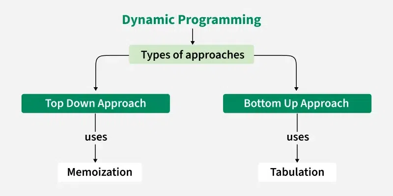
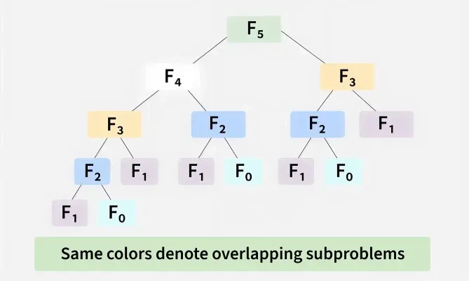

# Dynamic Programming Algorithm

[TOC]


Dynamic programming is an important algorithmic paradigm that decomposes a problem into a series of smaller subproblems and avoids redundant computation by storing the solutions to subproblems, thereby significantly improving time efficiency.

## Properties

- Optimal Substructure
- Overlapping Subproblems
- Memoization


## Approaches

Dynamic programming can be achieved using two approaches:

- Top-Down Approach (Memoization);
- Bottom-Up Approach (Tabulation).



### Top-Down Approach (Memoization)

In the top-down approach, also known as memoization, we keep the solution recursive and add a memoization table to avoid repeated calls to the same subproblems:

- Before making any recursive call, we first check if the memoization table already has a solution for it.
- After the recursive call is over, we store the solution in the memoization table.

Implement:

```c++
int top_down_approach(int n, std::vector<int>& memo)
{
    if (n <= 1)
        return n;
    if (memo[n] != -1)
        return memo[n];

    memo[n] = top_down_approach(n - 1, memo) + top_down_approach(n - 2, memo);
    return memo[n];
}
```

Complexity:

| Scenario     | Time Complexity | Space Complexity |
| :----------- | :-------------- | :--------------- |
| Best Case    | $O(1)$          | $O(1)$           |
| Average Case | $O(n)$          | $O(n)$           |
| Worst Case   | $O(n)$          | $O(n)$           |

With memoization, each subproblem value from $0$ to $n$ is computed at most once, so the total running time is linear in the number of states, i.e. $O(n)$. The algorithm uses $O(n)$ memory for the memo table and, in this recursive Fibonacci example, up to $O(n)$ recursion-stack space in the worst case. If a result is already memoized (or when $n \le 1$), the call can return in $O(1)$ time.

### Bottom-Up Approach (Tabulation)

In the bottom-up approach, also known as tabulation, we start with the smallest subproblems and gradually build up to the final solution:

- We write an iterative solution (avoid recursion overhead) and build the solution in a bottom-up manner.
- We use a DP table where we first fill the solution for base cases and then fill the remaining entries of the table using a recursive formula.
- We only use the recursive formula on table entries and do not make recursive calls.

Implement:

```c++
int bottom_up_approach(int n)
{
    if (n <= 1)
        return n;

    std::vector<int> dp(n + 1, 0);
    dp[0] = 0;
    dp[1] = 1;
    for (int i = 2; i <= n; i++)
        dp[i] = dp[i - 1] + dp[i - 2];

    return dp[n];
}
```

Complexity:

| Scenario     | Time Complexity | Space Complexity |
| :----------- | :-------------- | :--------------- |
| Best Case    | $O(1)$          | $O(1)$           |
| Average Case | $O(n)$          | $O(n)$           |
| Worst Case   | $O(n)$          | $O(n)$           |

In tabulation, we iteratively fill each state from $2$ to $n$ exactly once, so the running time is linear in the number of states, i.e. $O(n)$. The DP array stores $n + 1$ values, so auxiliary space is $O(n)$. When $n \le 1$, the function returns immediately in $O(1)$ time and $O(1)$ space.


## Workflow

When developing a dynamic-programming algorithm, we follow a sequence of four steps:

1. Characterize the structure of an optimal solution.
2. Recursively define the value of an optimal solution.
3. Compute the value of an optimal solution, typically in a bottom-up fashion.
4. Construct an optimal solution from computed information.



1. Identify Subproblems: Divide the main problem into smaller, independent subproblems, i.e., $F(n - 1)$ and $F(n - 2)$.
2. Store Solutions: Solve each subproblem and store the solution in a table or array so that we do not have to recompute the same again.
3. Build Up Solutions: Use the stored solutions to build up a solution to the main problem. For $F(n)$, look up $F(n - 1)$ and $F(n - 2)$ In the table, add them.
4. Avoid Recomputation: By storing solutions, DP ensures that each subproblem is solved only once, reducing computation time.


## Summary

### Advantage And Disadvantage

Advantage:

- Significant Efficiency Gains;
- Guaranteed Optimal Solutions;
- Structured and Wide Applicability;
- Simplified Debugging (Top-Down);
- Modularity and Reusability.

Disadvantage:

- High Memory Usage;
- Implementation Complexity;
- Not Universally Applicable;
- Risk of Stack Overflow (Top-Down);
- Potential for higher time complexity (compared to Greedy).

### Memoization vs Tabulation

|           -            |                         Memoization                          | Tabulation                                                   |
| :--------------------: | :----------------------------------------------------------: | ------------------------------------------------------------ |
|       **State**        |         State transition relation is easy to think.          | State transition relation is difficult to think.             |
|        **Code**        |              Code is easy and less complicated.              | Code gets complicated when a lot of conditions are required. |
|       **Speed**        |   Slow due to many recursive calls and return statements.    | Fast, as we directly access previous states from the table.  |
| **Subproblem solving** | If some subproblems in the subproblem space need not be solved at all, the memoized solution has the advantage of solving only those subproblems that are definitely required. | If all subproblems must be solved at least once, a bottom-up dynamic programming algorithm usually outperforms a top-down memoized algorithm by a constant factor. |
|   **Table Entries**    | Unlike the Tabulated version, all entries of the lookup table are not necessarily filled in Memoized version. The table is filled on demand. | In the Tabulated version, starting from the first entry, all entries are filled one by one |

### Application

- Dynamic programming is used to solve economic like resource allocation, optimal growth, and decision-making.
- Problems in game theory like optimal strategies, value iteration, and Markov decision processes are solved using dynamic programming.
- To solve issues like speech recognition, machine translation, and language modelling, dynamic programming is used in natural language processing.


## Reference

[1] Thomas H.Cormen; Charles E.Leiserson; Ronald L. Rivest; Clifford Stein. Introduction to Algorithms . 3ED

[2] Mark Allen Weiss. Data Structures and Algorithm Analysis in C++ . 4ED

[3] [Hello Algo/Chapter 14.  Dynamic Programming](https://www.hello-algo.com/en/chapter_dynamic_programming)

[4] [Dynamic Programming or DP](https://www.geeksforgeeks.org/competitive-programming/dynamic-programming/)
