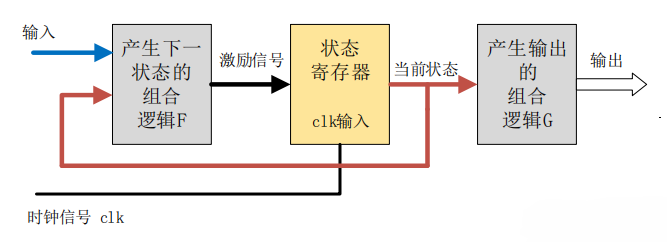
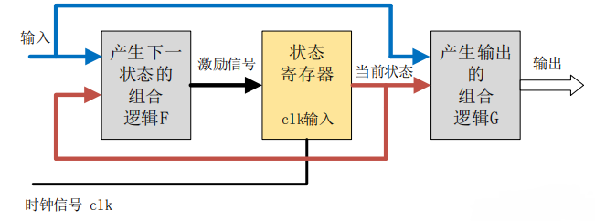
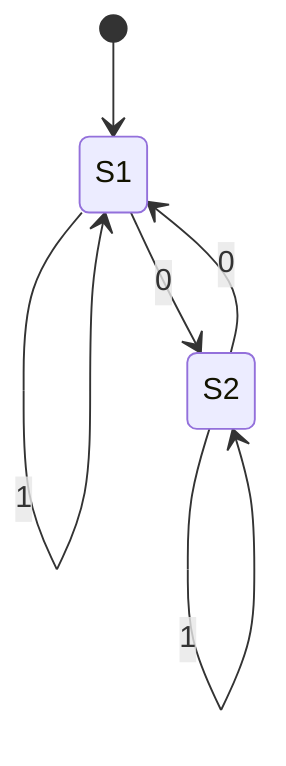

English | [中文版](fsm_zh.md)

# Finite State Machine

[TOC]

## Terminology

- `Current state`: The state currently occupied.
- `Condition`: Also called an "event". When a condition is met, it will trigger an action or a state transition.
- `Action`: The action performed after the condition is met. After the action is executed, it can transition to a new state or remain in the original state. Actions are not required; when the condition is met, it is also possible to transition directly to a new state without performing any action.

	- `Entry action`: Performed when entering a state.

	- `Exit action`: Performed when exiting a state.

	- `Input action`: Depends on the transition state and input condition.

	- `Transition action`: Performed during a specific transition.
- `Next state`: The new state to transition to after the condition is met. "Next state" is relative to the "current state"; once the next state is activated, it becomes the new current state.

## Concept

`Finite-state machine (FSM)` is a mathematical computation model that represents a finite number of states and the transitions and actions between these states.

### Features

1. Only one state at a time;
2. Under certain conditions, it transitions from one state to another;
3. The number of states is finite.

### Classification

#### Moore Machine

The output of a Moore-type state machine depends only on the current state and not on the current input.

The output remains stable for a complete clock cycle; even if the input signal changes during this time, the output does not change. The effect of the input on the output is reflected in the next clock cycle.

#### Mealy Machine

The output of a Mealy-type state machine depends not only on the current state but also on the current input signal.

The output of a Mealy-type state machine changes immediately after the input signal changes, and this can occur within any clock cycle where the input changes. Therefore, for the same logic, the output of a Mealy-type state machine responds to the input one clock cycle earlier than a Moore-type state machine.

## States

The next state and output of an FSM are determined by the input and the current state.

### Start State

The start state is usually indicated by an arrow with no origin pointing to it.

### Accept State

The accept state (or final state) is a state where the machine reports that the input string so far is accepted.

The start state can also be an accept state, in which case the automaton accepts the empty string. If the start state is not an accept state and there is no arrow leading to any accept state, then the automaton will not accept any input.

### State Transition Table

#### One-dimensional State Table

Also called a characteristic table, as it is more like a truth table than the two-dimensional version. Inputs are usually placed on the left, separated from the outputs on the right. The output indicates the next state of the machine.

Example:

| A    | B    | Current State | Next State | Output |
| ---- | ---- | ------------- | ---------- | ------ |
| 0    | 0    | $S_1$         | $S_2$      | 1      |
| 0    | 0    | $S_2$         | $S_1$      | 0      |
| 0    | 1    | $S_1$         | $S_2$      | 0      |
| 0    | 1    | $S_2$         | $S_2$      | 1      |
| 1    | 0    | $S_1$         | $S_1$      | 1      |
| 1    | 0    | $S_2$         | $S_1$      | 1      |
| 1    | 1    | $S_1$         | $S_1$      | 1      |
| 1    | 1    | $S_2$         | $S_2$      | 0      |

*$S_1$ and $S_2$ most likely represent a single bit 0 and 1, as a single bit has only two states.*

#### Two-dimensional State Table

There are two common forms of two-dimensional state tables:

- The vertical (or horizontal) dimension indicates the current state, the horizontal (or vertical) dimension indicates the event, and the cells in the table contain the next state (and possibly the action associated with the state transition) when the event occurs.

	| Event/State | $E_1$     | $E_2$     | ...  | $E_n$     |
	| ----------- | --------- | --------- | ---- | --------- |
	| $S_1$       | -         | $A_y/S_j$ | ...  | -         |
	| $S_2$       | -         | -         | ...  | $A_x/S_i$ |
	| ...         | ...       | ...       | ...  | ...       |
	| $S_m$       | $A_z/S_k$ | -         | ...  | -         |

	*(S: state, E: event, A: action, -: illegal transition)*

- The vertical (or horizontal) dimension indicates the current state, the horizontal (or vertical) dimension indicates the next state, and the cells contain the event that leads to a specific next state.

	| Next/Current | $S_1$     | $S_2$     | ...  | $S_m$     |
	| ------------ | --------- | --------- | ---- | --------- |
	| $S_1$        | $A_y/E_j$ | -         | ...  | -         |
	| $S_2$        | -         | -         | ...  | $A_x/E_i$ |
	| ...          | ...       | ...       | ...  | ...       |
	| $S_m$        | -         | $A_z/E_k$ | ...  | -         |

	*(S: state, E: event, A: action, -: impossible transition)*

Notes:

1. Avoid treating a "program action" as a "state".
2. Avoid missing states when dividing states, which can lead to incomplete transition logic.

Example 1:

*State diagram*

| Input State | 1     | 0     |
| ----------- | ----- | ----- |
| $S_1$       | $S_1$ | $S_2$ |
| $S_2$       | $S_2$ | $S_1$ |

*State transition table. Each row enumerates all possible states. From the state transition table above, it is easy to see that if the machine is in S1 (first row) and the next input is 1, the machine will stay in S1. If 0 arrives, the machine will transition to S2 as seen in the second column.*

## Mathematical Model

An FSM acceptor is a 5-tuple $(\sum, S, s_0, \delta, F)$:

- $\sum$ Input alphabet (a non-empty finite set of symbols);
- $S$ A non-empty finite set of states;
- $s_0$ Initial state, an element of $S$; in a nondeterministic finite automaton, $s_0$ is a set of initial states;
- $\delta$ State transition function: $\delta : S \times \sum \rightarrow S$;
- $F$ Set of final states, a (possibly empty) subset of $S$;

An FSM transducer is a 6-tuple $(\sum, \Gamma, S, s_0, \delta, \omega)$:

- $\sum$ Input alphabet (a non-empty finite set of symbols);
- $\Gamma$ Output alphabet (a non-empty finite set of symbols);
- $S$ A non-empty finite set of states;
- $s_0$ Initial state, an element of $S$. In a nondeterministic finite automaton, $s_0$ is a set of initial states;
- $\delta$ State transition function: $\delta: S \times \sum \rightarrow S$;
- $\omega$ Output function.

## Design Pattern - State Pattern

### Design Ideas

### Implementation Methods

- FSM implemented by Executable Code mapping;
- FSM implemented by Passive Data mapping;

## Open Source Implementations

TODO

## References

### External Links

- [Wikipedia - Finite-state machine](https://en.wikipedia.org/wiki/Finite-state_machine)
- [Wikipedia - Automaton programming](https://en.wikipedia.org/wiki/Automaton_(programming))
- [Wikipedia - State transition table](https://en.wikipedia.org/wiki/State_transition_table)
- [Understanding Finite State Machines](https://zhuanlan.zhihu.com/p/46347732)
- [Algorithm: Finite State Machine FSM](https://www.cnblogs.com/bandaoyu/p/14624895.html)
- [State Pattern](https://gpp.tkchu.me/state.html)
- [6.3 Verilog FSM](https://www.runoob.com/w3cnote/verilog-fsm.html)
- [A Method for Expressing Machine Tool Control Processes with FSM](http://www.doczj.com/doc/0447414dde80d4d8d15a4f62.html)

### References
