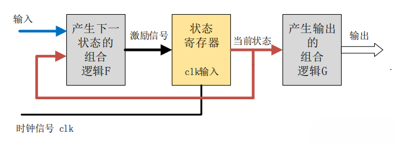
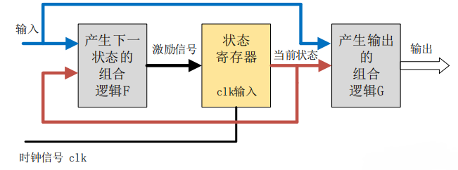
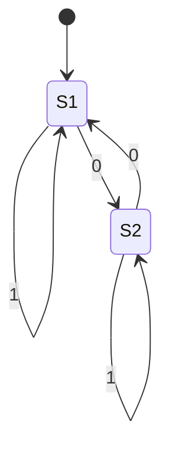

# 有限状态机

[TOC]

## 术语

- `现态` 当前所处的状态。
- `条件` 又称为"事件"，当一个条件被满足，将会出发一个动作，或者执行一次状态的迁移。
- `动作` 条件满足后执行的动作。动作执行完毕后，可以迁移到新的状态，也可以仍旧保持原状态。动作不是必需的，当条件满足后，也可以不执行任何动作，直接迁移到新状态。

  - `进入动作（entry action）` 再进入状态时进行；

  - `推出动作（exit action）` 再退出状态时进行；

  - `输入动作` 依赖于动迁状态和输入条件进行；

  - `转移动作` 再进行特定转移时进行。
- `次态` 条件满足后要迁往的新状态。“次态”是相对于“现态”而言的，“次态”一旦被激活，就转变成新的“现态”了。

## 概念

`有限状态机（finite-state machine, FSM）` 表示有限个状态以及再这些状态之间的转移和动作等行为的数学计算模型。

### 特点

1. 一个时刻，只有一个状态；
2. 某种条件下，会从一种状态转变（transition）到另一种状态；
3. 状态有限（finite）。

### 分类

#### Moore机

Moore型状态机的输出只与当前状态有关，与当前输入无关。

输出会在一个完整的时钟周期内保持稳定，即使此时输入信号有变化，输出也不会变化。输入对输出的影响要到下一个时钟周期才能反映出来。

#### Mealy机

Mealy型状态机的输出，不仅与当前状态有关，还取决于当前的输入信号。

Mealy型状态机的输出是再输入信号变化后立即发生变化，且输入变化可能出现的任何状态的时钟周期内。因此，同种逻辑下，Mealy型状态机输出对输入的响应会比Moore型状态机早一个时钟周期。

## 状态

FSM的下一个状态和输出是由输入和当前状态决定的。

### 开始状态

开始状态通常用“没有起点的箭头”指向它来表示。

### 接受状态

接受状态（或称最终状态）是一个机器回报到目前为止，输入字符串属于它所接受的内容之状态。

开始状态也可以是接受状态，此情况下自动机会接受空串。如果开始状态不是接受状态，且没有可以连到任何接受状态的箭头，那么此自动机就不会“接受”任何输入。

### 状态转移表

#### 一维状态表

也叫做特征表，以为状态比二维版本更像真值表。输入通常放置在左侧，分隔于在右侧的输出。输出将表示这个机器的下一个状态。

例：

| A    | B    | 当前状态 | 下一个状态 | 输出 |
| ---- | ---- | -------- | ---------- | ---- |
| 0    | 0    | $S_1$    | $S_2$      | 1    |
| 0    | 0    | $S_2$    | $S_1$      | 0    |
| 0    | 1    | $S_1$    | $S_2$      | 0    |
| 0    | 1    | $S_2$    | $S_2$      | 1    |
| 1    | 0    | $S_1$    | $S_1$      | 1    |
| 1    | 0    | $S_2$    | $S_1$      | 1    |
| 1    | 1    | $S_1$    | $S_1$      | 1    |
| 1    | 1    | $S_2$    | $S_2$      | 0    |

*$S_1$和$S_2$最可能表示单一位0和1，因为单一位只有两个状态。*

#### 二维状态表

二维状态表有两种常用的形式：

- 垂直（或水平）维指示当前状态，水平（或垂直）维指示事件，表中的单元格包含在时间发生时的下一个状态（和可能的联系于这个状态转移的动作）。

  | 事件状态 | $E_1$     | $E_2$     | ...  | $E_n$     |
  | -------- | --------- | --------- | ---- | --------- |
  | $S_1$    | -         | $A_y/S_j$ | ...  | -         |
  | $S_2$    | -         | -         | ...  | $A_x/S_i$ |
  | ...      | ...       | ...       | ...  | ...       |
  | $S_m$    | $A_z/S_k$ | -         | ...  | -         |

  *（S：状态，E：事件，A：动作，-：违法转移）*

- 垂直（或水平）维指示当前状态，水平（或垂直）维指示下一个状态，单元格包含导致特定下一个状态的事件。

  | 下一个当前 | $S_1$     | $S_2$     | ...  | $S_m$     |
  | ---------- | --------- | --------- | ---- | --------- |
  | $S_1$      | $A_y/E_j$ | -         | ...  | -         |
  | $S_2$      | -         | -         | ...  | $A_x/E_i$ |
  | ...        | ...       | ...       | ...  | ...       |
  | $S_m$      | -         | $A_z/E_k$ | ...  | -         |

  *（S：状态，E：事件，A：动作，-：不可能转移）*

注意事项：

1. 避免把某个“程序动作”当作是一种“状态”来处理。
1. 避免状态划分时漏掉一些状态，导致跳转逻辑不完整。

例1：

*状态图*

| 输入状态 | 1     | 0     |
| -------- | ----- | ----- |
| $S_1$    | $S_1$ | $S_2$ |
| $S_2$    | $S_2$ | $S_1$ |

*状态转移表，表格各行枚举所有可能的状态。从上面给出的状态转移表，可以轻易的看出如果机器处在S1（第一行），并且下一个输入的是字符1，则机器将停留在S1.如果字符0到达了，机器将转移到可在第二列见到的S2。*

## 数学模型

FSM接受器是五元组$(\sum, S, s_0, \delta, F)$：

- $\sum$ 输入字母表（符号的非空有限集合）；
- $S$ 状态的非空有限集合；
- $s_0$ 初始状态，它是$S$的元素；在非确定有限状态自动机中，$s_0$是初始状态的集合；
- $\delta$ 状态转移函数：$\delta : S \times \sum \rightarrow S$；
- $F$ 最终状态的集合，$S$的（可能为空）子集；

FSM变换器是六元组$(\sum, \Gamma, S, s_0, \delta, \omega)$：

- $\sum$ 输入字母表（符号的非空有限集合）；
- $\Gamma$ 输出字母表（符号的非空有限集合）；
- $S$ 状态的非空有限集合；
- $s_0$ 初始状态，它是$S$的元素。在非确定有限状态自动机中，$s_0$是初始状态的集合；
- $\delta$ 状态转移函数：$\delta: S \times \sum \rightarrow S$；
- $\omega$ 输出函数。

## 设计模式-状态模式

### 设计思路

### 实现方式

- 通过Executable Code实现映射的FSM；
- 通过Passive Data实现的映射的FSM；

## 开源实现

TODO

## 参考

### 外部链接

- [维基百科-有限状态机](https://zh.wikipedia.org/wiki/%E6%9C%89%E9%99%90%E7%8A%B6%E6%80%81%E6%9C%BA)
- [维基百科-自动机编程](https://zh.wikipedia.org/wiki/%E8%87%AA%E5%8A%A8%E6%9C%BA%E7%BC%96%E7%A8%8B)
- [维基百科-状态转移表](https://zh.wikipedia.org/wiki/%E7%8A%B6%E6%80%81%E8%BD%AC%E7%A7%BB%E8%A1%A8)
- [深入浅出理解有限状态机](https://zhuanlan.zhihu.com/p/46347732)
- [【算法】有限状态机FSM](https://www.cnblogs.com/bandaoyu/p/14624895.html)
- [状态模式](https://gpp.tkchu.me/state.html)
- [6.3 Verilog 状态机](https://www.runoob.com/w3cnote/verilog-fsm.html)
- [机床控制流程的一种有限状态机表达方法](http://www.doczj.com/doc/0447414dde80d4d8d15a4f62.html)

### 参考文献

