# Graph Algorithm

[TOC]


A Graph is composed of a set of vertices($V$) and a set of edges($E$). The vertices are connected to each other through edges.

## Types

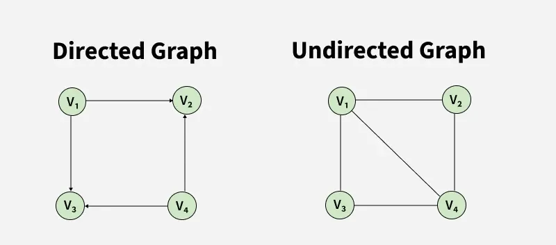

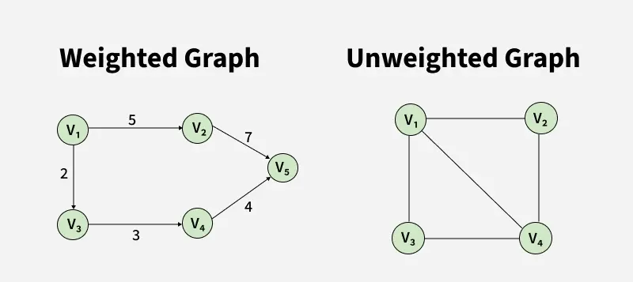

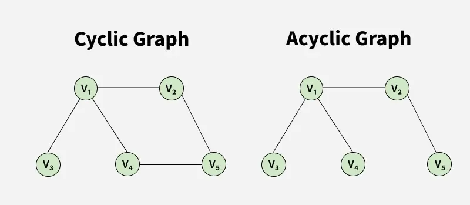

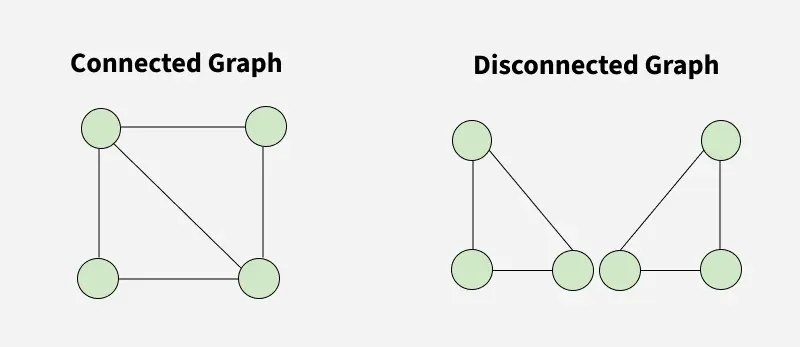


## Representation

### Adjacency Matrix

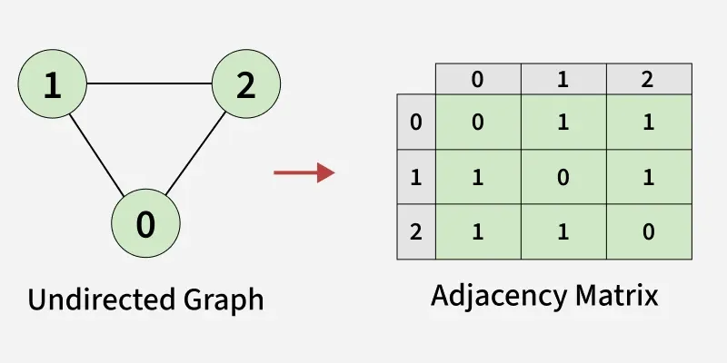

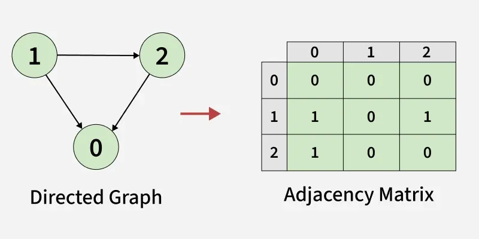

For each $edge(u, v)$, we set $A[u][v]$ to true; otherwise, the entry in the array is false. If the edge has a weight associated with it, then we can set $A[u][v]$ equal to the weight and use either a very large or a very small weight as a sentinel to indicate nonexistent edges.

### Adjacency List

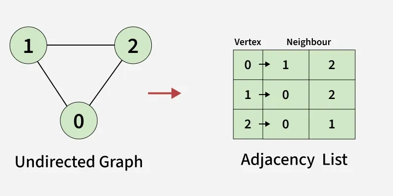

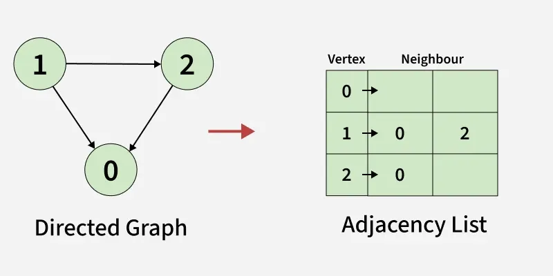

For each vertex, we keep a list of all adjacent vertices. The space requirement is then $O(|E| + |V|)$, which is linear in the size of the graph.


## Breadth-first search (BFS)

**Breadth-first search** is a graph traversal algorithm that starts from a source node and explores the graph level by level. First, it visits all nodes directly adjacent to the source. Then, it moves on to visit the adjacent nodes of those nodes, and this process continues until all reachable nodes are visited.

Algorithm:
$$
\begin{align}
& BFS(G, s) \\
& for\ each\ vertex\ u \in G.V - \{s\} \\
& \qquad u.color = WHITE \\
& \qquad u.d = \infty \\
& \qquad u.\pi = NIL \\
& s.color = GRAY \\
& s.d = 0 \\
& s.\pi = NIL \\
& Q = \phi \\
& ENQUEUE(Q, s) \\
& while\ Q \neq \phi \\
& u = DEQUEUE(Q) \\
& for\ each\ u \in G.Adj[u] \\
& \qquad if\ u.color == WHITE \\
& \qquad \qquad u.color = GRAY \\
& \qquad \qquad u.d = u.d + 1 \\
& \qquad \qquad u.\pi = u \\
& \qquad \qquad ENQUEUE(Q, u) \\
& u.color = BLACK
\end{align}
$$
Examples:

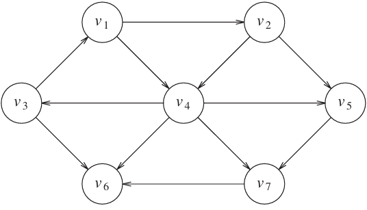


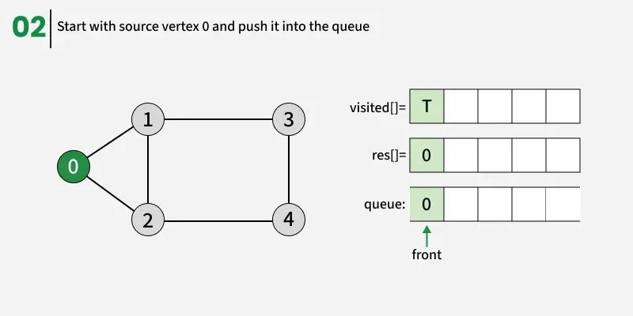


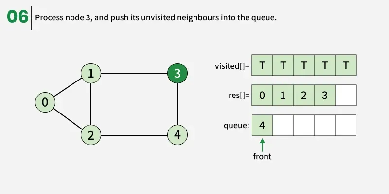

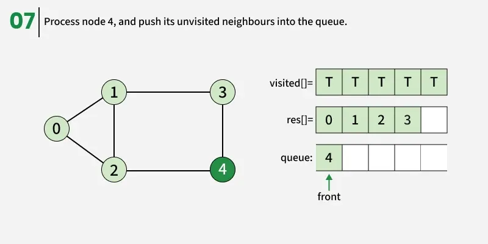


Implements:

```c++
std::vector<int> bfs(std::vector<std::vector<int>>& arr)
{
  int v = arr.size();
  std::vector<bool> visited(arr.size(), false);
  std::vector<int> ret;
  std::queue<int> q;
  int src = 0;
  visited[src] = true;
  q.push(src);
  while (!q.empty())
  {
    int curr = q.front();
    q.pop();
    ret.push_back(curr);
    for (int x : arr[curr])
    {
      if (!visited[x])
      {
        visited[x] = true;
        q.push(x);
      }
    }
  }
  return ret;
}
```

Complexity:

| Scenario     | Time Complexity | Space Complexity |
| :----------- | :-------------- | :--------------- |
| Best Case    | $O(|V|)$        | $O(|V|)$         |
| Average Case | $O(|V| + |E|)$  | $O(|V|)$         |
| Worst Case   | $O(|V| + |E|)$  | $O(|V|)$         |

For the adjacency-list implementation above, each reachable vertex is enqueued and dequeued at most once, and each reachable edge is examined at most once, giving traversal cost $O(|V| + |E|)$. In this code, the `visited` array is initialized for all vertices, so even when BFS quickly finishes (for example, source with no outgoing edges), total time is still $O(|V|)$. Space is $O(|V|)$ due to `visited`, `queue`, and output storage.

### Math Fundamentals

**Lemma** Let $G = (V, E)$ be a directed or undirected graph, and let $s \in V$ be an arbitrary vertex. Then, for any edge $(u, v) \in E$, $\delta(s, v) \leq \delta(s, u) + 1 $

**Lemma** Let $G=(V, E)$ be a directed or undirected graph, and suppose that BFS is run on $G$ from a given source vertex $s \in V$. Then upon termination, for each vertex $v \in V$, the value $v.d$ computed by BFS satisfies $u.d \geq \delta(s, u)$.

**Lemma** Suppose that during the execution of BFS on a graph $G = (V, E)$, the queue $Q$ contains the vertices $<v_1, v_2, ..., v_r>$, where $v_1$ is the head of $Q$ and $v_r$ is the tail. Then, $v_r.d \leq v_1.d + 1$ and $v_i.d \leq v_{i + 1}.d$ for $i = 1, 2, ..., r - 1$.

**Corollary** Suppose that vertices $v_i$ and $v_j$ are enqueued during the execution of BFS, and that $v_i$ is enqueued before $v_j$. Then $v_i.d \leq v_j.d$ at the time that $v_j$ is enqueued.

**Theorem (Correctness of breadth-first search)** Let $G = (V, E)$ be a directed or undirected graph, and suppose that BFS is run on $G$ from a given source vertex $s \in V$. Then, during its execution, BFS discovers every vertex $v \in V$ that is reachable from the source $s$, and upon termination, $v.d = \delta(s, v)$ for all $v \in V$. Moreover, for any vertex $v \neq s$ that is reachable from $s$, one of the shortest paths from $s$ to $v$ is a shortest path from $s$ to $v.\pi$ followed by the edge$(v.\pi, v)$.

### Breadth-first Tree

For a graph $G = (V, E)$ with source $s$, we define the **predecessor subgraph** of $G$ as $G_{\pi} = (V_{\pi}, E_{\pi})$, where: $V_{\pi} = \{ v \in V : v.\pi \neq NIL \} \cup \{s\}$ and $E_{\pi} = \{(v.\pi, v) : v \in V_{\pi} - \{s\}\}$. The Predecessor subgraph $G_{\pi}$ is a **breadth-first tree** if $V_{\pi}$ consists of the vertices reachable from $s$ and for all $v \in V_{\pi}$, the subgraph $G_{\pi}$ contains a unique, simple path from $s$ to $v$ that is also the shortest path from $s$ to $v$ in $G$. A breadth-first tree is in fact a tree, since it is connected and $|E_{\pi}| = |V_{\pi}| - 1$. We call the edges in $E_{\pi}$ **tree edges**.

**Lemma** When applied to a directed or undirected graph $G = (V, E)$, procedure BFS constructs $\pi$ so that the predecessor subgraph $G_{\pi} = (V_{\pi}, E_{\pi})$ is a breadth-first tree.


## Depth-first search (DFS)

In Depth First Search (or DFS) for a graph, we traverse all adjacent vertices one by one. When we traverse an adjacent vertex, we completely finish the traversal of all vertices reachable through that adjacent vertex.

Algorithms:

$$
\begin{align}
& PRINT-PATH(G, s, v) \\
& if\ v == s \\
& \qquad print\ s \\
& elseif\ v.\pi == NIL \\
& \qquad print\ "no\ path\ from"\ s\ "exists" \\
& else\ PRINT-PATH(G, s, v.\pi) \\
& \qquad print\ v 
\end{align}
$$

$$
\begin{align}
& EFS(G) \\
& for\ each\ vertex\ u\ \in G.V \\
& \qquad u.color = WHITE \\
& \qquad u.\pi = NIL \\
& time = 0 \\
& for\ each\ vertex\ u \in G.V \\
& \qquad if\ u.color == WHITE \\
& \qquad \qquad DFS-VISIT(G, u)
\end{align}
$$

$$
\begin{align}
& DFS-VISIT(G, u) \\
& time = time + 1 \\
& u.d = time \\
& u.color = GRAY \\
& for\ each\ v \in G:Adj[u] \\
& \qquad if\ v.color == WHITE \\
& \qquad \qquad v.\pi = u \\
& \qquad \qquad DFS-VISIT(G, v) \\
& u.color = BLACK \\
& time = time + 1 \\
& u.f = time
\end{align}
$$

Examples:


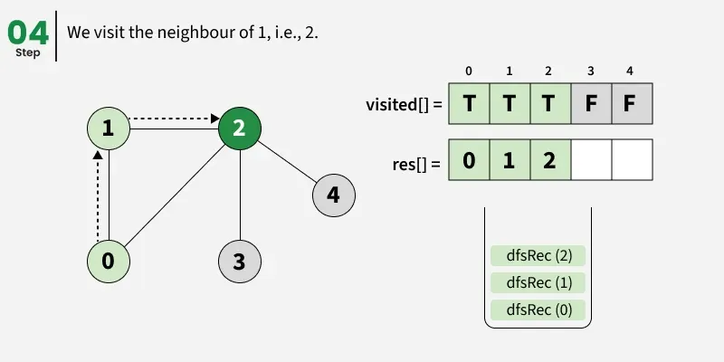

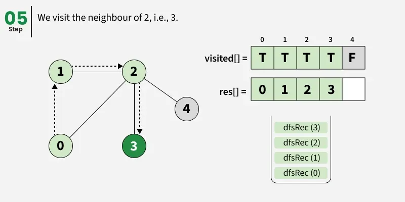

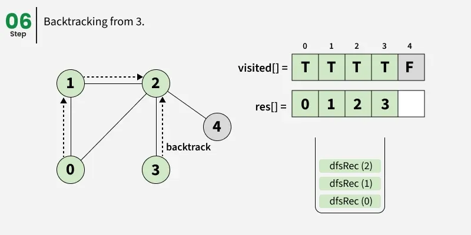

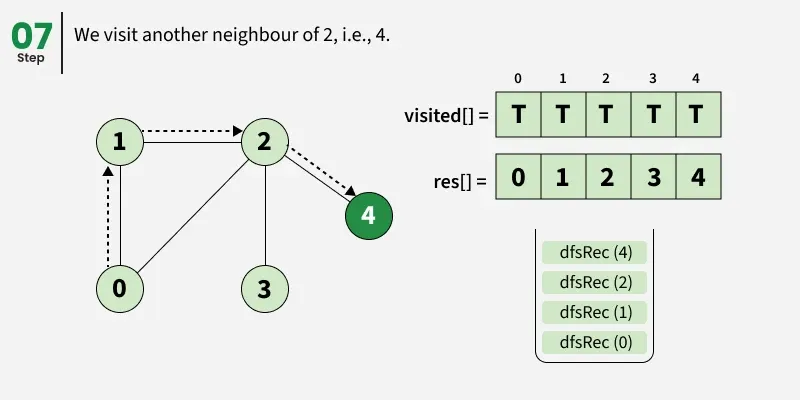

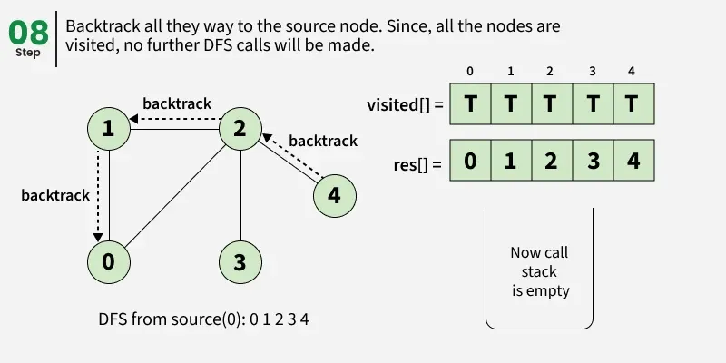

Implement:

```c++
void dfs(std::vector<std::vector<int>>& arr,
         std::vector<bool>& visited, 
         int s, 
         std::vector<int>& ret)
{
  visited[s] = true;
  ret.push_back(s);
  for (int i : arr[s])
    if (visited[i] == false)
      dfs(arr, visited, i, ret);
}

std::vector<int> dfs(std::vector<std::vector<int>>& arr)
{
  std::vector<bool> visited(arr.size(), false);
  std::vector<int> ret;
  for (int i = 0; i < arr.size(); i++)
  {
    if (visited[i] == false)
      dfs(arr, visited, i, ret);
  }
  return ret;
}
```

Complexity:

| Scenario     | Time Complexity | Space Complexity |
| :----------- | :-------------- | :--------------- |
| Best Case    | $O(|V| + |E|)$  | $O(|V|)$         |
| Average Case | $O(|V| + |E|)$  | $O(|V|)$         |
| Worst Case   | $O(|V| + |E|)$  | $O(|V|)$         |

For the adjacency-list implementation above, the outer loop guarantees all vertices are considered, and each vertex is visited at most once. Across the full traversal, each edge is examined at most once in directed graphs (or twice in undirected graphs, once per endpoint), so total time is $O(|V| + |E|)$. Auxiliary space is $O(|V|)$ from `visited` plus recursion call stack (up to $O(|V|)$ in the worst case), and the result vector can also store up to $|V|$ vertices.

### Properties of depth-first search

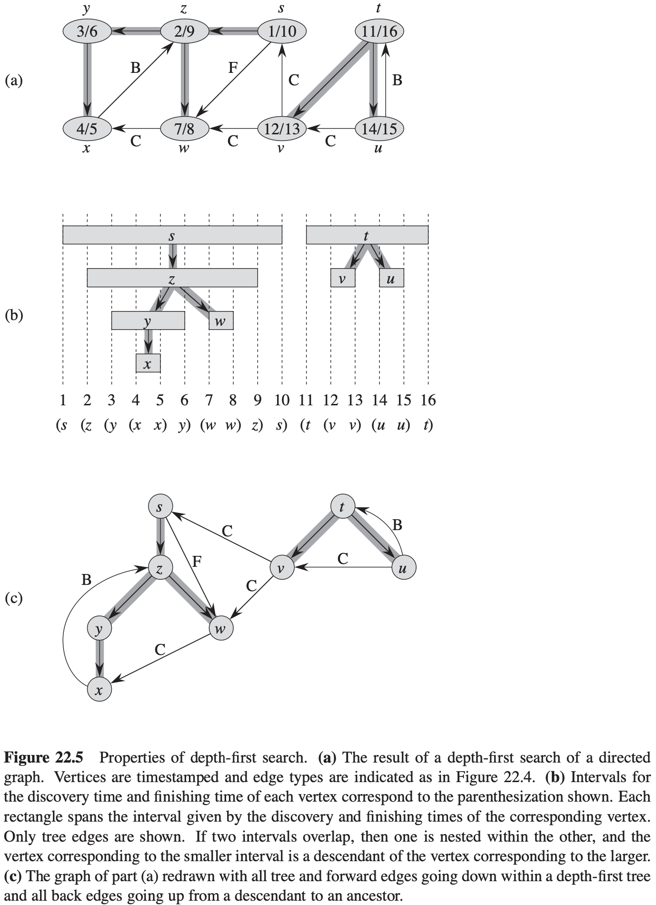

### depth-first forest

We define the **predecessor subgraph** of a depth-first search slightly differently from that of a breadth-first search: we let $G_{\pi} = (V, E_{\pi})$, where $E_{\pi} = \{(v.\pi, v):v \in V \text{ and } v.\pi \neq NIL\}$. The predecessor subgraph of a depth-first search forms a **depth-first forest** comprising several **depth-first trees**. The edges in $E_{\pi}$ are **tree edges**.

We can define four edge types in terms of the depth-first forest $G_{\pi}$ produced by a depth-first search on $G$:

1. **Tree edges** are edges in the depth-first forest $G_{\pi}$. Edge$(u, v)$ is a tree edge if $v$ was first discovered by exploring edge$(u, v)$.
2. **Back edges** are those edges$(u, v)$ connecting a vertex $u$ to an ancestor $v$ in a depth-first tree. We consider self-loops, which may occur in directed graphs, to be back edges.
3. **Forward edges** are those nontree edges$(u, v)$ connecting a vertex $u$ to a descendant $v$ in a depth-first tree.
4. **Cross edges** are all other edges. They can go between vertices in the same depth-first tree, as long as one vertex is not an ancestor of the other, or they can go between vertices in different depth-first trees.

### Math Fundamentals

**Theorem (Parenthesis theorem)** In any depth-first search of a (directed or undirected) graph $G = (V, E)$, for any two vertices $u$ and $v$, exactly one of the following three conditions holds:

- the intervals $[u.d, u.f]$ and $[v.d, v.f]$ are entirely disjoint, and neither $u$ nor $v$ is a descendant of the other in the depth-first forest,
- the interval $[u.d, u.f]$ is contained entirely within the interval $[v.d, v.f]$, and $u$ is a descendant of $v$ in a depth-first tree, or
- the interval $[v.d, v.f]$ is contained entirely within the interval $[u.d, u.f]$, and $v$ is a descendant of $u$ in a depth-first tree.

**Corollary (Nesting of descendants' intervals)** Vertex $v$ is a proper descendant of vertex $u$ in the depth-first forest for a (directed or undirected) graph $G$ if and only if $u.d < v.d < v.f < u.f$.

**Theorem (White-path theorem)** In a depth-first forest of a (directed or undirected) graph $G = (V, E)$, vertex $v$ is a descendant of vertex $u$ if and only if at the time $u.d$ that the search discovers $u$, there is a path from $u$ to $v$ consisting entirely of white vertices.

**Theorem** In a depth-first search of an undirected graph $G$, every edge of $G$ is either a tree edge or a back edge.


## Topological Sort

A **topological sort** of a dagger $G = (V, E)$ is a linear ordering of all its vertices such that if $G$ contains an edge $(u, v)$, then $u$ appears before $v$ in the ordering.

Examples:

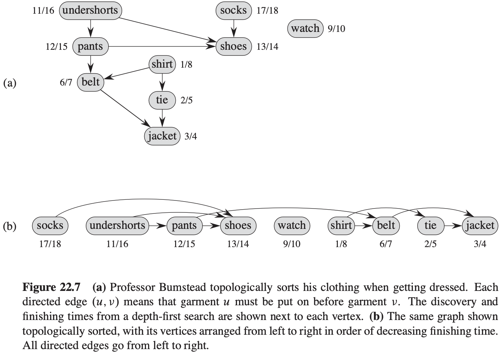

### Math Fundamentals 

**Lemma** A directed graph $G$ is acyclic if and only if a depth-first search of $G$ yields no back edges.

**Theorem** TOPOLOGICAL-SORT produces a topological sort of the directed acyclic graph provided as its input.

### Implement

Topological sorting for a Directed Acyclic Graph (DAG) is a linear ordering of vertices such that for every directed edge uv, vertex u comes before v in the ordering.  Topological Sorting for a graph is not possible if the graph is not a DAG.

Example:


Implement:

```c++
int topological_sort_dfs(Graph* graph, int v, int* state, int* stack, int* top)
{
    Node* cur;
    state[v] = 1;
    for (cur = graph->adj[v]; cur != NULL; cur = cur->next)
    {
        int to = cur->vertex;
        if (state[to] == 1)
            return 1;

        if (state[to] == 0)
            if (topological_sort_dfs(graph, to, state, stack, top))
                return 1;
    }

    state[v] = 2;
    stack[(*top)++] = v;
    return 0;
}

void topological_sort(Graph* graph)
{
    int i;
    int* state = (int*)calloc((size_t)graph->V, sizeof(int));
    int* stack = (int*)malloc((size_t)graph->V * sizeof(int));
    int top = 0;
    if (!state || !stack) 
    {
        free(state);
        free(stack);
        return;
    }

    for (i = 0; i < graph->V; ++i) 
    {
        if (state[i] != 0)
            continue;


        if (topological_sort_dfs(graph, i, state, stack, &top))
        {
            free(state);
            free(stack);
            return;
        }
    }

    free(state);
    free(stack);
}
```

Complexity:

| Scenario     | Time Complexity | Space Complexity |
| :----------- | :-------------- | :--------------- |
| Best Case    | $O(|V|)$        | $O(|V|)$         |
| Average Case | $O(|V| + |E|)$  | $O(|V|)$         |
| Worst Case   | $O(|V| + |E|)$  | $O(|V|)$         |

For the DFS-based implementation above (adjacency list), each vertex is colored at most once and each edge is explored at most once, so full traversal costs $O(|V| + |E|)$. The algorithm allocates `state` and `stack` arrays of size $|V|$, and recursive DFS depth can reach $|V|$, so auxiliary space is $O(|V|)$. In sparse best-case inputs (for example, no edges), running time becomes $O(|V|)$.


## Cycles

### Detect Cycle In a Directed Graph By Using DFS

Algorithms:

In DFS, we go as deep as possible from a starting node. If during this process, we reach a node that we’ve already visited in the same DFS path, it means we’ve gone back to an ancestor — this shows a cycle exists.

Examples:

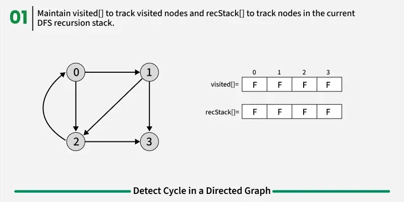

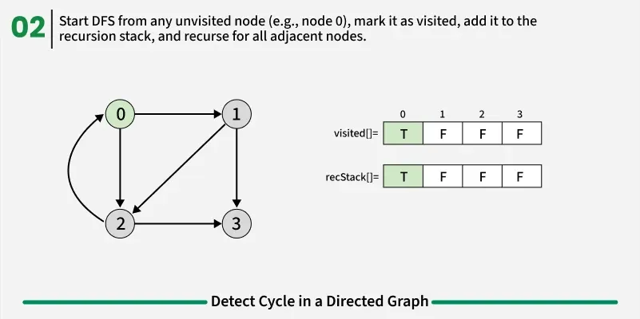

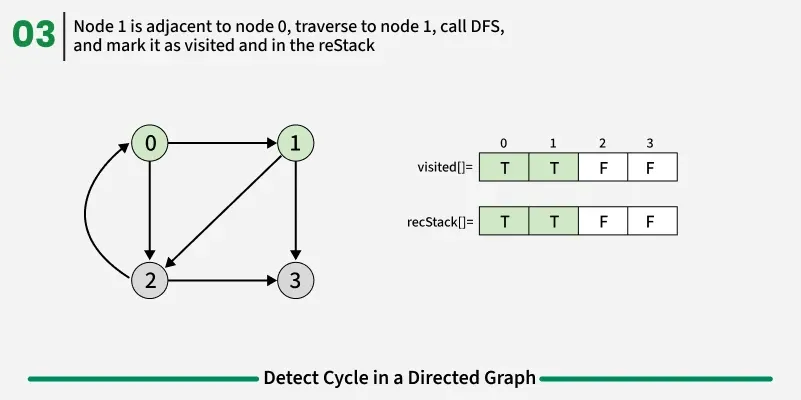

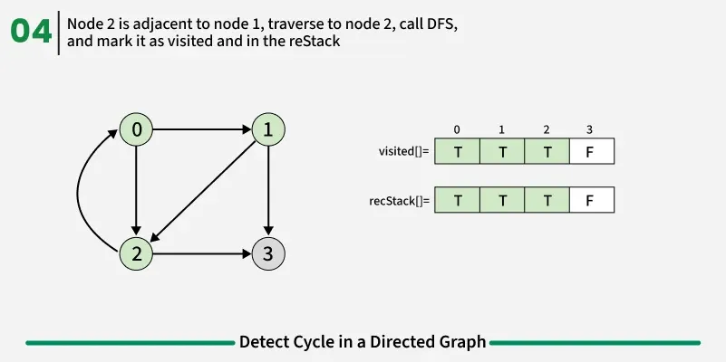

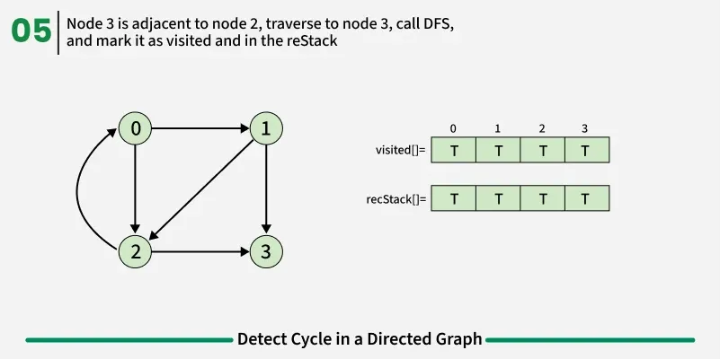

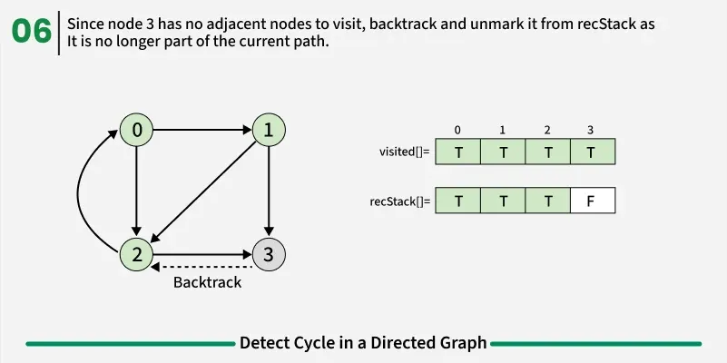

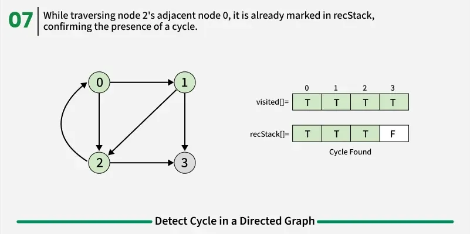

Implement:

```c++
// Utility DFS function to detect cycle in a directed graph
bool is_cycle_by_dfs_util(
    vector<vector<int>>& adj, 
    int u, 
    vector<bool>& visited, 
    vector<bool>& rec_stack) 
{
    
    // node is already in recursion stack cycle found
    if (rec_stack[u]) return true;  
    
    // already processed no need to visit again
    if (visited[u]) return false;   

    visited[u] = true;
    rec_stack[u] = true;

    // Recur for all adjacent nodes
    for (int v : adj[u])
        if (is_cycle_by_dfs_util(adj, v, visited, rec_stack))
            return true;

    // remove from recursion stack before backtracking
    rec_stack[u] = false; 
    return false;
}

// Function to detect cycle in a directed graph
bool is_cycle_by_dfs(vector<vector<int>>& adj) 
{
    int V = adj.size();
    vector<bool> visited(V, false);
    vector<bool> rec_stack(V, false);

    // Run DFS from every unvisited node
    for (int i = 0; i < V; i++) 
        if (!visited[i] && is_cycle_by_dfs_util(adj, i, visited, rec_stack))
            return true;

    return false;
}
```

Complexity:

| Scenario     | Time Complexity | Space Complexity |
| :----------- | :-------------- | :--------------- |
| Best Case    | $O(|V|)$        | $O(|V|)$         |
| Average Case | $O(|V| + |E|)$  | $O(|V|)$         |
| Worst Case   | $O(|V| + |E|)$  | $O(|V|)$         |

In this DFS-based cycle detection (adjacency list), each vertex is marked at most once and each directed edge is explored at most once before completion, so the full traversal cost is $O(|V| + |E|)$. The vectors `visited` and `rec_stack` use $O(|V|)$ memory, and recursive depth can be up to $|V|$ in the worst case. Because these vectors are initialized for all vertices, best-case running time is still $O(|V|)$ even if a cycle is detected quickly.

### Detect Cycle In an Undirected Graph By Using DFS

Algorithm:

When we start a DFS from a node, we visit all its connected neighbors one by one. If during this traversal, we reach a node that has already been visited before, it indicates that there might be a cycle, since we’ve come back to a previously explored vertex.

Example:

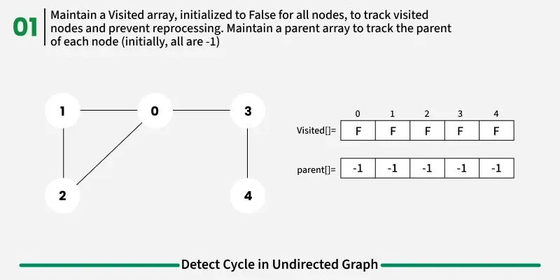

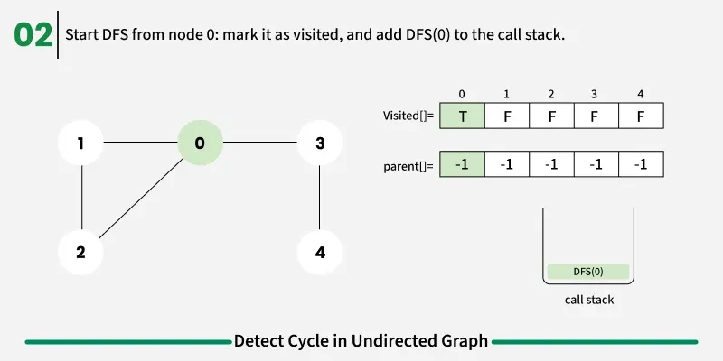

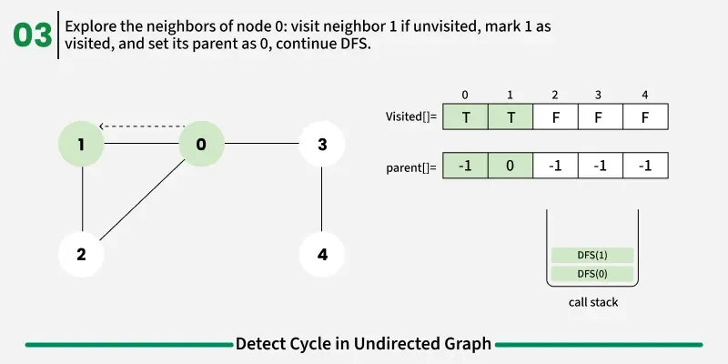

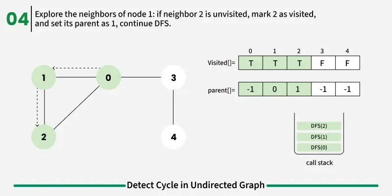

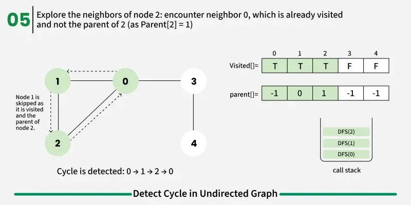

Implement:

```c++
bool dfs(int v, vector<vector<int>> &adj, vector<bool> &visited, int parent)
{
    // Mark the current node as visited
    visited[v] = true;

    // Recur for all the vertices adjacent to this vertex
    for (int i : adj[v])
    {
        // If an adjacent vertex is not visited, 
        //then recur for that adjacent
        if (!visited[i])
        {
            if (dfs(i, adj, visited, v))
                return true;
        }
        else if (i != parent)
        {
            // If an adjacent vertex is visited and is not
            // parent of current vertex,
            // then there exists a cycle in the graph.
            return true;
        }
    }

    return false;
}

// Returns true if the graph contains a cycle, else false.
bool is_cycle(vector<vector<int>> &adj)
{
    int V= adj.size();
    // Mark all the vertices as not visited
    vector<bool> visited(V, false);

    for (int u = 0; u < V; u++)
    {
        if (!visited[u])
        {
            if (dfs(u, adj, visited, -1))
                return true;
        }
    }

    return false;
}
```

Complexity:

| Scenario     | Time Complexity | Space Complexity |
| :----------- | :-------------- | :--------------- |
| Best Case    | $O(|V|)$        | $O(|V|)$         |
| Average Case | $O(|V| + |E|)$  | $O(|V|)$         |
| Worst Case   | $O(|V| + |E|)$  | $O(|V|)$         |

In this DFS-based undirected cycle check (adjacency list), each vertex is visited at most once and each undirected edge is examined at most twice (once from each endpoint), so full traversal is $O(|V| + |E|)$. The `visited` array requires $O(|V|)$ memory, and recursion depth can reach $|V|$ in the worst case, giving $O(|V|)$ auxiliary space. Since `visited` is initialized for all vertices, best-case time remains $O(|V|)$ even if a cycle is found early.

### Detect a Negative Weight Cycle By Using Bellman-Ford

Algorithm:

1. Initialize a distance array `dist` with all values as `0`
2. Perform edge relaxation **n - 1) times**:
   - For each edge `(u, v, wt)`
   - If `dist[u] + wt < dist[v]`, update `dist[v]`
3. Run one more iteration over all edges:
   - If any edge still relaxes → return `1` (negative cycle exists)
4. If no relaxation happens → return `0`

Implement:

```c++
bool is_negative_cycle(int n, vector<vector<int>> &edges)
{
    vector<int> dist(n, 0);
    // Relax edges n-1 times
    for (int i = 0; i < n - 1; i++)
    {
        for (auto edge : edges)
        {
            int u = edge[0];
            int v = edge[1];
            int wt = edge[2];

            if (dist[u] + wt < dist[v])
            {
                dist[v] = dist[u] + wt;
            }
        }
    }

    // Check for negative cycle
    for (auto edge : edges)
    {
        int u = edge[0];
        int v = edge[1];
        int wt = edge[2];

        if (dist[u] + wt < dist[v])
        {
            // negative cycle found
            return true; 
        }
    }
    return false; 
}
```

Complexity:

| Scenario     | Time Complexity | Space Complexity |
| :----------- | :-------------- | :--------------- |
| Best Case    | $O(|V||E|)$     | $O(|V|)$         |
| Average Case | $O(|V||E|)$     | $O(|V|)$         |
| Worst Case   | $O(|V||E|)$     | $O(|V|)$         |

This implementation performs exactly $|V|-1$ full relaxation passes over all edges, followed by one additional full pass to detect whether any edge can still relax. Therefore, total work is proportional to $|V| \cdot |E|$ in all cases. Auxiliary space is $O(|V|)$ for the `dist` array.


## Connectivity

TODO


## Maximum Flow

TODO


## Summary

### BFS vs DFS

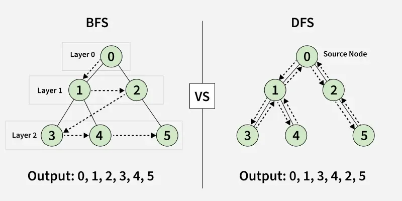

|        Parameters         |                             BFS                              |                             DFS                              |
| :-----------------------: | :----------------------------------------------------------: | :----------------------------------------------------------: |
|      **Stands for**       |             BFS stands for Breadth First Search.             |              DFS stands for Depth First Search.              |
|    **Data Structure**     | BFS(Breadth First Search) uses Queue data structure for finding the shortest path. |      DFS(Depth First Search) uses Stack data structure.      |
|      **Definition**       | BFS is a traversal approach in which we first walk through all nodes on the same level before moving on to the next level. | DFS is also a traversal approach in which the traverse begins at the root node and proceeds through the nodes as far as possible until we reach the node with no unvisited nearby nodes. |
| **Conceptual Difference** |             BFS builds the tree level by level.              |          DFS builds the tree sub-tree by sub-tree.           |
|     **Approach used**     |    It works on the concept of FIFO (First In First Out).     |     It works on the concept of LIFO (Last In First Out).     |
|     **Suitable for**      | BFS is more suitable for searching vertices closer to the given source. | DFS is more suitable when there are solutions away from source. |
|     **Applications**      | BFS is used in various applications such as bipartite graphs, shortest paths, etc. If weight of every edge is same, then BFS gives shortest path from source to every other vertex. | DFS is used in various applications such as acyclic graphs and finding strongly connected components etc. There are many applications where both BFS and DFS can be used like Topological Sorting, Cycle Detection, etc. |


## Reference

[1] Thomas H.Cormen; Charles E.Leiserson; Ronald L. Rivest; Clifford Stein. Introduction to Algorithms. 3ED

[2] Mark Allen Weiss. Data Structures and Algorithm Analysis in C++. 4ED

[3] [Graph Algorithms](https://www.geeksforgeeks.org/dsa/graph-data-structure-and-algorithms/)

[4] [Representation of Graph](https://www.geeksforgeeks.org/dsa/graph-and-its-representations/)

[5] [Topological Sorting](https://www.geeksforgeeks.org/dsa/topological-sorting/)

