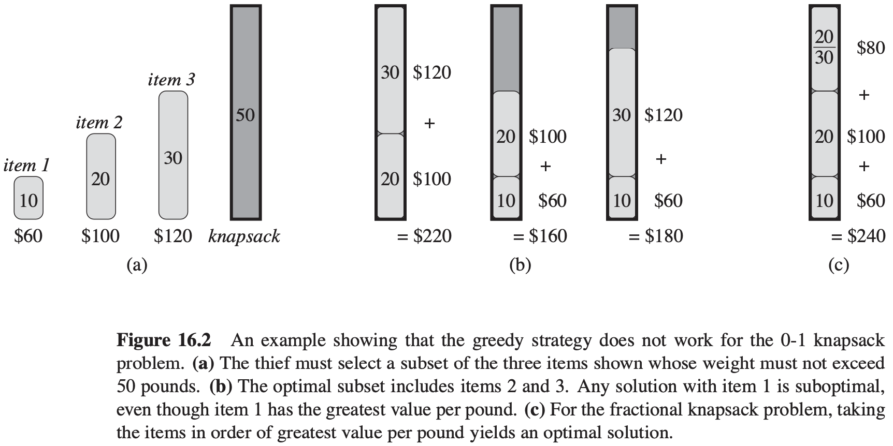

# Greedy Algorithm

[TOC]


A greedy algorithm obtains an optimal solution to a problem by making a sequence of choices. At each decision point, the algorithm makes choice that seems best at the moment.

## Elements

### Greedy-choice property

The first key ingredient is the **greedy-choice property**: we can assemble a globally optimal solution by making locally optimal (greedy) choices.

### Optimal substructure

A problem exhibits **optimal substructure** if an optimal solution to the problem contains within it optimal solutions to subproblems.


## Step


The problem-solving process for greedy problems can generally be divided into the following three steps:

1. Problem analysis: Sort out and understand the problem characteristics, including state definition, optimization objectives, and constraints, etc. This step is also involved in backtracking and dynamic programming.

2. Determine the greedy strategy: Determine how to make greedy choices at each step. This strategy should be able to reduce the problem size at each step, ultimately solving the entire problem

   Determining the greedy strategy may not be easy to implement, mainly for the following reasons:

   - Greedy strategies differ greatly between different problems.
   - Some greedy strategies are highly misleading.

3. Correctness proof: it is usually necessary to prove that the problem has both greedy choice property and optimal substructure. This step may require mathematical proofs, such as mathematical induction or proof by contradiction.


## Implement

```c++
int coin_change_greedy(const std::vector<int>& coins, int amount)
{
    // assume coins list is sorted in ascending order
    int i = coins.size() - 1; // Start with the largest coin
    int count = 0;
    while (amount > 0 && i >= 0)
    {
        while (i > 0 && coins[i] > amount)
            --i; // Move to smaller coin if current coin is too large

        amount -= coins[i]; // Use the coin
        ++count; // Increment count of coins used
    }
    return (amount == 0) ? count : -1; // Return count if exact
}
```


## Summary

### Suitcase

Generally, the applicability of greedy algorithms falls into the following two situations:

- Can guarantee finding the optimal solution;
- Can find an approximate optimal solution.

Below are some typical greedy algorithms problems:

- Coin change problem;
- Interval scheduling problem;
- Fractional knapsack problem;
- Stock trading problem;
- Huffman coding;
- Dijkstra's algorithm.

### Greedy Algorithm VS Dynamic Programming



Greedy algorithms and dynamic programming are both commonly used to solve optimization problems. They share some similarities, such as relying on the optimal substructure property, but they work differently:

- Dynamic programming consider all previous decisions when making the current decision, and uses solutions to past subproblems to construct the solution to the current subproblem;
- Greedy algorithms do not consider past decisions, but instead make greedy choices moving forward, continually reducing the problem size until the problem is solved.


## Reference

[1] Thomas H.Cormen; Charles E.Leiserson; Ronald L. Rivest; Clifford Stein . Introduction to Algorithms . 3th Edition

[2] Kenneth H. Rosen, Discrete Mathematics and Its Applications . 8ED

[3] [Hello Algo/Chapter 15.  Greedy](https://www.hello-algo.com/en/chapter_greedy/)