# Greedy Algorithm

[TOC]


A greedy algorithm obtains an optimal solution to a problem by making a sequence of choices. At each decision point, the algorithm makes a choice that seems best at the moment.

## Optimization Problem

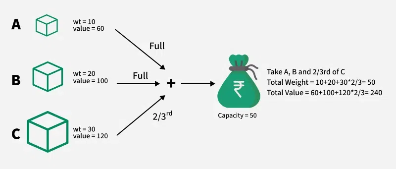

An optimization problem can be solved using Greedy if the problem has the following property: 

- **Greedy Choice Property:** The optimal solution can be constructed by making the best local choice at each step.
- **Optimal Substructure:** The optimal solution to the problem contains the optimal solutions to its sub-problems.

Generally, the applicability of greedy algorithms falls into the following two situations:

- Can guarantee finding the optimal solution;
- Can find an approximate optimal solution.

Below are some typical greedy algorithm problems:

- Coin change problem;
- Interval scheduling problem;
- Fractional knapsack problem;
- Stock trading problem
- Huffman coding;
- Dijkstra's algorithm.


## Workflow

Greedy Algorithm solve optimization problems by making the ***\*best local choice\**** at each step in the hope of finding the global optimum. It's like taking the best option available at each moment, hoping it will lead to the best overall outcome.

Here's how it works:

1. Start with the initial state of the problem.
2. Consider all the options available at that specific moment.
3. Choose the option that seems best at that moment, regardless of future consequences. This is the "greedy" part - you take the best option available now, even if it might not be the best in the long run.
4. Move to the new state based on your chosen option. This becomes your new starting point for the next iteration.
5. Repeat steps 2-4 until you reach the goal state or no further progress is possible.


## Types

### Activity Selection

Given two arrays *start[]* and *finish[]*, representing the start and finish times of activities. A person can perform only one activity at a time, and an activity can be performed only if its start time is greater than the finish time of the last chosen activity.

Find the maximum number of activities that can be performed without overlapping.

**Example:**

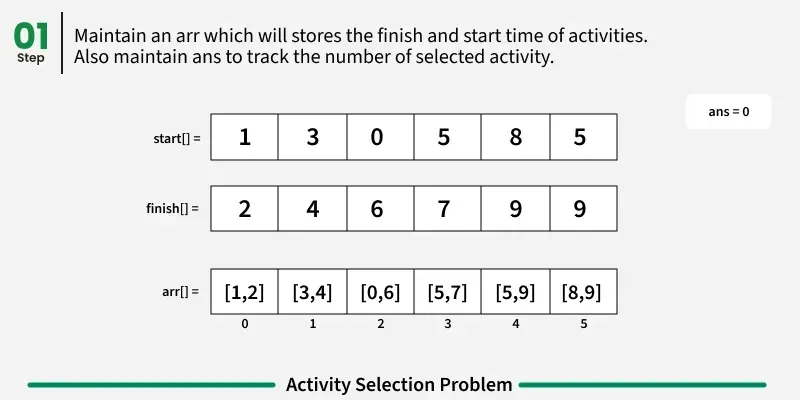

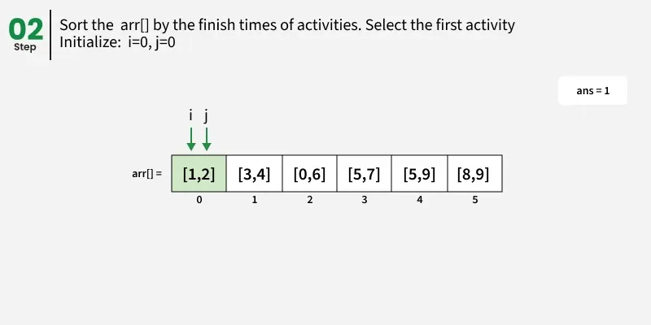

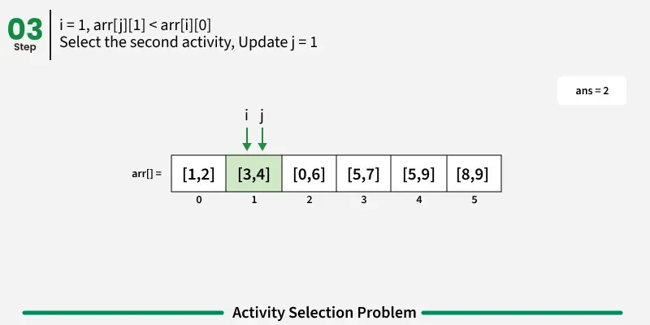

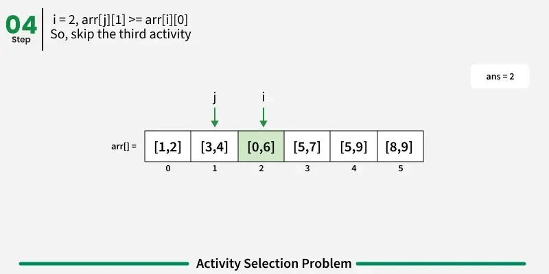

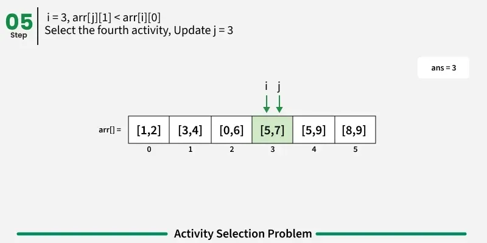

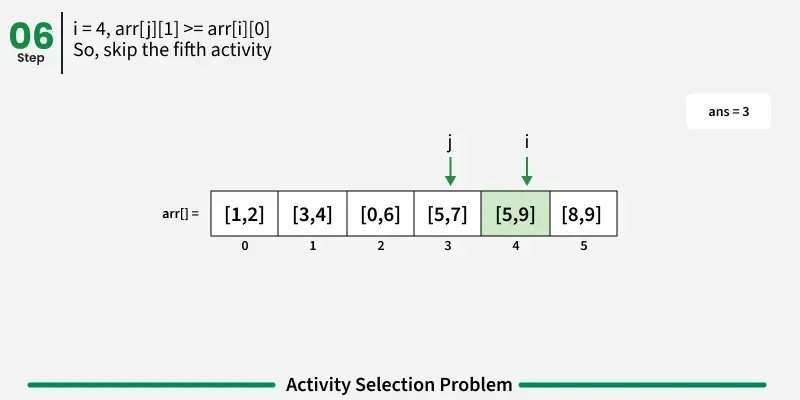

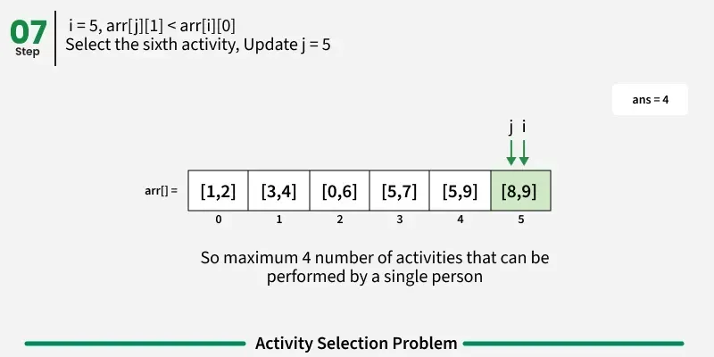

**Implement:**

```c++
int activity_selection(std::vector<int> &start, std::vector<int> &finish) 
{
    std::vector<std::vector<int>> arr;
    for (int i = 0; i < start.size(); i++)
        arr.push_back({start[i], finish[i]});

    std::sort(arr.begin(), arr.end(), 
        [](const std::vector<int>& a, const std::vector<int>& b) {
            return a[1] < b[1];
        });
    
    int count = 1;  
    int j = 0;      
    for (int i = 1; i < arr.size(); i++) 
    {
        if (arr[i][0] > arr[j][1]) 
        {
            count++;
            j = i;  
        }
    }

    return count;
}
```

### Maximal Disjoint Intervals

Given a 2D array *arr[][]* of order *nx2*, representing n *intervals* with *start* and *end* points, the task is to find the *maximal* set of mutually *disjoint* intervals.

**Implement:**

```c++
bool is_disj(std::vector<std::vector<int>> &subs) 
{
    int n = subs.size();
    for (int i = 0; i < n; i++) 
    {
        for (int j = i + 1; j < n; j++) 
        {
            
            // If there is any overlapping
            if (subs[i][1] > subs[j][0] &&
                subs[i][0] < subs[j][1])
                return false; 
        }
    }
    return true;
}

std::vector<std::vector<int>> max_disj(std::vector<std::vector<int>> &arr) 
{
    int n = arr.size();
    std::vector<std::vector<int>> res;

    int subCnt = (1 << n);
    for (int mask = 0; mask < subCnt; mask++) 
    {
        std::vector<std::vector<int>> subs;

        // Form subs based on mask bits
        for (int i = 0; i < n; i++)
            if (mask & (1 << i))
                subs.push_back(arr[i]);

        // Check if the subs is disjoint
        if (is_disj(subs) && subs.size() > res.size())
            res = subs; 
    }

    return res;
}
```

### Fractional Knapsack

Given two arrays, *val[]* and *wt[]*, representing the values and weights of items, respectively, and an integer *capacity* representing the maximum weight a knapsack can hold, we have to determine the maximum total value that can be achieved by putting the items in the knapsack without exceeding its capacity.

Items can also be taken in fractional parts if required.

**Solution:**

1. Calculate the ratio (value/weight) for each item.
2. Sort all the items in decreasing order of the ratio.
3. Iterate through items:
   if the current item fully fits, add its full value and decrease capacity; otherwise, take the fractional part that fits and add proportional value.
4. Stop once the capacity becomes zero.

**Implement:**

```c++
float fractional_knapsack(float val[], float wt[], int capacity, int n) 
{
    float items[n][2];
    for (int i = 0; i < n; i++) 
    {
        items[i][0] = val[i];
        items[i][1] = wt[i];
    }
    
    std::qsort(items, n, sizeof(float[2]), [](const void *a, const void *b) -> int {
        float a1 = (*(float *)a) / (*(float *)a + 1);
        float b1 = (*(float *)b) / (*(float *)b + 1);
        return (b1 - a1);
    });
    float res = 0.0;
    float currentCapacity = capacity;
    for (int i = 0; i < n; i++) 
    {
        if (items[i][1] <= currentCapacity) 
        {
            res += items[i][0];
            currentCapacity -= items[i][1];
        }
        else 
        {
            res += (items[i][0] / items[i][1]) * currentCapacity;
            break;
        }
    }
    return res;
}
```

### Kruskal’s Minimum Spanning Tree (MST) Algorithm

A minimum spanning tree (MST) or minimum weight spanning tree for a weighted, connected, and undirected graph is a spanning tree (no cycles and connects all vertices) that has minimum weight. The weight of a spanning tree is the sum of all edges in the tree.  

**Example:**

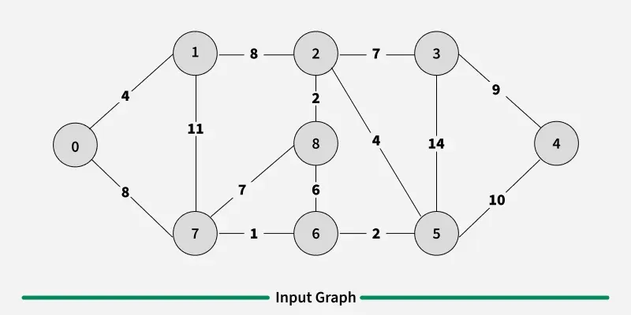

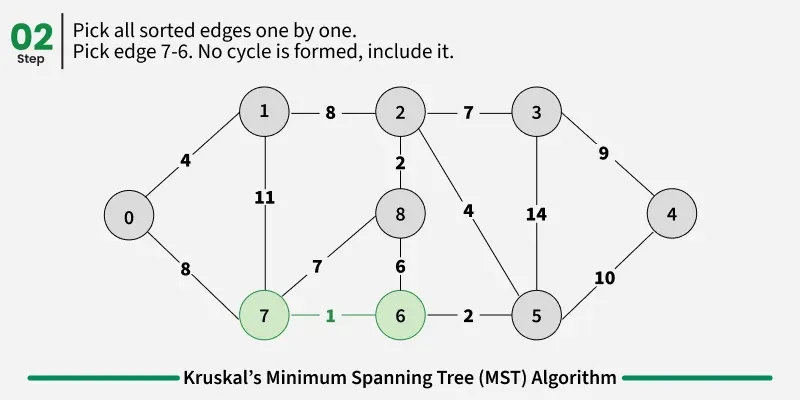

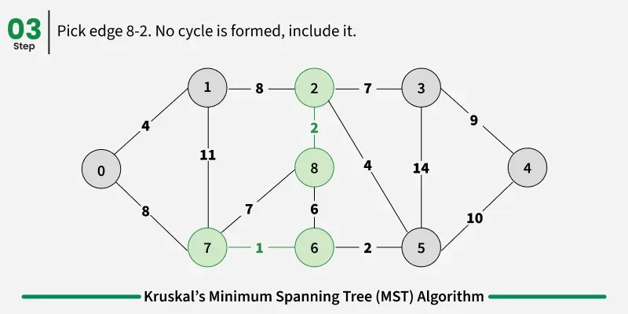

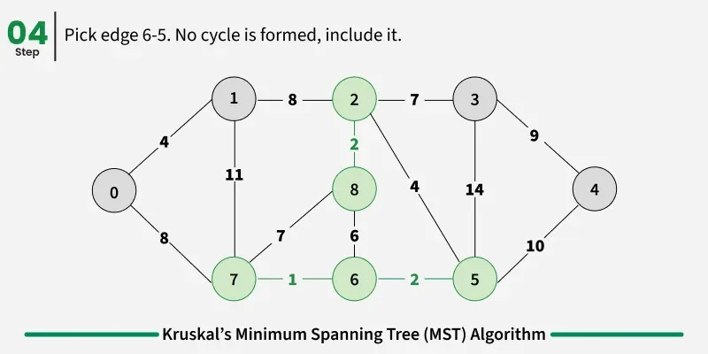

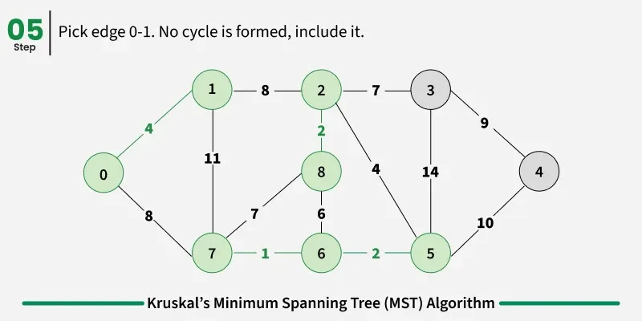

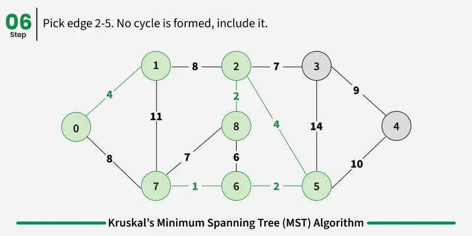

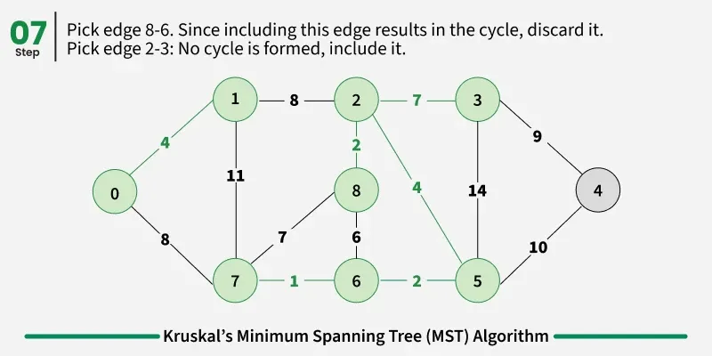

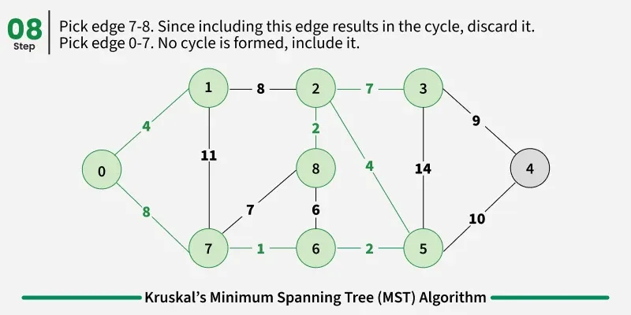

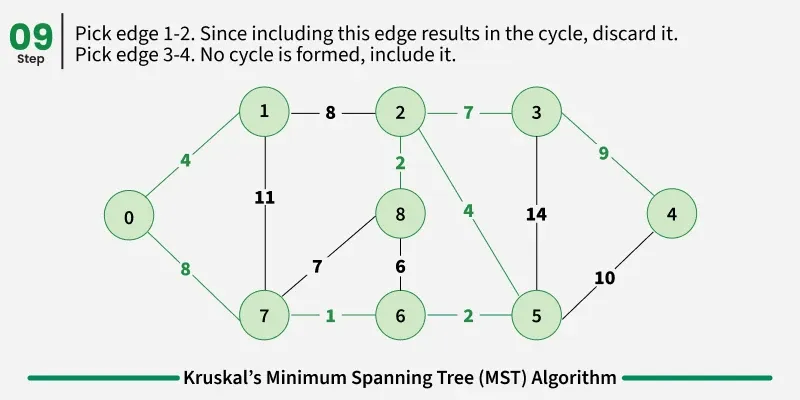

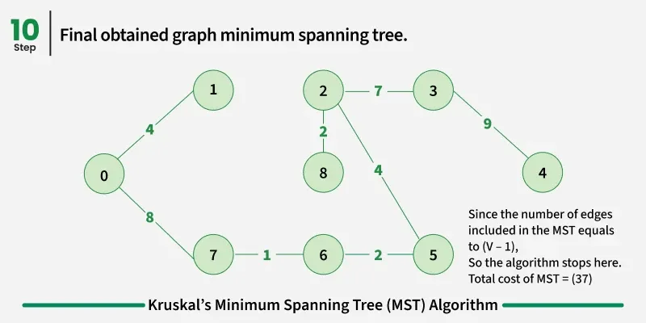

### Connect N ropes

Given an array *arr[]* of rope lengths, connect all ropes into a single rope with the *minimum* total cost. The cost to connect two ropes is the *sum* of their lengths.

**Example:**

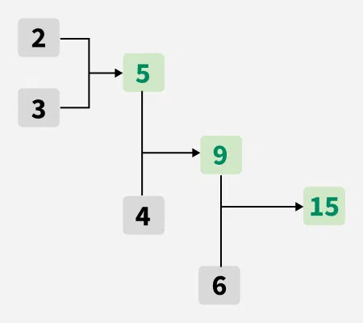

**Implement:**

```c++
int min_cost(std::vector<int>& arr) 
{
    int total_cost = 0;
    while (arr.size() > 1) 
    {
        sort(arr.begin(), arr.end());
        int first = arr[0];
        int second = arr[1];
        arr.erase(arr.begin());
        arr.erase(arr.begin());
        int cost = first + second;
        total_cost += cost;
        arr.push_back(cost);
    }

    return total_cost;
}
```

### Minimum Number of Jumps To Reach The End

Given an array *arr[]* of non-negative integers, where each element represents the maximum number of steps you can jump forward from that index, determine the minimum number of jumps required to reach the *last index* starting from the *first index*. If it is not possible to reach the end, return *-1*.

**Example:**

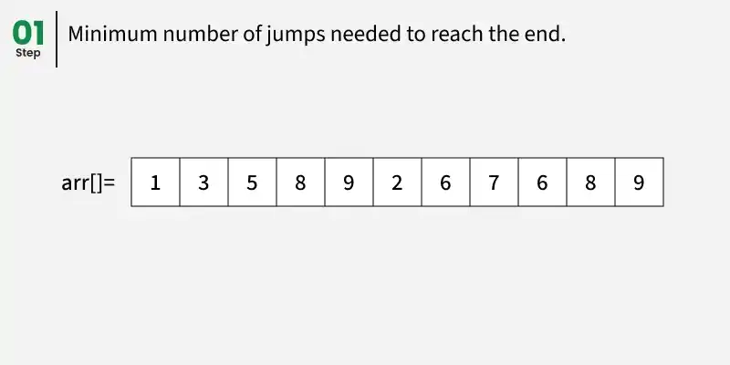

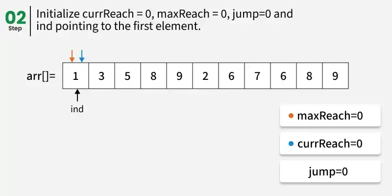

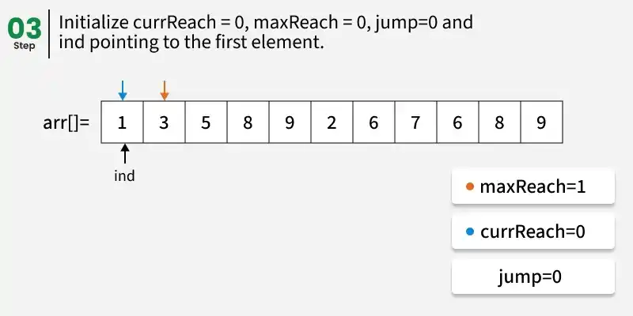

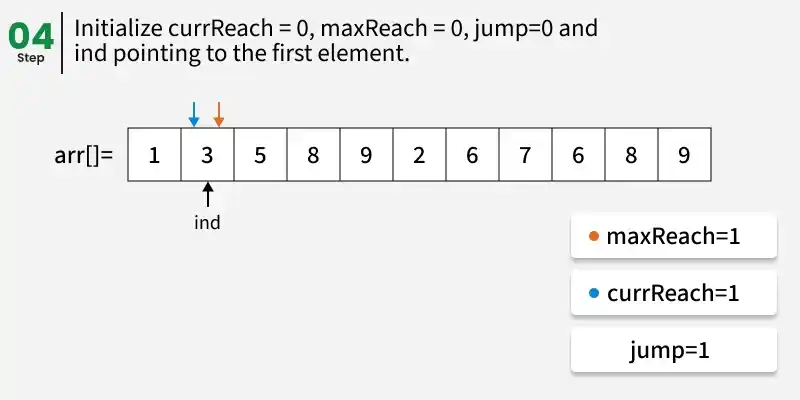

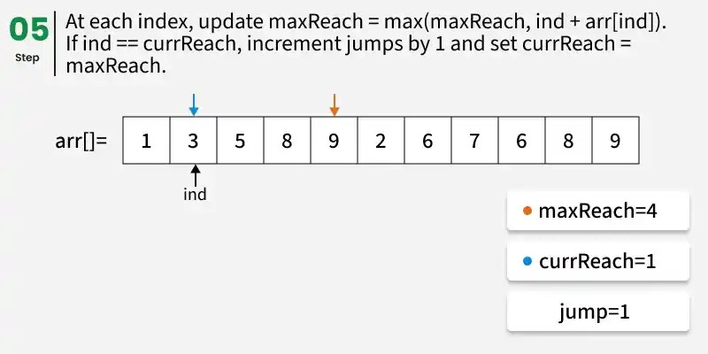

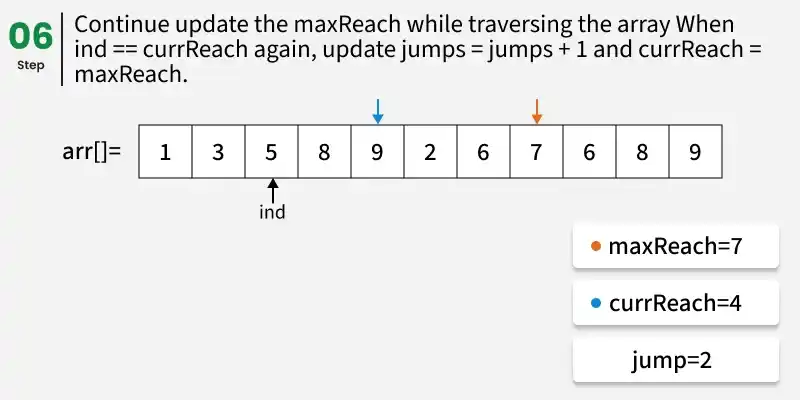

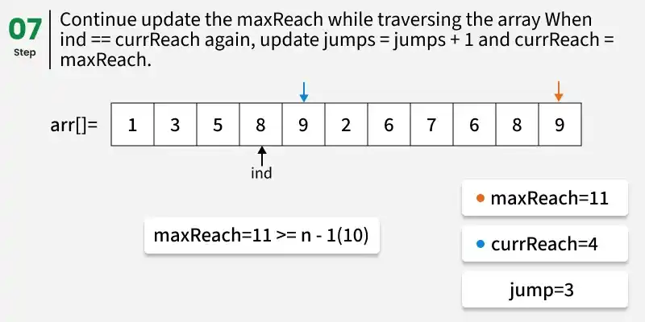

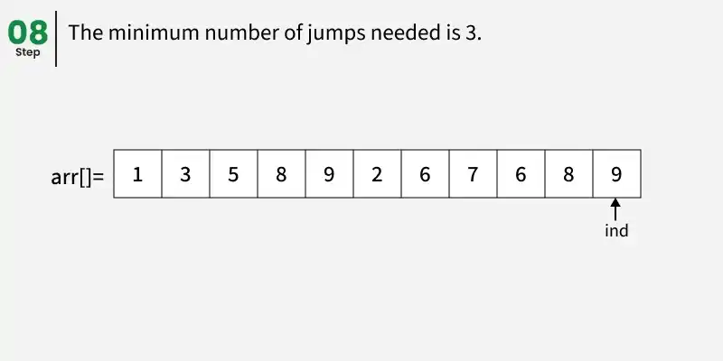

**Implement:**

```c++
int min_cost(std::vector<int>& arr) 
{
    int total_cost = 0;
    while (arr.size() > 1) 
    {
        sort(arr.begin(), arr.end());
        int first = arr[0];
        int second = arr[1];
        arr.erase(arr.begin());
        arr.erase(arr.begin());
        int cost = first + second;
        total_cost += cost;
        arr.push_back(cost);
    }

    return total_cost;
}
```

### Dijkstra Algorithm

For more info, see: [Shortest-Path Algorithms#Dijkstra's algorithm](shortest_path_problem.md)

### Huffman Encoding

For more info, see: [Huffman Coding](huffman.md)


## Example: Coin change problem

Question: Let's say you have a set of coins with values 1, 2, 5, 10] and you need to give the minimum number of coins to someone to change for 39.

Answer:

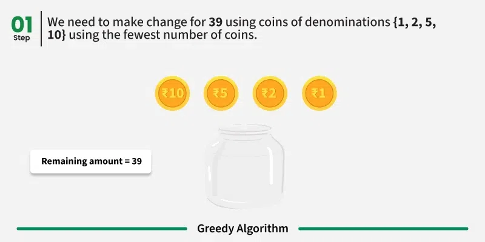

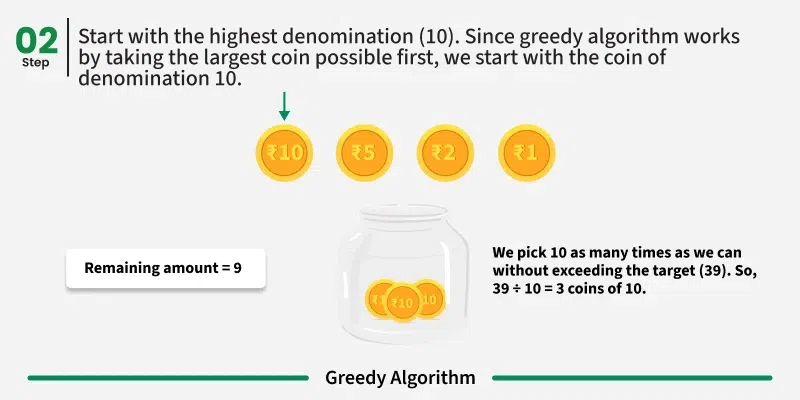

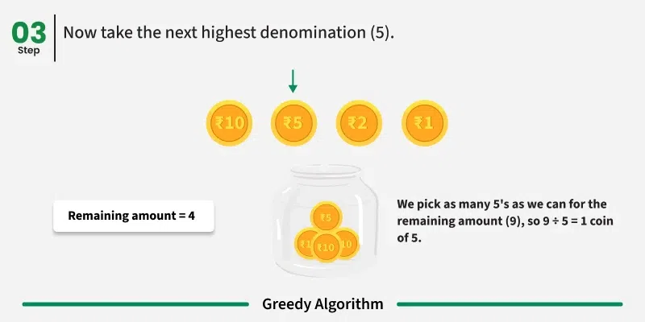

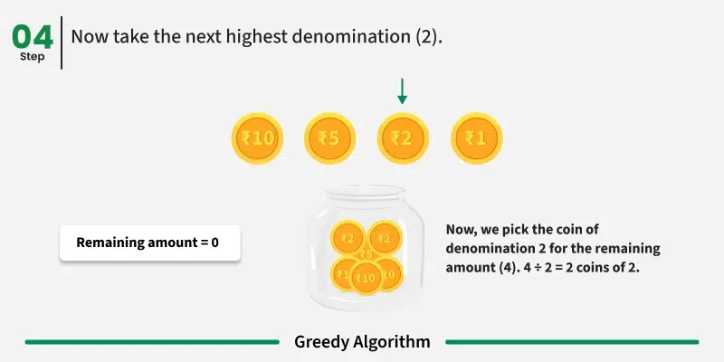

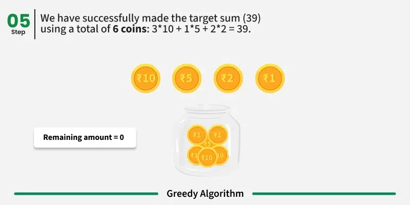

Implement:

```c++
int coin_change_greedy(const std::vector<int>& coins, int amount)
{
    // assume coins list is sorted in ascending order
    int i = coins.size() - 1; // Start with the largest coin
    int count = 0;
    while (amount > 0 && i >= 0)
    {
        while (i > 0 && coins[i] > amount)
            --i; // Move to smaller coin if current coin is too large

        amount -= coins[i]; // Use the coin
        ++count; // Increment count of coins used
    }
    return (amount == 0) ? count : -1; // Return count if exact
}
```


## Summary

### Greedy Algorithm vs Dynamic Programming

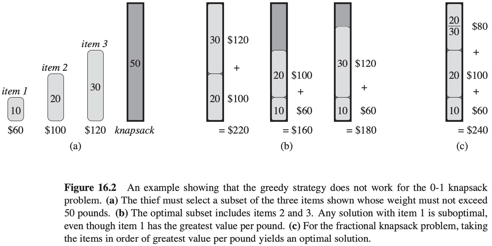

|       Feature        |                       Greedy Approach                        |                     Dynamic Programming                      |
| :------------------: | :----------------------------------------------------------: | :----------------------------------------------------------: |
|    **Optimality**    |         May not always provide an optimal solution.          | Guarantees an optimal solution if the problem exhibits the principle of optimality. |
| **Subproblem Reuse** |           Does not reuse solutions to subproblems.           |         Reuses solutions to overlapping subproblems.         |
|   **Backtracking**   |                Does not involve backtracking.                | May involve backtracking, especially in top-down implementations. |
|    **Complexity**    |          Typically simpler and faster to implement.          |         May be more complex and slower to implement.         |
|   **Application**    | Suitable for problems where local optimization leads to global optimization. | Suitable for problems with overlapping subproblems and optimal substructure. |
|     **Examples**     |       Minimum Spanning Tree, Shortest Path algorithms.       |       Fibonacci sequence, Longest Common Subsequence.        |

Here are the main differences between these two approaches:

1. Greedy Approach
   - The greedy approach makes the best choice at each step with the hope of finding a **global optimum** solution.
   - It selects the **locally optimal** solution at each stage without considering the overall effect on the solution.
   - Greedy algorithms are usually simple, easy to implement, and efficient, but they may not always lead to the best solution.
2. Dynamic Programming
   - Dynamic programming breaks down a problem into **smaller subproblems** and solves each subproblem only once, storing its solution.
   - It uses the results of solved subproblems to build up a solution to the larger problem.
   - Dynamic programming is typically used when the same subproblems are being solved multiple times, leading to inefficient recursive algorithms. By storing the results of subproblems, dynamic programming avoids redundant computations and can be more efficient.


## Reference

[1] Thomas H.Cormen; Charles E.Leiserson; Ronald L. Rivest; Clifford Stein. Introduction to Algorithms. 3th Edition

[2] Kenneth H. Rosen, Discrete Mathematics and Its Applications . 8ED

[3] [Hello Algo/Chapter 15.  Greedy](https://www.hello-algo.com/en/chapter_greedy/)

[4] [Introduction to Greedy Algorithms](https://www.geeksforgeeks.org/dsa/introduction-to-greedy-algorithm-data-structures-and-algorithm-tutorials/)

[5] [Greedy Algorithms General Structure](https://www.geeksforgeeks.org/dsa/greedy-algorithms-general-structure-and-applications/)

[6] [Greedy Approach vs Dynamic programming](https://www.geeksforgeeks.org/dsa/greedy-approach-vs-dynamic-programming/)

[7] [Activity Selection](https://www.geeksforgeeks.org/dsa/activity-selection-problem-greedy-algo-1/)

[8] [Maximal Disjoint Intervals](https://www.geeksforgeeks.org/dsa/maximal-disjoint-intervals/)

[9] [Fractional Knapsack](https://www.geeksforgeeks.org/dsa/fractional-knapsack-problem/)

[10] [Kruskal’s Minimum Spanning Tree (MST) Algorithm](https://www.geeksforgeeks.org/dsa/kruskals-minimum-spanning-tree-algorithm-greedy-algo-2/)

[11] [Connect n ropes with minimum cost](https://www.geeksforgeeks.org/dsa/connect-n-ropes-minimum-cost/)

[12] [Huffman Coding Algorithm](https://www.geeksforgeeks.org/dsa/huffman-coding-greedy-algo-3/)