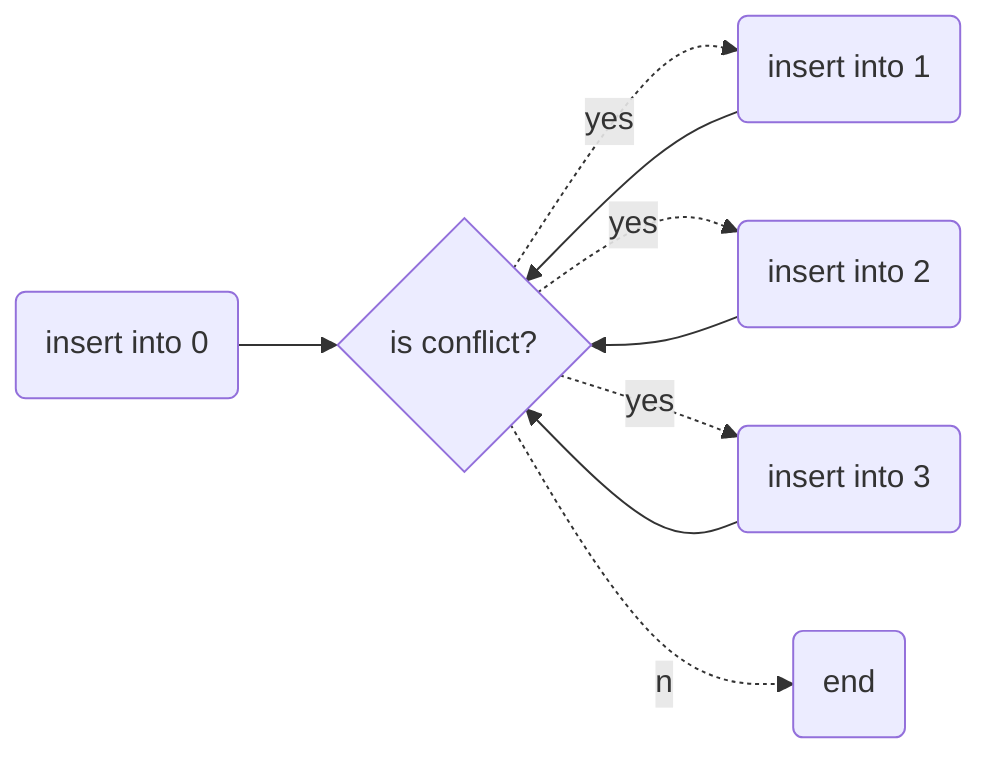

[中文版](hash_zh.md) | English

# Hash

[TOC]

## Terminology

- `hash function`, which ideally should be simple to compute and should ensure that any two distinct keys get different cells.

## Hash Conflict

### Linear Probing

Example:

| 0    | 1    | 2    | 3    | 4    | 5    | 6    | 7    | 8    | 9    |
| ---- | ---- | ---- | ---- | ---- | ---- | ---- | ---- | ---- | ---- |
| 49   | 18   | 29   |      |      |      |      |      | 38   | 79   |

### Quadratic Probing

TODO

### Separate Chaining

`separate chaining`: is to keep a list of all elements that hash to the same value.

Example:

| 0           | 1           | 2           | 3    | 4    | 5    | 6    | 7    | 8           | 9           |
| ----------- | ----------- | ----------- | ---- | ---- | ---- | ---- | ---- | ----------- | ----------- |
| linked list | linked list | linked list |      |      |      |      |      | linked list | linked list |
| 49          | 18          | 29          |      |      |      |      |      | 38          | 79          |
|             |             |             |      |      |      |      |      |             |             |

insert 32 into 1, conflict with 18:

| 0           | 1           | 2           | 3    | 4    | 5    | 6    | 7    | 8           | 9           |
| ----------- | ----------- | ----------- | ---- | ---- | ---- | ---- | ---- | ----------- | ----------- |
| linked list | linked list | linked list |      |      |      |      |      | linked list | linked list |
| 49          | 18          | 29          |      |      |      |      |      | 38          | 79          |
|             | 32          |             |      |      |      |      |      |             |             |

## Hash Function

TODO

## Reference

[1] Thomas H.Cormen, Charles E.Leiserson, Ronald L. Rivest, Clifford Stein . Introduction to Algorithms . 3ED
