[中文版](hash_zh.md) | English

# Hash

[TOC]


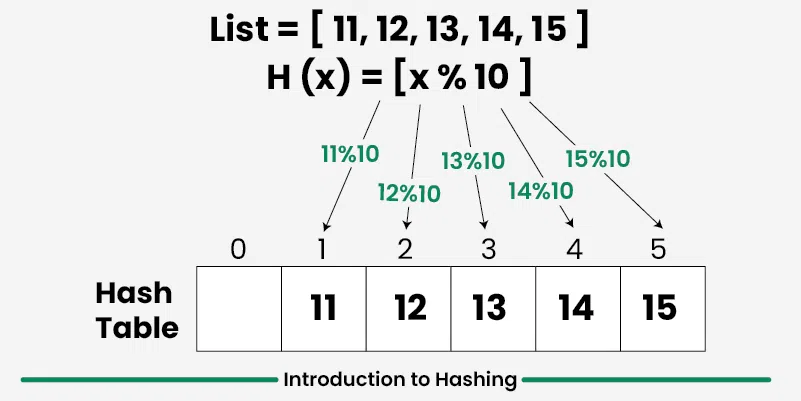

**Hashing** refers to the process of generating a small-sized output (that can be used as an index in a table) from an input of typically large and variable size. Hashing uses mathematical formulas known as hash functions to do the transformation. This technique determines an index or location for the storage of an item in a data structure called a hash table.


## Hash Components

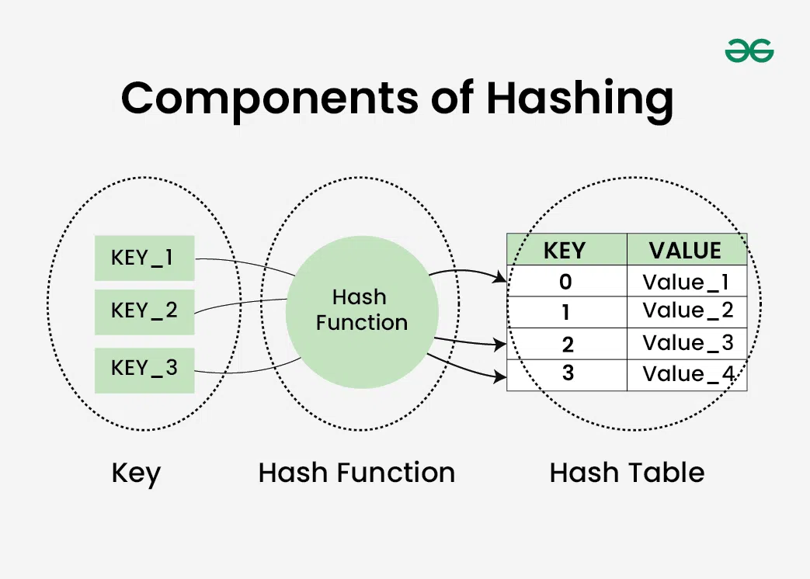

- **Key:** A Key can be anything string or integer which is fed as input in the hash function the technique that determines an index or location for storage of an item in a data structure.
- **Hash Function:** Receives the input key and returns the index of an element in an array called a hash table. The index is known as the hash index .
- **Hash Table:** Hash table is typically an array of lists. It stores values corresponding to the keys. Hash stores the data in an associative manner in an array where each data value has its own unique index.


## Collision Resolution

### Collision Condition

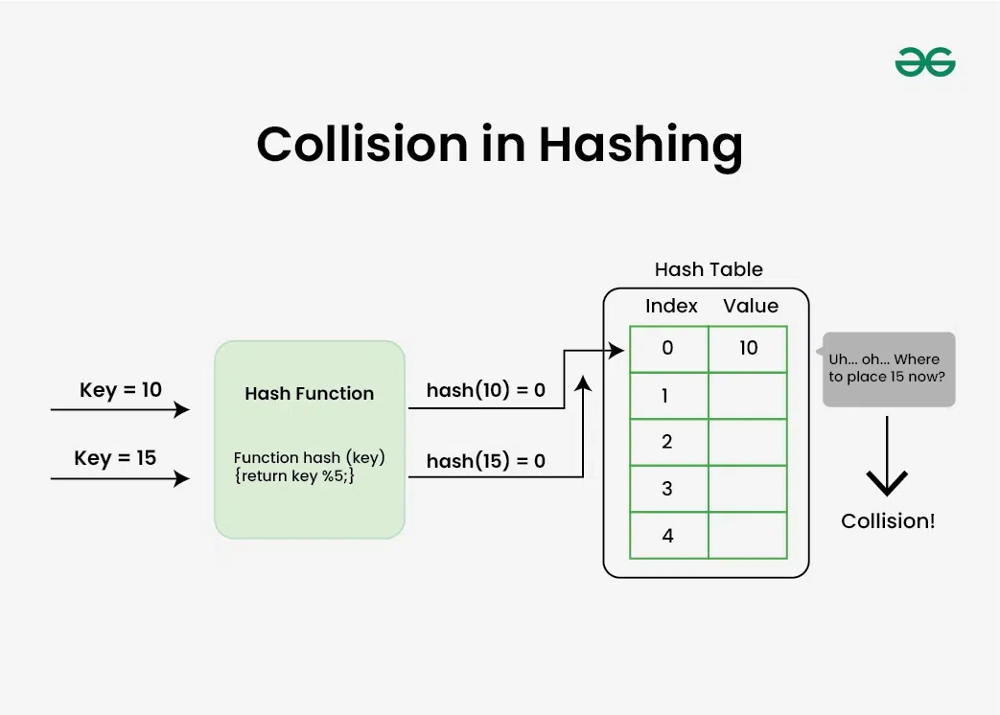

In **Hashing**, hash functions were used to generate hash values. The hash value is used to create an index for the keys in the hash table. The hash function may return the same hash value for two or more keys. When two or more keys have the same hash value, a **collision** happens.

### Collision Resolution Techniques

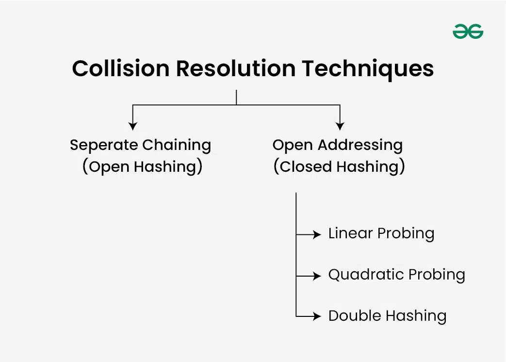

### Separate Chaining

The idea behind Separate Chaining is to make each cell of the hash table point to a linked list of records that have the same hash function value. Chaining is simple but requires additional memory outside the table.

Example:

| 0           | 1           | 2           | 3    | 4    | 5    | 6    | 7    | 8           | 9           |
| ----------- | ----------- | ----------- | ---- | ---- | ---- | ---- | ---- | ----------- | ----------- |
| linked list | linked list | linked list |      |      |      |      |      | linked list | linked list |
| 49          | 18          | 29          |      |      |      |      |      | 38          | 79          |
|             |             |             |      |      |      |      |      |             |             |

insert 32 into 1, conflict with 18:

| 0           | 1           | 2           | 3    | 4    | 5    | 6    | 7    | 8           | 9           |
| ----------- | ----------- | ----------- | ---- | ---- | ---- | ---- | ---- | ----------- | ----------- |
| linked list | linked list | linked list |      |      |      |      |      | linked list | linked list |
| 49          | 18          | 29          |      |      |      |      |      | 38          | 79          |
|             | 32          |             |      |      |      |      |      |             |             |

### Linear Probing

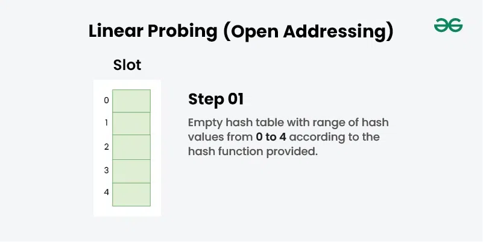

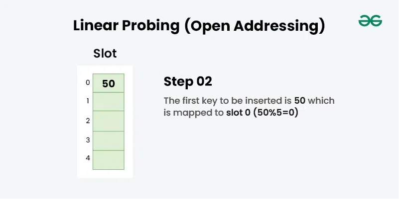

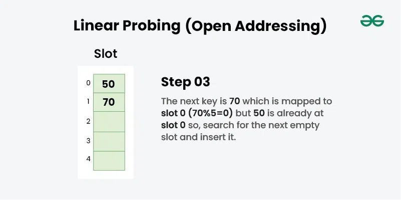

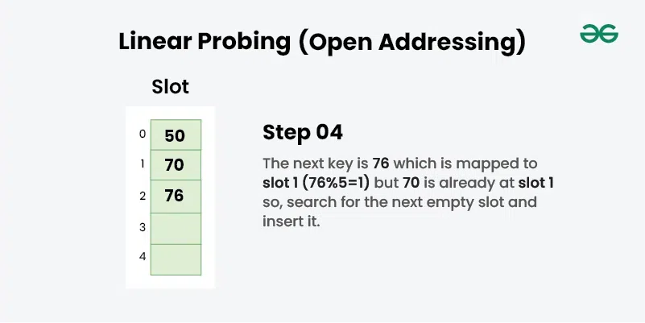

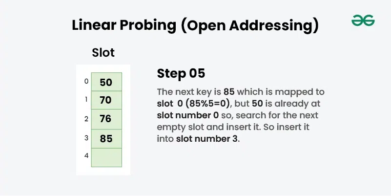

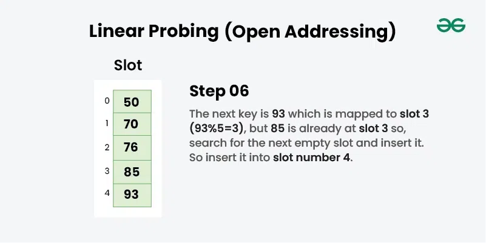

In linear probing, the hash table is searched sequentially that starts from the original location of the hash. If in case the location that we get is already occupied, then we check for the next location.

### Quadratic Probing

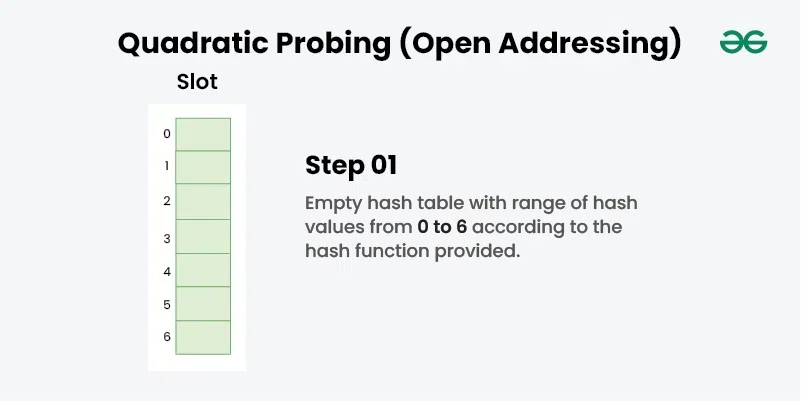

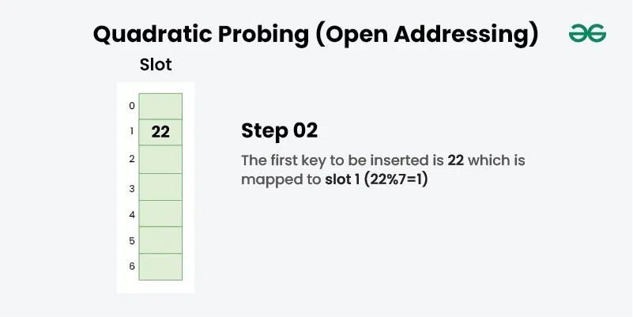

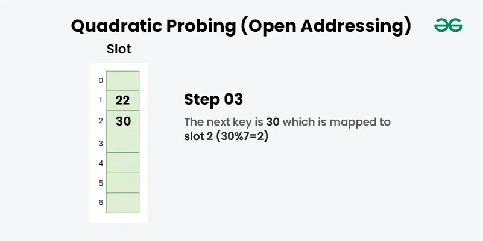

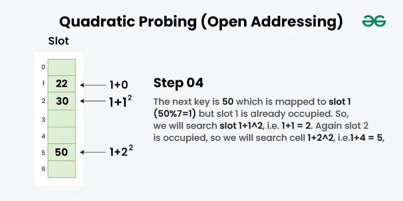

Quadratic probing is an open addressing scheme in computer programming for resolving hash collisions in hash tables. Quadratic probing operates by taking the original hash index and adding successive values of an arbitrary quadratic polynomial until an open slot is found.

### Double Hashing

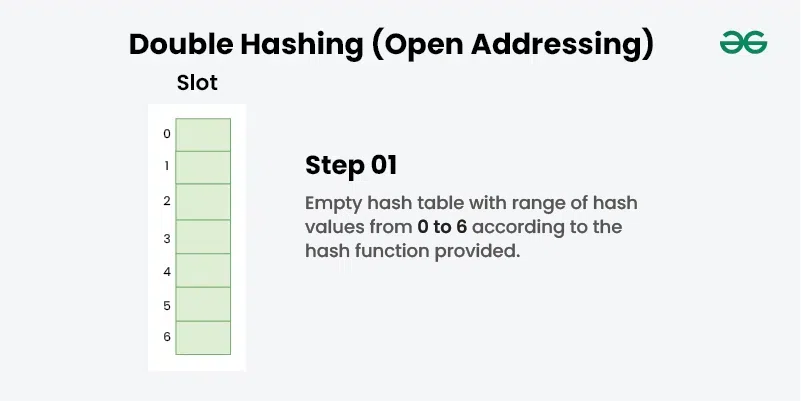

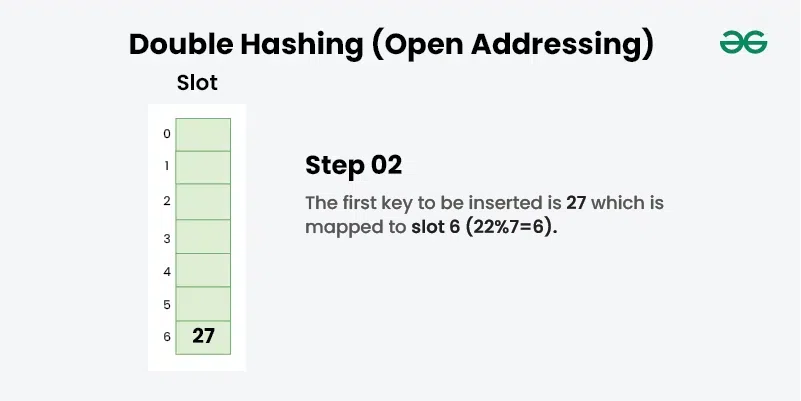

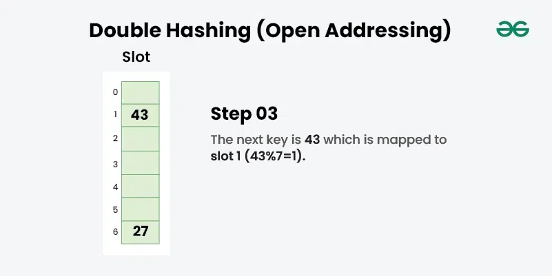

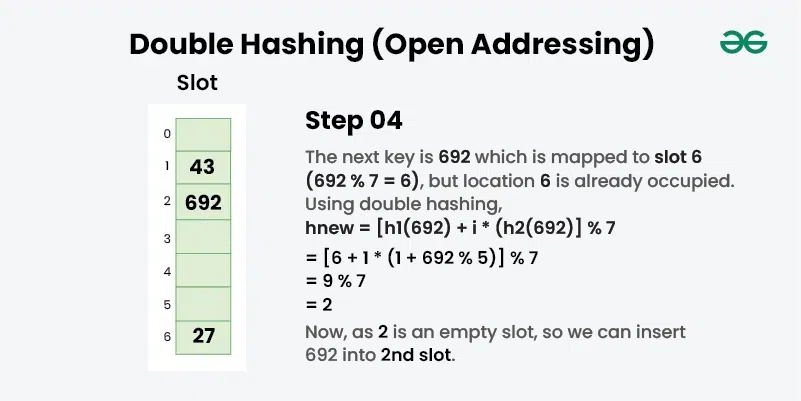

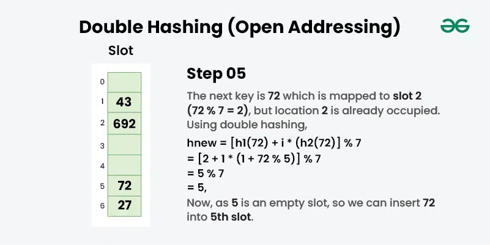

Double hashing is a collision resolving technique in Open Addressed Hash tables. Double hashing make use of two hash function,

- The first hash function is *h1(k)* which takes the key and gives out a location on the hash table. But if the new location is not occupied or empty then we can easily place our key.
- But in case the location is occupied (collision) we will use secondary hash-function *h2(k)* in combination with the first hash-function *h1(k)* to find the new location on the hash table.

This combination of hash functions is of the form

> *h(k, i) = (h1(k) + i \* h2(k)) % n*

where

- `i` is a non-negative integer that indicates a collision number,
- `k` = element/key which is being hashed
- `n` = hash table size.


## Hash Function

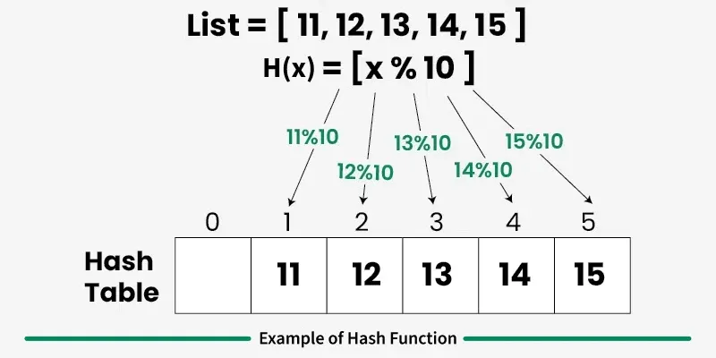

A hash function is a function that takes an input (or key) of arbitrary size and converts it into a fixed-size value, called a hash value or hash code.

### Properties

- **Deterministic**: A hash function must consistently produce the same output for the same input.
- **Fixed Output Size**: The output of a hash function should have a fixed size, regardless of the size of the input.
- **Efficiency**: The hash function should be able to process input quickly.
- **Uniformity**: The hash function should distribute the hash values uniformly across the output space to avoid clustering.
- **Pre-image Resistance**: It should be computationally infeasible to reverse the hash function, i.e., to find the original input given a hash value.
- **Collision Resistance**: It should be difficult to find two different inputs that produce the same hash value.
- **Avalanche Effect**: A small change in the input should produce a significantly different hash value.

### Types

#### Division Method

The division method computes the hash value as the remainder when the key is divided by $m$, where m is usually chosen as a prime number:
$$
h(k) = k \mod m
$$
, where $k$ is the key and $m$ is typically chosen as a prime number.

#### Multiplication Method

In this method, the key is multiplied by a constant $A$ (where 0 < $A$ < 1). The fractional part of the result is then multiplied by m to obtain the hash value:
$$
h(k) = \lfloor m \times ((k \times A) \mod 1) \rfloor
$$
, where $\lfloor \rfloor$ denotes the floor function.

#### Mid-Square Method

This method involves squaring the key and extracting the middle portion of the result to generate the hash value.

Steps:

1. Square the key.
2. Extract the middle digits of the squared value.

#### Folding Method

In the folding method, the key is divided into several smaller parts, and these parts are combined (usually by addition) to generate the hash value.

Steps:

1. Split the key into equal or nearly equal segments.
2. Add all the segments to obtain an intermediate sum.
3. Apply modulo operation (if required) to fit the hash table size.
4. Optionally, reverse alternate segments before adding to improve distribution.

#### Cryptographic Hash Functions

These hash functions are designed for security rather than speed. They are used in applications where data protection is critical.

#### Universal Hashing

Universal hashing uses a set of hash functions and selects one randomly at runtime. The goal is to minimize the probability of collisions regardless of the input distribution.
$$
h(k) = ((a \times k + b) \mod p) \mod m
$$
, where $a$ and $b$ are randomly chosen constants, $p$ is a prime number greater than $m$, and $k$ is the key.

#### Perfect Hashing

Perfect hashing is a technique used to construct a hash function for a fixed set of keys, ensuring that each key maps to a unique index with no collisions.

Perfect hashing is commonly classified into two main types:

- **Minimal Perfect Hashing:** Ensures that the range of the hash function is equal to the number of keys.
- **Non-minimal Perfect Hashing:** The range may be larger than the number of keys.


## MurmurHash Algorithm

The **MurmurHash algorithm** was invented by Austin Appleby in 2008; as of 2021, there are three versions: `MurmurHash1`, `MurmurHash2`, and `MurmurHash3`. Compared to other hash functions, MurmurHash has better random distribution characteristics for keys with strong patterns. It is used in Redis, Memcached, Cassandra, HBase, and Lucene.

### Principle

The following source code is referenced from [smasher](https://github.com/aappleby/smhasher)

x86 Platform 32-bit:

```c++
void MurmurHash3_x86_32 ( const void * key, int len,
													uint32_t seed, void * out )
{
	const uint8_t * data = (const uint8_t*)key;
	const int nblocks = len / 4;

	uint32_t h1 = seed;

	const uint32_t c1 = 0xcc9e2d51;
	const uint32_t c2 = 0x1b873593;

	//----------
	// body

	const uint32_t * blocks = (const uint32_t *)(data + nblocks*4);

	for(int i = -nblocks; i; i++)
	{
		uint32_t k1 = getblock32(blocks,i);

		k1 *= c1;
		k1 = ROTL32(k1,15);
		k1 *= c2;
    
		h1 ^= k1;
		h1 = ROTL32(h1,13); 
		h1 = h1*5+0xe6546b64;
	}

	//----------
	// tail

	const uint8_t * tail = (const uint8_t*)(data + nblocks*4);

	uint32_t k1 = 0;

	switch(len & 3)
	{
	case 3: k1 ^= tail[2] << 16;
	case 2: k1 ^= tail[1] << 8;
	case 1: k1 ^= tail[0];
					k1 *= c1; k1 = ROTL32(k1,15); k1 *= c2; h1 ^= k1;
	};

	//----------
	// finalization

	h1 ^= len;

	h1 = fmix32(h1);

	*(uint32_t*)out = h1;
}
```

x64 Platform 128-bit:

```c++
void MurmurHash3_x64_128 ( const void * key, const int len,
													 const uint32_t seed, void * out )
{
	const uint8_t * data = (const uint8_t*)key;
	const int nblocks = len / 16;

	uint64_t h1 = seed;
	uint64_t h2 = seed;

	const uint64_t c1 = BIG_CONSTANT(0x87c37b91114253d5);
	const uint64_t c2 = BIG_CONSTANT(0x4cf5ad432745937f);

	//----------
	// body

	const uint64_t * blocks = (const uint64_t *)(data);

	for(int i = 0; i < nblocks; i++)
	{
		uint64_t k1 = getblock64(blocks,i*2+0);
		uint64_t k2 = getblock64(blocks,i*2+1);

		k1 *= c1; k1  = ROTL64(k1,31); k1 *= c2; h1 ^= k1;

		h1 = ROTL64(h1,27); h1 += h2; h1 = h1*5+0x52dce729;

		k2 *= c2; k2  = ROTL64(k2,33); k2 *= c1; h2 ^= k2;

		h2 = ROTL64(h2,31); h2 += h1; h2 = h2*5+0x38495ab5;
	}

	//----------
	// tail

	const uint8_t * tail = (const uint8_t*)(data + nblocks*16);

	uint64_t k1 = 0;
	uint64_t k2 = 0;

	switch(len & 15)
	{
	case 15: k2 ^= ((uint64_t)tail[14]) << 48;
	case 14: k2 ^= ((uint64_t)tail[13]) << 40;
	case 13: k2 ^= ((uint64_t)tail[12]) << 32;
	case 12: k2 ^= ((uint64_t)tail[11]) << 24;
	case 11: k2 ^= ((uint64_t)tail[10]) << 16;
	case 10: k2 ^= ((uint64_t)tail[ 9]) << 8;
	case  9: k2 ^= ((uint64_t)tail[ 8]) << 0;
					 k2 *= c2; k2  = ROTL64(k2,33); k2 *= c1; h2 ^= k2;

	case  8: k1 ^= ((uint64_t)tail[ 7]) << 56;
	case  7: k1 ^= ((uint64_t)tail[ 6]) << 48;
	case  6: k1 ^= ((uint64_t)tail[ 5]) << 40;
	case  5: k1 ^= ((uint64_t)tail[ 4]) << 32;
	case  4: k1 ^= ((uint64_t)tail[ 3]) << 24;
	case  3: k1 ^= ((uint64_t)tail[ 2]) << 16;
	case  2: k1 ^= ((uint64_t)tail[ 1]) << 8;
	case  1: k1 ^= ((uint64_t)tail[ 0]) << 0;
					 k1 *= c1; k1  = ROTL64(k1,31); k1 *= c2; h1 ^= k1;
	};

	//----------
	// finalization

	h1 ^= len; h2 ^= len;

	h1 += h2;
	h2 += h1;

	h1 = fmix64(h1);
	h2 = fmix64(h2);

	h1 += h2;
	h2 += h1;

	((uint64_t*)out)[0] = h1;
	((uint64_t*)out)[1] = h2;
}
```


## Reference

[1] Thomas H.Cormen, Charles E.Leiserson, Ronald L. Rivest, Clifford Stein . Introduction to Algorithms . 3ED

[2] [MurmurHash3_Most detailed introduction](https://blog.csdn.net/freda1997/article/details/105199265)

[3] [Introduction to Hashing](https://www.geeksforgeeks.org/dsa/introduction-to-hashing-2/)

[4] [Quadratic Probing in Hashing](https://www.geeksforgeeks.org/dsa/quadratic-probing-in-hashing/)

[5] [Collision Resolution Techniques](https://www.geeksforgeeks.org/dsa/collision-resolution-techniques/)

[6] [Hash Functions](https://www.geeksforgeeks.org/dsa/hash-functions-and-list-types-of-hash-functions/)
