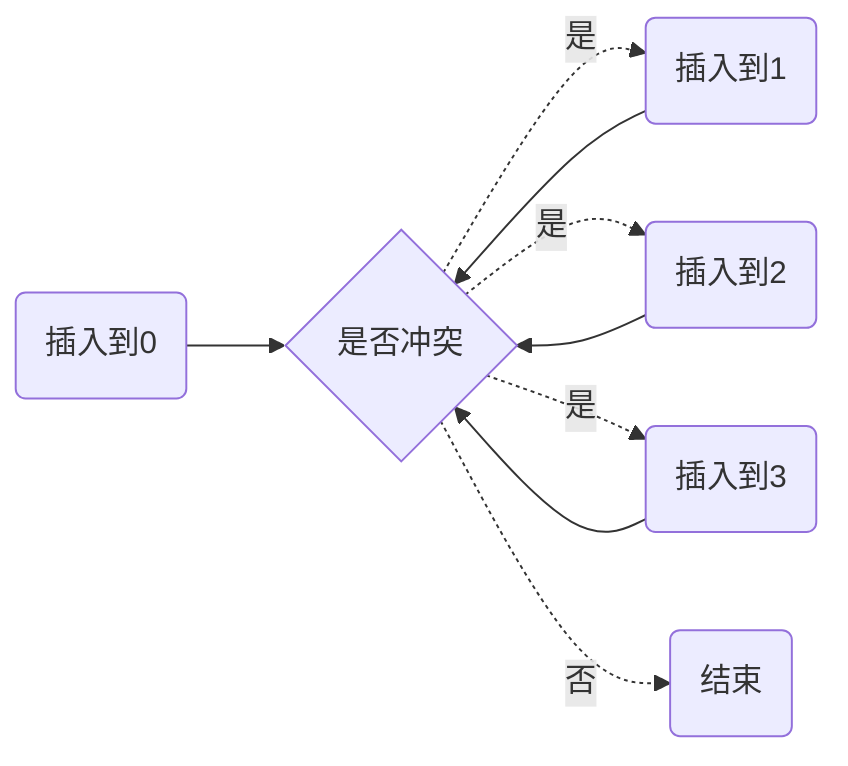
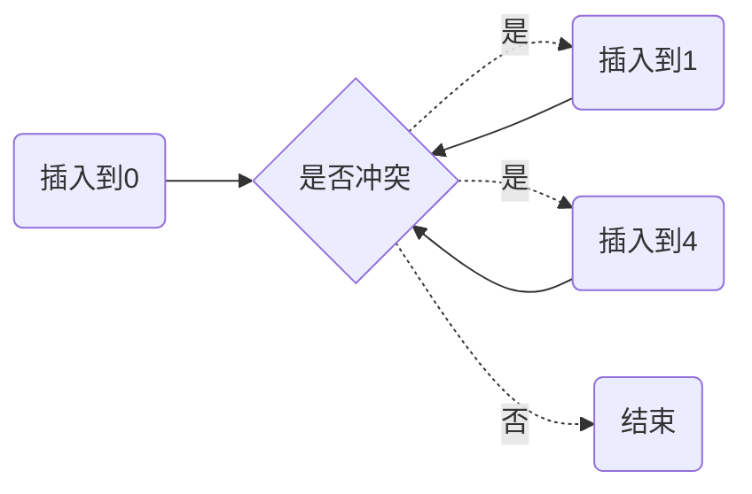

[TOC]

# hash碰撞解决方法

- 线性探测

  插入时，如果检测到有冲突，即向左/右移动一位再次检测冲突
  
  例:

| 0    | 1    | 2    | 3    | 4    | 5    | 6    | 7    | 8    | 9    |
| ---- | ---- | ---- | ---- | ---- | ---- | ---- | ---- | ---- | ---- |
| 49   | 18   | 29   |      |      |      |      |      | 38   | 79   |

- 二次探测

	插入时发生碰撞向左/右移动$H+1^2$,$H+2^2$,$H+3^2$..个位置

	例：

| 0    | 1    | 2    | 3    | 4    | 5    | 6    | 7    | 8    | 9    |
| ---- | ---- | ---- | ---- | ---- | ---- | ---- | ---- | ---- | ---- |
| 49   | 18   | 29   |      |      |      |      |      | 38   | 79   |

- 开链法

  插入时发生碰撞，把发生碰撞的值存到链表中

  例：

  | 0    | 1    | 2    | 3    | 4    | 5    | 6    | 7    | 8    | 9    |
  | ---- | ---- | ---- | ---- | ---- | ---- | ---- | ---- | ---- | ---- |
  | 链表 | 链表 | 链表 |      |      |      |      |      | 链表 | 链表 |
	| 49   | 18   | 29   |      |      |      |      |      | 38   | 79   |
	|      |      |      |      |      |      |      |      |      |      |

插入 32到1

与18发生冲突

| 0    | 1    | 2    | 3    | 4    | 5    | 6    | 7    | 8    | 9    |
| ---- | ---- | ---- | ---- | ---- | ---- | ---- | ---- | ---- | ---- |
| 链表 | 链表 | 链表 |      |      |      |      |      | 链表 | 链表 |
| 49   | 18   | 29   |      |      |      |      |      | 38   | 79   |
|      | 32   |      |      |      |      |      |      |      |      |

